# 王永春《小学数学教材一本通》(OCR)

> 本文件由 extract_raw.py 生成，零删除原始版本，仅供标题层级识别使用

[图片描述：装饰插图：浅蓝色背景，左上角浅蓝色数学符号（加号、乘号、除号），中央绘有圆形内接正方形的几何图案，为书籍封面/章节装饰，无直接数学教学内容。]
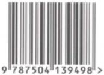

[图片描述：【待人工审查】小型图片碎片（亮度187），疑为装饰图标或数学符号（29x31像素）。章节：王永春《小学数学教材一本通》(OCR)。]

王永春编著

我们已经进入智能化、数字化、大数据时代，机器人已经在生活和工作中广泛应用。机器人的优势是：记忆存储功能强大、大数据快速计算、自动化机械操作、逐步升级的学习能力  等。我们每个学生接受教育的目标是成为德智体美劳全面发展的社会主义建设者和接班  人，但是由于升学考试的压力，很多学生不得不把接受素质教育的过程主要变成感知、记忆、 理解和掌握知识的学习过程，大家的头脑里装的主要是“双基”(基础知识、基本技能),主要  为了应对升学考试，其不利的一面是导致很多学生缺乏创新精神、解决实际问题和可持续发展的能力。
为了中华民族的伟大复兴，为了个人的全面发展，我们需要在学校接受多年的教育，同时务必思考一个超越教育的基本问题：未来的人与机器人的比较优势是什么?随着人工智能的发展，人的优势不再是机械的记忆、模仿、操作。那些能够让人比机器人更有优势或者价值的知识，能够培养人的创新精神、解决实际问题能力的知识，才是更需要学习的知识。
基于以上分析，我们需要进一步思考：在小学需要学习6年数学，我们能学到什么?我们将带着什么样的数学头脑进入中学数学的学习?仅仅是一些死记硬背的乘法口诀、熟练的  四则运算、用算术方法解决问题和一些面积体积公式吗?仅仅带着这样的头脑去学习初中数学是远远不够的，我们还需要学习这些知识背后的知识；这些知识不仅仅是一个个知识点的事实与概念本身，更重要的是这些知识的原理、性质、规律、关系、结构、方法、思想、价值、 应用等，更能够体现知识的本质和价值。随着时代的快速发展，知识总量必然越来越多，人们已经无法全部学习和记忆，势必有所取舍，我们应学习最基本的知识，学习能够帮助我们掌握知识的知识。另外，大多数同学从一年级开始按部就班地在小学学习六年、初中和高中各学习三年，一共需要学习12年数学，然后参加高考。我们几乎天天学习数学，每天学习一个又一个具体的知识点，可是我们有没有跳出来思考过：学习了这么多的数学，学习了这么长时间，可是为什么数学成绩还是不够理想呢?到底数学是什么?应怎么学习数学才能学

[图片描述：【待人工审查】浅色/白色细长条带（1164x61像素）。章节：王永春《小学数学教材一本通》(OCR)。]

好呢?
综上所述，我们给喜欢数学、想把数学学好的同学编写了三本自学读本：《小学数学教材一本通》《小学生与数学思想方法》《一本书自学初中数学》,这三本书循序渐进，希望能够帮助大家尽快理解数学本质，掌握数学思想方法和学习方法，实现思维进阶，为中学数学及理科的学习打下良好基础。
我从2016年开始主持小学数学新教材的研究和编写，于2019年开始陆续出版一套《小学数学生本学材》,此套书体现了新教材落实数学核心素养目标的编写思路、内容呈现、知识结构、数学思想方法。《小学数学教材一本通》是在借鉴《小学数学生本学材》成果的基础上， 把小学数学12册教材的主要内容浓缩成精华，整合成一本书，跳出教材整体看数学，从核心  概念出发，以模块的形式整合内容，加强知识间的关联，形成关系和结构，提炼数学思想方  法，能够应用数学的思想方法分析和解决问题，逐步学会思考、学会学习、学会自学；基本达  成核心素养目标，达到小学数学入门水平。希望对数学感兴趣、有自学能力的同学可以从三  年级开始阅读和学习本书，如果一次不能读懂，就接着继续学习，不断重复学习，逐步理解数  学本质，掌握学习方法和思考方法。争取能在五年级掌握本书的内容，那么接下来可以自学  第二本书《小学生与数学思想方法》,该书是在《小学数学与数学思想方法》的基础上，对数学  思想方法进行简单介绍，编写一些例题和习题，便于学生掌握数学思想方法，使其通过学习可以在数学结构方面更加综合与拓展，在数学思维和思想方法方面能够抽象地、有逻辑地思  考，在综合运用数学知识和思想方法解决问题的能力上有所提高，初步具备自学初中数学的  能力。这时就可以自学第三本书《一本书自学初中数学》,该书是在参考初中数学教材及读  本的基础上，进行主题模块化整合，加强结构化，帮助同学们理解数学本质，初步掌握初中数  学的基本内容和思想方法，提高核心素养。如果能在初二上学期自学完成初中数学内容，就  可以继续自学高中数学教材。我们衷心希望有一部分同学能够从三年级开始坚持自学到高  中，坚持10年做好这件事，一定会受益终身。
《小学数学教材一本通》共分为七章，第一章是小学数学与学习方法，包括如何认识小学数学、理解小学数学的本质，怎样学习小学数学、掌握学习数学的方法；第二章是数与量的认识，内容包括自然数、整数、分数、小数、负数、百分数、时间、质量和货币，以计数单位为核心概念，感悟数的意义的一致性，以及数与加法运算的一致性；第三章是运算，感悟加减乘除四则运算的概念、关系和结构，理解运算律、运算性质和运算法则，掌握四则运算模型的应用； 第四章是数量关系，应用四则运算模型解决问题，用字母表示数量之间的关系，感悟变量之间的依存关系；第五章是图形与几何，认识一些常见的平面图形和立体图形，理解图形度量

[图片描述：【待人工审查】扫描区域近白（亮度240/255），未见有效内容，可能是版面空白区、分隔页或OCR空白段。章节：王永春《小学数学教材一本通》(OCR)。]

的一致性，感悟图形的运动和位置；第六章是统计与概率，感悟大数据时代具有数据分析意识的意义和价值，以及事件发生的随机性；第七章是数学广角，把教材中关于数学广角的知识集中编排、系统梳理、加强关联、适当拓展提高。
这三本书主要是给对数学感兴趣、有自学意愿的三年级及以上的小学生编写的，如果年轻教师和学生家长能从中有所启发，从而更好地指导学生学习数学，我将得到更大的欣慰。 我虽然从事了三十多年的小学数学教材研究和编写工作，但写作这三本书仍有很大挑战，若有不妥甚至错误之处，请读者批评指正。
需要特别说明的是，《小学数学教材一本通》是按照内容模块编写的，与小学数学教材按照年级推进的逻辑关系不同，按照模块的方式编写会涉及不同领域知识间的衔接，所以不能完全按照模块方式学习，有时需要跨模块交叉学习。例如，整数、小数、分数等的认识需要借助长度、质量、面积等具体的量来学习；正比例关系需要用图象表示，而认识图象需要先学习图形的位置；等等。
由衷感谢华东师范大学出版社长期以来对我的信任和支持，感谢责任编辑的辛苦审校工作。

[图片描述：【待人工审查】小图（167x76像素），浅色图形（可能为几何图形线框、空白方格或浅色插图）。章节：王永春《小学数学教材一本通》(OCR)。上下文：「《小学数学教材一本通》共分为七章，第一章是小学数学与学习方法，包括如何认识小学数学、理解小学数学的本质，怎样学习小学数学、掌握学习数学的方法；第二章是数与量的认识，内容包括自然数、整数、分数、小数、负数、百分数、时间、质量和货币，以计数单位」]

2024年5月

[图片描述：装饰图标：橙色背景，中央有蓝色五角星和绶带图案，为章节荣誉/激励图标，无文字教学内容。]

## 第一章 小学数学与学习方法

### 第一节 小学数学是什么

[图片描述：【待人工审查】扫描区域近白（亮度241/255），未见有效内容，可能是版面空白区、分隔页或OCR空白段。章节：第一节 小学数学是什么。]

[图片描述：【待人工审查】近白色极小图，疑为空白填写框碎片（43x49像素）。章节：第一节 小学数学是什么。]

[图片描述：装饰横幅：深蓝色宽横幅，左侧橙色方块内有书本小图标，整体为章节标题装饰栏，无文字教学内容。]

[图片描述：【待人工审查】浅色/白色细长条带（939x66像素）。章节：第一节 小学数学是什么。]
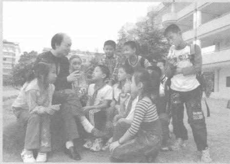

[图片描述：【待人工审查】极深色小图，疑为实心圆点/黑色符号（948x4像素）。章节：第一节 小学数学是什么。]

[图片描述：【待人工审查】极深色小图，疑为实心圆点/黑色符号（946x2像素）。章节：第一节 小学数学是什么。]

我们希望三年级及以上的同学开始研读本书，那么大家已经学习了几年的数学了，你们思考过一个问题吗，即数学是什么?或者什么是数学?希望能够自学数学的同学们，现在以此开启小学数学的自学之旅吧。

[图片描述：装饰图标：红色圆形，内含白色横线（减号），疑为提示/禁止类装饰图标。]

小学数学历史简介

人类社会早在石器时代就建立了较小的数的观念和图形的观念，人们在狩猎、耕种、养殖、饮食、起居等活动中，都会涉及计数、绘制几何图形和图案。如有些陶器有三个足，有些陶器上刻绘了数量不同的各种美丽图案， 一个氏族家庭圈养家畜的数量、每日消耗食物的数量，等等。这些就是人类社会早期的数学萌芽。随着社会的发展，对事物数量度量的需求不断扩大和精细化，人们研究的数的范围也不断扩大， 一方面是整数的扩大，另一方面是数域的扩充，因而逐步产生了分数、小数等。生活中制作各种器物和工具时，人们需要进一步研究图形的性质和度量。所以早期的数学主要的研究对象是数和图形。
小学数学课程的主体部分是算术，还包括少部分几何、统计等内容。在我国的小学数学课程历史上，从清朝末年到20世纪60年代，小学数学课程和教材一直被称为“算术”。 1978年的小学数学课程和教材增加了简易方程等内容，才把算术改为数学，与中学数学课  程名称一致。概括地说，算术就是研究数的性质、数的运算、图形的面积和体积等知识的  一个最古老的数学分支。小学阶段数的认识与运算主要包括整数、分数、小数、百分数及  四则运算。

[图片描述：【待人工审查】小图（102x64像素），浅色图形（可能为几何图形线框、空白方格或浅色插图）。章节：第一节 小学数学是什么。上下文：「### 第一节 小学数学是什么
我们希望三年级及以上的同学开始研读本书，那么大家已经学习了几年的数学了，你们思考过一个问题吗，即数学是什么?或者什么是数学?希望能够自学数学的同学们，现在以此开启小学数学的自学之旅吧。
小学数学历史简介
人类」]

( 一 )数与代数的历史
1. 数的历史
(1)十进制计数法的萌芽阶段
古代人类在日常活动中需要对实物的“多少”进行记录，例如，一只羊、一头牛、一个人， 两只兔、两只鸟、两个人，慢慢地产生了1、2、3等自然数的概念，这是一个逐步抽象的过程。 虽然我们今天看1、2、3这些数字非常简单，但是对于古代人类或者今天的幼儿来说，它们  仍然是非常抽象的。古代人类早期的计(记)数方法有多种，比较公认的有实物计数、结绳计  数和刻划计数，刻划计数已经有符号的抽象特征了。开始时的刻划计数是一一对应的，即一  道刻痕代表数目1,两道刻痕代表数目2。随着社会发展的需要，产生了以群计数的刻划数字  符号，即一个数字符号表示多个数目，这是计数符号的进一步抽象。例如“×”表示五，“A”    表示六，“+”表示七，“)(”表示八，“|”表示十，“| I”表示二十 ， 等等 。 这个时期的计数还没有  形成系统，处于十进制的萌芽阶段。
(2)初级十进制计数系统
社会的发展对计数有了更大的需求，我国逐步从刻划符号演变成商朝甲骨文中的数字符号，这些计数单位符号包括基本单位： 一 、十、百、千、万，以及另几个基本单位：几、几十、几百、几千和几万(见图)。每个基本单位的个数不超过9个，达到10个就用更大的基本单位， 称为满十进一 ，所以是十进制。
[OCR乱码，原为图示内容：= 三  Z∩ 十 ) ( 2]

[OCR乱码，原为图示内容：IUW     四   大  亦  千   )(Jt]
102030       40    50   60    70   80   90

100  200300   400500    600    800  900

100020003000400050006000            7000   8000   9000

10000  200003000040000

[图片描述：【待人工审查】小图（224x69像素），浅色图形（可能为几何图形线框、空白方格或浅色插图）。章节：第一节 小学数学是什么。上下文：「[OCR乱码，原为图示内容：IUW     四   大  亦  千   )(Jt]
102030       40    50   60    70   80   90
100  200300   400500    600    800 」]

这个计数法迈出了十进制计数系统的第一步，这个计数系统只有计数单位符号，大数的表示是用这些计数单位进行累加，但是还没有数位的概念。
例如，19表示为|   ,258表示为画    土   ,90000表示为。
(3)十进制计数系统
到了春秋战国时期，随着商业和贸易的发展，对计数和计算的需求大大增加，包括简便、 灵活、快速地对大数目进行计数和计算等，利用甲骨刻划计数已经无法满足需要，逐步被算筹计数和计算取代。算筹一般用竹棍、木棍、骨棍等制作，用这些算筹摆出各种计数符号，进行计数和计算。这里需要特别强调的是，用算筹摆出的数，不再是简单地仅仅用算筹符号代替甲骨文符号，而是迈出了关键的一步，即发明了十进制的数位，这样就固定了每一个计数单位的位置；就是我们今天常用的个(一)位、十位、百位、千位、万位……每一个数位对应一个相应的计数单位：个(一)、十、百、千、万……有了十进制的数位，相邻两个计数单位是10倍关系，满十进一，从此不再需要10及以上的这些计数单位的数字符号，只需要0—9这10个  数字符号就够了。需要表示几个十就把数字几摆在十位上，几个百就把数字几摆在百位上， 以此类推，这样就减少了符号的使用，大大提高了效率。例如，已经发现的甲骨文表示几个  一 、几个十、几个百、几个千、几个万的计数单位符号共有39个，有了算筹之后就缩减到1—9 这九个数字符号。这是我国算术发展史上的一个里程碑，我们的祖先用了大约800年的时间才从初级十进制计数系统发展到真正的十进制计数系统，是世界上最早发明使用十进制计数系统的国家。
当时算筹不方便摆出数字0,哪个数位上是0,就不摆算筹，用空位表示0。算筹数字符号有纵横两种，见下图。

为什么要用纵横两种算筹符号呢?是为了避免相邻数字混淆，便于区分哪些数位有0。 算筹计数约定一个规则：纵横交错，即个位、百位、万位……摆纵式数字，十位、千位……摆横式数字。例如，符号“I”表示1,而符号“—”表示10,“| | |≡Ⅲ”       则表示10234,而不会误

[图片描述：【待人工审查】浅色/白色细长条带（1156x44像素）。章节：第一节 小学数学是什么。]

认为是1234。
在漫长的计数系统演变过程中，很多国家都先后发明了自己的数字符号和计数系统，印度人在公元3世纪发明了自己的数字符号。大约在8世纪这些符号传入阿拉伯国家，经过修改完善，大约在12世纪，又由阿拉伯人传入欧洲，欧洲人称其为阿拉伯数字。阿拉伯数字大约在13—14世纪传入我国，在清朝末年才正式在教材中推广使用。阿拉伯数字逐步成为全世界通用的数字。
(4)分数的历史
自然数能够满足人类社会早期对事物数量不断增大的度量需要，但是还不够精细化；随着社会的发展，人们对事物精细化度量的需要，分数随之产生了。分数是在自然数的基础上产生的，至少有4000多年的历史。从文献来看，公元前2000年古巴比伦的泥板中出现了分

[图片描述：【待人工审查】小型图片碎片（亮度235），疑为装饰图标或数学符号（43x50像素）。章节：第一节 小学数学是什么。]

[图片描述：【待人工审查】小图（100x50像素），彩色图片（可能为插图、实物照片或数学图形）。章节：第一节 小学数学是什么。上下文：「为什么要用纵横两种算筹符号呢?是为了避免相邻数字混淆，便于区分哪些数位有0。 算筹计数约定一个规则：纵横交错，即个位、百位、万位……摆纵式数字，十位、千位……摆横式数字。例如，符号“I”表示1,而符号“—”表示10,“| | |≡Ⅲ”   」]

数；公元前1650年古埃及的莱因德的纸草书中记载了分数，除 ,其他都是分子为1的单  位分数，如等，其他分数采用这些单位分数累加的方式表达。我国在西周(公元前 1046年开始)时期周天子分封各邦国土地时，根据公侯伯子男五个爵位等级分配各邦国土地的面积大小。《周礼》(中华书局，2014年2月第1版，第222页)中记载：公爵的封地，疆界是五百里见方，公爵可收取租税的土地占一半；侯爵的封地，疆界是四百里见方，侯爵可收取租税的土地占三分之一；伯爵的封地，疆界是三百里见方，伯爵可收取租税的土地占三分之一； 子爵的封地，疆界是二百里见方，子爵可收取租税的土地占四分之一；男爵的封地，疆界是一百里见方，男爵可收取租税的土地占四分之一。也就是说，各邦国自己收取租税的土地只占  几分之一，而其余土地的租税归天子所有。

[图片描述：【待人工审查】小图（174x50像素），浅色图形（可能为几何图形线框、空白方格或浅色插图）。章节：第一节 小学数学是什么。上下文：「认为是1234。
在漫长的计数系统演变过程中，很多国家都先后发明了自己的数字符号和计数系统，印度人在公元3世纪发明了自己的数字符号。大约在8世纪这些符号传入阿拉伯国家，经过修改完善，大约在12世纪，又由阿拉伯人传入欧洲，欧洲人称其为阿拉伯数」]

[图片描述：【待人工审查】小型图片碎片（亮度230），疑为装饰图标或数学符号（20x50像素）。章节：第一节 小学数学是什么。]

[图片描述：【待人工审查】小型图片碎片（亮度231），疑为装饰图标或数学符号（22x48像素）。章节：第一节 小学数学是什么。]

[图片描述：【待人工审查】小型图片碎片（亮度231），疑为装饰图标或数学符号（20x50像素）。章节：第一节 小学数学是什么。]

我国西周时期的分数用语言表达，例如半表示,四之一表示。春秋战国时期，当分数表达具体的量时，单位名称写在分母与分子之间，同时在单位名称前写“分”, 例如三分寸之一表示寸，四分步之一表示步，接近现在的表示方法。当分数不表达具体

[图片描述：【待人工审查】小型图片碎片（亮度233），疑为装饰图标或数学符号（25x50像素）。章节：第一节 小学数学是什么。]

[图片描述：【待人工审查】小型图片碎片（亮度230），疑为装饰图标或数学符号（20x50像素）。章节：第一节 小学数学是什么。]

的量时，与现在的表达方式一样，例如三分之一表示 ,四分之一表示  当筹算出现以后， 分数的表达进入了符号阶段，由于分数与除法的天然密切关系，当整数除法不能整除时，精确的结果可以用分数表达。
(5)小数的历史
小数的产生虽然比分数晚，但是小数的思想早就伴随着十进制度量单位产生了。我国

[图片描述：【待人工审查】浅色/白色细长条带（1167x67像素）。章节：第一节 小学数学是什么。]

是最早使用十进制计数法的国家，包括度量衡的部分单位也采用十进制，例如，我国古代的  数学著作《孙子算经》和《九章算术》中的长度单位除了丈、尺、寸，还有更小的单位分、厘、毫、 丝、忽、微等，用这些十进制单位表示的数量，如果以寸为最小的整数单位，那么更小的单位分、厘、毫、丝、忽、微等，就是小数长度单位了。这些小数长度单位实际上是分别以10、100、

[图片描述：【待人工审查】小图（104x52像素），浅色图形（可能为几何图形线框、空白方格或浅色插图）。章节：第一节 小学数学是什么。上下文：「我国西周时期的分数用语言表达，例如半表示,四之一表示。春秋战国时期，当分数表达具体的量时，单位名称写在分母与分子之间，同时在单位名称前写“分”, 例如三分寸之一表示寸，四分步之一表示步，接近现在的表示方法。当分数不表达具体
的量时，与现在的」]

100- ·分母的十进分数(单位：寸),当时称为微数，也就是现在的小数，例如1   这两部数学著作成书于1～4世纪，是对前人知识的总结，所以小数的历史应接近2000年了。因此，从历史和产生的角度看，最初的小数是十进分数(特殊的分数)的另一种表达方  式。因为自然数和整数采用十进制计数法，所以十进分数改为小数的表示方式不但简单了， 而且与整数统一成一个十进制计数系统，结构上具有一致性，方便理解其性质和进行计算。
随着现代物理学的发展，需要更加小的度量单位来表达微观粒子的大小，如芯片的制程用纳米表达，一个氢原子的半径大约为50皮米，一个质子的有效半径大约为1飞米。
我国古代用算筹表示数和进行计算，早期的小数表示，用文字标注个位，个位右边的数

[图片描述：【待人工审查】小图（113x64像素），浅色图形（可能为几何图形线框、空白方格或浅色插图）。章节：第一节 小学数学是什么。上下文：「小数的产生虽然比分数晚，但是小数的思想早就伴随着十进制度量单位产生了。我国
是最早使用十进制计数法的国家，包括度量衡的部分单位也采用十进制，例如，我国古代的  数学著作《孙子算经》和《九章算术》中的长度单位除了丈、尺、寸，还有更小的单位分、」]

位是小数数位，例如6.35寸表示为
13世纪，小数的应用越来越广泛，人们采取把整数部分和小数部分错开一行分开表示小数的方法，其中0用□表示。例如，102345.6789表示为

[图片描述：【待人工审查】小图（172x51像素），浅色图形（可能为几何图形线框、空白方格或浅色插图）。章节：第一节 小学数学是什么。上下文：「100- ·分母的十进分数(单位：寸),当时称为微数，也就是现在的小数，例如1   这两部数学著作成书于1～4世纪，是对前人知识的总结，所以小数的历史应接近2000年了。因此，从历史和产生的角度看，最初的小数是十进分数(特殊的分数)的另一种」]

一  □  =  Ⅲ    Ⅲ

16和17世纪，欧洲开始广泛应用小数，在用阿拉伯数字表示小数时，把小数和整数的写法统一，把“小数点”作为整数和小数部分的分界，有的国家用逗号“,”,有的国家用小圆点“.”。
(6)百分数的历史
一看到百分数这个名词，顾名思义，就是分母为100的分数，这样的解读说明百分数是分  数，但又是特殊的分数。但是这样的解释还不够到位，没有体现百分数的本质。我们知道， 小学学习的各种数有很多共同特点，其中之一是分数与整数、小数一样，有两方面的意义：既

[图片描述：【待人工审查】小型图片碎片（亮度233），疑为装饰图标或数学符号（24x56像素）。章节：第一节 小学数学是什么。]

[图片描述：【待人工审查】小型图片碎片（亮度238），疑为装饰图标或数学符号（35x49像素）。章节：第一节 小学数学是什么。]

能表达事物数量的多少，例如，1千克面粉、0.5千克糖、千克盐；也能表达两个数(量)之间的倍数关系，例如，小明的铅笔的数量是小东的4倍，那么小东的铅笔的数量就是小明的

[图片描述：【待人工审查】小型图片碎片（亮度235），疑为装饰图标或数学符号（31x51像素）。章节：第一节 小学数学是什么。]

小明的体重是小东的1.5倍，那么小东的体重就是小明的百分数来源于分数，但是百分

[图片描述：【待人工审查】浅色/白色细长条带（1176x68像素）。章节：第一节 小学数学是什么。]

数只保留了分数中表达两个数(量)之间的倍数关系的意义，也就是说，百分数不表达具体的数量的多少，百分数后面不能带表达数量的单位名称，只表达两个数(量)之间的倍数关系。
百分数作为特殊的分数，其应用可以追溯至宋朝。随着社会、经济、商业、贸易等的发  展，借贷、折扣、盈亏、税赋等的比率由过去的一般分数的表达，逐步走向精细化，这个时期也  是小数广泛应用的时期，所以当时的比率写成小数的形式，而不是分数的形式，例如百分之  一写成0.01,千分之一写成0.001,相当于现在的百分率、千分率。虽然当时用小数表达的百  分率逐步应用，但是还没有发展到百分率从一般分数或者小数中独立出来的程度，所以还没  有百分数这个名称或者概念，那么百分数是什么时候开始独立命名的呢?根据有关文献记  载，从清朝末年(约1905年)到1951年的算术课本，逐步把百分率从分数和小数中独立出来。 清朝时期的算术课本以课时为独立单位，用若干课时集中编写百分率的意义及应用，当时概  念名称为分厘法：分表示百分之十，厘表示百分之一，并使用百分号“%”。到了民国时期，算  术课本以章或者单元为独立单位，百分率作为有关独立单元而存在，分厘法改为百分法，但  是仍然用分厘法解释百分法的意义，分表示百分之十，厘表示百分之一。到了1951年，新中国的算术课本的单元标题为百分法，但是正文中的概念名称已经改为百分数。1952年出版  的算术课本中，单元标题和正文统一改为百分数，沿用至今。百分数曾经被称为分厘法、百分法、百分率、百分比，现在百分率和百分比还在使用。
2. 计算的历史
(1)自然数与加法
小学数学的计算主要是关于整数、小数和分数的加、减、乘、除，称之为四则计算。首先我们来看加法，大家对加法似乎都耳熟能详，幼儿园的小朋友都会计算1+1=2,2+1=3,通  过数手指、小方块、小棒等就能够算出结果，这符合儿童的认知规律，也符合我们原始社会的  祖先的认知规律。也就是说，原始的加法是对一些具体事物的数量的度量，例如，2只羊加1 只羊等于3只羊，2个鸡蛋加1个鸡蛋等于3个鸡蛋，等等；然后再脱离具体事物，也就是说， 无论什么东西，只要是两个加一个，结果就是三个，抽象成数(字)符号的表达，即2+1=3。 我们回顾一下自然数的产生过程，从1开始，任何1个事物都用一表示，然后一个一个地增  大，2个事物用二表示，3个事物用三表示。从表面上看，一、二、三各自独立，各有自己的符  号和数量表达，但仔细认真一想，一、二、三是密切关联的，二和三不是凭空产生的，是先有一  再有二，数是一个一个地增大的。也就是说，自然数与加法就像一对双胞胎相伴而生， 一加  一产生了二，二加一产生了三，即1+1=2,2+1=3。后来为了建立完备的数的体系，把0也纳入了自然数这个大家庭，于是自然数从0开始，0+1=1。

[图片描述：【待人工审查】浅色/白色细长条带（1038x68像素）。章节：第一节 小学数学是什么。]

自然数虽然是一个一个地增大的，但随着社会的发展，需要很多自然数对各种数量进行表达，特别是大数的简洁表达成为需要，如果每个大数都单独搞一个符号，那就太多、太麻烦了。于是先产生了若干个大的计数单位，用少部分计数单位的组合累加表示更大的数，例如

星(笔
表示9万，这样就不必每个数都有各自的计数单位符号。后来随着社会的进一步发展，传统的表达方式不方便了，于是经过了大约800年的时间，到了春秋战国时期，又产生
了数位，于是有了十进制计数法的完整体系，用算筹进行数的表达和计算。计算时，只要遵  循：两个或者多个数相加，把相同单位的数相加，就能够得到正确结果。现在我们可以发现： 自然数的产生、表达与自然数加法具有密切的联系和一致性。
(2)减法
减法的产生也是自然的。我们人类的祖先每天日出而作、日落而息，每天都要通过劳动或者狩猎得到食物和其他物资，来满足每日所需。也可以说，度量劳动和狩猎所得的食物和物资的多少，用的是加法；度量每天消耗多少食物和物资，或者剩余多少，用的是减法。例如，上午捕获2只羊，下午捕获3只羊， 一天一共捕获5只羊(2+3=5);一天捕获5只羊，吃了2只羊，还剩3只羊(5—2=3)。所以儿童最容易理解的减法是从总量中去掉一部分，求还  剩多少，这与最原始的减法含义是一致的。后来为了加强四则运算的关联和结构的完备性， 减法又增加了一个含义：减法是加法的逆运算，即已知和与其中一个加数，求另一个加数的运算，就是减法。通过上面捕获羊的故事和加减法计算可以感悟减法这个含义，及加减法之  间的关系。一天一共捕获5只羊，上午捕获2只羊，其他的是下午捕获的，下午捕获几只羊? (5—2=3)
(3)乘法
从乘法的起源来说，它是从特殊的加法演变而来的，即若干个相同的数相加，特别是相同的加数比较多的时候，加法计算就比较麻烦，人们便把这样的加法总结出规律，逐步编制出乘法口诀。有了十进制计数法，大数的乘法便转化为乘法口诀的计算，大大地简化了计算过程。例如，9+9=18,9+9+9= 27,体现不出加法的繁琐，但是如果有900个9或9000 个9相加，加起来就非常麻烦了，这时候乘法的简洁性就体现出来了，一句“九九八十一”,就把结果口算出来了，9×900=8100,9×9000=81000,与100以内的口算加法难度相当。
关于乘法出现的时间，目前能够找到的文献记录是乘法口诀，但是实际上乘法的出现应  该早于乘法口诀。我国周朝时期的军队，实行伍、两、卒、旅、师、军的六级编制，5人为一伍、 25人为一两、100人为一卒、500人为一旅、2500人为一师、12500人为一军。这些人数，5、

[图片描述：【待人工审查】小图（93x38像素），浅色图形（可能为几何图形线框、空白方格或浅色插图）。章节：第一节 小学数学是什么。上下文：「(2)减法
减法的产生也是自然的。我们人类的祖先每天日出而作、日落而息，每天都要通过劳动或者狩猎得到食物和其他物资，来满足每日所需。也可以说，度量劳动和狩猎所得的食物和物资的多少，用的是加法；度量每天消耗多少食物和物资，或者剩余多少，用的是」]

25、100、500、2500、12500,除了100与25是4倍关系，其他相邻两数都是5倍关系，这实际上蕴含着乘法。类似的例子有很多，这是早期乘法的萌芽。
关于乘法口诀的文献资料，在《管子》(成书于战国，但是记录的事情应早于战国)等古籍中有零散的乘法口诀的记载，例如，“三七二十一，七七四十九”等。系统的乘法口诀，被称为 “九九”,是因为古代的乘法口诀是从“九九八十一”开始，由大到小排序，至“二二得四”止。 《吕氏春秋》等古籍中记载了一个故事：齐桓公招贤纳士，但是一直没有人来，名为东野这个地方有人以熟记“九九”而前来晋见，齐桓公笑曰：会“九九”就能作为贤士来见我吗?来人答曰：会“九九”确实算不上贤士，但是您如果还能以礼相待，还怕比我更有才能的人不来吗? 齐桓公认为他说得有道理，于是就款待了他。果不其然， 一个月后，四面八方的贤人志士接  踵而至。这个故事说明，在春秋时期，会乘法口诀的人越来越多了，已经不是稀缺人才了。
(4)除法
从除法的起源来说，可能有两个方面： 一是与分数的产生密不可分，例如上面介绍的西周时期周天子分封各国土地时，不但使用了分数，而且为了得到具体的测量结果，还可能有整数除法、乘法甚至分数乘法计算。例如，侯爵的封地，疆界是四百里见方，侯爵可收取租税  的土地占三分之一；这里的四百里的三分之一，测量的时候可能精确到更小的单位——步或尺，那么就需要除法计算(400÷3)。二是平均分配物体时，需要除法计算，西周时期的邦和各国就有严格详细的财物收支制度，每年的财物收入情况往往用加法和乘法计算，对财物的  分配和支取情况用减法计算，当大数目的财物需要平均分配时，可能就用除法计算，这样的  除法就是特殊的减法，“除”这个字在古代也有减的含义。另外，因为减法是加法的逆运算， 那么特殊的减法(除法)就是特殊的加法(乘法)的逆运算，所以除法是乘法的逆运算。也就是说，在计算除法时，可以反过来思考，用乘法口诀计算除法。例如，邦和各国给军队和各级政府分配财物时，应按照级别平均分配。春秋战国时期，用算筹进行除法计算，被除数(当时  叫实)列在中间，除数(当时叫法)列在下面，商列在上面；除的过程中每次的余数继续列在被

[图片描述：【待人工审查】小型图片碎片（亮度238），疑为装饰图标或数学符号（43x50像素）。章节：第一节 小学数学是什么。]

除数的位置。例如，25除以6的商是 ,计算过程如下。

[图片描述：【待人工审查】扫描区域近白（亮度246/255），未见有效内容，可能是版面空白区、分隔页或OCR空白段。章节：第一节 小学数学是什么。]

3. 代数的历史
前文说过，小学数学的主要内容是算术，这也是人类早期的数学。算术运算的特点是只对已知数进行运算。随着社会的发展，对数学提出了更高的要求，仅仅对已知数进行运算已  经不能完全满足需要了，于是就引入了未知数，并且未知数与已知数地位一样，能够参与运  算，根据所要解决问题的数量相等关系列出等式，这样的等式称为方程。然后根据等式的性  质进行运算，运算的目标是把未知数“摘”出来，不跟其他数用乘除法写在一起，这样就可以  求出未知数的值，这个过程就是解方程。于是这样的知识比传统的算术有更大的作用，应用  越来越广泛，经过不断扩充，逐步从算术中独立出来，产生了一门新的数学分支，称为代数。 根据文献记载，方程已有3000多年的历史了；在莱因德纸草书中记载了一元一次方程问题， 古巴比伦的泥板中记载了二元一次方程组的具体问题，我国《九章算术》的第八章为“方程”, 系统研究了方程组的解法。我们通过一个例子进行对比，来理解算术和代数的联系和区别。
例    有三块正方形土地，大正方形土地的粮食产量是中正方形土地的2倍，中正
方形土地的粮食产量是小正方形土地的2倍，小正方形土地的粮食产量是
500 千克。这三块土地的粮食总产量是多少千克?

根据已知数量及数量之间的倍数关系，可以直接用算术方法求出三块土地的粮食总产量，列出的式子称为算式，即
500+500×2+(500×2)×2。

三块土地的粮食总产量是待解决的问题，也可以称为未知数，列出等式：
三块土地的粮食总产量=500+500×2+(500×2)×2。

经过计算，500+500×2+(500×2)×2=3500(千克)。
有三块正方形土地，大正方形土地的粮食产量是中正方形土地的2倍，中正
方形土地的粮食产量是小正方形土地的2倍。这三块土地的粮食总产量是
3500千克，小正方形土地的粮食产量是多少千克?

本例题与前一例题的数量相等关系是一致的，但是已知条件(已知数)和待解决问题(未知数)发生了变化；前一例题中，小正方形土地的粮食产量是已知数，它在本例题中变成了未知数。前一例题中，三块土地的粮食总产量是未知数，它在本例题中变成了已知数。古代的

[图片描述：【待人工审查】浅色/白色细长条带（954x35像素）。章节：。]

[图片描述：【待人工审查】小图（222x62像素），彩色图片（可能为插图、实物照片或数学图形）。章节：。上下文：「经过计算，500+500×2+(500×2)×2=3500(千克)。
有三块正方形土地，大正方形土地的粮食产量是中正方形土地的2倍，中正
方形土地的粮食产量是小正方形土地的2倍。这三块土地的粮食总产量是
3500千克，小正方形土地的粮食产量」]

未知数用文字表示，还没有用字母符号表示，我们用简短文字“小正方形”表示小正方形土地的粮食产量这个未知数，可以列出等式：
小正方形+小正方形×2+(小正方形×2)×2=3500。
我们根据运算性质和运算律，把等式化简：
小正方形×(1+2+4)=3500,
小正方形×7=3500。

[图片描述：【待人工审查】小型图片碎片（亮度232），疑为装饰图标或数学符号（20x49像素）。章节：。]

根据等式的性质，等式两边同时除以7或者乘 ,得

小正方形=500。
这个求未知数的过程，就是解方程。
我们知道，此题如果不用方程解决，也可以用算术方法解决，可以列式：
3500÷(1+2+4)。
实际上，可以这样列式的依据是根据分配律把“小正方形”作为公因数提取出来，得到小正方形×(1+2+4)=3500,再根据乘除法的关系得到算术方法的算式：3500÷(1+2+4)。
后来随着方程的逐步复杂化，用文字表示未知数比较麻烦，人们逐步采用x、y、z 等字母表示未知数，用a 、b 、c 等字母表示常数。如果用x  代替“小正方形”,那么这个方程就是我们现在熟悉的方程形式了。
通过以上对比，我们可以发现，代数方法的基本特质是：题目中有未知数，有表示未知数的符号，能够根据等量关系列出方程，未知数与已知数地位相同，未知数参与运算，计算的法则和运算律等均与算术方法一致。
随着解决问题的复杂化，未知数可以有多个，还可以有若干个相同的未知数相乘的形式 (一个未知数的乘方形式，称为高次方程),方程的优势会逐步体现出来，而算术方法就力不从心了。
(二)几何的历史
图形是人类早期数学的研究对象之一，自然界的各种实物以各种形状呈现，例如，很多  果实是近似球形的，烧制的陶器、青铜器、铁器等有球形、圆柱形、圆锥形、长方体等各种形状。人们经过对这些实物的不断比较和分析、抽象和概括，逐步形成了各种图形的概念，这有利于进一步研究各种图形的性质，再应用于生产器物、建造各种建筑、测量土地等。例如，

我国有大禹治水的故事，说明古代黄河经常发生河水泛滥，古埃及的尼罗河也经常发生河水泛滥，这会导致居民建筑受灾，农田被淹没，需要重新测量土地、勘测土地界线等，这都需要比较精确的图形测量知识，包括面积和体积的计算等。
随着社会的发展，对图形的性质与测量等知识的需求不断扩大，研究这个领域的成果不断扩充，逐步形成一门独立的数学分支，称为几何。
几何的发展历程，大体上有两个脉络：
一个脉络是以古希腊数学家欧几里得(约公元前330一公元前275)为代表写成的集前人成果为一体的著作《几何原本》,运用公理化思想和演绎推理方法，从比较抽象的数学定义、 公设和公理(基于经验的基本事实)出发，运用推理和计算推出系列结论，形成比较严密而系统的几何理论。该理论主要研究平面图形和立体图形的性质和测量，还包括用几何的方法  研究比例、数论、无理数等内容。现在的中小学教科书中几何的推理证明内容主要来自《几  何原本》。古希腊数学家和物理学家阿基米德(公元前287—公元前212)把圆周率的近似值  精确到3.14,弥补了《几何原本》的不足。
另一个脉络是以我国古代数学名著《九章算术》(大约成书于西汉与东汉之交，具体时间和作者有待考证)为代表的偏向于应用的数学，其中度量几何占了很大部分内容，主要研究平面图形的面积和周长，以及立体图形的体积和容积，并把这些测量知识广泛应用于生产和生活。现在我们强调数学要联系实际、解决实际问题，实际上我国古代的数学一直重视解决实际问题，并且处于世界领先地位。魏晋时期的数学家刘徽(约225年一约295年)对《九章算术》进行了系统的注释，其中一个创造性的贡献是重视演绎推理证明的方法，用“出入相补原理”(对三角形进行割补、转化成长方形来推导面积公式)证明了三角形的面积公式，另外一个特别突出的贡献是用割圆术求圆周率，把圆周率精确到3.1416,割圆术体现了无限细分逼近的极限思想、化圆为方的转化思想。
我国几何的历史非常悠久，大约成书于西汉时期的天文学和数学著作《周髀算经》,记载大禹治水时就应用了一个特殊直角三角形的性质“勾三股四弦五”,相传是商朝的商高证明了勾股定理。西周时期周天子分封土地，必然会涉及正方形、长方形等基本图形的面积计算。战国时期墨子所著《墨经》对圆的概念进行了精准概括“圆，一中同长也”,与我们现在常说的“到定点的距离等于定长的点的轨迹”一致。凡是关于圆的周长和面积等问题的解决， 必然涉及圆周率的计算，我国古代一直有“周三径一”的说法，就是取圆周率为3,但是近似值 3的误差比较大，随着社会的发展，需要越来越精确的圆周率数值。
那么是什么时候首次把圆周率取到比3更精确的呢?根据现有的文献推算，历史上西汉

[图片描述：【待人工审查】浅色/白色细长条带（1146x62像素）。章节：。]

和东汉之间有大约15年的断代，西汉末年的辅政大臣王莽篡位，于公元9年成立新朝。他命  天文学家刘歆修订度量衡，制造度量衡标准器具。其中最为著名的器具是王莽铜斛(hú),是测量体积和容积的器具，由斛、斗、升、合(gě)、瀹(yuè)这五个体积单位的容器组合而成，器具的中间是圆柱形容器，上为斛、下为斗，左右两边各有一耳，左为升、右上为合、右下为禽； 除了1合=2瀹，其他相邻单位之间的进率都是10。根据斛和斗的相关数据，可以逆向计算出圆周率为3.1547,这个数值比3的精确度大大提高。南北朝时期的数学家祖冲之在刘徽等前人成果的基础上，把圆周率的精确值提高到3.1415926和3.1415927之间，这个成果在世界上领先了一千年。
(三)统计与概率的历史
统计学从数学中分离出来，现在作为与数学并列的一级学科，经历了一个漫长的发展过程。可以说人类自从有了数学，其中就包含统计的成分，例如古代人类需要记录人口、土地、 财产、物资生产和消耗数量等，都要收集和记录数据，可以看作是统计活动。但是，如果这些  统计活动只是对数据进行加减乘除的四则运算，而没有进行数据分析、比较，以作出推断、决策，那么这更多的是算术，最多算是统计学的萌芽阶段。随着社会的发展，人类需要对一些  随机现象进行观察和数据分析，以便发现规律，例如人口数量的变化、人均寿命、气候变化、 土地的粮食产量等，通过普查或者抽样调查的方法收集和分析数据，帮助人们做出判断和决  策。这样的统计学与传统的数学已经有了明显的不同，它重点研究随机现象的统计规律，于  是统计学成为数学的一个分支学科或者专业。
我们知道，随机现象各种结果发生的可能性有大小，例如，抛硬币、掷骰子、摸球、抓阄等实验，体育比赛结果预测、天气预报、经济发展指标预测等，对各种事件发生的可能性大小的度量结果，就是概率。例如，掷一枚骰子，朝上数字为1～6中任意一个数字的可能性(概率)

[图片描述：【待人工审查】小型图片碎片（亮度223），疑为装饰图标或数学符号（31x49像素）。章节：。]

相等，都是   随着概率理论的不断发展，对随机现象统计规律的研究，逐步引入了演绎推理方法。

[图片描述：【待人工审查】小图（73x72像素），彩色图片（可能为插图、实物照片或数学图形）。章节：。上下文：「和东汉之间有大约15年的断代，西汉末年的辅政大臣王莽篡位，于公元9年成立新朝。他命  天文学家刘歆修订度量衡，制造度量衡标准器具。其中最为著名的器具是王莽铜斛(hú),是测量体积和容积的器具，由斛、斗、升、合(gě)、瀹(yuè)这五个体积」]

小学数学的本质

数学是研究数量关系和空间形式的科学。数学研究的数量关系和空间形式来源于生活实际，但是又逐步脱离实际。通过对实际的抽象形成数学的研究对象，继而进行符号表达、 运算、推理、建立数学模型等，形成数学的概念、命题、关系、结构、思想和方法，以帮助人们理

[图片描述：【待人工审查】浅色/白色细长条带（1133x58像素）。章节：。]
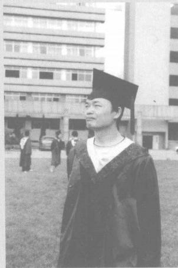

解和表达现实世界的关系和规律。数学已经应用到现代社会的各个方面，直接为社会创造  价值，推动科技进步和生产力的发展。著名数学家华罗庚先生对数学的价值和作用，曾经用一句话进行了全面的概括：宇宙之大，粒子之微，火箭之速，化工之巧，地球之变，生物之谜， 日月之繁，无处不用到数学。
同时，数学在形成人的理性思维、科学精神和促进个人智力发展等方面发挥着不可替代的作用。因此数学素养是现代社会每一个公民应当具备的基本素养，这些数学素养不仅仅包括数学的知识和技能，还包括数学的思想和方法。我们都知道，很多学生在数学学习上的传统强项是掌握基础知识和基本技能，但是在人工智能、大数据、云计算、新质生产力不断发展的新时代，需要重新认识数学，仅掌握基础知识和基本技能是远远不够的；应加强对数学的思想和方法等的感悟和掌握，这样才能形成和发展数学核心素养，发展思维能力、实践能力和创新精神，树立正确的世界观、人生观和价值观。
基础知识和基本技能是看得见的数学载体和主线，那么数学的思想和方法是比较隐性的却更加重要的另一条主线，是数学的灵魂，是数学的精气神。如果说没有基础知识和基本技能的数学是无源之水、空中楼阁，那么没有思想方法的数学就像一堆枯木、 一潭死水，没有生机和活力，没有前进的方向。

[图片描述：【待人工审查】小图（130x39像素），彩色图片（可能为插图、实物照片或数学图形）。章节：。上下文：「小学数学的本质
数学是研究数量关系和空间形式的科学。数学研究的数量关系和空间形式来源于生活实际，但是又逐步脱离实际。通过对实际的抽象形成数学的研究对象，继而进行符号表达、 运算、推理、建立数学模型等，形成数学的概念、命题、关系、结构、思想和」]

[图片描述：【待人工审查】浅色/白色细长条带（1042x67像素）。章节：。]

[图片描述：【待人工审查】极深色小图，疑为实心圆点/黑色符号（939x2像素）。章节：。]

[图片描述：【待人工审查】极深色小图，疑为实心圆点/黑色符号（940x3像素）。章节：。]

[图片描述：【待人工审查】小图（71x75像素），彩色图片（可能为插图、实物照片或数学图形）。章节：。上下文：「小学数学的本质
数学是研究数量关系和空间形式的科学。数学研究的数量关系和空间形式来源于生活实际，但是又逐步脱离实际。通过对实际的抽象形成数学的研究对象，继而进行符号表达、 运算、推理、建立数学模型等，形成数学的概念、命题、关系、结构、思想和」]

心理方面的修炼

每一个人都要经历从儿童到成人的心智逐步成熟的过程，良好的心理素养能够促进智力的发育。我们有必要简单了解一些与小学数学学习有密切关系的心理学基本知识，比如动机、兴趣、态度、习惯、记忆、思维等，这有利于养成良好的学习兴趣和习惯，促进自我意识早日觉醒。
(一)动机与学习
我们随着年龄的增长，是不是经常会思考一个问题：为什么学习?
我们从小学低年级到高年级，随着年龄的增长，家长和老师激发我们学习动机的因素也在不断变化，我们应正确对待。
(1)欣然接受鼓励、表扬。
(2)虚心面对批评，勇敢面对惩罚。
良药苦口利于病，忠言逆耳利于行。吾日三省吾身，不断完善自己。
(3)有理想、有本领、有担当。
我们小学生虽然年龄小，但是每个人心中都应有一个远大的理想，把个人的理想与对国家和民族的社会责任感结合起来，转变为学习的动力。为中华民族伟大复兴而读书!
(二)兴趣与学习
有人常说“兴趣是最好的老师”,兴趣是可以培养的。当我们对学习有了兴趣，就会把学习当作快乐的事，即使在学习当中遇到了困难，也会以苦为乐。在工作当中也是这样，很多成功的人都是把自己的工作当成乐趣，甚至是终身的爱好，使得他们投入了毕生的时间和精力进行刻苦钻研，从而取得了伟大的成绩。培养学习数学的兴趣有以下一些方法可以参考。
(1)通过游戏和操作活动学习。
(2)在生活的真实情境中发现和解决实际问题。

[图片描述：【待人工审查】浅色/白色细长条带（1165x61像素）。章节：。]

(3)加强对抽象和推理能力的培养。
(4)阅读一些数学课外读物。

(三)态度、习惯与学习
习惯是经过比较长期的重复行为而形成的稳定的思维方式和行为方式。在动机、兴趣、 态度、习惯等影响学习的诸因素中，习惯是最重要的。俗语说“山河易改，本性难移”,意思是  如果习惯成性，就很难改变。因此，要注重从一年级开始培养良好的学习习惯。
我们很多学生学习困难的主要原因不是智力因素，而是非智力因素，包括学习的情感体验不快乐，学习动机不强烈，学习兴趣不浓厚，缺乏理想抱负，好胜心不强，意志薄弱，自我意识水平低下，学习态度不积极，学习习惯不好，等等。人的生命是有限的，我们不能辜负了少年时期的大好时光，颜真卿的诗句“黑发不知勤学早，白首方恨读书迟”告诫我们，如果年轻时不努力学习，到老了再后悔也晚了。
良好的生活和学习习惯，需要从一些小事做起，日积月累。
1. 设计好作息时间表
合理设计周一到周五的作息时间表，以及周六和周日等假期作息时间表。安排好学习、 锻炼、娱乐和休息等活动。每天的大致安排：保证10小时睡眠，每天锻炼1小时，早晨半小时  晨读(语文等文科类课本),完成规定作业、阅读(读物类),和伙伴一起玩游戏、体育类等娱乐  活动，预习和复习(课本),拓展作业(有时间的话)。
2. 坚持执行作息时间表
做一件小事并不难，难的是持之以恒。如果从一年级开始严格按照作息时间表安排每日活动，能够坚持3个月或半年，那么习惯也就养成了，必定受益终身。
3. 坚持课前预习、课上认真学习、课后复习的方法
重要的和繁难的知识需要反复学习，不断刺激大脑神经元，以上方法保证了每个知识点至少刺激三次，这样才能形成良好的数学认知结构。
(四)记忆与学习
记忆的作用毋庸置疑，可以说，没有记忆也就没有学习，但是学习不等于记忆，学习是为了人的发展。关于记忆，我们要辩证地看待， 一是基础的知识是需要长期记忆的，当然要在理解的基础上记忆，以保证人的思维、交流和解决问题的需要。另外，要研究怎样才能够增加长时记忆的容量。
根据记忆和遗忘的规律，在学习中可采取以下方法。

[图片描述：【待人工审查】扫描区域近白（亮度243/255），未见有效内容，可能是版面空白区、分隔页或OCR空白段。章节：。]

[图片描述：【待人工审查】小图（124x39像素），浅色图形（可能为几何图形线框、空白方格或浅色插图）。章节：。上下文：「3. 坚持课前预习、课上认真学习、课后复习的方法
重要的和繁难的知识需要反复学习，不断刺激大脑神经元，以上方法保证了每个知识点至少刺激三次，这样才能形成良好的数学认知结构。
(四)记忆与学习
记忆的作用毋庸置疑，可以说，没有记忆也就没有学习」]

1. 知道长时记忆的重要性
2. 在理解的基础上记忆
死记硬背知识，不利于保持长久记忆。我们提倡对重要的知识(如基本的字词、文章、概念、性质、运算律、公式等)有理解的长时记忆。比如，家长经常让学前儿童背诵诗歌和乘法口诀，其中有些有难度的诗歌和乘法口诀是大多数学前儿童不理解的，这种背诵就是死记硬背。当然，不是说死记硬背没有任何好处，但是不如在理解的基础上背诵效果好。可以在时机成熟了，提倡有理解的长时记忆。比如，到了二年级学习乘法口诀时，就要在理解乘法口诀的基础上熟练记忆，如果达不到这个要求，反而不利于后续的学习。
3. 训练长时记忆的方法
在学习的过程中，对学习的知识经常要立刻进行反复重读，这个过程就是复述。复述有  两种：一种是机械复述；另一种是有意义的复述，就是对信息进行二次加工，包括建立表象、 联想、比较、分类、归纳、关联、结构化等。其作用是，保持知识的短时记忆，同时能够使短时  记忆转为长时记忆。俗话说：重要的事重复说三遍，就是这个道理。
要进行联想记忆、理解记忆、结构记忆，多运用形象记忆法、表格记忆法、联想记忆法、特  征记忆法、分类记忆法、类比记忆法、结构记忆法等方法。比如， 一年级学生认识数字0～9, 要在知道每个数的含义的基础上运用形象记忆法和联想记忆法。手机号有11个数字，用机  械记忆，一般记不住几个号。如果想多记住几个号，就要综合运用联想记忆法、特征记忆法、 分类记忆法等，比如把号码分成3-4-4、3-3-5、3-5-3、4-3-4、4-4-3几类结构，前  3个数是不同的电信公司或者同一个公司不同的号段，后面8个数字可以找规律，如1357、
2468、3579、147、258、369;还可以与自己或者家人的生日、上学和毕业的年份、五一、六一、 七一、八一、十一等特殊的日子产生联想。要从一年级开始训练，先记住父母和老师的手机  号，再慢慢增加其他家人和好朋友的手机号，这既训练了记忆能力，又提高了生活能力。
关于记忆，利用一些小窍门，即使面对一些复杂无联系的知识，也能够一直记忆犹新，这些特殊的方法绝大多数人都能学会。歌诀对没有联系的知识的记忆有很好的效果，比如“戍戌戊戎”这四个字，难懂易混，老师给编成歌诀：点(、)戍横(一)戌戊中空，戌挪一撇就念戎； 24节气歌诀：春雨惊春清谷天，夏满芒夏暑相连，秋处露秋寒霜降，冬雪雪冬小大寒；大月歌诀：一三五七八十腊(12月),三十一天永不差。
(五)思维与学习
思维是人脑对客观现实概括的和间接的反映，它反映的是事物的本质属性，属于理性认

识。人的学习过程，主要就是一个思维的过程；人在思维的时候，就是要调动大脑的认知结  构中的材料，进行一系列的心智活动；而认知结构中的材料，是进行长时记忆的结果。因此， 记忆是思维的基础，记忆与思维相互影响和促进，有意义的记忆材料需要思维加工，思维(认  知结构)的材料和基础是语言和概念等，如果没有记忆就没有材料，没有材料就没有丰富的  认知结构和思维。
语言与思维的关系也非常密切。语言是思维的载体和材料，没有语言不可能有高级的思维，语言能力弱，也会影响思维活动；同时，语言的产生和发展也伴随着思维活动。研究表明，男生通常语言能力偏弱，应在幼儿时期和低年级加强阅读、交流、写作等语言训练，否则会影响低年级男生在数学等学科的解决实际问题的能力和对概念的理解方面的表现；女生通常空间能力偏弱，应在幼儿时期和低年级加强积木、魔方、七巧板、几何体、空间方位、体育运动等方面的训练，否则可能会影响中学几何内容的学习。

[图片描述：【待人工审查】小图（75x74像素），彩色图片（可能为插图、实物照片或数学图形）。章节：。上下文：「关于记忆，利用一些小窍门，即使面对一些复杂无联系的知识，也能够一直记忆犹新，这些特殊的方法绝大多数人都能学会。歌诀对没有联系的知识的记忆有很好的效果，比如“戍戌戊戎”这四个字，难懂易混，老师给编成歌诀：点(、)戍横(一)戌戊中空，戌挪一撇就」]

逐步发展数学核心素养

数学核心素养是通过数学活动逐步形成与发展的正确价值观、必备品格与关键能力，反映了数学学科的基本特征及其独特的育人价值，是现代社会公民素养系统的重要组成部分。 数学核心素养具有高度的整体性、 一致性和发展性。包括以下三个方面。
1. 会用数学的眼光观察现实世界
数学为人们提供了一种认识与探究现实世界的观察方式。通过数学的眼光，可以从现实世界的客观现象中发现数量关系与空间形式，提出有意义的数学问题；能够抽象出数学的研究对象及其属性，形成概念、关系与结构；能够理解自然现象背后的数学原理，感悟数学的审美价值；形成对数学的好奇心与想象力，主动参与数学探究活动，发展创新意识。
在小学阶段，数学眼光主要表现为：抽象意识(包括数感、量感、符号意识)、几何直观、空间观念与创新意识。通过对现实世界中基本数量关系与空间形式的观察，能够直观理解所学的数学知识及其现实背景；能够在生活实践和其他学科中发现基本的数学研究对象及其所表达的事物之间简单的联系与规律；能够在实际情境中发现和提出有意义的数学问题，进行数学探究；逐步养成从数学角度观察现实世界的意识与习惯，发展好奇心、想象力和创新意识 。
2. 会用数学的思维思考现实世界
数学为人们提供了一种理解与解释现实世界的思考方式。通过数学的思维，可以揭示

[图片描述：【待人工审查】浅色/白色细长条带（1168x70像素）。章节：。]

客观事物的本质属性，建立数学对象之间、数学与现实世界之间的逻辑联系；能够根据已知事实或原理，合乎逻辑地推出结论，构建数学的逻辑体系；能够运用符号运算、形式推理等数学方法，分析、解决数学问题和实际问题；能够通过计算思维将各种信息约简和形式化，进行问题求解与系统设计；形成重论据、有条理、合乎逻辑的思维品质，培养科学态度与理性精神。
在小学阶段，数学思维主要表现为：运算能力、推理意识。通过经历独立的数学思维过程，学生能够理解数学基本概念和法则的发生与发展，数学基本概念之间、数学与现实世界之间的联系；能够合乎逻辑地解释或论证数学的基本方法与结论，分析、解决简单的数学问题和实际问题；能够探究自然现象或现实情境所蕴含的数学规律，经历数学“再发现”的过程；发展质疑问难的批判性思维，形成实事求是的科学态度，初步养成讲道理、有条理的思维品质，逐步形成理性精神。
3. 会用数学的语言表达现实世界
数学为人们提供了一种描述与交流现实世界的表达方式。通过数学的语言，可以简约、 精确地描述自然现象、科学情境和日常生活中的数量关系与空间形式；能够在现实生活与其他学科中构建普适的数学模型，表达和解决问题；能够理解数据的意义与价值，会用数据的  分析结果解释和预测不确定现象，形成合理的判断或决策；形成数学的表达与交流能力，发  展应用意识与实践能力。
在小学阶段，数学语言主要表现为：数据意识、模型意识、应用意识。通过经历用数学语言表达现实世界中的简单数量关系与空间形式的过程，初步感悟数学与现实世界的交流方式；能够有意识地运用数学语言表达现实生活与其他学科中事物的性质、关系和规律，并能解释表达的合理性；能够感悟数据的意义与价值，有意识地使用真实数据表达、解释与分析现实世界中的不确定现象；欣赏数学语言的简洁与优美，逐步养成用数学语言表达与交流的习惯，形成跨学科的应用意识与实践能力。进而形成正确的价值观和情感态度。

[图片描述：【待人工审查】小图（72x74像素），彩色图片（可能为插图、实物照片或数学图形）。章节：。上下文：「客观事物的本质属性，建立数学对象之间、数学与现实世界之间的逻辑联系；能够根据已知事实或原理，合乎逻辑地推出结论，构建数学的逻辑体系；能够运用符号运算、形式推理等数学方法，分析、解决数学问题和实际问题；能够通过计算思维将各种信息约简和形式化，」]

学习方法的养成

前文给出了每日作息时间表的建议，除了需要养成良好的习惯外，掌握各学科的学习方法也非常重要，以下几点供参考：
(1)预习。每个学科准备一个记录本，每天各科抽10分钟时间预习第二天要学习的新知识，记录重点知识、疑难问题等；同时复习与新知识的学习有关系的旧知识。

(2)认真听课、做笔记。补充完善预习的重点知识，解决预习中的疑难问题，不要“欠债”。
(3)复习。每科做作业之前，应先快速复习学过的知识，看教材或者笔记，画思维导图。
(4)每天做到早睡早起，严格执行作息时间表。每天早晨安排半小时晨读，对当天要学习的道德与法治、语文、英语等文科内容进行阅读理解，重点课文尽可能背诵。
(5)下午和晚上的时间复习、做作业。数学要适当补充拓展练习，做好各科预习。如果有时间，可再安排课外阅读。

[图片描述：【待人工审查】小图（95x45像素），浅色图形（可能为几何图形线框、空白方格或浅色插图）。章节：。上下文：「(1)预习。每个学科准备一个记录本，每天各科抽10分钟时间预习第二天要学习的新知识，记录重点知识、疑难问题等；同时复习与新知识的学习有关系的旧知识。
(2)认真听课、做笔记。补充完善预习的重点知识，解决预习中的疑难问题，不要“欠债”。
(3」]
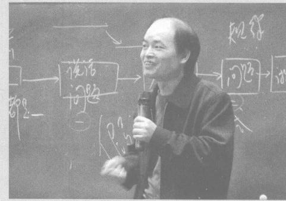

[图片描述：【待人工审查】浅色/白色细长条带（962x40像素）。章节：。]

[图片描述：装饰横幅：深蓝色宽横幅，左侧橙色方块内有书本小图标，整体为章节标题装饰栏，无文字教学内容。]

[图片描述：【待人工审查】极深色小图，疑为实心圆点/黑色符号（940x2像素）。章节：。]

[图片描述：【待人工审查】极深色小图，疑为实心圆点/黑色符号（940x2像素）。章节：。]

(一)表示物体的个数
通过自然数的发展历史，我们知道了自然数最初是用来表示物体数量的多少，这是生活的需要。例如，8个人、8只羊、8块石头，都可以用自然数8表达，8可以表示任何数量是八个的物体的个数。在人类历史上，相当长的时期把1作为最小的自然数，也就是说，自然数是从 1开始的。直到1993年国家颁布了一个文件，规定自然数包括0,从2001年开始小学数学教材把0纳入自然数序列： 一个物体也没有，就用0表示。这样0,1,2,3, …就构成了全体自然数。
(二)表示事物的顺序
人类在生活中除了需要表达物体的数量，还需要确定一组同类事物的位置和顺序。例如，人类通过观察月亮的阴晴圆缺，发现有一个变化周期，这个周期大概是29.5天，所以我国农历一个月确定为29天或者30天。在编制日历时，每个月从初一到二十九或者三十，这实际上既表达了一个月的天数，又表示了每一天的顺序和位置，方便人们安排生活和生产。大多数的时候，事物的顺序编号是把1号作为第一号开始的，但是也有从0开始编号的，如直尺的第一个刻度标0,第二个刻度标1,这样在测量线段长度的时候，刻度0对准一个端点，另一个端点对准的数就是该线段的长度。
(三)十进制计数法
如前文所述，我们的祖先经历了漫长的过程，才完整系统地建立了十进制计数法，从此

不再需要10及以上的这些计数单位符号，只需要0～9这十个数字符号就够了，减少了符号的使用，从而大大提高了计数和计算的效率。
我们简单梳理一下十进制计数法产生的过程。
1. 创造数字符号
如前文所述的甲骨文数字符号，每个符号代表一个数，如果想表达的数没有自己的符

。
号，就用其他符号累加的形式表达。例如，九万用三个三万累加表示，即
2. 确定十进制规则
古代人类早期的计数符号是简单的、零散的，到了甲骨文时期的计数符号，虽然还没有数位(位值)的概念，但是已经非常明显地体现出十进制思想，呈现出系统性、简洁性，已经出现一、十、百、千、万等单位，及若干个这些计数单位，这些计数单位的个数最大是9个，例如九、九十、九百、九千，如果再增加一个计数单位，就要满十进一，变成更大的一个单位。例如，10个十变成一个百，10个百变成一个千。
3. 建立位值概念
如前文所述，用十进制的计数单位累加的方式表达数据，初步具备了系统性和简洁性， 这种方法持续使用近一千年。到了公元前500年左右，人们发明了数位，把原来计数单位从高到低累加的方式，变成每一级计数单位只保留最基本的计数单位，并且固定每个计数单位的位置，称为数位。每个数位上的数字是几，就表示几个基本单位的数值；同一个数字，放在不同的数位上，表示的数值不同，称为位值。我们不要小看“1”这个数字，人们在发明数位之前，数字符号“一”只能表示一；但是有了数位，“1”就变成万能的了，就像孙悟空的金箍棒，想变大就变大，把1放在个位上，就表示一；把1放在万位上，就表示一万；把1放在亿位上，就表示一亿……我们在二年级已经学过最大的数是一万，知道9999加1等于 10000。
9+1=10,10个一是十；
99+1=100,10个十是百；
999+1=1000,10个百是千；
9999+1=10000,10个千是万。
在10000的基础上学习更大的数，通过不断加1逐步得到更大的自然数。
10000+1=10001,10001+1=10002, …
99999+1=100000,10个万是十万；

[图片描述：【待人工审查】小图（93x39像素），浅色图形（可能为几何图形线框、空白方格或浅色插图）。章节：。上下文：「999+1=1000,10个百是千；
9999+1=10000,10个千是万。
在10000的基础上学习更大的数，通过不断加1逐步得到更大的自然数。
10000+1=10001,10001+1=10002, …
99999+1=100000」]

999999+1=1000000,10个十万是百万；
9999999+1=10000000,10个百万是千万；
99999999+1=100000000,10个千万是亿；

由于十进制遵循满十进一的原则，所以每个数位上最大数字是9,9被称为最大数字。 在我们中华传统文化中，古代中国称为九州，乘法口诀中最大的是九九八十一 ，故宫一些宫殿大门的每一扇门的门钉有九行九列共八十一个。

[图片描述：【待人工审查】扫描区域近白（亮度241/255），未见有效内容，可能是版面空白区、分隔页或OCR空白段。章节：。]

(四)自然数的写与读
我们通过前文了解了十进制计数法，现在进行简单梳理。
1. 表达全体自然数只需要10个数字

前10个数字有双重含义，既可以表示前10个自然数，又可以把这些数字放在不同的数位上排列起来，每个数字表示相应计数单位的个数，表示其他自然数。
2. 数位和计数单位顺序表
按照“满十进一”的原则，每10个计数单位，构成相邻的更大的计数单位。历史上早期计  数单位常用的汉字是：一、十、百、千、万。后来曾经增加了一些汉字计数单位：亿、兆、京、垓、 秭、壤、沟、涧、正、载等，但是这些单位的大小和单位之间的进率并不统一，而且汉字太多、比  较繁琐，所以没有完全传承下来。现在除了亿(万万)以外，其他汉字不再使用。只是在其  他学科中有“一百万等于一兆”的用法，如计算机里的一个文件大小为一兆，就是一百万  字节。
由于现在只用：一、十、百、千、万、亿这几个简单的汉字表达万和亿之间、及亿以上的数  位和计数单位，同时要满足十进制的要求，所以把这些单位组合起来形成新的单位，这样的  记法简洁、清晰。从小到大排列，具体为：一、十、百、千、万、十万、百万、千万、亿、十亿、百亿、 千亿、万亿、十万亿、百万亿、千万亿……,因为兆已经被其他学科作为一百万使用，所以数学  里没有用兆代替万亿，而是直接用万亿作为大的计数单位。
观察以上计数单位的汉字，能发现什么规律呢?
我们发现：万、十万、百万、千万这四个计数单位是用前四个计数单位的汉字一、十、百、 千，与万字组合而成来命名的(一万省略“一”字);亿、十亿、百亿、千亿、万亿这五个计数单位  是用前五个计数单位的汉字一、十、百、千、万，与亿字组合而成来命名的(一亿省略“一”字)。 这样我们就可以把有限的、常用的自然数分成四组，每组包含四个数位(计数单位)为一级， 共四级：个级、万级、亿级、万亿级。我们习惯上说我国的数位分级是四位分为一级。
为了与现在从左到右的阅读习惯一致，也为了先看到最高位，自然数的计数单位是按照从大到小(从高到低)的顺序排列的。

[图片描述：【待人工审查】扫描区域近白（亮度240/255），未见有效内容，可能是版面空白区、分隔页或OCR空白段。章节：。]

3. 自然数的写法
根据十进制计数法原理、数位和计数单位顺序表，写数的时候，从左到右、从高位到低  位，依次写出每个计数单位的个数，即0～9的数字。如果哪个数位上没有该计数单位，该数  位上就写0(用0占位)。例如，2022年末广东省常住人口数由一个亿、两个千万、六个百万、 五个十万、六个万、八个千累加组成，即 10000  0000+20000000+6000000+500000+
60000+8000,简洁写法是直接写每个数位上的数字，写作：126568000。
如果一个大数的万位或亿位后面都是0,还可以舍去这些0,改写成用万或亿作单位。 60000=6万，900000000=9亿。
4. 自然数的读法
所谓读数，就是把一个数包含多少个数位，每个数位上的计数单位(数字)各是几，用语言表达清楚，都读出来，这是通用的方法。例如，126568000理应读作： 一个亿、两个千万、六个百万、五个十万、六个万、八个千、零个百、零个十、零个一。但是我们发现，这样的读数方法虽然清楚，但是缺乏连贯性和简洁性。根据自然数四位一级的计数法则，可以简化读数方法，具体如下：
①运用四位一级的读数法则， 一级一级地分别读数。个级的四位数字，从高位到低位， 采取“汉字+计数单位名称”的方式依次读数。例如，1357读作： 一千三百五十七。
②万级和亿级的数，因为都有万或亿字，所以采取比“汉字+计数单位名称”更加简便的方式读数，即“个级读数法+级名”。也就是说，先按照个级的方式读数，把公有的万或亿字提取出来，放在最后只读一次。例如：
13571357读作： 一千三百五十七万一千三百五十七；
135713571357读作： 一千三百五十七亿一千三百五十七万一千三百五十七。
③关于0的读法，在不引起歧义的原则下，约定：每个数末尾的连续几个0或者一个0

都不读，每一级末尾的连续几个0或者一个0也不读，其他数位上不管有连续几个0,都只读一个0,读作：零。例如：
6800读作：六千八百；
68006800读作：六千八百万六千八百；
600800680读作：六亿零八十万零六百八十。
像60008、600000008这样特殊的数，只有一头一尾两个非零数字，其他数字都是0,应读作：六万零八、六亿零八。那么经常会有人问：这样的数，一个零也不读，直接读作：六万八、六亿八，可不可以?我们还是建议，这样的数在生活中不会出现太多，为了不发生歧义， 没有必要为这样的几个特殊的数再单独约定简化方法了。
那么,面对比较大的数，如何快速准确读出来呢?可以根据四位一级的法则，快速从右到左、从低位到高位数到第五位(万位)和第九位(亿位),把这两个关键数位确定了(如果有笔，可以在相应数字下方点一个点；如果没有笔，做到心中有数即可),就可以快速准确读数了。

[图片描述：装饰条：细长黄色/橙色条带，为页面装饰分隔条，无教学内容。]

[图片描述：装饰块：橙色矩形色块，为页面装饰元素，无教学内容。]

1  把下面计数器亿位上减去1个珠子、千万位上增加3个珠子，这时计数器上的数是(          )。

[图片描述：【教学功能】练习题图。拨珠式计数器，共11档竖杆，底部从左到右标注数位依次为：千亿、百亿、亿、千万、百万、十万、万、千、百、十、个。当前拨珠状态：亿档1粒粉色珠子，千万档4粒粉色珠子（堆叠），百万档3粒粉色珠子（堆叠），其余各档均无珠子，当前计数器表示的数为 $143000000$（一亿四千三百万）。配合上文练习题"把下面计数器亿位上减去1个珠子、千万位上增加3个珠子，这时计数器上的数是（ ）"，学生在此基础上操作：亿档 $1-1=0$，千万档 $4+3=7$，操作后计数器表示 $73000000$（七千三百万）。]

2  在我国古代，人们用算筹计数，用算筹摆出1～9的数字，数字有纵式和横  式两种(见下图),计数的方法跟我们现在通用的十进制计数法基本相同， 特殊的地方是采取纵横交错的方式摆数字，即从右向左，个位、百位、万位……用纵式数字，十位、千位、十万位……用横式数字。

[图片描述：【待人工审查】浅色/白色细长条带（1156x63像素）。章节：。]

1    2    3         5    6    7    8    9
纵式： I ⅡⅢⅢⅢT         TⅢⅢ
=             言     1     ⊥      三
横式：

用上面的算筹摆出的数T≡|=Ⅲ              T       Ⅲ  是()。
3  阅读下面的材料，你能发现哪些信息?
下面是国家统计局发布的第七次全国人口普查公报数据。
全国总人口为1443497378人，其中普查登记的大陆31个省、自治区、直辖市和现役军人的人口共1411778724人，男性人口为723339956人，女性人口为688438768人。全国普查登记人口与2010年第六次全国人口
普查的1339724852人相比，增加了72053872人。

(五)近似数
在计算和测量过程中得到的实际数值，往往是准确数。有时候为了计算和表达的方便， 可以把准确数忽略一些数字，取跟它接近的数来代表这个准确数，这个与准确数接近的数称  为近似数。
取近似数常用的方法是“四舍五入”法，就是把准确数中省略一些忽略不计的数，根据省略的这些数字的最高位与5的大小关系来判断舍或入。如果省略的这些数的最高位数字小于5,就把这些数字都变成0,其他数位的数字保持不变(这样的数字包括0～4,最大是4,所以称为“四舍”);如果省略的这些数字的最高位数字大于或者等于5,就把这些数字都变成0 后，再把省略数字最高位左边相邻的数字加1(这样的数字包括5～9,最小是5,所以称为 “五入”)。
例如， 一所大学有9540名学生，取近似数时，如果省略十位及个位，那么就看十位数字， 4<5,把40变成00,记作9540≈9500;如果省略百位及后面的数位，那么就看百位数字，5= 5,先把540变成000,再把千位的9加1,记作9540≈10000。9540就是准确数，9500或  10000就是9540的近似数。可见，近似数不是唯一的，可以小于准确数，也可以大于准确数，

[图片描述：【待人工审查】扫描区域近白（亮度247/255），未见有效内容，可能是版面空白区、分隔页或OCR空白段。章节：。]

取决于我们取近似数时的精确度。

[图片描述：生活情境照片：国家游泳中心（水立方）夜景照片，蓝色泡泡外观建筑，紫色天空，橙色角落色块。用于引入立方体/正方体或几何图形的实际生活情境。]

(六)自然数的大小比较
我们从自然数的产生，知道了自然数序列：0,1,2,3, …从0开始， 一个比一个大1,任意一个自然数加1等于它后面相邻的这个自然数；任意一个自然数大于它前面每一个自然数，而小于它后面每一个自然数。例如0+1=1,1+1=2,2+1=3,0<1<2,1<2< 3;7及其前面的每一个自然数都小于8,8小于它后面每一个自然数。我们在一年级就知道用数线可以表示自然数。

[图片描述：【待人工审查】浅色/白色细长条带（571x46像素）。章节：。]

数线上的每一个点，都表示一个数，也就是说，数线上的点与自然数一一对应；数线上的数，向左越来越小，向右越来越大。
下面我们通过例子找到比较两个自然数大小的一些方法。

[图片描述：【待人工审查】小型图片碎片（亮度214），疑为装饰图标或数学符号（57x44像素）。章节：。]

例    5 < 6 , 6 < 7 , 可得 5 < 7 ;
7<8,8<9,可得7<9;
5 < 7 , 7 < 9 , 可得 5 < 9 。
观察以上式子，能发现什么呢?

[图片描述：【待人工审查】浅色/白色细长条带（1165x64像素）。章节：。]

通过观察比较可以发现这样一个性质：
(1)两个任意自然数比较大小，可以通过一个数起一个传递作用而比较出来，说明小于关系具有传递性。用字母表达就是：如果a<b,b<c,     那么a<c。
我们知道，5<9,也可以写成9>5;7<8,也可以写成8>7。这样的例子不胜枚举， 用字母表达这个性质就是：a<b  等价于b>a。  所以，大于关系也有传递性，即：如果c>b,   b>a,   那么c>a。
我们现在常用的自然数是用十进制计数法表达的，任意一个自然数都是由若干个计数单位累加组合而成，这样通过比较两个自然数的数位的多少、计数单位的多少就可以推出两个数的大小，再来看一个例子。
例    9以外的一位数都小于9,9<10,10小于其他所有的两位数，所以所有的一
位数都小于两位数。
99以外的两位数都小于99,99<100,100小于其他所有的三位数，所以所有
的两位数都小于三位数。
999以外的三位数都小于999,999<1000,1000小于其他所有的四位数，所以所有的三位数都小于四位数。

观察以上过程和结论，能发现什么呢?

通过观察比较可以发现这样一个性质：
(2)任意的n 位数，小于任意的(n+1)位数；再根据不等关系的传递性，可以推出：任意两个不同数位的自然数比较大小，数位多的那个数大。
这样我们就知道了两个不同数位自然数比较大小的方法，那么,任意两个相同数位的自然数，怎么比较大小呢?请看下面的例子。

[图片描述：【待人工审查】小型图片碎片（亮度224），疑为装饰图标或数学符号（56x44像素）。章节：。]

例比较3579和3679,  1234和2345的大小。

通过观察和比较可以发现，3579和3679的最高位都是3,也就是两个自然数都是三千多，仅通过比较最高位无法确定大小，那么就接着比较百位数字。百位上，一个是5,另一个是6,5<6,根据5<6是否一定能够确定3579<3679呢?我们知道579<599,599<600, 600<679,所以579<679,因此能够确定3579<3679。同理，可以推出43579<43679,

[图片描述：【待人工审查】扫描区域近白（亮度242/255），未见有效内容，可能是版面空白区、分隔页或OCR空白段。章节：。]

等等。
再看1234和2345,都是四位数，1234<1999,1999<2000,2000<2345,所以 1234<2345。同理，可以推出27618<31475,等等。这样，我们就得出了两个相同数位的自然数比较大小的方法。
(3)两个具有相同数位的自然数比较大小，先比较最高位，如果最高位数字不同，那么最高位数字大的那个数就大；如果最高位数字相同，再比较次高位，次高位数字大的那个数就大，以此类推。

[图片描述：【待人工审查】扫描区域近白（亮度244/255），未见有效内容，可能是版面空白区、分隔页或OCR空白段。章节：。]

[图片描述：【待人工审查】浅色/白色细长条带（1169x63像素）。章节：。]

[图片描述：【待人工审查】极深色小图，疑为实心圆点/黑色符号（940x2像素）。章节：。]

[图片描述：【待人工审查】极深色小图，疑为实心圆点/黑色符号（942x2像素）。章节：。]

我们每天都会观察到各种有趣的物理现象，如城市夜晚的霓虹灯闪耀着五彩缤纷的光芒而令人流连忘返，这是物体的发光现象；清晨的鸟儿迎接阳光雨露的欢快歌声把人们从美梦中叫醒，这是物体的发声现象；冬天午后的阳光照在黑色的衣服上， 一会儿后背就会热乎乎的，这是物体的发热现象；人在地球的各个角落自由行走而不会掉到太空中，这是地球的引力现象；等等。为了科学地认识这些物理现象，掌握事物的性质和规律，需要对很多物理量进行测量，这就是度量的重要性和意义。
量的计量有悠久的历史，人类自从有了工具和劳动，就有计量的需求。物理量有很多： 物体的长短是长度，物体占(所容纳)空间的大小是体积(容积),物质的轻重是质量(重力), 物质的冷热是温度，物体运动的过程和顺序是时间，事物价值的大小是价格(单价),声音的  大小(强弱)是响度，等等。其中的长度、体积(容积)和质量就是我们祖先常用的量的测量， 称为度量衡。
以上这些物理属性的计量大体上可以分为两类： 一类是用一个单位量去计量，如温度、 时间等；另一类是必须用两个量进行计量，比如商品的价格，只看总价的大小不行，只看商品的数量也不行，必须把总价与商品的数量，或者是质量进行比较，才能衡量商品价格的大小。 不管哪类度量，都需要统一度量单位，度量时把待度量的量与度量单位比较，得出待度量的  量包含度量单位的个数，这个个数就是度量的结果，也就是待度量的量的大小。
本节我们学习时间、质量、货币，这些量在数的认识和运算，以及数量关系等内容中经常用到。

[图片描述：【待人工审查】小图（72x75像素），彩色图片（可能为插图、实物照片或数学图形）。章节：。上下文：「(3)两个具有相同数位的自然数比较大小，先比较最高位，如果最高位数字不同，那么最高位数字大的那个数就大；如果最高位数字相同，再比较次高位，次高位数字大的那个数就大，以此类推。
我们每天都会观察到各种有趣的物理现象，如城市夜晚的霓虹灯闪耀着五」]

时间

地球在茫茫宇宙中实在是一个奇迹，因为到目前为止，我们还没有发现其他星球存在与地球同样如此丰富多样的生命。地球作为太阳系中的一颗行星，在围绕太阳公转的同时，也在自转；地球并不孤单，还有唯一一个天然卫星——月球在围绕地球公转。我们首先得承认：太阳系、地球、月球都是有寿命的，我们人类也是有寿命的，人类的文明需要一代一代的人像接力赛一样不断传承下去。因此，事物的发展和运动有一个过程和先后顺序，为了更好

[图片描述：【待人工审查】浅色/白色细长条带（1155x62像素）。章节：。]

地促进人类社会的发展，我们需要对地球上物体的运动和星球的运动过程进行度量，这就涉及到了时间，时间是对事物运动的过程及先后关系的度量结果。
因此，时间是一个非常重要的物理量。为什么重要呢?因为时间是悄悄流逝的、单向而  不可逆的，每个个体的一生是一次单方向的时间旅程。我国伟大思想家、教育家孔子这样形  容时间的流逝：逝者如斯夫，不舍昼夜。陶渊明的一首诗写道：盛年不重来，一日难再晨，及  时当勉励，岁月不待人。如何让每个有限的生命过程有意义，就离不开时间的规划和管理。 我们要珍惜时间，用好时间，过好一生。
(一)时间单位
1. 日和时分秒
我们把地球自转一周所持续的时间，称为1天(日),也称为一昼夜。地球每天自西向东自转，如此循环往复；所以太阳每天早晨从东方升起，晚上从西边落下。把1天平均分成24 份，每一份就是1小时。再把1小时平均分成60份，每一份就是1分；再把1分平均分成60
份，每一份就是1秒。
计量很短的时间，常用秒。秒是比分更小的时间单位。

[图片描述：【待人工审查】小图（204x147像素），浅色图形（可能为几何图形线框、空白方格或浅色插图）。章节：。上下文：「(一)时间单位
1. 日和时分秒
我们把地球自转一周所持续的时间，称为1天(日),也称为一昼夜。地球每天自西向东自转，如此循环往复；所以太阳每天早晨从东方升起，晚上从西边落下。把1天平均分成24 份，每一份就是1小时。再把1小时平均分成60」]

钟面上最长最细的针是秒针。秒针走1小格的时间是1秒。

观察一下，秒针走一圈，分针走多少小格。你发现了什么?

[图片描述：【教学功能】核心说理。时钟序列图，三个圆形时钟排成一排用箭头相连。左钟：时针指向9、分针指向12（9:00）；中钟：时针在下方（18:00或6:00）；右钟：外圈有红色弧线标注（表示旋转角度）。演示时针旋转一圈的概念，与时间或旋转内容相关。]

天、小时、分、秒都是时间单位，它们之间的换算关系是：
1天=24时，1时=60分，1分=60秒。
据此，还可以推出：
1天=1440分=86400秒，1时=3600秒。
在此需要特别说明的是，在语言叙述的时候时间单位使用“小时”,在算式中作为单位符

[图片描述：【待人工审查】浅色/白色细长条带（1157x69像素）。章节：。]

号使用“时”或“h”。
2. 年和月
例    下面是2023年的年历，认真观察，回答后面的问题。

[图片描述：【教学功能】练习题图。年历表：展示完整一年12个月的月历，三列四行排列，每月显示日一至六的日历格。部分日期有红色圆圈标记（节假日或特殊日期），左右两侧有红色塑料日历夹图案。用于读取年历、计算天数等时间练习。]

年历上标注了哪些节庆的日子?你还经历了哪些节庆的日子? 接下来观察2024年的年历，回答后面的问题。

[图片描述：【待人工审查】扫描区域近白（亮度241/255），未见有效内容，可能是版面空白区、分隔页或OCR空白段。章节：。]

[图片描述：【待人工审查】小图（95x63像素），浅色图形（可能为几何图形线框、空白方格或浅色插图）。章节：。上下文：「在此需要特别说明的是，在语言叙述的时候时间单位使用“小时”,在算式中作为单位符
号使用“时”或“h”。
2. 年和月
例    下面是2023年的年历，认真观察，回答后面的问题。
年历上标注了哪些节庆的日子?你还经历了哪些节庆的日子? 接下」]

观察2023年、2024年的年历，记录每月的天数。

(1)一年有(    )个月。
(2)有31天的月份是：                  ,这些月份是大月。 有30天的月份是：                  ,这些月份是小月。

例观察 2013—2024 年的2月的天数。你发现了什么?

[图片描述：【教学功能】练习题图。2013-2016年2月份月历（四个连续年份的2月）：每月显示7列（日一二三四五六）和4~5行日期。可用于观察2月份天数规律（平年28天、闰年29天）及星期排列。]

[图片描述：【教学功能】练习题图。2017-2020年2月份月历（四年连续）。用于观察闰年规律（2020年2月有29天）。]

[图片描述：【待人工审查】扫描区域近白（亮度241/255），未见有效内容，可能是版面空白区、分隔页或OCR空白段。章节：。]

[图片描述：【教学功能】练习题图。2021-2023年2月份月历（三年）。用于读取年份和月份关系练习。]

[图片描述：【待人工审查】小图（38x131像素），彩色图片（可能为插图、实物照片或数学图形）。章节：。上下文：「年历上标注了哪些节庆的日子?你还经历了哪些节庆的日子? 接下来观察2024年的年历，回答后面的问题。
观察2023年、2024年的年历，记录每月的天数。
(1)一年有(    )个月。
(2)有31天的月份是：               」]

2月，有28天的是平年，有29天的是闰年。 平年全年有(    )天，闰年全年
有()天。
(1)把上面月历中是闰年的圈出来。
(2)2016年是闰年，(    )年后，即(    )年又是闰年。
(3)今年是(    )年，上一个闰年是(    )年，下一个闰年是(    )年。

公历(阳历)的一年是以地球绕太阳公转连续两次通过春分点的周期(时间间隔，天文学上称为回归年)进行确定的，这个周期是365天5小时48分46秒，约合365.2422天。为了

[图片描述：【待人工审查】浅色/白色细长条带（1170x74像素）。章节：。]

方便计算和表达，取整数部分365作为一年，称为平年。这样就导致平年比回归年少0.2422 天，大约每4年会出现0.9688天的误差，约为1天，需要及时补回来，保证时间基本精准吻合。因此每4年中的第4年增加1天，这样的年份是366天，称为闰年，即每4年一闰。
按照这个方法，100年中应该有25个闰年，但是这样会出现一个问题，就是补的天数补多了，因为每个闰年补1天，实际上每个闰年多补了1—0.9688=0.0312(天),24个闰年就多  补了(提前透支)0.0312×24=0.7488(天),这样就约定100年里前96年24闰，后4年不闰， 这4年又多出0.9688天；这样每100年就只多出0.9688—0.7488=0.22(天),400年多出 0.22×4=0.88(天);又约定第4个100年的最后一年，即第400年加一闰。经过计算，约定公元年数是4的整数倍的为闰年，但公元年数是整百数的，必须是400的整数倍的才是闰年。 例如，2024年是闰年，2100、2200、2300年不是闰年，2400年才是闰年。
公历一年有12个月，365÷12≈30.42(天),理论上每个月取整天数是30天或者31天， 30天的月份是小月，31天的月份是大月，平年2月28天，闰年2月29天。时间单位见下表。

无论是长度单位之间，还是时间单位之间，每两个单位之间都有一种倍数关系，这个倍数就是两个单位之间的进率。

[图片描述：【待人工审查】扫描区域近白（亮度244/255），未见有效内容，可能是版面空白区、分隔页或OCR空白段。章节：。]

(二)时刻
我们前面讨论的这些时间和时间单位，实际上是持续的一段时间，类似于求一条线段的长度。时间还有另外一个含义，就是持续的时间中的某一点，称为时刻，这类似于数轴中的某一点。例如，小明从上午9:00开始学习，持续学到上午11:00,学习经过的时间是11—9=  2(时),2小时就是一段时间，而9:00和11:00就是时刻，类似于数轴上的点9和点11,求9 到11的线段的长度也是用11—9=2。时刻在生活中应用广泛，但是人们习惯把时刻也称为时间，人们会根据生活情境自然区分时间和时刻，而不会混淆。例如，北京到上海的高铁列车G1 运行时间为07:00—11:29,全程运行时间为11:29—7:00=4时29分，而出发时间
07:00和到达时间11:29,实际上都是时刻。
(三)计时法
我们生活在地球上，对时间最敏感的是天这个时间单位，因为每天东边日出、西边日落， 每天日出而作、日落而息，周而复始。每天24小时，需要对每个小时的时间和时刻进行表达； 可以把一天时间分成均等的两部分，第一部分是从凌晨零时(00:00)到中午12:00,第二部分  是从中午12:00到夜里12:00(也是第二天的00:00)。有两种计时方法：
第一种是12时计时法，与大多数钟表的刻度一致(从12开始，以12、1、2、3、4、5、6、 7、8、9、10、11为一圈，每天时针转2圈),把24小时分为两个12小时，第一个12小时从夜  里12时(也是第二天的0时)到中午12时，第二个12小时从中午12时到夜里12时。为了  清晰区分两部分时间，需要在时间的前面加注凌晨、上午、中午、下午、晚上等词语。
第二种是24时计时法，也就是说，从0时开始，下午的时间加上12,不需要加注词语；如下午1时记为13时，下午2时记为14时，以此类推，直到夜里12时记为24时。由于24时计时法不容易混淆，所以在民航、铁路等行业应用广泛。

[图片描述：【待人工审查】小图（169x170像素），浅色图形（可能为几何图形线框、空白方格或浅色插图）。章节：。上下文：「07:00和到达时间11:29,实际上都是时刻。
(三)计时法
我们生活在地球上，对时间最敏感的是天这个时间单位，因为每天东边日出、西边日落， 每天日出而作、日落而息，周而复始。每天24小时，需要对每个小时的时间和时刻进行表达； 可以把一天」]

[图片描述：【教学功能】引入情境。营业时间牌：圆角矩形牌子（浅灰色，橙色边框），顶部有橙色圆形挂钩，内含文字「欢迎光临」「营业时间」「10:00-21:30」。用于引入时间段计算的生活情境。]

上午10:00一晚上9:30

[图片描述：【待人工审查】扫描区域近白（亮度241/255），未见有效内容，可能是版面空白区、分隔页或OCR空白段。章节：。]

[图片描述：【待人工审查】小型图片碎片（亮度211），疑为装饰图标或数学符号（58x46像素）。章节：。]

例     在下面的钟面上画上时针。

[图片描述：【待人工审查】小图（142x145像素），彩色图片（可能为插图、实物照片或数学图形）。章节：。上下文：「我们生活在地球上，对时间最敏感的是天这个时间单位，因为每天东边日出、西边日落， 每天日出而作、日落而息，周而复始。每天24小时，需要对每个小时的时间和时刻进行表达； 可以把一天时间分成均等的两部分，第一部分是从凌晨零时(00:00)到中午1」]
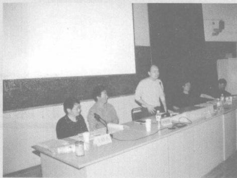

[图片描述：【待人工审查】小图（140x148像素），彩色图片（可能为插图、实物照片或数学图形）。章节：。上下文：「我们生活在地球上，对时间最敏感的是天这个时间单位，因为每天东边日出、西边日落， 每天日出而作、日落而息，周而复始。每天24小时，需要对每个小时的时间和时刻进行表达； 可以把一天时间分成均等的两部分，第一部分是从凌晨零时(00:00)到中午1」]

[图片描述：【待人工审查】小图（141x145像素），彩色图片（可能为插图、实物照片或数学图形）。章节：。上下文：「我们生活在地球上，对时间最敏感的是天这个时间单位，因为每天东边日出、西边日落， 每天日出而作、日落而息，周而复始。每天24小时，需要对每个小时的时间和时刻进行表达； 可以把一天时间分成均等的两部分，第一部分是从凌晨零时(00:00)到中午1」]

(四)我国的传统历法
上面所介绍的公历是世界通用的历法，我国于1912年开始采用至今。在我国5000多年的文明史中，生产方式主要以农业为主，勤劳智慧的中华民族根据对天文地理的多年观测和劳动实践，形成了古老的、独特的、先进的中国历法——农历。 一说起农历，很多人认为就是阴历，实际上这是一种误解，农历实际上包括阴历和阳历，以阴历为主、阳历为辅。我国几千年来编制了先进的农历，促进了农业生产的可持续发展，在经历多次战乱和自然灾害后，依然保障了中华民族的生生不息和文明的延续。
1. 天干地支
根据有关文献记载，我国至少在西周时期就已经把一天平均分为12份，每份为一个时  辰，共计12个时辰，依次为：子时、丑时、寅时、卯时、辰时、巳时、午时、未时、申时、酉时、戌时、 亥时。到了宋朝，进一步把每个时辰一分为二，其中一份为1小时，原来的时辰称为大时，这  样一天就是24小时，沿用至今。
有了12时辰和24小时，人们就能够方便记录每天的时间顺序。那么我国古代是如何记录“日(天)”的呢?就是用大家熟悉的天干地支组合的方法记录天。
天干有十个：
甲、乙、丙、丁、戊、己、庚、辛、壬、癸。
地支有十二个：
子、丑、寅、卯、辰、巳、午、未、申、酉、戌、亥。
天干单数与地支单数组合，天干双数与地支双数组合，这样总组合数是10与12的最小公倍数60,从甲子开始到癸亥结束，60天为一个周期，循环记录。这样的记录方法每年至少要循环6次，多年以后就不方便记忆和计算，后来又把这个记录天的方法推广到记录年，这样

[图片描述：【待人工审查】小图（98x61像素），浅色图形（可能为几何图形线框、空白方格或浅色插图）。章节：。上下文：「天干有十个：
甲、乙、丙、丁、戊、己、庚、辛、壬、癸。
地支有十二个：
子、丑、寅、卯、辰、巳、午、未、申、酉、戌、亥。
天干单数与地支单数组合，天干双数与地支双数组合，这样总组合数是10与12的最小公倍数60,从甲子开始到癸亥结束，60天」]

60年一个周期，也称为六十年一甲子，此方法沿用至今，与公历纪年方法搭配使用。例如，公元2024年，也是农历甲辰龙年。
2. 阴历
苏轼的《水调歌头 · 明月几时有》中有一句家喻户晓的诗句“人有悲欢离合，月有阴晴圆缺”,那么月亮为什么会有阴晴圆缺的变化规律呢?我们都知道，太阳系中只有太阳发光，月亮本身不发光，晚上赏月看到的是月球反射的太阳光。随着太阳、地球、月球的不断运动，我们在地球上晚上看到月球的位置在不断变化，虽然月球总有半个球面是因为反射太阳光而发亮，但它正对着地球的半个球面不能总是完全被太阳照亮，我们能够看到的月球反射太阳光的形状和大小在随之变化。 一般情况下在每个月的阴历初一即月球运动到地球和太阳之

[图片描述：教学情境图：月相示意图，黑色背景，彩色地球居于中央，周围环绕8个位置的月球图案（展示月相变化：新月、上弦月、满月、下弦月等），各月相之间有蓝色箭头指示运行方向（逆时针）。配合时间/历法/月相变化的教学内容。]

月相的阴晴圆缺的周期变化， 一个周期称为朔望月。
一个朔望月的时间为29天12小时44分3秒，约为29.53059天。为了使每个月为整天数，阴历的每个月分为大小月，大月30天，小月29天， 一年为354天。这样的历法就是阴历。
虽然编制了阴历，但是阴历的不足也非常明显，这是因为阴历一年只有354天，与地球绕太阳公转周期相差11天之多，导致根据阴历很难准确确定每年春种秋收的日期，满足不了农业生产的需求。由于农业依赖的是大自然的风调雨顺，需要研究大自然的气候变化规律，这与地球绕太阳的运动有关，所以我国古代还根据太阳的周期变化，编制了阳历。至少早在西周时期就运用土圭之法测定了阳历的一年有366日，具体方法是立杆测影，在平台中央竖立

[图片描述：【待人工审查】小图（92x58像素），浅色图形（可能为几何图形线框、空白方格或浅色插图）。章节：。上下文：「2. 阴历
苏轼的《水调歌头 · 明月几时有》中有一句家喻户晓的诗句“人有悲欢离合，月有阴晴圆缺”,那么月亮为什么会有阴晴圆缺的变化规律呢?我们都知道，太阳系中只有太阳发光，月亮本身不发光，晚上赏月看到的是月球反射的太阳光。随着太阳、地球、」]

一根八尺长的杆子，观察这根杆子的日影长度。发现在一天中正午时杆子的影子最短，这样就用每天正午最短的影长作为每天的日影长度。人们通过测量和比较，找到了日影最短和最长的日子，把日影最短的这一天称为夏至，把日影最长的这一天称为冬至，这样就通过日影的长度得到了夏至和冬至；再通过计算夏至和冬至日影长度的平均数，用这个平均长度的日子确定春分和秋分。这样，就用土圭之法确定了一年四季。到了汉朝，我国已经准确测定

[图片描述：【待人工审查】小图（60x51像素），浅色图形（可能为几何图形线框、空白方格或浅色插图）。章节：。上下文：「苏轼的《水调歌头 · 明月几时有》中有一句家喻户晓的诗句“人有悲欢离合，月有阴晴圆缺”,那么月亮为什么会有阴晴圆缺的变化规律呢?我们都知道，太阳系中只有太阳发光，月亮本身不发光，晚上赏月看到的是月球反射的太阳光。随着太阳、地球、月球的不断运」]

一年有
这根八尺长的杆子也称为表或髀，我国汉朝有一本数学名著《周髀算经》,讲的是关于周朝的髀的计算问题，主要讲述的是如何利用土圭之法，根据日影长度的差异，计算西周国土南北端之间的距离，从而测定了西周的疆域。
为了使得阴历同阳历尽量协调一致，符合大自然的季节变化规律，又由于阴历一年比阳历一年少11天多一点，3年就少算大约34天，所以阴历采取了闰月的办法，就是2到3年增加一个月，这个月称为闰月，这样的一年就有13个月。现在比较精确的闰月方法是每19年有7个闰月。
3. 二十四节气
前文提到，我国在西周时期就用土圭之法确定了一年四季：春分、夏至、秋分和冬至。后  来随着测量技术的发展，逐步从四个节气扩大到二十四节气。西汉汉武帝时期用土圭之法， 以冬至日为起点，将冬至与下一个冬至之间的时间分成24等份，每相邻两个节气间隔时间为 15天左右，二十四节气始于冬至，终于大雪；并将二十四节气纳入《太初历》,作为指导农业生产的历法组成部分。《太初历》是我国西汉时期天文学家落下闳(前156年一前87年，巴郡阆中人，今四川省阆中市)等人编制的历法。
你能从下面的唐诗中读出哪些数学信息?

[图片描述：【待人工审查】扫描区域近白（亮度242/255），未见有效内容，可能是版面空白区、分隔页或OCR空白段。章节：。]

[图片描述：【待人工审查】扫描区域近白（亮度242/255），未见有效内容，可能是版面空白区、分隔页或OCR空白段。章节：。]

[图片描述：【待人工审查】扫描区域近白（亮度245/255），未见有效内容，可能是版面空白区、分隔页或OCR空白段。章节：。]

现行的二十四节气是基于太阳在黄道上的位置来划分的，即把黄道轨迹划分为24等份， 每15°为1等份，每1等份为一个节气。 一年四季，春夏秋冬各三个月，每月两个节气，始于立  春，终于大寒，如此循环往复。
春季：立春、雨水、惊蛰、春分、清明、谷雨；
夏季：立夏、小满、芒种、夏至、小暑、大暑；
秋季：立秋、处暑、白露、秋分、寒露、霜降；
冬季：立冬、小雪、大雪、冬至、小寒、大寒。
为了方便记忆，人们编制了二十四节气歌诀：

春雨惊春清谷天，夏满芒夏暑相连，
秋处露秋寒霜降，冬雪雪冬小大寒。
每月两节不变更，最多相差一两天。
上半年来六、廿一，下半年来八、廿三。
二十四节气现在仍然是我国农历的一个重要组成部分。在国际气象界，二十四节气被誉为“中国的第五大发明”。2016年11月30日，二十四节气被正式列入联合国教科文组织人类非物质文化遗产代表作名录。

[图片描述：教学情境图：彩色圆环日历/节气图，圆形分为多个扇区，颜色区分四季，部分扇区标有日期数字（如-21日、-6日、-24日、-9日、7月22-24日、7月6-8日等），中央有高山云雾背景图。用于展示节气或农历相关的时间概念。]

[图片描述：【待人工审查】小图（93x65像素），浅色图形（可能为几何图形线框、空白方格或浅色插图）。章节：。上下文：「春雨惊春清谷天，夏满芒夏暑相连，
秋处露秋寒霜降，冬雪雪冬小大寒。
每月两节不变更，最多相差一两天。
上半年来六、廿一，下半年来八、廿三。
二十四节气现在仍然是我国农历的一个重要组成部分。在国际气象界，二十四节气被誉为“中国的第五大发明”。」]
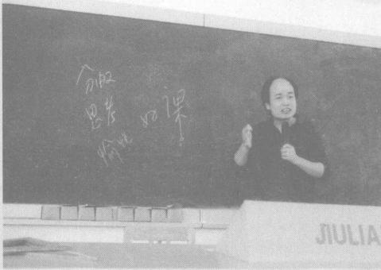

[图片描述：【待人工审查】小型图片碎片（亮度130），疑为装饰图标或数学符号（823x4像素）。章节：。]

[图片描述：【待人工审查】小图（160x54像素），彩色图片（可能为插图、实物照片或数学图形）。章节：。上下文：「春雨惊春清谷天，夏满芒夏暑相连，
秋处露秋寒霜降，冬雪雪冬小大寒。
每月两节不变更，最多相差一两天。
上半年来六、廿一，下半年来八、廿三。
二十四节气现在仍然是我国农历的一个重要组成部分。在国际气象界，二十四节气被誉为“中国的第五大发明”。」]

1  2024年10月1日是星期二，请先填写月历表，你能发现哪些信息?

[图片描述：【待人工审查】小型图片碎片（亮度155），疑为装饰图标或数学符号（45x46像素）。章节：。]

下面是一列高铁列车的运行时刻表。

(1)从北京西站到石家庄站，高铁列车运行了多长时间?
(2)高铁列车在武汉站停留了多长时间?
(3)高铁列车从郑州东站到长沙南站，用了多长时间?
3  火车在上午          时          分开车，开车前5分钟停止检票，停止检票的时间是          时          分。

[图片描述：【待人工审查】彩色图片（插图/实物照片/数学图形）（316x199像素）。章节：。上下文：「下面是一列高铁列车的运行时刻表。
(1)从北京西站到石家庄站，高铁列车运行了多长时间?
(2)高铁列车在武汉站停留了多长时间?
(3)高铁列车从郑州东站到长沙南站，用了多长时间?
3  火车在上午          时          分」]

[图片描述：【待人工审查】扫描区域近白（亮度241/255），未见有效内容，可能是版面空白区、分隔页或OCR空白段。章节：。]

[图片描述：【待人工审查】小型图片碎片（亮度149），疑为装饰图标或数学符号（45x46像素）。章节：。]

由于地球自西向东自转，在同一纬度地区，东边的地点比西边的地点先看到日出。这样，时间就有了早迟之分。各地使用不同的时间很不方便，因此，科学家把全球划分为24个时区，每个时区用同一个时间，相邻时区相差一小时。有的国家横跨多个时区，为了方便，统一使用首都所在时区的时间 。
当北京在1月1日0时敲响新年钟声的时候，英国伦敦还是上一年12月 31日下午4时呢!
北京与伦敦的时间相差8小时，也称为北京与伦敦的时差是8小时。

[图片描述：【教学功能】核心说理。时差示意图，由两个圆形时钟和连接箭头组成。左侧时钟：时针与分针均指向12，表示 $0$ 时（午夜）；右侧时钟：时针指向4，分针指向12，表示下午4时（16:00）。两钟之间有一条向右水平箭头，图旁文字"往回拨8小时"说明操作方向。两钟正下方各有一个空白矩形方框，方框之间同样有向右箭头，供学生填写两地的时间信息。配合上文"当北京在1月1日0时敲响新年钟声的时候，英国伦敦还是上一年12月31日下午4时呢！北京与伦敦的时间相差8小时"，左钟表示北京时间1月1日0时，右钟表示伦敦时间12月31日下午4时，直观演示时差计算：$0\text{时} - 8\text{小时} = \text{前一天16:00（下午4时）}$，帮助学生理解东八区比零时区早8小时的时差概念。]

往回拨

8小时       31日
下午4时

1月份北京时间比莫斯科时间早5小时，请画出莫斯科时间。

[图片描述：【教学功能】核心说理。圆形时钟（黄色/金色边框）：时针指向9，分针指向12，表示9:00，标注为「北京时间」。配合上文「1月份北京时间比莫斯科时间早5小时，请画出莫斯科时间」练习，学生需根据此钟推算莫斯科时间（9:00-5小时=4:00）。]

北京时间

[图片描述：【教学功能】练习题图。空白圆形时钟（黄色边框）：表盘有12个数字刻度，中心有红色圆点，时针和分针均缺失，供学生在上面画出莫斯科时间（4:00）的时针和分针。]

莫斯科时间

[图片描述：【待人工审查】小图（74x75像素），彩色图片（可能为插图、实物照片或数学图形）。章节：。上下文：「8小时       31日
下午4时
1月份北京时间比莫斯科时间早5小时，请画出莫斯科时间。
北京时间
莫斯科时间 质量
大家都熟悉“半斤八两”这个成语吧，这个内涵丰富、应用广泛的成语背后蕴含着数学的历史和文化，与我国古代的度量衡中的衡有关」]
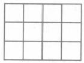

质量

大家都熟悉“半斤八两”这个成语吧，这个内涵丰富、应用广泛的成语背后蕴含着数学的历史和文化，与我国古代的度量衡中的衡有关。下面我们简单回顾一下其历史。
在度量衡这三种物理量的测量方面，衡的发展可能滞后于前两者。因为用身体作为尺子都可以粗略测量长度，体积和容积的测量，只要有容器即可测量，例如新石器时代的陶罐就可以测量容积。而物体的质量(过去习惯说重量)的测量，古代需要用到杠杆原理，这是有

[图片描述：【待人工审查】小图（96x64像素），浅色图形（可能为几何图形线框、空白方格或浅色插图）。章节：。上下文：「北京时间
莫斯科时间
质量
大家都熟悉“半斤八两”这个成语吧，这个内涵丰富、应用广泛的成语背后蕴含着数学的历史和文化，与我国古代的度量衡中的衡有关。下面我们简单回顾一下其历史。
在度量衡这三种物理量的测量方面，衡的发展可能滞后于前两者。因为」]

难度的。在古代的生产和贸易中，大多数需要测量质量的物品，只通过容积的测量也可完成交换，因为相同物质的密度相同，相同密度的物体，质量与体积成正比，质量(m)、 体积(V)和密度(p) 之间的关系为：m=Vp。
我国在春秋战国时期已经掌握了杠杆原理，战国时期已使用等臂天平和砝码称黄金，这是早期的衡器，后来的杆秤等衡器也是在这个原理上发展起来的。衡器的制作关键在权上， 权就是秤砣。《汉书 ·律历志》记载了五种权的名称和质量：“权者，铢、两、斤、钧、石，所以称  物以知轻重也。”当初的一铢是怎样确定的呢?当时是以中等颗粒的黑黍(shǔ,   主要产于北  方的黄米)粒，以十黍为累，十累为一铢，二十四铢为一两，十六两为一斤。1石=4钧，1钧=30  斤，1斤=16两，1两=24铢。
我国古代劳动人民从等臂天平入手，研制出了不等臂天平，并在东汉时期将其改进成为杆秤。杆秤利用杠杆原理来进行称量，由木制或金属制的带星的秤杆、金属秤锤、提纽等组成。杆秤制作方便(缺点是准确度低于天平),很快在生产和生活中流行开来。在随后的近 2000年时间里，杆秤都是我国重要的称量工具，直到现在都还有人在使用，在中药店就能看到杆秤。
在2000多年的发展过程中，1斤的质量大小也在不断变化，到了明清时期，1斤=590 克。1959年我国开始执行新的质量计量标准，规定1斤=500克，1斤=10两。
现在的国际单位制的质量基本单位是千克。

[图片描述：【待人工审查】小图（173x88像素），彩色图片（可能为插图、实物照片或数学图形）。章节：。上下文：「难度的。在古代的生产和贸易中，大多数需要测量质量的物品，只通过容积的测量也可完成交换，因为相同物质的密度相同，相同密度的物体，质量与体积成正比，质量(m)、 体积(V)和密度(p) 之间的关系为：m=Vp。
我国在春秋战国时期已经掌握了杠杆」]
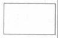

1勺盐2g

精制食用盐
加碘

1袋盐500g   2袋盐1000g

[图片描述：【教学功能】引入情境。两头卡通奶牛（黑白花纹），并排站立。用于引入数量（两头牛）或分数/比例相关的数学情境题。]

1头牛500kg  2头牛1t 质量单位见下表。

[图片描述：【教学功能】引入情境。卡通大象（蓝灰色），侧身站立，微张嘴。用于引入质量、重量或数量相关的数学情境题。]

1头大象3 t

[图片描述：【待人工审查】极深色小图，疑为实心圆点/黑色符号（946x3像素）。章节：。]

[图片描述：【待人工审查】小图（160x55像素），彩色图片（可能为插图、实物照片或数学图形）。章节：。上下文：「精制食用盐
加碘
1袋盐500g   2袋盐1000g
1头牛500kg  2头牛1t 质量单位见下表。
1头大象3 t 1  填空。
2 0 0 0 克 =(    )千克                6 千克 = ()克
3 吨 =(」]

1  填空。
2 0 0 0 克 =(    )千克                6 千克 = ()克
3 吨 =(    )千克                   7000千克=()吨

[图片描述：【待人工审查】小型图片碎片（亮度149），疑为装饰图标或数学符号（45x46像素）。章节：。]

选择题(把正确答案的序号填在括号里)。
(1)比较下面的质量，最重的是(   。
A.3 吨300千克     B.2900  千克        C.3330  千克
(2)一头大象重6吨60千克，合(   )千克。
A.6060                    B.6600                    C.60060
3  在合适的选项上画 √。
(1) 一个足球重(1吨15千克500克)。
(2)你的体重约是(5000克32千克500克)。
(3) 一辆货车的载质量是(10吨50千克1000克)。

[图片描述：【待人工审查】小型图片碎片（亮度150），疑为装饰图标或数学符号（46x46像素）。章节：。]

在(    )里填上适当的数，使每种东西的总重恰好是1吨。

[图片描述：【教学功能】练习题图。质量估计连线题：四格（奶牛、工业油桶、面袋、老虎），每格右侧有蓝色空白填写条（供填写质量估计），中央有连接点。用于练习估计生活物体的质量。]

100千克

()桶

1吨

250千克

()只

[图片描述：【待人工审查】浅色/白色细长条带（1172x67像素）。章节：。]
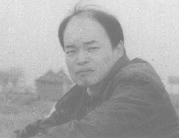

[图片描述：【待人工审查】小图（72x75像素），彩色图片（可能为插图、实物照片或数学图形）。章节：。上下文：「100千克
()桶
1吨
250千克
()只 货币
中国是世界上最早使用货币的国家之一，从夏代使用的海贝到现在的纸质人民币和数字人民币，货币经历了多次重大变革，我们简单回顾一下。
我国最早的货币是夏代使用的海贝，到商和西周时期已成为流通中的」]

货币

中国是世界上最早使用货币的国家之一，从夏代使用的海贝到现在的纸质人民币和数字人民币，货币经历了多次重大变革，我们简单回顾一下。

[图片描述：【待人工审查】彩色图片（插图/实物照片/数学图形）（176x189像素）。章节：。上下文：「1吨
250千克
()只
货币
中国是世界上最早使用货币的国家之一，从夏代使用的海贝到现在的纸质人民币和数字人民币，货币经历了多次重大变革，我们简单回顾一下。 我国最早的货币是夏代使用的海贝，到商和西周时期已成为流通中的主要货币。随着  商」]

我国最早的货币是夏代使用的海贝，到商和西周时期已成为流通中的主要货币。随着  商品经济的发展，天然的贝壳作为货币逐渐无法满足需求，于是开始出现人工制造的贝币， 有石贝、玉贝、骨贝、铜贝等。到了秦统一度量衡后，货币也统一了，圆形方孔的半两铜钱成为法定货币，从此我国外圆内方的货币形状一直沿用到清末。

[图片描述：【待人工审查】彩色图片（插图/实物照片/数学图形）（196x183像素）。章节：。上下文：「250千克
()只
货币
中国是世界上最早使用货币的国家之一，从夏代使用的海贝到现在的纸质人民币和数字人民币，货币经历了多次重大变革，我们简单回顾一下。
我国最早的货币是夏代使用的海贝，到商和西周时期已成为流通中的主要货币。随着  商品经济」]

唐代改革币制，废除轻重不一的古钱，取“开辟新纪元”之意，统一铸造“开元通宝”钱。 开元通宝钱是我国最早的通宝钱，自此钱币不再以质量，而是以纪年作为名称， 一直沿用到辛亥革命后的“民国通宝”。

[图片描述：【待人工审查】彩色图片（插图/实物照片/数学图形）（243x403像素）。章节：。上下文：「()只
货币
中国是世界上最早使用货币的国家之一，从夏代使用的海贝到现在的纸质人民币和数字人民币，货币经历了多次重大变革，我们简单回顾一下。
我国最早的货币是夏代使用的海贝，到商和西周时期已成为流通中的主要货币。随着  商品经济的发展，天然」]
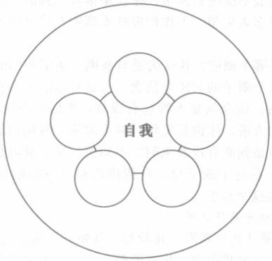

到了宋代，随着经济的发展，社会对货币的需求快速增加，但是由于金属铜的供不应求，为弥补铜钱不足， 一些地区铸造了铁钱。当时四川所铸铁钱一贯就重达二十五斤八两，由于铁钱笨重不方便携带，纸币“交子”就在四川地区应运而生。交子是我国也是世界上最早出现的纸币。
到了元代，纸币已成为基本流通货币，同时白银也开始作为货币流通。明朝推行纸币政策，发行“大明宝钞”与铜钱并用。清朝货币以白银为主，小额交易一般用铜钱，光绪时期开始正式铸造银元。1914年中华民国政府确定以银元为主要流通货币，1935年国民党政府推行法币政策，但是因为抗日战争等因素影响，导致法币贬值，民间多数人继续用银元交易。
1948年12月1日，在中国共产党的领导下，解放区的地方人民政府联合决定成立中国

[图片描述：【待人工审查】浅色/白色细长条带（1036x63像素）。章节：。]

人民银行，并发行第一套人民币。中华人民共和国成立以后，确定了人民币成为我国的法定货币，人民币的基本单位为元，辅助单位为角、分。
1元=10角，1角=10分，1元=100分。
自从发行第一套人民币以来，随着经济的不断发展，至今我国已发行五套人民币，形成纸币与金属币、数字人民币等多品种、多系列的货币体系。1999年10月1日，中国人民银行陆续发行第五套人民币，共有1角、5角、1元、5元、10元、20元、50元、100元八种面额，其中 1角、5角、1元有纸币和硬币2种。第五套人民币根据市场流通需要，增加了20元面额，取消了2元面额，使面额结构更加合理。
随着人工智能、大数据、互联网和数字化的发展，现在人们日常消费大多数进入了电子支付时代，纸质人民币的流通越来越少。为了提高货币的安全性和运行效率，提升金融服务水平，促进数字经济的健康发展，中国人民银行于2020年发行数字形式的法定货币，即数字人民币，并于2020年4月开始陆续在深圳、苏州等城市进行数字人民币流通试点，目前已经在很多省市试点。至此，我国形成了纸质人民币和数字人民币共存，现金支付、电子支付、数字人民币支付共存的支付体系。

[图片描述：【待人工审查】小图（96x65像素），浅色图形（可能为几何图形线框、空白方格或浅色插图）。章节：。上下文：「1948年12月1日，在中国共产党的领导下，解放区的地方人民政府联合决定成立中国
人民银行，并发行第一套人民币。中华人民共和国成立以后，确定了人民币成为我国的法定货币，人民币的基本单位为元，辅助单位为角、分。
1元=10角，1角=10分，1」]

[图片描述：【待人工审查】浅色/白色细长条带（930x69像素）。章节：。]

[图片描述：【待人工审查】极深色小图，疑为实心圆点/黑色符号（940x3像素）。章节：。]

[图片描述：【待人工审查】极深色小图，疑为实心圆点/黑色符号（940x4像素）。章节：。]

我们前面知道了，任意一个整数都是由若干个计数单位累加组成的，这个计数法则非常重要，在讨论整数的性质和计算等知识时，都用得到。喜欢数学的同学， 一定听说过著名的 “哥德巴赫猜想”吧，这个猜想至今还没有被证明。本节内容讨论与该猜想有关的知识，数学学科分类中把这门学科称为“数论”。

[图片描述：【待人工审查】小图（71x74像素），彩色图片（可能为插图、实物照片或数学图形）。章节：。上下文：「人民银行，并发行第一套人民币。中华人民共和国成立以后，确定了人民币成为我国的法定货币，人民币的基本单位为元，辅助单位为角、分。
1元=10角，1角=10分，1元=100分。
自从发行第一套人民币以来，随着经济的不断发展，至今我国已发行五套人」]

因数和倍数

(一)倍的含义
大家一定知道“事半功倍”这个成语，其中蕴含着数学概念——倍。我们来认识倍这个概念，下面有两行图形：
□□
OO    OO    OO
我们在一年级就学过用减法比较两个数量的多少，6-2=4,O  比□多4个。除了用减法比较两个数量的多少，还可以用除法比较两个数量的多少。
□有2个，○有6个，把2个看作一份，那么6个就有这样的3份，就说〇的个数是□的 3 倍 。
请思考：
①如果○变成8个，□不变，那么○的个数是□的几倍?
②如果○不变，□变成3个，那么○的个数是□的几倍?
③如果〇变成12个，□变成4个，那么○的个数是□的几倍?
倍表示两个数之间的份数关系、包含关系、依存关系，其中的一份数是比较的标准量、单位量。
你能归纳出倍的定义吗?
倍的定义： 一个数里包含几个另一个数，就说一个数是另一个数的几倍。
倍的知识点如下。

(1)求一个数的几倍是多少，用乘法。
例    足球有6个，篮球的数量是足球的3倍，篮球有多少个?

把足球的个数看作一份数，篮球的数量有3份，求篮球有多少个，用乘法计算。6×3= 18(个)。
(2)求一个数是另一个数的几倍，用除法。

例    足球有6个，篮球有18个，篮球的数量是足球的多少倍?

把足球的个数看作一份数，看篮球的数量有几份，就是求18里有几个6,用除法计算。
18÷6=3。
注意：倍表示两个数(量)之间的份数关系、包含关系，后面不写单位名称。
(二)因数和倍数的含义
我们在二年级就学习过两种整数除法：有余数的除法和没有余数的除法。我们可以把没有余数换一种说法，称为余数为0。我们先来研究余数为0的整数除法和相应的乘法。
例    观察下面两组算式，你能发现什么?
4×2=8                       9×3=27
2×4=8                       3×9=27
8÷2=4                       27÷3=9
8÷4=2                       27÷9=3

这是我们熟悉的三数四式，除法是乘法的逆运算，实际上只要给出其中任何一个算式， 都可以写出相应的其他三个算式。我们还学习了倍的概念，知道倍表示两个数(量)之间的关系。例如通过算式2×4=8,或者8÷2=4,都可以得出结论：8是4的2倍，8是2的4倍。 3×9=27,或者27÷3=9,都可以得出结论：27是3的9倍，27是9的3倍。我们给整数之间这样的倍的关系，起新的名字：因数(也叫约数)、倍数。在上面的算式中，8是2的倍数，2  是8的因数；8是4的倍数，4是8的因数。因数和倍数是一对相互依存的概念，是两个整数之间的关系，不能单独说8是倍数，2是因数，一定得说成：8是2的倍数，2是8的因数。
你能根据9×3=27,说说这个算式中的因数和倍数之间的关系吗?

[图片描述：【待人工审查】浅色/白色细长条带（1167x68像素）。章节：。]

现在我们可以用字母表达因数和倍数的依存关系，考虑到这个知识的难度，我们把整数的研究范围限定在正整数。关于正整数a 和b, 如果存在一个正整数q, 有等式a=bq   成立，我们就说a 是b 的倍数，b 是a 的因数。实际上a 也是q 的倍数，q 也是a 的因数。例如，关于正整数27和9,存在一个正整数3,有等式27=9×3成立。我们就说27是9的倍数，9是27的因数。实际上27也是3的倍数，3也是27的因数。
(三)找一个数的因数和倍数
我们知道了因数和倍数的含义，那么,如何找出任意一个正整数的因数和倍数呢?我们可以根据余数为0的除法和相应的乘法进行研究。
例    观察下面的算式，你能找出24的所有因数吗?你能发现什么?
24÷1=24,24÷2=12,24÷            3=8,…

通过有序列举，我们可以找到24的所有因数。虽然这有一点麻烦，但是能够做到不重不漏。
你能用这样的方法找出36的所有因数吗?
我们可以把24和36的所有因数写在集合圈里。

24的因数

[图片描述：【待人工审查】扫描区域近白（亮度243/255），未见有效内容，可能是版面空白区、分隔页或OCR空白段。章节：。]

36的因数

[图片描述：【待人工审查】扫描区域近白（亮度242/255），未见有效内容，可能是版面空白区、分隔页或OCR空白段。章节：。]

通过进一步观察可以发现：一个正整数的最小因数是1,最大因数是它本身。
例    观察下面的算式，你能找出2的所有倍数吗?你能发现什么?
2×1=2,2×2=4,2×3=6          , …

通过有序列举，我们可以找到2的一部分倍数，很显然，2的倍数好像无法全部列举出来。 你能用这样的方法找出3和5的倍数吗?
我们可以把2、3和5的倍数写在集合圈里。
2的倍数               3的倍数               5 的倍数

[图片描述：【待人工审查】扫描区域近白（亮度245/255），未见有效内容，可能是版面空白区、分隔页或OCR空白段。章节：。]

[图片描述：【待人工审查】浅色/白色细长条带（1165x67像素）。章节：。]

通过进一步观察可以发现：
(1)一个正整数的最小倍数是它本身，没有最大的倍数。
(2)一个正整数的因数的个数是有限的， 一个正整数的倍数的个数是无限的。
我们还可以用字母表示一个正整数的倍数，设a 为任意一个正整数，那么所有倍数构成一个数列：a,2a,3a, … ,            其中第n 项为na。
(3)一个数的倍数的性质。
我们知道，一个数的倍数有无数个，例如，2的倍数有2,4,6, …。观察下面的算式，你能发现什么?
2+4=6=2×3,6+10=16=2×8, …
2+4+6=12=2×6,4+6+8=18=2×9, …
通过观察和比较可以发现，任意两个或者多个2的倍数之和，仍然是2的倍数。你能再举例说明这个规律吗?
我们可以得到一个性质：一个正整数的两个倍数之和，仍然是这个数的倍数。下面我们用字母表示这个性质，设a 、b 、q 、m 、n 均是正整数，a 是 q 的倍数，b 也是q  的倍数，即a=
mq,b=nq,       那么a+b=mq+nq=(m+n)q,                   显然(m+n)      也是正整数，所以(a+b)也是
q 的倍数。
由这个性质可以推出另一个推广的性质： 一个正整数的多个倍数之和，也是这个数的倍数。
请举例研究一个问题： 一个正整数的若干个倍数及一个非倍数之和，是否为这个数的倍数?

[图片描述：【待人工审查】扫描区域近白（亮度241/255），未见有效内容，可能是版面空白区、分隔页或OCR空白段。章节：。]

[图片描述：【待人工审查】浅色/白色细长条带（1172x68像素）。章节：。]

[图片描述：【待人工审查】小图（71x74像素），彩色图片（可能为插图、实物照片或数学图形）。章节：。上下文：「我们可以得到一个性质：一个正整数的两个倍数之和，仍然是这个数的倍数。下面我们用字母表示这个性质，设a 、b 、q 、m 、n 均是正整数，a 是 q 的倍数，b 也是q  的倍数，即a=
mq,b=nq,       那么a+b=mq+nq」]

奇数和偶数

(一)2、5和3的倍数的特征
所谓的2、5和3的倍数的特征，其含义是：已知一个正整数是2、5或者3的倍数，这个数有什么特点?
现行的教材是通过观察百数表来研究这部分知识的，但是对于相关知识背后的数学原理和思想没有深入研究。我们现在通过正整数的意义来研究。我们知道，任意一个正整数是由若干个计数单位累加组成的，为了容易理解，我们先用具体的三位数来研究，把任意一个三位数按照计数单位分解与组合。
例    932、214、576、798都是2的倍数。阅读理解下面的分析过程，2的倍数有什么特征? 你能发现什么?

932=(900+30)+2=(90+3)×10+2=(90+3)×5×2+2。实际上任意一个三位数，无论十位数和百位数是几，都是10的倍数，当然也是2的倍数。所以分解与组合的思路是：把932分解成两部分，左边括号中的部分包含若干个百和十，一定是2的倍数；右边的部分就是932个位上的数字，现在只需要考察2是否为2的倍数即可。显然2是2的倍数，所以932的个位数是2的倍数。
其他的多位数也符合这个分解原理。
这里补充说明，任意一个正整数a,a×0=0,         除法是乘法的逆运算，所以0÷a=0 。  可
以得出一个结论：0是任意一个正整数的倍数，任意一个正整数是0的因数。

[图片描述：【待人工审查】浅色/白色细长条带（1161x69像素）。章节：。]

现在来看个位是0的2的倍数，560=500+60+0,显然个位数0是2的倍数。
综上所述，可以总结2的倍数的特征：任意一个2的倍数，个位数一定是2的倍数。即2 的倍数的个位数一定是：0、2、4、6、8。
例如214、576、798中的个位数4、6、8,都是2的倍数。
你能举例说明2的倍数的特征吗?
研究了2的倍数的特征，接下来研究5的倍数的特征。你能运用上面的原理和方法，研究5的倍数的特征吗?
无论一个正整数是几位数，十位、百位以上的部分一定是5的倍数，只要这个正整数的个位数是5的倍数，这个数就一定是5的倍数，所以，5的倍数的性质是：5的倍数的个位数是5 的倍数，即个位数是0或5。
下面我们按照正整数的分解组合来研究3的倍数的特征。
我们知道10=9+1,100=99+1,1000=999+1, …显然，由若干个9组成的几位数一定是3的倍数，因为9=3×3,99=33×3,999=333×3, … 。
例    126和234都是3的倍数。阅读理解下面的分析过程，3的倍数有什么特征?
你能发现什么?

126=100+20+6,显然100和20都不是3的倍数，按照2和5的倍数的特征的研究方法，如何把126分解成两部分，使这两部分都是3的倍数，而且第一部分占大头?我们根据计数单位与若干个9的关系来分解，126=100+20+6=(99+1)+(9×2+2)+6=(99+9× 2)+(1+2+6)。分解与组合的思路是：我们把126分解成括号中的两部分的和，左边括号中的部分包含若干个9,一定是3的倍数；右边括号中的部分显然就是126各个数位上的数字之和，1+2+6=9,显然各位上的数字之和是3的倍数。
再来看234,234=200+30+4=(99×2+2)+(9×3+3)+4=(99×2+9×3)十(2+3+4),2+3+4=9,9是3的倍数，所以各位上的数字之和是3的倍数。
再看一个四位数6237=(999×6+6)+(99×2+2)+(9×3+3)+7=(999×6+99× 2+9×3)+(6+2+3+7),6+2+3+7=18,18是3的倍数，所以各位上的数字之和是 3的倍数。
通过上面的分析过程，可以发现3的倍数的特征：3的倍数的各个数位上的数字之和是3 的倍数。

[图片描述：【待人工审查】浅色/白色细长条带（1171x66像素）。章节：。]

(二)一个数是否为 2 、 5 和 3 的倍数的判定
我们通过上面的研究，知道了给出一个任意的2、5、3的倍数，各具有什么特征。反过来说，如何判定任意一个正整数，是否为2的倍数、5的倍数、3的倍数呢?实际上，根据上面的分析过程，就发现了判定方法：
(1)一个任意正整数，如果它的个位数字是0、2、4、6、8,那么这个数一定是2的倍数。
(2)一个任意正整数，如果它的个位数字是0或5,那么这个数一定是5的倍数。
(3)一个任意正整数，如果它各个数位上的数字之和是3的倍数，那么这个数一定是3 的倍数。
你能举例判定一个数是否为3的倍数吗?
(三)奇数和偶数
我们已经学习了2的倍数，接下来我们利用这个知识，对整数进行分类。首先我们确定分类的标准：是否为2的倍数。
所有的整数，是2的倍数的数叫做偶数，不是2的倍数的数叫做奇数。
也就是说，整数可以分为两类：奇数和偶数。

[图片描述：【待人工审查】扫描区域近白（亮度240/255），未见有效内容，可能是版面空白区、分隔页或OCR空白段。章节：。]

例    奇数与奇数的和，是奇数还是偶数?偶数与偶数的和呢?奇数与偶数的和呢?

我们小学生研究问题，往往喜欢用具体的例子，或者借助几何直观、数形结合，这样更容易理解。
我们还没有学习负数的计算，所以现在只在非负数的范围讨论。
方法一：把奇数和偶数列表，可以自己加自己或者随机相加，按照结果的大小排序，见下表。

[图片描述：【待人工审查】浅色/白色细长条带（1165x67像素）。章节：。]

通过观察表格里加数与和的关系，可以发现规律，归纳结论：

奇数+奇数=偶数，偶数+偶数=偶数，奇数+偶数=奇数。

方法二：数形结合法。
奇数和偶数，可以用图形表示，当然图形的不足之处是0无法表达。

[图片描述：【待人工审查】彩色图片（插图/实物照片/数学图形）（378x334像素）。章节：。上下文：「方法一：把奇数和偶数列表，可以自己加自己或者随机相加，按照结果的大小排序，见下表。
通过观察表格里加数与和的关系，可以发现规律，归纳结论：
奇数+奇数=偶数，偶数+偶数=偶数，奇数+偶数=奇数。
方法二：数形结合法。
奇数和偶数，可以用图形」]

(四)用字母表示数
前面研究数的性质，用具体的数进行研究。例如，2的倍数是偶数，0,2,4, …都是偶数；不是2的倍数的数是奇数，1,3,5,…都是奇数。奇数和偶数都是无限的，通过举例是举不完的 。
那么如何表示这些无限个数呢?数学家帮我们想出了方法，可以用字母表示数，根据偶数的定义，任意一个整数的2倍一定是偶数，可以用n 表示任意一个整数，那么2n 一定是偶数，因为 n 可以表示所有的整数，所以2n 可以表示所有的偶数。根据奇数的定义，任意一个偶数加1就是奇数，那么2n+1  就可以表示所有的奇数。用字母表示数，不但简洁，而且上升到了一般性。
上面的例题，就可以用字母表示数来进行推导。
方法三：用字母表示奇数和偶数，进行推理。
设 m 和n 是整数，那么2m 和 2n 表示偶数，2m+1   和 2n+1   表示奇数。
奇数+奇数：(2m+1)+(2n+1)=2m+2n+1+1=2m+2n+2=2(m+n+1),                                     显
然 m+n+1       是整数，所以2(m+n+1)        是偶数，即奇数+奇数的和是偶数。
你能自己完成偶数+偶数和奇数+偶数的推导过程吗?

[图片描述：【待人工审查】浅色/白色细长条带（947x40像素）。章节：。]

[图片描述：【待人工审查】小图（96x56像素），浅色图形（可能为几何图形线框、空白方格或浅色插图）。章节：。上下文：「方法三：用字母表示奇数和偶数，进行推理。
设 m 和n 是整数，那么2m 和 2n 表示偶数，2m+1   和 2n+1   表示奇数。
奇数+奇数：(2m+1)+(2n+1)=2m+2n+1+1=2m+2n+2=2(m+n+1),    」]
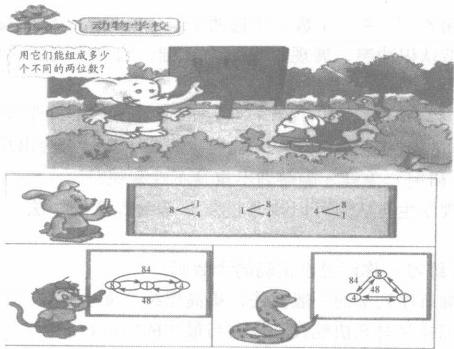

[图片描述：【待人工审查】极深色小图，疑为实心圆点/黑色符号（833x4像素）。章节：。]

[图片描述：装饰条：橙色/红色渐变横条，为页面装饰分隔条。]

1  用数字0、3、4、5组成的三位数中，把符合要求的写在下面相应的横线上。
奇数：                   偶数：
2的倍数：                 5的倍数：
3的倍数 ：              既是2的倍数，又是3的倍数：

[图片描述：【待人工审查】小型图片碎片（亮度147），疑为装饰图标或数学符号（43x46像素）。章节：。]

按要求在   里填数。

[图片描述：【待人工审查】极深色小图，疑为实心圆点/黑色符号（200x3像素）。章节：。]

(1)26      是2的倍数，   里最大填(   。

(2)3  5是3的倍数 ， 里最小填(   )。
(3)47       是5的倍数，    里最小填(   )。
3  根据一个数是否为2、3的倍数的判定方法，如何判定一个数是否为4、6 和11的倍数?举例说明。
4  奇数与奇数的积是奇数还是偶数?奇数与偶数的积是奇数还是偶数?偶数与偶数的积呢?
你能用字母表示数进行推导吗?

[图片描述：【待人工审查】小图（72x72像素），彩色图片（可能为插图、实物照片或数学图形）。章节：。上下文：「(2)3  5是3的倍数 ， 里最小填(   )。
(3)47       是5的倍数，    里最小填(   )。
3  根据一个数是否为2、3的倍数的判定方法，如何判定一个数是否为4、6 和11的倍数?举例说明。
4  奇数与奇数的积是」]

质数与合数

(一)质数与合数的定义
现在我们把讨论的数的范围限定在大于1的正整数，因为0和1比较特殊，0的因数有无数个(不包括0),1的因数只有它本身。
现在我们给大于1的整数分类，分类的标准是含有因数的个数： 一类是只含有1和它本身这两个因数的数，另一类是除了含有1和它本身这两个因数，还有其他的因数的数。先把 2—20各数进行分类，可以用列举法。
2的因数：1、2;

3的因数：1、3;
4的因数：1、2、4;
5的因数：1、5;
6的因数：1、2、3、6;

通过有限列举，可以发现，2～20的整数分类如下：
只含有1和它本身这两个因数的数有：2、3、5、7、11、13、17、19。
只含有1和它本身这两个因数的数，叫做质数，也叫做素数。
除了含有1和它本身这两个因数，还有其他的因数的数有：4,6,8,9,10,12,14,15, 16,18,20。
除了含有1和它本身这两个因数，还有其他的因数的数，叫做合数。
0和1,既不是质数，也不是合数。
我们已经把2～20的整数中的质数与合数都找出来了，在大于1的无数个整数中，到底哪些是质数，哪些是合数，怎么找呢?
例    1～100的整数中，你有什么好的方法找出质数与合数吗?

前面已经找出了20以内的质数与合数，如果从21开始， 一个一个地找，肯定可以全部找出来，但是比较麻烦。有没有更好的方法呢?我们已经学习了2、3、5的倍数，奇数和偶数等知识，可以利用这些知识帮助我们找。为了方便，我们给出百数表。

[图片描述：【待人工审查】小图（96x67像素），浅色图形（可能为几何图形线框、空白方格或浅色插图）。章节：。上下文：「除了含有1和它本身这两个因数，还有其他的因数的数，叫做合数。
0和1,既不是质数，也不是合数。
我们已经把2～20的整数中的质数与合数都找出来了，在大于1的无数个整数中，到底哪些是质数，哪些是合数，怎么找呢?
例    1～100的整数中，」]

第一步，把偶数找出来：2,4, …,100,这些数都是2的倍数。除了2以外的偶数，它们除了1和它本身，至少都有2这个因数，所以都是合数；
第二步，把奇数找出来：3,5,7, …,99。先找出3的倍数3,9,15, …,99,这些数都是合数；再找出5的倍数5,25, …,95,这些数都是合数；接着找出7的倍数49,77,91,这些数都是合数。剩余的就是质数，有2,3,5,7,11,13,17,19,23,29,31,37,41,43,47, 53,59,61,67,71,73,79,83,89,97。共计25个质数。
如果能够理解并记住这些质数，对于今后的数学学习非常有帮助。

(二) * 分解质因数
学习了因数和倍数，以及质数与合数等知识，我们就可以把任意一个合数分解成几个质数相乘的形式。例如，4=2×2,6=2×3,8=2×2×2,9=3×3, … 。
从这些算式中可以看出，2是质数，又是4的因数；3是质数，又是6的因数；我们就说2 是4的质因数，3是6的质因数。
设正整数a 和质数p,如果p 是a 的因数，那么就说p 是a 的质因数。把一个正整数分解成若干个质因数乘积的形式，叫做分解质因数。
那么,如何把任意一个正整数分解质因数呢?运用2、3、5等数的倍数的特征，用特殊的一种除法——短除法来找。
例把345分解质因数。

[图片描述：【待人工审查】扫描区域近白（亮度246/255），未见有效内容，可能是版面空白区、分隔页或OCR空白段。章节：。]

所以345=3×5×23。
观察下面的算式，你能发现什么?
4=2+2,6=3+3,8=5+3,10=7+3,12=7+5,14=11+3,…,
是不是所有大于2的偶数，都可以表示为两个质数的和呢?
这个问题是德国数学家哥德巴赫最先提出的，所以被称作哥德巴赫猜想。哥德巴赫猜想看似简单，但要证明却非常困难，因而成为数学中一个著名的难题，被称为“数学皇冠上的明珠”。
世界各国的数学家都想攻克这一难题，但至今还未解决。我国数学家陈景润在这一领域取得了举世瞩目的成果。

[图片描述：【待人工审查】小图（158x54像素），彩色图片（可能为插图、实物照片或数学图形）。章节：。上下文：「观察下面的算式，你能发现什么?
4=2+2,6=3+3,8=5+3,10=7+3,12=7+5,14=11+3,…,
是不是所有大于2的偶数，都可以表示为两个质数的和呢?
这个问题是德国数学家哥德巴赫最先提出的，所以被称作哥德巴赫猜想。哥德」]

1  一个三位数，个位上的数是最小的合数，十位上的数是最小质数的3倍， 百位上的数比十位与个位上的数的和少1。这个三位数是多少?
2  把210分解质因数。
3  两个质数的和是18,积是65,这两个质数的差是多少?

[图片描述：【待人工审查】小型图片碎片（亮度150），疑为装饰图标或数学符号（45x44像素）。章节：。]

王老师家的电话号码有七位，用字母表示为ABCDEFG 。    你能猜出是多少吗?

提示 ：
A——3的最大因数   B——最小的质数 D——它既是6的倍数，又是6的因数
E——它的所有因数是1、2、4、8
F——最小的合数
G——它的所有因数是1、3、9

C——7 的最小因数

[图片描述：【待人工审查】小型图片碎片（亮度173），疑为装饰图标或数学符号（949x2像素）。章节：。]

这个电话号码是(                 )。

[图片描述：装饰块：橙红色圆角矩形色块，为页面装饰元素，无教学内容。]

生活中，有很多领域利用了质数的独特性质，例如，齿数为质数的齿轮可以更平均地分配磨损；RSA 加密算法是第一个实用的公钥密码算法，它巧妙地利用了大数很难分解质因数的特点。

[图片描述：【待人工审查】彩色图片（插图/实物照片/数学图形）（168x231像素）。章节：。上下文：「F——最小的合数
G——它的所有因数是1、3、9
C——7 的最小因数
这个电话号码是(                 )。
生活中，有很多领域利用了质数的独特性质，例如，齿数为质数的齿轮可以更平均地分配磨损；RSA 加密算法是第一个实用」]

[图片描述：【待人工审查】深色图片（照片/深色图标）（338x231像素）。章节：。上下文：「F——最小的合数
G——它的所有因数是1、3、9
C——7 的最小因数
这个电话号码是(                 )。
生活中，有很多领域利用了质数的独特性质，例如，齿数为质数的齿轮可以更平均地分配磨损；RSA 加密算法是第一个实用」]

上网查一查，了解其中的奥秘吧!

[图片描述：【待人工审查】扫描区域近白（亮度243/255），未见有效内容，可能是版面空白区、分隔页或OCR空白段。章节：。]

[图片描述：【待人工审查】小图（70x75像素），彩色图片（可能为插图、实物照片或数学图形）。章节：。上下文：「G——它的所有因数是1、3、9
C——7 的最小因数
这个电话号码是(                 )。
生活中，有很多领域利用了质数的独特性质，例如，齿数为质数的齿轮可以更平均地分配磨损；RSA 加密算法是第一个实用的公钥密码算法，它」]

最大公因数和最小公倍数

我们学习了因数和倍数的很多知识，现在我们继续研究与几个正整数的因数和倍数有关的知识，它们在今后的学习中非常有用。
(一)最大公因数
先来研究36和24的因数。
例    24的因数有哪些?36的因数有哪些?它们公有的因数有哪些?其中最大的
是多少?

为了直观起见，我们用集合圈表示。

24的因数

[图片描述：【待人工审查】扫描区域近白（亮度243/255），未见有效内容，可能是版面空白区、分隔页或OCR空白段。章节：。]

36的因数

[图片描述：【待人工审查】扫描区域近白（亮度246/255），未见有效内容，可能是版面空白区、分隔页或OCR空白段。章节：。]

把两个集合圈相交在一起。

24的因数       36的因数

[图片描述：【待人工审查】扫描区域近白（亮度246/255），未见有效内容，可能是版面空白区、分隔页或OCR空白段。章节：。]

24和36公有的因数

可以看出，24和36公有的因数有：1、2、3、4、6、12,其中最大的是12。
几个正整数公有的因数，叫做它们的公因数，其中最大的公因数，叫做它们的最大公因数 。1、2、3、4、6、12是24和36的公因数，12是24和36的最大公因数，记作(24, 36)=12。
如果两个数的最大公因数是1,那么这两个数叫做互质数。例如8和9的最大公因数是
1,那么8与9是互质数，或者说8与9互质。

[图片描述：【待人工审查】扫描区域近白（亮度241/255），未见有效内容，可能是版面空白区、分隔页或OCR空白段。章节：。]

那么怎样求两个数的最大公因数呢?

例求36和48的最大公因数。

我们用短除法来求，先观察两个数，看看用2、3、5、7等质数能否去除，当然，如果明显能够看出可以用4、6去除，也是可以的。

[图片描述：【待人工审查】扫描区域近白（亮度244/255），未见有效内容，可能是版面空白区、分隔页或OCR空白段。章节：。]

通过除法计算，发现4和3都是36与48的公因数，那么36与48的最大公因数就是4× 3,即(36,48)=12。
(二)最小公倍数
先来研究4和6的倍数。

例    4的倍数有哪些?6的倍数有哪些?它们公有的倍数有哪些?其中最小的是
多少?

4的倍数有：4,8,12,16,20,24,28,32,36, … ;
6的倍数有：6,12,18,24,30,36, … ;
4和6公有的倍数有：12,24,36, …。
可以用集合圈表示。

4的倍数          6的倍数

[图片描述：【待人工审查】扫描区域近白（亮度248/255），未见有效内容，可能是版面空白区、分隔页或OCR空白段。章节：。]

4,8,16
20,28,32,

4和6公有的倍数

4和6公有的倍数有：12,24,36, …其中最小的是12。
几个正整数公有的倍数，叫做它们的公倍数，其中最小的公倍数(0除外),叫做它们的最小公倍数。12,24,36, … 都是4和6的公倍数，12是4和6的最小公倍数，记作[4,

[图片描述：【待人工审查】浅色/白色细长条带（1166x66像素）。章节：。]

6]=12。
通过观察4和6的公倍数与最小公倍数的倍数关系，可以发现：12是12的倍数，24, 36, …都是12的倍数。
你能举例说明这个发现吗?
现在我们归纳出一个性质：两个正整数的公倍数都是它们的最小公倍数的倍数。
那么怎样求两个数的最小公倍数呢?
例求28和42的最小公倍数。

我们用短除法来求，先给出两个数，看看用2、3、5、7等质数能否去除。

[图片描述：【待人工审查】扫描区域近白（亮度243/255），未见有效内容，可能是版面空白区、分隔页或OCR空白段。章节：。]

通过除法计算，发现2和7都是28与42的公因数，把28和42分解质因数：
28=2×7×2,
42=2×7×3。
14是28与42的最大公因数，即(28,42)=14。
进一步观察发现，28与42,除了最大公因数14,分别还有质因数2和3,为了求出28与 42的最小公倍数，把28乘3,42乘2,可得
28×3=2×7×2×3=84,
42×2=2×7×3×2=84。
所以28与42的最小公倍数是84,[28,42]=84。
下面我们探究两个正整数的积，与它们的最大公因数和最小公倍数的积之间的关系。
例*   观察28与42,36与45,它们的最大公因数与最小公倍数的积，与两个数的积之间有什么关系?

(28,42)=14,[28,42]=84,
14×84=(2×7)×(2×7×2×3),
28×42=(2×7×2)×(2×7×3)=(2×7)×(2×7×2×3);

(36,45)=9,[36,45]=180,
9×180=9×(9×4×5),
36×45=(9×4)×(9×5)=9×(9×4×5)。
通过观察和比较可以发现：两个正整数的最大公因数与最小公倍数的积，等于这两个数的积。
你能举例说明这个发现吗?
由此可以得出一个性质：两个正整数的最大公因数与最小公倍数的积，等于这两个数的积。
你能用字母表示这个性质吗?
两个正整数a 、b, 那么(a,b)[a,b]=ab。

[图片描述：【待人工审查】极深色小图，疑为实心圆点/黑色符号（949x2像素）。章节：。]

[图片描述：【待人工审查】小图（159x54像素），彩色图片（可能为插图、实物照片或数学图形）。章节：。上下文：「通过观察和比较可以发现：两个正整数的最大公因数与最小公倍数的积，等于这两个数的积。
你能举例说明这个发现吗?
由此可以得出一个性质：两个正整数的最大公因数与最小公倍数的积，等于这两个数的积。
你能用字母表示这个性质吗?
两个正整数a 、b,」]

1  a、b为非0自然数，a=b+1,  那么a 和b 的最大公因数是(   ),a 和b 的最小公倍数是(    )。
2  a、b和c 是三个自然数(b、c不等于0),在a=b×c  中，不一定成立的是 (    )。
A.a  一定是b 的倍数                 B.a   一定能被c 整除
C.a 一定是b 和c 的最小公倍数        D.b  一定是a 的因数
3  李阿姨家的月季每4天浇一次水，君子兰每6天浇一次水。李阿姨5月1日
给月季和君子兰同时浇了水，下一次再给这两种花同时浇水应是5月几日?

[图片描述：【待人工审查】彩色图片（插图/实物照片/数学图形）（680x203像素）。章节：。上下文：「2  a、b和c 是三个自然数(b、c不等于0),在a=b×c  中，不一定成立的是 (    )。
A.a  一定是b 的倍数                 B.a   一定能被c 整除
C.a 一定是b 和c 的最小公倍数      」]

星期日星期一星期二星期三星期四星期五星期六

C
五月

41路和3路公共汽车的起点站相同，1路公共汽车每6分钟发一次车，3路公共汽车每8分钟发一次车。这两路公共汽车同时发车后，过多少分钟第二次同时发车?

[图片描述：【待人工审查】浅色/白色细长条带（1164x68像素）。章节：。]

[图片描述：【待人工审查】极深色小图，疑为实心圆点/黑色符号（942x3像素）。章节：。]

[图片描述：【待人工审查】极深色小图，疑为实心圆点/黑色符号（940x2像素）。章节：。]

分数是公认的学习难点，如果从数的产生历史来看，分数要远远早于小数，那么为什么分数的概念这么难理解呢?是因为分数如果不化成小数的形式，它的写法与整数、小数的十进位值制计数法不同，而且内涵更丰富，既可以表示量的大小，又可以表示两个量之间的关系，还可以表示除法运算的商，等等。那么,我们应如何理解分数呢?在学习分数的时候，不能脱离整数，整数的核心是计数单位及其个数，那么数系从整数扩充到分数后，分数是否与整数具有一致性呢?

[图片描述：【待人工审查】小图（72x75像素），彩色图片（可能为插图、实物照片或数学图形）。章节：。上下文：「星期日星期一星期二星期三星期四星期五星期六
C
五月
41路和3路公共汽车的起点站相同，1路公共汽车每6分钟发一次车，3路公共汽车每8分钟发一次车。这两路公共汽车同时发车后，过多少分钟第二次同时发车?
分数是公认的学习难点，如果从数的产生历」]

分数的意义

(一)分数是数
我们前面学习了整数和自然数，从字面上理解，整数和自然数是对事物个数的度量结果，例如，一只羊、一头牛、一匹马，个数都是1,马、牛、羊都是自然存在的，是完整的，所以称为整数或者自然数。
那么,分数，从字面上理解，与整数和自然数相同的地方是，都有“数”这个字，所以它们都是“数”这个大家庭(集合)的成员。既然整数和自然数能够表示事物的个数，那么分数也应该能够表示事物的个数，但是，这个事物的个数不是自然的、完整的了，而是人为把它分开了。是怎么分开的呢?就是平均分开的，我们在二年级学习除法的时候，就知道平均分了。

[图片描述：【待人工审查】小型图片碎片（亮度233），疑为装饰图标或数学符号（21x57像素）。章节：。]

我们还是说一只羊，假设古代一个家庭2天吃一只羊，每天吃半只，那么就需要把一只羊  平均分成2份，其中的一份就是半只。半只是生活语言，怎么用数学符号表示呢?我们的祖先很聪明，因为这个半只羊比1只羊少，不能用一个自然数表示了，因为自然数0、1、2中的某一个都无法表示半只。自然数不够用了，所以得想办法创造新的数，这个新的数又不能脱离自然数，又不能只用一个自然数表示，所以经过研究，得用两个自然数表示这个新的数， 一个自然数表示把羊平均分成的份数，平均分成两份，就用2表示；另一个自然数表示一天吃的份数，用1表示，1和2放在一起表示一个新的数——分数。我们现在把分数写成的形式，

[图片描述：【待人工审查】扫描区域近白（亮度246/255），未见有效内容，可能是版面空白区、分隔页或OCR空白段。章节：。]

[图片描述：【待人工审查】浅色/白色细长条带（949x36像素）。章节：。]

[图片描述：【待人工审查】小型图片碎片（亮度228），疑为装饰图标或数学符号（20x50像素）。章节：。]

横线表示平均分，实际上分数的写法经过了多次的演变，现在全世界统一成这样的一般形

[图片描述：【待人工审查】小型图片碎片（亮度234），疑为装饰图标或数学符号（23x58像素）。章节：。]

[图片描述：【待人工审查】小型图片碎片（亮度228），疑为装饰图标或数学符号（20x50像素）。章节：。]

[图片描述：【待人工审查】扫描区域近白（亮度241/255），未见有效内容，可能是版面空白区、分隔页或OCR空白段。章节：。]

[图片描述：【待人工审查】小型图片碎片（亮度238），疑为装饰图标或数学符号（48x51像素）。章节：。]

式。那么用分数表示就是   就是半只的个数；1只变成只，实际上就是

[图片描述：【待人工审查】扫描区域近白（亮度240/255），未见有效内容，可能是版面空白区、分隔页或OCR空白段。章节：。]

[图片描述：【待人工审查】小型图片碎片（亮度230），疑为装饰图标或数学符号（38x50像素）。章节：。]

,所以于 1 。
进一步地，假设一个家庭5天吃一头牛，那么就需要把一头牛平均分成5份，其中的一份

[图片描述：【待人工审查】小型图片碎片（亮度233），疑为装饰图标或数学符号（35x50像素）。章节：。]

就是

[图片描述：【待人工审查】小型图片碎片（亮度223），疑为装饰图标或数学符号（15x49像素）。章节：。]

[图片描述：【待人工审查】小型图片碎片（亮度227），疑为装饰图标或数学符号（18x52像素）。章节：。]

就是一份的个数；1头变成了5个头，实际上就是

[图片描述：【待人工审查】扫描区域近白（亮度243/255），未见有效内容，可能是版面空白区、分隔页或OCR空白段。章节：。]

所

[图片描述：【待人工审查】小型图片碎片（亮度232），疑为装饰图标或数学符号（21x51像素）。章节：。]

[图片描述：【待人工审查】小型图片碎片（亮度230），疑为装饰图标或数学符号（20x54像素）。章节：。]

[图片描述：【待人工审查】小型图片碎片（亮度226），疑为装饰图标或数学符号（18x51像素）。章节：。]

[图片描述：【待人工审查】小型图片碎片（亮度232），疑为装饰图标或数学符号（24x50像素）。章节：。]

小于1。如果第一天吃头,第二天来了客人，需要吃2个头，就是   也小于1。
说了这么多，我们应该对分数不感到困惑了。数的产生，是随着社会发展的需求而不断扩充的，原来的数不够用了，就会创造新的数。从自然数扩充到分数，是一个巨大的飞跃。
(二)分数的含义
我们上面了解了分数的产生，初步认识了分数。上文我们进行平均分的时候，分的物体  是一只羊、一头牛等一个事物，实际上我们在分东西的时候，还可以分很多东西。例如，2个家庭联合狩猎，捕获了10只羊，两个家庭平均分， 一种分法是传统的除法，10÷2=5(只),每  个家庭分得5只；我们还可以用另外一种分法，就是不关心每个家庭具体分的只数，而是关心  每个家庭分到的羊占整体的份额或者比例，这时我们需要把10只羊看成一个整体，即把10只羊看成一群羊，用自然数1表示，这样在求每个家庭占比的时候，就是把一群羊平均分成2份，

[图片描述：【待人工审查】小型图片碎片（亮度233），疑为装饰图标或数学符号（23x58像素）。章节：。]

每个家庭得到群羊。这样的例子不胜枚举，还可以分8头牛、20只兔、100千克粮食，等等。
我们把一个事物或者多个事物组成的一个整体，看作单位“1”,把单位1平均分成若干  份，表示这样一份或几份占整体的大小的数，叫做分数。其中把单位1平均分成若干份的数， 叫做分母；表示这样一份或几份的数，叫做分子。
1  … … 分子
—   ……分数线
4  ……分母
分子是1的分数叫做分数单位，或者单位分数。分数单位与自然数的计数单位是一致

[图片描述：【待人工审查】小型图片碎片（亮度233），疑为装饰图标或数学符号（31x49像素）。章节：。]

[图片描述：【待人工审查】小型图片碎片（亮度199），疑为装饰图标或数学符号（61x49像素）。章节：。]

的，也是计数单位，是构成分数的基本单位。  , …都是分数单位，或者计数单位。

[图片描述：【待人工审查】浅色/白色细长条带（1173x69像素）。章节：。]

分数单位以外的分数，都是由若干个分数单位累加得到的，就像自然数也是由若干个计数单位累加得到的一样。这是分数与整数具有一致性的地方。

[图片描述：【待人工审查】小型图片碎片（亮度226），疑为装饰图标或数学符号（21x51像素）。章节：。]

例如123=1×100+2×10+3×1,而

由两个

[图片描述：【待人工审查】小型图片碎片（亮度235），疑为装饰图标或数学符号（26x51像素）。章节：。]

组成，可以写成

[图片描述：【待人工审查】扫描区域近白（亮度242/255），未见有效内容，可能是版面空白区、分隔页或OCR空白段。章节：。]

例    下面的分数墙上有哪些分数单位?仔细观察，你有什么发现?

[图片描述：【待人工审查】小图（421x54像素），浅色图形（可能为几何图形线框、空白方格或浅色插图）。章节：。上下文：「分数单位以外的分数，都是由若干个分数单位累加得到的，就像自然数也是由若干个计数单位累加得到的一样。这是分数与整数具有一致性的地方。
例如123=1×100+2×10+3×1,而
由两个
组成，可以写成
例    下面的分数墙上有哪些分数单位」]

组成。

[图片描述：【待人工审查】扫描区域近白（亮度244/255），未见有效内容，可能是版面空白区、分隔页或OCR空白段。章节：。]

[图片描述：【待人工审查】扫描区域近白（亮度246/255），未见有效内容，可能是版面空白区、分隔页或OCR空白段。章节：。]

组成 1 , 1 里面有 1 2 个

(三)分数的另一种含义
前面我们根据把单位1平均分定义分数，这样定义的前提条件是必须要先知道平均分为几份。实际上，生活中的平均分问题，有两种类型：
一是先知道平均分成几份，然后表达一份或几份的大小。例如，把一个月饼平均分成4

[图片描述：【待人工审查】小型图片碎片（亮度231），疑为装饰图标或数学符号（18x50像素）。章节：。]

块，每块是多少个?每块是
二是先知道分到的部分的大小，再求该部分占单位1的大小。例如， 一盒月饼有6个，已

[图片描述：【待人工审查】浅色/白色细长条带（1164x67像素）。章节：。]

经吃了2个，吃了的占一盒的几分之几?我们学过包含类型的除法，6÷2=3,可以认为把一

[图片描述：【待人工审查】小型图片碎片（亮度240），疑为装饰图标或数学符号（34x52像素）。章节：。]

盒月饼平均分成了3份，吃的2个占一份，所以吃了的占一盒的

(四)分数的两种应用
分数与自然数都是数，有很多一致性。
自然数有两种应用：一是表示数量的多少，例如1个人、2个苹果、3所学校，等等；二是表示两个数量之间的倍数关系，例如，妈妈买了2千克苹果、4千克西瓜，西瓜的质量是苹果的2倍。

[图片描述：【待人工审查】小型图片碎片（亮度237），疑为装饰图标或数学符号（23x57像素）。章节：。]

[图片描述：【待人工审查】小型图片碎片（亮度235），疑为装饰图标或数学符号（21x55像素）。章节：。]

[图片描述：【待人工审查】小型图片碎片（亮度237），疑为装饰图标或数学符号（23x55像素）。章节：。]

[图片描述：【待人工审查】小型图片碎片（亮度231），疑为装饰图标或数学符号（19x51像素）。章节：。]

类比自然数的两种应用，分数也有这样的两种应用：一是表示数量的多少，例如，个苹果、 个蛋糕、杯牛奶，等等。二是表示两个数量之间的倍数关系，把整数倍推广到分数倍； 例如，妈妈买了2千克苹果、4千克西瓜，苹果的质量是西瓜的倍，习惯上分数倍可以省略  “倍”字，直接说：苹果的质量是西瓜的
(五)分数的分类

[图片描述：【待人工审查】小图（78x51像素），彩色图片（可能为插图、实物照片或数学图形）。章节：。上下文：「(四)分数的两种应用
分数与自然数都是数，有很多一致性。
自然数有两种应用：一是表示数量的多少，例如1个人、2个苹果、3所学校，等等；二是表示两个数量之间的倍数关系，例如，妈妈买了2千克苹果、4千克西瓜，西瓜的质量是苹果的2倍。
类比自然数」]

[图片描述：【待人工审查】小型图片碎片（亮度236），疑为装饰图标或数学符号（28x48像素）。章节：。]

我们前面讨论的这些分数都有一个特点，就是分子都小于分母，都小于1,例如， ,等等；这些分数都是把单位1平均分后得到的，数学家给这样的分数起了一个名字，分子
小于分母的分数叫做真分数；很显然，真分数大于0、小于1。我们可以认为分数的本源是真分数，真分数是最原始的分数。

[图片描述：【待人工审查】小图（102x50像素），彩色图片（可能为插图、实物照片或数学图形）。章节：。上下文：「自然数有两种应用：一是表示数量的多少，例如1个人、2个苹果、3所学校，等等；二是表示两个数量之间的倍数关系，例如，妈妈买了2千克苹果、4千克西瓜，西瓜的质量是苹果的2倍。
类比自然数的两种应用，分数也有这样的两种应用：一是表示数量的多少，例」]

在前面讨论的分数中，除了真分数，还有一种情况，就是把单位1平均分成几份，就取几份，也就是说，分子等于分母。例如，,实际上这些分数都等于1,只不过这些分数把  自然数1写成了分数形式。2=1+1,3=1+1+1, …所以其他整数都可以写成分数的形式，

[图片描述：【待人工审查】扫描区域近白（亮度241/255），未见有效内容，可能是版面空白区、分隔页或OCR空白段。章节：。]

[图片描述：【待人工审查】扫描区域近白（亮度240/255），未见有效内容，可能是版面空白区、分隔页或OCR空白段。章节：。]

, …这样的分数都是分子等于分母，或者分子大于分母。
整数虽然可以写成分数，但不能说整数就是分数，可以说整数能改写成分数。
生活中还有这样的问题，如果把4个饼平均分给3个人，每人分得多少个饼?我们先把

[图片描述：【待人工审查】扫描区域近白（亮度242/255），未见有效内容，可能是版面空白区、分隔页或OCR空白段。章节：。]

[图片描述：【待人工审查】小型图片碎片（亮度238），疑为装饰图标或数学符号（24x56像素）。章节：。]

[图片描述：【待人工审查】小型图片碎片（亮度237），疑为装饰图标或数学符号（51x50像素）。章节：。]

这样每人就分得个，可以把加号“+”省略，写成1的形式。这样的分数还有很多，例如把7个饼平均分给3个人，每人分得个。这样的分数是由整数和真分数合成的数，叫做带分数。带分数比1大，还可以把整数改为分数，然后与真分数合并成一般分数(只

[图片描述：【待人工审查】小型图片碎片（亮度223），疑为装饰图标或数学符号（17x48像素）。章节：。]

有分子和分母)的形式，写成 ,这样的分数的分子大于分母。

[图片描述：【待人工审查】小型图片碎片（亮度235），疑为装饰图标或数学符号（30x49像素）。章节：。]

[图片描述：【待人工审查】小型图片碎片（亮度238），疑为装饰图标或数学符号（35x51像素）。章节：。]

综上所述，我们把只有分子和分母，并且分子等于分母或者大于分母的分数，叫做假分

[图片描述：【待人工审查】小型图片碎片（亮度238），疑为装饰图标或数学符号（31x48像素）。章节：。]

[图片描述：【待人工审查】小图（148x49像素），彩色图片（可能为插图、实物照片或数学图形）。章节：。上下文：「整数虽然可以写成分数，但不能说整数就是分数，可以说整数能改写成分数。
生活中还有这样的问题，如果把4个饼平均分给3个人，每人分得多少个饼?我们先把
这样每人就分得个，可以把加号“+”省略，写成1的形式。这样的分数还有很多，例如把7个饼平均分」]

数 。很显然，假分数等于1或者大于1。假分数虽然有点假，但也是分数。例如， 等等都是假分数。
这样，分数可以分为：真分数和假分数。

[图片描述：【待人工审查】小图（210x50像素），彩色图片（可能为插图、实物照片或数学图形）。章节：。上下文：「这样每人就分得个，可以把加号“+”省略，写成1的形式。这样的分数还有很多，例如把7个饼平均分给3个人，每人分得个。这样的分数是由整数和真分数合成的数，叫做带分数。带分数比1大，还可以把整数改为分数，然后与真分数合并成一般分数(只
有分子和分」]

假分数中分子大于分母的，可以化成带分数的形式。例如，

(六)分数与除法的关系
1. 除法的商用分数表示
实际上在分数的定义中，已经包含了除法的含义，分数是对单位1平均分后得到的，这个平均分也是除法的意思。例如，把一只羊平均分成2份，其中的一份是多少只?用除法表达

[图片描述：【待人工审查】扫描区域近白（亮度241/255），未见有效内容，可能是版面空白区、分隔页或OCR空白段。章节：。]

就是 (只)。
那么是不是除法的商都可以用分数表示呢?
实际上，上述把4个饼平均分给3个人，求每人分得多少个的问题，可以列式4÷3。根

[图片描述：【待人工审查】扫描区域近白（亮度242/255），未见有效内容，可能是版面空白区、分隔页或OCR空白段。章节：。]

据以上分析，商可以写成假分数的形式，即4

[图片描述：【待人工审查】扫描区域近白（亮度241/255），未见有效内容，可能是版面空白区、分隔页或OCR空白段。章节：。]

假设把6个饼平均分给3个人，每人分得的个数，也可以写成分数形式，即你能归纳除法与分数的关系吗?

[图片描述：【待人工审查】浅色/白色细长条带（601x56像素）。章节：。]

[图片描述：【待人工审查】小图（114x42像素），浅色图形（可能为几何图形线框、空白方格或浅色插图）。章节：。上下文：「就是 (只)。
那么是不是除法的商都可以用分数表示呢?
实际上，上述把4个饼平均分给3个人，求每人分得多少个的问题，可以列式4÷3。根
据以上分析，商可以写成假分数的形式，即4
假设把6个饼平均分给3个人，每人分得的个数，也可以写成分数形式」]

可以用字母简洁地、一般性地表示这个关系，设a、b 为整数(b≠0), 那么反过来说，分数可以转化为除法。

[图片描述：【待人工审查】小型图片碎片（亮度224），疑为装饰图标或数学符号（25x47像素）。章节：。]

当a=b,    或者a>b      时，就是假分数，说明假分数确实是存在的，而且是有必要的，我们要全面理解分数的意义。
2. 求一个数是另一个数的几分之几
我们在前面学习了一个例子： 一盒月饼有6个，已经吃了2个，吃了的占一盒的几分之几?
这个问题实际上是求一个数是另一个数的几分之几，根据分数与除法的关系，可以用除

[图片描述：【待人工审查】扫描区域近白（亮度240/255），未见有效内容，可能是版面空白区、分隔页或OCR空白段。章节：。]

[图片描述：【待人工审查】小图（84x51像素），浅色图形（可能为几何图形线框、空白方格或浅色插图）。章节：。上下文：「可以用字母简洁地、一般性地表示这个关系，设a、b 为整数(b≠0), 那么反过来说，分数可以转化为除法。
当a=b,    或者a>b      时，就是假分数，说明假分数确实是存在的，而且是有必要的，我们要全面理解分数的意义。
2. 求一」]

法计算，,等后面学习有关知识后，会理解
综上所述，分数是数，除法是运算，运算的商可以用分数表示，所以分数与除法关系紧密。二者既有相同点，又有不同点。
(七)相等分数

[图片描述：【待人工审查】小图（283x51像素），浅色图形（可能为几何图形线框、空白方格或浅色插图）。章节：。上下文：「我们在前面学习了一个例子： 一盒月饼有6个，已经吃了2个，吃了的占一盒的几分之几?
这个问题实际上是求一个数是另一个数的几分之几，根据分数与除法的关系，可以用除
法计算，,等后面学习有关知识后，会理解
综上所述，分数是数，除法是运算，运算的」]

前面在研究假分数时，我们发现，整数可以写成分数的形式，

[图片描述：【待人工审查】扫描区域近白（亮度241/255），未见有效内容，可能是版面空白区、分隔页或OCR空白段。章节：。]

[图片描述：【待人工审查】小图（217x52像素），浅色图形（可能为几何图形线框、空白方格或浅色插图）。章节：。上下文：「这个问题实际上是求一个数是另一个数的几分之几，根据分数与除法的关系，可以用除
法计算，,等后面学习有关知识后，会理解
综上所述，分数是数，除法是运算，运算的商可以用分数表示，所以分数与除法关系紧密。二者既有相同点，又有不同点。
(七)相等分」]

,而且写不完，有无数个相等的分数，这样的分数叫做相等
分数或者等值分数。那么,除了整数，一般的分数，有没有相等分数呢?
我们在前面知道了数线可以表示整数，那么在数线上如何表示分数呢?我们学过，数线上的点1到0的距离是1。我们使用圆规和直尺(具体方法见后面的尺规作图)可以作出点1 到0这条线段(为了方便，简称为：线段[0,1])的中点，这一点把线段[0,1]平均分成2份，每

[图片描述：【待人工审查】小型图片碎片（亮度235），疑为装饰图标或数学符号（25x55像素）。章节：。]

[图片描述：【待人工审查】小型图片碎片（亮度234），疑为装饰图标或数学符号（31x49像素）。章节：。]

[图片描述：【待人工审查】小型图片碎片（亮度231），疑为装饰图标或数学符号（20x49像素）。章节：。]

[图片描述：【待人工审查】小型图片碎片（亮度227），疑为装饰图标或数学符号（20x52像素）。章节：。]

一份线段的长度都是 ,这个中点表示的数就是到0、1的距离都是  按照这样的作图方法，还可以把线段[0,1]平均分成其他双数份，如4,8, …份，而线段[0,1]的中点除了

[图片描述：【待人工审查】小型图片碎片（亮度223），疑为装饰图标或数学符号（21x48像素）。章节：。]

[图片描述：【待人工审查】扫描区域近白（亮度241/255），未见有效内容，可能是版面空白区、分隔页或OCR空白段。章节：。]

[图片描述：【待人工审查】小型图片碎片（亮度228），疑为装饰图标或数学符号（33x48像素）。章节：。]

[图片描述：【待人工审查】小型图片碎片（亮度228），疑为装饰图标或数学符号（21x51像素）。章节：。]

表示 ,还可以表示 4 , 8 , … 说明的等值分数有无数个，即你能在数线上表示其他等值分数吗?

[图片描述：【待人工审查】浅色/白色细长条带（1176x68像素）。章节：。]

例    观察下面各组由两个等值分数组成的等式，把每个等式的分子和分母交叉相
乘，你能发现什么?

[图片描述：【待人工审查】扫描区域近白（亮度242/255），未见有效内容，可能是版面空白区、分隔页或OCR空白段。章节：。]

1×4=4,2×2=4,所以1×4=2×2;
4×16=64,8×8=64,所以4×16=8×8;
16×4=64,2×32=64,所以16×4=2×32;
20×10=200,5×40=200,所以20×10=5×40。
通过计算，发现一个规律：任意两个等值分数的分子和分母交叉相乘，积相等。这是等值分数的一个性质。
反过来，我们还可以得到一个性质：如果两个分数的分子和分母交叉相乘，积相等，那么这两个分数相等，是等值分数。

[图片描述：【待人工审查】扫描区域近白（亮度244/255），未见有效内容，可能是版面空白区、分隔页或OCR空白段。章节：。]

[图片描述：【待人工审查】小型图片碎片（亮度155），疑为装饰图标或数学符号（44x46像素）。章节：。]

指出下面的分数中哪些是真分数，哪些是假分数。把等于1的假分数涂上颜色，看看你有什么发现。
在下面的空格中继续写分数，验证你的发现。

5  下图中甲、乙两条绳子都被遮住了一部分，露出的部分长度相等，那么两条绳子比较长的一条是(    )。

[图片描述：【待人工审查】彩色图片（插图/实物照片/数学图形）（289x155像素）。章节：。上下文：「通过计算，发现一个规律：任意两个等值分数的分子和分母交叉相乘，积相等。这是等值分数的一个性质。
反过来，我们还可以得到一个性质：如果两个分数的分子和分母交叉相乘，积相等，那么这两个分数相等，是等值分数。
指出下面的分数中哪些是真分数，哪些是」]

681个月球和1个地球的质量相等。月球质量是地球质量的几分之几?

[图片描述：【待人工审查】小图（73x74像素），彩色图片（可能为插图、实物照片或数学图形）。章节：。上下文：「反过来，我们还可以得到一个性质：如果两个分数的分子和分母交叉相乘，积相等，那么这两个分数相等，是等值分数。
指出下面的分数中哪些是真分数，哪些是假分数。把等于1的假分数涂上颜色，看看你有什么发现。
在下面的空格中继续写分数，验证你的发现。
」]

分数的性质

(一)分数的基本性质

[图片描述：【待人工审查】小型图片碎片（亮度236），疑为装饰图标或数学符号（26x49像素）。章节：。]

前面我们学习了

[图片描述：【待人工审查】扫描区域近白（亮度241/255），未见有效内容，可能是版面空白区、分隔页或OCR空白段。章节：。]

实际上在数线上可以表示

[图片描述：【待人工审查】浅色/白色细长条带（1159x68像素）。章节：。]

[图片描述：【待人工审查】扫描区域近白（亮度241/255），未见有效内容，可能是版面空白区、分隔页或OCR空白段。章节：。]

[图片描述：【待人工审查】小型图片碎片（亮度224），疑为装饰图标或数学符号（20x54像素）。章节：。]

很多分数的等值分数，例如的等值分数有无数个，即

观察上面这些等值分数的分子和分母的变化，你能发现什么?
通过观察和比较可以发现，每相邻两个分数的分子和分母，右边的是左边的2倍，或者说都乘2;反之，右边的除以2,可以得到左边的。虽然分数的分子和分母变化了，但是分数的大小不变。

[图片描述：【待人工审查】扫描区域近白（亮度244/255），未见有效内容，可能是版面空白区、分隔页或OCR空白段。章节：。]

[图片描述：【待人工审查】扫描区域近白（亮度244/255），未见有效内容，可能是版面空白区、分隔页或OCR空白段。章节：。]

你能举例说明这个发现吗?
我们可以归纳分数的基本性质：分数的分子和分母同时乘或者除以一个相同的数(0除外),分数的大小不变。
根据分数的基本性质，可以找到一个分数的等值分数。
(二)约分和通分
我们学习了分数，以后会对分数进行大小比较和计算，需要对分数进行等值变换；有时需要把分数的分子和分母变大，有时需要变小。
1. 约分
把一个分数的分子和分母分别除以它们的公因数(1除外),化成与原分数相等的分数， 叫做约分。
分数的分子与分母互质的分数，叫做最简分数，也叫既约分数。根据约分的定义，就可以对一个分数进行约分。

[图片描述：【待人工审查】小型图片碎片（亮度226），疑为装饰图标或数学符号（28x54像素）。章节：。]

你能把化成最简分数吗?

2. 通分
把几个异分母分数化成同分母分数，并且原来每个分数的大小保持不变，叫做通分。 通分后的相同分母，叫做这几个分数的公分母。通分的方法有两个。
方法一：求出几个异分母分数的分母的最小公倍数，作为公分母。

[图片描述：【待人工审查】小型图片碎片（亮度229），疑为装饰图标或数学符号（18x52像素）。章节：。]

[图片描述：【待人工审查】小型图片碎片（亮度230），疑为装饰图标或数学符号（25x53像素）。章节：。]

[图片描述：【待人工审查】小型图片碎片（亮度230），疑为装饰图标或数学符号（54x44像素）。章节：。]

[图片描述：【待人工审查】小图（166x51像素），浅色图形（可能为几何图形线框、空白方格或浅色插图）。章节：。上下文：「分数的分子与分母互质的分数，叫做最简分数，也叫既约分数。根据约分的定义，就可以对一个分数进行约分。
你能把化成最简分数吗?
2. 通分
把几个异分母分数化成同分母分数，并且原来每个分数的大小保持不变，叫做通分。 通分后的相同分母，叫做这几个」]

[图片描述：【待人工审查】小图（184x50像素），浅色图形（可能为几何图形线框、空白方格或浅色插图）。章节：。上下文：「分数的分子与分母互质的分数，叫做最简分数，也叫既约分数。根据约分的定义，就可以对一个分数进行约分。
你能把化成最简分数吗?
2. 通分
把几个异分母分数化成同分母分数，并且原来每个分数的大小保持不变，叫做通分。 通分后的相同分母，叫做这几个」]

[8,12]=24,

方法二：直接把几个异分母分数的分母的积作为公分母。

[图片描述：【待人工审查】小型图片碎片（亮度236），疑为装饰图标或数学符号（19x54像素）。章节：。]

[图片描述：【待人工审查】小型图片碎片（亮度228），疑为装饰图标或数学符号（25x53像素）。章节：。]

[图片描述：【待人工审查】小型图片碎片（亮度229），疑为装饰图标或数学符号（56x46像素）。章节：。]

[图片描述：【待人工审查】小图（178x52像素），浅色图形（可能为几何图形线框、空白方格或浅色插图）。章节：。上下文：「2. 通分
把几个异分母分数化成同分母分数，并且原来每个分数的大小保持不变，叫做通分。 通分后的相同分母，叫做这几个分数的公分母。通分的方法有两个。
方法一：求出几个异分母分数的分母的最小公倍数，作为公分母。
[8,12]=24,
方法二：」]

[图片描述：【待人工审查】小图（181x53像素），浅色图形（可能为几何图形线框、空白方格或浅色插图）。章节：。上下文：「2. 通分
把几个异分母分数化成同分母分数，并且原来每个分数的大小保持不变，叫做通分。 通分后的相同分母，叫做这几个分数的公分母。通分的方法有两个。
方法一：求出几个异分母分数的分母的最小公倍数，作为公分母。
[8,12]=24,
方法二：」]

7×11=77,

方法二可能计算比较麻烦一些，但是这个方法不用求几个分母的最小公倍数。

(三)分数的大小比较
我们已经学习了两个自然数的大小比较，知道了两个自然数比较大小的原理是看两个自然数谁的最大的计数单位大，谁就大；如果最大的计数单位相同，就比较最大的计数单位的个数。我们还知道，分数与自然数有一致性，都是若干个计数单位的累加，所以分数也有大小，需要进行大小比较，也与自然数的大小比较有一致性，就是比较两个分数的计数单位的个数。
1. 同分母分数的大小比较
显然，同分母分数的分数单位相同，在比较大小时，只需要比较分子的大小即可，分子大的分数包含的分数单位多，这个分数就大。

[图片描述：【待人工审查】小型图片碎片（亮度228），疑为装饰图标或数学符号（57x46像素）。章节：。]

[图片描述：【待人工审查】小型图片碎片（亮度233），疑为装饰图标或数学符号（30x53像素）。章节：。]

[图片描述：【待人工审查】小型图片碎片（亮度232），疑为装饰图标或数学符号（31x53像素）。章节：。]

例    比较和的大小。

[图片描述：【待人工审查】浅色/白色细长条带（1170x67像素）。章节：。]

[图片描述：【待人工审查】小型图片碎片（亮度230），疑为装饰图标或数学符号（25x53像素）。章节：。]

[图片描述：【待人工审查】小型图片碎片（亮度237），疑为装饰图标或数学符号（46x50像素）。章节：。]

[图片描述：【待人工审查】小型图片碎片（亮度230），疑为装饰图标或数学符号（26x50像素）。章节：。]

[图片描述：【待人工审查】小型图片碎片（亮度232），疑为装饰图标或数学符号（41x51像素）。章节：。]

[图片描述：【待人工审查】小图（84x50像素），浅色图形（可能为几何图形线框、空白方格或浅色插图）。章节：。上下文：「(三)分数的大小比较
我们已经学习了两个自然数的大小比较，知道了两个自然数比较大小的原理是看两个自然数谁的最大的计数单位大，谁就大；如果最大的计数单位相同，就比较最大的计数单位的个数。我们还知道，分数与自然数有一致性，都是若干个计数单位的累」]

有7个有 5 ,所以
你能举例比较两个同分母分数的大小吗? 你能归纳同分母分数比较大小的法则吗?
同分母分数比较大小的法则：同分母分数比较大小，分子小的分数小，分子大的分数大。
2. 异分母分数的大小比较
我们已经会比较同分母分数的大小了，那么,把异分母分数通分即可比较大小。

[图片描述：【待人工审查】小型图片碎片（亮度223），疑为装饰图标或数学符号（56x44像素）。章节：。]

[图片描述：【待人工审查】小图（95x53像素），浅色图形（可能为几何图形线框、空白方格或浅色插图）。章节：。上下文：「有7个有 5 ,所以
你能举例比较两个同分母分数的大小吗? 你能归纳同分母分数比较大小的法则吗?
同分母分数比较大小的法则：同分母分数比较大小，分子小的分数小，分子大的分数大。
2. 异分母分数的大小比较
我们已经会比较同分母分数的大小了，」]

例    比的大小。

[12,16]=48,

[图片描述：【待人工审查】小图（182x50像素），浅色图形（可能为几何图形线框、空白方格或浅色插图）。章节：。上下文：「同分母分数比较大小的法则：同分母分数比较大小，分子小的分数小，分子大的分数大。
2. 异分母分数的大小比较
我们已经会比较同分母分数的大小了，那么,把异分母分数通分即可比较大小。
例    比的大小。
[12,16]=48, ,所以
你能举」]

[图片描述：【待人工审查】小图（183x51像素），浅色图形（可能为几何图形线框、空白方格或浅色插图）。章节：。上下文：「同分母分数比较大小的法则：同分母分数比较大小，分子小的分数小，分子大的分数大。
2. 异分母分数的大小比较
我们已经会比较同分母分数的大小了，那么,把异分母分数通分即可比较大小。
例    比的大小。
[12,16]=48, ,所以
你能举」]

[图片描述：【待人工审查】小图（88x53像素），浅色图形（可能为几何图形线框、空白方格或浅色插图）。章节：。上下文：「同分母分数比较大小的法则：同分母分数比较大小，分子小的分数小，分子大的分数大。
2. 异分母分数的大小比较
我们已经会比较同分母分数的大小了，那么,把异分母分数通分即可比较大小。
例    比的大小。
[12,16]=48, ,所以
你能举」]

[图片描述：【待人工审查】小图（98x51像素），浅色图形（可能为几何图形线框、空白方格或浅色插图）。章节：。上下文：「同分母分数比较大小的法则：同分母分数比较大小，分子小的分数小，分子大的分数大。
2. 异分母分数的大小比较
我们已经会比较同分母分数的大小了，那么,把异分母分数通分即可比较大小。
例    比的大小。
[12,16]=48, ,所以
你能举」]

,所以
你能举例比较两个异分母分数的大小吗?
你能归纳异分母分数比较大小的法则吗?
异分母分数比较大小的法则：先把异分母分数通分，再按照同分母分数比较大小的法则进行大小比较。
3. 异分母分数之间的大小关系
前面我们学习了两个分数相等的含义，分数的分子与分母交叉相乘，如果积相等，那么这两个分数就相等。那么,两个分数的分子与分母交叉相乘，如果积不相等，那么这两个分数的大小有什么关系呢?

[图片描述：【待人工审查】小图（88x54像素），浅色图形（可能为几何图形线框、空白方格或浅色插图）。章节：。上下文：「你能举例比较两个异分母分数的大小吗?
你能归纳异分母分数比较大小的法则吗?
异分母分数比较大小的法则：先把异分母分数通分，再按照同分母分数比较大小的法则进行大小比较。
3. 异分母分数之间的大小关系
前面我们学习了两个分数相等的含义，分数的」]

我们前面知道了 ,把两个分数的分子与分母交叉相乘，比较积的大小，发现5× 16=80,7×12=84,80<84,所以5×16<7×12。
再看一个例子。

[图片描述：【待人工审查】小型图片碎片（亮度223），疑为装饰图标或数学符号（55x44像素）。章节：。]

[图片描述：【待人工审查】小型图片碎片（亮度227），疑为装饰图标或数学符号（39x53像素）。章节：。]

[图片描述：【待人工审查】小型图片碎片（亮度226），疑为装饰图标或数学符号（32x53像素）。章节：。]

例    比转和的大小，然后再比较11×36和19×24的大小，同时结合上面的例子，你能发现什么?

[24,36]=72,

[图片描述：【待人工审查】小图（375x56像素），浅色图形（可能为几何图形线框、空白方格或浅色插图）。章节：。上下文：「前面我们学习了两个分数相等的含义，分数的分子与分母交叉相乘，如果积相等，那么这两个分数就相等。那么,两个分数的分子与分母交叉相乘，如果积不相等，那么这两个分数的大小有什么关系呢?
我们前面知道了 ,把两个分数的分子与分母交叉相乘，比较积的大」]

[图片描述：【待人工审查】小图（86x52像素），浅色图形（可能为几何图形线框、空白方格或浅色插图）。章节：。上下文：「前面我们学习了两个分数相等的含义，分数的分子与分母交叉相乘，如果积相等，那么这两个分数就相等。那么,两个分数的分子与分母交叉相乘，如果积不相等，那么这两个分数的大小有什么关系呢?
我们前面知道了 ,把两个分数的分子与分母交叉相乘，比较积的大」]

[图片描述：【待人工审查】小图（100x54像素），浅色图形（可能为几何图形线框、空白方格或浅色插图）。章节：。上下文：「前面我们学习了两个分数相等的含义，分数的分子与分母交叉相乘，如果积相等，那么这两个分数就相等。那么,两个分数的分子与分母交叉相乘，如果积不相等，那么这两个分数的大小有什么关系呢?
我们前面知道了 ,把两个分数的分子与分母交叉相乘，比较积的大」]

11×36=396,19×24=456,11×36<19×24。
通过上面两个例子，可以发现一个性质：两个分数，如果第一个分数小于第二个分数，那么第一个分数的分子与第二个分数的分母的积，小于第二个分数的分子与第一个分数的分母的积。
你能举例说明这个性质吗?

[图片描述：【待人工审查】小型图片碎片（亮度192），疑为装饰图标或数学符号（60x44像素）。章节：。]

[图片描述：【待人工审查】小图（104x51像素），浅色图形（可能为几何图形线框、空白方格或浅色插图）。章节：。上下文：「例    比转和的大小，然后再比较11×36和19×24的大小，同时结合上面的例子，你能发现什么?
[24,36]=72,
11×36=396,19×24=456,11×36<19×24。
通过上面两个例子，可以发现一个性质：两个分数，如果」]

用字母表示就是：两个分数 ,如,那么 ad<cb。
从上面的两个例子可以看出，如果把条件和结论互换，结论也成立。
你能举例说明吗?

[图片描述：【待人工审查】小图（91x45像素），浅色图形（可能为几何图形线框、空白方格或浅色插图）。章节：。上下文：「通过上面两个例子，可以发现一个性质：两个分数，如果第一个分数小于第二个分数，那么第一个分数的分子与第二个分数的分母的积，小于第二个分数的分子与第一个分数的分母的积。
你能举例说明这个性质吗?
用字母表示就是：两个分数 ,如,那么 ad<cb」]

那么把这个性质反过来说，就是另一个性质：第一个分数的分子与第二个分数的分母的积，小于第二个分数的分子与第一个分数的分母的积，那么第一个分数小于第二个分数。

[图片描述：【待人工审查】小型图片碎片（亮度196），疑为装饰图标或数学符号（60x44像素）。章节：。]

用字母表示就是：两个分数 ,如果ad<cb,      那么
我们知道，大于关系与小于关系具有反身性，所以上面的性质同样适用于大于关系。
如果不用通分，你能比较两个分子相同的异分母分数的大小吗?

[图片描述：【待人工审查】小型图片碎片（亮度232），疑为装饰图标或数学符号（53x45像素）。章节：。]

[图片描述：【待人工审查】小型图片碎片（亮度234），疑为装饰图标或数学符号（19x54像素）。章节：。]

[图片描述：【待人工审查】小型图片碎片（亮度224），疑为装饰图标或数学符号（19x52像素）。章节：。]

[图片描述：【待人工审查】小型图片碎片（亮度231），疑为装饰图标或数学符号（26x52像素）。章节：。]

[图片描述：【待人工审查】小型图片碎片（亮度231），疑为装饰图标或数学符号（25x54像素）。章节：。]

例    比较      的大小，你能发现什么?

[图片描述：【待人工审查】小型图片碎片（亮度226），疑为装饰图标或数学符号（16x47像素）。章节：。]

[图片描述：【待人工审查】小型图片碎片（亮度231），疑为装饰图标或数学符号（23x56像素）。章节：。]

根据上面两个异分母分数的大小关系，把  的分子与分母交叉相乘，2×9=18,2×

[图片描述：【待人工审查】小图（87x51像素），浅色图形（可能为几何图形线框、空白方格或浅色插图）。章节：。上下文：「用字母表示就是：两个分数 ,如果ad<cb,      那么
我们知道，大于关系与小于关系具有反身性，所以上面的性质同样适用于大于关系。
如果不用通分，你能比较两个分子相同的异分母分数的大小吗?
例    比较      的大小，你能发现什」]

7=14,18>14,所以

[图片描述：【待人工审查】小图（97x51像素），浅色图形（可能为几何图形线框、空白方格或浅色插图）。章节：。上下文：「我们知道，大于关系与小于关系具有反身性，所以上面的性质同样适用于大于关系。
如果不用通分，你能比较两个分子相同的异分母分数的大小吗?
例    比较      的大小，你能发现什么?
根据上面两个异分母分数的大小关系，把  的分子与分母交叉」]

3×13=39,3×11=33,39>33,所以
通过计算和比较可以发现，两个同分子的异分母分数比较大小，分母小的分数反而大。 你能举例说明这个发现吗?
性质可以归纳为一个法则：两个同分子(0除外)的异分母分数比较大小，分母小的分数反而大。

[图片描述：【待人工审查】浅色/白色细长条带（1165x62像素）。章节：。]

我国古代数学名著《九章算术》介绍了“约分术”:“可半者半之，不可半者，副置分母、子之数，以少减多，更相减损，求其等也。以等数约之。”意思是说：如果分子、分母全是偶数，就先除以2;否则用较大的数减去较小的数，把所得的差与上一步中的减数比较，再用大数减去小数，如此重复进行下去，当差与减数相等即出现“等数”时，用这个等数约分。

[图片描述：【待人工审查】小型图片碎片（亮度224），疑为装饰图标或数学符号（36x52像素）。章节：。]

例如：对于分数 ,143—65=78,78—65=13,65—13=52,52—13=39,39—13=

[图片描述：【待人工审查】小图（220x57像素），浅色图形（可能为几何图形线框、空白方格或浅色插图）。章节：。上下文：「3×13=39,3×11=33,39>33,所以
通过计算和比较可以发现，两个同分子的异分母分数比较大小，分母小的分数反而大。 你能举例说明这个发现吗?
性质可以归纳为一个法则：两个同分子(0除外)的异分母分数比较大小，分母小的分数反而大。」]

26,26—13=13。13就是分子和分母的最大公因数，
因为除法可以看作特殊的减法，所以还可以用除法计算：143÷65=2余13,用65除以 13,65÷13=5,除到余数为0,那么最后的除数就是两个数的最大公因数，即13就是分子和分母的最大公因数。
上面求两个数的最大公因数的方法分别叫作更相减损法和辗转相除法。

[图片描述：【待人工审查】极深色小图，疑为实心圆点/黑色符号（938x4像素）。章节：。]

[图片描述：【待人工审查】小图（157x52像素），彩色图片（可能为插图、实物照片或数学图形）。章节：。上下文：「我国古代数学名著《九章算术》介绍了“约分术”:“可半者半之，不可半者，副置分母、子之数，以少减多，更相减损，求其等也。以等数约之。”意思是说：如果分子、分母全是偶数，就先除以2;否则用较大的数减去较小的数，把所得的差与上一步中的减数比较，再」]

1  2021年世界500强企业排行榜中，中国上榜企业数量达145家。中国上

[图片描述：【待人工审查】小型图片碎片（亮度218），疑为装饰图标或数学符号（58x51像素）。章节：。]

[图片描述：【待人工审查】小图（86x51像素），浅色图形（可能为几何图形线框、空白方格或浅色插图）。章节：。上下文：「例如：对于分数 ,143—65=78,78—65=13,65—13=52,52—13=39,39—13=
26,26—13=13。13就是分子和分母的最大公因数，
因为除法可以看作特殊的减法，所以还可以用除法计算：143÷65=2余13,用」]

榜企业数量占世界500强,也就是
一个分数的分母不变，分子乘3,这个分数的大小有什么变化?如果分子不变，分母除以5呢?
3  小明的生活非常有规律，下面是他睡觉和起床的时间。

[图片描述：【待人工审查】小图（132x137像素），彩色图片（可能为插图、实物照片或数学图形）。章节：。上下文：「上面求两个数的最大公因数的方法分别叫作更相减损法和辗转相除法。
1  2021年世界500强企业排行榜中，中国上榜企业数量达145家。中国上
榜企业数量占世界500强,也就是
一个分数的分母不变，分子乘3,这个分数的大小有什么变化?如果分子」]

[图片描述：【待人工审查】小图（134x137像素），彩色图片（可能为插图、实物照片或数学图形）。章节：。上下文：「上面求两个数的最大公因数的方法分别叫作更相减损法和辗转相除法。
1  2021年世界500强企业排行榜中，中国上榜企业数量达145家。中国上
榜企业数量占世界500强,也就是
一个分数的分母不变，分子乘3,这个分数的大小有什么变化?如果分子」]

第一天晚上              第二天早上

[图片描述：【待人工审查】扫描区域近白（亮度246/255），未见有效内容，可能是版面空白区、分隔页或OCR空白段。章节：。]

小明睡觉的时间占全天的几分之几?
4(1)以分米作单位，用分数分别表示长方形的长和宽。

[图片描述：【待人工审查】小型图片碎片（亮度235），疑为装饰图标或数学符号（27x56像素）。章节：。]

(2)长方形的长是宽的几分之几?宽是长的几分之几?
(3)涂出长方形面积的  ,可以怎样涂?
8cm

[图片描述：【待人工审查】扫描区域近白（亮度245/255），未见有效内容，可能是版面空白区、分隔页或OCR空白段。章节：。]

5  一个最简分数，如果分子加1,分数就等于1;如果分母加1,分数就等于

[图片描述：【待人工审查】小型图片碎片（亮度233），疑为装饰图标或数学符号（32x54像素）。章节：。]

原分数是多少?
用更相减损法约分。

[图片描述：【待人工审查】小型图片碎片（亮度223），疑为装饰图标或数学符号（42x56像素）。章节：。]

[图片描述：【待人工审查】小型图片碎片（亮度220），疑为装饰图标或数学符号（44x55像素）。章节：。]

(2)
7  用辗转相除法约分。

[图片描述：【待人工审查】小型图片碎片（亮度227），疑为装饰图标或数学符号（43x53像素）。章节：。]

[图片描述：【待人工审查】小型图片碎片（亮度228），疑为装饰图标或数学符号（44x56像素）。章节：。]

(1)(2)

[图片描述：【待人工审查】浅色/白色细长条带（1157x48像素）。章节：。]

我们已经学习了整数和分数，整数能够表达非常大的数量，分数可以表达比1小的数量。 那么为什么还产生了小数呢?很可能是因为分数的单位与自然数的单位不一致，写法也不一致，这样在计算和比较大小等方面有些麻烦。所以需要把分数中能够与整数表达一致的部分加以改造，这样就产生了小数。通过与整数、分数类比，可以猜想：小数与整数、分数有一致性，都是数，核心是计数单位及其个数。

[图片描述：【待人工审查】小图（73x74像素），彩色图片（可能为插图、实物照片或数学图形）。章节：。上下文：「用更相减损法约分。
(2)
7  用辗转相除法约分。
(1)(2)
我们已经学习了整数和分数，整数能够表达非常大的数量，分数可以表达比1小的数量。 那么为什么还产生了小数呢?很可能是因为分数的单位与自然数的单位不一致，写法也不一致，这样在计」]

小数的意义

(一)十进分数
小数的表示法是整数的十进位值制计数法的扩展，同时需要分母是10,100,1000, … 的分数作为基础，我们把分母是10,100,1000, …的分数称为十进分数。十进分数的分数

[图片描述：【待人工审查】小图（91x51像素），彩色图片（可能为插图、实物照片或数学图形）。章节：。上下文：「(1)(2)
我们已经学习了整数和分数，整数能够表达非常大的数量，分数可以表达比1小的数量。 那么为什么还产生了小数呢?很可能是因为分数的单位与自然数的单位不一致，写法也不一致，这样在计算和比较大小等方面有些麻烦。所以需要把分数中能够与整数」]

[图片描述：【待人工审查】小型图片碎片（亮度234），疑为装饰图标或数学符号（58x51像素）。章节：。]

单位是： , …每相邻两个单位之间的进率都是10,即左边的单位是右边的10

[图片描述：【待人工审查】小型图片碎片（亮度234），疑为装饰图标或数学符号（27x54像素）。章节：。]

倍，右边的单位是左边的,与自然数的计数单位的进率一致。

(二)小数的直观认识
小数与整数和分数一样，都能表达数量的大小，及数量之间的倍数关系。为了能够易于理解小数的意义，可以用一把米尺，通过十进分数表示长度(关于长度及长度单位，请阅读图形与几何领域相关内容),来认识小数。下图是米尺的一部分。

[图片描述：【待人工审查】彩色图片（插图/实物照片/数学图形）（559x95像素）。章节：。上下文：「小数的表示法是整数的十进位值制计数法的扩展，同时需要分母是10,100,1000, … 的分数作为基础，我们把分母是10,100,1000, …的分数称为十进分数。十进分数的分数
单位是： , …每相邻两个单位之间的进率都是10,即左边的单」]

[图片描述：【待人工审查】小型图片碎片（亮度227），疑为装饰图标或数学符号（26x49像素）。章节：。]

把 1m 作为单位1,平均分成10份，其中的1份用分数表示是  m, 用小数表示是

[图片描述：【待人工审查】扫描区域近白（亮度242/255），未见有效内容，可能是版面空白区、分隔页或OCR空白段。章节：。]

[图片描述：【待人工审查】扫描区域近白（亮度242/255），未见有效内容，可能是版面空白区、分隔页或OCR空白段。章节：。]

0.1m,   即  几份就是几个单位：

[图片描述：【待人工审查】扫描区域近白（亮度243/255），未见有效内容，可能是版面空白区、分隔页或OCR空白段。章节：。]

[图片描述：【待人工审查】小图（66x50像素），浅色图形（可能为几何图形线框、空白方格或浅色插图）。章节：。上下文：「倍，右边的单位是左边的,与自然数的计数单位的进率一致。
(二)小数的直观认识
小数与整数和分数一样，都能表达数量的大小，及数量之间的倍数关系。为了能够易于理解小数的意义，可以用一把米尺，通过十进分数表示长度(关于长度及长度单位，请阅读图形与」]

把 1m 作为单位1,平均分成100份，其中的1份用分数表示是,用小数表示是

[图片描述：【待人工审查】小图（163x49像素），浅色图形（可能为几何图形线框、空白方格或浅色插图）。章节：。上下文：「(二)小数的直观认识
小数与整数和分数一样，都能表达数量的大小，及数量之间的倍数关系。为了能够易于理解小数的意义，可以用一把米尺，通过十进分数表示长度(关于长度及长度单位，请阅读图形与几何领域相关内容),来认识小数。下图是米尺的一部分。
把」]

[图片描述：【待人工审查】小图（180x48像素），浅色图形（可能为几何图形线框、空白方格或浅色插图）。章节：。上下文：「(二)小数的直观认识
小数与整数和分数一样，都能表达数量的大小，及数量之间的倍数关系。为了能够易于理解小数的意义，可以用一把米尺，通过十进分数表示长度(关于长度及长度单位，请阅读图形与几何领域相关内容),来认识小数。下图是米尺的一部分。
把」]

0.01m,   即 。几份就是几个单位，

[图片描述：【待人工审查】小图（83x52像素），浅色图形（可能为几何图形线框、空白方格或浅色插图）。章节：。上下文：「小数与整数和分数一样，都能表达数量的大小，及数量之间的倍数关系。为了能够易于理解小数的意义，可以用一把米尺，通过十进分数表示长度(关于长度及长度单位，请阅读图形与几何领域相关内容),来认识小数。下图是米尺的一部分。
把 1m 作为单位1,平」]

[图片描述：【待人工审查】扫描区域近白（亮度241/255），未见有效内容，可能是版面空白区、分隔页或OCR空白段。章节：。]

[图片描述：【待人工审查】扫描区域近白（亮度240/255），未见有效内容，可能是版面空白区、分隔页或OCR空白段。章节：。]

把 1m 作为单位1,平均分成1000份，其中的1份用分数表示是：,用小数表示是 0.001m,   即 。几份就是几个单位，

如果不用长度单位，用人民币元、角、分的单位也可以类似地表示十进分数与小数的关系。

[图片描述：【待人工审查】浅色/白色细长条带（690x53像素）。章节：。]

例如，
综上所述，十进分数可以用小数表示，小数的计数单位是十分之一、百分之一、千分之一……写成小数的形式就是0.1,0.01,0.001, …。
(三)小数的定义
我们直观地认识了小数以后，还希望从数学的角度进一步认识小数。

[图片描述：【待人工审查】小图（211x49像素），彩色图片（可能为插图、实物照片或数学图形）。章节：。上下文：「如果不用长度单位，用人民币元、角、分的单位也可以类似地表示十进分数与小数的关系。
例如，
综上所述，十进分数可以用小数表示，小数的计数单位是十分之一、百分之一、千分之一……写成小数的形式就是0.1,0.01,0.001, …。
(三)小数的」]

十进分数的分数单位是：
整数的计数单位是： …,1000,100,10,1。

[图片描述：【待人工审查】小型图片碎片（亮度236），疑为装饰图标或数学符号（36x51像素）。章节：。]

[图片描述：【待人工审查】小型图片碎片（亮度233），疑为装饰图标或数学符号（48x49像素）。章节：。]

[图片描述：【待人工审查】小图（98x50像素），浅色图形（可能为几何图形线框、空白方格或浅色插图）。章节：。上下文：「综上所述，十进分数可以用小数表示，小数的计数单位是十分之一、百分之一、千分之一……写成小数的形式就是0.1,0.01,0.001, …。
(三)小数的定义
我们直观地认识了小数以后，还希望从数学的角度进一步认识小数。
十进分数的分数单位是：」]

我们把两部分单位合并在一起：
…,1000,100,10,1,

这样的单位序列，继续满足一致性：每相邻两个单位之间的进率都是10,即左边的单位

[图片描述：【待人工审查】小型图片碎片（亮度239），疑为装饰图标或数学符号（39x58像素）。章节：。]

是右边的10倍，右边的单位是左边的
这样，我们就可以像整数那样书写十进分数，使得十进分数不用写分母。
定义：根据十进制计数法的原则，把十进分数改写成不带分母、与整数一致的形式，这样的数叫做小数。
小数中的圆点叫做小数点。小数点左边是整数部分，右边是小于1的小数部分，小数点起到分界线的作用。小数的写法在定义中已经明确。
像0.1、0.5、0.06、0.008这些小数的整数部分是0,都小于1,叫做纯小数。

[图片描述：【待人工审查】浅色/白色细长条带（1168x67像素）。章节：。]

像1.1、2.5、3.06、5.008这些小数整数部分不是0,都大于1,叫做带小数。
这样，整数可以看作小数部分是0的带小数。
小数与整数一致，符合“满十进一 ”的原则。把1放在不同的数位上，可以得到不同的计数单位，把其他数字放在不同的数位上，可以得到相应个数的计数单位，小数与整数的计数方法是一致的，都是若干个单位的累加。
…111       11    .  1111…
…10000+1000+100+10+1                                           +0.1+0.01+0.001+0.0001 …

[图片描述：【待人工审查】极深色小图，疑为实心圆点/黑色符号（715x2像素）。章节：。]

整数与小数整合后的数位、计数单位表如下。

25由两个十和五个一组成，可以写成25=20+5。与整数的组成一致，2.5由两个一和五个0.1组成，可以写成2.5=2+0.5。
(四)小数的读法

纯小数的读法，整数部分读作：零，小数点读作：点，纯小数部分从左到右依次读出每个数字。带小数的读法，整数部分按照整数的读法，其他部分与纯小数的读法一致。例如，0.5 读作：零点五，0.008读作：零点零零八，12.509读作：十二点五零九。

[图片描述：【待人工审查】扫描区域近白（亮度245/255），未见有效内容，可能是版面空白区、分隔页或OCR空白段。章节：。]

练一练

1  标出下面各数的位置。

0.8              1.7

0

[图片描述：【待人工审查】浅色/白色细长条带（1039x64像素）。章节：。]

[图片描述：【待人工审查】扫描区域近白（亮度250/255），未见有效内容，可能是版面空白区、分隔页或OCR空白段。章节：。]

[图片描述：【待人工审查】小图（71x74像素），彩色图片（可能为插图、实物照片或数学图形）。章节：。上下文：「纯小数的读法，整数部分读作：零，小数点读作：点，纯小数部分从左到右依次读出每个数字。带小数的读法，整数部分按照整数的读法，其他部分与纯小数的读法一致。例如，0.5 读作：零点五，0.008读作：零点零零八，12.509读作：十二点五零九。
」]

小数的性质

我们在学习整数的时候，知道任意一个几位数，最高位不能写0(0除外),换句话说，即使在最高位写0,也不改变整数的大小，例如0123实际上就是123,没有必要写这个0;这也是整数的一个性质。那么,小数的纯小数部分，有没有类似的性质呢?
(一)直观认识小数的性质
观察下面直尺上同一长度的不同表达方式，你能发现什么?

[图片描述：【待人工审查】扫描区域近白（亮度242/255），未见有效内容，可能是版面空白区、分隔页或OCR空白段。章节：。]

因为 1dm=10     cm=100     mm,所以0 . 1m=0.10m=0.100m。

[图片描述：【待人工审查】小型图片碎片（亮度215），疑为装饰图标或数学符号（56x44像素）。章节：。]

比较0 . 3和0 . 30的大小。

[图片描述：【待人工审查】浅色/白色细长条带（1168x68像素）。章节：。]

[图片描述：【待人工审查】小图（144x152像素），浅色图形（可能为几何图形线框、空白方格或浅色插图）。章节：。上下文：「我们在学习整数的时候，知道任意一个几位数，最高位不能写0(0除外),换句话说，即使在最高位写0,也不改变整数的大小，例如0123实际上就是123,没有必要写这个0;这也是整数的一个性质。那么,小数的纯小数部分，有没有类似的性质呢?
(一)直」]

0.3

[图片描述：【待人工审查】小图（140x152像素），彩色图片（可能为插图、实物照片或数学图形）。章节：。上下文：「(一)直观认识小数的性质
观察下面直尺上同一长度的不同表达方式，你能发现什么?
因为 1dm=10     cm=100     mm,所以0 . 1m=0.10m=0.100m。
比较0 . 3和0 . 30的大小。
0.3 0.30
想」]

0.30

[图片描述：【待人工审查】小型图片碎片（亮度231），疑为装饰图标或数学符号（26x48像素）。章节：。]

[图片描述：【待人工审查】小型图片碎片（亮度234），疑为装饰图标或数学符号（59x48像素）。章节：。]

[图片描述：【待人工审查】小型图片碎片（亮度235），疑为装饰图标或数学符号（51x48像素）。章节：。]

想一想：0.3是3个;0 . 30是30 , 也就是 3 。所以
0.3  三0.30
0.5=0.50吗?请用自己的方式说明。
通过换算和比较，可以发现如下结论。
小数的性质：小数的末尾添上“0”或去掉“0”,小数的大小不变。
(二)通过分数的基本性质推导小数的性质
我们已经学习了分数的基本性质，十进分数也符合这个性质，例如：

[图片描述：【待人工审查】小图（233x54像素），浅色图形（可能为几何图形线框、空白方格或浅色插图）。章节：。上下文：「0.5=0.50吗?请用自己的方式说明。
通过换算和比较，可以发现如下结论。
小数的性质：小数的末尾添上“0”或去掉“0”,小数的大小不变。
(二)通过分数的基本性质推导小数的性质
我们已经学习了分数的基本性质，十进分数也符合这个性质，例如」]

根据小数的定义，可以把这个算式改写成小数的形式：

0.9=0.90=0.900=…。
你能再举出类似的例子吗?
这样就可以归纳小数的性质：在小数的末尾添上或去掉几个零，小数的大小不变。 可以利用这个性质，根据需要改写小数。
例如，2.50800=2.5080=2.508,3.2=3.20=3.200。

[图片描述：【待人工审查】小图（72x74像素），彩色图片（可能为插图、实物照片或数学图形）。章节：。上下文：「根据小数的定义，可以把这个算式改写成小数的形式：
0.9=0.90=0.900=…。
你能再举出类似的例子吗?
这样就可以归纳小数的性质：在小数的末尾添上或去掉几个零，小数的大小不变。 可以利用这个性质，根据需要改写小数。
例如，2.508」]

小数的大小比较

我们已经会比较整数和分数的大小，比较的方法具有一致性，就是比较两个数包含计数单位的多少。我们还知道，小数的意义与整数具有一致性，因此，比较大小的方法也具有一致性。
(一)两个纯小数的大小比较
两个纯小数的整数部分都是0,所以从十分位开始比较，与整数大小比较方法相同。

[图片描述：【待人工审查】浅色/白色细长条带（1160x65像素）。章节：。]

[图片描述：【待人工审查】小型图片碎片（亮度213），疑为装饰图标或数学符号（57x45像素）。章节：。]

比较0 .25和0 .36的大小。

0.25和0.36都是纯小数，先比较十分位，0.25的十分位是2,0.36的十分位是3,2<
3,所以0.25<0.36。实际上与整数25和36的大小比较方法一致。
(二)两个带小数的大小比较
两个带小数的大小比较，先比较整数部分的大小；如果整数部分相同，再比较纯小数部分；如果整数部分不同，只需要比较整数部分，整数部分大的带小数就大，因为纯小数小于1, 不影响两个带小数的大小。

[图片描述：【待人工审查】小型图片碎片（亮度230），疑为装饰图标或数学符号（55x45像素）。章节：。]

例比较8.999和9.001的大小。

8.999和9.001都是带小数，整数部分不同，所以只需要比较8和9的大小，8<9,所以
8.999<9.001。

[图片描述：【待人工审查】极深色小图，疑为实心圆点/黑色符号（947x2像素）。章节：。]

[图片描述：【待人工审查】小图（160x55像素），彩色图片（可能为插图、实物照片或数学图形）。章节：。上下文：「(二)两个带小数的大小比较
两个带小数的大小比较，先比较整数部分的大小；如果整数部分相同，再比较纯小数部分；如果整数部分不同，只需要比较整数部分，整数部分大的带小数就大，因为纯小数小于1, 不影响两个带小数的大小。
例比较8.999和9.0」]

1    下面是4名同学在一次50m 短跑比赛中的成绩，请把他们的成绩按名次排列起来。

[图片描述：【待人工审查】极深色小图，疑为实心圆点/黑色符号（748x1像素）。章节：。]

[图片描述：【待人工审查】小型图片碎片（亮度147），疑为装饰图标或数学符号（45x45像素）。章节：。]

在括号里填写符合要求的小数，你能写几个?
0<()<1       6<()7      9.25<()9.29

[图片描述：【待人工审查】小图（71x71像素），彩色图片（可能为插图、实物照片或数学图形）。章节：。上下文：「8.999和9.001都是带小数，整数部分不同，所以只需要比较8和9的大小，8<9,所以
8.999<9.001。
1    下面是4名同学在一次50m 短跑比赛中的成绩，请把他们的成绩按名次排列起来。
在括号里填写符合要求的小数，你能写几」]

小数点的移动引起小数大小的变化

小数点的作用是整数部分与纯小数部分的分界线，小数点在哪里，就决定了一个小数的

各个数位的位置，小数点左边相邻的是个位，右边相邻的是十分位，其他数位依次确定。所以，一旦一个小数的小数点移动了位置，就会导致这个小数的大小发生变化。那么,小数点的移动引起小数大小的变化，有什么规律呢?
(一)直观认识规律
小学数学教材设计了孙悟空变化金箍棒的情境，金箍棒从0.009m, 不断变长，先观察金箍棒长度的变化。
小数点移动与金箍棒的长短有什么关系?

[图片描述：【待人工审查】扫描区域近白（亮度250/255），未见有效内容，可能是版面空白区、分隔页或OCR空白段。章节：。]

你发现了什么规律?
9×10=90,90×10=900,900×10=9000,所以0.009×10=0.09,0.09×10=0.9, 0.9×10=9。
9000÷10=900,900÷10=90,90÷10=9,所以9÷10=0.9,0.9÷10=0.09,0.09÷ 10=0.009。
归纳变化规律如下：
小数点向右移动一位，相当于把原数乘10;
小数点向右移动两位，相当于把原数乘100;

小数点向左移动一位，相当于把原数除以10;
小数点向左移动两位，相当于把原数除以100;

(二)通过十进制计数法推出规律
我们知道，小数遵循十进制计数法，每相邻两个计数单位的进率是10,也就是说，每相邻两个计数单位，左边的单位是右边的10倍。例如12.34,把小数点向右移动一位，变成

[图片描述：【待人工审查】小型图片碎片（亮度228），疑为装饰图标或数学符号（27x50像素）。章节：。]

123.4,原来12.34中的3表示3个 ,而123.4中的3表示3个1,所以3表示的数值就扩大

[图片描述：【待人工审查】浅色/白色细长条带（1039x66像素）。章节：。]

到原来的10倍；实际上每个数字都扩大到了原来的10倍，相当于整体上扩大到原来的10 倍，即123.4是12.34的10倍。
如果把12.34的小数点向右移动两位，变成1234,相当于整体上扩大到原来的100倍， 即1234是12.34的100倍。以此类推 ……
同理，把一个小数的小数点向左移动一位、两位……,相应地，小数点向左移动一位，相当于把原数除以10;小数点向左移动两位，相当于把原数除以100……
你能举例说明吗?
注意：整数移动小数点时，小数点在个位的右边，例如27=27.0,这样就很容易找到整数的小数点了。

[图片描述：【待人工审查】扫描区域近白（亮度244/255），未见有效内容，可能是版面空白区、分隔页或OCR空白段。章节：。]

[图片描述：【待人工审查】小图（72x71像素），彩色图片（可能为插图、实物照片或数学图形）。章节：。上下文：「到原来的10倍；实际上每个数字都扩大到了原来的10倍，相当于整体上扩大到原来的10 倍，即123.4是12.34的10倍。
如果把12.34的小数点向右移动两位，变成1234,相当于整体上扩大到原来的100倍， 即1234是12.34的10」]

计量单位的换算

我们已经学习了长度、质量、时间、人民币等计量单位，在生活中有时需要对同一种物理量用不同单位表示，这就需要进行单位换算。换算的方式有两种： 一种是较大的单位变成较小的单位，另一种是较小的单位变成较大的单位。单位换算要依据两个单位之间的进率。
( 一 )较大的单位变成较小的单位

例    小明的身高是1.67m, 合多少cm?

方法一：根据小数的意义和长度单位之间的关系，1m=100cm,0.67m=67cm,          一共是 167  cm,所以1.67m=167    cm。

方法二：根据1m=100cm,    需要把1.67扩大到原来的100倍，把1.67的小数点向右移动两位，1.67×100=167,即1.67m=167cm。
(二)较小的单位变成较大的单位

[图片描述：【待人工审查】小型图片碎片（亮度204），疑为装饰图标或数学符号（57x42像素）。章节：。]

一头大象体重3500kg, 合多少t?

[图片描述：【待人工审查】小图（150x52像素），浅色图形（可能为几何图形线框、空白方格或浅色插图）。章节：。上下文：「例    小明的身高是1.67m, 合多少cm?
方法一：根据小数的意义和长度单位之间的关系，1m=100cm,0.67m=67cm,          一共是 167  cm,所以1.67m=167    cm。
方法二：根据1m=100」]

方法一：根据小数的意义和质量单位之间的关系，1 t=100kg,3500 3.5t,  所以3500kg=3.5t。
方法二：根据1t=1000kg,    需要把3500除以1000,3500÷1000=3.5,把3500的小数点向左移动三位，即3500kg=3.500t=3.5t。
例    地球与月球的平均距离是384400km, 合多少万千米?

1万千米=10000km, 所以要把384400的小数点向左移动4位。
384400km=38.44 万千米。

[图片描述：【待人工审查】扫描区域近白（亮度245/255），未见有效内容，可能是版面空白区、分隔页或OCR空白段。章节：。]

[图片描述：【待人工审查】小图（70x72像素），彩色图片（可能为插图、实物照片或数学图形）。章节：。上下文：「方法一：根据小数的意义和质量单位之间的关系，1 t=100kg,3500 3.5t,  所以3500kg=3.5t。
方法二：根据1t=1000kg,    需要把3500除以1000,3500÷1000=3.5,把3500的小数点向左移动」]

小数的近似数

我们已经学习了整数的近似数，以及用“四舍五入”法取近似数。类比整数，小数也有近

[图片描述：【待人工审查】浅色/白色细长条带（1163x65像素）。章节：。]

似数，生活中也经常需要取小数的近似数，小数取近似数的方法与整数一样。
例    一名篮球运动员的身高是1.983m, 如果保留两位小数，身高大约是多少米?
如果保留一位小数，身高大约是多少米?

保留两位小数，就省略千分位上的数字，千分位上的数字是3,3<5,直接舍去。所以
1.983≈1.98。
保留一位小数，就省略百分位上及后面的数字，百分位上的数字是8,8>5,去掉83,然后再向十分位进一。所以1 .983≈2.0。
注意：取近似数时，为了表明保留一位小数，2.0中的0不能去掉。如果是保留整数，就可以去掉0,即1.983≈2。
求近似数时，保留整数，表示精确到个位；保留一位小数，表示精确到十分位；保留两位小数，表示精确到百分位……
例    木星与太阳的平均距离是778330000 km, 合多少亿千米?(保留一位小数)

根据题目的要求，需要分两步解决：先进行单位换算，再取近似数。
1亿千米=100000000km,  把778330000的小数点向左移动8位。
778330000  km=7.7833亿千米，
7.7833亿千米≈7.8亿千米。
注意：在进行单位换算后，如果题目要求保留几位小数，那么就要根据要求取近似数；否则就保持小数位不变。

[图片描述：【待人工审查】扫描区域近白（亮度246/255），未见有效内容，可能是版面空白区、分隔页或OCR空白段。章节：。]

[图片描述：【待人工审查】浅色/白色细长条带（1035x67像素）。章节：。]

[图片描述：【待人工审查】小型图片碎片（亮度159），疑为装饰图标或数学符号（45x46像素）。章节：。]

按照要求改写下面各数。
(1)天安门广场占地面积达44公顷。
44公顷=       km²
(2)2019年我国国内游客达到60.06亿人次。
60.06亿人次=        人次
(3)马里亚纳海沟最深处达11034 m。
11034   m=
3  2020年第七次全国人口普查结果：全国总人口为1443497378人，约为 	亿人(保留一位小数)。

[图片描述：【待人工审查】极深色小图，疑为实心圆点/黑色符号（432x2像素）。章节：。]

[图片描述：【待人工审查】极深色小图，疑为实心圆点/黑色符号（429x36像素）。章节：。]

[图片描述：【待人工审查】小型图片碎片（亮度164），疑为装饰图标或数学符号（44x46像素）。章节：。]

下面的小数各在哪两个相邻的整数之间?它们各近似于哪个整数?

[图片描述：【待人工审查】极深色小图，疑为实心圆点/黑色符号（60x34像素）。章节：。]

(5.28<
7.05<

5  在□里填上适当的数字。

[图片描述：【待人工审查】极深色小图，疑为实心圆点/黑色符号（33x34像素）。章节：。]

12.□3km²>1252           公顷
6  一个三位小数，如果四舍五入后的近似数是2.58,那么原来的三位小数最大可以是(   )。
71kg   芝麻可以榨出芝麻油0.45 kg,100 kg 芝麻可以榨出芝麻油多少
千克?

[图片描述：【待人工审查】扫描区域近白（亮度243/255），未见有效内容，可能是版面空白区、分隔页或OCR空白段。章节：。]

[图片描述：【待人工审查】极深色小图，疑为实心圆点/黑色符号（949x2像素）。章节：。]

[图片描述：【待人工审查】浅色/白色细长条带（941x66像素）。章节：。]

## 第二章 数与量的认识

### 第六节 负数

[图片描述：【待人工审查】极深色小图，疑为实心圆点/黑色符号（950x3像素）。章节：第六节 负数。]

[图片描述：【待人工审查】小图（74x74像素），彩色图片（可能为插图、实物照片或数学图形）。章节：第六节 负数。上下文：「6  一个三位小数，如果四舍五入后的近似数是2.58,那么原来的三位小数最大可以是(   )。
71kg   芝麻可以榨出芝麻油0.45 kg,100 kg 芝麻可以榨出芝麻油多少
千克?
## 第二章 数与量的认识
### 第六节 负数 」]

负数

说到负数，其实大家并不陌生，我们在生活中经常能发现负数的应用，例如：手机钱包账  单显示了两个数据：+50和—50;+50表示收入50元， -50表示支出50元。再比如冬天某  一个城市的天气预报显示气温区间为： -5℃~+5℃,表示最低气温是零下5度，比0度低5  度，记为：-5℃;最高气温是零上5度，比0度高5度，记为：+5℃。通过观察和比较可以发  现：上面表达的信息都有数值50和5,但是它们表达的意义是不一样的，甚至是相反的。为  了表示意义相反、方向相反的两种量，如果我们仅用过去学过的数(等于或大于0)表示，那么  一定要用更多的语言文字加以说明，而且比较麻烦，既不方便表示，也不方便计算。例如，冬  天某一个城市的最低气温是零下5度，比0度低5度；最高气温是零上5度，比0度高5度。 但是如果把数系扩充，引进一些数学符号表示比0小的数，这样表示气温就非常简洁了，上述  城市气温的语言描述可以用符号表示为： -5℃~+5℃。
我们把表示收入、零上温度、海平面以上的海拔高度等这些量的数值称为正数，正数比0 大，我们以前学习的数，除了0以外都是正数。例如，收入50元，最高气温零上5℃,某座山峰海拔高度为1800m, 其中的50、5、1800都是正数。如果为了特别强调正数，有时可以在数的前面用加号“+”表示，例如50、5、1800还可以表示为：+50、+5、+1800,它们的意义和大小不变，50和+50、5和+5、1800和+1800,分别表示同一个数。
我们把表示支出、零下温度、海平面以下的海拔高度等这些量的数值称为负数，负数比0 小，在正数的前面用减号“一”表示，这时的减号叫做负号。例如，支出50元，最低气温零下 5℃,某个地方海拔高度为海平面以下100m, 分别用一50、 —5、 —100表示，这些数都是负数。负数的读法是在原来的数的读法前面加“负”字， —50、 —5、—100分别读作：负五十、负五、负一百。
请思考：如何理解“+”和“一”的意义?
通过以上分析，我们发现，“+”和“一”都有了双重含义：
(1)表示传统的加法和减法运算；

[图片描述：【待人工审查】小图（99x71像素），浅色图形（可能为几何图形线框、空白方格或浅色插图）。章节：第六节 负数。上下文：「我们把表示收入、零上温度、海平面以上的海拔高度等这些量的数值称为正数，正数比0 大，我们以前学习的数，除了0以外都是正数。例如，收入50元，最高气温零上5℃,某座山峰海拔高度为1800m, 其中的50、5、1800都是正数。如果为了特别强调」]

[图片描述：【待人工审查】小图（132x44像素），浅色图形（可能为几何图形线框、空白方格或浅色插图）。章节：第六节 负数。上下文：「我们把表示收入、零上温度、海平面以上的海拔高度等这些量的数值称为正数，正数比0 大，我们以前学习的数，除了0以外都是正数。例如，收入50元，最高气温零上5℃,某座山峰海拔高度为1800m, 其中的50、5、1800都是正数。如果为了特别强调」]

(2)表示数的性质：正或负。
我们还发现：正数和负数是以0为比较的基准确定的，也可以说0是正数和负数的分界线，0既不是正数、也不是负数。

[图片描述：【待人工审查】小图（110x50像素），彩色图片（可能为插图、实物照片或数学图形）。章节：第六节 负数。上下文：「请思考：如何理解“+”和“一”的意义?
通过以上分析，我们发现，“+”和“一”都有了双重含义：
(1)表示传统的加法和减法运算；
(2)表示数的性质：正或负。
我们还发现：正数和负数是以0为比较的基准确定的，也可以说0是正数和负数的分界线，」]

表示数量的负数还可以有小数和分数的形式， 一0.5、一5.8、等都是负数。 例如，发送一个5.8元的红包，支出5.8元，表示为：-5.8。
这样，数按照性质分类，可以分成三类：

[图片描述：【待人工审查】小图（85x119像素），浅色图形（可能为几何图形线框、空白方格或浅色插图）。章节：第六节 负数。上下文：「(1)表示传统的加法和减法运算；
(2)表示数的性质：正或负。
我们还发现：正数和负数是以0为比较的基准确定的，也可以说0是正数和负数的分界线，0既不是正数、也不是负数。
表示数量的负数还可以有小数和分数的形式， 一0.5、一5.8、等都是」]

Ⅲ

I  川 |I

中国从很早就开始使用负数。在古代商业活动中，以收入 +23
为正，支出为负；以盈余为正，亏损为负。

我国古代数学家刘徽给出了用算筹区分正、负数的方法 -34
“正算赤，负算黑”,就是用红色算筹表示正数，黑色算筹表示负数。

[图片描述：【待人工审查】扫描区域近白（亮度247/255），未见有效内容，可能是版面空白区、分隔页或OCR空白段。章节：第六节 负数。]

[图片描述：【待人工审查】浅色/白色细长条带（1032x68像素）。章节：第六节 负数。]

[图片描述：【待人工审查】小型图片碎片（亮度148），疑为装饰图标或数学符号（45x46像素）。章节：第六节 负数。]

这是某一时刻五个城市的钟表所呈现的时间。

[图片描述：【待人工审查】彩色图片（插图/实物照片/数学图形）（813x140像素）。章节：第六节 负数。上下文：「中国从很早就开始使用负数。在古代商业活动中，以收入 +23
为正，支出为负；以盈余为正，亏损为负。
我国古代数学家刘徽给出了用算筹区分正、负数的方法 -34
“正算赤，负算黑”,就是用红色算筹表示正数，黑色算筹表示负数。
这是某一时刻五个城」]

4:00                        5:00                         12:00                       13:00                         15:00
伦敦            巴黎            北京            东京            悉尼  若把北京时间记为0时，与北京时间相比，东京时间早1小时，记为+1时； 巴黎时间晚7小时，记为一7时。请你像这样记录其他两个城市的时间。
悉尼时间 ：               伦敦时间：
3  我国把青岛验潮站多年平均海平面定为我国的海拔基准面，即海拔为0m, 高于海平面的海拔为正，
低于海平面的海拔为负。珠穆朗玛峰的海拔为 	m, 吐鲁番盆地最低点的海拔为         m。

[图片描述：【待人工审查】小图（312x51像素），彩色图片（可能为插图、实物照片或数学图形）。章节：第六节 负数。上下文：「4:00                        5:00                         12:00                       13:00                         15:00」]

[图片描述：【待人工审查】扫描区域近白（亮度240/255），未见有效内容，可能是版面空白区、分隔页或OCR空白段。章节：第六节 负数。]

[图片描述：【待人工审查】小图（113x27像素），彩色图片（可能为插图、实物照片或数学图形）。章节：第六节 负数。上下文：「4:00                        5:00                         12:00                       13:00                         15:00」]

海平面
吐鲁番盆地的最低点

4  下面是北京市某年2月连续五天的最低气温统计图。这些最低气温中，
哪天最低?哪天最高?

[图片描述：【教学功能】练习题图。5支温度计（竖立排列，带°C标注），每支量程约-10°C到12°C，蓝色水银柱高度各不同，供学生读取各温度计示数并填写。【待人工审查：请核实各温度计示数具体数值】]

2月11日         2月12日          2月13日          2月14日         2月15日

5  小明一分钟跳绳160个，小方一分钟跳绳165个，小丽一分钟跳绳155
个。如果以160个作为标准，记为0个，可以怎样记录他们的跳绳成绩?

[图片描述：【待人工审查】小图（96x65像素），浅色图形（可能为几何图形线框、空白方格或浅色插图）。章节：第六节 负数。上下文：「4  下面是北京市某年2月连续五天的最低气温统计图。这些最低气温中，
哪天最低?哪天最高?
2月11日         2月12日          2月13日          2月14日         2月15日
5  小明一分钟跳绳」]

[图片描述：【待人工审查】小图（73x75像素），彩色图片（可能为插图、实物照片或数学图形）。章节：第六节 负数。上下文：「4  下面是北京市某年2月连续五天的最低气温统计图。这些最低气温中，
哪天最低?哪天最高?
2月11日         2月12日          2月13日          2月14日         2月15日
5  小明一分钟跳绳」]

整数

我们在学习了自然数序列0,1,2,3,…的基础上，又认识了负数，这样在自然数序列的基础上通过扩大范围得到了一个新的数的序列： … ,-3,-2,-1,0,1,2,3, …。
通过观察和比较可以发现，这个序列以0为中心，呈左右“对称”,不看正负号的数值相等，方向相反。我们把这样的数，称为整数。 …,-3,—2,—1是负整数；1,2,3, …是正整数；整数包括负整数、0和正整数；0和正整数构成自然数，正整数就是非0自然数。关系图如下 ：

[图片描述：【待人工审查】扫描区域近白（亮度241/255），未见有效内容，可能是版面空白区、分隔页或OCR空白段。章节：第六节 负数。]

数：0,1,2,3, …

在数线上可以表示整数，数线上的点与整数一一对应。

[图片描述：【待人工审查】浅色/白色细长条带（572x47像素）。章节：第六节 负数。]

在数线上，0称为原点，0左边的数都是负数，越往左，数越来越小；0右边的数都是正数， 越往右，数越来越大。所有的负数都小于0,所有的正数都大于0,根据不等关系的传递性可  知，所有的负数都小于正数。例如： —5<0,0<5,所以-5<5。

[图片描述：【待人工审查】扫描区域近白（亮度246/255），未见有效内容，可能是版面空白区、分隔页或OCR空白段。章节：第六节 负数。]

[图片描述：【待人工审查】扫描区域近白（亮度243/255），未见有效内容，可能是版面空白区、分隔页或OCR空白段。章节：第六节 负数。]

[图片描述：【待人工审查】极深色小图，疑为实心圆点/黑色符号（948x2像素）。章节：第六节 负数。]

### 第七节 百分数

[图片描述：【待人工审查】极深色小图，疑为实心圆点/黑色符号（948x2像素）。章节：第七节 百分数。]

前面学习了百分数的历史，知道了百分数来源于分数，但是百分数只表达两个数(量)之间的倍数关系。
百分数应用广泛，比如，在饮料的包装盒上，在衣服的标签上，在各种媒体上，在玩具的说明书上，可以见到很多百分数。在学习数学的时候， 一定要经常多思考，提出一些关于百分数的问题。比如：
(1)已经有分数了，为什么还要用百分数?
(2)在什么情况下用百分数?
(3)百分数是什么意思?
(4)百分数与分数有什么联系?
无论是数学本身的发展，还是数学在生活中的应用，数学家总是在不断地进行数系的扩充、表达方式的简化、计算方法的优化。尽管已经有了分数，但是因为分数单位太多，比较的标准不统一，不方便比较大小和计算，所以百分数从分数中独立出来。百分数的计数单位是 1%,标准统一，在统计和各领域应用广泛，在需要表达数量之间的倍数或份数关系时可以应用。例如，四(1)班女生人数占全班学生的50%。
你能给百分数下定义吗?
百分数的定义：表示一个数是另一个数的百分之几的数，叫做百分数。
百分数也叫百分率或百分比。
百分数不表达具体数量的多少，不能带单位名称，只表达两个量之间的倍数关系。
例如，一件衣服的总质量是1000g, 含棉900g, 那么含棉90%;一种花生每100g 能榨油 38g, 那么出油率为38%。
你知道“同比”吗?例如，某市2023年GDP  比上一年增长6%,也称2023年GDP  同比增长 6 % 。
百分数也可以大于1,你能举例说明吗?
某公司新能源汽车销量2023年同比增长120%,就是说，如果2022年销量为10000辆的话，那么2023年销量比2022年多10000×120%=12000,2023年总销量为10000+ 12000=22000(辆)。

[图片描述：【待人工审查】扫描区域近白（亮度246/255），未见有效内容，可能是版面空白区、分隔页或OCR空白段。章节：第七节 百分数。]

[图片描述：【待人工审查】扫描区域近白（亮度245/255），未见有效内容，可能是版面空白区、分隔页或OCR空白段。章节：第七节 百分数。]

也就是说，2023年销量为22000辆，求2023年销量比2022年增长的百分率，就是用 2023年的销量减去2022年的销量，再除以2022年的销量。
(22000—10000)÷10000=12000÷10000=120%。

请思考：除了百分数，还可以创造类似的什么数?
根据表达和计算数据精确度的需要，可以使用千分数。表示一个数是另一个数的千分之几的数，叫做千分数。千分数比百分数的精确度更高。例如，2023年我国人口出生率为 6.39%。
百分数作为特殊的分数，与分数既有相同点、也有不同点。百分数无非就是表示两个量的倍数关系的分母是100的分数。类比分数，百分数的大小比较、百分数与小数的互化、应用等知识与分数具有一致性。
在实际生活中，像上面这样常用的百分率还有许多，如学生的出勤率、绿豆的发芽率、产品的合格率、小麦的出粉率、树木的成活率等。

[图片描述：【待人工审查】小图（352x57像素），彩色图片（可能为插图、实物照片或数学图形）。章节：第七节 百分数。上下文：「(22000—10000)÷10000=12000÷10000=120%。
请思考：除了百分数，还可以创造类似的什么数?
根据表达和计算数据精确度的需要，可以使用千分数。表示一个数是另一个数的千分之几的数，叫做千分数。千分数比百分数的精确度」]

[图片描述：【待人工审查】小图（260x55像素），浅色图形（可能为几何图形线框、空白方格或浅色插图）。章节：第七节 百分数。上下文：「(22000—10000)÷10000=12000÷10000=120%。
请思考：除了百分数，还可以创造类似的什么数?
根据表达和计算数据精确度的需要，可以使用千分数。表示一个数是另一个数的千分之几的数，叫做千分数。千分数比百分数的精确度」]

你还能说出一些百分率的例子吗?

例    一种芝麻的出油率为42%,小红家有150kg 芝麻，能榨出多少芝麻油?

150×42%=63(kg)。

答：能榨出63kg 芝麻油。

例把 5 0g  盐溶于150g 水中，这时盐水的含盐率是多少?

我们把盐称为溶质、水称为溶剂、盐水称为溶液，求含盐率就是求盐水的浓度，列式为：
50÷(50+150)=50÷200=25%。

答：盐水的含盐率是25%。

[图片描述：【待人工审查】浅色/白色细长条带（1157x62像素）。章节：第七节 百分数。]

[图片描述：【待人工审查】扫描区域近白（亮度243/255），未见有效内容，可能是版面空白区、分隔页或OCR空白段。章节：第七节 百分数。]

[图片描述：【待人工审查】小图（95x68像素），浅色图形（可能为几何图形线框、空白方格或浅色插图）。章节：第七节 百分数。上下文：「答：能榨出63kg 芝麻油。
例把 5 0g  盐溶于150g 水中，这时盐水的含盐率是多少?
我们把盐称为溶质、水称为溶剂、盐水称为溶液，求含盐率就是求盐水的浓度，列式为：
50÷(50+150)=50÷200=25%。
答：盐水的含盐率」]

[图片描述：【待人工审查】极深色小图，疑为实心圆点/黑色符号（940x4像素）。章节：第七节 百分数。]

第八节  I   复习与关联

[图片描述：【待人工审查】极深色小图，疑为实心圆点/黑色符号（941x3像素）。章节：第七节 百分数。]

[图片描述：【待人工审查】小图（74x77像素），彩色图片（可能为插图、实物照片或数学图形）。章节：第七节 百分数。上下文：「例把 5 0g  盐溶于150g 水中，这时盐水的含盐率是多少?
我们把盐称为溶质、水称为溶剂、盐水称为溶液，求含盐率就是求盐水的浓度，列式为：
50÷(50+150)=50÷200=25%。
答：盐水的含盐率是25%。
第八节  I   」]

复习与关联

1. 数的分类
阅读下面的材料，这里用到了哪些数?你能把学过的数进行分类整理吗?
北京故宫博物院建立于1925年，是在明朝、清朝两代皇宫及其收藏的基础上建立起来的中国综合性博物馆，也是我国最大的古代文化艺术博物馆。它位于北京城中心，东西宽 753m,   南北长961m,  占地面积约723600m²,  目前开放面积达到76%。它收藏文物总数达

[图片描述：【待人工审查】小型图片碎片（亮度238），疑为装饰图标或数学符号（26x54像素）。章节：第七节 百分数。]

到1863404件，占中国全国文物总数的 ,几乎涵盖整个古代中国文明发展史和文物门类。2019年，北京故宫博物院共接待中外游客19297632人次，是世界上参观人数最多的博物馆。
冬季北京地区平均气温在0℃以下(2023年年极端最低气温为—16℃),在古代，故宫取暖是将火炕建在整座宫殿的地下，木炭燃烧产生的热气就会顺着火道在地下流动，使得宫殿冬季不再寒冷。

[图片描述：【待人工审查】小图（93x74像素），浅色图形（可能为几何图形线框、空白方格或浅色插图）。章节：第七节 百分数。上下文：「1. 数的分类
阅读下面的材料，这里用到了哪些数?你能把学过的数进行分类整理吗?
北京故宫博物院建立于1925年，是在明朝、清朝两代皇宫及其收藏的基础上建立起来的中国综合性博物馆，也是我国最大的古代文化艺术博物馆。它位于北京城中心，东西宽 」]

自然数
整数
负整数
数
分数
小数

2. 数位与计数单位
什么是十进制计数法?数位和计数单位有什么区别?填写下表，你能提出什么问题 ?

[图片描述：【待人工审查】浅色/白色细长条带（1033x66像素）。章节：第七节 百分数。]

3. 数的性质
“因数和倍数”的内容涉及哪些概念?你能把它们的关系整理一下吗?

[图片描述：【待人工审查】流程图：多个浅蓝色矩形方框（大小不一），用黑色箭头连接，形成复杂网络结构，所有方框内均无文字。疑为某算法或计算流程示意图，具体内容无法判断，需结合上下文确认。]

4. 人民币、时间和质量

[图片描述：【待人工审查】扫描区域近白（亮度245/255），未见有效内容，可能是版面空白区、分隔页或OCR空白段。章节：第七节 百分数。]

[图片描述：【待人工审查】扫描区域近白（亮度242/255），未见有效内容，可能是版面空白区、分隔页或OCR空白段。章节：第七节 百分数。]

[图片描述：【待人工审查】小图（73x74像素），彩色图片（可能为插图、实物照片或数学图形）。章节：第七节 百分数。上下文：「2. 数位与计数单位
什么是十进制计数法?数位和计数单位有什么区别?填写下表，你能提出什么问题 ?
3. 数的性质
“因数和倍数”的内容涉及哪些概念?你能把它们的关系整理一下吗?
4. 人民币、时间和质量 练习
1  请你在图中表示下列各数」]

练习

1  请你在图中表示下列各数。

[图片描述：【待人工审查】扫描区域近白（亮度241/255），未见有效内容，可能是版面空白区、分隔页或OCR空白段。章节：第七节 百分数。]

把下面的分数按照从小到大的顺序排列，把相应的分数填写在括号里。

[图片描述：【待人工审查】小型图片碎片（亮度210），疑为装饰图标或数学符号（25x49像素）。章节：第七节 百分数。]

[图片描述：【待人工审查】小型图片碎片（亮度218），疑为装饰图标或数学符号（31x55像素）。章节：第七节 百分数。]

[图片描述：【待人工审查】小型图片碎片（亮度211），疑为装饰图标或数学符号（25x49像素）。章节：第七节 百分数。]

[图片描述：【待人工审查】小型图片碎片（亮度216），疑为装饰图标或数学符号（27x53像素）。章节：第七节 百分数。]

[图片描述：【待人工审查】小型图片碎片（亮度220），疑为装饰图标或数学符号（30x51像素）。章节：第七节 百分数。]

()<()<()<()

[图片描述：【待人工审查】小型图片碎片（亮度226），疑为装饰图标或数学符号（22x51像素）。章节：第七节 百分数。]

[图片描述：【待人工审查】小型图片碎片（亮度224），疑为装饰图标或数学符号（21x50像素）。章节：第七节 百分数。]

3  既大于,又小于的分数有(              )。(至少写出2个)

4 一些同学站成一排，相邻两个人的距离是1 m。下面的数线1 格表示 1m, 小明站在点1的位置，小亮与小明相距4m, 请你在数线上标出小亮可能的位置。

[图片描述：【待人工审查】浅色/白色细长条带（613x41像素）。章节：第七节 百分数。]

5  如果a÷b    =c(a、b、c 均为整数，且b≠0), 那么a 和b 的最大公因数是 	 ,最小公倍数是        。
6下面是我国2019年、2021年、2023年全国城镇常住人口数量、全年粮食产量和全年消费品零售总额的相关数据。

(1)2019年，全国城镇常住人口约为         亿人。(结果保留两位小数)

[图片描述：【待人工审查】极深色小图，疑为实心圆点/黑色符号（96x2像素）。章节：第七节 百分数。]

(2)2021年，全年粮食产量约为       _亿吨。(结果保留两位小数)
(3)2023年，全年消费品零售总额约为         万亿元。(结果保留两位小数)
(4)根据上表，你还能提出什么数学问题?
7  数字2、3、4、5能组成多少个没有重复数字的两位数?
(1)这些两位数中，哪些是奇数?哪些是偶数?
(2)这些两位数中，哪些是质数?哪些是合数?
(3)这些两位数中，哪些是2的倍数?哪些是3的倍数?哪些是5的倍数?
(4)这些两位数中，2和3的公倍数有         ,3和5的公倍数是
8  找规律，填数。
(1)0.9,0.99,0.999,0.9999,(),…,这列数越来越大，越来越接近(   )。

[图片描述：【待人工审查】小图（205x51像素），彩色图片（可能为插图、实物照片或数学图形）。章节：第七节 百分数。上下文：「(2)这些两位数中，哪些是质数?哪些是合数?
(3)这些两位数中，哪些是2的倍数?哪些是3的倍数?哪些是5的倍数?
(4)这些两位数中，2和3的公倍数有         ,3和5的公倍数是
8  找规律，填数。
(1)0.9,0.99,0.」]

(2) ,(), …,这列数越来越小，越来越接近 (    )。
9 (1)在括号里填上合适的数或单位。
①采用24小时计时法，下午2时是(   )时，夜里12时是(   ) 时，也就是第二天的(   )时。
②一年有(   )个月，分成(   )个季度，其中第(    )季度和第 (    )季度都有92天。
③一只麻雀重40(),一峰骆驼重400(),一头大象重4()。
④ 5 角 8 分 = ()元   0.5t+50kg=()t
(2)北京时间2021年6月17日9时22分，搭载神舟十二号载人飞船的长征二号F 遥十二运载火箭，在酒泉卫星发射中心点火发射。当天 15时54分飞船入轨后顺利完成入轨状态设置。这期间它飞行了多长时间?

[图片描述：【待人工审查】小图（114x52像素），彩色图片（可能为插图、实物照片或数学图形）。章节：第七节 百分数。上下文：「①采用24小时计时法，下午2时是(   )时，夜里12时是(   ) 时，也就是第二天的(   )时。
②一年有(   )个月，分成(   )个季度，其中第(    )季度和第 (    )季度都有92天。
③一只麻雀重40(),一峰骆驼重」]

[图片描述：【待人工审查】扫描区域近白（亮度248/255），未见有效内容，可能是版面空白区、分隔页或OCR空白段。章节：。]

[图片描述：【待人工审查】浅色/白色细长条带（1165x70像素）。章节：。]

[图片描述：装饰横幅：深蓝色宽横幅，左侧橙色方块内有书本小图标，整体为章节标题装饰栏，无文字教学内容。]

## 第三章 运算

[图片描述：【待人工审查】极深色小图，疑为实心圆点/黑色符号（948x1像素）。章节：第三章 运算。]

[图片描述：【待人工审查】浅色/白色细长条带（942x64像素）。章节：第三章 运算。]

### 第一节 四则运算

[图片描述：【待人工审查】极深色小图，疑为实心圆点/黑色符号（950x2像素）。章节：第一节 四则运算。]

[图片描述：【待人工审查】小图（70x73像素），彩色图片（可能为插图、实物照片或数学图形）。章节：第一节 四则运算。上下文：「③一只麻雀重40(),一峰骆驼重400(),一头大象重4()。
④ 5 角 8 分 = ()元   0.5t+50kg=()t
(2)北京时间2021年6月17日9时22分，搭载神舟十二号载人飞船的长征二号F 遥十二运载火箭，在酒泉卫星发射」]

数与运算的一致性

我们在回顾自然数的产生与历史发展的时候，知道了自然数是从0不断加1得到的。也就是说，自然数与加法就像一对双胞胎，相伴而生，0加1产生了1,1加1产生了2,2加1产生了3,即0+1=1,1+1=2,2+1=3。后来随着对大数表达的需要，经历了一个漫长的过程，产生了系统的十进制计数法，任意一个整数都是由若干个计数单位累加组成，因为有了数位而使写法简洁。
例如123456789,是由1个亿、2个千万、3个百万、4个十万、5个万、6个千、7个百、8个十、9个一累加组成，即
123456789=100000000+20000000+3000000+400000+50000+6000+700+80+9
而123456789写法简洁、含义清晰、层次分明。

[图片描述：【待人工审查】彩色图片（插图/实物照片/数学图形）（429x227像素）。章节：第一节 四则运算。上下文：「数与运算的一致性
我们在回顾自然数的产生与历史发展的时候，知道了自然数是从0不断加1得到的。也就是说，自然数与加法就像一对双胞胎，相伴而生，0加1产生了1,1加1产生了2,2加1产生了3,即0+1=1,1+1=2,2+1=3。后来随着对大数」]

[图片描述：【待人工审查】小图（97x65像素），浅色图形（可能为几何图形线框、空白方格或浅色插图）。章节：第一节 四则运算。上下文：「数与运算的一致性
我们在回顾自然数的产生与历史发展的时候，知道了自然数是从0不断加1得到的。也就是说，自然数与加法就像一对双胞胎，相伴而生，0加1产生了1,1加1产生了2,2加1产生了3,即0+1=1,1+1=2,2+1=3。后来随着对大数」]

[图片描述：【待人工审查】浅色/白色细长条带（938x40像素）。章节：第一节 四则运算。]

现在我们可以发现：自然数的产生、表达与自然数加法具有密切的联系和一致性，自然数从0到1,1到2,2到3,再不断扩大的过程，就是不断加1,作加法的过程；自然数以计数单位为核心，通过不同计数单位的累加组合而成；自然数和加法实际上核心都是计数单位及其个数的表达；那么,加法的计算还有哪些法则和规律呢?接下来我们进行研究。

[图片描述：【待人工审查】小图（72x73像素），彩色图片（可能为插图、实物照片或数学图形）。章节：第一节 四则运算。上下文：「我们在回顾自然数的产生与历史发展的时候，知道了自然数是从0不断加1得到的。也就是说，自然数与加法就像一对双胞胎，相伴而生，0加1产生了1,1加1产生了2,2加1产生了3,即0+1=1,1+1=2,2+1=3。后来随着对大数表达的需要，经历了」]

加法

(一)整数加法
1. 整数加法的含义
我们在一年级时学习的加法，有两种含义。
(1)把两部分事物合并在一起，求一共有多少的运算，就是加法。这实际上是自然数产生过程的简便表达。
例如，左手有5支铅笔，右手有3支铅笔， 一共有多少支铅笔?
5+3=8,可以理解为从5开始，加3次1,即5+1+1+1=8,这里的等号“=”表示加法计算的结果。
实际上5+3=8的现实情境可以有很多。
例如，用一把5米长的尺子测量教室的宽度，沿着墙边第一次量出5米，第二次量出3 米，教室宽多少米?
前面学习了用数线表示数，实际上加法也可以在数线上表示，从5出发，加3次1。通俗地比喻，就是从5米处开始，再迈3大步， 一步1米，走到8米处。
5+3=5+1+1+1=8

[图片描述：【待人工审查】扫描区域近白（亮度245/255），未见有效内容，可能是版面空白区、分隔页或OCR空白段。章节：第一节 四则运算。]

5加3,相当于把长度为5的线段的右端点与长度为3的线段的左端点连接，拼起来，得到长度为8的线段。
(2)运用一一对应的方法理解加法。
数学新课程标准强调，应基于对应的思想定义加法，体现集合元素一一对应，从不等关系到相等关系。
例如，小明有3块糖，小丽有4块糖，谁的糖多?

小明小丽

小丽多，4块比3块多，就是4>3或者3<4。
再给小明1块，小丽还比小明多吗?
小明小丽

这时一样多了，即3+1=4,突出了相等关系：左边=右边。
这里的“=”表示相等关系，而不是执行计算结果的命令。
例如，4+5=()+7 。 括号中应填2,左右两边的和相等，4+5=(2)+7。
2. 运算律
所谓运算律，就是运算中需要遵循的规律。这个规律与运算相伴而生，没有这个规律， 运算就无法进行。一般情况下小学数学教材在四年级才学习运算律，实际上我们在一年级就开始学习加减法运算了，所以四年级才学习运算律，已经晚了。合理的做法是，对于自然数加法运算律的学习，从一年级开始就可以适当体现；乘法运算律的学习，可以从二年级开始适当体现，到了三年级再进行全面系统归纳。
(1)加法交换律
一年级就已经学习了看图写加法算式。例如，
□□□    □□□□□
3+5=8,5+3=8。
观察两个加法算式，你能发现什么?
通过观察发现，3+5=5+       3,交换5和3的位置，和不变。
我们可以用数数的方法，左边有3根小棒，右边有5根小棒，先从左边往右边数，是3+ 5=8;再从右边往左边数，是5+3=8,所以3+5=5+3。

[图片描述：【待人工审查】小图（72x58像素），浅色图形（可能为几何图形线框、空白方格或浅色插图）。章节：第一节 四则运算。上下文：「□□□    □□□□□
3+5=8,5+3=8。
观察两个加法算式，你能发现什么?
通过观察发现，3+5=5+       3,交换5和3的位置，和不变。
我们可以用数数的方法，左边有3根小棒，右边有5根小棒，先从左边往右边数，是3+ 5」]

[图片描述：【待人工审查】扫描区域近白（亮度240/255），未见有效内容，可能是版面空白区、分隔页或OCR空白段。章节：第一节 四则运算。]

也就是说，加法的和与加数的位置和顺序无关，只与加数的大小有关。 你能举例说明这个规律吗?
加法交换律：两个数相加，交换加数的位置，和不变。

[图片描述：【待人工审查】浅色/白色细长条带（1148x68像素）。章节：第一节 四则运算。]

(2)加法结合律
我们在一年级还学习过三个数的连加，例如2+3+5=?计算的时候从左向右一步一步  地计算，2+3=5,5+5=10,所以2+3+5=10 。  也可以通过数小棒来计算，无论怎么数， 计算的结果都是10,与数的顺序无关，与加数的位置无关。

也就是说，2+3+5,先把后两个数相加，再加第一个数，和也是10,即

2+3+5=2+8=10。
为了表明先算后两个数，我们这里引入一个新的数学符号“()”,叫括号，在一个有括号的算式里，先算括号里的。
2+3+5=2+(3+5)=2+8=10。
你能举一个类似的例子吗?
加法结合律：三个数相加，先把前两个数相加，再加第三个数，或者先把后两个数相加， 再加第一个数，和不变。
你能用字母表示这个规律吗?
(a+b)十c=a+(b+c)。
3. 加法的计算法则
整数的运算法则依据的主要是运算律和十进位值制计数法。
(1)一位数的加法
我们在整数的认识、整数加法的含义及运算律的学习中，接触了很多一位数的加法计算，这里就不过多讨论。其中和是10的加法、20以内的进位加法，都是重点，一定要非常熟练。特别是要理解20以内进位加法的算理：整数的十进制计数法要求满十进一，所以才有 “凑十法”。
(2)多位数的加法

[图片描述：【待人工审查】小型图片碎片（亮度205），疑为装饰图标或数学符号（58x44像素）。章节：第一节 四则运算。]

多位数的加法，简单的可以口算，复杂的需要笔算。先根据十进制计数法把每个数分解成若干个计数单位累加的形式，再依据加法的含义和运算律等进行一步一步地计算，关注的也是计数单位及其个数。
计算126+345=?

因为                    126=100+20+6,345=300+40+5,
所以                      126+345
=(100+20+6)+(300+40+5)
=(100+300)+(20+40)+(6+5)
=400+60+11
=471。

实际上，上面的计算过程已经省略了一些步骤，如果严格按照运算律和运算顺序等进行计算，过程会非常繁琐。这也提醒我们：数学虽然是有逻辑的，但也不能把数学变成逻辑，因为这个过程会非常繁琐。人工智能的时代，重要的是理解运算的原理和思想方法，发展数学思维和思想方法，去创造性地解决问题，将来去为人工智能编写先进的算法，而不是去做机器能够胜任的事情。
通过上面的计算过程，可以归纳多位数笔算法则：多位数的加法，分别把相同计数单位的数相加，哪个计数单位的数相加满十，就向相邻的高一级的计数单位进一。
为了简便，可以把上面的横式改写成竖式的形式：

[图片描述：【待人工审查】扫描区域近白（亮度245/255），未见有效内容，可能是版面空白区、分隔页或OCR空白段。章节：第一节 四则运算。]

请思考：加法为什么要满十进一?
因为我们参与运算的整数是用十进位值制计数法表达的，每个数位上的数字最大只能是9,所以要满十进一。如果是二十进位值制计数法，那么就满二十进一了。
我们在教材中会看到加法的一条法则：相同数位对齐。为什么要相同数位对齐呢?这是为了保证相同计数单位的数相加。
(二)分数加法
我们在学习分数的时候，理解了分数与整数的一致性，它们都是数，核心是计数单位(分数单位)及其个数；都能表示事物数量的多少及数量之间的倍数关系。有了这些作为基础， 与整数加法的相关知识进行类比，就容易理解分数加法的相关知识了。
1. 分数加法的含义
分数无论是表示事物数量的多少，还是表示数量之间的倍数关系，分数加法都与整数加

[图片描述：【待人工审查】浅色/白色细长条带（1170x68像素）。章节：第一节 四则运算。]

法的含义一致。

[图片描述：【待人工审查】小型图片碎片（亮度231），疑为装饰图标或数学符号（23x49像素）。章节：第一节 四则运算。]

[图片描述：【待人工审查】小型图片碎片（亮度226），疑为装饰图标或数学符号（16x51像素）。章节：第一节 四则运算。]

例如，爸爸吃了个饼，妈妈吃了个饼，一共吃了多少个饼?

[图片描述：【待人工审查】扫描区域近白（亮度243/255），未见有效内容，可能是版面空白区、分隔页或OCR空白段。章节：第一节 四则运算。]

列式为：

[图片描述：【待人工审查】小型图片碎片（亮度232），疑为装饰图标或数学符号（23x56像素）。章节：第一节 四则运算。]

上例中分数表示数量的多少，还可以表示倍数关系。例如，爸爸吃了一个饼的 ,妈妈吃

[图片描述：【待人工审查】小型图片碎片（亮度226），疑为装饰图标或数学符号（17x51像素）。章节：第一节 四则运算。]

了这个饼的 ,一共吃了这个饼的几分之几?

[图片描述：【待人工审查】扫描区域近白（亮度241/255），未见有效内容，可能是版面空白区、分隔页或OCR空白段。章节：第一节 四则运算。]

列式为：
2. 分数加法的法则
类比整数加法，分数加法的法则与整数的一致：把相同计数单位的数相加。
(1)同分母分数的加法
同分母分数的加法，分母相同，分数单位相同，所以直接把分数单位的个数相加。

[图片描述：【待人工审查】小型图片碎片（亮度231），疑为装饰图标或数学符号（23x50像素）。章节：第一节 四则运算。]

[图片描述：【待人工审查】小图（78x51像素），浅色图形（可能为几何图形线框、空白方格或浅色插图）。章节：第一节 四则运算。上下文：「列式为：
2. 分数加法的法则
类比整数加法，分数加法的法则与整数的一致：把相同计数单位的数相加。
(1)同分母分数的加法
同分母分数的加法，分母相同，分数单位相同，所以直接把分数单位的个数相加。 ,一共是
你能先举例计算同分母分数的加法，」]

[图片描述：【待人工审查】小图（81x50像素），浅色图形（可能为几何图形线框、空白方格或浅色插图）。章节：第一节 四则运算。上下文：「列式为：
2. 分数加法的法则
类比整数加法，分数加法的法则与整数的一致：把相同计数单位的数相加。
(1)同分母分数的加法
同分母分数的加法，分母相同，分数单位相同，所以直接把分数单位的个数相加。 ,一共是
你能先举例计算同分母分数的加法，」]

[图片描述：【待人工审查】小图（121x124像素），彩色图片（可能为插图、实物照片或数学图形）。章节：第一节 四则运算。上下文：「列式为：
2. 分数加法的法则
类比整数加法，分数加法的法则与整数的一致：把相同计数单位的数相加。
(1)同分母分数的加法
同分母分数的加法，分母相同，分数单位相同，所以直接把分数单位的个数相加。 ,一共是
你能先举例计算同分母分数的加法，」]

[图片描述：【待人工审查】小型图片碎片（亮度233），疑为装饰图标或数学符号（23x51像素）。章节：第一节 四则运算。]

[图片描述：【待人工审查】小图（71x51像素），浅色图形（可能为几何图形线框、空白方格或浅色插图）。章节：第一节 四则运算。上下文：「列式为：
2. 分数加法的法则
类比整数加法，分数加法的法则与整数的一致：把相同计数单位的数相加。
(1)同分母分数的加法
同分母分数的加法，分母相同，分数单位相同，所以直接把分数单位的个数相加。 ,一共是
你能先举例计算同分母分数的加法，」]

,一共是

[图片描述：【待人工审查】扫描区域近白（亮度241/255），未见有效内容，可能是版面空白区、分隔页或OCR空白段。章节：第一节 四则运算。]

你能先举例计算同分母分数的加法，再归纳法则吗?

[图片描述：【待人工审查】小型图片碎片（亮度228），疑为装饰图标或数学符号（22x48像素）。章节：第一节 四则运算。]

[图片描述：【待人工审查】小图（202x51像素），彩色图片（可能为插图、实物照片或数学图形）。章节：第一节 四则运算。上下文：「类比整数加法，分数加法的法则与整数的一致：把相同计数单位的数相加。
(1)同分母分数的加法
同分母分数的加法，分母相同，分数单位相同，所以直接把分数单位的个数相加。
,一共是
你能先举例计算同分母分数的加法，再归纳法则吗? 同分母分数的加法」]

同分母分数的加法法则：同分母分数相加，分母不变，直接把分子的和作为和的分子。 你能用字母表示这个法则吗?
两个分数

(2)异分母分数的加法
异分母分数的加法，分数的分母不同，怎么办呢?我们在比较两个异分母分数的大小时，曾经运用通分把异分母分数化成同分母分数，再比较大小。刚学习了同分母分数的加法，所以异分母分数加法可以先通分，把异分母分数化成同分母分数，再按照同分母分数的加法法则进行计算。

[图片描述：【待人工审查】小型图片碎片（亮度211），疑为装饰图标或数学符号（54x45像素）。章节：。]

[图片描述：【待人工审查】小型图片碎片（亮度233），疑为装饰图标或数学符号（25x51像素）。章节：。]

[图片描述：【待人工审查】小型图片碎片（亮度232），疑为装饰图标或数学符号（19x53像素）。章节：。]

例    妈妈吃了个饼，小明吃了个饼，他们一共吃了多少个饼?

[图片描述：【待人工审查】浅色/白色细长条带（1165x68像素）。章节：。]

[图片描述：【待人工审查】小图（493x52像素），浅色图形（可能为几何图形线框、空白方格或浅色插图）。章节：。上下文：「同分母分数的加法法则：同分母分数相加，分母不变，直接把分子的和作为和的分子。 你能用字母表示这个法则吗?
两个分数
(2)异分母分数的加法
异分母分数的加法，分数的分母不同，怎么办呢?我们在比较两个异分母分数的大小时，曾经运用通分把异分母分」]

求

[图片描述：【待人工审查】扫描区域近白（亮度244/255），未见有效内容，可能是版面空白区、分隔页或OCR空白段。章节：。]

你能先举例计算异分母分数的加法，再归纳法则吗? 你能用字母表示这个法则吗?

[图片描述：【待人工审查】小型图片碎片（亮度230），疑为装饰图标或数学符号（22x50像素）。章节：。]

[图片描述：【待人工审查】小图（187x52像素），浅色图形（可能为几何图形线框、空白方格或浅色插图）。章节：。上下文：「(2)异分母分数的加法
异分母分数的加法，分数的分母不同，怎么办呢?我们在比较两个异分母分数的大小时，曾经运用通分把异分母分数化成同分母分数，再比较大小。刚学习了同分母分数的加法，所以异分母分数加法可以先通分，把异分母分数化成同分母分数，再」]

[图片描述：【待人工审查】小型图片碎片（亮度228），疑为装饰图标或数学符号（21x52像素）。章节：。]

两个分数

3. 运算律
前面已经研究了分数与整数的一致性，整数加法有交换律和结合律，分数与整数类比， 分数是否也有这两个运算律呢?
(1)加法交换律

[图片描述：【待人工审查】小图（120x52像素），浅色图形（可能为几何图形线框、空白方格或浅色插图）。章节：。上下文：「你能先举例计算异分母分数的加法，再归纳法则吗? 你能用字母表示这个法则吗?
两个分数
3. 运算律
前面已经研究了分数与整数的一致性，整数加法有交换律和结合律，分数与整数类比， 分数是否也有这两个运算律呢?
(1)加法交换律 前面学习了 ,」]

[图片描述：【待人工审查】小图（74x52像素），浅色图形（可能为几何图形线框、空白方格或浅色插图）。章节：。上下文：「你能先举例计算异分母分数的加法，再归纳法则吗? 你能用字母表示这个法则吗?
两个分数
3. 运算律
前面已经研究了分数与整数的一致性，整数加法有交换律和结合律，分数与整数类比， 分数是否也有这两个运算律呢?
(1)加法交换律 前面学习了 ,」]

前面学习了 ,那么等于多少呢?

[图片描述：【待人工审查】小图（257x51像素），浅色图形（可能为几何图形线框、空白方格或浅色插图）。章节：。上下文：「两个分数
3. 运算律
前面已经研究了分数与整数的一致性，整数加法有交换律和结合律，分数与整数类比， 分数是否也有这两个运算律呢?
(1)加法交换律
前面学习了 ,那么等于多少呢? 根据分数加法的法则，。所1    也就是说，分数加法的和与」]

[图片描述：【待人工审查】小图（199x51像素），浅色图形（可能为几何图形线框、空白方格或浅色插图）。章节：。上下文：「两个分数
3. 运算律
前面已经研究了分数与整数的一致性，整数加法有交换律和结合律，分数与整数类比， 分数是否也有这两个运算律呢?
(1)加法交换律
前面学习了 ,那么等于多少呢? 根据分数加法的法则，。所1    也就是说，分数加法的和与」]

根据分数加法的法则，。所1    也就是说，分数加法的和与加数的位置和顺序无关，只与加数的大小有关。
你能举例说明这个规律吗?
整数加法的交换律，可以推广到分数加法：两个分数相加，交换加数的位置，和不变。
(2)加法结合律
例    计算下面各题，你能发现什么?

[图片描述：【待人工审查】扫描区域近白（亮度242/255），未见有效内容，可能是版面空白区、分隔页或OCR空白段。章节：。]

[图片描述：【待人工审查】扫描区域近白（亮度241/255），未见有效内容，可能是版面空白区、分隔页或OCR空白段。章节：。]

[图片描述：【待人工审查】小图（192x59像素），浅色图形（可能为几何图形线框、空白方格或浅色插图）。章节：。上下文：「根据分数加法的法则，。所1    也就是说，分数加法的和与加数的位置和顺序无关，只与加数的大小有关。
你能举例说明这个规律吗?
整数加法的交换律，可以推广到分数加法：两个分数相加，交换加数的位置，和不变。
(2)加法结合律
例    计算下」]

[图片描述：【待人工审查】扫描区域近白（亮度241/255），未见有效内容，可能是版面空白区、分隔页或OCR空白段。章节：。]

[图片描述：【待人工审查】浅色/白色细长条带（929x38像素）。章节：。]

[图片描述：【待人工审查】小图（100x60像素），浅色图形（可能为几何图形线框、空白方格或浅色插图）。章节：。上下文：「根据分数加法的法则，。所1    也就是说，分数加法的和与加数的位置和顺序无关，只与加数的大小有关。
你能举例说明这个规律吗?
整数加法的交换律，可以推广到分数加法：两个分数相加，交换加数的位置，和不变。
(2)加法结合律
例    计算下」]

通过计算可以发现，整数加法的结合律可以推广到分数：三个分数相加，先把前两个数相加，再加第三个数，或者先把后两个数相加，再加第一个数，和不变。
(三)小数加法
我们在学习小数的时候，理解了小数与整数、分数的一致性，都是数，核心是计数单位 (分数单位)及其个数；它们都能表示事物数量的多少及数量之间的倍数关系。有了这些作为基础，与整数和分数加法的相关知识进行类比，就容易理解小数加法的相关知识了。
1. 小数加法的含义
小数无论是表示事物数量的多少，还是表示数量之间的倍数关系，小数加法都与整数和分数加法的含义一致。
例如，一本文学读物16.8元，一本数学读物13.7元，两本书一共多少钱?
列式为：16.8+13.7=。
2. 小数加法的法则
类比整数加法，小数加法的法则与整数的应一致。
为了简便，可以写成竖式的形式：

[图片描述：【待人工审查】扫描区域近白（亮度245/255），未见有效内容，可能是版面空白区、分隔页或OCR空白段。章节：。]

你能先举例计算小数的加法，再归纳法则吗?
小数的加法法则：与整数的加法法则一致，把相同计数单位的数相加，哪个计数单位的数相加满十，就向相邻的高一级的计数单位进一。
教材在总结小数加法的法则时，有一句话：把加数的小数点对齐。
请思考一个问题：为什么强调小数点对齐呢?
实际上是希望在写竖式时，把相同数位对齐，保证相同计数单位上的数相加。
3. 运算律
前面已经研究了小数与整数、分数的一致性，整数、分数加法有交换律和结合律，小数与整数和分数类比，小数是否也有这两个运算律呢?
(1)加法交换律
前面学习了16.8+13.7=30.5,那么13.7+16.8等于多少呢?

[图片描述：【待人工审查】浅色/白色细长条带（1162x63像素）。章节：。]

[图片描述：【待人工审查】扫描区域近白（亮度245/255），未见有效内容，可能是版面空白区、分隔页或OCR空白段。章节：。]

所以16.8+13.7=13.7+16.8。
也就是说，小数加法的和与加数的位置和顺序无关，只与加数的大小有关。
你能举例说明这个规律吗?
整数加法的交换律，可以推广到小数加法：两个小数相加，交换加数的位置，和不变。
(2)加法结合律
例    计算下面各题，你能发现什么?
1.7+2.6+3.5=                  1.7+(2.6+3.5)=
12.9+6.3+24.8=                12.9+(6.3+24.8)=

通过计算可以发现，整数加法的结合律可以推广到小数：三个小数相加，先把前两个数相加，再加第三个数，或者先把后两个数相加，再加第一个数，和不变。

1  用简便方法计算下面各题。

[图片描述：【待人工审查】小图（186x53像素），浅色图形（可能为几何图形线框、空白方格或浅色插图）。章节：。上下文：「例    计算下面各题，你能发现什么?
1.7+2.6+3.5=                  1.7+(2.6+3.5)=
12.9+6.3+24.8=                12.9+(6.3+24.8)=
通过计算可以发现」]

257+126+143+74               24.8+67.21+15.79+95.2

[图片描述：【待人工审查】小图（191x51像素），浅色图形（可能为几何图形线框、空白方格或浅色插图）。章节：。上下文：「1.7+2.6+3.5=                  1.7+(2.6+3.5)=
12.9+6.3+24.8=                12.9+(6.3+24.8)=
通过计算可以发现，整数加法的结合律可以推广到小数：三个小」]

②在□里填写合适的数字。

[图片描述：【待人工审查】扫描区域近白（亮度244/255），未见有效内容，可能是版面空白区、分隔页或OCR空白段。章节：。]

[图片描述：【待人工审查】扫描区域近白（亮度243/255），未见有效内容，可能是版面空白区、分隔页或OCR空白段。章节：。]

[图片描述：【待人工审查】扫描区域近白（亮度244/255），未见有效内容，可能是版面空白区、分隔页或OCR空白段。章节：。]

[图片描述：【待人工审查】浅色/白色细长条带（1168x66像素）。章节：。]

[图片描述：【待人工审查】小图（73x76像素），彩色图片（可能为插图、实物照片或数学图形）。章节：。上下文：「12.9+6.3+24.8=                12.9+(6.3+24.8)=
通过计算可以发现，整数加法的结合律可以推广到小数：三个小数相加，先把前两个数相加，再加第三个数，或者先把后两个数相加，再加第一个数，和不变。
1 」]

减法

(一)整数减法
1. 整数减法的含义
(1)我们在一年级时学习的减法，含义如下：
从事物的总量中去掉一部分，求还剩多少的运算，就是减法。
例如，文具盒里有8支铅笔，拿出3支，文具盒里还有多少支铅笔?
8 - 3=5,可以理解为从8开始，减3次1,即8 - 1 - 1 - 1=5。
前面学习了用数线表示加法，实际上减法也可以在数线上表示，从8出发，减3次1。

8-3=8-1-1-1=5

[图片描述：【待人工审查】浅色/白色细长条带（623x59像素）。章节：。]

求8减3等于多少，相当于把长度为8的线段去掉长度为3的线段，得到长度为5的线段。
(2)减法是加法的逆运算
一年级就已经学习了三数四式。例如，
3+5=8,5+3=8,8-3=5,8-5=3。

观察两个减法与两个加法算式，你能发现什么关系?
通过观察发现，加法中的和，在减法中变成了被减数；加法中的加数，在减法中变成了减数或差。减法与加法有密切的联系。
我们现在用整数加法来定义整数减法：已知两个数的和，及其中的一个加数，求另一个加数是多少的运算，就是减法。
例如，已知一个加数是3,3与另一个加数的和是8,求另一个加数是多少的运算，就是减法，列式为：8-3=5,所以另一个加数是5。
你能用字母表示减法的意义吗?
已知两个数a、b,b 与某一个数的和是a, 求这个数是多少的运算，就是减法。如果满足 c+b=a,   那么这个数就是c, 记作a-b=c。

可以发现，减法是与加法方向相反的运算，即减法是加法的逆运算。
你能编写这样的加减法的实际问题吗?
①三年级(1)班有17名男生，19名女生，一共有多少名学生?
②三年级(1)班一共有36名学生，其中有男生17名，女生有多少名? 根据减法是加法的逆运算，加减法各部分之间有如下关系：
加数①+加数②=和，和一加数①=加数②,和一加数②=加数①;
被减数一减数=差，减数+差=被减数，被减数一差=减数。
2. 减法的计算法则
整数减法的运算法则依据的主要是，减法是加法的逆运算和十进位值制计数法。
(1)一位数加法的逆运算
同学们在学了和是10的加法、20以内的进位加法的基础上，又学习了10以内的减法、 20以内的退位减法。特别是要理解算理：减法是加法的逆运算，想加法算减法。
例如15- 9=,想9加几等于15,9+6=15,所以15- 9=6。
(2)多位数的减法
多位数的减法，简单的可以口算，复杂的需要笔算。与多位数的加法法则类似，即：多位数的减法，分别把相同计数单位的数相减，哪个计数单位的数不够减，就从相邻的高一级的计数单位退一当十再减。
与加法的竖式类似，减法用竖式计算更简便。
例计算：471—345。

[图片描述：【待人工审查】扫描区域近白（亮度245/255），未见有效内容，可能是版面空白区、分隔页或OCR空白段。章节：。]

我们在教材中会看到减法的一条法则：相同数位对齐。为什么要相同数位对齐呢?这是为了保证相同计数单位的数相减。
3. 运算性质
例    计算下面各题，你能发现什么?
27—8-9=                    27—(8+9)=
125—36—47=                125—(36+47)=

[图片描述：【待人工审查】浅色/白色细长条带（1173x69像素）。章节：。]

通过计算可以发现减法的一个运算性质：一个数连续减去两个数，等于减去这两个数的和。
你能举一个类似的例子吗?
你能用字母表示这个性质吗?
a-b—c=a—(b+c)。

例    计算下面各题，你能发现什么?
27—(9—8)=
125—(47—36)=

27-9+8=
125—47+36=

通过计算可以发现加减法的一个运算性质：一个数减去两个数的差，等于减去被减数， 再加上减数。
你能举一个类似的例子吗?
你能用字母表示这个性质吗?
a—(b—c)=a—b+c。

(二)分数减法
我们已经学习了整数减法与加法之间的密切联系，整数减法是整数加法的逆运算。有了这个关系作为基础，与整数减法的相关知识进行类比，就容易理解分数减法的相关知识了。
1. 分数减法的含义
我们已经理解了整数减法是整数加法的逆运算，首先把这种关系推广到分数，即分数减法是分数加法的逆运算；同时已经学习了分数加法，在此基础上，用整数减法的意义来定义分数减法：已知两个分数的和，及其中的一个加数，求另一个加数是多少的运算，就是减法。
你能用字母表示分数减法的意义吗?

[图片描述：【待人工审查】小图（102x50像素），彩色图片（可能为插图、实物照片或数学图形）。章节：。上下文：「(二)分数减法
我们已经学习了整数减法与加法之间的密切联系，整数减法是整数加法的逆运算。有了这个关系作为基础，与整数减法的相关知识进行类比，就容易理解分数减法的相关知识了。
1. 分数减法的含义
我们已经理解了整数减法是整数加法的逆运算，首」]

[图片描述：【待人工审查】小型图片碎片（亮度222），疑为装饰图标或数学符号（27x51像素）。章节：。]

已知两个分数与某一个分数的和是 ,求这个数是多少的运算，就是减法。如

[图片描述：【待人工审查】小图（144x52像素），浅色图形（可能为几何图形线框、空白方格或浅色插图）。章节：。上下文：「我们已经学习了整数减法与加法之间的密切联系，整数减法是整数加法的逆运算。有了这个关系作为基础，与整数减法的相关知识进行类比，就容易理解分数减法的相关知识了。
1. 分数减法的含义
我们已经理解了整数减法是整数加法的逆运算，首先把这种关系推广」]

[图片描述：【待人工审查】小图（138x53像素），浅色图形（可能为几何图形线框、空白方格或浅色插图）。章节：。上下文：「我们已经学习了整数减法与加法之间的密切联系，整数减法是整数加法的逆运算。有了这个关系作为基础，与整数减法的相关知识进行类比，就容易理解分数减法的相关知识了。
1. 分数减法的含义
我们已经理解了整数减法是整数加法的逆运算，首先把这种关系推广」]

[图片描述：【待人工审查】小型图片碎片（亮度230），疑为装饰图标或数学符号（25x46像素）。章节：。]

果满 ,那么这个数就是
记
2. 分数减法的法则
类比分数加法，分数减法的法则与加法的一致。

[图片描述：【待人工审查】浅色/白色细长条带（1039x65像素）。章节：。]

(1)同分母分数的减法
同分母分数的减法，分母相同，分数单位相同，直接把分数单位的个数相减。

[图片描述：【待人工审查】扫描区域近白（亮度242/255），未见有效内容，可能是版面空白区、分隔页或OCR空白段。章节：。]

例如，
你能先举例计算同分母分数的减法，再归纳法则吗?
同分母分数的减法法则：同分母分数相减，分母不变，直接把分子的差作为差的分子。
你能用字母表示这个法则吗?

[图片描述：【待人工审查】小型图片碎片（亮度229），疑为装饰图标或数学符号（22x48像素）。章节：。]

[图片描述：【待人工审查】小图（200x52像素），彩色图片（可能为插图、实物照片或数学图形）。章节：。上下文：「同分母分数的减法，分母相同，分数单位相同，直接把分数单位的个数相减。
例如，
你能先举例计算同分母分数的减法，再归纳法则吗?
同分母分数的减法法则：同分母分数相减，分母不变，直接把分子的差作为差的分子。
你能用字母表示这个法则吗? 两个分数」]

两个分数
(2)异分母分数的减法
异分母分数的减法，先通分，把异分母分数化成同分母分数，再按照同分母分数的减法法则进行计算。

[图片描述：【待人工审查】扫描区域近白（亮度242/255），未见有效内容，可能是版面空白区、分隔页或OCR空白段。章节：。]

例如，
你能举例计算异分母分数的减法吗?
你能用字母表示这个法则吗?

[图片描述：【待人工审查】小图（228x50像素），浅色图形（可能为几何图形线框、空白方格或浅色插图）。章节：。上下文：「(2)异分母分数的减法
异分母分数的减法，先通分，把异分母分数化成同分母分数，再按照同分母分数的减法法则进行计算。
例如，
你能举例计算异分母分数的减法吗?
你能用字母表示这个法则吗? 两个分数和
3. 运算性质
整数减法的运算性质，可以推」]

[图片描述：【待人工审查】小型图片碎片（亮度232），疑为装饰图标或数学符号（24x50像素）。章节：。]

两个分数和
3. 运算性质

[图片描述：【待人工审查】扫描区域近白（亮度241/255），未见有效内容，可能是版面空白区、分隔页或OCR空白段。章节：。]

整数减法的运算性质，可以推广到分数减法：一个数连续减去两个数，等于减去这两个数的和。
例如，

[图片描述：【待人工审查】小图（494x56像素），浅色图形（可能为几何图形线框、空白方格或浅色插图）。章节：。上下文：「你能用字母表示这个法则吗?
两个分数和
3. 运算性质
整数减法的运算性质，可以推广到分数减法：一个数连续减去两个数，等于减去这两个数的和。
例如， 你能用字母表示这个性质吗?
(三)小数减法
我们已经学习了整数减法与加法之间的密切联系，整」]

你能用字母表示这个性质吗?

[图片描述：【待人工审查】扫描区域近白（亮度242/255），未见有效内容，可能是版面空白区、分隔页或OCR空白段。章节：。]

(三)小数减法
我们已经学习了整数减法与加法之间的密切联系，整数减法是整数加法的逆运算。有

[图片描述：【待人工审查】浅色/白色细长条带（1170x67像素）。章节：。]

了这个关系作为基础，与整数减法的相关知识进行类比，就容易理解小数减法的相关知识了。
1. 小数减法的含义
我们已经理解了整数减法是整数加法的逆运算，首先把这种关系推广到小数，即小数减法是小数加法的逆运算；同时已经学习了小数加法，在此基础上，用小数加法来定义小数减法：
已知两个小数的和，及其中的一个加数，求另一个加数是多少的运算，就是减法。
你能用字母表示小数减法的意义吗?
已知两个小数a 、b,b    与某一个数的和是a,  求这个数是多少的运算，就是减法。如果满足c+b     =a, 那么这个数就是c,记作a—b=c。
2. 小数减法的法则
类比小数加法，小数减法的法则与小数加法的一致。
例如，求30.5-13.7。

[图片描述：【待人工审查】扫描区域近白（亮度245/255），未见有效内容，可能是版面空白区、分隔页或OCR空白段。章节：。]

你能先举例计算小数的减法，再归纳法则吗?
小数的减法法则：与整数的减法法则一致，把相同计数单位的数相减，哪个计数单位的数不够减，就从相邻的高一级的计数单位退一当十再减。
教材在总结小数减法的法则时，有一句话：把各数的小数点对齐。
请思考一个问题：为什么强调小数点对齐呢?
这是为了在写竖式时，把相同数位对齐，保证相同计数单位上的数相减。
3. 运算性质
整数减法的运算性质，可以推广到小数减法： 一个数连续减去两个数，等于减去这两个数的和。
你能举例说明这个性质吗?
你能用字母表示这个性质吗?
a—b—c=a—(b+c)。

[图片描述：【待人工审查】浅色/白色细长条带（1162x67像素）。章节：。]

[图片描述：【待人工审查】小图（135x50像素），彩色图片（可能为插图、实物照片或数学图形）。章节：。上下文：「3. 运算性质
整数减法的运算性质，可以推广到小数减法： 一个数连续减去两个数，等于减去这两个数的和。
你能举例说明这个性质吗?
你能用字母表示这个性质吗?
a—b—c=a—(b+c)。 乘法
(一)整数乘法
1. 整数乘法的含义
我们在二」]

[图片描述：【待人工审查】小图（184x122像素），浅色图形（可能为几何图形线框、空白方格或浅色插图）。章节：。上下文：「3. 运算性质
整数减法的运算性质，可以推广到小数减法： 一个数连续减去两个数，等于减去这两个数的和。
你能举例说明这个性质吗?
你能用字母表示这个性质吗?
a—b—c=a—(b+c)。 乘法
(一)整数乘法
1. 整数乘法的含义
我们在二」]

[图片描述：【待人工审查】扫描区域近白（亮度244/255），未见有效内容，可能是版面空白区、分隔页或OCR空白段。章节：。]

[图片描述：【待人工审查】小图（195x122像素），浅色图形（可能为几何图形线框、空白方格或浅色插图）。章节：。上下文：「3. 运算性质
整数减法的运算性质，可以推广到小数减法： 一个数连续减去两个数，等于减去这两个数的和。
你能举例说明这个性质吗?
你能用字母表示这个性质吗?
a—b—c=a—(b+c)。 乘法
(一)整数乘法
1. 整数乘法的含义
我们在二」]

[图片描述：【待人工审查】小图（183x124像素），浅色图形（可能为几何图形线框、空白方格或浅色插图）。章节：。上下文：「3. 运算性质
整数减法的运算性质，可以推广到小数减法： 一个数连续减去两个数，等于减去这两个数的和。
你能举例说明这个性质吗?
你能用字母表示这个性质吗?
a—b—c=a—(b+c)。 乘法
(一)整数乘法
1. 整数乘法的含义
我们在二」]

[图片描述：【待人工审查】小图（210x50像素），彩色图片（可能为插图、实物照片或数学图形）。章节：。上下文：「3. 运算性质
整数减法的运算性质，可以推广到小数减法： 一个数连续减去两个数，等于减去这两个数的和。
你能举例说明这个性质吗?
你能用字母表示这个性质吗?
a—b—c=a—(b+c)。 乘法
(一)整数乘法
1. 整数乘法的含义
我们在二」]

[图片描述：【待人工审查】小图（71x74像素），彩色图片（可能为插图、实物照片或数学图形）。章节：。上下文：「3. 运算性质
整数减法的运算性质，可以推广到小数减法： 一个数连续减去两个数，等于减去这两个数的和。
你能举例说明这个性质吗?
你能用字母表示这个性质吗?
a—b—c=a—(b+c)。 乘法
(一)整数乘法
1. 整数乘法的含义
我们在二」]

乘法

(一)整数乘法
1. 整数乘法的含义
我们在二年级学习了乘法的含义，即：求若干个相同加数的和的简便运算。例如，3+ 3+3+3+3=         3×5=15。3和5都是乘数，15是积。
你能用字母表示乘法吗?
设整数a 、b,b    是a  的个数，如果c=a+a+…+a(b             个a  相加),那么b 个a  相加的和
c,叫做a 与b 的积。记作a×b=c,  或 ab=c。
特殊情况，约定a×1=a  ,a×0=0  (即0乘任何数都得0)。
2. 运算律
(1)乘法交换律
观察下面的方阵图，一共有多少个□?

[图片描述：【待人工审查】浅色/白色细长条带（1164x70像素）。章节：。]

[图片描述：【待人工审查】扫描区域近白（亮度243/255），未见有效内容，可能是版面空白区、分隔页或OCR空白段。章节：。]

横着数5×3=15;竖着数3×5=15。
横着数，每行5个方片，有3行，可以写成5×3=15;竖着数，每列3个方片，有5列，可以写成3×5=15。对同一个方阵计数，不同的角度可以写成不同的乘法算式，二者是相等的，即5×3=3×5;交换3和5的位置，积不变。
设一个长方形的长为4、宽为3,面积等于4×3;从另一个角度观察，如果把长看作3、宽看作4,面积等于3×4。无论怎么计算这个长方形的面积，它的面积始终是不变的，所以4× 3=3×4。交换3和4的位置，积不变。

[图片描述：【待人工审查】小图（171x136像素），浅色图形（可能为几何图形线框、空白方格或浅色插图）。章节：。上下文：「(1)乘法交换律
观察下面的方阵图，一共有多少个□?
横着数5×3=15;竖着数3×5=15。
横着数，每行5个方片，有3行，可以写成5×3=15;竖着数，每列3个方片，有5列，可以写成3×5=15。对同一个方阵计数，不同的角度可以写成不同」]

你能归纳这个规律吗?
与整数加法类似，整数乘法满足交换律：整数乘法，交换乘数的位置，积不变。
你能用字母表示乘法交换律吗?
设整数a 、b, 则 ab=ba。
(2)乘法结合律
下面研究三个数连乘的规律，我们来看一个连乘的实际问题。
例    文具店卖了2盒铅笔，每盒装4支，每支卖2元。 一共卖了多少钱?

此题可以有两种解答方法。
方法一：先求出每盒卖了多少钱，再求2盒一共卖了多少钱。
2×4×2=8×2=16(元)。
方法二：先求2盒一共有多少支铅笔，再求出这些铅笔一共卖了多少钱。
2×(4×2)=2×8=16(元)。
你能举一个类似的例子吗?
乘法结合律：三个数相乘，先把前两个数相乘，再乘第三个数，或者先把后两个数相乘，

[图片描述：【待人工审查】浅色/白色细长条带（1036x67像素）。章节：。]

再乘第一个数，积不变。
你能用字母表示这个规律吗?
(a×b)×c=a×(b×c)。
(3)乘法对加法的分配律
我们已经学习了加法和乘法的交换律、结合律。下面结合长方形的面积，来研究既有加法又有乘法的计算规律。
例    设一个长方形的长为4,宽为3;另一个长方形的长为5,宽同样为3。把两个
长方形拼成一个宽为3的大长方形，这个大长方形的长为(4+5)。两个小长
方形的面积的和是多少?大长方形的面积是多少?你能发现什么?

[图片描述：【待人工审查】浅色图形（线框图/空白填写区）（376x254像素）。章节：。上下文：「(3)乘法对加法的分配律
我们已经学习了加法和乘法的交换律、结合律。下面结合长方形的面积，来研究既有加法又有乘法的计算规律。
例    设一个长方形的长为4,宽为3;另一个长方形的长为5,宽同样为3。把两个
长方形拼成一个宽为3的大长方形，」]

小长方形的面积分别为：4×3=12,5×3=15,面积的和=12+15=27。
大长方形的面积为：(4+5)×3=27。
通过计算发现，(4+5)×3=4×3+5×3。 我们再来看一个实际问题。
例    妈妈买了3千克苹果和4千克香蕉，价格都是每千克8元， 一共花了多少钱?

可以用两种方法解答，分步列式与综合列式。
方法一：先分别求苹果和香蕉的价钱，再相加，3×8=24,4×8=32,24+32=56。
方法二：先求一共买了多少千克水果，再求总价钱，(3+4)×8=56。
通过计算发现，(3+4)×8=3×8+4×8。
你能用语言表达这个规律吗?
两个数的和与一个数相乘的积，等于两个数分别与这个数相乘的积的和。这就是乘法对加法的分配律，简称分配律。

你能用字母表示这个规律吗?
设整数a 、b 、c, 则(a+b)c=ac+bc。
还有一些变式ac+bc=(a+b)c,c(a+b)=ca+cb,ca+cb=c(a+b)。
分配律把加法与乘法联系起来，通过观察可以发现，在一个“乘加乘”的三步算式中，两个乘法部分有一个共同的数，可以称之为公因子。
我们需要约定运算的顺序：在加减乘除的混合运算中，先算括号里的，再算乘除法，最后算加减法。
请思考：类比乘法对加法的分配律，乘法对减法有没有类似的规律呢?
例    计算下面各题，你能发现什么?
(7—4)×8=                   7×8—4×8=
(9—3)×5=                   9×5-3×5=

通过计算发现，乘法对减法也有类似的规律：两个数的差与一个数相乘的积，等于两个数分别与这个数相乘的积的差。
可以用字母表示这个规律，设整数a、b、c,则(a—b)c=ac—bc。
3. 整数乘法的法则
(1)表内乘法
一位数乘一位数，根据乘法的定义，利用相同数连加求积。然后编成朗朗上口的乘法口  诀和乘法表，所以也叫表内乘法。乘法口诀表习惯上称为“九九表”,有“大九九”和“小九九” 两种，“大九九”共有81句口诀，“小九九”共有45句口诀。因为乘法有交换律，所以“小九九” 就够用了。
(2)多位数乘法
①多位数乘一位数
多位数乘法，其含义仍然是同数连加，例如16×3=16+16+16=4        8,但是当数据大了以后，加法就非常麻烦了，还是得想办法用乘法计算。我们已经学习了乘法口诀，可以利用乘法口诀来计算多位数乘法。怎么计算呢?
根据整数的意义，把16分解成计数单位相加的形式，再根据分配律计算。
16×3
=(10+6)×3
=10×3+6×3。

[图片描述：【待人工审查】浅色/白色细长条带（1161x65像素）。章节：。]

那么问题来了，10×3怎么计算呢?10可以看作1个十，10×3就等于3个十，就是30, 所以可以先算1×3=3,再在3的后面加一个0,变成30,即10×3=30。
请思考：如果是20×3=,怎么算呢?以此类推，2×3=6,20×3=60。
也就是说，整十、整百数乘一位数，可以转化为表内乘法，横式如下：
16×3
=(10+6)×3
=10×3+6×3
=30+18
=48。
这样，多位数乘一位数，就可以运用乘法口诀，书写横式进行计算。
类比整数加减法竖式，乘法也可以用竖式，教材结合小棒图给出了竖式的算理和算法。

[图片描述：【待人工审查】彩色图片（插图/实物照片/数学图形）（268x364像素）。章节：。上下文：「=10×3+6×3
=30+18
=48。
这样，多位数乘一位数，就可以运用乘法口诀，书写横式进行计算。
类比整数加减法竖式，乘法也可以用竖式，教材结合小棒图给出了竖式的算理和算法。 十位上的4是怎样
得来的?
请把横式与竖式进行比较，它们」]

十位上的4是怎样
得来的?

请把横式与竖式进行比较，它们有什么相同点和不同点?
你能举一个三位数乘一位数的例子并计算吗?
②多位数乘整十、整百数

[图片描述：【待人工审查】小型图片碎片（亮度224），疑为装饰图标或数学符号（54x45像素）。章节：。]

例计算：30×16。

我们知道整十、整百数乘一位数，可以转化为表内乘法，如30×3=90;类比这个方法， 30×16,可以先算3×16=48,所以30×16=480。
你能计算16×300吗?

[图片描述：【待人工审查】浅色/白色细长条带（1170x68像素）。章节：。]

③多位数乘多位数
多位数乘多位数，可以转化为前面学过的乘法，把其中一个多位数分解成计数单位相加的形式，再运用分配律计算。
例计算：14×12。

竖式如下：

14×12
=14×(10+2)
=14×10+14×2 =140+28
=168。

[图片描述：【待人工审查】扫描区域近白（亮度246/255），未见有效内容，可能是版面空白区、分隔页或OCR空白段。章节：。]

[图片描述：【待人工审查】扫描区域近白（亮度247/255），未见有效内容，可能是版面空白区、分隔页或OCR空白段。章节：。]

结合面积模型思考：用竖式计算时，两个乘数中的数字交叉相乘的道理是什么?第二行积“14”的实际数值是多少?“14”中的4为什么与十位上下对齐?
大家听说过印度乘法口诀吗?有些人觉得很神奇，实际上这有什么神奇的呢?乘数是 20以内的乘法，如果理解了算理，根本用不着背口诀，也可以快速计算出结果。比如，
13×15=(10+3)×(10+5)
=10×10+10×5+3×10+3×5
=100+50+30+15
=180+15=195。
两位数乘两位数， 一共有4部分积，先把两个个位数3、5相加的和8作为8个十，与100 相加，得180;两个个位数3、5相乘的积为15,再算180与15的和，得195。同理，18×18= 100+160+64=324。
你能口算19×19吗?
理解了两位数乘两位数的算理，掌握了算法，你能用竖式计算143×12吗?
你能归纳乘法竖式的算法吗?

[图片描述：【待人工审查】彩色细长条带（疑为装饰分隔条）（1163x67像素）。章节：。]

乘法竖式的算法：把两个乘数上下相同数位对齐，先用第二个乘数的个位数字分别与第一个乘数的每个数字相乘，在横线下面对应的数位上写上积；再用第二个乘数的十位数字分别与第一个乘数的每个数字相乘，在横线下面第二行对应的数位上写上积；每次乘积满几十，向前一位进几；最后把上下两行积相加，和就是两个乘数相乘的积。
4. 乘法的运算性质
例    观察下面各题，你能发现什么?
5×3=15                                  5×3=15
5×6=30                                           10×3=30
5×30=150                                      50×3=150
5×300=1500                                  500×3=1500

通过观察发现，在整数乘法中，有这样的性质：一个乘数不变，另一个乘数乘几或除以几 (0除外),积也乘几或除以几。
也就是说，整数乘法，一个乘数不变，另一个乘数扩大，积也随着扩大；另一个乘数缩小， 积也随着缩小。
(二)分数乘法
1. 分数乘法的含义
我们在学习加法时，知道了整数、分数、小数的加法意义相同，具有一致性。整数乘法， 是求若干个相同加数的和的简便运算，那么,分数乘法与整数乘法有没有一致性呢?
从数学的传统逻辑上来说，整数乘法的意义很难推广到分数乘法，包括一些数学家也这样认为。因此很多数学的专业著作都这样直接定义分数乘法：两个分数相乘，把两个分数的分子的积作积的分子，把两个分数的分母的积作积的分母，所得的分数就是两个分数相乘的积，求两个分数的积的运算就是分数乘法。
这样的定义是不是有点枯燥而冷酷无情呢?学习数学就要深入思考：为什么这样定义呢?
我们需要合情合理地定义分数乘法，既符合数学逻辑，又容易理解。而不是枯燥生硬地把分数乘法的定义直接给出。
我们在学习分数的意义时，知道分数与整数都可以表示两个数量之间的倍数关系，这样，我们就把倍数关系从整数推广到分数。
学习了倍的概念之后，整数乘法可以理解为，求一个数的几倍是多少的运算。把倍数关

系从整数推广到分数后，整数与分数的倍数关系就打通了，因为整数可以化成假分数。这样，用分数倍来理解分数乘法，就取得了一致性。
分数乘法的定义：一个数乘一个分数，表示求这个数的分数倍(几分之几)是多少；也就是说，求一个数的分数倍是多少的运算，就是分数乘法。
以后凡是关于求一个数的几分之几(分数倍)是多少的问题，都可以用分数乘法解决。 例如，

[图片描述：【待人工审查】小型图片碎片（亮度234），疑为装饰图标或数学符号（36x55像素）。章节：。]

(1)一盒蛋黄月饼有6个，一盒莲蓉月饼的个数是一盒蛋黄月饼个数的,一盒莲蓉月饼有多少个?

[图片描述：【待人工审查】小型图片碎片（亮度230），疑为装饰图标或数学符号（23x48像素）。章节：。]

(2)一盒蛋黄月饼有6个， 一盒豆沙月饼的个数是一盒蛋黄月饼个数的,一盒豆沙月饼有多少个?

[图片描述：【待人工审查】小图（151x50像素），彩色图片（可能为插图、实物照片或数学图形）。章节：。上下文：「系从整数推广到分数后，整数与分数的倍数关系就打通了，因为整数可以化成假分数。这样，用分数倍来理解分数乘法，就取得了一致性。
分数乘法的定义：一个数乘一个分数，表示求这个数的分数倍(几分之几)是多少；也就是说，求一个数的分数倍是多少的运算，就」]

根据分数乘法的意义，两道题都是求一盒蛋黄月饼个数的几分之几是多少，都用分数乘法计算。分别列式为
2. 分数乘法的计算法则
学习了分数乘法的意义，接下来就要解决怎么计算。实际上在前面关于分数乘法的数  学著作的定义中，已经包含了计算法则：两个分数相乘，把两个分数的分子的积作积的分子， 把两个分数的分母的积作积的分母。
下面运用数形结合方法，借助几何直观来帮助我们理解其中的原理。先画一个边长都

[图片描述：【待人工审查】小型图片碎片（亮度228），疑为装饰图标或数学符号（19x49像素）。章节：。]

是1的单位正方形，把横边平均分成4份，把竖直边平均分成5份，横边取3份，长度是 ,竖

[图片描述：【待人工审查】扫描区域近白（亮度242/255），未见有效内容，可能是版面空白区、分隔页或OCR空白段。章节：。]

[图片描述：【待人工审查】小型图片碎片（亮度234），疑为装饰图标或数学符号（26x51像素）。章节：。]

[图片描述：【待人工审查】小型图片碎片（亮度224），疑为装饰图标或数学符号（19x50像素）。章节：。]

[图片描述：【待人工审查】小型图片碎片（亮度228），疑为装饰图标或数学符号（16x53像素）。章节：。]

直边取2份，长度是。就得到了长为      的长方形，这个长方形的面积就是下面我们来计算面积是多少。

[图片描述：【待人工审查】小型图片碎片（亮度236），疑为装饰图标或数学符号（29x39像素）。章节：。]

[图片描述：【待人工审查】彩色图片（插图/实物照片/数学图形）（237x284像素）。章节：。上下文：「2. 分数乘法的计算法则
学习了分数乘法的意义，接下来就要解决怎么计算。实际上在前面关于分数乘法的数  学著作的定义中，已经包含了计算法则：两个分数相乘，把两个分数的分子的积作积的分子， 把两个分数的分母的积作积的分母。
下面运用数形结合方」]

[图片描述：【待人工审查】浅色/白色细长条带（1162x65像素）。章节：。]

[图片描述：【待人工审查】小型图片碎片（亮度231），疑为装饰图标或数学符号（21x50像素）。章节：。]

看上图，把单位正方形分割以后，得到了4×5个全等的小长方形，小长方形的长为 、宽

[图片描述：【待人工审查】小型图片碎片（亮度230），疑为装饰图标或数学符号（20x49像素）。章节：。]

[图片描述：【待人工审查】扫描区域近白（亮度243/255），未见有效内容，可能是版面空白区、分隔页或OCR空白段。章节：。]

[图片描述：【待人工审查】小型图片碎片（亮度231），疑为装饰图标或数学符号（20x50像素）。章节：。]

[图片描述：【待人工审查】小型图片碎片（亮度229），疑为装饰图标或数学符号（20x50像素）。章节：。]

[图片描述：【待人工审查】小图（243x52像素），浅色图形（可能为几何图形线框、空白方格或浅色插图）。章节：。上下文：「直边取2份，长度是。就得到了长为      的长方形，这个长方形的面积就是下面我们来计算面积是多少。
看上图，把单位正方形分割以后，得到了4×5个全等的小长方形，小长方形的长为 、宽 为 ,面积为  而长为宽为  的长方形有3×2个这样的小」]

[图片描述：【待人工审查】小图（162x53像素），浅色图形（可能为几何图形线框、空白方格或浅色插图）。章节：。上下文：「直边取2份，长度是。就得到了长为      的长方形，这个长方形的面积就是下面我们来计算面积是多少。
看上图，把单位正方形分割以后，得到了4×5个全等的小长方形，小长方形的长为 、宽 为 ,面积为  而长为宽为  的长方形有3×2个这样的小」]

为 ,面积为  而长为宽为  的长方形有3×2个这样的小长方形，所以它的面积,即与前面给出的分数乘法法则一致。

[图片描述：【待人工审查】小型图片碎片（亮度226），疑为装饰图标或数学符号（20x48像素）。章节：。]

[图片描述：【待人工审查】小型图片碎片（亮度223），疑为装饰图标或数学符号（14x48像素）。章节：。]

如果上图中再取一个长为宽为的长方形，它的面积是多少?
你能结合图形表示计算过程吗?
你能用字母表示分数乘法的法则吗?

[图片描述：【待人工审查】小图（60x50像素），彩色图片（可能为插图、实物照片或数学图形）。章节：。上下文：「看上图，把单位正方形分割以后，得到了4×5个全等的小长方形，小长方形的长为 、宽
为 ,面积为  而长为宽为  的长方形有3×2个这样的小长方形，所以它的面积,即与前面给出的分数乘法法则一致。
如果上图中再取一个长为宽为的长方形，它的面积是」]

[图片描述：【待人工审查】小图（155x52像素），浅色图形（可能为几何图形线框、空白方格或浅色插图）。章节：。上下文：「看上图，把单位正方形分割以后，得到了4×5个全等的小长方形，小长方形的长为 、宽
为 ,面积为  而长为宽为  的长方形有3×2个这样的小长方形，所以它的面积,即与前面给出的分数乘法法则一致。
如果上图中再取一个长为宽为的长方形，它的面积是」]

设分数 ,那
3. 运算律
把分数乘法与整数乘法进行类比，你认为整数乘法的交换律、结合律、分配律可以推广到分数乘法吗?

[图片描述：【待人工审查】扫描区域近白（亮度243/255），未见有效内容，可能是版面空白区、分隔页或OCR空白段。章节：。]

计算下面各题，验证自己的猜想。

[图片描述：【待人工审查】扫描区域近白（亮度240/255），未见有效内容，可能是版面空白区、分隔页或OCR空白段。章节：。]

[图片描述：【待人工审查】扫描区域近白（亮度241/255），未见有效内容，可能是版面空白区、分隔页或OCR空白段。章节：。]

[图片描述：【待人工审查】扫描区域近白（亮度240/255），未见有效内容，可能是版面空白区、分隔页或OCR空白段。章节：。]

[图片描述：【待人工审查】扫描区域近白（亮度241/255），未见有效内容，可能是版面空白区、分隔页或OCR空白段。章节：。]

[图片描述：【待人工审查】扫描区域近白（亮度242/255），未见有效内容，可能是版面空白区、分隔页或OCR空白段。章节：。]

(2)

[图片描述：【待人工审查】扫描区域近白（亮度242/255），未见有效内容，可能是版面空白区、分隔页或OCR空白段。章节：。]

[图片描述：【待人工审查】扫描区域近白（亮度242/255），未见有效内容，可能是版面空白区、分隔页或OCR空白段。章节：。]

[图片描述：【待人工审查】扫描区域近白（亮度242/255），未见有效内容，可能是版面空白区、分隔页或OCR空白段。章节：。]

[图片描述：【待人工审查】扫描区域近白（亮度241/255），未见有效内容，可能是版面空白区、分隔页或OCR空白段。章节：。]

(3)

[图片描述：【待人工审查】扫描区域近白（亮度240/255），未见有效内容，可能是版面空白区、分隔页或OCR空白段。章节：。]

[图片描述：【待人工审查】小图（175x55像素），浅色图形（可能为几何图形线框、空白方格或浅色插图）。章节：。上下文：「计算下面各题，验证自己的猜想。
(2)
(3) 你能用字母表示运算律吗?
(1)交换律：
(2)结合律：
(3)分配律：
类比分配律，乘法对减法也有类似的规律：」]

[图片描述：【待人工审查】扫描区域近白（亮度241/255），未见有效内容，可能是版面空白区、分隔页或OCR空白段。章节：。]

你能用字母表示运算律吗?
(1)交换律：

[图片描述：【待人工审查】扫描区域近白（亮度241/255），未见有效内容，可能是版面空白区、分隔页或OCR空白段。章节：。]

(2)结合律：

[图片描述：【待人工审查】小图（346x51像素），浅色图形（可能为几何图形线框、空白方格或浅色插图）。章节：。上下文：「(2)
(3)
你能用字母表示运算律吗?
(1)交换律：
(2)结合律： (3)分配律：
类比分配律，乘法对减法也有类似的规律：
几个分数连乘，为了计算简便，能约分的可以先约分再乘。
你能说明这样计算的道理吗?
根据分数乘法的意义，分子的积」]

(3)分配律：

[图片描述：【待人工审查】浅色/白色细长条带（1158x63像素）。章节：。]

类比分配律，乘法对减法也有类似的规律：

[图片描述：【待人工审查】扫描区域近白（亮度242/255），未见有效内容，可能是版面空白区、分隔页或OCR空白段。章节：。]

几个分数连乘，为了计算简便，能约分的可以先约分再乘。

[图片描述：【待人工审查】小图（132x51像素），浅色图形（可能为几何图形线框、空白方格或浅色插图）。章节：。上下文：「(1)交换律：
(2)结合律：
(3)分配律：
类比分配律，乘法对减法也有类似的规律：
几个分数连乘，为了计算简便，能约分的可以先约分再乘。 你能说明这样计算的道理吗?
根据分数乘法的意义，分子的积作积的分子，分母的积作积的分母，再根据乘法」]

[图片描述：【待人工审查】扫描区域近白（亮度242/255），未见有效内容，可能是版面空白区、分隔页或OCR空白段。章节：。]

[图片描述：【待人工审查】扫描区域近白（亮度243/255），未见有效内容，可能是版面空白区、分隔页或OCR空白段。章节：。]

[图片描述：【待人工审查】扫描区域近白（亮度242/255），未见有效内容，可能是版面空白区、分隔页或OCR空白段。章节：。]

你能说明这样计算的道理吗?
根据分数乘法的意义，分子的积作积的分子，分母的积作积的分母，再根据乘法交换律， 直接约分积不变。
4. 分数乘法的运算性质

例    观察下面各题，你能发现什么?

[图片描述：【待人工审查】扫描区域近白（亮度242/255），未见有效内容，可能是版面空白区、分隔页或OCR空白段。章节：。]

[图片描述：【待人工审查】扫描区域近白（亮度243/255），未见有效内容，可能是版面空白区、分隔页或OCR空白段。章节：。]

[图片描述：【待人工审查】扫描区域近白（亮度242/255），未见有效内容，可能是版面空白区、分隔页或OCR空白段。章节：。]

[图片描述：【待人工审查】扫描区域近白（亮度242/255），未见有效内容，可能是版面空白区、分隔页或OCR空白段。章节：。]

[图片描述：【待人工审查】扫描区域近白（亮度243/255），未见有效内容，可能是版面空白区、分隔页或OCR空白段。章节：。]

[图片描述：【待人工审查】小型图片碎片（亮度232），疑为装饰图标或数学符号（22x50像素）。章节：。]

通过观察发现， ,积都小于,在分数乘法中，有这样的性质：第一个乘数不变，第二个乘数小于1,积比第一个乘数小。
也就是说，乘法也好，倍数关系也好，不一定都是扩大的。

[图片描述：【待人工审查】浅色/白色细长条带（1165x60像素）。章节：。]

(三)小数乘法
1. 小数乘法的含义
我们知道小数就是十进分数的另一种书写形式，与十进分数具有一致性，小数与十进分数可以互相改写；因此，小数乘法的意义，与分数乘法也有一致性。
小数与整数、分数一样，都可以表示两个数量之间的倍数关系。把倍数关系从整数推广到分数、小数后，整数与分数、小数的倍数关系就打通了、一致了，因为整数可以化成假分数， 也可以看成纯小数部分是0的小数，例如1=1.0,2=2.0等等。这样，用小数倍来理解小数乘法，就取得了一致性。
整数倍推广到分数倍、小数倍以后，我们再看到分数倍和小数倍关系时，需要转变观念， 一是一个数的几倍，可以不是整数，可以是分数和小数；二是一个数的几倍不一定是扩大，也  可能是缩小；三是求一个数的几分之几是多少，尽管文字中没有“倍”这个字，但也是倍数关

[图片描述：【待人工审查】小型图片碎片（亮度231），疑为装饰图标或数学符号（22x54像素）。章节：。]

[图片描述：【待人工审查】扫描区域近白（亮度241/255），未见有效内容，可能是版面空白区、分隔页或OCR空白段。章节：。]

系。例如，求8的是多少，,结果4反而比原数8小。
小数乘法的定义：一个数乘一个小数，表示求这个数的小数倍(几分之几)是多少；也就是说，求一个数的小数倍是多少的运算，就是小数乘法。
以后凡是关于求一个数的小数倍是多少的问题，都可以用小数乘法解决。例如：
(1)一盒蛋黄月饼50元，一盒莲蓉月饼的价钱是一盒蛋黄月饼的1.2倍，一盒莲蓉月饼多少钱?
(2)一盒蛋黄月饼50元，一盒豆沙月饼的价钱是一盒蛋黄月饼的0.8倍，一盒豆沙月饼多少钱?
根据小数乘法的意义，两道题都是求一盒蛋黄月饼价钱的小数倍是多少，都用小数乘法计算。分别列式为50×1.2=,50×0.8=。
我们在生活中还会遇到这样的实际问题。
例    每千克苹果9.8元，妈妈买了1.5千克，花了多少钱?

根据经验列乘法算式：9.8×1.5。
显然，题目中没有“倍”这个字，它们还是倍数关系吗?把1千克苹果的价钱9.8元看作一份数(单位1),那么1.5千克苹果的价钱对应的份数是1.5,即1.5份对应的价钱。所以 1.5份实际上就是1.5倍，也是小数倍，符合小数乘法的意义。

[图片描述：【待人工审查】浅色/白色细长条带（1167x67像素）。章节：。]

2. 小数乘法的计算法则
根据小数的意义，小数本质上是十进分数，同时小数的计数原则是十进制计数法，与整数的一致。我们从整数乘法和分数乘法两个角度来研究小数乘法。
把小数转化成十进分数，先根据分数乘法的法则计算。
例计算：1.7×2.5和0.4  5×0 .36,你能发现什么?

[图片描述：【待人工审查】扫描区域近白（亮度240/255），未见有效内容，可能是版面空白区、分隔页或OCR空白段。章节：。]

[图片描述：【待人工审查】浅色/白色细长条带（575x55像素）。章节：。]

通过计算和观察可以发现下面的规律。
(1)两个小数相乘，先转化成十进分数；
(2)观察两个十进分数的分子，实际上就是把小数点向右移动，把小数直接变成整数，两个整数相乘的积作为分子；
(3)根据小数的意义，原来的乘数是几位小数，转化成十进分数后，分母就是1后面加几个0;
(4)分数乘法的积仍然是十进分数，分母1后面0的个数是两个乘数分母0的个数的和；
(5)把十进分数形式的积，再转化回小数，分母1后面有几个0,就是几位小数；
(6)所以，小数乘法，积的小数位数是两个乘数小数位数之和。
根据上面两个例子的计算过程，你能归纳小数乘法的法则吗?
小数乘法的法则：小数乘法，先忽略小数点，把小数直接变成整数，按照整数乘法的法则计算出得数，再把得数点上小数点；两个乘数小数的位数之和就是积的小数位数。
3. 运算律
把小数乘法与分数乘法进行类比，你认为分数乘法的交换律、结合律、分配律可以推广到小数乘法吗?

[图片描述：【待人工审查】浅色/白色细长条带（1161x62像素）。章节：。]

(3)(1.3+4.1)×0.6=                  1.3×0.6+4.1×0.6=
(4.5+0.7)×3.2=                  4.5×3.2+0.7×3.2=
类比分配律，小数乘法对减法也有类似的规律，计算下面各题。
(1)(5.3-4.1)×0.6=                  5.3×0.6—4.1×0.6=
(2)(4.5—0.7)×3.2=                 4.5×3.2—0.7×3.2=

[图片描述：【待人工审查】小型图片碎片（亮度130），疑为装饰图标或数学符号（947x4像素）。章节：。]

[图片描述：【待人工审查】小图（159x54像素），彩色图片（可能为插图、实物照片或数学图形）。章节：。上下文：「(3)(1.3+4.1)×0.6=                  1.3×0.6+4.1×0.6=
(4.5+0.7)×3.2=                  4.5×3.2+0.7×3.2=
类比分配律，小数乘法对减法也有类似的规」]

《庄子》中有一句话：“一尺之棰，日取其半，万世不竭。”意思就是：一根一

[图片描述：【待人工审查】小型图片碎片（亮度229），疑为装饰图标或数学符号（22x55像素）。章节：。]

尺长的木棒(尺，中国古代长度单位),今天取它的一半，即,明天取它一半的一半，后天再取它一半的一半的一半 …… · 这样取下去，永远也取不完。
我们可以通过列式计算，感受其中的极限思想。

[图片描述：【待人工审查】扫描区域近白（亮度240/255），未见有效内容，可能是版面空白区、分隔页或OCR空白段。章节：。]

工

[图片描述：【待人工审查】扫描区域近白（亮度241/255），未见有效内容，可能是版面空白区、分隔页或OCR空白段。章节：。]

[图片描述：【待人工审查】扫描区域近白（亮度241/255），未见有效内容，可能是版面空白区、分隔页或OCR空白段。章节：。]

我们学过一个数的平方和立方，例如2×2=2²,2×2×2=2³,还可以继续写下去，2×2×2×2=2⁴, … ,n 个2相乘，2×2×… ×2=2”。
你能用字母表示上面的分数乘法算式吗?

[图片描述：【待人工审查】小图（318x77像素），彩色图片（可能为插图、实物照片或数学图形）。章节：。上下文：「尺长的木棒(尺，中国古代长度单位),今天取它的一半，即,明天取它一半的一半，后天再取它一半的一半的一半 …… · 这样取下去，永远也取不完。
我们可以通过列式计算，感受其中的极限思想。
工
我们学过一个数的平方和立方，例如2×2=2²,2×」]

《九章算术》是我国古代的数学专著。《九章算术》的内容十分丰富，全书共有246个与生产、生活实践有联系的应用问题。其中“方田”章中叙述了分数乘法的计算方法，这是世界上最早介绍分数乘法的书籍。
乘分术曰：母相乘为法，子相乘为实，实如法而一。
解读：分母相乘作除数，分子相乘作被除数，被除数除以除数的商就是所求结果。
下面是《九章算术》“方田”一章中的一个数学问题。

今有田广七分步之四，从五分步之三。问为田几何?

[图片描述：【待人工审查】扫描区域近白（亮度247/255），未见有效内容，可能是版面空白区、分隔页或OCR空白段。章节：。]

解读：今有一块田，宽是七分之四步，长是五分之三步。这块田的面积是多少?

[图片描述：【待人工审查】扫描区域近白（亮度248/255），未见有效内容，可能是版面空白区、分隔页或OCR空白段。章节：。]

这本书中还有很多用分数乘法解决的问题，你能计算吗?
1. 又有田广九分步之七，从十一分步之九。问为田几何?
解读：又有一块田，宽是九分之七步，长是十一分之九步。这块田的面积是多少?
2. 又有田广五分步之四，从九分步之五，问为田几何?
解读：又有一块田，宽是五分之四步，长是九分之五步。这块田的面积是多少?

[图片描述：【待人工审查】小图（72x74像素），彩色图片（可能为插图、实物照片或数学图形）。章节：。上下文：「这本书中还有很多用分数乘法解决的问题，你能计算吗?
1. 又有田广九分步之七，从十一分步之九。问为田几何?
解读：又有一块田，宽是九分之七步，长是十一分之九步。这块田的面积是多少?
2. 又有田广五分步之四，从九分步之五，问为田几何?
解读」]

除法

(一)整数除法
1. 整数除法的含义
(1)直观认识除法
我们在二年级学习除法时，教材通过操作分东西，理解平均分的概念，然后引出除法的直观含义：把一定数量物品平均分成若干份，求一份是多少的运算。例如，实际情境有两种

[图片描述：【待人工审查】浅色/白色细长条带（1169x72像素）。章节：。]

情况。
①把12个竹笋平均放在3个盘子里，每盘放几个?
12÷3=4(个)。
其中12是被除数，3是除数，“÷”是除号，表示除法，4是除法计算的结果，叫做商。
②把12个竹笋，每4个放一盘，能放几盘?
在分的时候，可以4个4个地取，看能取几次刚好取完，就能放几盘。
12÷4=3(盘)。
(2)除法是乘法的逆运算
大家想过没有，二年级学习表内除法时，为什么可以用乘法口诀来计算除法?我们已经知道了减法是加法的逆运算，类比这个关系，除法与乘法有没有这个关系呢?
一年级就已经学习了加减法的三数四式。例如，
3+5=8,5+3=8,8-3=5,8-5=3。
乘除法有没有三数四式呢?
例    观察下面的方阵图，你能列出两个乘法算式和两个除法算式吗?

[图片描述：【待人工审查】扫描区域近白（亮度246/255），未见有效内容，可能是版面空白区、分隔页或OCR空白段。章节：。]

横着数，有3行，每行5个□,5×3=15。
竖着数，有5列，每列3个□,3×5=15。
有15个□,每行摆5个，能摆3行，15÷5=3。
有15个□,每列摆3个，能摆5列，15÷3=5。
观察两个乘法与两个除法算式，你能发现什么关系?
通过观察发现，乘法中的积，在除法中变成了被除数；乘法中的乘数，在除法中变成了除数或商。除法与乘法有密切的联系。
我们现在用整数乘法来定义整数除法：已知两个数的积，及其中的一个乘数，求另一个乘数是多少的运算，就是除法。

例如，已知一个乘数是3,3与另一个乘数的积是18,求另一个乘数是多少的运算，就是除法，列式为：18÷3=6,因此另一个乘数是6。
你能用字母表示除法的意义吗?
已知两个数a 、b,b   与某一个数的积是a,  求这个数是多少的运算，就是除法。如果满足 q×b=a,  那么这个数就是q, 记作a÷b=q。
可以发现，整数乘法是合并(聚在一起)的运算，除法是分开(平均分)的运算，除法是与乘法方向相反、意义相反的运算，因而除法是乘法的逆运算。
当b=a  时，因为1×a=a,  所以a÷a=1。
当b=1 时，因为1×a=a, 所以a÷1=a。
当a=0,b≠0   时，因为0×b=0, 所以0÷b=0;0  除以任意一个非0的数，商都是0。 特别说明，除数不能为0,即b 必须满足b≠0 。 如果b=0,    那么
① 当a≠0  时 ，q×b=q×        0=0,  与q×b=a,  且 a≠0  矛盾，也就是说商不存在。
② 当a=0  时 ，q ×b=q×0        =0, 商q 可以是任何数，不确定、不唯一，这与加减乘除四则运算的结果具有唯一性矛盾。
你能编写这样的乘除法的实际问题吗?
①三年级(1)班有6列课桌，每列有7张课桌， 一共有多少张课桌?
②三年级(1)班一共有42张课桌，每列有7张课桌，有多少列?
根据除法是乘法的逆运算，乘除法各部分之间有如下关系：
乘数①×乘数②=积，积÷乘数①=乘数②,积÷乘数②=乘数①;
被除数÷除数=商，除数×商=被除数，被除数÷商=除数。
(3)有余数的除法
前面学习的除法，无论是从平均分物的情境抽象出除法，还是直接从除法是乘法的逆运算角度定义除法，都是由三个数组成除法算式，即：被除数÷除数=商。那么实际生活中，在平均分物时，恰好能够平均分完而没有剩余的情况是特例，很多时候平均分到最后会剩余一个不够再分的“零头”,这样的情况如何用除法表示呢?
例    超市购进一筐西红柿，共有39个，每4个装一盒，最多能装多少盒满盒的?

如果用学具操作，可以拿出39个○,每4个一盒，最多能装9盒，剩余3个不够装一满盒。可以看出，假设有36个西红柿，那就刚好分完，列式36÷4=9(盒)。39个西红柿虽然没有刚好分完，但这是一个平均分的过程，我们仿照学过的除法算式来列式，最多装9盒，商仍

[图片描述：【待人工审查】浅色/白色细长条带（1146x73像素）。章节：。]

然是9,剩余3个，称为余数。教材上一般把算式写成：39÷4=9(盒) ……3(个)。
但是有数学家反对这种写法，认为这种写法不唯一、不准确。
例如，把上面例子中的39个西红柿换成48个，4个换成5个，也是商9余3。48÷5= 9(盒) ……3(个)。有的书上这样写除法：39÷4=9(盒)余3(个)。
在数论学科中，不写除法算式，而写乘加算式。
根据除法是乘法的逆运算，你能把上面的除法算式改写成乘加算式吗?
如果被除数是36,那么4×9=36;如果被除数是39,那么39=4×9+3。
你能用字母表示有余数除法的乘加算式吗?
已知两个整数a、b,b≠0, 如果存在整数q 和r,满足a=bq+r,r<b,     那么就说这是
被除数为a、除数为b、商为q、余数为 r 的除法，习惯称为有余数的除法。实际上当r=0    时 ， a=bq+r=bq     即a=bq,  就转化成了前面的除法。也就是说，没有余数的除法，不如说成余
数为0的除法。
(4)除法与减法的关系
我们已经知道除法是乘法的逆运算，乘法是同数连加，除法与减法之间是什么关系呢?
前面在操作分物的时候，每4个西红柿装一盒，相当于减4,整个过程相当于连续做减法，用39连续减去4,看最多减几次，商就是几。
39—4—4-4—4—4—4—4-4—4=3。
也就是说，除法可以看作用被除数连续减去除数，能够减的最多次数就是商。当然，小学学习的减法限于减数不大于被减数。
2. 运算性质
根据分数与除法的关系，除法的商可以用分数表示，下面运用分数的基本性质来研究除法商不变的规律。

[图片描述：【待人工审查】小型图片碎片（亮度218），疑为装饰图标或数学符号（56x44像素）。章节：。]

例    观察下面算式的被除数、除数的变化，你能发现什么?

[图片描述：【待人工审查】扫描区域近白（亮度242/255），未见有效内容，可能是版面空白区、分隔页或OCR空白段。章节：。]

[图片描述：【待人工审查】扫描区域近白（亮度243/255），未见有效内容，可能是版面空白区、分隔页或OCR空白段。章节：。]

[图片描述：【待人工审查】扫描区域近白（亮度241/255），未见有效内容，可能是版面空白区、分隔页或OCR空白段。章节：。]

12÷

[图片描述：【待人工审查】浅色/白色细长条带（1165x68像素）。章节：。]

通过从上到下观察发现：被除数与除数同时乘同一个数，商保持不变；
通过从下到上观察发现：被除数与除数同时除以同一个数，商保持不变。
你能归纳这个规律吗?
除法商不变的规律：被除数与除数同时乘(或除以)同一个数(不为0),商保持不变。
你能举例验证这个规律吗?
你能用字母表示这个规律吗?
设 a÷b=c,d≠0,             那么
(a×d)÷(b×d)=c,(a÷d)÷(b÷d)=c。
例    计算下面各题，你能发现什么?
27÷3÷9=                  27÷(3×9)=
125÷5÷5=                  125÷(5×5)=

通过计算可以发现除法的一个运算性质：一个数连续除以两个数，等于除以这两个数的积。
你能举一个类似的例子吗?
你能用字母表示这个性质吗?
a÷b÷c=a÷(b×c)。

例    计算下面各题，你能发现什么?
36÷(6÷2)=                 36÷6×2=
24÷(8÷2)=                 24÷8×2=

通过计算可以发现除法的一个运算性质：一个数除以两个数的商，等于先除以商中的被除数，再乘商中的除数。
你能举一个类似的例子吗?
你能用字母表示这个性质吗?
a÷(b÷c)=a÷b×c。

[图片描述：【待人工审查】小图（225x67像素），浅色图形（可能为几何图形线框、空白方格或浅色插图）。章节：。上下文：「24÷(8÷2)=                 24÷8×2=
通过计算可以发现除法的一个运算性质：一个数除以两个数的商，等于先除以商中的被除数，再乘商中的除数。
你能举一个类似的例子吗?
你能用字母表示这个性质吗?
a÷(b÷c)=a」]

[图片描述：【待人工审查】浅色/白色细长条带（939x40像素）。章节：。]

例    计算下面各题，你能发现什么?
(16+8)÷4=             16÷4+8÷4=
(27+9)÷9=              27÷9+9÷9=

通过计算可以发现除法的一个运算性质：两个数的和除以一个数，等于和中的每个加数
分别除以这个数，再把商相加。
你能举一个类似的例子吗?
你能用字母表示这个性质吗?
(a+b)÷c=a÷c+b÷c。

同理，除法还有一个运算性质：两个数的差除以一个数，等于差中的被减数和减数分别除以这个数，再把商相减。
(a—b)÷c=a÷c—b÷c。

3. 除法的计算法则
整数除法的运算法则依据的主要是，除法是乘法的逆运算和十进位值制计数法。前面学习整数除法的意义时，知道了整数乘法是合并(聚在一起)的运算，除法是分开(平均分)的运算。乘法中的积，在除法中变成了被除数；乘法中的一个乘数，在除法中变成了除数；求商是多少，就是找另一个乘数是多少。所以除法的算理是：除法是乘法的逆运算，想乘法口诀算除法。
(1)表内乘法的逆运算
在表内乘法的基础上，学习表内除法。
例如35÷7=,想7乘几等于35,7×5=35,所以35÷7=5。
(2)多位数的除法
多位数的除法，简单的可以口算，复杂的需要笔算。 一般把多位数的除法分成两类：除数是一位数的除法和除数是两位数的除法。
①除数是一位数的除法
回顾多位数乘一位数的计算法则，例如，16×3,就是求3个16是多少，把16按照十进制计数法分解成各计数单位相加的形式，运用分配律计算，通过横式理解了算理后，再用竖式计算，如下：

[图片描述：【待人工审查】浅色/白色细长条带（1162x69像素）。章节：。]

小学数学教材  本通

16×3

[图片描述：【待人工审查】扫描区域近白（亮度246/255），未见有效内容，可能是版面空白区、分隔页或OCR空白段。章节：。]

=(10+6)×3 =10×3+6×3 =30+18
=48。
类比乘法的横式，除法也可以用横式计算，把被除数分解成各计数单位相加的形式，运用除法对加法的运算性质，与分配律类似，等后面学习了分数除法以后会明白，实际上是一致的。再结合小棒图，用竖式计算。
例   36名学生做操，平均分成2列，每列多少人?

36÷2
=(30+6)÷2
=(20+16)÷2
=20÷2+16÷2
=10+8
=18。

[图片描述：【教学功能】核心说理。乘法分拆示意图（算筹捆绑图）：上部两组——分别有2捆+散筹和1捆+散筹；蓝色向下箭头；下部——全部合并后的一排算筹；下方再拆分为两小格。演示乘法分配律，将多捆算筹合并再拆分，对应算式如(2+3)×10。]

[图片描述：【待人工审查】扫描区域近白（亮度245/255），未见有效内容，可能是版面空白区、分隔页或OCR空白段。章节：。]

先分2个十，商1个十， …1写在被除数的十位上面 …3-2=1,还剩1个十

… 剩下的1个十和6个一合起来是16

…  再分16个一，商8个1, 8写在个位上

请结合小棒图，比较横式与竖式，思考：为什么把36分成(20+16)呢?
我们知道，加减乘的竖式都是从低位开始算起。
为什么除法竖式从高位开始算起?
通过观察计算过程可以发现，如果先从个位开始除，就要先在个位商3,然后发现十位3 个十除以2,不能恰好分完，余一个十，变成10个一，还得再分一次，这样就比较麻烦，所以根据经验，先从高位开始除。
你能用横式和竖式计算525÷5吗?

[图片描述：【待人工审查】浅色/白色细长条带（1168x70像素）。章节：。]

[图片描述：【待人工审查】扫描区域近白（亮度246/255），未见有效内容，可能是版面空白区、分隔页或OCR空白段。章节：。]

525÷5
=(500+20+5)÷5 =(500+25)÷5
=500÷5+25÷5 =100+5
=105。
你能试着归纳除数是一位数的笔算除法的法则吗?
a. 从被除数的高位除起，先用除数试除被除数的前一位数，如果它比除数小，再试除前两位数；
b.  除到被除数的哪一位，就在那一位上面写商；
c. 除了商的最高位以外，如果遇到哪一位不够商1,商要写0占位；
d. 每求出一位商，余下的数必须比除数小。
②除数是两位数的除法
除数是两位数的除法与除数是一位数的除法，法则相同，只是增加了一点难度，由于除数是两位数，在试商时增加了估商的难度。
你能自己计算除数是两位数的除法吗?
除数是两位数，先用除数试除被除数的前几位呢?
例计算：553÷35。

[图片描述：【待人工审查】扫描区域近白（亮度246/255），未见有效内容，可能是版面空白区、分隔页或OCR空白段。章节：。]

553÷35
=(550+3)÷35
=(350+200+3)÷35 =350÷35+203÷35 =10+5(余28)  =15(余28)。
你能归纳笔算除法的计算法则吗?
a. 从被除数的高位除起，除数是几位数，就先用除数试除被除数的前几位数，如果它比除数小，就增加一位再试除；
b.  除到被除数的哪一位，就在那一位上面写商；

[图片描述：【待人工审查】扫描区域近白（亮度240/255），未见有效内容，可能是版面空白区、分隔页或OCR空白段。章节：。]

c. 除了商的最高位以外，如果遇到哪一位不够商1,商要写0占位；
d. 每求出一位商，余下的数必须比除数小。

(二)分数除法
1. 分数除法的意义
大家已经学习了分数乘法，接下来要学习分数除法，在学习分数除法之前，需要引入一个新的概念——倒数，这个概念对于理解分数与除法的关系、分数除法的计算法则，以及理解乘法与除法的一致性非常重要。
(1)倒数

[图片描述：【待人工审查】小型图片碎片（亮度225），疑为装饰图标或数学符号（57x45像素）。章节：。]

例    计算下面各题，你能发现什么?

[图片描述：【待人工审查】扫描区域近白（亮度246/255），未见有效内容，可能是版面空白区、分隔页或OCR空白段。章节：。]

[图片描述：【待人工审查】扫描区域近白（亮度244/255），未见有效内容，可能是版面空白区、分隔页或OCR空白段。章节：。]

[图片描述：【待人工审查】扫描区域近白（亮度243/255），未见有效内容，可能是版面空白区、分隔页或OCR空白段。章节：。]

0.25×4=

通过计算发现，乘法算式的积都是1。乘积是1的两个数互为倒数，倒数表示两个数之

[图片描述：【待人工审查】小型图片碎片（亮度227），疑为装饰图标或数学符号（20x51像素）。章节：。]

[图片描述：【待人工审查】小型图片碎片（亮度234），疑为装饰图标或数学符号（25x51像素）。章节：。]

[图片描述：【待人工审查】小型图片碎片（亮度226），疑为装饰图标或数学符号（21x48像素）。章节：。]

[图片描述：【待人工审查】小型图片碎片（亮度234），疑为装饰图标或数学符号（31x51像素）。章节：。]

[图片描述：【待人工审查】小型图片碎片（亮度231），疑为装饰图标或数学符号（23x51像素）。章节：。]

[图片描述：【待人工审查】小型图片碎片（亮度220），疑为装饰图标或数学符号（21x49像素）。章节：。]

[图片描述：【待人工审查】小型图片碎片（亮度229），疑为装饰图标或数学符号（22x54像素）。章节：。]

间的依存关系。例如， 是倒数。
互为倒数的两个数可以是整数、小数、分数中的数。
为什么起名倒数呢?我们把上面的算式都改写成分数，你能发现两个数有什么特点?

[图片描述：【待人工审查】扫描区域近白（亮度243/255），未见有效内容，可能是版面空白区、分隔页或OCR空白段。章节：。]

[图片描述：【待人工审查】扫描区域近白（亮度244/255），未见有效内容，可能是版面空白区、分隔页或OCR空白段。章节：。]

[图片描述：【待人工审查】扫描区域近白（亮度244/255），未见有效内容，可能是版面空白区、分隔页或OCR空白段。章节：。]

[图片描述：【待人工审查】扫描区域近白（亮度243/255），未见有效内容，可能是版面空白区、分隔页或OCR空白段。章节：。]

通过观察可以发现，两个数的分子和分母颠倒了位置。找一个数的倒数，就把这个数先化成分数，再颠倒分子与分母即可。

[图片描述：【待人工审查】极深色小图，疑为实心圆点/黑色符号（4x8像素）。章节：。]

[图片描述：【待人工审查】小型图片碎片（亮度224），疑为装饰图标或数学符号（18x43像素）。章节：。]

[图片描述：【待人工审查】小型图片碎片（亮度232），疑为装饰图标或数学符号（36x49像素）。章节：。]

用字母表示为互为倒数。
请思考：0有倒数吗?1的倒数是什么?
因为0乘任何数都得0,所以0没有倒数。1×1=1,所以1的倒数是1本身。

[图片描述：【待人工审查】小型图片碎片（亮度218），疑为装饰图标或数学符号（27x46像素）。章节：。]

[图片描述：【待人工审查】小型图片碎片（亮度238），疑为装饰图标或数学符号（36x51像素）。章节：。]

任何正整数n 可以写成的形式，所以n 的倒数是
(2)分数除法的含义
在学习整数除法时，经历了从具体的平均分物、直观的图形表达，到抽象为除法是乘法

[图片描述：【待人工审查】浅色/白色细长条带（1164x62像素）。章节：。]

的逆运算的过程，这是学习数学的一个基本模式。有了整数除法的抽象定义，分数除法与整数除法的含义是一致的，分数除法是分数乘法的逆运算。
我们现在用分数乘法来定义分数除法：已知两个数的积，及其中的一个乘数，求另一个乘数是多少的运算，就是除法。

[图片描述：【待人工审查】小图（161x50像素），浅色图形（可能为几何图形线框、空白方格或浅色插图）。章节：。上下文：「任何正整数n 可以写成的形式，所以n 的倒数是
(2)分数除法的含义
在学习整数除法时，经历了从具体的平均分物、直观的图形表达，到抽象为除法是乘法
的逆运算的过程，这是学习数学的一个基本模式。有了整数除法的抽象定义，分数除法与整数除法的含义」]

[图片描述：【待人工审查】小型图片碎片（亮度236），疑为装饰图标或数学符号（30x50像素）。章节：。]

[图片描述：【待人工审查】小型图片碎片（亮度232），疑为装饰图标或数学符号（23x50像素）。章节：。]

[图片描述：【待人工审查】小型图片碎片（亮度233），疑为装饰图标或数学符号（30x54像素）。章节：。]

[图片描述：【待人工审查】扫描区域近白（亮度240/255），未见有效内容，可能是版面空白区、分隔页或OCR空白段。章节：。]

[图片描述：【待人工审查】小型图片碎片（亮度230），疑为装饰图标或数学符号（24x42像素）。章节：。]

[图片描述：【待人工审查】小型图片碎片（亮度228），疑为装饰图标或数学符号（20x47像素）。章节：。]

[图片描述：【待人工审查】小图（141x55像素），浅色图形（可能为几何图形线框、空白方格或浅色插图）。章节：。上下文：「任何正整数n 可以写成的形式，所以n 的倒数是
(2)分数除法的含义
在学习整数除法时，经历了从具体的平均分物、直观的图形表达，到抽象为除法是乘法
的逆运算的过程，这是学习数学的一个基本模式。有了整数除法的抽象定义，分数除法与整数除法的含义」]

在学习分数乘法时，通过分割单位正方形、计算长方形的面

你能用字母表示分数除法的意义吗?

[图片描述：【待人工审查】小图（100x51像素），彩色图片（可能为插图、实物照片或数学图形）。章节：。上下文：「在学习整数除法时，经历了从具体的平均分物、直观的图形表达，到抽象为除法是乘法
的逆运算的过程，这是学习数学的一个基本模式。有了整数除法的抽象定义，分数除法与整数除法的含义是一致的，分数除法是分数乘法的逆运算。
我们现在用分数乘法来定义分数除」]

[图片描述：【待人工审查】小型图片碎片（亮度225），疑为装饰图标或数学符号（28x50像素）。章节：。]

已知两个数  与某一个数的积是,求这个数是多少的运算，就是除法。如果满

[图片描述：【待人工审查】小图（144x53像素），浅色图形（可能为几何图形线框、空白方格或浅色插图）。章节：。上下文：「的逆运算的过程，这是学习数学的一个基本模式。有了整数除法的抽象定义，分数除法与整数除法的含义是一致的，分数除法是分数乘法的逆运算。
我们现在用分数乘法来定义分数除法：已知两个数的积，及其中的一个乘数，求另一个乘数是多少的运算，就是除法。
在」]

[图片描述：【待人工审查】小型图片碎片（亮度232），疑为装饰图标或数学符号（21x51像素）。章节：。]

[图片描述：【待人工审查】小图（139x51像素），浅色图形（可能为几何图形线框、空白方格或浅色插图）。章节：。上下文：「在学习分数乘法时，通过分割单位正方形、计算长方形的面
你能用字母表示分数除法的意义吗?
已知两个数  与某一个数的积是,求这个数是多少的运算，就是除法。如果满 ,那么这个数就是 ,记
2. 分数除法的计算法则
分数除法的计算法则，一直是一个」]

,那么这个数就是 ,记
2. 分数除法的计算法则
分数除法的计算法则，一直是一个难点，下面用多种方法推导，可以尝试着去理解。
(1)从分数与整数乘除法的关系，以及整数乘除法的运算性质去推导。

[图片描述：【待人工审查】扫描区域近白（亮度241/255），未见有效内容，可能是版面空白区、分隔页或OCR空白段。章节：。]

=2÷3÷(5÷7) =2÷3÷5×7
=2×7÷(3×5)

[图片描述：【待人工审查】小图（77x49像素），浅色图形（可能为几何图形线框、空白方格或浅色插图）。章节：。上下文：「2. 分数除法的计算法则
分数除法的计算法则，一直是一个难点，下面用多种方法推导，可以尝试着去理解。
(1)从分数与整数乘除法的关系，以及整数乘除法的运算性质去推导。
=2÷3÷(5÷7) =2÷3÷5×7
=2×7÷(3×5) 你能举例计」]

[图片描述：【待人工审查】扫描区域近白（亮度243/255），未见有效内容，可能是版面空白区、分隔页或OCR空白段。章节：。]

[图片描述：【待人工审查】小图（62x53像素），浅色图形（可能为几何图形线框、空白方格或浅色插图）。章节：。上下文：「2. 分数除法的计算法则
分数除法的计算法则，一直是一个难点，下面用多种方法推导，可以尝试着去理解。
(1)从分数与整数乘除法的关系，以及整数乘除法的运算性质去推导。
=2÷3÷(5÷7) =2÷3÷5×7
=2×7÷(3×5) 你能举例计」]

你能举例计算吗?

你能归纳分数除法的计算法则吗?
分数除法的计算法则：除以一个分数，等于乘这个数的倒数。
(2)从除法是乘法的逆运算的角度去推导。

[图片描述：【待人工审查】小型图片碎片（亮度238），疑为装饰图标或数学符号（25x58像素）。章节：。]

[图片描述：【待人工审查】扫描区域近白（亮度241/255），未见有效内容，可能是版面空白区、分隔页或OCR空白段。章节：。]

[图片描述：【待人工审查】小型图片碎片（亮度234），疑为装饰图标或数学符号（23x53像素）。章节：。]

[图片描述：【待人工审查】小型图片碎片（亮度234），疑为装饰图标或数学符号（23x49像素）。章节：。]

[图片描述：【待人工审查】小型图片碎片（亮度235），疑为装饰图标或数学符号（22x47像素）。章节：。]

求等于多少，就是找到一个分数，乘的积是 ;先找一个分数乘等于1,这个

[图片描述：【待人工审查】小图（113x51像素），浅色图形（可能为几何图形线框、空白方格或浅色插图）。章节：。上下文：「你能举例计算吗?
你能归纳分数除法的计算法则吗?
分数除法的计算法则：除以一个分数，等于乘这个数的倒数。
(2)从除法是乘法的逆运算的角度去推导。
求等于多少，就是找到一个分数，乘的积是 ;先找一个分数乘等于1,这个 非常容易，就是   ;」]

[图片描述：【待人工审查】小型图片碎片（亮度231），疑为装饰图标或数学符号（20x51像素）。章节：。]

[图片描述：【待人工审查】扫描区域近白（亮度242/255），未见有效内容，可能是版面空白区、分隔页或OCR空白段。章节：。]

[图片描述：【待人工审查】小型图片碎片（亮度227），疑为装饰图标或数学符号（18x54像素）。章节：。]

[图片描述：【待人工审查】小型图片碎片（亮度227），疑为装饰图标或数学符号（18x51像素）。章节：。]

非常容易，就是   ;因为我们要求积是 ,所以再用乘就得到

[图片描述：【待人工审查】扫描区域近白（亮度241/255），未见有效内容，可能是版面空白区、分隔页或OCR空白段。章节：。]

[图片描述：【待人工审查】扫描区域近白（亮度240/255），未见有效内容，可能是版面空白区、分隔页或OCR空白段。章节：。]

[图片描述：【待人工审查】小图（89x50像素），浅色图形（可能为几何图形线框、空白方格或浅色插图）。章节：。上下文：「求等于多少，就是找到一个分数，乘的积是 ;先找一个分数乘等于1,这个
非常容易，就是   ;因为我们要求积是 ,所以再用乘就得到 ,所以就是所求的分数。可
你能举例推导吗?
无论是整数还是分数，都有一个共同的性质。
除法的计算法则：除以一个」]

,所以就是所求的分数。可
你能举例推导吗?
无论是整数还是分数，都有一个共同的性质。
除法的计算法则：除以一个非0的数，等于乘这个数的倒数。
有了这个法则，分数除法一般要转化成乘法来进行计算，除法不但是乘法的逆运算，二者还在计算上实现了统一。
3. 运算性质
下面是整数除法的运算性质。
(1)a÷b÷c=a÷(b×c);
(2)a÷(b÷c)=a÷b×c;
(3)(a+b)÷c=a÷c+b÷c;
(4)(a—b)÷c=a÷c—b÷c。
这些性质可以推广到分数，你能举例验证这些性质吗?

(三)小数除法
大家已经学习了整数和分数除法，接下来要学习小数除法，我们通过十进分数引入小数的概念，也就是说，目前的小数可以作为十进分数的另一种表达形式，这样的话，小数除法与分数除法就具有一致性。
1. 小数除法的含义
小数除法与整数除法、分数除法的含义是一致的，小数除法是小数乘法的逆运算。
我们现在用小数乘法来定义小数除法：已知两个数的积，及其中的一个乘数，求另一个乘数是多少的运算，就是除法。
已知一个乘数是0.25,0.25与另一个乘数的积是2,求另一个乘数是多少的运算，就是

[图片描述：【待人工审查】浅色/白色细长条带（1157x64像素）。章节：。]

除法，列式为：2÷0.25。
2. 小数除法的计算法则
小数除法与分数除法的计算法则，在本质上是一致的，完全可以转化为分数进行计算， 但是一般情况下，为什么转化成整数除法进行计算呢?我们结合具体例子来研究一下。
例计算：2÷0.25。

[图片描述：【待人工审查】小图（413x55像素），浅色图形（可能为几何图形线框、空白方格或浅色插图）。章节：。上下文：「已知一个乘数是0.25,0.25与另一个乘数的积是2,求另一个乘数是多少的运算，就是
除法，列式为：2÷0.25。
2. 小数除法的计算法则
小数除法与分数除法的计算法则，在本质上是一致的，完全可以转化为分数进行计算， 但是一般情况下，为什」]

通过计算可以发现，小数除法转化为分数除法，完全可以计算。 根据分数与除法的关系，可得

[图片描述：【待人工审查】扫描区域近白（亮度241/255），未见有效内容，可能是版面空白区、分隔页或OCR空白段。章节：。]

比较一头一尾两个算式，你发现了什么?你能举例说明吗?

[图片描述：【待人工审查】浅色/白色细长条带（651x54像素）。章节：。]

通过计算和比较发现，小数除法可以转化为除数是整数的除法进行计算，方法是除数是几位小数，被除数与除数就同时把小数点向右移动几位。
除数是整数的除法，根据整数除法的运算性质，可以把被除数分解为计数单位相加的形式，进行计算。计算的时候，为了保证商的小数位书写正确，需要把商的小数点与被除数的小数点对齐。
整数除法如果有余数，如上述的例子553÷35=15余28,学习了小数除法后就可以继续除，把余数28变成280个0.1,就够除了。

[图片描述：【待人工审查】扫描区域近白（亮度246/255），未见有效内容，可能是版面空白区、分隔页或OCR空白段。章节：。]

553÷35
=(550+3)÷35
=(350+200+3)÷35
=350÷35+(200+3)÷35 =10+(175+25+3)÷35
=10+175÷35+28÷35 =10+5+280×0.1÷35 =15.8。

例计算：5.25÷5。

[图片描述：【待人工审查】扫描区域近白（亮度246/255），未见有效内容，可能是版面空白区、分隔页或OCR空白段。章节：。]

5.25÷5
=(5+0.20+0.05)÷5
=5÷5+0.25(25个0.01)÷5 =1+0 .05(5个0 .01)
=1.05。
3. 运算性质
下面是整数除法的运算性质。
(1)a÷b÷c=a÷(b×c);
(2)a÷(b÷c)=a÷b×c;
(3)(a+b)÷c=a÷c+b÷c;
(4)(a—b)÷c=a÷c—b÷c。
这些性质可以推广到小数，你能举例验证这些性质吗?
4. 循环小数
前面认识的小数，包括小数除法的商的小数位数，都是有限的。实际上有些除法，会遇到除不尽的情况。

[图片描述：【待人工审查】小型图片碎片（亮度229），疑为装饰图标或数学符号（59x44像素）。章节：。]

例计算：1÷3。

[图片描述：【待人工审查】扫描区域近白（亮度247/255），未见有效内容，可能是版面空白区、分隔页或OCR空白段。章节：。]

通过计算发现，每次除都商3余1,可以无限地除下去，也就是说，商的小数部分的位数是无限的。
小数部分的位数是无限的小数，叫做无限小数。例如，1÷3的商小数部分每一位数字都是3,记作1÷3=0.333…。0.333…就是无限小数。
你能计算1÷6吗?

[图片描述：【待人工审查】浅色/白色细长条带（1159x63像素）。章节：。]

小数部分的位数是有限的小数，叫做有限小数。例如，1÷2=0.5,1÷4=0.25,1÷5= 0.2,等等；0.5、0.25、0.2都是有限小数。
例计算：14÷3和78 .6÷11。

[图片描述：【待人工审查】扫描区域近白（亮度247/255），未见有效内容，可能是版面空白区、分隔页或OCR空白段。章节：。]

[图片描述：【待人工审查】扫描区域近白（亮度248/255），未见有效内容，可能是版面空白区、分隔页或OCR空白段。章节：。]

通过计算可以发现，14÷3的商的小数部分，不断重复出现数字6;78.6÷11的商，余数第二次出现5,商就会重复出现数字4和5,所以14÷3=4.666…,78.6÷11=7.14545…。这些小数都是无限小数，而且某些数字会不断重复出现。
一个数的小数部分，从某一位起，一个数字或者几个数字依次不断重复出现，这样的小数叫做循环小数。例如，4.66…和7.14545…都是循环小数。
一个循环小数的小数部分，依次不断重复出现的一个或几个数字，叫做这个循环小数的循环节。例如，4.666…的循环节是6,7.14545…的循环节是45。
循环节从十分位数字开始循环的小数，叫做纯循环小数；小数点后面有若干位数字不循环的循环小数，叫做混循环小数。
循环小数可以用简便写法，只书写它的不循环部分和第一个循环节，并在循环节的首位和末位数字上面各记一个圆点“ · ”。例如，4.66…写作4.6,7.14545…写作7.145。
5. 商的近似数
循环小数是无限小数，为了计算和表达的方便，需要将无限小数只保留有限的几个小数  位，变成有限小数，这时的小数就是原数的近似数。我们已经学习了小数取近似数的方法， 根据保留小数位数的需要进行取舍即可。
例如，14÷3=4.6,商保留两位小数，4.6≈4.67。
78.6÷11=7.145,商保留三位小数，7.145≈7.145。

6. 分数和小数的互化
(1)分数化为小数

[图片描述：【待人工审查】小型图片碎片（亮度232），疑为装饰图标或数学符号（54x44像素）。章节：。]

[图片描述：【待人工审查】扫描区域近白（亮度241/255），未见有效内容，可能是版面空白区、分隔页或OCR空白段。章节：。]

[图片描述：【待人工审查】小图（330x55像素），彩色图片（可能为插图、实物照片或数学图形）。章节：。上下文：「循环小数是无限小数，为了计算和表达的方便，需要将无限小数只保留有限的几个小数  位，变成有限小数，这时的小数就是原数的近似数。我们已经学习了小数取近似数的方法， 根据保留小数位数的需要进行取舍即可。
例如，14÷3=4.6,商保留两位小数，」]

我们已经学习了分数与除法的关系，运用这个关系，可以把分数化成小数。 例    扎分别化成小数，你能发现什么?

[图片描述：【待人工审查】扫描区域近白（亮度243/255），未见有效内容，可能是版面空白区、分隔页或OCR空白段。章节：。]

[图片描述：【待人工审查】扫描区域近白（亮度243/255），未见有效内容，可能是版面空白区、分隔页或OCR空白段。章节：。]

[图片描述：【待人工审查】扫描区域近白（亮度241/255），未见有效内容，可能是版面空白区、分隔页或OCR空白段。章节：。]

[图片描述：【待人工审查】扫描区域近白（亮度241/255），未见有效内容，可能是版面空白区、分隔页或OCR空白段。章节：。]

[图片描述：【待人工审查】扫描区域近白（亮度241/255），未见有效内容，可能是版面空白区、分隔页或OCR空白段。章节：。]

[图片描述：【待人工审查】扫描区域近白（亮度241/255），未见有效内容，可能是版面空白区、分隔页或OCR空白段。章节：。]

[图片描述：【待人工审查】小图（62x50像素），浅色图形（可能为几何图形线框、空白方格或浅色插图）。章节：。上下文：「例如，14÷3=4.6,商保留两位小数，4.6≈4.67。
78.6÷11=7.145,商保留三位小数，7.145≈7.145。
6. 分数和小数的互化
(1)分数化为小数
我们已经学习了分数与除法的关系，运用这个关系，可以把分数化成小数。」]

142857,

通过计算发现，有些分数能化成有限小数，有些分数只能化成循环小数。
请思考：什么样的分数能化成有限小数?

[图片描述：【待人工审查】小图（85x49像素），浅色图形（可能为几何图形线框、空白方格或浅色插图）。章节：。上下文：「(1)分数化为小数
我们已经学习了分数与除法的关系，运用这个关系，可以把分数化成小数。 例    扎分别化成小数，你能发现什么?
142857,
通过计算发现，有些分数能化成有限小数，有些分数只能化成循环小数。
请思考：什么样的分数能化成有」]

[图片描述：【待人工审查】近白色极小图，疑为空白填写框碎片（49x50像素）。章节：。]

我们知道，小数的本质是十进分数，也就是说，分母是10、100、1000的分数可以写成有限小数的形式。我们还学过2、5、3的倍数，知道10、100、1000都是2、5的倍数，但不是3 的倍数，也不是7、9、11、13等数的倍数。
根据分数的基本性质，可以把分母是2或5的倍数的分数，化成十进分数。

[图片描述：【待人工审查】小型图片碎片（亮度228），疑为装饰图标或数学符号（45x49像素）。章节：。]

[图片描述：【待人工审查】小图（218x53像素），彩色图片（可能为插图、实物照片或数学图形）。章节：。上下文：「142857,
通过计算发现，有些分数能化成有限小数，有些分数只能化成循环小数。
请思考：什么样的分数能化成有限小数?
我们知道，小数的本质是十进分数，也就是说，分母是10、100、1000的分数可以写成有限小数的形式。我们还学过2、5、3」]

而当分数的分母是3、7、11、13等质数，或者分母是这些质数的倍数时，无法根据分数的基本性质把分母变成10、100、1000…也就不能化成有限小数。
请思考：如果任意一个分数的分母含有2和5以外的质因数，这样的分数都能化成无限循环小数吗?

[图片描述：【待人工审查】小图（139x45像素），浅色图形（可能为几何图形线框、空白方格或浅色插图）。章节：。上下文：「请思考：什么样的分数能化成有限小数?
我们知道，小数的本质是十进分数，也就是说，分母是10、100、1000的分数可以写成有限小数的形式。我们还学过2、5、3的倍数，知道10、100、1000都是2、5的倍数，但不是3 的倍数，也不是7、9」]

一个分数的分子和分母无论多大，一旦确定，就是具体的有限的数。例如，m 和n 为非0 整数，分,如果有余数，余数最大是n—1,余数的分布范围为1,2,3, …,n-1;

[图片描述：【待人工审查】扫描区域近白（亮度241/255），未见有效内容，可能是版面空白区、分隔页或OCR空白段。章节：。]

所以从有余数开始，计算到第n 次时，余数会在1,2,3,…,n-1 中重复出现，这样就会开始新的循环。例如，1.142857142857…,从有余数开始，第7次又出现1,开始新的循环，循环节是6位。
你能把百分数化成小数吗?

[图片描述：【待人工审查】浅色/白色细长条带（1169x67像素）。章节：。]

例把0.5% 、37% 、135%  化成小数。

根据百分数的意义，可以先把百分号去掉，再把小数点向左移动两位。
0.5%=0.005,37%=0.37,135%=1.35。
(2)小数化为分数
①有限小数化成分数
根据小数的意义，先把小数化成十进分数，再根据需要约分。
例把0.17和2.35化成分数。

[图片描述：【待人工审查】小图（120x50像素），浅色图形（可能为几何图形线框、空白方格或浅色插图）。章节：。上下文：「0.5%=0.005,37%=0.37,135%=1.35。
(2)小数化为分数
①有限小数化成分数
根据小数的意义，先把小数化成十进分数，再根据需要约分。
例把0.17和2.35化成分数。 ②纯循环小数化成分数
前面已经学习了循环小数，例」]

[图片描述：【待人工审查】小图（176x51像素），浅色图形（可能为几何图形线框、空白方格或浅色插图）。章节：。上下文：「0.5%=0.005,37%=0.37,135%=1.35。
(2)小数化为分数
①有限小数化成分数
根据小数的意义，先把小数化成十进分数，再根据需要约分。
例把0.17和2.35化成分数。 ②纯循环小数化成分数
前面已经学习了循环小数，例」]

②纯循环小数化成分数

[图片描述：【待人工审查】小图（196x51像素），彩色图片（可能为插图、实物照片或数学图形）。章节：。上下文：「(2)小数化为分数
①有限小数化成分数
根据小数的意义，先把小数化成十进分数，再根据需要约分。
例把0.17和2.35化成分数。
②纯循环小数化成分数 前面已经学习了循环小数，例如，知道了
请反向思考：怎么从0.3得到呢?
0.3的循环节是」]

前面已经学习了循环小数，例如，知道了

[图片描述：【待人工审查】小型图片碎片（亮度234），疑为装饰图标或数学符号（22x57像素）。章节：。]

请反向思考：怎么从0.3得到呢?
0.3的循环节是3,只有一位数字，我们先把这个循环小数扩大到原来的10倍，循环节保持不变。

[图片描述：【待人工审查】扫描区域近白（亮度241/255），未见有效内容，可能是版面空白区、分隔页或OCR空白段。章节：。]

因为0.3=0.333…,10×0.3=10×0.333…=3.333…=3.3=3+0.3,所以
10×0.3=3+0.3,即10×0.3—0.3=3,即(10—1)×0.3=3,所以0 你能把0.1化成分数吗?你能发现什么?

[图片描述：【待人工审查】扫描区域近白（亮度242/255），未见有效内容，可能是版面空白区、分隔页或OCR空白段。章节：。]

10×0.1=1.1=1+0.1,(10-1)×0.1=1,所以(
通过计算可以发现，循环节是一位数字的纯循环小数，能够化成分母是9、分子是循环节的分数。
例把1.18和0.35化成分数。

类比循环节是一位数字的化法，循环节是两位数字，把循环小数的纯小数部分乘100,整数部分保持不变即可。

[图片描述：【待人工审查】浅色/白色细长条带（1162x65像素）。章节：。]

[图片描述：【待人工审查】小图（103x51像素），浅色图形（可能为几何图形线框、空白方格或浅色插图）。章节：。上下文：「10×0.3=3+0.3,即10×0.3—0.3=3,即(10—1)×0.3=3,所以0 你能把0.1化成分数吗?你能发现什么?
10×0.1=1.1=1+0.1,(10-1)×0.1=1,所以(
通过计算可以发现，循环节是一位数字的纯循环」]

[图片描述：【待人工审查】小图（76x51像素），浅色图形（可能为几何图形线框、空白方格或浅色插图）。章节：。上下文：「10×0.3=3+0.3,即10×0.3—0.3=3,即(10—1)×0.3=3,所以0 你能把0.1化成分数吗?你能发现什么?
10×0.1=1.1=1+0.1,(10-1)×0.1=1,所以(
通过计算可以发现，循环节是一位数字的纯循环」]

100×0 . 18=18+0 . 18,(100 - 1)×0 . 18=18,所以0 . 1, 可得 1

[图片描述：【待人工审查】小图（90x50像素），浅色图形（可能为几何图形线框、空白方格或浅色插图）。章节：。上下文：「10×0.1=1.1=1+0.1,(10-1)×0.1=1,所以(
通过计算可以发现，循环节是一位数字的纯循环小数，能够化成分母是9、分子是循环节的分数。
例把1.18和0.35化成分数。
类比循环节是一位数字的化法，循环节是两位数字，把循」]

100×0.35=35+0.35,0.
通过计算可以发现，循环节是两位数字的纯循环小数，能够化成分母是99、分子是循环节的分数。

练一练

1  在括号里填写合适的数。
270÷30=9                   630÷90=7                    150÷30=5
540÷()=9              ()÷9=7                  ()÷60=5
()÷15=9               315÷()=7             ()÷15=5
根据每组题的第一题的商，直接写出下面两题的商。

180÷36=                  560÷2=                  280÷35=

[图片描述：【待人工审查】小图（143x153像素），浅色图形（可能为几何图形线框、空白方格或浅色插图）。章节：。上下文：「270÷30=9                   630÷90=7                    150÷30=5
540÷()=9              ()÷9=7                  ()÷60=5
()」]

3  计算下面两组题，你能发现什么? 16
160                                  200÷

[图片描述：【待人工审查】扫描区域近白（亮度241/255），未见有效内容，可能是版面空白区、分隔页或OCR空白段。章节：。]

一本798页的科技书，军军每天看42页，他几天可以看完?
竖式计算过程如右图，竖式中箭头所指的部分表示(   。
A.1  天看 4 2 页
B.1  天看420页
C.10  天看 4 2 0 页
5  计算下面各题。
480÷2÷5                   6300÷7÷9
540÷36                      1000—423-377

6  先计算，再比较商和被除数的大小，你有什么发现?
7.8÷1.3                7.82÷3.4              0.54÷1.2
7.8÷0.3               7.82÷0.23             0.54÷0.75
7  填空。
(1)5.98÷4.6=()÷46    5.4÷0.01=54÷()
6.3÷0.25=()÷1
(2)11÷6的商用循环小数表示是(        ),精确到十分位约是
()。
(3)在0.62、0.62、0.626和0.626这四个数中，最大的数是(   ),最小的数是(   )。
(4)已知a 、b 、c是三个不为0的数，且a÷1.001=b÷0.999=c,            则 a、 b、c 三个数的大小关系是(       )。
(5)一个数的3倍是15.6,这个数是(   ;100减去(    )个2.4后还剩23.2。

[图片描述：【待人工审查】小型图片碎片（亮度166），疑为装饰图标或数学符号（44x47像素）。章节：。]

8  填空。

[图片描述：【待人工审查】浅色/白色细长条带（620x50像素）。章节：。]

(2)最小的合数的倒数与最小的非零偶数的倒数的积是(   )。
(3)一个自然数与它倒数的和是4.25,这个自然数是(   。

[图片描述：【待人工审查】小图（369x50像素），浅色图形（可能为几何图形线框、空白方格或浅色插图）。章节：。上下文：「(4)已知a 、b 、c是三个不为0的数，且a÷1.001=b÷0.999=c,            则 a、 b、c 三个数的大小关系是(       )。
(5)一个数的3倍是15.6,这个数是(   ;100减去(    )个2.4」]

[图片描述：【待人工审查】小型图片碎片（亮度232），疑为装饰图标或数学符号（33x49像素）。章节：。]

[图片描述：【待人工审查】小型图片碎片（亮度223），疑为装饰图标或数学符号（20x49像素）。章节：。]

(4)从6、  中，选择两个数，分别作为被除数和除数，其中商最大的算式是(       ),商最小的算式是(       )。
(5)a 和 b 互为倒数，则

9  在○里填上“>”“<”或“=”,你有什么发现?

[图片描述：【待人工审查】小图（62x49像素），浅色图形（可能为几何图形线框、空白方格或浅色插图）。章节：。上下文：「(2)最小的合数的倒数与最小的非零偶数的倒数的积是(   )。
(3)一个自然数与它倒数的和是4.25,这个自然数是(   。
(4)从6、  中，选择两个数，分别作为被除数和除数，其中商最大的算式是(       ),商最小的算式是(  」]

[图片描述：【待人工审查】小图（62x49像素），浅色图形（可能为几何图形线框、空白方格或浅色插图）。章节：。上下文：「(2)最小的合数的倒数与最小的非零偶数的倒数的积是(   )。
(3)一个自然数与它倒数的和是4.25,这个自然数是(   。
(4)从6、  中，选择两个数，分别作为被除数和除数，其中商最大的算式是(       ),商最小的算式是(  」]

[图片描述：【待人工审查】小图（73x49像素），浅色图形（可能为几何图形线框、空白方格或浅色插图）。章节：。上下文：「(2)最小的合数的倒数与最小的非零偶数的倒数的积是(   )。
(3)一个自然数与它倒数的和是4.25,这个自然数是(   。
(4)从6、  中，选择两个数，分别作为被除数和除数，其中商最大的算式是(       ),商最小的算式是(  」]

[图片描述：【待人工审查】小图（74x50像素），浅色图形（可能为几何图形线框、空白方格或浅色插图）。章节：。上下文：「(2)最小的合数的倒数与最小的非零偶数的倒数的积是(   )。
(3)一个自然数与它倒数的和是4.25,这个自然数是(   。
(4)从6、  中，选择两个数，分别作为被除数和除数，其中商最大的算式是(       ),商最小的算式是(  」]

[图片描述：【待人工审查】小图（71x49像素），浅色图形（可能为几何图形线框、空白方格或浅色插图）。章节：。上下文：「(2)最小的合数的倒数与最小的非零偶数的倒数的积是(   )。
(3)一个自然数与它倒数的和是4.25,这个自然数是(   。
(4)从6、  中，选择两个数，分别作为被除数和除数，其中商最大的算式是(       ),商最小的算式是(  」]

12÷ 12           12-1○12

[图片描述：【待人工审查】小图（69x49像素），浅色图形（可能为几何图形线框、空白方格或浅色插图）。章节：。上下文：「(3)一个自然数与它倒数的和是4.25,这个自然数是(   。
(4)从6、  中，选择两个数，分别作为被除数和除数，其中商最大的算式是(       ),商最小的算式是(       )。
(5)a 和 b 互为倒数，则
9  在○里填上」]

[图片描述：【待人工审查】小型图片碎片（亮度228），疑为装饰图标或数学符号（22x48像素）。章节：。]

[图片描述：【待人工审查】小型图片碎片（亮度235），疑为装饰图标或数学符号（44x49像素）。章节：。]

○    12 ○12

[图片描述：【待人工审查】小图（322x80像素），彩色图片（可能为插图、实物照片或数学图形）。章节：。上下文：「(4)从6、  中，选择两个数，分别作为被除数和除数，其中商最大的算式是(       ),商最小的算式是(       )。
(5)a 和 b 互为倒数，则
9  在○里填上“>”“<”或“=”,你有什么发现?
12÷ 12       」]

你知道吗?在我国古代的数学著作《九章算术》中，就对分数除法作了具体的论述。在该书中，分数除法被称为“经分”。书中以实例记载了“经分术”。

[图片描述：【待人工审查】小型图片碎片（亮度238），疑为装饰图标或数学符号（39x51像素）。章节：。]

7 人分钱，问每人分得多少钱。

经分术例题——原文今释原文
以人数为法，钱数为实   法：7

[图片描述：【待人工审查】小型图片碎片（亮度236），疑为装饰图标或数学符号（23x52像素）。章节：。]

实 8
有分者通之            通之——通分：
法：3×7=21

[图片描述：【待人工审查】扫描区域近白（亮度242/255），未见有效内容，可能是版面空白区、分隔页或OCR空白段。章节：。]

[图片描述：【待人工审查】扫描区域近白（亮度241/255），未见有效内容，可能是版面空白区、分隔页或OCR空白段。章节：。]

实如法而一

简化来说，分数除法的计算方法就是先将两个分数通分，再将分子相除，

[图片描述：【待人工审查】小图（71x73像素），彩色图片（可能为插图、实物照片或数学图形）。章节：。上下文：「实 8
有分者通之            通之——通分：
法：3×7=21
实如法而一
简化来说，分数除法的计算方法就是先将两个分数通分，再将分子相除， 即
四则混合运算
a 不等于0)。
(一)四则混合运算的顺序
1. 没有括号的四则混合」]

[图片描述：【待人工审查】小图（307x52像素），浅色图形（可能为几何图形线框、空白方格或浅色插图）。章节：。上下文：「实 8
有分者通之            通之——通分：
法：3×7=21
实如法而一
简化来说，分数除法的计算方法就是先将两个分数通分，再将分子相除， 即
四则混合运算
a 不等于0)。
(一)四则混合运算的顺序
1. 没有括号的四则混合」]

即

四则混合运算

a 不等于0)。

(一)四则混合运算的顺序
1. 没有括号的四则混合运算
①在一个算式里，如果只有加减法或只有乘除法，应该按照从左到右的顺序计算。

[图片描述：【待人工审查】浅色/白色细长条带（1162x64像素）。章节：。]

②在一个算式里，如果既有加法或减法，又有乘法或除法，应该先算乘除法、再算加减法 (即先乘除、后加减)。
2. 有括号的四则混合运算
括号是一种规定运算顺序的符号，括号一般有三种：小括号“()”,中括号“[]”,大括号“{ }”。

[图片描述：【待人工审查】扫描区域近白（亮度243/255），未见有效内容，可能是版面空白区、分隔页或OCR空白段。章节：。]

一个算式里，括号运算的优先顺序是：先算小括号里的，再算中括号里的，最后算大括号里的；括号里如果有四则混合运算，按照四则混合运算的顺序计算。遇到小数乘分数，与整数乘分数一样，能约分的直接约分。

[图片描述：【待人工审查】小型图片碎片（亮度226），疑为装饰图标或数学符号（56x43像素）。章节：。]

[图片描述：【待人工审查】扫描区域近白（亮度245/255），未见有效内容，可能是版面空白区、分隔页或OCR空白段。章节：。]

[图片描述：【待人工审查】扫描区域近白（亮度244/255），未见有效内容，可能是版面空白区、分隔页或OCR空白段。章节：。]

[图片描述：【待人工审查】扫描区域近白（亮度243/255），未见有效内容，可能是版面空白区、分隔页或OCR空白段。章节：。]

[图片描述：【待人工审查】扫描区域近白（亮度244/255），未见有效内容，可能是版面空白区、分隔页或OCR空白段。章节：。]

=7.2—0.7
=6.5。

(二)简便运算
依据运算律和运算性质，可以对算式进行恒等变形，使计算更加简便。

[图片描述：【待人工审查】小型图片碎片（亮度220），疑为装饰图标或数学符号（56x45像素）。章节：。]

例      423—(156—77)
=423-156+77
=423+77—156
=500—156
=344。

[图片描述：【待人工审查】小型图片碎片（亮度232），疑为装饰图标或数学符号（56x45像素）。章节：。]

例      125×2.67×8
=125×8×2.67 =1000×2.67
=2670。

[图片描述：【待人工审查】小型图片碎片（亮度231），疑为装饰图标或数学符号（57x46像素）。章节：。]

例      5.79×99.9
=5.79×(100—0.1)
=5.79×100—5.79×0.1
=579—0.579
=578.421。

[图片描述：【待人工审查】小图（218x55像素），浅色图形（可能为几何图形线框、空白方格或浅色插图）。章节：。上下文：「例      5.79×99.9
=5.79×(100—0.1)
=5.79×100—5.79×0.1
=579—0.579
=578.421。 我们已经学习了近似数，在数据的测量与计算时，经常会用到近似数。小学数学所说的估算，实际上是关于」]

[图片描述：【待人工审查】扫描区域近白（亮度248/255），未见有效内容，可能是版面空白区、分隔页或OCR空白段。章节：。]

[图片描述：【待人工审查】小图（158x52像素），浅色图形（可能为几何图形线框、空白方格或浅色插图）。章节：。上下文：「例      5.79×99.9
=5.79×(100—0.1)
=5.79×100—5.79×0.1
=579—0.579
=578.421。 我们已经学习了近似数，在数据的测量与计算时，经常会用到近似数。小学数学所说的估算，实际上是关于」]

[图片描述：【待人工审查】小图（141x51像素），浅色图形（可能为几何图形线框、空白方格或浅色插图）。章节：。上下文：「例      5.79×99.9
=5.79×(100—0.1)
=5.79×100—5.79×0.1
=579—0.579
=578.421。 我们已经学习了近似数，在数据的测量与计算时，经常会用到近似数。小学数学所说的估算，实际上是关于」]

[图片描述：【待人工审查】小图（126x56像素），浅色图形（可能为几何图形线框、空白方格或浅色插图）。章节：。上下文：「例      5.79×99.9
=5.79×(100—0.1)
=5.79×100—5.79×0.1
=579—0.579
=578.421。 我们已经学习了近似数，在数据的测量与计算时，经常会用到近似数。小学数学所说的估算，实际上是关于」]

[图片描述：【待人工审查】小图（127x52像素），浅色图形（可能为几何图形线框、空白方格或浅色插图）。章节：。上下文：「例      5.79×99.9
=5.79×(100—0.1)
=5.79×100—5.79×0.1
=579—0.579
=578.421。 我们已经学习了近似数，在数据的测量与计算时，经常会用到近似数。小学数学所说的估算，实际上是关于」]

[图片描述：【待人工审查】小图（122x51像素），浅色图形（可能为几何图形线框、空白方格或浅色插图）。章节：。上下文：「例      5.79×99.9
=5.79×(100—0.1)
=5.79×100—5.79×0.1
=579—0.579
=578.421。 我们已经学习了近似数，在数据的测量与计算时，经常会用到近似数。小学数学所说的估算，实际上是关于」]

[图片描述：【待人工审查】小型图片碎片（亮度235），疑为装饰图标或数学符号（48x51像素）。章节：。]

[图片描述：【待人工审查】浅色/白色细长条带（1168x70像素）。章节：。]

我们已经学习了近似数，在数据的测量与计算时，经常会用到近似数。小学数学所说的估算，实际上是关于近似数的计算，也称为近似计算。

[图片描述：【待人工审查】小图（72x74像素），彩色图片（可能为插图、实物照片或数学图形）。章节：。上下文：「=5.79×(100—0.1)
=5.79×100—5.79×0.1
=579—0.579
=578.421。
我们已经学习了近似数，在数据的测量与计算时，经常会用到近似数。小学数学所说的估算，实际上是关于近似数的计算，也称为近似计算。 绝」]

绝对误差

近似数与准确数不相等，二者之间做减法会有一个差，这个差就是绝对误差。例如，一所学校有学生1382名，这是一个准确数，精确到百位的近似数是1400,精确到十位的近似数是1380。1400- 1382=18,1382 — 1380=2,18和2都是绝对误差。

[图片描述：【待人工审查】小图（70x73像素），彩色图片（可能为插图、实物照片或数学图形）。章节：。上下文：「=578.421。
我们已经学习了近似数，在数据的测量与计算时，经常会用到近似数。小学数学所说的估算，实际上是关于近似数的计算，也称为近似计算。
绝对误差
近似数与准确数不相等，二者之间做减法会有一个差，这个差就是绝对误差。例如，一所学校有」]

精确度

一个准确数可以有多个近似数，这些近似数的绝对误差不相等，近似数接近准确数的程度就不同，近似数接近准确数的程度，称为精确度。对于同一个准确数，近似数的绝对误差

[图片描述：【待人工审查】小型图片碎片（亮度233），疑为装饰图标或数学符号（20x53像素）。章节：。]

[图片描述：【待人工审查】小图（98x49像素），彩色图片（可能为插图、实物照片或数学图形）。章节：。上下文：「我们已经学习了近似数，在数据的测量与计算时，经常会用到近似数。小学数学所说的估算，实际上是关于近似数的计算，也称为近似计算。
绝对误差
近似数与准确数不相等，二者之间做减法会有一个差，这个差就是绝对误差。例如，一所学校有学生1382名，这是」]

[图片描述：【待人工审查】小图（56x54像素），浅色图形（可能为几何图形线框、空白方格或浅色插图）。章节：。上下文：「我们已经学习了近似数，在数据的测量与计算时，经常会用到近似数。小学数学所说的估算，实际上是关于近似数的计算，也称为近似计算。
绝对误差
近似数与准确数不相等，二者之间做减法会有一个差，这个差就是绝对误差。例如，一所学校有学生1382名，这是」]

[图片描述：【待人工审查】小图（194x57像素），浅色图形（可能为几何图形线框、空白方格或浅色插图）。章节：。上下文：「我们已经学习了近似数，在数据的测量与计算时，经常会用到近似数。小学数学所说的估算，实际上是关于近似数的计算，也称为近似计算。
绝对误差
近似数与准确数不相等，二者之间做减法会有一个差，这个差就是绝对误差。例如，一所学校有学生1382名，这是」]

越小，精确度就越高。例如，0.3、0.33、0.333都是的近似数，绝对误差分别为   ,因为 ,所以三个近似数中，0.3的精确度最低，0.333的精确度最高。
在小学数学考试中，曾经出现下面的问题，答案会出现分歧。

例    学校运来1896棵树，大约是(    )棵。

这道题只是取近似数，也没有规定精确度。学生答案有的是1900,有的是2000,精确度不同，各有道理。

[图片描述：【待人工审查】小图（71x74像素），彩色图片（可能为插图、实物照片或数学图形）。章节：。上下文：「一个准确数可以有多个近似数，这些近似数的绝对误差不相等，近似数接近准确数的程度就不同，近似数接近准确数的程度，称为精确度。对于同一个准确数，近似数的绝对误差
越小，精确度就越高。例如，0.3、0.33、0.333都是的近似数，绝对误差分别为」]

相对误差

我们学过用减法比多少，用分数和百分数表示两个数量之间的倍数关系。类比这些知

[图片描述：【待人工审查】浅色/白色细长条带（1159x58像素）。章节：。]

识，绝对误差就相当于用减法比多少，那么相对误差就是用除法比较倍数关系。一般把绝对误差除以准确数的商，称为相对误差。例如，小丽弟弟的身高准确数是1米，测量的近似数是
1.01米，绝对误差是0.01米，相对误差是0.01÷1=0.01,写成百分数是1%。

[图片描述：【待人工审查】小图（74x75像素），彩色图片（可能为插图、实物照片或数学图形）。章节：。上下文：「这道题只是取近似数，也没有规定精确度。学生答案有的是1900,有的是2000,精确度不同，各有道理。
相对误差
我们学过用减法比多少，用分数和百分数表示两个数量之间的倍数关系。类比这些知
识，绝对误差就相当于用减法比多少，那么相对误差就是用」]

近似数的计算

在计算的中间过程，每一步计算结果如果取近似数，那么近似数所保留的数位要比规定的最终结果保留的数位多一位。

[图片描述：【待人工审查】小型图片碎片（亮度231），疑为装饰图标或数学符号（53x43像素）。章节：。]

[图片描述：【待人工审查】扫描区域近白（亮度243/255），未见有效内容，可能是版面空白区、分隔页或OCR空白段。章节：。]

例计算 1.2789,结果保留两位小数。

[图片描述：【待人工审查】扫描区域近白（亮度241/255），未见有效内容，可能是版面空白区、分隔页或OCR空白段。章节：。]

≈0.333+0.182+1.279 =1.794
≈1.79。

[图片描述：【待人工审查】小图（72x49像素），浅色图形（可能为几何图形线框、空白方格或浅色插图）。章节：。上下文：「近似数的计算
在计算的中间过程，每一步计算结果如果取近似数，那么近似数所保留的数位要比规定的最终结果保留的数位多一位。
例计算 1.2789,结果保留两位小数。
≈0.333+0.182+1.279 =1.794
≈1.79。 ### 第三」]

[图片描述：【待人工审查】小图（137x48像素），浅色图形（可能为几何图形线框、空白方格或浅色插图）。章节：。上下文：「近似数的计算
在计算的中间过程，每一步计算结果如果取近似数，那么近似数所保留的数位要比规定的最终结果保留的数位多一位。
例计算 1.2789,结果保留两位小数。
≈0.333+0.182+1.279 =1.794
≈1.79。 ### 第三」]

[图片描述：【待人工审查】扫描区域近白（亮度241/255），未见有效内容，可能是版面空白区、分隔页或OCR空白段。章节：。]

[图片描述：【待人工审查】小图（80x49像素），浅色图形（可能为几何图形线框、空白方格或浅色插图）。章节：。上下文：「近似数的计算
在计算的中间过程，每一步计算结果如果取近似数，那么近似数所保留的数位要比规定的最终结果保留的数位多一位。
例计算 1.2789,结果保留两位小数。
≈0.333+0.182+1.279 =1.794
≈1.79。 ### 第三」]

[图片描述：【待人工审查】小图（157x49像素），浅色图形（可能为几何图形线框、空白方格或浅色插图）。章节：。上下文：「近似数的计算
在计算的中间过程，每一步计算结果如果取近似数，那么近似数所保留的数位要比规定的最终结果保留的数位多一位。
例计算 1.2789,结果保留两位小数。
≈0.333+0.182+1.279 =1.794
≈1.79。 ### 第三」]

[图片描述：【待人工审查】扫描区域近白（亮度250/255），未见有效内容，可能是版面空白区、分隔页或OCR空白段。章节：。]

[图片描述：【待人工审查】浅色/白色细长条带（1164x67像素）。章节：。]

[图片描述：【待人工审查】极深色小图，疑为实心圆点/黑色符号（939x2像素）。章节：。]

### 第三节 复习与关联

[图片描述：【待人工审查】极深色小图，疑为实心圆点/黑色符号（939x2像素）。章节：第三节 复习与关联。]

[图片描述：【待人工审查】小图（72x73像素），彩色图片（可能为插图、实物照片或数学图形）。章节：第三节 复习与关联。上下文：「例计算 1.2789,结果保留两位小数。
≈0.333+0.182+1.279 =1.794
≈1.79。
### 第三节 复习与关联 复习与关联
(一)四则运算之间的关系
加减乘除四则运算是小学数学非常重要的知识，涉及整数、小数和分数的四」]

复习与关联

(一)四则运算之间的关系
加减乘除四则运算是小学数学非常重要的知识，涉及整数、小数和分数的四则运算。四则运算各自的概念、四则运算之间的关系很重要，特别是减法是由加法定义的，减法是加法  的逆运算；整数乘法是特殊的加法；除法是由乘法定义的，余数为0的除法是乘法的逆运算， 也是特殊的减法。
你能画一张四则运算之间的关系图吗?
四则运算之间的关系如下。

[图片描述：【待人工审查】四格结构图：四个绿色矩形框（四角），中间有双向箭头（上下、斜向）连接，方框内均空白，无文字。疑为概念关系框架图，具体内容需结合上下文确认。]

上述概念及关系用文字表达，字面上有差别，实际上被减数与和，被除数与积，可以看成同一个数有两个名称。抽象成符号就统一了，如下。

[图片描述：【待人工审查】扫描区域近白（亮度244/255），未见有效内容，可能是版面空白区、分隔页或OCR空白段。章节：第三节 复习与关联。]

[图片描述：【待人工审查】浅色/白色细长条带（939x38像素）。章节：第三节 复习与关联。]

[图片描述：【待人工审查】四格结构图：四个方形框（左上蓝色、其余绿色），中间有双向箭头连接，方框内均空白，无文字。疑为概念关系框架图，具体内容需结合上下文确认。]

根据上述关系图，我们提出“三数(量)四式”的模型，包括加减乘除的基本模型，以及后面将学习的路程、时间和速度，总价、数量和单价等模型，都可以一网打尽。
(二)四则混合运算的顺序
请结合计算下面的题目梳理四则混合运算的顺序。

[图片描述：【待人工审查】扫描区域近白（亮度241/255），未见有效内容，可能是版面空白区、分隔页或OCR空白段。章节：第三节 复习与关联。]

(三)运算律
1. 我们学过哪些运算律?请完成下表。

[图片描述：【待人工审查】扫描区域近白（亮度242/255），未见有效内容，可能是版面空白区、分隔页或OCR空白段。章节：第三节 复习与关联。]

2. 计算下面各题，说说运算律可以有哪些扩展。

[图片描述：【待人工审查】小图（146x51像素），浅色图形（可能为几何图形线框、空白方格或浅色插图）。章节：第三节 复习与关联。上下文：「(二)四则混合运算的顺序
请结合计算下面的题目梳理四则混合运算的顺序。
(三)运算律
1. 我们学过哪些运算律?请完成下表。
2. 计算下面各题，说说运算律可以有哪些扩展。 练习
1  分数与整数、小数一样，也有自己的计数单位，数的表示与运」]

[图片描述：【待人工审查】扫描区域近白（亮度240/255），未见有效内容，可能是版面空白区、分隔页或OCR空白段。章节：第三节 复习与关联。]

[图片描述：【待人工审查】浅色/白色细长条带（1168x67像素）。章节：第三节 复习与关联。]

[图片描述：【待人工审查】小图（71x73像素），彩色图片（可能为插图、实物照片或数学图形）。章节：第三节 复习与关联。上下文：「(二)四则混合运算的顺序
请结合计算下面的题目梳理四则混合运算的顺序。
(三)运算律
1. 我们学过哪些运算律?请完成下表。
2. 计算下面各题，说说运算律可以有哪些扩展。 练习
1  分数与整数、小数一样，也有自己的计数单位，数的表示与运」]

练习

1  分数与整数、小数一样，也有自己的计数单位，数的表示与运算有紧密的联系，观察下面各数的表达方式。
2356=2×1000+3×100+5×10+6×1,

[图片描述：【待人工审查】扫描区域近白（亮度242/255），未见有效内容，可能是版面空白区、分隔页或OCR空白段。章节：第三节 复习与关联。]

[图片描述：【待人工审查】小图（270x51像素），彩色图片（可能为插图、实物照片或数学图形）。章节：第三节 复习与关联。上下文：「1. 我们学过哪些运算律?请完成下表。
2. 计算下面各题，说说运算律可以有哪些扩展。
练习
1  分数与整数、小数一样，也有自己的计数单位，数的表示与运算有紧密的联系，观察下面各数的表达方式。
2356=2×1000+3×100+5×10」]

(1)你能发现这些数的表达方式的共同点吗?
(2)请再举例说明它们的共同点。

[图片描述：【待人工审查】扫描区域近白（亮度242/255），未见有效内容，可能是版面空白区、分隔页或OCR空白段。章节：第三节 复习与关联。]

已知 ,那么a 、b 、c 的大小关系是 (    )<()<()。
3  计算。

[图片描述：【待人工审查】小图（197x54像素），浅色图形（可能为几何图形线框、空白方格或浅色插图）。章节：第三节 复习与关联。上下文：「2356=2×1000+3×100+5×10+6×1,
(1)你能发现这些数的表达方式的共同点吗?
(2)请再举例说明它们的共同点。
已知 ,那么a 、b 、c 的大小关系是 (    )<()<()。
3  计算。 59×101     」]

59×101          12.7—3.6—5.4

[图片描述：【待人工审查】扫描区域近白（亮度241/255），未见有效内容，可能是版面空白区、分隔页或OCR空白段。章节：第三节 复习与关联。]

[图片描述：【待人工审查】小图（224x55像素），浅色图形（可能为几何图形线框、空白方格或浅色插图）。章节：第三节 复习与关联。上下文：「(1)你能发现这些数的表达方式的共同点吗?
(2)请再举例说明它们的共同点。
已知 ,那么a 、b 、c 的大小关系是 (    )<()<()。
3  计算。
59×101          12.7—3.6—5.4 12.5×8÷12.」]

12.5×8÷12.5×8
用计算器计算左边一列题，你能发现什么规律?直接写出右边一列题的得数。
9×9-1=                     98765×9-5=
98×9-2=                    987654×9-6=
987×9-3=                  9876543×9-7=
9876×9-4=                  98765432×9-8=

[图片描述：【待人工审查】扫描区域近白（亮度240/255），未见有效内容，可能是版面空白区、分隔页或OCR空白段。章节：第三节 复习与关联。]

5  已知 ,那么x、y、z 的大小关系是 (    )<()<()。

[图片描述：【待人工审查】浅色/白色细长条带（1157x65像素）。章节：第三节 复习与关联。]

[图片描述：【待人工审查】小型图片碎片（亮度161），疑为装饰图标或数学符号（44x45像素）。章节：第三节 复习与关联。]

添上运算符号或括号，使下列各等式成立。

6=1
7  计算下面各题，怎样简便就怎样运算。

[图片描述：【待人工审查】小型图片碎片（亮度233），疑为装饰图标或数学符号（23x50像素）。章节：第三节 复习与关联。]

[图片描述：【待人工审查】扫描区域近白（亮度242/255），未见有效内容，可能是版面空白区、分隔页或OCR空白段。章节：第三节 复习与关联。]

1.5×0.9-

3.8÷(0.25×0.38)

[图片描述：【待人工审查】扫描区域近白（亮度241/255），未见有效内容，可能是版面空白区、分隔页或OCR空白段。章节：第三节 复习与关联。]

8  计算下面各题，你能发现什么规律?

[图片描述：【待人工审查】扫描区域近白（亮度246/255），未见有效内容，可能是版面空白区、分隔页或OCR空白段。章节：第三节 复习与关联。]

[图片描述：【待人工审查】扫描区域近白（亮度245/255），未见有效内容，可能是版面空白区、分隔页或OCR空白段。章节：第三节 复习与关联。]

[图片描述：【待人工审查】扫描区域近白（亮度247/255），未见有效内容，可能是版面空白区、分隔页或OCR空白段。章节：第三节 复习与关联。]

[图片描述：【待人工审查】浅色/白色细长条带（740x53像素）。章节：第三节 复习与关联。]

[图片描述：【待人工审查】浅色/白色细长条带（1163x63像素）。章节：第三节 复习与关联。]

[图片描述：装饰横幅：深蓝色宽横幅，左侧橙色方块内有书本小图标，整体为章节标题装饰栏，无文字教学内容。]

## 第四章 数量关系

[图片描述：【待人工审查】极深色小图，疑为实心圆点/黑色符号（939x2像素）。章节：第四章 数量关系。]

### 第一节 用算术方法解决问题

[图片描述：【待人工审查】极深色小图，疑为实心圆点/黑色符号（939x4像素）。章节：第一节 用算术方法解决问题。]

本书的开始，就请大家思考过什么是数学。概括地说，数学是研究数量关系和图形关系的科学，特别是第四次工业革命的到来，人工智能和大数据等都需要深入研究数量关系和图形关系，建立数学模型。

[图片描述：【待人工审查】小图（72x74像素），彩色图片（可能为插图、实物照片或数学图形）。章节：第一节 用算术方法解决问题。上下文：「3.8÷(0.25×0.38)
8  计算下面各题，你能发现什么规律?
## 第四章 数量关系
### 第一节 用算术方法解决问题
本书的开始，就请大家思考过什么是数学。概括地说，数学是研究数量关系和图形关系的科学，特别是第四次工业革命的到」]

对数学模型的认识

数学模型是用数学语言概括地描述现实世界的数量关系和图形关系的一种数学结构。 即运用数学语言对现实世界的一些信息进行适当的简化，经过推理和运算，用数学符号建立  关系式、公式、方程、比例、正比例关系等表示数量关系和变化规律，以便解决实际问题，关系式、公式、方程、比例、正比例关系等都是数学模型。
建立数学模型解决问题一般分为两类： 一是用学过的基本模型解决问题。二是面对一个实际问题，需要创造一个模型，这个模型可能已经存在，但是没有学过，需要经历再创造的过程；也可能需要创造一个全新的数学模型。小学生主要学习第一种解决问题，高年级的时候也可以学习第二种解决问题。例如，各种公式、关系式的探索过程。
关于第一种解决问题，建立数学模型的过程与方法：
(1)阅读理解。通读题目、理解题意、抽象出基本模型，找到待解决的问题。
(2)分析数量关系。根据待解决的问题、基本模型，从待解决问题出发，逆向思考寻找条件。如果是三量四式模型，必须知道两个条件，才能解决问题。
(3)有些条件已知，有些条件可能没有直接给出，这个条件又变成待解决问题；重复第

[图片描述：【待人工审查】浅色/白色细长条带（1029x62像素）。章节：第一节 用算术方法解决问题。]

(2)条继续找条件。
(4)根据模型解出需要的条件，最后解决最终问题。
(5)反思回顾。回顾方法是否合理，检验解答是否正确。
关于第二种解决问题，建立数学模型的过程与方法：
(1)理解问题的实际背景，明确要解决什么问题。
(2)对复杂的情境进行分析和简化，确定必要的数据。
(3)分析、发现数量之间的关系，建立模型。
(4)解答问题。
(5)检验模型。

[图片描述：【待人工审查】小图（72x74像素），彩色图片（可能为插图、实物照片或数学图形）。章节：第一节 用算术方法解决问题。上下文：「(1)理解问题的实际背景，明确要解决什么问题。
(2)对复杂的情境进行分析和简化，确定必要的数据。
(3)分析、发现数量之间的关系，建立模型。
(4)解答问题。
(5)检验模型。 基本数学模型
(一)加减法模型
前面学习了加减乘除四则运算及」]

基本数学模型

(一)加减法模型
前面学习了加减乘除四则运算及各部分之间的关系，学习了三数四式，这些关系式在丰富多样的实际问题中的应用，就是常见的加减乘除的基本数学模型。
加减法的基本数学模型为：
分量①+分量②=总量；
分量②+分量①=总量；
总量一分量①=分量②;
总量一分量②=分量①。

这是加减法数学模型的一个完整结构，称为三量四式，其中表示分量和总量的数可以是整数、小数和分数，具有一致性和一般性。
下面通过根据已知条件提出问题、补充合适的条件的练习，来理解和应用加减法模型， 建立完整结构。
例    红花有15朵，黄花有8朵，红花和黄花共有23朵。请选择其中两个作为已知
条件，写在横线上，分别解答下面的问题。
,红花比黄花多多少朵?
,黄花比红花少多少朵?

[图片描述：【待人工审查】浅色/白色细长条带（1143x64像素）。章节：第一节 用算术方法解决问题。]

,黄花有多少朵?
(4)                       ,红花有多少朵?
(5)黄花有8朵，          , 红花有多少朵?(添加一个条件，用加法解答)
(6)红花有15朵，          ,黄花有多少朵?(添加一个条件，用减法解答)

例    某博物馆周六参观人数如下表。

根据表中数据，你能提出哪些加减法的问题并解答?
(1)上午参观的有多少人?
125+67=192(人)。
(2)下午参观的有多少人?
134+89=223(人)。
(3)全天参观的一共有多少人?
192+223=415(人)。
观察上面的算式可以发现，192人是上午参观数量的总量，又是全天参观数量的分量。 上面提出了加法问题，根据减法是加法的逆运算，还可以提出减法问题。
(4)成年人和中小学生上午参观的总数量是192人，其中成年人有125人，中小学生有多少人?
192—125=67(人)。
(5)全天参观的总数量是415人，其中下午参观的有223人，上午参观的有多少人?
415—223=192(人)。

(二)乘除法模型
我们已经学习了乘除法、倍的概念，以及简单应用，下面我们来梳理一些基本的乘除法

模型，并统一成三量四式模型，进行贯通。
1. 倍的模型
我们知道倍表示两个数(量)之间的份数关系、包含关系、依存关系，来看下面的例子。
例    一年级有学生200名，全校学生的数量是一年级的6倍，全校有多少名学生?

列式：200×6=1200(名)。
把一年级200名学生作为标准量或单位量，称为一份数；全校学生里包含6个标准量，也就是6个一份数，6就是份数；全校1200名学生就是总数。
你能举例说明什么是一份数、份数、总数吗?
你能归纳它们之间的关系式吗?
关于一份数、份数、总数的三量四式模型为：
一份数×份数=总数；份数×一份数=总数；
总数÷一份数=份数；总数÷份数=一份数。
在这个三量四式中，只需要知道其中两个，就可以求出第三个。
下面通过根据问题补充合适的条件的练习，来理解和应用乘除法模型，建立完整结构。
例    红花有5朵，黄花有15朵，黄花的数量是红花的3倍。请选择其中两个作为已知条件，写在横线上，分别解答下面的问题。
,黄花是红花的多少倍?
,黄花有多少朵?
,红花有多少朵?

2. 单价模型
我们对物体的物理属性要进行计量，物体的物理属性有很多：线段的长短是距离、面的大小是面积、轻重是质量(重力)、冷热是温度、运动的快慢是速度、价值的大小是价格(单价) 等等。以上这些物理属性的计量大体上可以分为两类， 一类是用一个单位量去计量，如长度、面积、质量、温度；另一类是必须用两个量进行计量，比如商品的价格，只看总价的大小不行，只看商品的数量也不行，必须把总价与商品的数量，或者是质量进行比较，才能衡量商品

[图片描述：【待人工审查】浅色/白色细长条带（1172x68像素）。章节：第一节 用算术方法解决问题。]

的价格的大小，谁贵谁贱。
大家一定去过超市购物，这是一张超市购物小票。
例    观察购物小票中的信息，你能提出用乘除法解决的问题吗?

大米每袋40元，买了2袋，花了多少钱?
40×2=80(元)。
买了3kg 苹果，花了36元，每千克苹果多少钱?
36÷3=12(元)。
根据生活经验，在购物时，商品一般按照袋、盒
或质量为单位计价，购买了多少袋、多少盒、多少千克，就是购买商品的数量；买某种商品一共花了多少钱，就是购买该商品的总价；每袋多少钱、每盒多少钱、每千克多少钱，也就是单位数量的商品对应的价钱，就是商品的单价。
上面的例子中，2袋大米、3kg 苹果、4盒酸奶都是数量；买大米花了80元、买苹果花了 36元、买酸奶花了32元，都是总价；大米每袋40元、每盒酸奶8元、每千克苹果12元都是单价，分别写作40元/袋、8元/盒、12元/kg。
根据上面解决的乘除法问题，可以归纳总价、单价、数量之间的数学模型：
总价=单价×数量；总价=数量×单价；
单价=总价÷数量；数量=总价÷单价。
如果用字母c 表示总价、a 表示单价、b 表示数量，数学模型如下：
c=ab;c=ba;
a=c÷b;b=c÷a。

在这个三量四式中，只需要知道其中两个，就可以求出第三个。
例如，知道了大米的单价为40元/袋，数量为2袋，可以求出总价：
40×2=80(元)。
知道了苹果的数量为3kg,总价为36元，可以求出单价：
36÷3=12(元/kg)。

下面通过根据问题补充合适的条件的练习，来理解和应用乘除法模型，建立完整结构。
例    小明买了一些书，其中语文读物8本，每本9元；数学读物6本，每本10元。
请选择其中两个作为已知条件，写在横线上，分别解答下面的问题。
(1)                       ,数学读物一共花了多少钱?
,语文读物一共花了多少钱?

3. 速度模型
我们对生活的地球空间和星球的运动过程进行度量，就会涉及距离和时间。距离是对空间事物位置关系的度量结果，也就是两点之间直线段的长度；时间是对事物运动的过程及先后关系的度量结果。路程与距离不是同一个概念，生活中汽车或者飞机行驶的路线不一定都是直线，有时候是曲线，还可能不在一个平面上。如果物体运动的轨迹是直线段，那么路程就是距离；如果运动的轨迹是曲线，曲线的长度就是路程。
与对商品贵贱的度量类似，对物体运动的快慢进行度量，单独用时间度量不行，单独用路程度量也不行，必须得用路程与时间来度量运动快慢，确定谁快谁慢。

[图片描述：【待人工审查】小型图片碎片（亮度216），疑为装饰图标或数学符号（59x44像素）。章节：第一节 用算术方法解决问题。]

下面是小明、小红、小丽三人各自从家到学校上学步行情况。

三个人步行谁最慢?谁最快?

通过表格中的信息可以发现，小明与小红都用了8分钟，相同的时间，路程长的走得快，小明步行600米，小红步行560米，600>560,所以小明走得快。同理，小红与小丽都步行了560米，相同的路程，用时少的走得快，小红用8分钟，小丽用7分钟，7<8,所以小丽走得快。
那么小明与小丽谁走得快呢?根据已学的知识和生活经验，得用除法解决。
600÷8=75(m),560÷7=80(m) 。75<80,                   所以小丽比小明走得快。

[图片描述：【待人工审查】浅色/白色细长条带（1063x67像素）。章节：第一节 用算术方法解决问题。]

物体运动了多少秒、多少分、多少小时，就是运动的时间；在一定时间内行了多少米、多少千米，就是路程；每秒行的路程、每分行的路程等等，也就是单位时间行的路程，就是速度。
你能举例说明什么是路程、时间、速度吗?
根据上面解决的乘除法问题，可以归纳路程、速度、时间之间的数学模型：
路程=速度×时间；路程=时间×速度；
速度=路程÷时间；时间=路程÷速度。

如果用字母s 表示路程、v 表示速度、t 表示时间，数学模型如下：

s=vt;s=tu;
U=s÷t;t=s÷v。

在这个三量四式中，只需要知道其中两个，就可以求出第三个。
你能举例说明吗?
速度是度量物体运动快慢的物理量，就是路程除以时间的商、或者是物体单位时间运动的路程，也可以理解为用时间去度量空间。也就是说，速度是一个复合量，是由时间和路程 (空间)两个量生成的，时间已经是一个比较抽象的概念，那么速度就是一个更加抽象的概念。求速度是等分除，用时间去度量路程，把路程平均分成若干份(时间的量数),每一份就是速度。已知路程与速度，求时间，是包含除，用速度去度量路程，看路程里包含多少个速度 (速度的量数),度量结果就是时间。
速度这个概念很抽象，但是非常重要，为什么重要呢?自从有人类文明以来，人类在地球和宇宙空间中活动，交通工具的速度，决定了我们活动空间的大小。我们可以想象大约 1000年前北宋年间的大文豪苏轼在全国各地颠沛流离，足迹踏遍了半个中国。由于受到交通工具速度的限制，尽管他的活动空间比较大，但是也付出了相当长的时间的代价，估计至少有5年的时间在路上。当然，速度慢也有速度慢的益处，正因为他的性格、才学，及四处漂泊的经历，他沿途走亲访友、赏景吟诗，才给我们后人留下了如《念奴娇 · 赤壁怀古》《水调歌头 · 明月几时有》《饮湖上初晴后雨 ·其二》(水光潋滟晴方好，山色空蒙雨亦奇。欲把西湖比西子，淡妆浓抹总相宜。)等千古佳作。
目前已知最大的速度是光速，达299792458米/秒。人1秒走1米左右，常见的物体中速度由小到大的有自行车、轮船、汽车、高铁、飞机、火箭、卫星、月球绕地球、地球绕太阳、光线等。
理解概念是理解和建立模型的基础。我们还可以把速度与单价进行类比，单价是单位

[图片描述：【待人工审查】扫描区域近白（亮度242/255），未见有效内容，可能是版面空白区、分隔页或OCR空白段。章节：第一节 用算术方法解决问题。]

数量或者质量的物品的价钱，例如1本书10元，写作10元/本；1千克苹果12元，写作12元/ 千克。还可以与工作效率(工效)进行类比，写作文每小时写500字，写作500字/时；铺路机每小时铺路100米，写作100米/时。无论是单价、工效，还是速度，都是单位1的量所对应的另一个量的大小。单价、速度、工作效率，实际上都是一份数。
为了统一表达乘法模型和除法模型，我们用字母c 表示总数、a 表示一份数、b 表示份数，三量四式的基本模型如下：
a×b=c;b×a=c;
c÷a=b;c÷b=a。
这是乘除法模型的一个完整的、统一的结构，其中表示各部分量的数可以是整数、小数和分数，保持一致性，进行贯通。
(三)练习
下面各题中用乘法解决的有(        ),用除法解决的有(        )。
(1)红花有26朵，黄花有30朵，两种花一共有多少朵?
(2)红花有26朵，黄花有30朵，黄花比红花多多少朵?
(3)红花有26朵，黄花的朵数是红花的3倍，黄花有多少朵?
(4)黄花有78朵，是红花朵数的3倍，红花有多少朵?
(5)苹果的单价是9元/千克，妈妈买了3千克，一共花了多少钱?
(6)妈妈花了12元买了一个重6千克的西瓜，西瓜的单价是多少?
(7)一辆汽车3小时行驶了270千米，汽车行驶的平均速度是多少?
(8)某车次高铁列车从甲地到乙地，行驶的时间是3小时，平均速度是260千米/时。甲地到乙地的铁路长多少千米?
(9)一本语文读物16元， 一本数学读物13元， 一本科学读物18元，三本读物一共多少钱?

[图片描述：【待人工审查】小图（73x73像素），彩色图片（可能为插图、实物照片或数学图形）。章节：第一节 用算术方法解决问题。上下文：「(5)苹果的单价是9元/千克，妈妈买了3千克，一共花了多少钱?
(6)妈妈花了12元买了一个重6千克的西瓜，西瓜的单价是多少?
(7)一辆汽车3小时行驶了270千米，汽车行驶的平均速度是多少?
(8)某车次高铁列车从甲地到乙地，行驶的时间是」]

稍复杂的问题解决

(一)问题解决的方法
我们学习了一些加减乘除的基本数学模型，理解了三量四式，下面我们结合具体例子，

[图片描述：【待人工审查】浅色/白色细长条带（1169x69像素）。章节：。]

来学习解决复杂问题的基本思路和思考方法。
1. 几何直观
数学的一个显著特点是抽象性，为了便于理解抽象的概念、关系和结构，需要借助几何图形的直观性作为手段和工具，把数与形结合起来，就是数形结合方法。常用的图形有：示意图、线段图、长方形图、圆形图、树状图、图象等。下面结合具体例子介绍线段图的使用方法。
前面学习了线段的长度，在数轴上点0到1的长度是1,也就是长度单位。用线段图表示数量之间的倍数关系，需要把一个量作为单位量，用一条或一段线段表示单位量，另一个量包含多少单位量，就画相应份数的线段。
例    红花有5朵，黄花数量是红花的3倍，黄花有多少朵?

此题是关于两个量之间的倍数关系的实际问题， 把红花的5朵作为一份数，黄花的数量就有3个一份数 。画线段图时，先画一条线段表示5朵红花，作为长度单位，再画3份单位长度的线段，表示黄花数量。 然后把线段的具体信息用文字和数据标示出来。

[图片描述：【待人工审查】扫描区域近白（亮度248/255），未见有效内容，可能是版面空白区、分隔页或OCR空白段。章节：。]

2. 分析法和综合法
数学是一门逻辑性非常强的学科，在学习数学和用数学解决问题时，需要有逻辑地思考，从已经学习的概念和结论出发， 一步一步地推理和计算。数学中的分析法和综合法都是逻辑推理的方法。
分析法：在证明和解决问题时，从结论或待解决的问题出发， 一步一步地、逆向地追溯 (找到)产生这一结论或解决该问题需要的条件是已知的为止，是一种“执果索因”的分析方法。
综合法：在证明和解决问题时，从已知条件和某些定义、定理、性质、公式等出发，经过一系列的运算或推理，最终证明结论或解决问题，是一种“由因导果”的论证方法。
小学数学中的问题解决，分析法和综合法是最常用的两种方法，虽然刚开始学习的时候，有一定难度，但是慢慢掌握以后，对解决复杂问题，以及今后中学数学的学习，都有帮助。
解决问题的过程与方法如下。
(1)阅读理解题意，确定基本模型，找到待解决问题；

[图片描述：【待人工审查】浅色/白色细长条带（1163x68像素）。章节：。]

(2)如果是三量四式模型，必须知道2个才能求第3个；
(3)根据数学模型分析数量关系，从问题出发逆向思考找已知条件；
(4)有的条件直接给出，有的条件没有直接给出；没有给出的条件，再根据第(2)条继续找，直到找出所有需要的条件；
(5)根据已知条件确定能够得出需要的信息，列出综合算式。
下面举例说明如何用分析法和综合法解决问题。

例    小明用8元钱买了4支同样的铅笔，每支铅笔多少钱?

我们按照上面的思路分析，过程如下：
(1)此题是关于总价、数量和单价的实际问题，模型公式为：单价=总价÷数量，要求的是铅笔的单价；
(2)是三量四式模型，必须知道铅笔的总价和数量，才能求出单价；
(3) 铅笔的总价是8元，数量是4支；
(4)所需条件都已经找到，根据模型列式即可解决问题。

8÷4=2(元/支)。

例    小明有一些钱，如果买单价是2元/支的铅笔，能买6支；如果买稍贵一些的铅笔，能买4支，这种铅笔的单价是多少?

我们按照上面的思路分析，过程如下：
(1)此题是关于总价、数量和单价的实际问题，模型公式为：单价=总价÷数量，要求的是铅笔的单价；
(2)是三量四式模型，必须知道总价和数量，才能求出单价；
(3) 总价没有直接给出，但通过小明买前一种铅笔的单价和数量可以求出； 2×6=12(元)。
(4)所需条件都已经找到，根据模型列式即可解决问题。

2×6÷4=3(元/支)。
此题的解决问题过程可以用下面的框图表示。

[图片描述：【待人工审查】浅色/白色细长条带（1169x67像素）。章节：。]

[图片描述：【待人工审查】扫描区域近白（亮度246/255），未见有效内容，可能是版面空白区、分隔页或OCR空白段。章节：。]

请比较以上两个问题，有什么相同点和不同点?第二个问题的解决，需要的条件是都直接给出的吗?有一个条件是怎么找到的?
(二)稍复杂的实际问题
1. 基本数学模型的变式

例(1)红花有5朵，黄花比红花的3倍还多3朵，黄花有多少朵?
(2)红花有5朵，黄花数量是红花的3倍，两种花一共有多少朵?

[图片描述：【待人工审查】小型图片碎片（亮度231），疑为装饰图标或数学符号（22x51像素）。章节：。]

第(1)题是关于两个量之间的倍数关系变式的实际问题，把红花的5朵作为一份数，黄花的数量就有3个一份数还多出3朵。画线段图时，先画一条线段表示5朵红花，作为长度单位，再画3份单位长度线段和单位长度线段，表示黄花数量。然后把线段的具体信息用文字和数据标示出来。
5朵
红花
黄花
? 朵

列式：5×3+3=18(朵)。
答：黄花有18朵。
第(2)题，你能画出线段图吗?

5朵红花
黄花
? 朵

一共?朵

列式：5×3+5=20(朵)。
答：一共有20朵。
例    小明有一些钱，如果买2元一支的铅笔，能买4支；如果买1.6元一支的铅笔，
能买多少支?

我们用框图来描述解决问题的过程和方法。

[图片描述：【待人工审查】扫描区域近白（亮度247/255），未见有效内容，可能是版面空白区、分隔页或OCR空白段。章节：。]

综合算式：2×4÷1.6=5(支)。
答：能买5支。

例    文具店一天卖出5盒铅笔，每盒12支，每支 2 元，一共卖了多少钱?

此题可以有两种方法：
综合法：5盒铅笔，每盒12支，可以求出一共卖了多少支，即数量；再根据单价，可以求出总价 。
分析法：要想求出总价，需要知道单价和数量，单价已知，数量可以根据一份数和份数求出， 一份数是12支/盒，份数是5盒。
列综合算式：12×5×2=120(元)。

[图片描述：【待人工审查】扫描区域近白（亮度246/255），未见有效内容，可能是版面空白区、分隔页或OCR空白段。章节：。]

例    三年级学生跳集体舞，把跳舞的60人平均分成2队，每队再平均分成3组。
每组有多少人?

把60人看作一个整体，作为单位量，先平均分成2份，再平均分成3份，求最后的一小份是多少，线段图如下。

[图片描述：【待人工审查】扫描区域近白（亮度245/255），未见有效内容，可能是版面空白区、分隔页或OCR空白段。章节：。]

60人

列综合算式：60÷2÷3=10(人)。
答：每组有10人。

例    甲地到乙地动车运行的路程是700千米。车次A 动车，上午8时出发，中午
12时到达；车次 B  动车，上午9时出发，上午11:30到达。车次 B  的平均速
度比车次A  快多少?

按照基本的思路分析，过程如下：
(1)此题是关于路程、时间和速度的实际问题，模型公式为v=s÷t,  要求的是两个车次的速度差，也就是要求两个车次的速度；
(2)是三量四式模型，必须知道两个车次的路程和时间，才能求出速度；
(3)动车的路程是700千米，车次A 动车运行时间是12-8=4(时),车次B 动车运行时间是11 . 5-9=2 . 5(时);
(4)所需条件都已经找到，根据模型列式即可解决问题。
700÷4=175(千米/时),700÷2.5=280(千米/时),280—175=105(千米/时)。
例    妈妈在家，小红在学校，两人同时出发相向而行。5分钟后相遇，妈妈每分钟行80米，小红每分钟行70米，家和学校相距多少米?

分析过程如下：
(1)此题是关于路程、时间、速度的问题，基本模型为 s=vt,     要求从家到学校的路程；为了容易理解，画出线段图，发现这个路程是由两部分组成，即妈妈和小红的路程之和；

[图片描述：【待人工审查】浅色/白色细长条带（1036x68像素）。章节：。]

(2)三量关系式，需要知道各自的速度和时间；
(3)根据模型列式解决，先求出各自的路程，再相加求和，列综合算式计算。

[图片描述：【待人工审查】扫描区域近白（亮度248/255），未见有效内容，可能是版面空白区、分隔页或OCR空白段。章节：。]

70×5+80×5=(70+80)×5=750(米)。

完成例题后，请自编新的题目，要求是把已经解决的问题变成已知条件，把某一个已知条件变成要解决的问题。你能编写几道题目?
例    李白的著名诗句“朝辞白帝彩云间，千里江陵一日还。两岸猿声啼不住，轻舟已过万重山。”描写的是李白在流放途中突然得知被赦免而即兴创作的一首七言绝句。白帝城位于重庆市奉节县，江陵即现在的荆州市，两地的水路大约340千米，千里江陵是一种夸张的说法，形容路途遥远。假设顺水平均船
速为20千米/时，如果李白早晨6:00出发，“一日还”是真的吗?

根据给定的信息，从早晨6:00到当天晚上12:00的时间是18小时，要想判断当天能否到达江陵，就是要求出船行驶的时间，这个时间如果小于或者等于18小时，这话就是真的。
340÷20=17(时)。17<18,所以“ 一日还”是真的。

[图片描述：【待人工审查】极深色小图，疑为实心圆点/黑色符号（946x4像素）。章节：。]

[图片描述：【待人工审查】小图（159x54像素），彩色图片（可能为插图、实物照片或数学图形）。章节：。上下文：「完成例题后，请自编新的题目，要求是把已经解决的问题变成已知条件，把某一个已知条件变成要解决的问题。你能编写几道题目?
例    李白的著名诗句“朝辞白帝彩云间，千里江陵一日还。两岸猿声啼不住，轻舟已过万重山。”描写的是李白在流放途中突然得知」]

1  妈妈在家，小红在学校，家和学校相距750米。两人同时出发相向而行， 妈妈每分钟行80米，小红每分钟行70米，两人多少分钟后相遇?
2  妈妈在家，小红在学校，家和学校相距750米。两人同时出发相向而行，5 分钟后相遇，妈妈每分钟行80米，小红每分钟行多少米?
3  妈妈在家，小红在学校，家和学校相距750米。两人同时出发相向而行，5 分钟后相遇，小红每分钟行70米，妈妈每分钟行多少米?
甲地到乙地的路程是700千米，车次A 上午8时出发，中午12时到达，车次 B  的速度比车次A  快105千米/时，车次 B 上午9时出发，几时到达?

[图片描述：【待人工审查】浅色/白色细长条带（1154x67像素）。章节：。]

5  小明和小丽绕400米的操场跑道散步。两人同时出发背向而行，小明每分钟走45m, 小丽每分钟走35m, 两人几分钟后相遇?
6  甲乙两个工程队计划20天打通一条560米长的隧道，甲乙两队各从隧道的一端同时相向施工，甲队平均每天开凿12米，乙队平均每天开凿多少米?
7  A 型号铅笔每支0.8元，B 型号铅笔每支0.5元，小明共付了6.5元。已知买的两种型号的铅笔的数量相同，各买了多少支?
8  一盒鸡蛋装12枚，一箱装8盒，每盒售价是15元，一共有6箱。请根据以上信息提出一个用两步乘法解决的问题，并解答。
9  水果商店有两种苹果，A 品种苹果售价是10元/千克，B 品种苹果售价是
8元/千克。原计划买24千克A 品种苹果的钱，如果实际都买B 品种苹果，买B 品种苹果的数量比计划买A 品种苹果的数量多了多少千克?
一瓶药的说明书如下：内装50片，每片0.5克，每天吃3次，每次吃1克， 10天为一个疗程。这瓶药够吃一个疗程吗?

2. 用分数解决实际问题
前面学习了整数倍的一些实际问题，在生活中，还有一些关于小数和分数倍的数量关系问题。在前面的学习中，已经知道了整数倍、小数倍和分数倍是一致的，所以数量关系及数学模型也是一致的。
例    比较下面的问题，你能发现什么?
(1)红花有5朵，黄花数量是红花的4倍，黄花有多少朵?
(2)红花有5朵，黄花比红花的4倍还多3朵，黄花有多少朵?
(3)红花有5朵，黄花数量是红花的4.6倍，黄花有多少朵?

[图片描述：【待人工审查】小型图片碎片（亮度232），疑为装饰图标或数学符号（29x54像素）。章节：。]

(4)黄花有20朵，红花数量是黄花的,红花有多少朵?

根据求一个数的分数倍与整数倍的一致性，例题都用乘法计算。
5×4+3=23(朵),5×4.6=23(朵)。可以发现，第(2)题的整数倍与第(3)题的小数倍所表达的结果一致。

[图片描述：【待人工审查】浅色/白色细长条带（1158x68像素）。章节：。]

例    比较下面各题，你能发现什么?
(1)红花有10朵，黄花数量比红花多5朵，黄花有多少朵?

[图片描述：【待人工审查】小型图片碎片（亮度233），疑为装饰图标或数学符号（19x54像素）。章节：。]

(2)红花有10朵，黄花数量比红花多,黄花有多少朵?
(3)红花有10朵，黄花数量比红花多50%,黄花有多少朵?

[图片描述：【待人工审查】扫描区域近白（亮度240/255），未见有效内容，可能是版面空白区、分隔页或OCR空白段。章节：。]

[图片描述：【待人工审查】小型图片碎片（亮度236），疑为装饰图标或数学符号（34x54像素）。章节：。]

[图片描述：【待人工审查】小型图片碎片（亮度229），疑为装饰图标或数学符号（21x57像素）。章节：。]

通过观察和比较发现，三小题都是以红花作为单位量。,黄花数量比红花多与黄花数量比红花多50%的意思是一致的。黄花数量比红花多的意思是，黄花比红花多

[图片描述：【待人工审查】小型图片碎片（亮度238），疑为装饰图标或数学符号（36x51像素）。章节：。]

的数量，占红花的

[图片描述：【待人工审查】扫描区域近白（亮度248/255），未见有效内容，可能是版面空白区、分隔页或OCR空白段。章节：。]

[图片描述：【待人工审查】扫描区域近白（亮度243/255），未见有效内容，可能是版面空白区、分隔页或OCR空白段。章节：。]

(朵),10+10×50%=15(朵)。

例    比较下面各题，你能发现什么?
(1)黄花有20朵，红花数量比黄花少4朵，红花有多少朵?

[图片描述：【待人工审查】小型图片碎片（亮度231），疑为装饰图标或数学符号（23x54像素）。章节：。]

(2)黄花有20朵，红花数量比黄花少,红花有多少朵?
(3)黄花有20朵，红花数量比黄花少20%,红花有多少朵?

[图片描述：【待人工审查】小型图片碎片（亮度235），疑为装饰图标或数学符号（41x49像素）。章节：。]

[图片描述：【待人工审查】近白色极小图，疑为空白填写框碎片（34x54像素）。章节：。]

红花数量比黄花的意思是，红花比黄花少的数量，占黄花的

[图片描述：【待人工审查】扫描区域近白（亮度248/255），未见有效内容，可能是版面空白区、分隔页或OCR空白段。章节：。]

[图片描述：【待人工审查】扫描区域近白（亮度242/255），未见有效内容，可能是版面空白区、分隔页或OCR空白段。章节：。]

,20-20×20%=16(朵)。

[图片描述：【待人工审查】浅色/白色细长条带（934x36像素）。章节：。]

[图片描述：【待人工审查】扫描区域近白（亮度243/255），未见有效内容，可能是版面空白区、分隔页或OCR空白段。章节：。]

[图片描述：【待人工审查】极深色小图，疑为实心圆点/黑色符号（870x3像素）。章节：。]

[图片描述：【待人工审查】小图（159x54像素），彩色图片（可能为插图、实物照片或数学图形）。章节：。上下文：「(1)黄花有20朵，红花数量比黄花少4朵，红花有多少朵?
(2)黄花有20朵，红花数量比黄花少,红花有多少朵?
(3)黄花有20朵，红花数量比黄花少20%,红花有多少朵?
红花数量比黄花的意思是，红花比黄花少的数量，占黄花的
,20-20×」]

[图片描述：【待人工审查】小型图片碎片（亮度225），疑为装饰图标或数学符号（20x50像素）。章节：。]

[图片描述：【待人工审查】小型图片碎片（亮度234），疑为装饰图标或数学符号（36x57像素）。章节：。]

1  一包打印纸500张，第一次用了它的,第二次用了它的两次共用了这包纸的几分之几?两次一共用了多少张纸?

[图片描述：【待人工审查】小型图片碎片（亮度229），疑为装饰图标或数学符号（22x50像素）。章节：。]

红星小学五年级有学生184人，四年级人数是五年级的,三年级人数是

[图片描述：【待人工审查】小型图片碎片（亮度220），疑为装饰图标或数学符号（18x49像素）。章节：。]

四年级的  三年级和四年级一共有多少人?
3  根据下面的线段图，用语言文字编写一道题目，并解答。

[图片描述：【待人工审查】扫描区域近白（亮度245/255），未见有效内容，可能是版面空白区、分隔页或OCR空白段。章节：。]

3. 百分数在生活中的应用
(1)折扣
购物的时候，如果商家出售商品的实际价格比原价低，就是打折扣销售商品，俗称“打

[图片描述：【待人工审查】小型图片碎片（亮度228），疑为装饰图标或数学符号（27x56像素）。章节：。]

折”。几折就表示十分之几，例如，6折就是：,或者60%;6.6折就是66%。所以，有关折扣的实际问题，就是百分数的实际问题。
例    爸爸给小明买了一辆自行车，原价280元，现在打八五折出售，与原价相比， 便宜了多少钱?

便宜了多少钱，就是比原价少花了多少钱，八五折就是85%。
280×(1-85%)=42(元)。
答：便宜了42元。

[图片描述：【待人工审查】浅色/白色细长条带（1162x60像素）。章节：。]

(2)利率
人们常常把节约下来或暂时不用的钱存入银行，称为储蓄。储蓄不仅可以使个人钱财更安全，并可增加一些收入，还可以支援国家建设。
在银行存款的方式有多种，如活期、整存整取、零存整取等。存入银行的钱叫作本金；取款时银行多支付的钱叫作利息；单位时间(如1年、1月、1日等)内利息与本金的比率叫作利率。利息的计算公式是：
利息=本金×利率×存期。
银行的利率有时会随着国家经济的发展而变动。例如，某银行整存整取一年期年利率是1.7%,二年期年利率是1.9%,三年期年利率是2.35%。
例    王奶奶把10000元按整存整取方式存入某银行，存三年定期，年利率为 2.35%  。到期时连本带息取出，利息一共有多少钱?

利息=本金×利率×存期=10000×2.35%×3    =705(元)。
答：利息一共有705元。
(3)税率
税收是国家财政收入的主要来源之一。纳税是根据国家税法的有关规定，按照一定的比率把集体或个人收入的一部分缴纳给国家。国家用税收发展科学、技术、教育、文化、卫生、环境保护、社会保障和国防等事业。
每个公民都有依法纳税的义务，生活中常接触的税收种类主要有消费税、增值税和个人所得税等几类。应缴纳的税款叫作应纳税额，应纳税额与各种收入(销售额、营业额……)中应纳税部分的比率叫作税率。
例    小明的爸爸得到一笔3000元的劳务报酬，其中800元是免税的，其余部分要按20%的税率缴税。这笔劳务报酬一共要缴税多少元?

应纳税额=应纳税部分的收入×税率=(3000—800)×20%=440(元)。
答：这笔劳务报酬一共要缴税440元。
(4)成数
农业收成，经常用“成数”来表示。成数表示一个数是另一个数的十分之几，通称“几成”。例如：“一成”就是十分之一，改写成百分数是10%;“二成”就是十分之二，改写成百分

[图片描述：【待人工审查】浅色/白色细长条带（1159x65像素）。章节：。]

数是20%;“三成五”是十分之三点五，改写成百分数就是35%。现在，成数广泛应用于表示各行各业的发展变化情况。例如，某品牌的汽车出口总量比去年增长三成。

[图片描述：【待人工审查】扫描区域近白（亮度246/255），未见有效内容，可能是版面空白区、分隔页或OCR空白段。章节：。]

(三)其他模型
1. 分段计费模型
很多人都坐过出租车，你知道出租车是怎么计费的吗?
例    某市出租车每天5:00—23:00时间段收费标准为：3千米(包括3千米)内的起步价为13元，3千米以上15千米以内(包括15千米)的部分每千米收费 2.3元，15千米以上的部分每千米在2.3元的基础上加收50%,不足1 千米的按照1千米计算。小丽和妈妈有一次从家到动物园打车，计价器显示路程
是9.8千米。应付出租车费多少钱?

根据题目要求，不足1千米的按照1千米计算，路程9.8千米应按照10千米计费；3千米 (包括3千米)内的起步价为13元，意思是总路程中的前3千米收费13元；3千米以上15千米以内(包括15千米)的部分每千米收费2.3元，意思是15千米以内的路程，减去3千米后的部分，每千米收费2.3元。10千米的路程分成两部分计算，3千米对应13元，10-3=7,7 千米这段路程对应的单价是2.3元/千米。

[图片描述：【待人工审查】扫描区域近白（亮度244/255），未见有效内容，可能是版面空白区、分隔页或OCR空白段。章节：。]

13元/3千米2.3元/千米

观察数线，填写下表。

所以应付车费：13+2.3×(10-3)=29.1(元)。 答：应付出租车费29. 1元。

[图片描述：【待人工审查】小型图片碎片（亮度115），疑为装饰图标或数学符号（884x3像素）。章节：。]

[图片描述：【待人工审查】小图（158x53像素），彩色图片（可能为插图、实物照片或数学图形）。章节：。上下文：「是9.8千米。应付出租车费多少钱?
根据题目要求，不足1千米的按照1千米计算，路程9.8千米应按照10千米计费；3千米 (包括3千米)内的起步价为13元，意思是总路程中的前3千米收费13元；3千米以上15千米以内(包括15千米)的部分每千米」]

1  某市自来水公司为鼓励节约用水，采取按月分段计费的方法收取水费。

(1)小云家上个月的用水量为11吨，应缴水费多少?
(2)小可家上个月的用水量为17吨，应缴水费多少?
2  五(1)班35名师生照合影，每人一张合影照片， 一共需付多少钱?
3  某地打固定电话每次前3分钟收费0 . 22元，超过3分

合影价格表  照相：27.5元(含5张照片) 加印一张2.5元

钟的部分每分钟收费0.11 元(不足1分钟，按1分钟计算)。妈妈有一次
通话8分29秒，她这一次通话的费用是多少?

2. 工程模型
在现实生活中，有很多工作都涉及工作总量、工作时间、工作效率，它们之间有什么关系呢?
例    修一条600米长的路，甲队每小时修40米，乙队每小时修20米，甲乙两队合

[图片描述：【待人工审查】浅色/白色细长条带（1157x67像素）。章节：。]

作同时从两端开始修，多长时间修完?

此题虽然是一项修路工程问题，但与路程、时间、速度问题类似，可以列式：600÷(40+ 20)=10(时)。
根据除法的运算性质，把被除数和除数同时除以600,得

[图片描述：【待人工审查】小图（247x54像素），浅色图形（可能为几何图形线框、空白方格或浅色插图）。章节：。上下文：「在现实生活中，有很多工作都涉及工作总量、工作时间、工作效率，它们之间有什么关系呢?
例    修一条600米长的路，甲队每小时修40米，乙队每小时修20米，甲乙两队合
作同时从两端开始修，多长时间修完?
此题虽然是一项修路工程问题，但与路程」]

请思考：题目怎样修改，能列成上面这个算式呢?
例修一条600米长的路，甲队单独修完需要15小时，乙队单独修完需要30小
时，甲乙两队合作同时从两端开始修，多长时间修完?

[图片描述：【待人工审查】小型图片碎片（亮度225），疑为装饰图标或数学符号（24x49像素）。章节：。]

通过观察和比较，可以发现：把600米长的路看作单位1,甲队每小时修这条路的

[图片描述：【待人工审查】小型图片碎片（亮度234），疑为装饰图标或数学符号（28x55像素）。章节：。]

[图片描述：【待人工审查】小图（101x55像素），浅色图形（可能为几何图形线框、空白方格或浅色插图）。章节：。上下文：「根据除法的运算性质，把被除数和除数同时除以600,得
请思考：题目怎样修改，能列成上面这个算式呢?
例修一条600米长的路，甲队单独修完需要15小时，乙队单独修完需要30小
时，甲乙两队合作同时从两端开始修，多长时间修完?
通过观察和比较，」]

[图片描述：【待人工审查】小图（96x50像素），浅色图形（可能为几何图形线框、空白方格或浅色插图）。章节：。上下文：「根据除法的运算性质，把被除数和除数同时除以600,得
请思考：题目怎样修改，能列成上面这个算式呢?
例修一条600米长的路，甲队单独修完需要15小时，乙队单独修完需要30小
时，甲乙两队合作同时从两端开始修，多长时间修完?
通过观察和比较，」]

[图片描述：【待人工审查】小型图片碎片（亮度232），疑为装饰图标或数学符号（25x52像素）。章节：。]

[图片描述：【待人工审查】小型图片碎片（亮度227），疑为装饰图标或数学符号（27x52像素）。章节：。]

队每小时修这条路的：,甲乙两队合作每小时修这条路的 ,然后求1里面有几个  ,就是几小时修完。前面计算的商是10,所以10小时修完。把工作总量看作单位   分别是甲乙两队的工作效率，15小时和30小时分别是甲乙两队的工作时间；

[图片描述：【待人工审查】小图（101x57像素），浅色图形（可能为几何图形线框、空白方格或浅色插图）。章节：。上下文：「请思考：题目怎样修改，能列成上面这个算式呢?
例修一条600米长的路，甲队单独修完需要15小时，乙队单独修完需要30小
时，甲乙两队合作同时从两端开始修，多长时间修完?
通过观察和比较，可以发现：把600米长的路看作单位1,甲队每小时修这条」]

是甲乙两队合作的工作效率，10小时是甲乙两队合作的工作时间。

[图片描述：【待人工审查】小图（71x54像素），彩色图片（可能为插图、实物照片或数学图形）。章节：。上下文：「例修一条600米长的路，甲队单独修完需要15小时，乙队单独修完需要30小
时，甲乙两队合作同时从两端开始修，多长时间修完?
通过观察和比较，可以发现：把600米长的路看作单位1,甲队每小时修这条路的
队每小时修这条路的：,甲乙两队合作每小时」]

这时的600米就是多余条件了。也就是说，在实际问题中，一项工程的工作总量，往往把其假设为“1”,这个工程由甲、乙两个人或者团队进行工作，甲单独完成需要 x 天，乙单独完成需要y 天，甲、乙工作效率分别是  那么甲乙合作，同时开始，共同完成，需要的天数

[图片描述：【待人工审查】扫描区域近白（亮度244/255），未见有效内容，可能是版面空白区、分隔页或OCR空白段。章节：。]

就是 ：
你能归纳工程问题的数学模型吗?
工程问题的基本模型是：
工作总量=工作效率×工作时间；工作总量=工作时间×工作效率；
工作总量÷工作效率=工作时间；工作总量÷工作时间=工作效率。

[图片描述：【待人工审查】浅色/白色细长条带（1161x62像素）。章节：。]

这个模型本质上与路程、速度、时间，以及总价、单价、数量的模型是一致的。
把工程问题的基本模型进行拓展，还可以联想到传统的进水管和出水管的注水问题。

例    一个无水的水池子有一个进水管和一个出水管。如果只开进水管，那么需要 10小时注满水；如果只开出水管，那么把满池水放完需要15小时。如果进水
管和出水管同时开，那么把一个无水的水池子放满水，需要多少小时?

[图片描述：【待人工审查】小型图片碎片（亮度232），疑为装饰图标或数学符号（28x58像素）。章节：。]

[图片描述：【待人工审查】小型图片碎片（亮度233），疑为装饰图标或数学符号（29x58像素）。章节：。]

进水管的工作效率是,出水管的工作效率是  ,两个水管同时工作的注水工作效率是

[图片描述：【待人工审查】小图（97x50像素），浅色图形（可能为几何图形线框、空白方格或浅色插图）。章节：。上下文：「这个模型本质上与路程、速度、时间，以及总价、单价、数量的模型是一致的。
把工程问题的基本模型进行拓展，还可以联想到传统的进水管和出水管的注水问题。
例    一个无水的水池子有一个进水管和一个出水管。如果只开进水管，那么需要 10小时注满水」]

,因此，放满水需要的时间是：

[图片描述：【待人工审查】扫描区域近白（亮度242/255），未见有效内容，可能是版面空白区、分隔页或OCR空白段。章节：。]

说到进水管和出水管问题，有人不理解，说这是在浪费水。实际上，这个模型在生活中有很多应用，例如收入、支出与攒钱问题，水库泄洪问题，地铁站、广场等人流管控问题，人口政策问题等。
更进一步，也可以把路程、总价看作单位“1”,通过类比可以发现，它们的思想方法是一致的。

[图片描述：【待人工审查】小型图片碎片（亮度229），疑为装饰图标或数学符号（57x44像素）。章节：。]

例    椭圆形跑道，小明走一圈需要4分钟，小丽走一圈需要5分钟。如果小明和小
丽从跑道的同一地点同时出发，背向而行，他们走2分钟时，小丽站住，小明
继续走，还需要走多长时间才能与小丽相遇?

[图片描述：【待人工审查】小型图片碎片（亮度233），疑为装饰图标或数学符号（21x48像素）。章节：。]

[图片描述：【待人工审查】小型图片碎片（亮度228），疑为装饰图标或数学符号（19x49像素）。章节：。]

把一圈路程看成单位1,两人速度分别是   ,已经走了2分钟，走的路程是2×

[图片描述：【待人工审查】扫描区域近白（亮度242/255），未见有效内容，可能是版面空白区、分隔页或OCR空白段。章节：。]

,用余下的路程除以小明的速度即可。

[图片描述：【待人工审查】扫描区域近白（亮度242/255），未见有效内容，可能是版面空白区、分隔页或OCR空白段。章节：。]

[图片描述：【待人工审查】浅色/白色细长条带（1169x69像素）。章节：。]

[图片描述：【待人工审查】极深色小图，疑为实心圆点/黑色符号（937x2像素）。章节：。]

[图片描述：【待人工审查】小图（158x55像素），彩色图片（可能为插图、实物照片或数学图形）。章节：。上下文：「例    椭圆形跑道，小明走一圈需要4分钟，小丽走一圈需要5分钟。如果小明和小
丽从跑道的同一地点同时出发，背向而行，他们走2分钟时，小丽站住，小明
继续走，还需要走多长时间才能与小丽相遇?
把一圈路程看成单位1,两人速度分别是   ,已经」]

[图片描述：生活情境照片：大型水力发电水坝（拱坝），水从溢洪道倾泻而下，周围有绿色山林。用于引入大数（发电量、水流量）或实际应用问题情境。]

1  某水库准备打开泄洪口调节水位。只打开A  口，8小时可以完成任务；只打开B口，6小时可以完成任务。如果两个泄洪口同时打开，几小时可以完成任务?
植树队要种300棵树。甲队单独种，种完需要8天；乙队单独种，种完需要10天。现在两队合种，5天能种完吗?
3  某公司生产一批配件，一车间单独生产，需要12天完成任务；二车间单独生产，需要18天完成任务。现在一车间先单独生产2天，然后两个车间合作生产，还需要几天才能完成任务?

(四)优化问题
生活中经常会遇到租车、租船等问题。例如，学生春游、秋游、研学等活动，需要租多辆车。由于不同型号的车的价格不同，而且平均每人的价格都不一定相同，需要优化租车方案，使得租金最少，这就是租车问题。
例    某公园租船价格如下。

有一个40人的团队来租船游玩1小时，最少需要多少钱?

通过观察和计算发现，人均单价最贵的是手划船，最便宜的是电动船，那么就尽可能租电动船。先用除法计算，看是否有余数；如果有余数，再具体分析。

[图片描述：【待人工审查】浅色/白色细长条带（1036x65像素）。章节：。]

40÷6=6(条)余4(人),即40=6×6+4。
租船方案可以考虑两种：
方案一：租7条电动船，50×7=350(元)。
方案二：租6条电动船+1条脚踏船，50×6+40=340(元)。
340<350,方案二最省钱，最少需要340元。
方案二比方案一省钱，是因为方案二租的船没有空余座位，这是解决问题时需要考虑的因素。但是也要注意，如果采取方案三：租6条电动船+2条手划船，50×6+25×2= 350(元)。虽然此方案没有空余座位，但是因为手划船比脚踏船的人均单价贵，所以也不是最省钱方案。所以，还要注意在没有空余座位的选项中，需要比较价格高低。

[图片描述：【待人工审查】极深色小图，疑为实心圆点/黑色符号（945x1像素）。章节：。]

[图片描述：【待人工审查】小图（157x52像素），彩色图片（可能为插图、实物照片或数学图形）。章节：。上下文：「租船方案可以考虑两种：
方案一：租7条电动船，50×7=350(元)。
方案二：租6条电动船+1条脚踏船，50×6+40=340(元)。
340<350,方案二最省钱，最少需要340元。
方案二比方案一省钱，是因为方案二租的船没有空余座位，」]

1  下面是某公园租自行车的价格表。

17人一起来租车骑行1小时，租车费最少是多少?

(五)用估算解决问题
1. 去尾法
在取近似数时，除了四舍五入法以外，还有“去尾法”,就是理论上省略的数字无论是多少，都要去掉省略的数字，保留数字不变。
例    王阿姨用一根25m  长的丝带包装礼盒，每包装一个礼盒必须用1.5m 长的丝
带。这根丝带最多可以包装多少盒?

把25m 作为总数，1.5m/ 盒作为一份数，求份数，用除法计算。
25÷1.5=16.6(盒)。

因为包装的盒数必须是整数，即结果保留整数，包装16盒后，剩余的1m 不够再包装1 盒，所以舍去0.6,16.6—0.6=16(盒)。
2. 进一法
在取近似数时，除了四舍五入法以外，还有“进一法”,就是理论上省略的数字只要大于
0,去掉省略的数字以后，都要把保留数字加1。
例    妈妈要将2 .6kg 香油全部分装在一些玻璃瓶里，每个瓶子最多可装0.4kg。
至少需要装几瓶?

把2.6kg 作为总数，0.4kg/瓶作为一份数，求份数，用除法计算。
2.6÷0.4=6.5(瓶)。
因为瓶子的数量必须是整数，即结果保留整数。装满6瓶后，剩余的0.2kg 虽然只能装半瓶，但也需要一个瓶子，所以至少需要装6+1=7(瓶)。
3. 推理估算
例    小明带100元去书店买书，语文读物每本19.6元，数学读物每本23.8元，英
语读物每本32.7元，漫画读物每本22.5元，科普读物每本27元。小明决定
先买语文、数学、英语3本读物。请帮助小明估算：剩余的钱够买漫画读物吗 ? 够不够买科普读物?

此题有两个问题，都是估算买3本书后剩余的钱数，但是方法不同。漫画读物比科普读物便宜，解决第一个问题时，可以把3本书的价钱往大了估，估大了都够，就肯定够。解决第二个问题时，可以把3本书的价钱往小了估，估小了都不够，那就肯定不够。
第一问，语文、数学、英语3本读物的价格分别估计成20、24、33,合计77,100—77=23, 剩余至少23元，23元比22.5元多，剩余钱数大于漫画读物价格，所以够买漫画读物。
第二问，语文、数学、英语3本读物的价格分别估计成19、23、32,合计74,100—74=26, 剩余至多26元，26元少于27元，剩余钱数小于科普读物价格，所以不够买科普读物。
我们学习了不等关系具有传递性，即如果a<b,b<c,          那么a<c 。  可以运用这个性质进行推理。
第一问，推导过程如下。

[图片描述：【待人工审查】小图（95x61像素），浅色图形（可能为几何图形线框、空白方格或浅色插图）。章节：。上下文：「此题有两个问题，都是估算买3本书后剩余的钱数，但是方法不同。漫画读物比科普读物便宜，解决第一个问题时，可以把3本书的价钱往大了估，估大了都够，就肯定够。解决第二个问题时，可以把3本书的价钱往小了估，估小了都不够，那就肯定不够。
第一问，语文」]

19 . 6<20,23 . 8<24,32 . 7<33,所以19 . 6+23 . 8+32 . 7<20+24+33,即
19 .6+23 .8+32 . 7<77,100- 77=23,23>22 . 5,说明剩余的钱数一定大于漫画读物价格，所以够买漫画读物。
第二问，推导过程如下。
19 . 6>19,23 . 8>23,32 . 7>32,所以19 . 6+23 . 8+32 . 7>19+23+32,即
19 .6+23 .8+32 .7>74,100 — 74=26,26<27,说明剩余的钱数一定小于科普读物价格，所以不够买科普读物。

[图片描述：【待人工审查】极深色小图，疑为实心圆点/黑色符号（948x3像素）。章节：。]

[图片描述：【待人工审查】小图（159x52像素），彩色图片（可能为插图、实物照片或数学图形）。章节：。上下文：「19 . 6<20,23 . 8<24,32 . 7<33,所以19 . 6+23 . 8+32 . 7<20+24+33,即
19 .6+23 .8+32 . 7<77,100- 77=23,23>22 . 5,说明剩余的钱数一定大于漫画」]

1  中秋佳节吃月饼是我国的传统习俗。糕点房现用10.4kg 的馅料制作月饼，每块月饼需要0.06kg 的馅料。
(1)最多可以制作多少块月饼?
(2) 如果制作出的这批月饼每6块装一盒，30个盒子够装吗?

[图片描述：【待人工审查】小型图片碎片（亮度162），疑为装饰图标或数学符号（44x46像素）。章节：。]

五(3)班为运动会中获奖的同学购买以下奖品。

[图片描述：【教学功能】引入情境。三件立体实物：文具盒（长方体形状，蓝色卡通图案）、地球仪（球体）、彩色益智拼图玩具（不规则多面体）。用于引入立体图形的认识，从生活物品识别几何体。]

30.4元                19.4元               25.2元

班费共100元，买了2个文具盒、1个地球仪。
请你估算一下，剩下的钱能买一盒跳棋吗?写出估算过程。

[图片描述：【待人工审查】扫描区域近白（亮度242/255），未见有效内容，可能是版面空白区、分隔页或OCR空白段。章节：。]

[图片描述：【待人工审查】极深色小图，疑为实心圆点/黑色符号（940x2像素）。章节：。]

### 第二节 用字母表示数量关系

[图片描述：【待人工审查】极深色小图，疑为实心圆点/黑色符号（940x2像素）。章节：第二节 用字母表示数量关系。]

[图片描述：【待人工审查】小图（72x75像素），彩色图片（可能为插图、实物照片或数学图形）。章节：第二节 用字母表示数量关系。上下文：「五(3)班为运动会中获奖的同学购买以下奖品。
30.4元                19.4元               25.2元
班费共100元，买了2个文具盒、1个地球仪。
请你估算一下，剩下的钱能买一盒跳棋吗?写出估算过程。
」]

用字母表示数量关系

我们前面已经学习了用字母表示数，请思考：为什么要用字母表示数和数量关系呢?
用符号表达的数、数量关系、运算规律和推理结论具有一般性、普遍性。例如，乘法交换  律用符号表示为ab=ba,  这里的a 和b 表示任意两个数，可以从自然数逐步扩充到分数、小数，包括以后中学数学要学习的数，一网打尽。再比如，用n 表示整数，那么2n 就是偶数， 2n+1    就是奇数。我们还学习了用字母表示数和运算的性质、运算法则、运算律、数学模型  等，实际上数学模型就是数量关系。例如速度模型：s=vt,  就是用字母表达的数量关系式， 具有一般性。
(一)从常量到变量
在生活和工作中，需要对各种各样的事物进行度量，就形成了各种不同的物理量。例如  线段的长短是距离，面的大小是面积，空间的大小是体积，轻重是质量(重力),冷热是温度， 运动的快慢是速度，价值的大小是价格(单价),声音的大小(强弱)是响度，等等。这些物理  量往往都不是孤立存在的，每个量的大小都跟其他一些量有各种关系，这就是我们常说的数量关系。
在研究数量关系时，在一定的范围内，有些量一直保持不变，始终取同一个数值，这样的量叫常量；有些量在变化，可以取不同的数值，这样的量叫变量。例如，小明的爸爸在高速公路上开车，在一定的区间内汽车的速度保持在100 km/h   不变，那么这段区间内行驶的路程与速度、时间的关系式为s=100t。 如果速度到100km/h 开始计时，开车2小时需要到服务区休息，那么t  在区间0和2之间，s 在区间0和200之间，速度v=100    就是常量，路程s  和时间t 都是变量。
现实世界的数量关系纷繁复杂，某一个自然现象可能涉及多个变量的变化，但是这几个  变量并不是孤立地独自变化，而是相互之间有一种依赖关系。例如，s=100t,      如果t  变化， 另一个变量s 随之变化。

[图片描述：【待人工审查】浅色/白色细长条带（1164x66像素）。章节：第二节 用字母表示数量关系。]

(二)用字母表示公式
下面我们来进一步研究用字母表示数量关系，请先学习长方形和正方形的相关知识。

例    你能用字母表示长方形的周长和面积公式吗?周长用C 表示，面积用S  表示。

[图片描述：【待人工审查】扫描区域近白（亮度244/255），未见有效内容，可能是版面空白区、分隔页或OCR空白段。章节：第二节 用字母表示数量关系。]

a

C=2(a+b),S=ab。
可以发现周长和面积都与长和宽有关，C 和S  都随着a 、b 的变化而变化。
例    你能写出正方形的周长和面积公式吗?

a

周长用字母C 表示，C=a×4,  数字与字母相乘时，“×”可以写成“ ·”,即C=a ·4,  也可以省略乘号不写，但要把数字写在字母前面，即C=4a。
面积S=a×a 。    在数学上，a×a=a²,         读作a  的平方，表示两个a  相乘。
如果正方形的边长a=4cm,      你能求出正方形的周长和面积吗?
C=4a=4×4=16(cm)。
S=a²=4×4=16(cm²)。
你现在能理解面积单位为什么叫平方米(m²)、平方分米(dm²) 、平方厘米(cm²)了吗? 例如，边长为1m 的正方形的面积是：1×1=1²=1(m²)。
例    下面两个长方形的长分别为a、b, 宽均为c, 把两个长方形沿着宽重合拼接在
一起，拼成了一个大长方形。你能用字母表示它们之间面积的关系吗?

[图片描述：【教学功能】核心说理。两色面积模型：一个长方形被分为左（蓝色，标「a」）和右（绿色，标「b」）两部分，底部大括号标注整体。演示加法/整体与部分的关系，配合a+b=整体或面积分拆的教学。]

[图片描述：【待人工审查】浅色/白色细长条带（1142x66像素）。章节：第二节 用字母表示数量关系。]

通过观察发现，两个长方形的面积之和，等于大长方形的面积，用字母表示如下：
ac+bc=(a+b)c。

这个等式与分配律是一致的，也就是说，乘法对加法的分配律，可以用等宽的两个长方形面积之间的关系表示，体现了数形结合思想。
(三)等式的基本性质
小学数学的数与运算主要是具体的数与四则运算。 一些具体的数，通过四则运算符号组合成的式子，称为算式，例如36+29,125×88,25×4+32÷4等都是算式。
请思考：这些算式实际上表示什么?
36+29=65,125×88=11000,25×4+32÷4=108,通过计算发现，这些算式实际上还是数，只不过在算出结果之前不知道是哪个数，但肯定是某一个数。
字母表示的数与其他具体的数一样，也能够参与运算，满足运算律、运算性质和运算法则。类比算式的定义，把一些数和表示数的字母，只是通过四则运算符号组合在一起，称为式子(中学称为整式或代数式),例如4a、2(a+b)、a²  等都是式子。单独一个数或字母，也是式子，例如，1、8、a、b 都是式子。在一个式子中，同一个字母表示相同的数，像算术中运用分配律一样，根据运算律，可以把式子中含有相同字母的项合并。
例如，式子2x+3y+4x    + 5y, 可以运用运算律进行运算：

2x+3y+4x+5y=2x+4x+3y+5y=(2+4)x+(3+5)y=6x+8y。

一个算式也好，一个含有字母的式子也好，因为字母也表示数，归根结底都有一个结果， 结果仍然是一个数，算式和式子本质上都是数；只不过算式的结果是一个确定的数，是一个定数；一个式子表达的可能是一个变数(量)。
例如，如果a 表示正方形的边长，这个边长可以是任意一个正数，是一个变数，那么式子 a²  表示正方形的面积，面积还可以用字母 S  表示，即S=a²,     这是正方形的面积公式，这是一个关系式，用等号“=”连接两个相等的式子。
两个式子用等号“=”连接起来，表示两个式子相等的关系式，就是等式。
等式包括各种各样的数量关系式，如运算律、公式、数学模型等。例如，正方形的周长公式是C=4a,    长方形的周长公式是C=2(a+b),          长方形的面积公式是S=ab。
我们已经知道了什么是等式，那么等式有什么性质呢?

[图片描述：【待人工审查】扫描区域近白（亮度242/255），未见有效内容，可能是版面空白区、分隔页或OCR空白段。章节：第二节 用字母表示数量关系。]

你能归纳等式的基本性质吗?
(1)等式两边同时加或减同一个数，等式两边仍然相等；
(2)等式两边同时乘，或同时除以一个非0的数，等式两边仍然相等。
我们已经学习了除法的运算法则，下面运用等式的基本性质，用字母表示商来推导运算法则。

[图片描述：【待人工审查】小型图片碎片（亮度232），疑为装饰图标或数学符号（56x45像素）。章节：第二节 用字母表示数量关系。]

[图片描述：【待人工审查】扫描区域近白（亮度246/255），未见有效内容，可能是版面空白区、分隔页或OCR空白段。章节：第二节 用字母表示数量关系。]

例计算

[图片描述：【待人工审查】扫描区域近白（亮度244/255），未见有效内容，可能是版面空白区、分隔页或OCR空白段。章节：第二节 用字母表示数量关系。]

我们把商先用字母表示，设

[图片描述：【待人工审查】扫描区域近白（亮度241/255），未见有效内容，可能是版面空白区、分隔页或OCR空白段。章节：第二节 用字母表示数量关系。]

[图片描述：【待人工审查】小型图片碎片（亮度232），疑为装饰图标或数学符号（18x52像素）。章节：第二节 用字母表示数量关系。]

根据除法是乘法的逆运算，可得 ,等式两边同乘,可得

[图片描述：【待人工审查】扫描区域近白（亮度244/255），未见有效内容，可能是版面空白区、分隔页或OCR空白段。章节：第二节 用字母表示数量关系。]

[图片描述：【待人工审查】扫描区域近白（亮度243/255），未见有效内容，可能是版面空白区、分隔页或OCR空白段。章节：第二节 用字母表示数量关系。]

[图片描述：【待人工审查】近白色极小图，疑为空白填写框碎片（52x51像素）。章节：第二节 用字母表示数量关系。]

[图片描述：【待人工审查】扫描区域近白（亮度244/255），未见有效内容，可能是版面空白区、分隔页或OCR空白段。章节：第二节 用字母表示数量关系。]

,根据等量的等量相等，所以
你能举例说明除法运算法则的推导过程吗?
(四)用字母表示数量关系
前面知道了生活中有很多变化的量，即变量，变量之间有一些依存关系，接下来就研究这样的数量关系。
例    小明的爸爸比小明大26岁，他们之间的年龄关系见下表。

[图片描述：【待人工审查】浅色/白色细长条带（1165x68像素）。章节：第二节 用字母表示数量关系。]

通过观察表格可以发现，有两个量：小明的年龄和爸爸的年龄，其中一个量变化，另一个量也跟着变化，两个量之间有一种依存关系，就是两个量无论怎么变，爸爸的年龄始终比小明大26岁。
表中的每个等式，只能表示某一年爸爸的年龄，及爸爸的年龄与小明的年龄的关系。你能表示任意一年爸爸年龄与小明年龄间的关系吗?
爸爸的年龄=小明的年龄+26。
你能用字母表示这个关系式吗?
设a  表示小明的年龄，b 表示爸爸的年龄，关系式为

b=a+26。
就像用S 表示长方形的面积一样，S=ab    能够清楚地表示长方形的面积与长和宽的积之间的相等关系；用b 表示爸爸的年龄，能够清楚地表示爸爸的年龄与小明的年龄之间的相等关系，即b 始终等于a +26。
(1)当小明11岁时，即a=11   时，爸爸的年龄是多少?
(2)当爸爸60岁时，即b=60 时，小明的年龄是多少?
把a=11 代入关系式b=a+26,b=a+26=11+26=37         (岁)。
同理，把b=60   代入关系式b=a+26,      得 6 0 =a+26,a=60—26=34           (岁)。
请思考：a 表示的数在什么范围合适?a 能够取200吗?
大家思考过一个问题吗?地球是球形的，我们在北半球站立的话，与在南半球站立的人，有可能发生“脚对着脚”的情况，为什么都能站得很稳呢?这是因为地球有引力，保证地球上的物体不被甩出地球。

[图片描述：【待人工审查】小型图片碎片（亮度233），疑为装饰图标或数学符号（23x56像素）。章节：第二节 用字母表示数量关系。]

由于月球比地球质量小，导致相同质量的物体在月球上受到的引力只是地球的,也就

[图片描述：【待人工审查】扫描区域近白（亮度243/255），未见有效内容，可能是版面空白区、分隔页或OCR空白段。章节：第二节 用字母表示数量关系。]

是说，相同质量的物体在地球上受到的引力是月球的6倍。所以人在月球上能举起的物体质量是地球上的6倍，一个小学生如果在地球上能举起1kg 哑铃，那么他在月球上能举起6kg 哑铃；如果在地球上能举起2kg 哑铃，那么他在月球上能举起12kg 哑铃。请观察下表。

设在地球上能举起的物体质量为x 千克，在月球上能举起的物体质量为y 千克。你能写出y 与 x 之间的关系式吗?
通过观察表格可以发现，有两个量：在地球上能举起的物体质量x、在月球上能举起的物体质量y, 其中一个量变化，另一个量也跟着变化，两个量之间有一种依存关系，就是两个量无论怎么变，y 始终等于6乘x。 即
y=6x。
如果一个人在地球上能举起80kg 的杠铃，那么他在月球上能举起多少kg 的杠铃? 把x=80kg     代入关系式y=6x,y=6×80=480(kg)。
例    1张长方形餐桌可坐4人，2张餐桌拼在一起可坐6人，3张餐桌拼在一起可坐8人，按这样的方式拼下去，请用字母表示可坐人数与餐桌数之间的关系。

[图片描述：【待人工审查】小图（101x88像素），彩色图片（可能为插图、实物照片或数学图形）。章节：第二节 用字母表示数量关系。上下文：「设在地球上能举起的物体质量为x 千克，在月球上能举起的物体质量为y 千克。你能写出y 与 x 之间的关系式吗?
通过观察表格可以发现，有两个量：在地球上能举起的物体质量x、在月球上能举起的物体质量y, 其中一个量变化，另一个量也跟着变化，两」]

[图片描述：【待人工审查】小图（148x88像素），彩色图片（可能为插图、实物照片或数学图形）。章节：第二节 用字母表示数量关系。上下文：「设在地球上能举起的物体质量为x 千克，在月球上能举起的物体质量为y 千克。你能写出y 与 x 之间的关系式吗?
通过观察表格可以发现，有两个量：在地球上能举起的物体质量x、在月球上能举起的物体质量y, 其中一个量变化，另一个量也跟着变化，两」]

[图片描述：【待人工审查】小图（199x87像素），彩色图片（可能为插图、实物照片或数学图形）。章节：第二节 用字母表示数量关系。上下文：「设在地球上能举起的物体质量为x 千克，在月球上能举起的物体质量为y 千克。你能写出y 与 x 之间的关系式吗?
通过观察表格可以发现，有两个量：在地球上能举起的物体质量x、在月球上能举起的物体质量y, 其中一个量变化，另一个量也跟着变化，两」]

通过观察图形可以发现，除第一张餐桌坐4人外，从第二张餐桌开始，每增加1张餐桌， 对应地增加2人。如果把第一张餐桌坐的人数分解成2+2,先把第一张餐桌可坐人数也算  成2,那么可坐人数就是餐桌数的2倍，再加上2即可。
设 n 表示餐桌数，m 表示人数，关系式为

m=2n+2。

[图片描述：【待人工审查】扫描区域近白（亮度242/255），未见有效内容，可能是版面空白区、分隔页或OCR空白段。章节：第二节 用字母表示数量关系。]

[图片描述：【待人工审查】浅色/白色细长条带（1042x65像素）。章节：第二节 用字母表示数量关系。]

(1)如果n=5,   求m。
(2)如果m=20,   求 n。
当n=5    时，把n=5   代入m=2n+2,       得m=2×5+2=12;
当m=20   时，把m=20   代入m=2n+2,     得20=2n+2,   等式两边同时减去2,得18=2n, n=9。
你能归纳用字母表示数量关系的过程和方法吗?用字母表示数量关系的过程与方法与用算术方法解决问题有相同之处，也有不同的地方。一般过程是：
(1)阅读理解题意，找到待解决问题，找到与待解决问题相关的具体数量；
(2) 把待解决问题的量或与之相关联的量，用字母表示；
(3)分析数量之间的依存关系，看到变中有不变，确定相等关系式，列出关系式，一般把单独一个字母的式子写在等号的左边，另一个式子写在等号的右边；
(4)根据题目要求，把等号右边的字母表示的具体的数代入关系式，可以直接算出等号左边字母的数值；
(5)把等号左边的字母表示的具体的数代入，再根据等式的性质进行计算，可以求出等号右边的字母的数值。
前面我们用算术方法解决了出租车计费问题，下面用字母表示这个计费的数量关系。
例    某市出租车每天5:00—23:00时间段收费标准为：3千米内(包括3千米)的起步价为13元；3千米以上15千米以内(包括15千米)的部分每千米收费
2.3元；15千米以上的部分，每千米在2.3元的基础上加收50%;不足1千米
的按照1千米计算。如果计价器显示的路程是x(15   及以内)千米，应付出租
车费用 y 表示，写出y 与 x 之间的关系式。

[图片描述：【待人工审查】扫描区域近白（亮度244/255），未见有效内容，可能是版面空白区、分隔页或OCR空白段。章节：第二节 用字母表示数量关系。]

13元/3千米2.3元/千米

如果把前3千米的起步价13元分成两部分：13=2.3×3+6.1,也就是说，前3千米也按照每千米2.3元计算，那么10千米中的每千米都收2.3元。然后再加上6.1元。
所以10千米应付车费：6.1+2.3×10=29.1(元)。
那么x  千米应付的车费，有两种情况：
(1)当0<x<3,        或 x=3    时 ，y=13。

[图片描述：【待人工审查】扫描区域近白（亮度249/255），未见有效内容，可能是版面空白区、分隔页或OCR空白段。章节：。]

(2)当x>3     时，y=2.3x+6.1。
前面我们学习了用速度模型解决相遇问题，下面用字母表示速度模型。
例    妈妈在家、小红在学校，两人同时出发相向而行，5分钟后相遇。妈妈每分钟行80米，小红每分钟行70米，家和学校相距多少米?

上面的例题，家和学校之间的路程，等于两人的路程之和，即 5×(80+70)=750(米)。
根据这个例题，可以新编写一个例题，把两人的速度由定数改为变数。
例    妈妈在家、小红在学校，两人同时出发相向而行，5分钟后相遇。妈妈每分钟行v₁  米，小红每分钟行 v2 米，求家和学校之间的路程 s 与 t 之间的关
系式。

两人的速度无论是具体的数，还是用字母表示的变数，都可以作为已知条件，关系式是一致的。
s=5(v₁+v₂)。
当 v₁=80,v₂=70           时 ，s=5(v₁+v₂)=5×(80+70)=750 。            就是上面学过的
例题。

[图片描述：【待人工审查】扫描区域近白（亮度246/255），未见有效内容，可能是版面空白区、分隔页或OCR空白段。章节：。]

[图片描述：【待人工审查】浅色/白色细长条带（1166x60像素）。章节：。]

[图片描述：【待人工审查】扫描区域近白（亮度243/255），未见有效内容，可能是版面空白区、分隔页或OCR空白段。章节：。]

一个数b 进入魔术盒，第一步先变为原来的4倍，第二步将第一步的数减去 1 0 。
(1)用式子表示最后变出的数。
(2)当b=100   时，经过魔术盒变出的数是多少?

[图片描述：【待人工审查】小型图片碎片（亮度164），疑为装饰图标或数学符号（44x45像素）。章节：。]

下面是有规律排列的一列数。
2,4,6,8,10,12,14, …
如果用n 表示从左数的这列数的序号，m 表示某个序号的数的大小，m 和n 之间的等量关系式为(       ),第(   )个数是218。
5  下面是有规律排列的一列图形，从左边开始，第1个图形是由4根小棒拼成的正方形，从第2个图形开始，由若干个正方形拼成长方形(邻边重合)。

[图片描述：【待人工审查】小图（65x66像素），浅色图形（可能为几何图形线框、空白方格或浅色插图）。章节：。上下文：「(2)当b=100   时，经过魔术盒变出的数是多少?
下面是有规律排列的一列数。
2,4,6,8,10,12,14, …
如果用n 表示从左数的这列数的序号，m 表示某个序号的数的大小，m 和n 之间的等量关系式为(       ),第(」]

[图片描述：【待人工审查】小图（115x66像素），彩色图片（可能为插图、实物照片或数学图形）。章节：。上下文：「(2)当b=100   时，经过魔术盒变出的数是多少?
下面是有规律排列的一列数。
2,4,6,8,10,12,14, …
如果用n 表示从左数的这列数的序号，m 表示某个序号的数的大小，m 和n 之间的等量关系式为(       ),第(」]

[图片描述：【待人工审查】小图（170x66像素），浅色图形（可能为几何图形线框、空白方格或浅色插图）。章节：。上下文：「(2)当b=100   时，经过魔术盒变出的数是多少?
下面是有规律排列的一列数。
2,4,6,8,10,12,14, …
如果用n 表示从左数的这列数的序号，m 表示某个序号的数的大小，m 和n 之间的等量关系式为(       ),第(」]

(1)(2)(3)

如果用n  表示正方形的个数，m  表示小棒的根数，那么两个数之间可以建立一个等量关系式(               ),第199个图形用了(   )根小棒 。

[图片描述：【待人工审查】小图（70x76像素），彩色图片（可能为插图、实物照片或数学图形）。章节：。上下文：「2,4,6,8,10,12,14, …
如果用n 表示从左数的这列数的序号，m 表示某个序号的数的大小，m 和n 之间的等量关系式为(       ),第(   )个数是218。
5  下面是有规律排列的一列图形，从左边开始，第1个图形是由」]

方程

( 一 )方程的意义
前面我们在用速度模型解决问题时，用了分析法和综合法，这些方法都是利用已知条件来解决问题，称之为算术方法。例如，下面是前面学过的用速度模型解决的问题，可以用算

术方法解答。
例    妈妈在家、小红在学校，家和学校相距750米。两人同时出发相向而行，5分钟后相遇，妈妈每分钟行80米，小红每分钟行多少米?

待解决问题是求小红的速度，那么需要知道小红的路程和时间，时间是5分钟，小红的路程等于总路程减去妈妈的路程，可列综合算式：
(750—80×5)÷5=70(米/分)。
我们已经学习了用字母表示相等关系式，设小红的速度为v,把家到学校之间的路程作为相等的量，即
两人的速度和×时间=家到学校的路程，可以列出相等关系式：
(80+v)×5=750。

(80+v)×5=750  是一个含有字母的等式，这样的等式，在数学上非常常见，字母v 在这  里表示速度，在还没有算出v 是多少之前，v 是一个暂时还不知道是多少的数，叫做未知数。 为了统一，在表示相等关系的含有字母的等式中，一般用字母x、y、z来表示未知数。例如， (80+v)×5=750        一般写成(80+x)×5=750。
我们把含有未知数，表示数量之间相等关系的等式，叫做方程。
例如，80+x =150,x—7=12,(80+x)×             5=750,5y+8=43    等都是方程，求出的未知数的值就是方程的解，求出方程的解的过程，就是解方程。例如，x=70  就是方程(80+ x)×5=750     的解，求出x=70   的过程就是解方程。因为方程也是等式，可以根据等式的基本性质解方程；解方程的过程就是不断地运用等式的基本性质，对方程进行恒等变形，变成最简单的等式，等号的一边只有未知数x, 另一边是一个具体的数。
下面根据等式的基本性质解方程
(80+x)×5=750,

两边同时除以5,得
(80+x)×5÷5=750÷5,
80+x=150,

两边同时减去80,得

[图片描述：【待人工审查】扫描区域近白（亮度242/255），未见有效内容，可能是版面空白区、分隔页或OCR空白段。章节：。]

[图片描述：【待人工审查】扫描区域近白（亮度242/255），未见有效内容，可能是版面空白区、分隔页或OCR空白段。章节：。]

[图片描述：【待人工审查】浅色/白色细长条带（942x37像素）。章节：。]

80+x—80=150-80,
x=70,

方程的解是x=70。

(二)用方程解决问题
用方程解决问题， 一般把待解决问题的数量用字母表示，找到数量之间的相等关系式， 未知数与已知数同样参与列式和计算。
运用方程解决问题的过程和方法与算术方法有相同之处，也有不同的地方。 一般过程是：
(1)阅读理解题意，确定基本模型，找到待解决问题；
(2)把待解决问题的量或与之相关的量设为未知数；
(3)根据数学模型分析数量关系，确定相等关系式，列出方程；
(4)根据等式的性质解方程；
(5)检验方程的解是否符合要求；
(6)答题。

[图片描述：【待人工审查】小型图片碎片（亮度220），疑为装饰图标或数学符号（56x44像素）。章节：。]

例    小明和小丽两家周末去甲地玩，小明的爸爸从家以 90 km/h   的速度开车先出
发，小丽的爸爸0.5小时后开车从同一地点以110km/h  的速度追赶，几小时
能追上?

分析：小丽的爸爸出发时小明的爸爸已经开出0.5小时，因为从同一地点出发，所以追上时两车行驶的路程相等。
解：设x 小时能追上。这个方程讲两个故事，分别是：小明的爸爸开车从家出发行驶了一段路程，小丽的爸爸开车晚出发0.5小时行驶同样的这段路程。故事中相等的量是：路程。
相等关系式为：
小明的爸爸开车行驶的路程=小丽的爸爸开车行驶的路程。
可列出如下方程：
110x=90×0.5+90x,
20x=45,

x=2.25。

[图片描述：【待人工审查】浅色/白色细长条带（943x35像素）。章节：。]

答：2.25小时能追上。
例    有一批捐赠的图书分给一个班的学生，如果每人分3本，则还缺15本；如果每
人分2本，则剩余25本。这个班有多少学生?

分析：根据题意，这批书的数量和学生人数都是定值，那么书的数量就是相等的量。题目求的是学生的数量，可设为未知数，书的数量可由学生的数量表示。
解：设这个班有x 名学生，那么书的数量可分别表示为3x-15    和2x+25,     因此，可列如下方程：
3x-15=2x+25,
x=40。
答：这个班有40名学生。
此题还可以变换相等关系的量，列出其他方程。
用两个式子表达每人分3本的图书数量：3x=2x+25+15;
用两个式子表达每人分2本的图书数量：3x—25—15=2x;
用两个式子表达每人分3本减去每人分2本的数量：3x—2x=25+15;
用两个式子表达班级人数：x=(25+15)÷(3—2)。
最后一种方法本质上就是算术方法，即未知数本身作为相等关系的量，这样的方程最复杂。
例    有一列按一定规律排列的数：1,4,7,10,13, …。其中某三个相邻的数的和
是570,这三个数各是多少?

分析：这列数的规律是，每个数比前一个大3,可以用算术方法解决，也可以用方程解决， 相等关系的量可以是三个相邻数的和。
解：设这三个数分别是x 、x+3 、x+6 。   由三个数的和是570,得
x+x+3+x+6=570,
3x+9=570,
3x=561,
x=187。

[图片描述：【待人工审查】浅色/白色细长条带（1170x67像素）。章节：。]

答：这三个数分别是187、190、193。
(三)方程的拓展
生活中有很多问题涉及两个未知数的方程问题，例如组合问题、租车和租船运货等问题，以及如何安排能够节省时间和资金等。
例    某物流公司有两种型号的货车若干辆，载质量分别为8吨和12吨。现需要把
52吨货物从甲地运送到乙地，在每辆车满载的情况下，怎样安排车辆恰好能
一次运完?

方法一：解决此类问题常用的方法是列表枚举，找出符合条件的组合。

根据表格中的数据可以发现有两种组合满足要求，载重8吨和12吨货车的组合数分别为(2,3),(5,1)。
8×2+12×3=16+36=52(t),8×5+12=40+12=52(t)。

这个方法能够做到不重不漏，但是比较麻烦，特别是当数据大的时候，更加麻烦。
方法二：学习了用字母表示数和数量关系，来分析一下数量关系。通过列表枚举发现， 在事先不知道两种车各派几辆的情况下，通过有序枚举找到了合适的组合。那么我们可以假设8吨车安排x 辆、12吨车安排y 辆，可以得到下面的相等关系式：8x+12y=52。   实际上这是一个含有两个未知数的方程。这样的方程。怎样解呢?即如何能够找到满足要求的 x 和y 的非负整数值呢?

先求8和12的最大公因数(8,12)=4,然后看52是不是4的倍数，52÷4=13,最后等式两边同时除以4,得2x+3y=13。
观察这个方程，13是奇数，2x 一定是偶数，根据奇数+偶数=奇数，所以3y 必须是奇数，再根据奇数×奇数=奇数，所以y 必须是奇数；同时3y 不能大于13,即y 要小于5。这样再去尝试y=1,3       是否满足要求，缩小了试错的范围。
所以方程的解为

[图片描述：【待人工审查】扫描区域近白（亮度241/255），未见有效内容，可能是版面空白区、分隔页或OCR空白段。章节：。]

[图片描述：【待人工审查】扫描区域近白（亮度241/255），未见有效内容，可能是版面空白区、分隔页或OCR空白段。章节：。]

[图片描述：【待人工审查】扫描区域近白（亮度241/255），未见有效内容，可能是版面空白区、分隔页或OCR空白段。章节：。]

[图片描述：【待人工审查】小图（100x67像素），浅色图形（可能为几何图形线框、空白方格或浅色插图）。章节：。上下文：「这个方法能够做到不重不漏，但是比较麻烦，特别是当数据大的时候，更加麻烦。
方法二：学习了用字母表示数和数量关系，来分析一下数量关系。通过列表枚举发现， 在事先不知道两种车各派几辆的情况下，通过有序枚举找到了合适的组合。那么我们可以假设8吨车」]

[图片描述：【待人工审查】小图（73x74像素），彩色图片（可能为插图、实物照片或数学图形）。章节：。上下文：「这个方法能够做到不重不漏，但是比较麻烦，特别是当数据大的时候，更加麻烦。
方法二：学习了用字母表示数和数量关系，来分析一下数量关系。通过列表枚举发现， 在事先不知道两种车各派几辆的情况下，通过有序枚举找到了合适的组合。那么我们可以假设8吨车」]

比

(一)比的意义和性质
大家看见“比”这个字，在数学上能想到什么呢?阅读下面的文字，你是如何理解的?
(1)小明身高162 cm, 小红身高160cm, 小明比小红高2cm。
(2)CBA   篮球联赛，某场比赛甲队以100比99战胜乙队，乙队以一分之差输给甲队。
(3)中国乒乓球队以3比0完胜对手。
这里都用到“比”这个字，是什么意思呢?
生活经验告诉我们，这是在比较差距，是用减法进行比较的，这是两个量之间“相差多少的关系”。
接着阅读下面的文字，你是怎样理解“比”的?

[图片描述：【教学功能】引入情境。中华人民共和国国旗（五星红旗）：红色背景，左上角大五角星和四颗小五角星，黄色。用于引入数学文化或国旗尺寸比例相关的数学问题。]

[图片描述：【待人工审查】小型图片碎片（亮度236），疑为装饰图标或数学符号（26x57像素）。章节：。]

(1)有两个相同的小杯子和一个大杯子，小丽用1小杯纯橙汁和2小杯水，勾兑了一大杯果汁饮料，纯橙汁和水的体积比是1比2;也可以说，纯橙汁是水的,水是纯橙汁的 2 倍 。

[图片描述：【待人工审查】小型图片碎片（亮度237），疑为装饰图标或数学符号（36x52像素）。章节：。]

(2)中华人民共和国国旗是长方形的，长和宽的比是3 比2;也可以说，长是宽的1.5倍，宽是长的
(3)小明画画时，用2份蓝色颜料和2份黄色颜料调出了绿色颜料，蓝色颜料和黄色颜料的份数之比是2比2。
请思考：这里的比与前面的比，意义一样吗?
这里的比，也是在比较两个量之间的关系，但不是相差关系，是倍数关系或份数关系。 例如，这里的比表示了国旗长度与宽度的倍数关系(或份数关系),或者果汁饮料中纯橙汁与

[图片描述：【待人工审查】小图（95x53像素），浅色图形（可能为几何图形线框、空白方格或浅色插图）。章节：。上下文：「(1)有两个相同的小杯子和一个大杯子，小丽用1小杯纯橙汁和2小杯水，勾兑了一大杯果汁饮料，纯橙汁和水的体积比是1比2;也可以说，纯橙汁是水的,水是纯橙汁的 2 倍 。
(2)中华人民共和国国旗是长方形的，长和宽的比是3 比2;也可以说，长是」]

[图片描述：【待人工审查】浅色/白色细长条带（945x39像素）。章节：。]

水的倍数关系(或份数关系)。
你能说说什么是比吗?
两个数量之间的倍数关系，或者份数关系，就是两个数量的比。也就是说，两个量比较倍数关系，如果以其中一个量为标准或单位1,要看另一个量里包含几个标准量。例如，一大杯果汁饮料里有1份纯橙汁和2份水。
你能用字母描述两个量的比吗?
两个量a、b,如果以b 为单位去衡量a, 则称a 和b 之间有倍数关系a 比b,记作a:b。

[图片描述：【待人工审查】小型图片碎片（亮度233），疑为装饰图标或数学符号（56x44像素）。章节：。]

[图片描述：【待人工审查】小图（69x51像素），浅色图形（可能为几何图形线框、空白方格或浅色插图）。章节：。上下文：「水的倍数关系(或份数关系)。
你能说说什么是比吗?
两个数量之间的倍数关系，或者份数关系，就是两个数量的比。也就是说，两个量比较倍数关系，如果以其中一个量为标准或单位1,要看另一个量里包含几个标准量。例如，一大杯果汁饮料里有1份纯橙汁和2份」]

“:”是比号，a 是比的前项，b 是比的后项，比的前项除以后项所得的商叫做比值，即a÷   称为比值，比值可以用分数表示，也可以用小数和整数表示。例如，3:2的比值为3÷

[图片描述：【待人工审查】小图（70x51像素），浅色图形（可能为几何图形线框、空白方格或浅色插图）。章节：。上下文：「你能说说什么是比吗?
两个数量之间的倍数关系，或者份数关系，就是两个数量的比。也就是说，两个量比较倍数关系，如果以其中一个量为标准或单位1,要看另一个量里包含几个标准量。例如，一大杯果汁饮料里有1份纯橙汁和2份水。
你能用字母描述两个量的比」]

可以写成3::2=3-   用字母表示如下：

[图片描述：【待人工审查】扫描区域近白（亮度245/255），未见有效内容，可能是版面空白区、分隔页或OCR空白段。章节：。]

可以看出，比也可以用分数表示，分数既可以表示两个数的比，也可以表示比值。
请思考：比、除法、分数之间是什么关系?比的后项可以是0吗?
比、除法、分数，三者的相同点是：用字母表示的式子可以用等号连接，具有相等关系，它们的性质具有一致性。而且比的后项、除数、分母都不为0。

[图片描述：【待人工审查】扫描区域近白（亮度243/255），未见有效内容，可能是版面空白区、分隔页或OCR空白段。章节：。]

三者的不同点是：比侧重量之间的倍数关系，除法侧重运算，分数侧重数。
例    分数有基本性质，除法有商不变的性质，比有类似的性质吗?
你能举例推导比的基本性质吗?

比的基本性质：比的前项和后项同时乘或除以相同的数(0除外),比值不变。与分数可以运用分数的基本性质进行约分，约成最简分数一样，比也可以运用比的基本性质进行化简，化成最简整数比。

[图片描述：【待人工审查】浅色/白色细长条带（1174x67像素）。章节：。]

例    神舟五号飞船进入运行轨道后，航天员杨利伟在飞船里展示了一面中华人民
共和国国旗，这面国旗长15cm、宽 1 0cm, 长与宽的最简整数比是多少?

15:10=(15÷5):(10÷5)=3:2。
例    把下面的比化成最简整数比。

[图片描述：【待人工审查】扫描区域近白（亮度243/255），未见有效内容，可能是版面空白区、分隔页或OCR空白段。章节：。]

[图片描述：【待人工审查】扫描区域近白（亮度243/255），未见有效内容，可能是版面空白区、分隔页或OCR空白段。章节：。]

0.5:3

上面研究的是两个同类量的倍数关系，也就是两个量的单位要相同，这样的比值后面没有单位。例如，长和宽的比是3比2,长和宽的单位必须相同，要么都用米作单位，要么都用厘米作单位。
请思考：除了两个同类量的比，有没有两个不同类量的比呢?
前面学习的单价模型、速度模型等，实际上就是两个不同类量的比。

[图片描述：【待人工审查】小图（415x56像素），浅色图形（可能为几何图形线框、空白方格或浅色插图）。章节：。上下文：「例    把下面的比化成最简整数比。
0.5:3
上面研究的是两个同类量的倍数关系，也就是两个量的单位要相同，这样的比值后面没有单位。例如，长和宽的比是3比2,长和宽的单位必须相同，要么都用米作单位，要么都用厘米作单位。
请思考：除了两个同」]

[图片描述：【待人工审查】小图（415x53像素），浅色图形（可能为几何图形线框、空白方格或浅色插图）。章节：。上下文：「例    把下面的比化成最简整数比。
0.5:3
上面研究的是两个同类量的倍数关系，也就是两个量的单位要相同，这样的比值后面没有单位。例如，长和宽的比是3比2,长和宽的单位必须相同，要么都用米作单位，要么都用厘米作单位。
请思考：除了两个同」]

你能举出其他的两个不同类量的比的例子吗?
例    神舟五号飞船进入运行轨道后，在距地约350 km 的高空做圆周运动，平均90
分钟绕地球一周，路程大约是42252km。 运行的平均速度是多少?

速度=路程：时间=42252÷90≈469.47(千米/分)。

[图片描述：【待人工审查】小型图片碎片（亮度226），疑为装饰图标或数学符号（57x42像素）。章节：。]

例    妈妈买5千克大米，花了40元，大米的单价是多少?

单价=总价：数量=40÷5=8(元/千克)。
通过计算可以发现，两个不同类量的比的比值得到了一个新的量，都有单位。例如，速度是路程和时间的比值，单价是总价和数量的比值，都有单位。
(二)比的应用
我们已经学习了用除法和分数解决实际问题，比与除法、分数具有相等关系，用比解决

[图片描述：【待人工审查】扫描区域近白（亮度243/255），未见有效内容，可能是版面空白区、分隔页或OCR空白段。章节：。]

实际问题的方法与用除法和分数解决实际问题的方法具有一致性。
例    小丽要准备700g 混合粉做糕点，其中小麦粉和玉米粉的质量比是4:3。需
要小麦粉和玉米粉各多少克?

700g 是配好后混合粉的质量，4:3表示小麦粉和玉米粉的质量比，也就是份数比。

[图片描述：【待人工审查】小型图片碎片（亮度230），疑为装饰图标或数学符号（18x49像素）。章节：。]

[图片描述：【待人工审查】小图（110x49像素），浅色图形（可能为几何图形线框、空白方格或浅色插图）。章节：。上下文：「我们已经学习了用除法和分数解决实际问题，比与除法、分数具有相等关系，用比解决
实际问题的方法与用除法和分数解决实际问题的方法具有一致性。
例    小丽要准备700g 混合粉做糕点，其中小麦粉和玉米粉的质量比是4:3。需
要小麦粉和玉米粉各」]

如果小麦粉有4份，那么玉米粉就有3份， 一共有7份；所以小麦粉占700g 的 ,玉米粉占 。这样的话，比的实际问题，就转化为求一个数的分数倍问题，用乘法计算。

[图片描述：【待人工审查】扫描区域近白（亮度241/255），未见有效内容，可能是版面空白区、分隔页或OCR空白段。章节：。]

[图片描述：【待人工审查】扫描区域近白（亮度242/255），未见有效内容，可能是版面空白区、分隔页或OCR空白段。章节：。]

答：需要小麦粉400克，玉米粉300克。
前面学习的比是关于两个数(量)的比，生活中还存在更多的量之间的份数关系，即多个量的比。
例    小丽要准备800g 混合粉做糕点，其中小麦粉、玉米粉和黄豆粉的质量比是 4:3:1。需要小麦粉、玉米粉和黄豆粉各多少克?

800g 是配好后混合粉的质量，4:3:1表示小麦粉、玉米粉和黄豆粉的质量比，也就是份数比。如果小麦粉有4份，那么玉米粉就有3份，黄豆粉就有1份， 一共有8份。所以小麦

[图片描述：【待人工审查】小图（101x49像素），浅色图形（可能为几何图形线框、空白方格或浅色插图）。章节：。上下文：「如果小麦粉有4份，那么玉米粉就有3份， 一共有7份；所以小麦粉占700g 的 ,玉米粉占 。这样的话，比的实际问题，就转化为求一个数的分数倍问题，用乘法计算。
答：需要小麦粉400克，玉米粉300克。
前面学习的比是关于两个数(量)的比，生」]

[图片描述：【待人工审查】小型图片碎片（亮度234），疑为装饰图标或数学符号（24x58像素）。章节：。]

[图片描述：【待人工审查】小图（102x49像素），浅色图形（可能为几何图形线框、空白方格或浅色插图）。章节：。上下文：「如果小麦粉有4份，那么玉米粉就有3份， 一共有7份；所以小麦粉占700g 的 ,玉米粉占 。这样的话，比的实际问题，就转化为求一个数的分数倍问题，用乘法计算。
答：需要小麦粉400克，玉米粉300克。
前面学习的比是关于两个数(量)的比，生」]

粉占,玉米粉占800g 的 、黄豆粉占 。这样的话，比的实际问题，就转化为求一个数的分数倍问题，用乘法计算。

[图片描述：【待人工审查】扫描区域近白（亮度240/255），未见有效内容，可能是版面空白区、分隔页或OCR空白段。章节：。]

[图片描述：【待人工审查】小图（403x52像素），浅色图形（可能为几何图形线框、空白方格或浅色插图）。章节：。上下文：「答：需要小麦粉400克，玉米粉300克。
前面学习的比是关于两个数(量)的比，生活中还存在更多的量之间的份数关系，即多个量的比。
例    小丽要准备800g 混合粉做糕点，其中小麦粉、玉米粉和黄豆粉的质量比是 4:3:1。需要小麦粉、玉米」]

答：需要小麦粉400克，玉米粉300克，黄豆粉100克。
把总量按照各分量之间一定的比进行分配，生活中习惯说成按比例分配，如果各分量之间的比为1:1,1:1:1, … 就是平均分。

[图片描述：【待人工审查】浅色/白色细长条带（1043x67像素）。章节：。]

[图片描述：【待人工审查】小图（72x76像素），彩色图片（可能为插图、实物照片或数学图形）。章节：。上下文：「例    小丽要准备800g 混合粉做糕点，其中小麦粉、玉米粉和黄豆粉的质量比是 4:3:1。需要小麦粉、玉米粉和黄豆粉各多少克?
800g 是配好后混合粉的质量，4:3:1表示小麦粉、玉米粉和黄豆粉的质量比，也就是份数比。如果小麦粉有4份」]

比例

( 一 )比例的意义和基本性质
1. 比例的定义
学校操场上的国旗长2.4m, 宽1.6m, 长和宽的比为2.4:1.6。 教室里的国旗长60cm, 宽40cm, 长和宽的比为60:40。
两面国旗长和宽的比值有什么关系?

[图片描述：【待人工审查】扫描区域近白（亮度241/255），未见有效内容，可能是版面空白区、分隔页或OCR空白段。章节：。]

[图片描述：【待人工审查】扫描区域近白（亮度242/255），未见有效内容，可能是版面空白区、分隔页或OCR空白段。章节：。]

两个比的比值相等，根据等量的等量相等，可以写成等式：2.4:1.6=60:40,也可以写

[图片描述：【待人工审查】小图（130x54像素），浅色图形（可能为几何图形线框、空白方格或浅色插图）。章节：。上下文：「( 一 )比例的意义和基本性质
1. 比例的定义
学校操场上的国旗长2.4m, 宽1.6m, 长和宽的比为2.4:1.6。 教室里的国旗长60cm, 宽40cm, 长和宽的比为60:40。
两面国旗长和宽的比值有什么关系?
两个比的比值相等」]

两个比值相等的比组成的等式叫作比例。
组成比例的四个数，叫作比例的项，两端的两项叫作比例的外项，中间的两项叫作比例的内项。

[图片描述：【待人工审查】小图（175x89像素），浅色图形（可能为几何图形线框、空白方格或浅色插图）。章节：。上下文：「学校操场上的国旗长2.4m, 宽1.6m, 长和宽的比为2.4:1.6。 教室里的国旗长60cm, 宽40cm, 长和宽的比为60:40。
两面国旗长和宽的比值有什么关系?
两个比的比值相等，根据等量的等量相等，可以写成等式：2.4:1.6」]

[图片描述：【待人工审查】小图（93x51像素），浅色图形（可能为几何图形线框、空白方格或浅色插图）。章节：。上下文：「学校操场上的国旗长2.4m, 宽1.6m, 长和宽的比为2.4:1.6。 教室里的国旗长60cm, 宽40cm, 长和宽的比为60:40。
两面国旗长和宽的比值有什么关系?
两个比的比值相等，根据等量的等量相等，可以写成等式：2.4:1.6」]

如果把上面的比例写成分数形式 ,2.4和40仍然是外项，1.6和60仍然是内项。
2. 比例的基本性质
计算下面比例中两个外项的积和两个内项的积。比较一下，你能发现什么?

[图片描述：【待人工审查】小图（77x52像素），浅色图形（可能为几何图形线框、空白方格或浅色插图）。章节：。上下文：「两个比值相等的比组成的等式叫作比例。
组成比例的四个数，叫作比例的项，两端的两项叫作比例的外项，中间的两项叫作比例的内项。
如果把上面的比例写成分数形式 ,2.4和40仍然是外项，1.6和60仍然是内项。
2. 比例的基本性质
计算下面比例」]

(1)2.4:1.6=60:40
2.4×40=96                         3×15= 1.6×60=96                          5×9=
你能举例验证你的发现吗?
比例的基本性质：在比例里，两个外项的积等于两个内项的积，这叫作比例的基本性质。
用字母表示就是：如果a:b=c:d,    那么ad=bc。

[图片描述：【待人工审查】浅色/白色细长条带（1162x65像素）。章节：。]

反过来，可以得到判定四个数能否组成比例的方法：有四个不为0的数，如果其中两个数的乘积和另外两个数的乘积相等，这四个数就可以组成比例。
你能举例说明吗?
3. 解比例
根据比例的基本性质，如果已知比例中的任何三项，就可以求出这个比例中的那个未知项。求比例中的未知项，叫作解比例。
例    长征五号运载火箭总长约为57m 。 有一个长征五号运载火箭的模型，它的总长与火箭总长的比是1: 10。这个模型总长约为多少米?

解：设这个模型总长约为xm。

x:57=1:10,
10x=57×1,

[图片描述：【待人工审查】扫描区域近白（亮度242/255），未见有效内容，可能是版面空白区、分隔页或OCR空白段。章节：。]

x=5.7。
答：这个模型总长约为5.7m。

(二)正比例和反比例
1. 正比例
我们已经学习了比和比例，凡是比值相等的两个比，都可以组成比例。接下来继续研究两种变化的量中的比例关系。
例    文具店有一种铅笔，销售的数量与总价的关系如下表。

根据上表，回答下面的问题。
(1)表中有哪两种量?
(2) 总价是怎样随着数量的变化而变化的?
(3)相应的总价与数量的比的比值是多少?

[图片描述：【待人工审查】浅色/白色细长条带（934x39像素）。章节：。]

[图片描述：【待人工审查】扫描区域近白（亮度242/255），未见有效内容，可能是版面空白区、分隔页或OCR空白段。章节：。]

从上表可以看出，总价与数量是两种相关联的量，总价随着数量的变化而变化，而

[图片描述：【待人工审查】扫描区域近白（亮度242/255），未见有效内容，可能是版面空白区、分隔页或OCR空白段。章节：。]

且总价与相应数量的比值总是一定的， 比值0.5,实际就是铅笔的单价。

[图片描述：【待人工审查】小图（72x56像素），彩色图片（可能为插图、实物照片或数学图形）。章节：。上下文：「(1)表中有哪两种量?
(2) 总价是怎样随着数量的变化而变化的?
(3)相应的总价与数量的比的比值是多少?
从上表可以看出，总价与数量是两种相关联的量，总价随着数量的变化而变化，而
且总价与相应数量的比值总是一定的， 比值0.5,实际就是」]

用等式表示它们的关系就是：单价。
像这样，两种相关联的量，一种量变化，另一种量也随着变化，如果这两种量中相对应的两个数的比值一定，这两种量就叫作成正比例的量，它们的关系叫作正比例关系。
上表中，总价和数量是成正比例的量，总价与数量成正比例关系。
如果用字母y 和x 表示两种相关联的量，用k 表示它们的比值(k 一定，是常数),正比例关系可以用下面的关系式表示：

[图片描述：【待人工审查】扫描区域近白（亮度240/255），未见有效内容，可能是版面空白区、分隔页或OCR空白段。章节：。]

你能根据乘除法之间的关系或等式的基本性质，把上面的关系式改写成乘法的形式吗?
y=kx。
这个乘法形式的正比例关系式，对应上面的例题，y 就是总价，k 就是单价，x 就是数量， 即 y=0.5x。

[图片描述：【教学功能】结论呈现。折线统计图（正比例关系）：横轴「数量/支」（范围0~14），纵轴「总价/元」（范围0~6.0），红色点标记6个数据点，连线呈向右上方的直线，表示单价固定时数量与总价成正比例关系。]

通过观察可以发现，总价与数量这两种量，在变化时总是成对出现，如当x=1     时 ，y=   0.5×1=0.5;当x=2  时，y=0.5×2=1.0,… 。   可以写成有序数对(相关知识请阅读图形的位置)的形式：(1,0.5),(2,1.0),(3,1.5), …。每个数对在方格纸上对应一个点，把这些点用线连接起来，就形成一个图象。
根据图象回答下面的问题。
(1)从图象中你发现了什么?
(2)把数对(10,5.0)和(12,6.0)所在的点描出来，并和上面的图象连起来再延长，你还能发现什么?
(3)不计算，根据图象判断，如果买9支铅笔，总价是多少?11元能买多少支铅笔?
(4)小明买的铅笔的数量是小丽的2倍，他花的钱是小丽的几倍?

2. 反比例
前面的例题，买的是固定的同一种型号的铅笔，单价保持不变。在生活中，往往还会遇到买一类商品中不同型号的东西，例如，不同型号的铅笔单价不同，不同型号的笔记本单价不同，等等。

[图片描述：【待人工审查】小型图片碎片（亮度222），疑为装饰图标或数学符号（57x44像素）。章节：。]

例用60元买不同型号的笔记本，单价与数量的关系如下表。

根据上表，回答下面的问题。
(1)表中有哪两种量?
(2)购买的数量是怎样随着单价的变化而变化的?
(3)相应的单价与数量的乘积分别是多少?

从上表可以看出，数量与单价是两种相关联的量，数量随着单价的变化而变化，而且单价与相应数量的乘积总是一定的，1×60=2×30=3×20=…。乘积60,实际就是购买笔记本的总价。
用等式表示它们的关系就是：单价×数量=总价。
像这样，两种相关联的量，一种量变化，另一种量也随着变化，如果这两种量中相对应的两个数的乘积一定，这两种量就叫作成反比例的量，它们的关系叫作反比例关系。
上表中，数量和单价是成反比例的量，数量与单价成反比例关系。
如果用字母y 和x 表示两种相关联的量，用k 表示它们的乘积(k 一定，是常数),反比例关系可以用下面的关系式表示：
xy=k。
你能根据乘除法之间的关系或等式的基本性质，把上面的关系式改写成除法的形式吗?

[图片描述：【待人工审查】扫描区域近白（亮度244/255），未见有效内容，可能是版面空白区、分隔页或OCR空白段。章节：。]

[图片描述：【待人工审查】扫描区域近白（亮度242/255），未见有效内容，可能是版面空白区、分隔页或OCR空白段。章节：。]

这个除法形式的反比例关系式，对应上面的例题，y 就是数量，k 就是总价，x 就是单价，
即

数量关系

[图片描述：【待人工审查】扫描区域近白（亮度246/255），未见有效内容，可能是版面空白区、分隔页或OCR空白段。章节：。]

[图片描述：【教学功能】结论呈现。曲线统计图（反比例关系）：横轴「单价（元/本）」（范围0~12），纵轴约0~60，黑色曲线从左上向右下递减（双曲线形），表示总价固定时单价越高则数量越少（反比例关系）。]

类比正比例关系，数量与单价这两种量，在变化时也是成对出现，可以写成有序数对的形式：(1,60),(2,30),(3,20), …。每个数对在方格纸上对应一个点，把这些点用线连接起来， 就形成一个反比例关系图象。
反比例关系的图象是一条光滑的曲线。由右面的图象，你能看出单价分别是1、2、3时，对应的数量分别是多少吗?
(三)比例的应用
1. 比例尺
在绘制地图、机械零件平面图和工程图纸的时候，有时需要把实际距离按一定的比缩小 (或放大),再画在图纸上。这时，就要确定图上距离和相对应的实际距离的比。
一幅图的图上距离和实际距离的比，叫作这幅图的比例尺。
图上距离：实际距离=比例尺

[图片描述：【待人工审查】小图（211x59像素），彩色图片（可能为插图、实物照片或数学图形）。章节：。上下文：「(三)比例的应用
1. 比例尺
在绘制地图、机械零件平面图和工程图纸的时候，有时需要把实际距离按一定的比缩小 (或放大),再画在图纸上。这时，就要确定图上距离和相对应的实际距离的比。
一幅图的图上距离和实际距离的比，叫作这幅图的比例尺。
图」]

或

[图片描述：【待人工审查】小图（140x50像素），浅色图形（可能为几何图形线框、空白方格或浅色插图）。章节：。上下文：「1. 比例尺
在绘制地图、机械零件平面图和工程图纸的时候，有时需要把实际距离按一定的比缩小 (或放大),再画在图纸上。这时，就要确定图上距离和相对应的实际距离的比。
一幅图的图上距离和实际距离的比，叫作这幅图的比例尺。
图上距离：实际距离=」]

例如，一幅中国地图的比例尺是1:100000000,有时也写,这是数值比例尺。为了表达和计算的方便，地图的数值比例尺的前项通常为1。
比例尺还有线段比例尺，例如， 一幅北京地图的比例尺写成9  50km,表示地图上1cm 的距离相当于地面上50 km 的实际距离。
你能把线段比例尺改写成数值比例尺吗?
地图是把实际距离缩小到原来的几分之一画出来的，所以地图比例尺的比值小于1。
在绘制比较微型精细的零件图纸时，经常需要把零件的尺寸按一定的比放大，这时图纸的比例尺的比值大于1,比例尺的后项通常为1。如一幅零件图纸的比例尺是2:1,你知道它表示什么吗?
例    在一幅比例尺为1:30000的地图上，北京地铁2号线的长度大约是77cm。
北京地铁2号线的实际长度大约是多少千米?

[图片描述：【待人工审查】浅色/白色细长条带（1130x55像素）。章节：。]

根据比例尺的数量关系式，可以用解比例的方法计算。
解：设北京地铁2号线的实际长度大约是x   cm。

[图片描述：【待人工审查】小图（128x51像素），浅色图形（可能为几何图形线框、空白方格或浅色插图）。章节：。上下文：「在绘制比较微型精细的零件图纸时，经常需要把零件的尺寸按一定的比放大，这时图纸的比例尺的比值大于1,比例尺的后项通常为1。如一幅零件图纸的比例尺是2:1,你知道它表示什么吗?
例    在一幅比例尺为1:30000的地图上，北京地铁2号线的长」]

x=77×30000,
x=2310000,
2310000cm=23.1km。
答：北京地铁2号线的实际长度大约是23.1km。
2. 图形的放大与缩小
在生活中，用电脑、放大镜或显微镜可以把物体和图形放大或缩小。

[图片描述：【待人工审查】小图（150x119像素），彩色图片（可能为插图、实物照片或数学图形）。章节：。上下文：「x=2310000,
2310000cm=23.1km。
答：北京地铁2号线的实际长度大约是23.1km。
2. 图形的放大与缩小
在生活中，用电脑、放大镜或显微镜可以把物体和图形放大或缩小。 缩小
放大
原大
把图形缩小，类似于画地图，例」]

缩小

[图片描述：生活情境照片：红色牡丹花（一枝多朵），绿叶背景。用于引入花圃面积、植物相关的数学问题或数学文化情境。]

放大

[图片描述：生活情境照片：红色牡丹花特写，与rId1182相似，用于同一教学情境的配图。]

原大

把图形缩小，类似于画地图，例如，把长方形按1:2缩小，就是把图形各边的长度缩小到

[图片描述：【待人工审查】小型图片碎片（亮度232），疑为装饰图标或数学符号（22x49像素）。章节：。]

原来的;把图形放大，类似于画微型零件的图纸，例如，把直角三角形按3:1放大，就是把图形各边的长度放大到原来的3倍。
例    把方格纸上的图形按1:2缩小，在上面画出来；按2:1放大，在下面画出来。

[图片描述：【教学功能】练习题图。方格纸上画有两个图形：左侧为一个小矩形（实线），右侧为一个直角三角形（实线），供学生计算面积或进行图形变换操作。]

[图片描述：【待人工审查】浅色/白色细长条带（1145x66像素）。章节：。]

观察一下缩小或放大后的图形与原来的图形，比较它们的内角、边长、周长，什么变了? 什么没变?你发现了什么?
通过观察可以发现，缩小或放大后的图形与原来的图形相比，它们的形状没有变化，内角的大小没有变化，边长和周长按给定的比变化了。例如，长方形原图的长是4、宽是2,周长等于12;按1:2缩小后的长方形的长是2、宽是1,周长等于6。
3. 用比例解决问题

[图片描述：【待人工审查】小型图片碎片（亮度213），疑为装饰图标或数学符号（56x45像素）。章节：。]

例    张阿姨家上个月用了8t水，水费是40元。李奶奶家上个月用了10t 水，李奶
奶家上个月的水费是多少?

方法一：用算术方法解决，求李奶奶家的水费是多少，就是求总价，总价=单价×数量。 数量是10t,单价没有直接给出，根据张阿姨家的数量8t和总价40元，可以求出单价。
40÷8×10=50(元)。
方法二：用比例解决，因为水的单价一定，所以总价与数量成正比例关系，比值相等。
解：设李奶奶家上个月的水费是x 元 。

[图片描述：【待人工审查】小图（92x53像素），浅色图形（可能为几何图形线框、空白方格或浅色插图）。章节：。上下文：「奶家上个月的水费是多少?
方法一：用算术方法解决，求李奶奶家的水费是多少，就是求总价，总价=单价×数量。 数量是10t,单价没有直接给出，根据张阿姨家的数量8t和总价40元，可以求出单价。
40÷8×10=50(元)。
方法二：用比例解决，」]

8x=40×10,
x=40×10÷8,
x=50。
答：李奶奶家上个月的水费是50元。
尝试解决：王爷爷家上个月的水费是60元，他家上个月用了多少吨水?
例    某办公楼原来平均每天照明用电100千瓦时。改用节能灯以后，平均每天只用电25千瓦时。原来5天的用电量现在可以用多少天?

方法一：用算术方法解决，求天数就是求份数，份数=总数÷一份数。总数是总用电量： 100×5,改用节能灯以后的一份数是25。
100×5÷25=20(天)。
方法二：用比例解决，因为总数一定，天数与一份数成反比例关系，乘积相等。

解：设原来5天的用电量现在可以用x  天。

25x=100×5,
x=100×5÷25,
x=20。
答：原来5天的用电量现在可以用20天。
尝试解决：现在30天的用电量原来只够用多少天?
用比例解决问题的关键是，找到变中的不变，即如果两个变量的比值一定，就用正比例解决；如果两个变量的乘积一定，就用反比例解决。
例    爸爸骑自行车上班，开始以正常的速度匀速行驶，行至中途时，停下来与熟人
聊天几分钟，然后他加快了速度继续匀速行驶。下面是行驶路程 s(米)与时
间 t(分钟)的关系图象，那么符合行驶情况的大致图象是(    )。

[图片描述：【待人工审查】扫描区域近白（亮度248/255），未见有效内容，可能是版面空白区、分隔页或OCR空白段。章节：。]

[图片描述：【待人工审查】扫描区域近白（亮度247/255），未见有效内容，可能是版面空白区、分隔页或OCR空白段。章节：。]

[图片描述：【待人工审查】扫描区域近白（亮度247/255），未见有效内容，可能是版面空白区、分隔页或OCR空白段。章节：。]

[图片描述：【待人工审查】扫描区域近白（亮度247/255），未见有效内容，可能是版面空白区、分隔页或OCR空白段。章节：。]

A.                                B.                                 C.                             D.

根据题目给出的信息，爸爸中间停留了几分钟，这几分钟内，行驶的路程s 不变，在图象上应该是一段水平线段，由此可判断B、D 选项不符合条件。爸爸聊了几分钟后，继续加快速度行驶，那么根据已有的知识和经验，后半段的图象比前半段更陡，可判断A 选项不符合条件。所以C 是正确答案。
例    一家便利店早晨刚开门营业，就来了一名顾客花6元钱买了3瓶同样的矿泉
水。如果这种矿泉水的单价不变，请写出这家便利店销售这种矿泉水的收入 y 与销售数量x  之间的关系式。如果全天销售此种矿泉水200瓶，销售收入
是多少元?

此题涉及的也是商品的单价、数量和总价的关系，仍然要根据数量关系“总价=单价× 数量”进行分析，销售收入就是总价。根据题意，要找到销售这种矿泉水的收入与销售数量

[图片描述：【待人工审查】浅色/白色细长条带（1166x66像素）。章节：。]

之间的关系式，单价一定，未知的变量是总价和数量，总价与数量成正比例关系，那么需要求出矿泉水的单价。我们设正比例关系式为y=kx,  这个矿泉水的单价k 没有直接给出，要想求出矿泉水的单价，需要找到题目中跟单价有关的总价和数量。题目告诉我们顾客买3瓶矿泉水花了6元，则有6=3k,所以k=2 (元/瓶),关系式为y=2x。 全天的销量是200瓶，总收入是y=2×200=400   (元)。
此题的难度在于正比例系数k 没有直接给出，要判断三量关系式，先确定哪个量是常数，哪两个量是变量。根据题意得知矿泉水的单价是常数k,矿泉水的单价不变，但是题目又没有直接给出，需要再从三量关系式y=kx    出发，要想求出其中的一个量，必须知道另外两个量。沿着这个思路去分析，能够感悟到初中数学求函数解析式的待定系数法的思想。

[图片描述：【待人工审查】极深色小图，疑为实心圆点/黑色符号（937x2像素）。章节：。]

[图片描述：【待人工审查】小图（157x53像素），彩色图片（可能为插图、实物照片或数学图形）。章节：。上下文：「水。如果这种矿泉水的单价不变，请写出这家便利店销售这种矿泉水的收入 y 与销售数量x  之间的关系式。如果全天销售此种矿泉水200瓶，销售收入
是多少元?
此题涉及的也是商品的单价、数量和总价的关系，仍然要根据数量关系“总价=单价× 数量”」]

[图片描述：【待人工审查】扫描区域近白（亮度240/255），未见有效内容，可能是版面空白区、分隔页或OCR空白段。章节：。]

1  两个直角三角形的直角边的边长如右图所示。
这四个数能组成哪些比例?
爸爸比小明大28岁，如果用x  表示小明的年龄，用y  表示爸爸的年龄，那么爸爸与小明年龄的关系可以写成(   )。
3  把一个长方形按照2:1放大，那么放大后的长方形与原来长方形的周长之比为(   。
如果a=2b,b=5c,a+b+c=16,                   那么a=()。
5  如果a=5b,b≠0,    那么下面四个算式中，结果最大的是(    )。
A.a÷b                     B.b÷a                      C.(a+b)÷b               D.(a+b)÷a
6    如果2a=b÷4(a,b≠0),              那么a:b=()。
7  李叔叔家上个月用水10吨，交水费50元；王叔叔家比李叔叔家多交了25 元水费，王叔叔家上个月用了多少吨水?

[图片描述：【待人工审查】小图（202x53像素），浅色图形（可能为几何图形线框、空白方格或浅色插图）。章节：。上下文：「如果a=2b,b=5c,a+b+c=16,                   那么a=()。
5  如果a=5b,b≠0,    那么下面四个算式中，结果最大的是(    )。
A.a÷b                     B.b÷」]

已知a、b、c三个数均不为0,且,则说法正确的是
()。
A.a   最大       B.b  最大       C.c 最大       D.  无法确定

[图片描述：【待人工审查】小型图片碎片（亮度182），疑为装饰图标或数学符号（44x46像素）。章节：。]

9 一棵16米高的树在太阳下的影长为10米。在同一个时刻和地点，小明直立站在树旁边，小明的影长为1米。小明的身高是多少?
10 小红一家人假期开车从自己家去爷爷家，路程是500千米，用了40升汽油。回来时没有原路返回，计划先去一个风景区，再从风景区回家。爷爷家到风景区的路程是200千米，从风景区回家的路程是400千米。如果按照去爷爷家时的耗油量计算，从爷爷家返回时加满一箱油50升，这一箱油够不够回到家?
11 两辆汽车从同一地点出发，A 车先出发、B 车后出发，同时到达一个服务区休息，然后两辆车各自继续保持原来的速度前行到达同一终点。根据图象，下面叙述正确的是(   。

[图片描述：【待人工审查】扫描区域近白（亮度241/255），未见有效内容，可能是版面空白区、分隔页或OCR空白段。章节：。]

A. 从出发到服务区A 车比B 车速度快 B.B   车比A 车休息的时间长
C.B   车从服务区到终点比A 车速度快
D. 以上说法都不对

[图片描述：【待人工审查】极深色小图，疑为实心圆点/黑色符号（942x4像素）。章节：。]

### 第四节 复习与关联

[图片描述：【待人工审查】极深色小图，疑为实心圆点/黑色符号（940x3像素）。章节：第四节 复习与关联。]

[图片描述：【待人工审查】小图（74x75像素），彩色图片（可能为插图、实物照片或数学图形）。章节：第四节 复习与关联。上下文：「11 两辆汽车从同一地点出发，A 车先出发、B 车后出发，同时到达一个服务区休息，然后两辆车各自继续保持原来的速度前行到达同一终点。根据图象，下面叙述正确的是(   。
A. 从出发到服务区A 车比B 车速度快 B.B   车比A 车休息的」]

复习与关联

( 一)解决问题的过程与方法
解决一个实际问题，有哪些步骤?有哪些方法?

[图片描述：【待人工审查】扫描区域近白（亮度251/255），未见有效内容，可能是版面空白区、分隔页或OCR空白段。章节：第四节 复习与关联。]

( 二 ) 解决问题

[图片描述：【待人工审查】小型图片碎片（亮度237），疑为装饰图标或数学符号（25x60像素）。章节：第四节 复习与关联。]

例    小明在书店买了一本《词语手册》,用去所带钱数的,又买了《智力趣题》,用
去29.8元，还剩下16.8元，小明一共带了多少钱?

[图片描述：【待人工审查】小图（128x41像素），彩色图片（可能为插图、实物照片或数学图形）。章节：第四节 复习与关联。上下文：「( 一)解决问题的过程与方法
解决一个实际问题，有哪些步骤?有哪些方法?
( 二 ) 解决问题
例    小明在书店买了一本《词语手册》,用去所带钱数的,又买了《智力趣题》,用
去29.8元，还剩下16.8元，小明一共带了多少钱? 基本模型」]

基本模型：
已知条件 ：
待求问题：

[图片描述：【待人工审查】小图（176x41像素），彩色图片（可能为插图、实物照片或数学图形）。章节：第四节 复习与关联。上下文：「例    小明在书店买了一本《词语手册》,用去所带钱数的,又买了《智力趣题》,用
去29.8元，还剩下16.8元，小明一共带了多少钱?
基本模型：
已知条件 ：
待求问题： 所带钱数的
《词语手册》   《智力趣题》29.8元剩16.8元
」]

所带钱数的

《词语手册》   《智力趣题》29.8元剩16.8元

[图片描述：【待人工审查】浅色/白色细长条带（1162x67像素）。章节：第四节 复习与关联。]

等量关系式 ：

[图片描述：【待人工审查】小图（127x41像素），彩色图片（可能为插图、实物照片或数学图形）。章节：第四节 复习与关联。上下文：「已知条件 ：
待求问题：
所带钱数的
《词语手册》   《智力趣题》29.8元剩16.8元
等量关系式 ： 算术方法 ：
方程 ：
解：设                 ,列方程得
可以根据题意代入答案进行检验。
例    先把下面用线段」]

算术方法 ：
方程 ：
解：设                 ,列方程得

[图片描述：【待人工审查】小图（127x39像素），彩色图片（可能为插图、实物照片或数学图形）。章节：第四节 复习与关联。上下文：「《词语手册》   《智力趣题》29.8元剩16.8元
等量关系式 ：
算术方法 ：
方程 ：
解：设                 ,列方程得 可以根据题意代入答案进行检验。
例    先把下面用线段图表达的问题，用文字形式表达，再完成解」]

可以根据题意代入答案进行检验。

[图片描述：【教学功能】核心说理。长方形面积运算示意图（两行）：上行——大矩形-中矩形-小矩形=小矩形（减法关系，4个蓝色矩形用-和=连接）；下行——小矩形+中矩形+小矩形=大矩形（加法关系）。演示面积的加减运算或运算律。]

[图片描述：【待人工审查】极深色小图，疑为实心圆点/黑色符号（900x3像素）。章节：第四节 复习与关联。]

例    先把下面用线段图表达的问题，用文字形式表达，再完成解决问题的过程。

[图片描述：【待人工审查】扫描区域近白（亮度248/255），未见有效内容，可能是版面空白区、分隔页或OCR空白段。章节：第四节 复习与关联。]

[图片描述：【待人工审查】小图（128x41像素），彩色图片（可能为插图、实物照片或数学图形）。章节：第四节 复习与关联。上下文：「算术方法 ：
方程 ：
解：设                 ,列方程得
可以根据题意代入答案进行检验。
例    先把下面用线段图表达的问题，用文字形式表达，再完成解决问题的过程。 这两个问题有什么共同点、不同点?
(1) 轿车行驶路程」]

这两个问题有什么共同点、不同点?

[图片描述：【待人工审查】小图（176x41像素），彩色图片（可能为插图、实物照片或数学图形）。章节：第四节 复习与关联。上下文：「方程 ：
解：设                 ,列方程得
可以根据题意代入答案进行检验。
例    先把下面用线段图表达的问题，用文字形式表达，再完成解决问题的过程。
这两个问题有什么共同点、不同点? (1) 轿车行驶路程+客车行驶路程」]

(1) 轿车行驶路程+客车行驶路程+相距路程=总路程。
(2)师傅工作量+徒弟工作量+剩余工作量=总工作量。

[图片描述：【待人工审查】扫描区域近白（亮度242/255），未见有效内容，可能是版面空白区、分隔页或OCR空白段。章节：第四节 复习与关联。]

[图片描述：【待人工审查】浅色/白色细长条带（952x41像素）。章节：第四节 复习与关联。]

[图片描述：【待人工审查】极深色小图，疑为实心圆点/黑色符号（845x2像素）。章节：第四节 复习与关联。]

(1)

[图片描述：【待人工审查】极深色小图，疑为实心圆点/黑色符号（845x2像素）。章节：第四节 复习与关联。]

(2)

[图片描述：【待人工审查】小图（128x40像素），彩色图片（可能为插图、实物照片或数学图形）。章节：第四节 复习与关联。上下文：「这两个问题有什么共同点、不同点?
(1) 轿车行驶路程+客车行驶路程+相距路程=总路程。
(2)师傅工作量+徒弟工作量+剩余工作量=总工作量。
(1)
(2) 直接列算式解答与列方程解答的问题各有什么特点?
生活中有哪些问题也有类似的数量关」]

直接列算式解答与列方程解答的问题各有什么特点?
生活中有哪些问题也有类似的数量关系?
请选择上面的其中一幅图改变已知信息和问题，自编一个实际问题。

[图片描述：【待人工审查】极深色小图，疑为实心圆点/黑色符号（938x2像素）。章节：第四节 复习与关联。]

[图片描述：【待人工审查】小图（158x52像素），彩色图片（可能为插图、实物照片或数学图形）。章节：第四节 复习与关联。上下文：「(1)
(2)
直接列算式解答与列方程解答的问题各有什么特点?
生活中有哪些问题也有类似的数量关系?
请选择上面的其中一幅图改变已知信息和问题，自编一个实际问题。 1  用小棒摆六边形，如下表所示。
(1)你能发现什么规律?按这个规律摆n 」]

1  用小棒摆六边形，如下表所示。

(1)你能发现什么规律?按这个规律摆n 个六边形，需要m 根小棒。m 与n 之间的关系式为(
(2)按这个规律摆150个六边形，需要(   )根小棒。
鸽子被人们视为和平、幸福的象征。广场上有白鸽和灰鸽共300只。

[图片描述：【待人工审查】小型图片碎片（亮度224），疑为装饰图标或数学符号（21x51像素）。章节：第四节 复习与关联。]

①如果灰鸽是白鸽的 ,那么白鸽、灰鸽各有多少只?()
② 如果白鸽比灰鸽多120只，那么白鸽、灰鸽各有多少只?()
A.  白鸽210只，灰鸽140只       B. 白鸽200只，灰鸽100只
C.  白鸽210只，灰鸽90只         D.  白鸽180只，灰鸽120只

[图片描述：【待人工审查】浅色/白色细长条带（1034x70像素）。章节：第四节 复习与关联。]

3  鞋的尺码通常用“cm” 或“码”作单位，用a  表示厘米数，b 表示码数，它们之间的关系是b=2a—10 。 请根据这个关系填写下表。

[图片描述：【待人工审查】小型图片碎片（亮度157），疑为装饰图标或数学符号（45x48像素）。章节：第四节 复习与关联。]

填表。

(1)从上表中你能判断2n 所表示的数是奇数还是偶数?
(2)2n-1  这个式子所表示的数是奇数还是偶数?

[图片描述：【待人工审查】小型图片碎片（亮度226），疑为装饰图标或数学符号（19x48像素）。章节：第四节 复习与关联。]

5(1)六年级男生人数是女生的1 倍，男生与女生人数之比为
(2)六(1)班会游泳的人数是不会游泳人数的60%,二者之比为
(3)小明身高160 cm, 他一庹(tuǒ)也是160cm, 他的身高与他的一庹之比为
(4)甲数除以乙数，商是0.4,乙数：甲数=
甲、乙两种衬衣的原价相同。现在甲种衬衣按四折销售，乙种衬衣按五折销售，王叔叔用225元购得这两种衬衣各一件。两种衬衣的原价各是多少元?
7  根据问题选择已知信息并列式解答。
(1)曙光农具厂计划在15天内生产600件农具，实际每天生产50件。
①计划每天生产多少件?
②实际需要多少天?

③ 实际每天比计划多生产多少件?
④实际比计划提前几天完成?
(2)服装厂有一批布，做一套校服用布5m, 按此计算可以做1200套。现在每套校服节省0.2m 布。
①这批布一共有多少米?
②现在做一套校服用多少米布?
③现在做1200套衣服可节省多少米布?
④这批布现在可以做多少套校服?
⑤这批布现在可以多做多少套校服?
8  补上适当的问题或信息，使下面各题成为三步计算的问题，并解答。
(1)某织布车间，原来8人管理240台织布机，技术革新后，7人就能管理 252台。
(2)一本书，每天看28页，要30天看完。
实际几天看完?
9  某商场的有奖销售活动设置了10000张奖券，其中一、二、三等奖的中奖率分别是5%、10%和30%,其余为参与奖。
(1)一等奖和二等奖的奖券相差多少张?
(2)你还能提出什么数学问题?

[图片描述：【待人工审查】小型图片碎片（亮度159），疑为装饰图标或数学符号（43x45像素）。章节：第四节 复习与关联。]

10   大连、烟台两个港口相距87海里。两艘船同时从两个港口相向开出，客船每小时行15海里，比货船快1海里。
(1)两艘船经过几小时相遇?
(2)相遇时两艘船各行了多少海里?
(3)相遇前1小时两艘船相距多少海里?
(4)相遇后两艘船继续前进，2小时后它们相距多少海里?

[图片描述：【待人工审查】小型图片碎片（亮度159），疑为装饰图标或数学符号（46x47像素）。章节：第四节 复习与关联。]

11 一场足球赛的门票有两种，一种每张售价80元，另一种每张售价110元 。 小明购买10张票， 一共用去1010元。两种票小明各买了多少张?
12   △表示一种运算符号，它参与运算时要这样算：a △b=(a+b)×b。
请计算：5△8=            (2△3)△7=

[图片描述：【待人工审查】浅色/白色细长条带（1159x67像素）。章节：第四节 复习与关联。]

六(1)班男生和女生的人数比是3:2。排成两队时，会有3名男生排到女生队后面，从而保持两队人数相同。六(1)班共有多少人?
从2、3、4、6、8、9中选4个数组成比例。你能写出几个?
小明一家暑假自驾游，从家出发时纯电汽车的电池充满电，续航里程为 500km, 行驶的平均速度为105千米/时，行驶2小时后到服务区休息，从服务区到目的地还有260km, 电池是否需要充电?

[图片描述：【待人工审查】扫描区域近白（亮度242/255），未见有效内容，可能是版面空白区、分隔页或OCR空白段。章节：第四节 复习与关联。]

[图片描述：装饰横幅：深蓝色宽横幅，左侧橙色方块内有书本小图标，整体为章节标题装饰栏，无文字教学内容。]

## 第五章 图形与几何

[图片描述：【待人工审查】极深色小图，疑为实心圆点/黑色符号（939x4像素）。章节：第五章 图形与几何。]

### 第一节 图形的认识与测量

[图片描述：【待人工审查】极深色小图，疑为实心圆点/黑色符号（939x3像素）。章节：第一节 图形的认识与测量。]

[图片描述：【待人工审查】小图（71x73像素），彩色图片（可能为插图、实物照片或数学图形）。章节：第一节 图形的认识与测量。上下文：「六(1)班男生和女生的人数比是3:2。排成两队时，会有3名男生排到女生队后面，从而保持两队人数相同。六(1)班共有多少人?
从2、3、4、6、8、9中选4个数组成比例。你能写出几个?
小明一家暑假自驾游，从家出发时纯电汽车的电池充满电，续航」]

立体图形与平面图形

我们在生活中随处可见各种丰富多彩的物体，这些物体都是立体的，五颜六色、质量大  小不同、材质(金属、塑料、木材、皮革等)各异，这些性质属于物体的物理属性，不是数学学科  研究的对象。这些物体，除了具有物理属性，还有形状(方的、圆的等)、大小(长度、面积、体  积等)、位置关系(垂直、平行等)和运动(平移、旋转、对称等),物体的形状、大小、位置关系、 运动等是数学，进一步说是几何学研究的内容。

[图片描述：【教学功能】核心说理。立体图形识别示意图（三行）：第一行——鞋盒、魔方（3×3）、茶叶罐、足球四件实物图；第二行——对应的立体几何图形（长方体、正方体、圆柱、球）；第三行——对应的平面几何图形（长方形、正方形、圆、圆形）。演示从实物到几何体再到平面图形的三层抽象。]

长方形         正方形            圆

[图片描述：【待人工审查】扫描区域近白（亮度243/255），未见有效内容，可能是版面空白区、分隔页或OCR空白段。章节：第一节 图形的认识与测量。]

抛开物体的物理属性，只把物体的形状、大小、位置关系等画出来，例如，长方体、正方体、圆柱、球等，都是几何体，简称体，这样的图形就是立体图形。立体图形是由面围成的，例如，长方体中的面有长方形，正方体中的面有正方形，圆柱的上面是圆，长方形、正方形、圆等都各自在一个平面内，称为平面图形。显然，立体图形的各部分不都在一个平面内。立体图形和平面图形都是几何图形。

[图片描述：【待人工审查】小图（73x76像素），彩色图片（可能为插图、实物照片或数学图形）。章节：第一节 图形的认识与测量。上下文：「### 第一节 图形的认识与测量
立体图形与平面图形
我们在生活中随处可见各种丰富多彩的物体，这些物体都是立体的，五颜六色、质量大  小不同、材质(金属、塑料、木材、皮革等)各异，这些性质属于物体的物理属性，不是数学学科  研究的对象。这些」]

线段、射线、直线

我们知道地图上每个城市的位置用一个点“ · ”作标记，这时不考虑所画点的大小，这样的点就是数学中的点。数学中的点，表示位置，不考虑其大小。
地图上纵横交错的高速公路或铁路网，就是汽车或火车移动的路径；地图上不同地区的区域之间有分界线，在数学上表示连接两个点的路径或区域的边界，就是线，几何中重点研究线的长短和位置关系，不考虑其粗细。在几何中，点连续移动就形成了轨迹，就是线，线有曲线和直线之分。
例如，两个城市分别用点A 和点B 表示，A 到B 有3条公路路径。

[图片描述：【待人工审查】扫描区域近白（亮度242/255），未见有效内容，可能是版面空白区、分隔页或OCR空白段。章节：第一节 图形的认识与测量。]

显然，中间的这条路径是直直的线，两端有两个点，称为端点，这样的线称为线段。线段有两个端点，可以测量长度。为了方便表达，点可以用大写字母表示，例如用A 和B 表示线段的两个端点，称为线段AB。

[图片描述：【待人工审查】扫描区域近白（亮度242/255），未见有效内容，可能是版面空白区、分隔页或OCR空白段。章节：第一节 图形的认识与测量。]

根据生活经验可以发现，线段AB 的上边和下边的两条路径要比线段AB  长，得出一个基本事实：两点之间所有连线中线段最短，或者说线段是连接两点的最短路径。
把激光笔看作一条线段AB。

[图片描述：【待人工审查】小图（201x41像素），深色图案（可能为实心图标、深色符号或深色实物图片）。章节：第一节 图形的认识与测量。上下文：「地图上纵横交错的高速公路或铁路网，就是汽车或火车移动的路径；地图上不同地区的区域之间有分界线，在数学上表示连接两个点的路径或区域的边界，就是线，几何中重点研究线的长短和位置关系，不考虑其粗细。在几何中，点连续移动就形成了轨迹，就是线，线有曲」]

当激光笔发出一束光时，想象成线段AB 向右无限延伸，就形成了一条射线，射线只有一个端点，是无限长的。用字母表示是射线AB, 字母A 表示射线的端点，字母B 表示射线

[图片描述：【待人工审查】浅色/白色细长条带（1171x68像素）。章节：第一节 图形的认识与测量。]

上的一点。

[图片描述：【教学功能】核心说理。两段图：上段——深色直尺局部放大图，可见刻度和一个橙色圆点（标记点）；下段——细长横线（线段），其上标注点B。与上文关于线段和点的教学相关，演示在直线上标注点的概念。]

A

想象一下，如果激光笔可以同时向两个相反方向发出光，就像线段AB 向左右两个相反方向无限延伸，就形成了一条直线，直线没有端点，是无限长的。用字母表示是直线AB,  也可以用小写字母l 表示，称为直线l 。 字母A  和B  表示直线上的两个点。

[图片描述：【待人工审查】浅色/白色细长条带（674x58像素）。章节：第一节 图形的认识与测量。]

直线l,  是由线段AB  向两端无限延伸得到的，可以发现，线段AB、射线 AB、射线 BA, 都与直线AB  重合在一起。
你能把线段、射线和直线的相同点和不同点填写在下面的表格中吗?

[图片描述：【待人工审查】极深色小图，疑为实心圆点/黑色符号（937x3像素）。章节：第一节 图形的认识与测量。]

[图片描述：【待人工审查】小图（158x53像素），彩色图片（可能为插图、实物照片或数学图形）。章节：第一节 图形的认识与测量。上下文：「上的一点。
A
想象一下，如果激光笔可以同时向两个相反方向发出光，就像线段AB 向左右两个相反方向无限延伸，就形成了一条直线，直线没有端点，是无限长的。用字母表示是直线AB,  也可以用小写字母l 表示，称为直线l 。 字母A  和B  表」]

1    经过两点A 、B  能画多少条直线?经过一点C 能画多少条直线?
以 A、B 为线段两个端点能画几条线段?以A 或 B 为端点、经过这两点能画几条射线?

[图片描述：【教学功能】练习题图。浅蓝色矩形内，一个黑色实心圆点旁标注大写字母C，表示平面内一个点C，供学生练习过点画直线或线段。]

[图片描述：【教学功能】练习题图。浅蓝色矩形内，两个黑色实心圆点分别标注A（左）和B（右），供学生连接两点画线段AB。]

[图片描述：【待人工审查】浅色/白色细长条带（1033x67像素）。章节：第一节 图形的认识与测量。]

[图片描述：【待人工审查】小型图片碎片（亮度165），疑为装饰图标或数学符号（44x47像素）。章节：第一节 图形的认识与测量。]

直线l  上有三点A 、B 、C, 你能找到几条线段?几条射线?

[图片描述：【待人工审查】扫描区域近白（亮度248/255），未见有效内容，可能是版面空白区、分隔页或OCR空白段。章节：第一节 图形的认识与测量。]

[图片描述：【待人工审查】小图（74x74像素），彩色图片（可能为插图、实物照片或数学图形）。章节：第一节 图形的认识与测量。上下文：「直线l,  是由线段AB  向两端无限延伸得到的，可以发现，线段AB、射线 AB、射线 BA, 都与直线AB  重合在一起。
你能把线段、射线和直线的相同点和不同点填写在下面的表格中吗?
1    经过两点A 、B  能画多少条直线?经过一」]

尺规作图

大家一定非常熟悉一句话：不以规矩，不能成方圆。这里的“规”是什么呢?就是画圆的圆规，圆规是我国非常古老的绘图工具，据记载大禹治水时就使用了圆规。圆规有两只脚， 一只是针尖，另一只是铅笔尖，两个尖代表几何中的两个点；两只脚可以通过旋转调节两点之间的距离。
在几何中，用无刻度直尺和圆规画图，就是尺规作图。直尺保证画出直线，圆规保证画出符合长度要求的线段。为了更好地理解和掌握尺规作图，我们先用圆规画一个圆，简单认识一下圆。
把圆规的针尖扎在纸上固定不移动，保持圆规两个尖之间的距离不变，绕针尖旋转铅笔尖一周，铅笔尖所画的封闭曲线就是圆。针尖所在的点O 就是圆心，圆心到圆周上任意一点的线段叫作半径，半径的长度就是两个端点之间的距离，都等于圆规两个尖之间的距离。例如线段OA  和OB  都是半径，OA=OB,     圆周上两点A  和B 之间的曲线是圆弧。

[图片描述：【待人工审查】小图（132x180像素），彩色图片（可能为插图、实物照片或数学图形）。章节：第一节 图形的认识与测量。上下文：「直线l  上有三点A 、B 、C, 你能找到几条线段?几条射线?
尺规作图
大家一定非常熟悉一句话：不以规矩，不能成方圆。这里的“规”是什么呢?就是画圆的圆规，圆规是我国非常古老的绘图工具，据记载大禹治水时就使用了圆规。圆规有两只脚， 一只」]

[图片描述：【待人工审查】扫描区域近白（亮度242/255），未见有效内容，可能是版面空白区、分隔页或OCR空白段。章节：第一节 图形的认识与测量。]

用圆规可以画圆，也可以画圆弧。

例    已知线段AB,   用直尺和圆规作一条长度等于AB   的线段CD。

画图过程如下：
(1)用直尺画一条射线CE,  端点为C;

[图片描述：【待人工审查】浅色/白色细长条带（1170x65像素）。章节：第一节 图形的认识与测量。]

(2)把圆规的针尖对准点A, 铅笔尖对准点 B, 拧紧固定保证圆规两点之间的距离等于线段AB  的长度；
(3)移走圆规，把针尖对准点C, 保证针尖固定不动，旋转铅笔画一段圆弧，圆弧与射线 CE 相交于一点，此点记作D, 移走圆规，线段CD  即为所作线段。

[图片描述：【待人工审查】小图（128x202像素），彩色图片（可能为插图、实物照片或数学图形）。章节：第一节 图形的认识与测量。上下文：「例    已知线段AB,   用直尺和圆规作一条长度等于AB   的线段CD。
画图过程如下：
(1)用直尺画一条射线CE,  端点为C;
(2)把圆规的针尖对准点A, 铅笔尖对准点 B, 拧紧固定保证圆规两点之间的距离等于线段AB  的长」]

[图片描述：【教学功能】算法示范。圆规操作图：蓝色圆规的针尖固定在直线上C点，铅笔端在D点，直线延伸到E点（标注C、D、E三点）。演示用圆规在直线上截取等长线段或作图。]

A

我们知道，数之间有大小关系，线段之间有长短关系，那么怎样比较两条线段的长短呢?
比较下面两根铅笔的长短，根据经验可知，下面的铅笔比上面的铅笔短。如果把两根铅笔左端点对齐，贴在一起，发现下面的铅笔的右端点在上面的铅笔的内部，这样的情况，就说下面的铅笔比上面的铅笔短。

[图片描述：铅笔实物图：红色细长铅笔，笔尖朝左，用于演示绘图工具，无直接数学教学内容。]

[图片描述：【待人工审查】小图（220x38像素），彩色图片（可能为插图、实物照片或数学图形）。章节：第一节 图形的认识与测量。上下文：「(2)把圆规的针尖对准点A, 铅笔尖对准点 B, 拧紧固定保证圆规两点之间的距离等于线段AB  的长度；
(3)移走圆规，把针尖对准点C, 保证针尖固定不动，旋转铅笔画一段圆弧，圆弧与射线 CE 相交于一点，此点记作D, 移走圆规，线段CD」]

类比两根铅笔的长短的比较、数的大小的比较，观察线段CD 和CE, 发现点C 是线段CD  和CE  的公共左端点，点D 落在CE 内部，就说线段CD 小于CE,  记作CD<CE 。   根据不等关系的性质，可以推出CE>CD。    线段之间也可以进行加减法运算，CD+DE=CE,CE       一 CD=DE,CE—DE=CD。

[图片描述：【待人工审查】扫描区域近白（亮度241/255），未见有效内容，可能是版面空白区、分隔页或OCR空白段。章节：第一节 图形的认识与测量。]

在中小学数学范围内，线段可以比较长短，能够度量长度；而射线和直线无法比较长短， 因为射线和直线都是无限长的，无法度量长度。
我们认识了线段、射线和直线，也会用尺规作图了，知道了点不考虑大小，线不考虑粗细，这样，我们就可以确定一个基本事实：经过两点，只能画一条直线，也就是说，两点确定一条直线。
有人可能会说，我把点画大一些，线画细一些，那么经过两点就可以多画几条直线了。 这种想法已经包含着点有大小、线有粗细的观点了，这在数学上是不对的，因为点没有大小，

线没有粗细。

[图片描述：【待人工审查】极深色小图，疑为实心圆点/黑色符号（948x4像素）。章节：第一节 图形的认识与测量。]

[图片描述：【待人工审查】小图（159x55像素），彩色图片（可能为插图、实物照片或数学图形）。章节：第一节 图形的认识与测量。上下文：「类比两根铅笔的长短的比较、数的大小的比较，观察线段CD 和CE, 发现点C 是线段CD  和CE  的公共左端点，点D 落在CE 内部，就说线段CD 小于CE,  记作CD<CE 。   根据不等关系的性质，可以推出CE>CD。    线段」]

1  已知线段a 、b, 通过尺规作图分别作线段a+b 、a—b 、2a—b。

[图片描述：【待人工审查】扫描区域近白（亮度247/255），未见有效内容，可能是版面空白区、分隔页或OCR空白段。章节：第一节 图形的认识与测量。]

[图片描述：【待人工审查】小图（72x74像素），彩色图片（可能为插图、实物照片或数学图形）。章节：第一节 图形的认识与测量。上下文：「在中小学数学范围内，线段可以比较长短，能够度量长度；而射线和直线无法比较长短， 因为射线和直线都是无限长的，无法度量长度。
我们认识了线段、射线和直线，也会用尺规作图了，知道了点不考虑大小，线不考虑粗细，这样，我们就可以确定一个基本事实：经」]

长度

( 一 )物理长度
人类认识长度主要是从身体开始的，例如把平均一拃的长度作为长度的基本单位—— 一尺，10尺为一丈，10寸为一尺。后来一尺本身的长度也在不断变化，西周时期的一尺大约17厘米，假设一个成年男子的身高170厘米，就是身高一丈，所以古代有男子汉大丈夫的说法。演变到秦朝统一度量衡时一尺大约23厘米，直到今天的大约33厘米。我国于 20世纪90年代开始，主要采用法定计量单位，其中的长度单位的基本单位是米，一米的长

[图片描述：【待人工审查】小图（127x51像素），浅色图形（可能为几何图形线框、空白方格或浅色插图）。章节：第一节 图形的认识与测量。上下文：「线没有粗细。
1  已知线段a 、b, 通过尺规作图分别作线段a+b 、a—b 、2a—b。
长度
( 一 )物理长度
人类认识长度主要是从身体开始的，例如把平均一拃的长度作为长度的基本单位—— 一尺，10尺为一丈，10寸为一尺。后来一尺本」]

度确定经历了一个逐步精确的过程，现在的一米等于光在真空中秒所经过的长度。

[图片描述：【教学功能】引入情境。彩色软尺（卷尺）实物照片，卷成螺旋状，可见数字刻度和多种颜色（红、黄、绿），用于引入长度测量工具的教学。]

拿出1米长的米尺或者折尺，看一看、比一比1米有多长。1米的高度到你身体的哪里?
1米的长度确定以后，把1米平均分成10份，其中的1份是1分米；
再把1分米平均分成10份，其中的1份是1厘米；把1厘米平均分成10
份，其中的1份是1毫米。在米尺上找出1分米、1厘米、1毫米，用手比
一比，感受各有多长；拿出常用的物品比一比，看看哪些物品的长度是1米、1分米、1厘米、1 毫米。

[图片描述：【待人工审查】浅色/白色细长条带（1174x65像素）。章节：第一节 图形的认识与测量。]

[图片描述：【教学功能】练习题图。直尺（0~6cm，带大括号标注整体长度）和6条浅蓝色纸条（排列为两组，每组3条，纸条长度不等），供学生用直尺量出各纸条的长度并填写。]

运动场的跑道，通常1圈是400米，2圈半是1000米。 1000  米用较大的单位表示是1千米。

[图片描述：【教学功能】引入情境。标准田径场（400米跑道）俯视图：外圈红色椭圆形跑道（8条跑道），内圈绿色矩形足球场（含球门弧、中圈），颜色鲜艳清晰。用于引入周长或面积计算的实际情境。]

[图片描述：【待人工审查】小图（199x41像素），彩色图片（可能为插图、实物照片或数学图形）。章节：第一节 图形的认识与测量。上下文：「1米的长度确定以后，把1米平均分成10份，其中的1份是1分米；
再把1分米平均分成10份，其中的1份是1厘米；把1厘米平均分成10
份，其中的1份是1毫米。在米尺上找出1分米、1厘米、1毫米，用手比
一比，感受各有多长；拿出常用的物品比一比」]

在运动场里找到100米跑道，10个100米就是1000米。按照正常速度走100米，计算需要多长时间，再感受走1000米需要多长时间。
常用的长度单位如下表。

“千米”也叫“公里”。
(二)数学长度
数学最主要的研究对象是抽象的数和形，度量物体个数的自然数是对具体数量的抽象， 例如， 一个人、 一只羊、 一块石头 …… · 这些东西的个数都是1。当我们度量物体的长度时，可

以用不同的长度单位表示，例如，身份证的厚度约是1毫米，小学生手指宽度约是1厘米，初中生五指并拢手掌宽度约是1分米，3岁儿童平均身高约是1米，等等。我们把这些现实生活中存在的物体的长度称为物理长度，这些单位长度的物理量都是用“自然数1+长度单位名称”表达的。在数学上为了表达方便，需要脱离具体的物体和单位名称，抽象成数学中的载体和长度单位“1”,以这个1为长度单位度量出的载体的长度就是数学长度，也就是载体包含单位1的个数，这样的测量和表达具有一般性。那么这个载体和单位1是怎么定义的呢?
首先，数学上的长度不能以某一个现实世界的物体为载体进行度量，否则度量及表达就  不具有一般性。我们需要把物体抽象成数学概念，需要借助图形与几何中的原始概念：点、 直线、线段、平面等。我们知道线段是直的、有两个端点、可以测量出长度，既可以测量出其物理长度，例如，用米尺可以测量出线段的具体长度；也可以度量其数学长度，线段就成为度  量数学长度的载体。
我们已经学习了用数线表示整数，但是我们对数线的认识还是比较模糊的，现在我们就揭开它的神秘面纱。

[图片描述：【待人工审查】浅色/白色细长条带（584x51像素）。章节：。]

这样的数线实际上是一条直线，向两端无限延伸(无限长),这样的数线上有无数个点， 每个点表示(对应)一个数，我们小学学过的数都可以用点表示，这样的数线(初中称为数  轴),它需要满足以下几个要求：
(1)先在直线上任意取一点表示0,这个点叫做原点；
(2)水平放置的直线，从原点向右为正方向，向左为负方向；
(3)在直线原点的右边取一点表示1,0到1的线段的长度就是单位长度(单位1),也就是说，自然数1在这里表示原点0到点1的线段的长度。有了单位长度，就可以在直线上表示出其他数了，用圆规的针尖对准点1,笔尖对准点0,然后拧紧圆规，固定住针尖不动，旋转笔尖，与直线交于一点，这个点就表示2,以此类推，向右可以依次作出点3,4,5, …,向左可以依次作出点 - 1, - 2, - 3, … 。
长度是1的线段

[图片描述：【待人工审查】小图（135x38像素），浅色图形（可能为几何图形线框、空白方格或浅色插图）。章节：。上下文：「这样的数线实际上是一条直线，向两端无限延伸(无限长),这样的数线上有无数个点， 每个点表示(对应)一个数，我们小学学过的数都可以用点表示，这样的数线(初中称为数  轴),它需要满足以下几个要求：
(1)先在直线上任意取一点表示0,这个点叫做」]

长度是2的线段

[图片描述：【待人工审查】扫描区域近白（亮度240/255），未见有效内容，可能是版面空白区、分隔页或OCR空白段。章节：。]

长度是3的线段

[图片描述：【待人工审查】浅色/白色细长条带（1159x65像素）。章节：。]

按照这样的方法，再根据其他知识，还可以做出点表示小数和分数。
这样，数线上任意一点到原点之间都构成一条线段(为了容易理解，我们只研究数轴正方向上的点),这个点表示的数是几，原点到该点的线段的长度就是几，例如，点0到点1(或者点1到点0)线段的长度就是1,点2到点0线段的长度就是2,以此类推，每个点到原点的线段的长度就是包含单位长度的个数。
根据每个点到原点的线段长度的度量方法，我们还可以度量原点以外的任意两点之间的线段的长度，就像用米尺测量线段长度时，线段的两个端点分别对应刻度1和刻度6,那么这条线段的长度通过做减法求出来，6—1=5(厘米)。同理，数线上任意两点之间线段的长度，也可以求出来，例如，点1到点6的线段长度是6—1=5。
这样，数线上任意两点之间线段的长度都可以度量出来，我们把数线上任意两点之间线段的长度称为两点之间的距离。例如，点1到点6的距离是5。

[图片描述：【待人工审查】极深色小图，疑为实心圆点/黑色符号（940x3像素）。章节：。]

[图片描述：【待人工审查】小图（159x53像素），彩色图片（可能为插图、实物照片或数学图形）。章节：。上下文：「长度是3的线段
按照这样的方法，再根据其他知识，还可以做出点表示小数和分数。
这样，数线上任意一点到原点之间都构成一条线段(为了容易理解，我们只研究数轴正方向上的点),这个点表示的数是几，原点到该点的线段的长度就是几，例如，点0到点1(或者」]

1  填空。
8 分米 =(    )厘米    5 米 =(    )分米   60毫米=(   )厘米 8千米=()米      6000米=(   )千米
在括号里填写合适的单位。
(1)马拉松长跑比赛全程约42()。
(2)语文书厚约6()。
(3)民航客机起飞30分钟后平稳飞行高度约10()。
(4)一个游泳池长50米，如果游1千米，要游(     )个来回。
(5)1支新的铅笔长18()。
(6)一棵树超过5层楼高，高是15()。

[图片描述：【待人工审查】小型图片碎片（亮度231），疑为装饰图标或数学符号（24x56像素）。章节：。]

3  在下面的数线上标出和1.6,这两个点到原点的距离各是多少?

[图片描述：【待人工审查】浅色/白色细长条带（749x52像素）。章节：。]

[图片描述：【待人工审查】小图（71x76像素），彩色图片（可能为插图、实物照片或数学图形）。章节：。上下文：「(3)民航客机起飞30分钟后平稳飞行高度约10()。
(4)一个游泳池长50米，如果游1千米，要游(     )个来回。
(5)1支新的铅笔长18()。
(6)一棵树超过5层楼高，高是15()。
3  在下面的数线上标出和1.6,这两个点到」]

角

(一)角的认识

1. 角的定义
生活中很多物体上都有角，为了研究方便，需要从几何上对角进行定义。所有的几何图形的抽象方式都是一致的，就是抛开物体的颜色、材料等物理属性，从形状、大小、位置关系等方面研究。下面的剪刀、钟表和三角尺上都有角，可以抽象出几何中的角。

[图片描述：【待人工审查】扫描区域近白（亮度242/255），未见有效内容，可能是版面空白区、分隔页或OCR空白段。章节：。]

这些角都有一个顶点、两条边，两条边都是射线，顶点是两条射线的公共端点，角是平面图形。从一个端点出发的两条射线所组成的平面图形，就是角。
你会画角吗?
先画一个点，再以这个点为顶点，借助尺子向不同的方向画两条笔直的线，就画出一个角。

[图片描述：【待人工审查】扫描区域近白（亮度248/255），未见有效内容，可能是版面空白区、分隔页或OCR空白段。章节：。]

2. 角的分类
前面我们从静止的物体上抽象出了角，其实还可以从运动的角度来描述角，例如，剪刀的两边可以旋转，钟表的指针一直在旋转，扇子的两边也可以旋转。
当时间是3时和9时的时候，你注意过钟表的时针与分针组成的夹角是什么角吗?上面从三角尺中得到的角是什么角?

[图片描述：【待人工审查】扫描区域近白（亮度243/255），未见有效内容，可能是版面空白区、分隔页或OCR空白段。章节：。]

这些角都是直角，判断一个角是不是直角，可以用三角尺上的直角比较一下。 你会画直角吗?
可以用三角尺画直角。

[图片描述：【待人工审查】扫描区域近白（亮度245/255），未见有效内容，可能是版面空白区、分隔页或OCR空白段。章节：。]

你玩过手翻花吗?观察下面手翻花的红色部分，两边张开的大小不同，就得到了大小不同的角；两边张开得越大，红色部分的角就越大。

[图片描述：【待人工审查】扫描区域近白（亮度246/255），未见有效内容，可能是版面空白区、分隔页或OCR空白段。章节：。]

锐角直角钝角

[图片描述：【待人工审查】扫描区域近白（亮度246/255），未见有效内容，可能是版面空白区、分隔页或OCR空白段。章节：。]

[图片描述：【待人工审查】浅色/白色细长条带（925x40像素）。章节：。]

继续旋转两边，你能发现什么?

[图片描述：【教学功能】核心说理。两段图：上段——绿色扇形花朵（俯视图）从中心展开，一根棕色铅笔穿过花心；下段——圆规示意图，针尖固定在中心点，两脚张开形成角度。演示圆的定义：以固定点为圆心，圆规画圆的原理。]

[图片描述：【教学功能】核心说理。两段图：上段——绿色扇形花朵（俯视图，颜色不同）；下段——圆规简图，针尖在一点，显示圆弧（下半圆弧）。进一步说明圆规画圆的原理。]

平角周角

在旋转的过程中，红色部分的角度从小不断变大。最开始的角比直角小，称为锐角；当两条边成一条直线时，称为平角；比直角大、又比平角小的角，称为钝角；当角的两条边旋转  到头，重合在一起时，其中的一条边旋转了1周，这样的角称为周角。可以发现，与周角相比， 其他角的另一条边旋转都不到1周。

锐角直角钝角平角周角

[图片描述：【待人工审查】小型图片碎片（亮度237），疑为装饰图标或数学符号（27x47像素）。章节：。]

[图片描述：【待人工审查】小型图片碎片（亮度232），疑为装饰图标或数学符号（27x47像素）。章节：。]

[图片描述：【待人工审查】小型图片碎片（亮度235），疑为装饰图标或数学符号（25x46像素）。章节：。]

[图片描述：【待人工审查】小型图片碎片（亮度233），疑为装饰图标或数学符号（25x41像素）。章节：。]

旋转不到周     旋转周    旋转超过周      旋转周           旋转1周

[图片描述：【待人工审查】小型图片碎片（亮度230），疑为装饰图标或数学符号（22x41像素）。章节：。]

不到周

前面我们从角的两边旋转、张开的区域的大小来直观描述角的大小。下面从几何的角度来比较两个角的大小。角可以用符号“∠”加数字或者字母表示，下面的角称为∠1。

把锐角∠1、直角∠2、钝角∠3的一条边和顶点重合，来观察另一条边的位置关系。

[图片描述：【待人工审查】扫描区域近白（亮度244/255），未见有效内容，可能是版面空白区、分隔页或OCR空白段。章节：。]

通过观察和比较可以发现，当角的顶点和一条边重合，∠1的另一条边在∠2和∠3的内

[图片描述：【待人工审查】浅色/白色细长条带（1169x67像素）。章节：。]

部区域，∠2的另一条边在∠3的内部区域。可以归纳两个角大小的含义：当两个角的顶点和一条边重合时，如果∠1的另一条边在∠2的内部区域，那么就说∠1<∠2,或∠2> ∠1。
例你能比较锐角 、 直角 、 钝角 、 平角和周角的大小吗 ? 它们之间的大小有什么关系 ?
(1)锐角<直角<钝角<平角<周角；
(2)1周角=(    )平角=(    )直角。

[图片描述：【待人工审查】扫描区域近白（亮度248/255），未见有效内容，可能是版面空白区、分隔页或OCR空白段。章节：。]

[图片描述：【待人工审查】扫描区域近白（亮度245/255），未见有效内容，可能是版面空白区、分隔页或OCR空白段。章节：。]

[图片描述：【待人工审查】扫描区域近白（亮度247/255），未见有效内容，可能是版面空白区、分隔页或OCR空白段。章节：。]

1 个平角 = (    )个直角  1 个周角 = (    )个直角  1 个周角 = (    )个平角

(二)角的度量

[图片描述：【教学功能】核心说理。圆形量角器（360度全圆），刻度从0°到360°均匀分布，最小刻度为1°（图右侧标注「1°」），圆心处有中心点。直观展示360度圆与1度的概念。]

我们已经学习了测量线段的长度，测量长度有统一的长度单位和米尺等测量工具。虽然我们会比较两个角的大小，但是  还不能精确度量角的大小。所以像度量长度一样，角的度量也  需要统一的单位和测量工具。要准确测量一个角的大小，应该  用一个合适的角作单位来量。在几何中把圆平均分成360份， 将其中1份所对的角作为度量角的单位，它的大小就是1度， 记作1°。
请思考：周角等于多少度?平角呢?直角呢?
周角=360°,平角=180°,直角=90°。
知道了度量角的单位，你能把前面学习的各种角的范围或大小用单位表示吗?

[图片描述：【待人工审查】扫描区域近白（亮度245/255），未见有效内容，可能是版面空白区、分隔页或OCR空白段。章节：。]

锐角
0°<锐角<90°

[图片描述：【待人工审查】扫描区域近白（亮度243/255），未见有效内容，可能是版面空白区、分隔页或OCR空白段。章节：。]

直角

[图片描述：【待人工审查】小图（112x40像素），彩色图片（可能为插图、实物照片或数学图形）。章节：。上下文：「周角=360°,平角=180°,直角=90°。
知道了度量角的单位，你能把前面学习的各种角的范围或大小用单位表示吗?
锐角
0°<锐角<90°
直角 钝角
90°<钝角<180°
平角
周角=180°
周角」]

[图片描述：【待人工审查】扫描区域近白（亮度245/255），未见有效内容，可能是版面空白区、分隔页或OCR空白段。章节：。]

钝角
90°<钝角<180°

[图片描述：【待人工审查】小图（178x34像素），浅色图形（可能为几何图形线框、空白方格或浅色插图）。章节：。上下文：「锐角
0°<锐角<90°
直角
钝角
90°<钝角<180° 平角
周角=180°
周角
360°
受到周角和角的度量单位的启发，人们研制了测量角的度数的工具——量角器，把半圆平均分成180份，标记中心、刻度线、数字等。」]

平角

[图片描述：【待人工审查】小型图片碎片（亮度232），疑为装饰图标或数学符号（28x39像素）。章节：。]

周角=180°

[图片描述：【待人工审查】小图（112x48像素），浅色图形（可能为几何图形线框、空白方格或浅色插图）。章节：。上下文：「直角
钝角
90°<钝角<180°
平角
周角=180° 周角
360°
受到周角和角的度量单位的启发，人们研制了测量角的度数的工具——量角器，把半圆平均分成180份，标记中心、刻度线、数字等。
例    拿一个量角器，你能找出1°的角吗?」]

周角
360°

受到周角和角的度量单位的启发，人们研制了测量角的度数的工具——量角器，把半圆平均分成180份，标记中心、刻度线、数字等。

[图片描述：【教学功能】核心说理。半圆量角器，刻度0°~180°，顶部标注「90」（红色高亮），底部两端各标0°和180°，底部中心标注「中心」、右端标注「0°刻度线」。展示量角器结构和关键部位名称。]

例    拿一个量角器，你能找出1°的角吗?5°、10°的角呢?

[图片描述：【教学功能】核心说理。半圆量角器，刻度清晰，90°处红色高亮，展示量角器的基本结构。]

认识了量角器，你能量出下面的角分别是多少度吗?

()°        ()°       ()°        ()°       ()°

你能归纳测量角的方法吗?
量角的步骤是：
(1)把量角器的中心与角的顶点重合，0°刻度线与角的一条边重合。
(2)角的另一条边所对的量角器上的刻度，就是这个角的度数。
请思考：下面的角各是多少度?

[图片描述：【教学功能】算法示范。量角器上画有两条斜线，演示用量角器读取角度的操作过程，90°处红色高亮。]

[图片描述：【教学功能】算法示范。量角器上放置一条蓝色斜线，斜线经过约70°处（有圆圈标注），演示用量角器量角的操作步骤。]

测量∠1和∠2的大小，你能发现什么?

[图片描述：【待人工审查】浅色/白色细长条带（1166x65像素）。章节：。]

下面是两个三角形中的角，用量角器测量∠1和∠2的度数。

[图片描述：【待人工审查】扫描区域近白（亮度241/255），未见有效内容，可能是版面空白区、分隔页或OCR空白段。章节：。]

[图片描述：【待人工审查】扫描区域近白（亮度246/255），未见有效内容，可能是版面空白区、分隔页或OCR空白段。章节：。]

通过测量，∠1=45°,∠2=45°,两个角大小相等，边的长短不一样。前面学习的角的两边都是射线，实际上几何图形中很多角的两边都是线段，以角的顶点为端点，两条线段分别无限延长就是射线，并不影响角的顶点和大小，所以角的大小与两边的长短无关。
你已经会测量角的大小了，你会画指定度数的角吗?

[图片描述：【待人工审查】小型图片碎片（亮度233），疑为装饰图标或数学符号（57x43像素）。章节：。]

(1)(2)(3)

[图片描述：【教学功能】算法示范。量角器使用三步骤：第一步——量角器放置在水平线上；第二步——红色铅笔沿量角器边缘画线，90°处红色标注；第三步——画出的角标注为60°。演示如何用量角器画出指定度数的角。]

你能归纳画角的方法吗?

画角的步骤是：
(1)画一条射线，使量角器的中心和射线的端点重合，0°刻度线和射线重合。
(2)在量角器60°刻度线的地方点一个点。
(3)以画出的射线的端点为端点，通过刚画的点，再画一条射线。
例    这是一副三角尺，你知道三角尺上的各个角的度数吗?你能用一副三角尺拼
出几种不同度数的角?

[图片描述：【教学功能】核心说理。两把三角尺（一黄一绿）并排放置：黄色为30°-60°-90°三角尺，绿色为等腰直角三角尺（45°-45°-90°）。展示两种常用三角尺的形状和角度。]

[图片描述：【待人工审查】扫描区域近白（亮度246/255），未见有效内容，可能是版面空白区、分隔页或OCR空白段。章节：。]

[图片描述：【待人工审查】浅色/白色细长条带（939x39像素）。章节：。]

通过测量可知，三角尺各个角的度数分别是：30°、60°、90°,45°、45°、90°。可以组合出的角度有：
45°-30°=60°-45°=15°,
90°-60°=30°,
90°-45°=45°,
90°-30°=60°,
30°+45°=75°,
60°+45°=105°,
30°+90°=120°,
90°+45°=135°,
60°+90°=150°,
90°+90°=180°。
在几何中，如果一个平面内的两条直线相互交叉于一个点，就称为两条直线相交，这个点称为交点。例如，直线a  和b 相交于点O, 形成了以点O  为顶点的4个角。
例     量出下面各角的度数。你能发现什么?

[图片描述：【待人工审查】小图（247x80像素），浅色图形（可能为几何图形线框、空白方格或浅色插图）。章节：。上下文：「90°+45°=135°,
60°+90°=150°,
90°+90°=180°。
在几何中，如果一个平面内的两条直线相互交叉于一个点，就称为两条直线相交，这个点称为交点。例如，直线a  和b 相交于点O, 形成了以点O  为顶点的4个角。」]

[图片描述：【待人工审查】极深色小图，疑为实心圆点/黑色符号（102x3像素）。章节：。]

[图片描述：【待人工审查】极深色小图，疑为实心圆点/黑色符号（110x51像素）。章节：。]

∠2=

[图片描述：【待人工审查】极深色小图，疑为实心圆点/黑色符号（103x3像素）。章节：。]

∠4=

(三)复习与关联
你能画关于角的知识结构图吗?

边

顶点边
角

角的分类

角的度量

0°<锐角<90°
直角=90°
90°<钝角<180°

一 7 第一
度量单位1°
度量工具：量角器、三角尺画角、量角、拼角

[图片描述：【待人工审查】浅色/白色细长条带（1165x68像素）。章节：。]

[图片描述：【待人工审查】小型图片碎片（亮度115），疑为装饰图标或数学符号（871x3像素）。章节：。]

练一练

[图片描述：【待人工审查】小图（163x174像素），彩色图片（可能为插图、实物照片或数学图形）。章节：。上下文：「90°<钝角<180°
一 7 第一
度量单位1°
度量工具：量角器、三角尺画角、量角、拼角
练一练 1 七巧板上有哪些角?各是多少度?
你能用七巧板拼出哪些角?
先折一折，再填一填。
()角()角()角
3  观察钟面，或者画一画，然后填」]

1 七巧板上有哪些角?各是多少度?
你能用七巧板拼出哪些角?

[图片描述：【待人工审查】小型图片碎片（亮度156），疑为装饰图标或数学符号（44x49像素）。章节：。]

先折一折，再填一填。

[图片描述：【教学功能】算法示范。直角与角的关系示意图（6格）：上行3格——矩形→标直角符号→标圆圈；下行3格——标⊾（直角）→标半圆弧（任意角）→标圆圈（平角/周角）。演示用不同符号表示不同类型的角。]

()角()角()角

[图片描述：【待人工审查】小图（142x187像素），彩色图片（可能为插图、实物照片或数学图形）。章节：。上下文：「练一练
1 七巧板上有哪些角?各是多少度?
你能用七巧板拼出哪些角?
先折一折，再填一填。
()角()角()角 3  观察钟面，或者画一画，然后填空。
(1)6时，时针与分针之间的夹角是(   )角。
(2)9时，时针与分针之间的夹角是( 」]

3  观察钟面，或者画一画，然后填空。
(1)6时，时针与分针之间的夹角是(   )角。
(2)9时，时针与分针之间的夹角是(   )角。
(3)19时30分，时针与分针之间的夹角是(   )角。
(4)时针每走1时，旋转出的角是(   )角；分针每走1时，
旋转出的角是(   )角。

[图片描述：【待人工审查】小型图片碎片（亮度156），疑为装饰图标或数学符号（44x48像素）。章节：。]

填空 。
(1)已知∠1=70°,那么∠2=        。

[图片描述：【待人工审查】扫描区域近白（亮度243/255），未见有效内容，可能是版面空白区、分隔页或OCR空白段。章节：。]

[图片描述：【待人工审查】小图（231x120像素），浅色图形（可能为几何图形线框、空白方格或浅色插图）。章节：。上下文：「(3)19时30分，时针与分针之间的夹角是(   )角。
(4)时针每走1时，旋转出的角是(   )角；分针每走1时，
旋转出的角是(   )角。
填空 。
(1)已知∠1=70°,那么∠2=        。 (2)已知∠1=40°,
那」]

(2)已知∠1=40°,
那么∠2=         ∠3=
∠4=
如果直线l  绕点O  旋转，∠1变成41°、42°……再计算其他角的度数，你能发现什么?

[图片描述：【待人工审查】小型图片碎片（亮度236），疑为装饰图标或数学符号（95x31像素）。章节：。]

5  下面用三角尺拼出的角，各是多少度?

[图片描述：【待人工审查】小图（165x164像素），浅色图形（可能为几何图形线框、空白方格或浅色插图）。章节：。上下文：「(2)已知∠1=40°,
那么∠2=         ∠3=
∠4=
如果直线l  绕点O  旋转，∠1变成41°、42°……再计算其他角的度数，你能发现什么?
5  下面用三角尺拼出的角，各是多少度? ∠1=()°            」]

[图片描述：【待人工审查】小图（137x143像素），浅色图形（可能为几何图形线框、空白方格或浅色插图）。章节：。上下文：「(2)已知∠1=40°,
那么∠2=         ∠3=
∠4=
如果直线l  绕点O  旋转，∠1变成41°、42°……再计算其他角的度数，你能发现什么?
5  下面用三角尺拼出的角，各是多少度? ∠1=()°            」]

∠1=()°              ∠2=()°

[图片描述：【待人工审查】小图（139x102像素），浅色图形（可能为几何图形线框、空白方格或浅色插图）。章节：。上下文：「那么∠2=         ∠3=
∠4=
如果直线l  绕点O  旋转，∠1变成41°、42°……再计算其他角的度数，你能发现什么?
5  下面用三角尺拼出的角，各是多少度?
∠1=()°              ∠2=()° 6  把」]

6  把一副三角尺的两个锐角的一条边和顶点重合(如右图),这两个角的差是(   )。
7  先估计，再量出图中各角的度数。

[图片描述：【待人工审查】扫描区域近白（亮度242/255），未见有效内容，可能是版面空白区、分隔页或OCR空白段。章节：。]

[图片描述：【待人工审查】小图（106x109像素），浅色图形（可能为几何图形线框、空白方格或浅色插图）。章节：。上下文：「如果直线l  绕点O  旋转，∠1变成41°、42°……再计算其他角的度数，你能发现什么?
5  下面用三角尺拼出的角，各是多少度?
∠1=()°              ∠2=()°
6  把一副三角尺的两个锐角的一条边和顶点重合(如右」]

[图片描述：【待人工审查】小图（122x124像素），浅色图形（可能为几何图形线框、空白方格或浅色插图）。章节：。上下文：「如果直线l  绕点O  旋转，∠1变成41°、42°……再计算其他角的度数，你能发现什么?
5  下面用三角尺拼出的角，各是多少度?
∠1=()°              ∠2=()°
6  把一副三角尺的两个锐角的一条边和顶点重合(如右」]

∠1=()         ∠2=()°       ∠3=()

[图片描述：【待人工审查】扫描区域近白（亮度242/255），未见有效内容，可能是版面空白区、分隔页或OCR空白段。章节：。]

[图片描述：【待人工审查】小型图片碎片（亮度166），疑为装饰图标或数学符号（46x46像素）。章节：。]

已知∠1=38°,∠4=90°,那么∠2=()°, ∠3=()°,∠5=(    °。
9  量出下面各角的度数，你能发现什么?

[图片描述：【待人工审查】小图（172x156像素），浅色图形（可能为几何图形线框、空白方格或浅色插图）。章节：。上下文：「6  把一副三角尺的两个锐角的一条边和顶点重合(如右图),这两个角的差是(   )。
7  先估计，再量出图中各角的度数。
∠1=()         ∠2=()°       ∠3=()
已知∠1=38°,∠4=90°,那么∠2=()°,」]

[图片描述：【待人工审查】小型图片碎片（亮度170），疑为装饰图标或数学符号（46x45像素）。章节：。]

10 下面两个图中的∠1与∠2是否相等?说明理由。

[图片描述：【待人工审查】小图（109x158像素），彩色图片（可能为插图、实物照片或数学图形）。章节：。上下文：「7  先估计，再量出图中各角的度数。
∠1=()         ∠2=()°       ∠3=()
已知∠1=38°,∠4=90°,那么∠2=()°, ∠3=()°,∠5=(    °。
9  量出下面各角的度数，你能发现什么?
10 」]

[图片描述：【待人工审查】小图（128x157像素），彩色图片（可能为插图、实物照片或数学图形）。章节：。上下文：「7  先估计，再量出图中各角的度数。
∠1=()         ∠2=()°       ∠3=()
已知∠1=38°,∠4=90°,那么∠2=()°, ∠3=()°,∠5=(    °。
9  量出下面各角的度数，你能发现什么?
10 」]

[图片描述：【待人工审查】浅色/白色细长条带（1173x69像素）。章节：。]

11 在同一个平面上，如果有两个点，经过这两点，可以画一条直线；如果有3 个点，每经过两点画一条直线，最多可以画3条直线；如果有4个点，经过
每两点画一条直线，最多可以画几条直线?如果有5个点呢? … … 注：其中任意三点不在同一条直线上。
画一画，数一数，你能找到其中的规律吗?

[图片描述：【待人工审查】小图（71x75像素），彩色图片（可能为插图、实物照片或数学图形）。章节：。上下文：「9  量出下面各角的度数，你能发现什么?
10 下面两个图中的∠1与∠2是否相等?说明理由。
11 在同一个平面上，如果有两个点，经过这两点，可以画一条直线；如果有3 个点，每经过两点画一条直线，最多可以画3条直线；如果有4个点，经过
每两」]

相交与平行

(一)平面内两条直线的位置关系
我们已经学习了线段、射线和直线，还学习了直角、平角等，在生活中，有很多问题都涉及点与线之间、线与线之间、线与角之间的关系。
下左图是运动场跑道的局部照片，下右图是运动场平面图的一部分，把起跑线和跑道分界线、平面图中的线段，都看成直线。观察这两幅平面图，有哪些直线?哪两条直线相交了? 哪两条直线没有相交?

[图片描述：【教学功能】引入情境。400米跑道起跑区照片：红色跑道上，各条跑道用白色数字1~8标注，跑道间有白色分道线，最右侧有白色折线（跑道边缘曲线）。用于引入平行线的实际生活情境。]

[图片描述：【待人工审查】体育场看台俯视图：矩形平面内有多条斜线（形成交叉网格），图形结构显示为体育场座位示意图。用于引入直线相交的实际情境，具体教学用途需结合上下文确认。]

通过观察发现，起跑线与跑道分界线相交了，跑道分界线之间没有相交，运动场平面图中很多直线都相交了，以两条直线为一组，可以截取一部分得到下面六组不同类型的直线。

[图片描述：【待人工审查】浅色/白色细长条带（1160x69像素）。章节：。]

[图片描述：【待人工审查】扫描区域近白（亮度250/255），未见有效内容，可能是版面空白区、分隔页或OCR空白段。章节：。]

⑥

按照每组中两条直线表面看是否相交为标准，你能把六组直线分类吗?

[图片描述：【待人工审查】小图（241x76像素），浅色图形（可能为几何图形线框、空白方格或浅色插图）。章节：。上下文：「我们已经学习了线段、射线和直线，还学习了直角、平角等，在生活中，有很多问题都涉及点与线之间、线与线之间、线与角之间的关系。
下左图是运动场跑道的局部照片，下右图是运动场平面图的一部分，把起跑线和跑道分界线、平面图中的线段，都看成直线。观察这」]

可以分为两类

直线是无限长的，光用眼睛看表面还不行，得用直尺和笔把没有相交的两条直线向两个方向画长一些，有什么发现?

[图片描述：【待人工审查】扫描区域近白（亮度248/255），未见有效内容，可能是版面空白区、分隔页或OCR空白段。章节：。]

画长一些以后发现，③和⑤仍然没有相交，而⑥相交了。
(二)相交与垂直
我们先来研究两条直线相交的情况，你能按照两条直线相交所成的角的特点分类吗? 用量角器测量以后，发现相交的情况可以分为两类：

[图片描述：【待人工审查】小图（201x77像素），浅色图形（可能为几何图形线框、空白方格或浅色插图）。章节：。上下文：「可以分为两类
直线是无限长的，光用眼睛看表面还不行，得用直尺和笔把没有相交的两条直线向两个方向画长一些，有什么发现?
画长一些以后发现，③和⑤仍然没有相交，而⑥相交了。
(二)相交与垂直
我们先来研究两条直线相交的情况，你能按照两条直线相交」]

两条直线相交成直角，就说这两条直线互相垂直，其中一条直线叫作另一条直线的垂线，这两条直线的交点叫作垂足。

[图片描述：【待人工审查】扫描区域近白（亮度247/255），未见有效内容，可能是版面空白区、分隔页或OCR空白段。章节：。]

[图片描述：【待人工审查】扫描区域近白（亮度246/255），未见有效内容，可能是版面空白区、分隔页或OCR空白段。章节：。]

图形与几何

[图片描述：【待人工审查】小图（99x58像素），浅色图形（可能为几何图形线框、空白方格或浅色插图）。章节：。上下文：「画长一些以后发现，③和⑤仍然没有相交，而⑥相交了。
(二)相交与垂直
我们先来研究两条直线相交的情况，你能按照两条直线相交所成的角的特点分类吗? 用量角器测量以后，发现相交的情况可以分为两类：
两条直线相交成直角，就说这两条直线互相垂直，其」]

上面两图中直线a 与b 互相垂直，记作a⊥b,    读作a 垂直于b。
例    你会画直线的垂线吗?
(1)画两条互相垂直的直线
①用一副三角尺画            ②用量角器画

[图片描述：【教学功能】核心说理。两把三角尺（绿色30°-60°-90°、黄色等腰直角）放在直尺上，旁边有红色铅笔，展示画平行线或垂直线的工具组合。]

[图片描述：【教学功能】核心说理。半圆量角器，底边与水平线对齐，90°处刻度清晰，展示量角器正确放置姿势。]

(2 )画一条直线的垂线
① 过直线上一点画垂线

[图片描述：【待人工审查】扫描区域近白（亮度241/255），未见有效内容，可能是版面空白区、分隔页或OCR空白段。章节：。]

② 过直线外一点画这条直线的垂线

[图片描述：【教学功能】算法示范。两步骤：左图——绿色三角尺放在直线上，红铅笔沿边画线；右图——画出一个直角（×形交叉，中心标直角符号）。演示用三角尺画垂线。]

你能归纳画一条直线的垂线的方法吗?
我们已经学会过直线外一点画这条直线的垂线，下面我们过直线外一点画到该直线的垂直线段。
例     过直线l  外一点A,  画到该直线的几条线段。用圆规比较这些线段的长度，哪
一条最短?

[图片描述：【教学功能】算法示范。圆规操作图：蓝色圆规固定针尖放在直线B点，铅笔端延伸到C点，直线上标有O、B、C三点。演示用圆规以B为圆心、BC为半径画弧。]

[图片描述：【待人工审查】扫描区域近白（亮度245/255），未见有效内容，可能是版面空白区、分隔页或OCR空白段。章节：。]

A

经过比较发现，AO<AB<AC。

从直线外一点到这条直线所画的垂直线段最短，它的长度叫作这点到直线的距离。 线段AO  的长度就是点A 到直线l 的距离。
(三)平行线
下面来研究延长后也没有相交的两组直线③和⑤。

[图片描述：【待人工审查】扫描区域近白（亮度247/255），未见有效内容，可能是版面空白区、分隔页或OCR空白段。章节：。]

我们生活在地球上，地球是球形的，所以在地球上找不到无限长的直线。我们可以想象，太阳光线只要没有障碍物阻挡，就可以向周围的宇宙无限传播。因此，可以借助太阳光线来想象无限延长后也不相交的两条直线，抽象成几何中的概念。
在同一个平面内不相交的两条直线叫作平行线，也可以说这两条直线互相平行。

[图片描述：【待人工审查】扫描区域近白（亮度248/255），未见有效内容，可能是版面空白区、分隔页或OCR空白段。章节：。]

上图中a 与b 互相平行，记作a//b,  读作a 平行于b。
跑道分界线与起跑线是互相垂直的，进一步说，所有的跑道分界线都垂直于起跑线，而这些跑道分界线互相平行。

[图片描述：【教学功能】核心说理。两段图：左——跑道照片（跑道数字1~8标注）；右——一组平行横线（红色左边框+黑色平行线），用箭头连接，表示从跑道实物中抽象出「平行线」模型。演示从生活情境抽象平行线的过程。]

我们前面学习直线时就知道，直线是由线段向两个相反方向无限延伸得到的。类比两条直线平行的概念，两条线段，如果它们无限延长不会相交，或者说两条线段所在的直线互相平行，也称这两条线段互相平行。可以想象一下，上面任意两条跑道分界线，在平面上如果无限延长，也不会相交，那么这两条跑道分界线互相平行。
由此我们可以得出一个平行线的判定方法：如果两条直线同时垂直于另一条直线，则这两条直线平行。我们已经会用三角尺画一条直线的垂线，你会根据这个性质画平行线吗?

[图片描述：【待人工审查】浅色/白色细长条带（1171x68像素）。章节：。]

例    用三角尺画一组平行线。

根据用三角尺画一条直线的垂线的方法，再多画一条该直线的垂线，那么这两条垂线互相平行。

[图片描述：【教学功能】算法示范。两步骤：左——两把三角尺叠放，铅笔沿黄尺斜边画线；右——三角尺右移后再画平行线。演示用两把三角尺画平行线的方法。]

你能归纳画平行线的方法吗?
用一把直尺和一个三角尺，也可以画平行线。

[图片描述：【教学功能】算法示范。两步骤：左——蓝色直尺竖立，三角尺靠旁；右——三角尺上移后，铅笔沿斜边画出平行线。演示用直尺和三角尺画平行线。]

[图片描述：【教学功能】算法示范。两步骤：左——三角尺底边与直尺对齐；右——三角尺下移，铅笔画出水平线。演示用三角尺和直尺画平行线。]

我们已经学习了两点之间线段的长度，就是两点之间的距离；点到直线垂直线段的长度，就是点到直线的距离。那么平行线之间有没有距离呢?我们在小学阶段受知识所限，还无法通过严谨的推理来定义平行线之间的距离。下面我们借助短跑的起跑线、跑道分界线和终点线来直观感悟平行线之间的距离。
下面是50米跑道的平面图，观察起跑线、跑道分界线、终点线之间的位置关系。

[图片描述：【教学功能】练习题图。空白方格纸（约6行×14列），上下两端各有红色箭头，供学生在方格纸上画平行线或图形操作。]

起跑线                                        终点线

50米

显然，起跑线与终点线互相平行，跑道分界线互相平行，跑道分界线垂直于起跑线和终点线 。

请思考：起跑线与终点线之间线段的长度是多少?
根据观察可以发现，跑道分界线与起跑线、终点线的两个交点就是跑道分界线作为线段的两个端点，每条跑道分界线都是一条线段，这些线段的长度都是50米，长度都相等。
根据点到直线的距离的定义，跑道分界线与起跑线的交点，到终点线的距离是多少?起跑线与终点线之间的距离是多少?
跑道分界线与起跑线的交点到终点线的距离就是跑道分界线的长度，是50米；这个50 米的长度，就是起跑线与终点线之间的距离。
你能归纳什么是平行线之间的距离了吗?
两条平行线，一条直线上的任意一点到另一条直线的垂直线段的长，就是这两条平行线间的距离。
还可以发现：夹在两条平行线间的垂直线段的长度都相等，所以两条平行线间的距离处处相等。
下面我们通过操作进一步验证一下结论。

例如图，已知a//b,  在 a 上任选三个点，从这三个点出发，画三条垂直于b 的线段。
(1)用三角尺判定一下，所画线段是否与a 也垂直?
(2 )用圆规判定一下，所画线段的长度是否相等?

[图片描述：【待人工审查】扫描区域近白（亮度247/255），未见有效内容，可能是版面空白区、分隔页或OCR空白段。章节：。]

类比角的边的长短不影响角的大小，实际上两条平行线(段)的长短不影响平行线之间的距离，因为线段无限延伸就是直线，其位置和方向已经确定。
(四)复习与关联
你能画图表示平面内两条直线的位置关系吗?
下面哪幅图可以表示平行、相交和垂直三者的关系?

[图片描述：【待人工审查】小图（133x35像素），浅色图形（可能为几何图形线框、空白方格或浅色插图）。章节：。上下文：「(2 )用圆规判定一下，所画线段的长度是否相等?
类比角的边的长短不影响角的大小，实际上两条平行线(段)的长短不影响平行线之间的距离，因为线段无限延伸就是直线，其位置和方向已经确定。
(四)复习与关联
你能画图表示平面内两条直线的位置关系吗」]

[图片描述：【待人工审查】浅色/白色细长条带（1041x64像素）。章节：。]

[图片描述：【教学功能】结论呈现。椭圆内分三格，从左到右写有「相交」「垂直」「平行」，表示直线关系的三种分类（并列关系）。]

[图片描述：【教学功能】结论呈现。嵌套椭圆图：外椭圆标「平行」，内椭圆左侧标「垂直」，最内小椭圆标「相交」。【待人工审查：包含关系方向请核实，垂直是相交的特殊情况还是反之？】]

[图片描述：【教学功能】结论呈现。嵌套椭圆图：外椭圆标「平行」，内分两层：外层标「相交」，内层最小椭圆标「垂直」。表示垂直是相交的子集，平行与相交互斥。]

(1)(2)(3)

[图片描述：【待人工审查】极深色小图，疑为实心圆点/黑色符号（852x2像素）。章节：。]

[图片描述：【待人工审查】小图（158x54像素），彩色图片（可能为插图、实物照片或数学图形）。章节：。上下文：「类比角的边的长短不影响角的大小，实际上两条平行线(段)的长短不影响平行线之间的距离，因为线段无限延伸就是直线，其位置和方向已经确定。
(四)复习与关联
你能画图表示平面内两条直线的位置关系吗?
下面哪幅图可以表示平行、相交和垂直三者的关系?」]

1  用硬纸条做一组相交线，绕交点按一定的方向旋转其中一条，观察角度的变化。你发现了什么?

[图片描述：【待人工审查】扫描区域近白（亮度240/255），未见有效内容，可能是版面空白区、分隔页或OCR空白段。章节：。]

[图片描述：【待人工审查】小型图片碎片（亮度153），疑为装饰图标或数学符号（43x44像素）。章节：。]

画出平行于直线b 的两条直线a 和c,说说a 和c 的关系。

[图片描述：【待人工审查】扫描区域近白（亮度240/255），未见有效内容，可能是版面空白区、分隔页或OCR空白段。章节：。]

3    从 A 点过马路，怎样走路线最短?为什么?把最短的路线画出来。

[图片描述：【待人工审查】小图（180x149像素），浅色图形（可能为几何图形线框、空白方格或浅色插图）。章节：。上下文：「(1)(2)(3)
1  用硬纸条做一组相交线，绕交点按一定的方向旋转其中一条，观察角度的变化。你发现了什么?
画出平行于直线b 的两条直线a 和c,说说a 和c 的关系。
3    从 A 点过马路，怎样走路线最短?为什么?把最短的路线画」]

4  在三角尺中，为什么BC 边比AC 边长?

[图片描述：【待人工审查】小图（205x130像素），彩色图片（可能为插图、实物照片或数学图形）。章节：。上下文：「(1)(2)(3)
1  用硬纸条做一组相交线，绕交点按一定的方向旋转其中一条，观察角度的变化。你发现了什么?
画出平行于直线b 的两条直线a 和c,说说a 和c 的关系。
3    从 A 点过马路，怎样走路线最短?为什么?把最短的路线画」]

[图片描述：【待人工审查】扫描区域近白（亮度242/255），未见有效内容，可能是版面空白区、分隔页或OCR空白段。章节：。]

[图片描述：【待人工审查】扫描区域近白（亮度246/255），未见有效内容，可能是版面空白区、分隔页或OCR空白段。章节：。]

[图片描述：【待人工审查】小图（73x75像素），彩色图片（可能为插图、实物照片或数学图形）。章节：。上下文：「(1)(2)(3)
1  用硬纸条做一组相交线，绕交点按一定的方向旋转其中一条，观察角度的变化。你发现了什么?
画出平行于直线b 的两条直线a 和c,说说a 和c 的关系。
3    从 A 点过马路，怎样走路线最短?为什么?把最短的路线画」]

长方形和正方形

教材关于图形与几何的内容编排，在三年级学习长方形和正方形，在四年级学习垂直和平行。本书把二者的编排顺序做了调整，因为垂直与平行是长方形和正方形的定义及有关性质的基础，在认识垂直与平行后再学习长方形和正方形，有利于深刻理解长方形和正方形的概念、性质和关系。
(一)长方形和正方形的认识
1. 多边形
我们已经知道立体图形是由平面图形围成的，平面图形都有哪些呢?

[图片描述：【待人工审查】小型图片碎片（亮度216），疑为装饰图标或数学符号（56x46像素）。章节：。]

例    观察下面的平面图形，根据角和边的特点进行分类。

[图片描述：【待人工审查】扫描区域近白（亮度247/255），未见有效内容，可能是版面空白区、分隔页或OCR空白段。章节：。]

[图片描述：【待人工审查】浅色/白色细长条带（1164x65像素）。章节：。]

通过观察和比较可以发现，这些平面图形可以分成两类：

[图片描述：【待人工审查】极深色小图，疑为实心圆点/黑色符号（2x63像素）。章节：。]

直线型的、由3条及以上的线段围成的封闭图形；
曲线型的、含有曲线的封闭图形。
在小学数学中，曲线型的平面图形只研究圆，本书后面再来研究圆。在直线型的平面图  形中，我们把一条线段叫作一条边。上面的直线型图形，都是由3条及以上的边围成的封闭图形，相邻两边的端点重合成为一个顶点，每个顶点只连接两条边，这样的图形称为多边形。 按多边形含有边的条数来分类，可以分为：

[图片描述：【待人工审查】扫描区域近白（亮度250/255），未见有效内容，可能是版面空白区、分隔页或OCR空白段。章节：。]

三角形                   四边形                  五边形    六边形    八边形

除了三角形，其他多边形都是有几条边，就叫几边形；那为什么三角形不叫三边形呢? 以后学习三角形时会进一步认识到，三角形关于角有特别重要的性质，所以称为三角形。多边形各部分名称如下。

[图片描述：【待人工审查】扫描区域近白（亮度248/255），未见有效内容，可能是版面空白区、分隔页或OCR空白段。章节：。]

一个多边形，有几条边，就有几个顶点和几个角，角也叫内角。
例如，四边形有4个顶点、4个角、4条边，其中不相邻的两条边叫对边。
2. 长方形和正方形
在三年级学习长方形和正方形时，由于还没有学习垂直和平行等知识，只能通过直观观察和操作来学习。现在我们要从垂直、平行、相等等角度来研究长方形和正方形。
例    下图分别是长方形和正方形，你能给长方形和正方形下定义吗?

长方形                         正方形

长边

一年级时凭直观能够辨认长方形和正方形，其明显特征是四个角都是直角。现在我们根据四边形角和边的特征来定义长方形和正方形。
长方形：四个角都是直角的四边形叫作长方形。
正方形：四条边都相等的长方形叫作正方形。
长方形的一条边叫作长，相邻的另一条边叫作宽；正方形的每条边都叫作边。从定义可知，正方形是特殊的长方形。
长方形的四个角都是直角，可推出长方形任意相邻两边互相垂直，也就是说，每一条边都与相邻的两边垂直。
根据平行线的判定方法，可推出长方形的对边互相平行。
根据平行线间的垂直线段都相等，可推出长方形的对边相等。
根据正方形是特殊的长方形，可推出正方形的对边互相平行。
我们已经学习了尺规作图，知道了数线上两点之间的距离，你会根据长方形的定义和性质画长方形吗?
例    根据下面数线上线段的长度，用三角尺和圆规画一个长是5、宽是3的长方形。

[图片描述：【待人工审查】扫描区域近白（亮度240/255），未见有效内容，可能是版面空白区、分隔页或OCR空白段。章节：。]

长方形的四个角都是直角、相邻两边互相垂直，自己试着画一画。

[图片描述：【待人工审查】扫描区域近白（亮度241/255），未见有效内容，可能是版面空白区、分隔页或OCR空白段。章节：。]

[图片描述：【教学功能】算法示范。圆规操作步骤图（两步）：第一步——圆规两脚张开，顶端有垂直线标D，底部标A点；第二步——圆规移至AB线上，以A为一端B为另端画弧。演示用圆规作等长线段。]

[图片描述：【教学功能】算法示范。用三角尺和直尺画垂线步骤图：四边形ABCD，直尺放在AB上，三角尺靠在直尺旁，顶角朝右上方C点，铅笔从B画到C（垂直线）。演示过直线外一点作垂线。]

你能归纳画长方形的方法吗?
(1)先用三角尺画两条互相垂直的射线，射线的端点为A;

[图片描述：【待人工审查】小图（94x52像素），浅色图形（可能为几何图形线框、空白方格或浅色插图）。章节：。上下文：「我们已经学习了尺规作图，知道了数线上两点之间的距离，你会根据长方形的定义和性质画长方形吗?
例    根据下面数线上线段的长度，用三角尺和圆规画一个长是5、宽是3的长方形。
长方形的四个角都是直角、相邻两边互相垂直，自己试着画一画。
你能归」]

(2)再用圆规在数线上量出点0到5的长度，在水平射线上截取长度是5的一条线段 AB, 作为长方形的长；
(3)再用圆规在数线上量出点0到3的长度，在竖直射线上截取长度是3的一条线段 AD, 作为长方形的宽；
(4)用三角尺分别过点B 和D 作AB 和AD 的垂线，两条垂线交于点C,  四边形ABCD  即为所要求的长方形。
(二)周长
前面学习了线段的长度，这个概念容易理解，比如，一根竹竿长2米，我们一般身高的人把竹竿立起来，明显看到竹竿比本人高。如果是一个男子篮球运动员把竹竿立起来，可能与身高差不多，甚至可能比身高短一些。
在线段及长度的基础上，来学习周长和面积时，有些同学容易把二者混淆，说明这两个概念还是比较难理解的。
我们以长为5cm、宽为 3cm 的长方形为载体，来讨论一下它们的区别。

[图片描述：【待人工审查】扫描区域近白（亮度243/255），未见有效内容，可能是版面空白区、分隔页或OCR空白段。章节：。]

5cm

周长，顾名思义就是围成图形一周线段的长度。长方形由4条线段围成，可以先画一条射线，用圆规依次测量这四条边，在射线上依次截取对应长度，把围成长方形一周的四条边拉直拼接成一条线段，相当于把长方形在一条直线上滚动一周留下的痕迹，这四条边的长度之和就是周长。因为长方形对边相等，所以知道长和宽就可以求出周长，这个长方形的周长 =5+5+3+3=16(cm)。
你能写出长方形的周长公式吗?
长方形周长=2×(长+宽)。

[图片描述：【待人工审查】扫描区域近白（亮度249/255），未见有效内容，可能是版面空白区、分隔页或OCR空白段。章节：。]

[图片描述：【待人工审查】小图（188x66像素），浅色图形（可能为几何图形线框、空白方格或浅色插图）。章节：。上下文：「我们以长为5cm、宽为 3cm 的长方形为载体，来讨论一下它们的区别。
5cm
周长，顾名思义就是围成图形一周线段的长度。长方形由4条线段围成，可以先画一条射线，用圆规依次测量这四条边，在射线上依次截取对应长度，把围成长方形一周的四条边拉直」]

(三)面积
1. 面积的定义
我们一年级学习的长方形、正方形、三角形、平行四边形、圆，都是封闭图形，后来学习的角就不是封闭图形。

[图片描述：【待人工审查】小图（73x76像素），浅色图形（可能为几何图形线框、空白方格或浅色插图）。章节：。上下文：「你能写出长方形的周长公式吗?
长方形周长=2×(长+宽)。
(三)面积
1. 面积的定义
我们一年级学习的长方形、正方形、三角形、平行四边形、圆，都是封闭图形，后来学习的角就不是封闭图形。 关于封闭图形，我们除了研究它们的周长，即围成图形轮」]

[图片描述：【待人工审查】小图（81x77像素），浅色图形（可能为几何图形线框、空白方格或浅色插图）。章节：。上下文：「你能写出长方形的周长公式吗?
长方形周长=2×(长+宽)。
(三)面积
1. 面积的定义
我们一年级学习的长方形、正方形、三角形、平行四边形、圆，都是封闭图形，后来学习的角就不是封闭图形。 关于封闭图形，我们除了研究它们的周长，即围成图形轮」]

[图片描述：【待人工审查】小图（89x69像素），浅色图形（可能为几何图形线框、空白方格或浅色插图）。章节：。上下文：「你能写出长方形的周长公式吗?
长方形周长=2×(长+宽)。
(三)面积
1. 面积的定义
我们一年级学习的长方形、正方形、三角形、平行四边形、圆，都是封闭图形，后来学习的角就不是封闭图形。 关于封闭图形，我们除了研究它们的周长，即围成图形轮」]

[图片描述：【待人工审查】小图（76x78像素），浅色图形（可能为几何图形线框、空白方格或浅色插图）。章节：。上下文：「你能写出长方形的周长公式吗?
长方形周长=2×(长+宽)。
(三)面积
1. 面积的定义
我们一年级学习的长方形、正方形、三角形、平行四边形、圆，都是封闭图形，后来学习的角就不是封闭图形。 关于封闭图形，我们除了研究它们的周长，即围成图形轮」]

[图片描述：【待人工审查】扫描区域近白（亮度240/255），未见有效内容，可能是版面空白区、分隔页或OCR空白段。章节：。]

[图片描述：【待人工审查】扫描区域近白（亮度241/255），未见有效内容，可能是版面空白区、分隔页或OCR空白段。章节：。]

关于封闭图形，我们除了研究它们的周长，即围成图形轮廓线的长度之和；还要研究轮廓线围成的图形内部区域的大小，封闭图形内部区域的大小，就是图形的面积。
例如，长方形由四条边围成一个封闭图形，这个内部区域的大小，就是长方形的面积。 面就是物体的表面，小学只研究平面的大小。例如长方形教室的地面、 一张长方形纸的表  面，都可以抽象成长方形，研究它们的面积。
那么,这个长方形内部区域的大小或者说面积，是由什么决定的呢?观察上面的长方形，长方形的四个角都是直角，如果长方形的长和宽都变大，这个长方形就随着变大，面积就随着变大。可以想象，如果长方形长0.6米、宽0.4米，这可能是一张课桌；如果长变大到4米、宽变大到1.3米，这可能是一个黑板。所以长方形的面积的大小是由长和宽决定的。
2. 面积单位
我们知道，任何物理量的度量，都有单位，那么面积单位是什么呢?我们知道长度单位有 m、dm、cm  等，单位要满足一个特点，就是单位的量数必须是1,写单位名称的时候1省略不写。例如m 、dm 、cm 、mm 都可以作为单位。而长方形的面积是由长和宽两个量决定的，所以在选择长方形的面积单位时必须满足：这个图形是长方形，它的面积的量数是1,而边长为1的正方形作为特殊的长方形，恰好满足这些条件。又因为度量线段的长度单位是 1,长和宽都是线段，这样长与宽都取1,不仅面积的量数是1,长和宽也是1,与长度单位保持一致性，堪称完美。这样，边长为1m 、1dm 、1cm 、1mm    等的正方形的面积都

[图片描述：【待人工审查】小图（66x68像素），彩色图片（可能为插图、实物照片或数学图形）。章节：。上下文：「关于封闭图形，我们除了研究它们的周长，即围成图形轮廓线的长度之和；还要研究轮廓线围成的图形内部区域的大小，封闭图形内部区域的大小，就是图形的面积。
例如，长方形由四条边围成一个封闭图形，这个内部区域的大小，就是长方形的面积。 面就是物体的表」]

可以作为单位，写单位名称的时候1省略不写，常用的面积单位有：平方米(m²)、  1 cm 平方分米(dm²) 、平方厘米(cm²)等。                                        1 cm
3. 长方形面积公式
面积中的积是什么意思呢?我们学过乘法，两个数相乘的结果就是积，长与宽这两个数

[图片描述：【待人工审查】浅色/白色细长条带（1171x62像素）。章节：。]

相乘的结果，就是积；所以长方形的长和宽确定了，面积的大小就确定了。 一条线段的长度就是该条线段包含长度单位的个数，与长度的度量类似，平面图形面积的大小就是该图形包含面积单位的个数，长乘宽的积就是面积单位的个数。
你思考过一个问题吗?长方形内部区域的大小，为什么叫面积?而不是“面商”或“面差”呢?
例如，前面的长方形，长5cm、宽 3cm,5×3=15,        这个长方形刚好包含15个边长为1cm
的正方形，15就是长方形的面积单位的个数。

[图片描述：【教学功能】练习题图。蓝色方格纸，3行×5列共15个空白方格，供学生填写数据或进行图形操作。]

3 cm

5cm

所以长方形的面积公式是：长方形的面积=长×宽。

[图片描述：【待人工审查】扫描区域近白（亮度240/255），未见有效内容，可能是版面空白区、分隔页或OCR空白段。章节：。]

4. 正方形面积公式
因为正方形是特殊的长方形，而正方形的长和宽都称为边，其长度称为边长，所以正方形的面积公式是：
正方形面积=边长×边长。                           边长
例   下面方格纸中每个□的面积代表1平方厘米，在方格纸上画几个周长是24
厘米的长方形。

[图片描述：【教学功能】练习题图。空白方格纸（约9行×14列），黑色细线方格，供学生画图形、填写数据等。]

填写下表，你能发现什么规律?

[图片描述：【待人工审查】浅色/白色细长条带（1035x65像素）。章节：。]

例    下面方格纸中每个□的面积代表1平方厘米，在方格纸上画几个面积是36
平方厘米的长方形。

填写下表，你能发现什么规律?

5. 面积单位间的进率
我们知道长度单位之间的进率，例如1m=10                dm,1dm=10cm,1cm=10mm,这些常用的长度单位，相邻单位之间的进率都是10。那么这些面积单位m²、dm²、cm²、mm² 之间的进率是多少呢?

[图片描述：【待人工审查】小图（94x45像素），浅色图形（可能为几何图形线框、空白方格或浅色插图）。章节：。上下文：「例    下面方格纸中每个□的面积代表1平方厘米，在方格纸上画几个面积是36
平方厘米的长方形。
填写下表，你能发现什么规律?
5. 面积单位间的进率
我们知道长度单位之间的进率，例如1m=10                dm,1dm=」]

例   下面大正方形的面积是多少平方分米?合多少平方厘米?

[图片描述：【教学功能】核心说理。浅蓝色方格正方形纸，整体为1分米×1分米（10厘米×10厘米），底部标注「1分米（10厘米）」，格内划分为10×10=100个小方格（每格边长1厘米），直观呈现1分米²=100厘米²的面积换算关系。]

正方形面积 = 1dm×1dm=1(dm²);
正方形面积 = 1 0cm×10cm=100(cm²)。
根据等量的等量相等，所以1dm²=100        cm²。
你能推导其他面积单位之间的进率吗?

(四)复习与关联
你能画关于多边形的知识结构图吗?

三角形

四边形

多边形

长方形：四个角都是直角的四边形定义正方形：四条边都相等的长方形
正方形是特殊的长方形包含长度单位的个数
周长长方形周长=(长+宽)×2
正方形周长=边长×4
面积单位：边长是1的正方形的面积

长方形  正方形

面积长方形面积=长×宽
正方形面积=边长×边长
五边形
六边形
八边形
1平方米=100平方分米          1平方分米=100平方厘米

[图片描述：【待人工审查】浅色/白色细长条带（1032x66像素）。章节：。]

[图片描述：【待人工审查】极深色小图，疑为实心圆点/黑色符号（946x2像素）。章节：。]

[图片描述：【待人工审查】小图（156x54像素），彩色图片（可能为插图、实物照片或数学图形）。章节：。上下文：「正方形面积=边长×边长
五边形
六边形
八边形
1平方米=100平方分米          1平方分米=100平方厘米 1  观察右图，指出正方形中哪些线段互相垂直。
下面的正方体中A 、B 、C 、D 是四个顶点，∠ACB的度数是(   」]

[图片描述：【待人工审查】小图（146x128像素），彩色图片（可能为插图、实物照片或数学图形）。章节：。上下文：「正方形面积=边长×边长
五边形
六边形
八边形
1平方米=100平方分米          1平方分米=100平方厘米 1  观察右图，指出正方形中哪些线段互相垂直。
下面的正方体中A 、B 、C 、D 是四个顶点，∠ACB的度数是(   」]

1  观察右图，指出正方形中哪些线段互相垂直。

[图片描述：【待人工审查】小型图片碎片（亮度158），疑为装饰图标或数学符号（47x47像素）。章节：。]

下面的正方体中A 、B 、C 、D 是四个顶点，∠ACB的度数是(   )。

[图片描述：【待人工审查】小图（162x165像素），彩色图片（可能为插图、实物照片或数学图形）。章节：。上下文：「六边形
八边形
1平方米=100平方分米          1平方分米=100平方厘米
1  观察右图，指出正方形中哪些线段互相垂直。
下面的正方体中A 、B 、C 、D 是四个顶点，∠ACB的度数是(   )。 3  有两个相同的长方形，」]

3  有两个相同的长方形，长14厘米，宽8厘米，把它们叠放在一起。求重叠部分图形的周长。

[图片描述：【待人工审查】小图（144x147像素），彩色图片（可能为插图、实物照片或数学图形）。章节：。上下文：「八边形
1平方米=100平方分米          1平方分米=100平方厘米
1  观察右图，指出正方形中哪些线段互相垂直。
下面的正方体中A 、B 、C 、D 是四个顶点，∠ACB的度数是(   )。
3  有两个相同的长方形，长14厘」]

4  在一张边长是10厘米的正方形纸中，剪去一个长6厘米、宽4厘米的长方形。小明想到了三种剪的方法(如下图)。剩余部分的面积各是多少? 剩余部分的周长呢?(单位：厘米)

[图片描述：【教学功能】核心说理。L形图（缺角矩形）：红色边框正方形，左上角挖去一个红色虚线小矩形，L形区域内标注左下方「4」、右下方「6」。用于不规则图形面积计算练习（L形面积=大矩形面积-小矩形面积）。]

[图片描述：【教学功能】核心说理。L形图（缺角矩形，方向不同）：红色边框，右上角挖去小矩形（虚线），L形区域左侧标「6」、右下方标「4」。]

[图片描述：【教学功能】核心说理。L形图（缺角矩形）：红色边框，右上角挖去小矩形（虚线），左侧标「4」、下方标「6」。用于不规则图形面积计算练习。]

10                                          10                                           10

一个长方形的菜园长10米，宽5米。现在菜园
要扩建，长增加2米，宽增加2米，扩建后菜园
的面积增加了多少平方米?
10米

图形与几何

[图片描述：【待人工审查】小图（96x66像素），浅色图形（可能为几何图形线框、空白方格或浅色插图）。章节：。上下文：「一个长方形的菜园长10米，宽5米。现在菜园
要扩建，长增加2米，宽增加2米，扩建后菜园
的面积增加了多少平方米?
10米
图形与几何 三角形
(一)三角形的特征
我们在前面多边形的认识中已经认识了三角形，下面继续研究三角形的特征。观察下面的」]

[图片描述：【待人工审查】扫描区域近白（亮度242/255），未见有效内容，可能是版面空白区、分隔页或OCR空白段。章节：。]

[图片描述：【待人工审查】小图（65x68像素），彩色图片（可能为插图、实物照片或数学图形）。章节：。上下文：「一个长方形的菜园长10米，宽5米。现在菜园
要扩建，长增加2米，宽增加2米，扩建后菜园
的面积增加了多少平方米?
10米
图形与几何 三角形
(一)三角形的特征
我们在前面多边形的认识中已经认识了三角形，下面继续研究三角形的特征。观察下面的」]

三角形

(一)三角形的特征
我们在前面多边形的认识中已经认识了三角形，下面继续研究三角形的特征。观察下面的三角形，你能给三角形下定义吗?

[图片描述：【待人工审查】扫描区域近白（亮度244/255），未见有效内容，可能是版面空白区、分隔页或OCR空白段。章节：。]

C

由不在同一条直线上的3条线段首尾顺次相接所组成的图形叫作三角形。
上图中的三角形记作：△ABC, 读作：三角形ABC。 也就是说，△ABC  由三条线段AB、 BC 、CA 围成，并且线段AB  中的B 与BC  中的B 重合，BC 中的C 与CA  中的C 重合 ，AB 中

的 A  与 CA  中的A  重合。

[图片描述：【待人工审查】扫描区域近白（亮度246/255），未见有效内容，可能是版面空白区、分隔页或OCR空白段。章节：。]

进一步观察△ABC  可以发现，A 、B 、C 是不在同一条直线上的三个点。不在同一条直线上的三个点， 两两相连，可以组成一个三角形。
右边的方格纸上有4个点。从这4个点中任选3 个作为顶点，都能画一个三角形吗?你有什么发现?
三角形在生活中有广泛应用。

[图片描述：生活情境照片：空调外机挂在墙上，可见冷凝风扇和金属外壳。用于引入实际问题情境（测量、价格、体积等），具体教学用途见上下文。]

[图片描述：生活情境照片：建筑工地起重机（塔吊），高耸入天，蓝色天空背景。用于引入高度测量或三角形相关的情境题。]

[图片描述：生活情境照片：电线杆和架空电线，天空背景。用于引入平行线（电线相互平行）或直线的实际情境。]

很多物体的框架或支架都设计成三角形的，这是为什么呢?我们来通过操作探究一下， 看看其中隐藏着什么秘密。
例    用扣条分别围一个三角形和一个四边形。
(1)分别拉一拉三角形和四边形，你能发现什么?
(2)能围出不同形状的三角形吗?四边形呢?你能发现什么?

[图片描述：测量工具实物图：三根不同颜色的测量尺/量棒（绿色、黄色、红色），长短不一，用于测量长度的说明插图。]

[图片描述：测量工具实物图：两根不同颜色的测量尺（绿色、红色），长短不同，用于长度比较或测量说明插图。]

通过操作和观察发现，三角形框架拉不动，具有稳定性；而四边形框架一拉就变形了，具有不稳定性(易变形);这是它们在生活中的物理属性。
还发现，围成的三角形是唯一的，围成的四边形不是唯一的，也就是说，三角形的三条边的长度一旦给定，那么它的形状就唯一确定；而四边形尽管四条边长度给定，但形状不唯一。 这就是三角形在数学上的唯一性，四边形的不唯一性。三角形数学上的唯一性决定了物理上的稳定性，四边形数学上的不唯一性决定了物理上的不稳定性。四边形的易变形特性在生活中也有应用。

[图片描述：【待人工审查】浅色/白色细长条带（1156x64像素）。章节：。]

[图片描述：生活情境照片：伸缩式电动大门（不锈钢，折叠收缩状态）。用于引入平行四边形变形或几何图形的实际情境。]

伸缩门

[图片描述：【待人工审查】小图（113x235像素），彩色图片（可能为插图、实物照片或数学图形）。章节：。上下文：「(1)分别拉一拉三角形和四边形，你能发现什么?
(2)能围出不同形状的三角形吗?四边形呢?你能发现什么?
通过操作和观察发现，三角形框架拉不动，具有稳定性；而四边形框架一拉就变形了，具有不稳定性(易变形);这是它们在生活中的物理属性。
还发」]

升降机

(二)画三角形
我们已经会用直尺和圆规画长方形和正方形，你会画三角形吗?
例根据下面数线上线段的长度 ， 用直尺和圆规画一个三条边长都是 5 的三角形 。

[图片描述：【待人工审查】小图（225x38像素），浅色图形（可能为几何图形线框、空白方格或浅色插图）。章节：。上下文：「伸缩门
升降机
(二)画三角形
我们已经会用直尺和圆规画长方形和正方形，你会画三角形吗?
例根据下面数线上线段的长度 ， 用直尺和圆规画一个三条边长都是 5 的三角形 。 三角形的三边长度都是5,试着画一画。
你能归纳画三条边长都相等的三角」]

三角形的三边长度都是5,试着画一画。

[图片描述：【待人工审查】彩色图片（插图/实物照片/数学图形）（581x162像素）。章节：。上下文：「升降机
(二)画三角形
我们已经会用直尺和圆规画长方形和正方形，你会画三角形吗?
例根据下面数线上线段的长度 ， 用直尺和圆规画一个三条边长都是 5 的三角形 。
三角形的三边长度都是5,试着画一画。 你能归纳画三条边长都相等的三角形的方法」]

你能归纳画三条边长都相等的三角形的方法吗?
(1)先用直尺画一条射线，射线的端点为A;
(2)再用圆规在数线上量出点0到5的长度，在射线上截取长度是5的一条线段AB,   作
为三角形的一条边；
(3)再把圆规的针尖分别固定在点A  和 B,  画两条弧线，交于点C,△ABC       即为所要求画的三角形。
还可以用画圆的方法画三条边相等的三角形。
(1)先用直尺画一条射线，射线的端点为O₁ ;
(2)再用圆规在数线上量出点0到5的长度，在射线上截取长度是5的一条线段O₁O₂,

[图片描述：【待人工审查】浅色/白色细长条带（1166x63像素）。章节：。]

[图片描述：【待人工审查】扫描区域近白（亮度246/255），未见有效内容，可能是版面空白区、分隔页或OCR空白段。章节：。]

作为三角形的一条边；
(3)再把圆规的针尖分别固定在点O₁  和 O₂ 作为圆心，画两个圆，两个圆交于点 A  和 B, △O₁O₂A   即为所要求画的三角形。
请思考：△O₁O₂B    满足所要画的三角形吗?
你能画三条边长分别为3、4、5的三角形吗?
(三)三角形的分类

例    把下面的三角形按照角的特点分类。

[图片描述：【待人工审查】扫描区域近白（亮度245/255），未见有效内容，可能是版面空白区、分隔页或OCR空白段。章节：。]

我们学习了锐角、直角和钝角，通过观察和比较，把三角形分成了三类。

[图片描述：【待人工审查】扫描区域近白（亮度246/255），未见有效内容，可能是版面空白区、分隔页或OCR空白段。章节：。]

②
⑦
① ⑥

只有锐角

直角三角形          钝角三角形       锐角三角形

[图片描述：【待人工审查】扫描区域近白（亮度246/255），未见有效内容，可能是版面空白区、分隔页或OCR空白段。章节：。]

把所有三角形作为一个整体，上面每种三角形作为这个整体的一部分，可以用右图来表示它们之间的关系。
例用圆规测量上例中的这些三角形的边长 ， 按照边
长的特点分类 。

[图片描述：【待人工审查】彩色图片（插图/实物照片/数学图形）（279x172像素）。章节：。上下文：「只有锐角
直角三角形          钝角三角形       锐角三角形
把所有三角形作为一个整体，上面每种三角形作为这个整体的一部分，可以用右图来表示它们之间的关系。
例用圆规测量上例中的这些三角形的边长 ， 按照边
长的特点分类 。 」]

锐角三角形
钝角  三角形
三角形

用圆规先找三条边都相等的三角形，再找只有两条边相等的三角形。

[图片描述：【待人工审查】扫描区域近白（亮度243/255），未见有效内容，可能是版面空白区、分隔页或OCR空白段。章节：。]

两条边相等的三角形叫作等腰三角形。
在等腰三角形里，相等的两条边叫作腰，另一条边叫作底，两腰的夹角叫作顶角，底和腰的两个夹角叫作底角 。

顶角腰

腰

底角底角
底
等腰三角形

边
等边三角形

三条边都相等的三角形叫作等边三角形，又叫作正三角形。
等边三角形也是等腰三角形。
分别量一量等腰三角形和等边三角形的各个角。你发现了什么?
等腰三角形的两个底角相等，等边三角形的三个内角都相等，都等于60°。

[图片描述：【待人工审查】扫描区域近白（亮度244/255），未见有效内容，可能是版面空白区、分隔页或OCR空白段。章节：。]

[图片描述：【待人工审查】彩色图片（插图/实物照片/数学图形）（282x185像素）。章节：。上下文：「等边三角形
三条边都相等的三角形叫作等边三角形，又叫作正三角形。
等边三角形也是等腰三角形。
分别量一量等腰三角形和等边三角形的各个角。你发现了什么?
等腰三角形的两个底角相等，等边三角形的三个内角都相等，都等于60°。 三边都不相等的三角」]

三边都不相等的三角形

等腰三角形等边
三角形

等边三角形

(四)三角形的三边关系
我们前面通过操作发现，三角形三边的长度一旦给定，那么三角形的形状就唯一确定； 还学习了基本事实：两点之间的所有连线中，线段最短。那么三角形的三边长度之间，有没有什么特殊的关系呢?
例    下面分别是锐角三角形、直角三角形和钝角三角形，A、B、C  分别是三个顶
点 ，a、b、c 分别是三条边，你能根据基本事实推出三边的关系吗?

[图片描述：【待人工审查】扫描区域近白（亮度245/255），未见有效内容，可能是版面空白区、分隔页或OCR空白段。章节：。]

[图片描述：【待人工审查】扫描区域近白（亮度245/255），未见有效内容，可能是版面空白区、分隔页或OCR空白段。章节：。]

[图片描述：【待人工审查】扫描区域近白（亮度246/255），未见有效内容，可能是版面空白区、分隔页或OCR空白段。章节：。]

先观察c 这条边，A 和B 是两个端点，根据基本事实：两点之间线段最短，也就是说，连接A、B 两点的所有连线中，AB 最短，所以c<a+b,    或 a+b>    c 。通俗地说，从到 B 有两条路径，一条是线段 AB,  另一条是线段AC+    线段 CB,  显然，线段 AB  的路径最短。
同理可推出：a  +c  >b,b+c>a。
你能归纳这个性质吗?
三角形任意两边之和大于第三边。

[图片描述：【待人工审查】浅色图形（线框图/空白填写区）（183x196像素）。章节：。上下文：「点 ，a、b、c 分别是三条边，你能根据基本事实推出三边的关系吗?
先观察c 这条边，A 和B 是两个端点，根据基本事实：两点之间线段最短，也就是说，连接A、B 两点的所有连线中，AB 最短，所以c<a+b,    或 a+b>    c 」]

我们已经会用直尺和圆规画三角形，你能用圆规验证这个性质吗? 先来验证钝角三角形，把比较短的两边AC 和BC 截取到最长的边
AB 上，发现两边的和与AB 比，有重叠的部分，说明较短两边的和都大  A 于第三边，另外两种情况就不用验证了。
你能验证其他三角形吗?

[图片描述：【待人工审查】浅色/白色细长条带（1169x68像素）。章节：。]

[图片描述：【待人工审查】扫描区域近白（亮度247/255），未见有效内容，可能是版面空白区、分隔页或OCR空白段。章节：。]

我们还可以反过来操作一下，就是任意给出三条长度的线段，看看哪些能围成三角形。 用圆规画一画。

[图片描述：【待人工审查】扫描区域近白（亮度247/255），未见有效内容，可能是版面空白区、分隔页或OCR空白段。章节：。]

(2)

(4)

通过画图发现，第(1)(2)(3)组的三条线段都可以围成三角形，第(4)组围不成三角形 。

[图片描述：【待人工审查】浅色图形（线框图/空白填写区）（310x160像素）。章节：。上下文：「你能验证其他三角形吗?
我们还可以反过来操作一下，就是任意给出三条长度的线段，看看哪些能围成三角形。 用圆规画一画。
(2)
(4)
通过画图发现，第(1)(2)(3)组的三条线段都可以围成三角形，第(4)组围不成三角形 。 反过来得到一个」]

[图片描述：【待人工审查】浅色图形（线框图/空白填写区）（299x187像素）。章节：。上下文：「你能验证其他三角形吗?
我们还可以反过来操作一下，就是任意给出三条长度的线段，看看哪些能围成三角形。 用圆规画一画。
(2)
(4)
通过画图发现，第(1)(2)(3)组的三条线段都可以围成三角形，第(4)组围不成三角形 。 反过来得到一个」]

反过来得到一个性质：给定三条线段，如果任意两边之和大于第三边，那么这三条线段就能围成三角形；否则，这三条线段就围不成三角形。
(五)多边形的内角和
我们在前面学习角的知识时，知道了一副三角尺各角的度数， 一副三角尺实际上是非常特殊重要的两个三角形。分别计算这两个三角形的内角和，能发现什么?

[图片描述：【待人工审查】小图（200x107像素），浅色图形（可能为几何图形线框、空白方格或浅色插图）。章节：。上下文：「(4)
通过画图发现，第(1)(2)(3)组的三条线段都可以围成三角形，第(4)组围不成三角形 。
反过来得到一个性质：给定三条线段，如果任意两边之和大于第三边，那么这三条线段就能围成三角形；否则，这三条线段就围不成三角形。
(五)多边形的」]

[图片描述：【待人工审查】小图（220x131像素），浅色图形（可能为几何图形线框、空白方格或浅色插图）。章节：。上下文：「(4)
通过画图发现，第(1)(2)(3)组的三条线段都可以围成三角形，第(4)组围不成三角形 。
反过来得到一个性质：给定三条线段，如果任意两边之和大于第三边，那么这三条线段就能围成三角形；否则，这三条线段就围不成三角形。
(五)多边形的」]

30°+60°+90°=180°,45°+45°+90°=180°。通过计算，发现两个直角三角形的内角和都是180°,是不是所有的直角三角形的内角和都是180°?是不是所有的三角形的内角和都是180?
在研究三角形的内角和之前，请先了解图形的运动。

[图片描述：【待人工审查】浅色/白色细长条带（1164x65像素）。章节：。]

例    下面分别是锐角三角形、直角三角形和钝角三角形纸片。
(1)请用量角器测量的方法，计算每个三角形的内角和；
(2)剪下每个三角形中的两个角，与另一个角的顶点重合、相邻两个角的边重合，拼接在一起，拼出的内角和是多少度?

[图片描述：【待人工审查】彩色图片（插图/实物照片/数学图形）（200x151像素）。章节：。上下文：「30°+60°+90°=180°,45°+45°+90°=180°。通过计算，发现两个直角三角形的内角和都是180°,是不是所有的直角三角形的内角和都是180°?是不是所有的三角形的内角和都是180?
在研究三角形的内角和之前，请先了解图形」]

[图片描述：【待人工审查】小图（150x140像素），彩色图片（可能为插图、实物照片或数学图形）。章节：。上下文：「30°+60°+90°=180°,45°+45°+90°=180°。通过计算，发现两个直角三角形的内角和都是180°,是不是所有的直角三角形的内角和都是180°?是不是所有的三角形的内角和都是180?
在研究三角形的内角和之前，请先了解图形」]

[图片描述：【待人工审查】彩色图片（插图/实物照片/数学图形）（230x146像素）。章节：。上下文：「30°+60°+90°=180°,45°+45°+90°=180°。通过计算，发现两个直角三角形的内角和都是180°,是不是所有的直角三角形的内角和都是180°?是不是所有的三角形的内角和都是180?
在研究三角形的内角和之前，请先了解图形」]

用量角器测量每个角的度数，再用加法得出每个三角形的内角和， 一般情况下会有一定的误差，结果可能是180°,也可能接近180°。用裁剪拼接的方法，结果也是近似于 180°。以上方法不是非常严谨的操作。还可以运用几何软件，通过对每个角进行平移、旋转、轴对称运动，把三个角拼接在一起，这种方法类似于尺规作图，操作过程如下。
(1)任意选一个三角形，标注内角，把∠1向右平移到与∠3的顶点重合；
(2)把∠2向下平移到与∠3的顶点重合；
(3)把∠2旋转180°,∠2的两边刚好与∠1和∠3的两边重合；
(4)∠1、∠2和∠3刚好组成一个平角，∠1+∠2+∠3=180°。

[图片描述：【待人工审查】扫描区域近白（亮度247/255），未见有效内容，可能是版面空白区、分隔页或OCR空白段。章节：。]

通过上面的各种操作，可以得到三角形的一个重要性质：
三角形的内角和等于180°。
我们知道了三角形的内角和，那么其他多边形的内角和是多少呢?我们接下来研究四边形的内角和。

[图片描述：【待人工审查】小型图片碎片（亮度211），疑为装饰图标或数学符号（56x45像素）。章节：。]

例    下面是一些四边形，四边形的内角和等于多少度?

[图片描述：【待人工审查】扫描区域近白（亮度248/255），未见有效内容，可能是版面空白区、分隔页或OCR空白段。章节：。]

先来研究特殊的四边形，长方形和正方形的四个角都是直角，它们的内角和为：90°×4= 360°。所以长方形和正方形的内角和都等于360°。
其他四边形的内角和也都等于360°吗?
如果用几何软件操作，操作过程比较麻烦，需要固定一个角不动，其他角进行旋转和平移，感兴趣的同学可以操作一下。
我们换一个思路来研究，前面已经知道了三角形的内角和，能不能把四边形转化成三角  形来求内角和呢?转化的方法是常用的数学思想方法。通过给每个四边形画一条对角线， 就可以把任意一个四边形分割成两个三角形。

[图片描述：【待人工审查】扫描区域近白（亮度245/255），未见有效内容，可能是版面空白区、分隔页或OCR空白段。章节：。]

[图片描述：【待人工审查】扫描区域近白（亮度245/255），未见有效内容，可能是版面空白区、分隔页或OCR空白段。章节：。]

每个三角形的内角和都是180°,所以∠BAC+∠B+∠BCA=180°,
∠DCA+∠D+∠DAC=180°,      两个等式相加，可得
∠BAC+∠B+∠BCA+∠DCA+∠D+∠DAC=180°+180°, ∠BAC+∠DAC+∠B+∠BCA+∠DCA+∠D=180°+180°,
即 ∠A+∠B+∠C+∠D       =360°,所以四边形的内角和是：180°×2=360°。
这样就得到四边形的一个性质：四边形的内角和等于360°。
你能推导其他多边形的内角和吗?

(六)复习与关联
你能整理关于三角形的知识结构图吗?

[图片描述：【待人工审查】浅色/白色细长条带（1152x67像素）。章节：。]

下面是小明整理的，你还有什么补充?

[图片描述：【待人工审查】扫描区域近白（亮度243/255），未见有效内容，可能是版面空白区、分隔页或OCR空白段。章节：。]

[图片描述：【待人工审查】极深色小图，疑为实心圆点/黑色符号（838x1像素）。章节：。]

[图片描述：【待人工审查】小图（159x55像素），彩色图片（可能为插图、实物照片或数学图形）。章节：。上下文：「这样就得到四边形的一个性质：四边形的内角和等于360°。
你能推导其他多边形的内角和吗?
(六)复习与关联
你能整理关于三角形的知识结构图吗?
下面是小明整理的，你还有什么补充? 1  用七巧板拼三角形。
(1)选两块拼一个三角形。
(2)」]

[图片描述：【教学功能】引入情境。七巧板实物图：正方形被分割为7块彩色拼图（大三角形2块、中三角形1块、小三角形2块、正方形1块、平行四边形1块），颜色鲜艳（红、橙、黄、绿、蓝等），用于引入七巧板相关的面积或拼图教学。]

1  用七巧板拼三角形。
(1)选两块拼一个三角形。
(2)选三块拼一个三角形。
(3)你还能用几块拼成一个三角形?
2  用下面的两个相同的三角尺，拼一个等腰三角形和一个等边三角形，并说
说这样拼的理由。

[图片描述：【待人工审查】扫描区域近白（亮度241/255），未见有效内容，可能是版面空白区、分隔页或OCR空白段。章节：。]

[图片描述：【待人工审查】扫描区域近白（亮度242/255），未见有效内容，可能是版面空白区、分隔页或OCR空白段。章节：。]

[图片描述：【待人工审查】扫描区域近白（亮度242/255），未见有效内容，可能是版面空白区、分隔页或OCR空白段。章节：。]

3  你能在下面的三角形中分别画一条线段，把它分成两个直角三角形吗?

[图片描述：【待人工审查】扫描区域近白（亮度242/255），未见有效内容，可能是版面空白区、分隔页或OCR空白段。章节：。]

[图片描述：【待人工审查】扫描区域近白（亮度241/255），未见有效内容，可能是版面空白区、分隔页或OCR空白段。章节：。]

4  一个等腰三角形的顶角是70°,它的一个底角是多少度? 一个等腰三角形的底角是35°,它的顶角是多少度?
5  △ABC 的3个内角的关系是∠A+∠B=∠C,    这个三角形是(   )三角形。为什么?
6   一个等腰三角形的一个底角是45°,这是一个(   )。
A. 锐角三角形            B. 直角三角形
C. 钝角三角形            D. 等边三角形
7   一个等腰三角形的两边长分别是2cm 和 5cm, 它的周长是多少厘米? 8    周长是8cm, 边长都是整厘米的三角形有几个?
9  把一张正方形纸对折，两个相对的直角重合，沿折痕剪开后得到两个什么图形?你能用一张长方形纸剪一个等腰三角形和一个等腰直角三角形吗?

[图片描述：【待人工审查】浅色图形（线框图/空白填写区）（631x96像素）。章节：。上下文：「6   一个等腰三角形的一个底角是45°,这是一个(   )。
A. 锐角三角形            B. 直角三角形
C. 钝角三角形            D. 等边三角形
7   一个等腰三角形的两边长分别是2cm 和 5cm, 它」]

10   你能用一张正方形纸剪一个等边三角形吗?

[图片描述：【待人工审查】浅色图形（线框图/空白填写区）（628x114像素）。章节：。上下文：「A. 锐角三角形            B. 直角三角形
C. 钝角三角形            D. 等边三角形
7   一个等腰三角形的两边长分别是2cm 和 5cm, 它的周长是多少厘米? 8    周长是8cm, 边长都是整厘米的三」]

正方形纸            对折          斜折并画上点       画线并剪开

[图片描述：【待人工审查】彩色图片（插图/实物照片/数学图形）（272x131像素）。章节：。上下文：「C. 钝角三角形            D. 等边三角形
7   一个等腰三角形的两边长分别是2cm 和 5cm, 它的周长是多少厘米? 8    周长是8cm, 边长都是整厘米的三角形有几个?
9  把一张正方形纸对折，两个相对的直角重合」]

11 把一根长14厘米的吸管剪成三段(取整厘米数),用线穿成一个三角形。
你能想出几种剪法?

12有5根小棒，长度分别是2cm、3cm、5cm、7cm  和 8cm。从中选择3根小棒，首尾相接围成三角形。要想围成的三角形周长最短，应选择长度是
(    cm 、(          cm   和()cm 的小棒。
13   如果三角形的两条边分别长3cm 、4cm, 那么另一条边可能长多少厘米? (取整厘米数)
14  下面方格纸中每个□的面积代表1平方厘米，在方格纸上画一个顶角是 90°、腰长4厘米的等腰三角形。

[图片描述：【待人工审查】彩色图片（插图/实物照片/数学图形）（468x292像素）。章节：。上下文：「你能想出几种剪法?
12有5根小棒，长度分别是2cm、3cm、5cm、7cm  和 8cm。从中选择3根小棒，首尾相接围成三角形。要想围成的三角形周长最短，应选择长度是
(    cm 、(          cm   和()cm 的小棒。」]

15 多边形的内角和是多少度?你能用字母表示吗?

16   下面每个图形中各有多少个三角形?你能用字母表示吗?

[图片描述：【待人工审查】小图（146x100像素），浅色图形（可能为几何图形线框、空白方格或浅色插图）。章节：。上下文：「(    cm 、(          cm   和()cm 的小棒。
13   如果三角形的两条边分别长3cm 、4cm, 那么另一条边可能长多少厘米? (取整厘米数)
14  下面方格纸中每个□的面积代表1平方厘米，在方格纸上画一个顶角」]

[图片描述：【待人工审查】小图（143x98像素），浅色图形（可能为几何图形线框、空白方格或浅色插图）。章节：。上下文：「(    cm 、(          cm   和()cm 的小棒。
13   如果三角形的两条边分别长3cm 、4cm, 那么另一条边可能长多少厘米? (取整厘米数)
14  下面方格纸中每个□的面积代表1平方厘米，在方格纸上画一个顶角」]

[图片描述：【待人工审查】小图（144x98像素），浅色图形（可能为几何图形线框、空白方格或浅色插图）。章节：。上下文：「(    cm 、(          cm   和()cm 的小棒。
13   如果三角形的两条边分别长3cm 、4cm, 那么另一条边可能长多少厘米? (取整厘米数)
14  下面方格纸中每个□的面积代表1平方厘米，在方格纸上画一个顶角」]

[图片描述：【待人工审查】小图（146x98像素），浅色图形（可能为几何图形线框、空白方格或浅色插图）。章节：。上下文：「(    cm 、(          cm   和()cm 的小棒。
13   如果三角形的两条边分别长3cm 、4cm, 那么另一条边可能长多少厘米? (取整厘米数)
14  下面方格纸中每个□的面积代表1平方厘米，在方格纸上画一个顶角」]

[图片描述：【待人工审查】小型图片碎片（亮度200），疑为装饰图标或数学符号（20x8像素）。章节：。]

…

[图片描述：【待人工审查】小图（73x74像素），彩色图片（可能为插图、实物照片或数学图形）。章节：。上下文：「13   如果三角形的两条边分别长3cm 、4cm, 那么另一条边可能长多少厘米? (取整厘米数)
14  下面方格纸中每个□的面积代表1平方厘米，在方格纸上画一个顶角是 90°、腰长4厘米的等腰三角形。
15 多边形的内角和是多少度?你能」]

平行四边形和梯形

(一)平行四边形
在生活中很多地方能够看到平行四边形，例如楼梯安全护栏、停车位、中国结、伸缩门等，伸缩门就是运用了平行四边形的不稳定性。

[图片描述：【教学功能】引入情境。实物到平面图形的抽象示意图，三组：停车场俯视图→平行四边形（蓝色线框）；楼梯侧视图→平行四边形（斜线框）；中国结→菱形（红色线框）。演示从生活实物抽象出几何图形的思维过程。]

请思考：平行四边形从字面上怎么来理解呢?

[图片描述：【待人工审查】小型图片碎片（亮度199），疑为装饰图标或数学符号（59x43像素）。章节：。]

例    运用几何软件，做两组平行线，然后把两组平行线相交，观察形成的四边形有
什么特征。

[图片描述：【待人工审查】扫描区域近白（亮度242/255），未见有效内容，可能是版面空白区、分隔页或OCR空白段。章节：。]

[图片描述：【待人工审查】扫描区域近白（亮度243/255），未见有效内容，可能是版面空白区、分隔页或OCR空白段。章节：。]

根据平行线的定义，可以发现，这样的四边形对边互相平行，于是得到了平行四边形的定义：两组对边分别平行的四边形叫作平行四边形。
平行四边形的边和角有什么性质呢?

[图片描述：【待人工审查】扫描区域近白（亮度242/255），未见有效内容，可能是版面空白区、分隔页或OCR空白段。章节：。]

(1)运用几何软件把平行四边形中的任意一边沿着另一组平行线的方向移动，看是否与对边相等；
(2)用圆规量出任意一边的长度，与对边比一比，判定对边是否相等。 通过操作可以发现：平行四边形的对边相等。
(1)用量角器测量平行四边形的四个内角，比较一下相对的两个角是否相等；
(2)用几何软件把任意一个角进行平移和旋转，比较一下相对的两个角是否相等。 通过操作可以发现：平行四边形的对角相等。
(二) 梯形
在生活中很多地方能够看到梯形，例如儿童滑梯、水坝横截面、梯子等，观察下面的图片，你能抽象出梯形吗?

[图片描述：【教学功能】引入情境。实物到平面图形的抽象示意图，三组：滑梯侧视图→三角形（直角三角形）；屋顶侧视图→三角形（不等边）；梯子侧视图→梯形。配合三角形和梯形的认识教学。]

梯形也是四边形，你认为什么是梯形呢?
例    运用几何软件，做一组平行线和两条不平行的直线，然后把两组线相交，观察形成的四边形有什么特征。

[图片描述：【待人工审查】扫描区域近白（亮度245/255），未见有效内容，可能是版面空白区、分隔页或OCR空白段。章节：。]

[图片描述：【待人工审查】扫描区域近白（亮度241/255），未见有效内容，可能是版面空白区、分隔页或OCR空白段。章节：。]

[图片描述：【待人工审查】扫描区域近白（亮度242/255），未见有效内容，可能是版面空白区、分隔页或OCR空白段。章节：。]

根据平行线的定义，可以发现，这样的四边形有一组对边互相平行，于是得到了梯形的定义：只有一组对边平行的四边形叫作梯形。
梯形的各部分名称如下图。两腰相等的梯形叫作等腰梯形，等腰梯形的两个底角相等； 有直角的梯形叫作直角梯形。

[图片描述：【待人工审查】扫描区域近白（亮度242/255），未见有效内容，可能是版面空白区、分隔页或OCR空白段。章节：。]

下底

[图片描述：【待人工审查】扫描区域近白（亮度243/255），未见有效内容，可能是版面空白区、分隔页或OCR空白段。章节：。]

等腰梯形

[图片描述：【待人工审查】扫描区域近白（亮度244/255），未见有效内容，可能是版面空白区、分隔页或OCR空白段。章节：。]

直角梯形

(三)密铺
生活中随处可见各种几何图案，例如，地板、墙面、天花板等，从几何的角度来看，这些图  案都是由各种多边形组合而成的。任何相邻的多边形之间紧密相连，没有缝隙、也不重叠， 把这样的图案称为密铺图案。例如，下面的两个图案就是密铺图案。
你还记得什么是周角吗?观察下面图案内部的某一个顶点，作为周角的顶点，这个周角由几个角拼成?若干个什么样的角刚好能拼成周角?

[图片描述：【待人工审查】彩色图片（插图/实物照片/数学图形）（286x153像素）。章节：。上下文：「等腰梯形
直角梯形
(三)密铺
生活中随处可见各种几何图案，例如，地板、墙面、天花板等，从几何的角度来看，这些图  案都是由各种多边形组合而成的。任何相邻的多边形之间紧密相连，没有缝隙、也不重叠， 把这样的图案称为密铺图案。例如，下面的两个」]

[图片描述：【待人工审查】浅色图形（线框图/空白填写区）（204x196像素）。章节：。上下文：「等腰梯形
直角梯形
(三)密铺
生活中随处可见各种几何图案，例如，地板、墙面、天花板等，从几何的角度来看，这些图  案都是由各种多边形组合而成的。任何相邻的多边形之间紧密相连，没有缝隙、也不重叠， 把这样的图案称为密铺图案。例如，下面的两个」]

下面我们来探究一些多边形能否密铺成平面图案，并思考为什么会出现这种结果。
(1) 分别剪一些边长相等的正三角形、正方形、正五边形、正六边形，如果用其中一种正多边形密铺，哪几种正多边形能密铺成一个平面图案?如果用其中两种正多边形密铺，哪两种正多边形能密铺成一个平面图案?

[图片描述：【待人工审查】小图（183x141像素），浅色图形（可能为几何图形线框、空白方格或浅色插图）。章节：。上下文：「(三)密铺
生活中随处可见各种几何图案，例如，地板、墙面、天花板等，从几何的角度来看，这些图  案都是由各种多边形组合而成的。任何相邻的多边形之间紧密相连，没有缝隙、也不重叠， 把这样的图案称为密铺图案。例如，下面的两个图案就是密铺图案。
」]

[图片描述：【待人工审查】扫描区域近白（亮度242/255），未见有效内容，可能是版面空白区、分隔页或OCR空白段。章节：。]

[图片描述：【待人工审查】扫描区域近白（亮度243/255），未见有效内容，可能是版面空白区、分隔页或OCR空白段。章节：。]

[图片描述：【待人工审查】扫描区域近白（亮度241/255），未见有效内容，可能是版面空白区、分隔页或OCR空白段。章节：。]

(2)任意剪出一些形状、大小相同的三角形纸板，拼拼看，它们能否密铺成平面图案。

[图片描述：【待人工审查】浅色/白色细长条带（1037x66像素）。章节：。]

[图片描述：【待人工审查】小图（151x123像素），彩色图片（可能为插图、实物照片或数学图形）。章节：。上下文：「生活中随处可见各种几何图案，例如，地板、墙面、天花板等，从几何的角度来看，这些图  案都是由各种多边形组合而成的。任何相邻的多边形之间紧密相连，没有缝隙、也不重叠， 把这样的图案称为密铺图案。例如，下面的两个图案就是密铺图案。
你还记得什么」]

三角形

[图片描述：【待人工审查】小图（148x148像素），彩色图片（可能为插图、实物照片或数学图形）。章节：。上下文：「你还记得什么是周角吗?观察下面图案内部的某一个顶点，作为周角的顶点，这个周角由几个角拼成?若干个什么样的角刚好能拼成周角?
下面我们来探究一些多边形能否密铺成平面图案，并思考为什么会出现这种结果。
(1) 分别剪一些边长相等的正三角形、正方」]

四边形

(3)任意剪出一些形状、大小相同的四边形纸板，拼拼看，它们能否密铺成平面图案。 你还可以搜集一些其他用多边形密铺的平面图案，或者设计一些地板的平面密铺图。
(四)复习与关联
我们学习了哪些四边形?它们之间有什么关系?完成下面的知识结构图。

[图片描述：【待人工审查】扫描区域近白（亮度247/255），未见有效内容，可能是版面空白区、分隔页或OCR空白段。章节：。]

[图片描述：【待人工审查】小图（95x55像素），浅色图形（可能为几何图形线框、空白方格或浅色插图）。章节：。上下文：「三角形
四边形
(3)任意剪出一些形状、大小相同的四边形纸板，拼拼看，它们能否密铺成平面图案。 你还可以搜集一些其他用多边形密铺的平面图案，或者设计一些地板的平面密铺图。
(四)复习与关联
我们学习了哪些四边形?它们之间有什么关系?完成下面」]

[图片描述：【待人工审查】极深色小图，疑为实心圆点/黑色符号（939x3像素）。章节：。]

[图片描述：【待人工审查】小图（160x54像素），彩色图片（可能为插图、实物照片或数学图形）。章节：。上下文：「三角形
四边形
(3)任意剪出一些形状、大小相同的四边形纸板，拼拼看，它们能否密铺成平面图案。 你还可以搜集一些其他用多边形密铺的平面图案，或者设计一些地板的平面密铺图。
(四)复习与关联
我们学习了哪些四边形?它们之间有什么关系?完成下面」]

[图片描述：【待人工审查】小图（168x171像素），彩色图片（可能为插图、实物照片或数学图形）。章节：。上下文：「三角形
四边形
(3)任意剪出一些形状、大小相同的四边形纸板，拼拼看，它们能否密铺成平面图案。 你还可以搜集一些其他用多边形密铺的平面图案，或者设计一些地板的平面密铺图。
(四)复习与关联
我们学习了哪些四边形?它们之间有什么关系?完成下面」]

1  用七巧板拼一拼。
(1)用其中的两块拼一个梯形。
(2)用其中的三块拼一个平行四边形。
(3)用其中的四块拼一个等腰梯形。
2  下面方格纸中每个□的面积代表1平方厘米，在方格纸上画一个顶角是  90°、腰长4厘米的等腰三角形；画一个上底3厘米、下底5厘米的梯形； 画一个有一个角是45°、对边长4厘米的平行四边形。

[图片描述：【待人工审查】浅色图形（线框图/空白填写区）（465x287像素）。章节：。上下文：「1  用七巧板拼一拼。
(1)用其中的两块拼一个梯形。
(2)用其中的三块拼一个平行四边形。
(3)用其中的四块拼一个等腰梯形。
2  下面方格纸中每个□的面积代表1平方厘米，在方格纸上画一个顶角是  90°、腰长4厘米的等腰三角形；画一个」]

[图片描述：【待人工审查】小图（223x119像素），浅色图形（可能为几何图形线框、空白方格或浅色插图）。章节：。上下文：「1  用七巧板拼一拼。
(1)用其中的两块拼一个梯形。
(2)用其中的三块拼一个平行四边形。
(3)用其中的四块拼一个等腰梯形。
2  下面方格纸中每个□的面积代表1平方厘米，在方格纸上画一个顶角是  90°、腰长4厘米的等腰三角形；画一个」]

3  一个平行四边形被两条相交线段分成了四部分，每部分编号如右图。现在只保留其中两部分(包括这两部分的边界)并固定不动，擦掉另外两部分，利用保留的两部分能够把平行四边形还原的是(   )。
A.① 和②      B. ① 和③      C.③ 和④      D.  ① 和④

[图片描述：【待人工审查】小型图片碎片（亮度162），疑为装饰图标或数学符号（44x45像素）。章节：。]

量一量各个角的度数，你发现了什么?

[图片描述：【待人工审查】小图（182x129像素），浅色图形（可能为几何图形线框、空白方格或浅色插图）。章节：。上下文：「(3)用其中的四块拼一个等腰梯形。
2  下面方格纸中每个□的面积代表1平方厘米，在方格纸上画一个顶角是  90°、腰长4厘米的等腰三角形；画一个上底3厘米、下底5厘米的梯形； 画一个有一个角是45°、对边长4厘米的平行四边形。
3  一个」]

[图片描述：【待人工审查】小图（133x132像素），彩色图片（可能为插图、实物照片或数学图形）。章节：。上下文：「(3)用其中的四块拼一个等腰梯形。
2  下面方格纸中每个□的面积代表1平方厘米，在方格纸上画一个顶角是  90°、腰长4厘米的等腰三角形；画一个上底3厘米、下底5厘米的梯形； 画一个有一个角是45°、对边长4厘米的平行四边形。
3  一个」]

[图片描述：【待人工审查】小图（192x143像素），浅色图形（可能为几何图形线框、空白方格或浅色插图）。章节：。上下文：「(3)用其中的四块拼一个等腰梯形。
2  下面方格纸中每个□的面积代表1平方厘米，在方格纸上画一个顶角是  90°、腰长4厘米的等腰三角形；画一个上底3厘米、下底5厘米的梯形； 画一个有一个角是45°、对边长4厘米的平行四边形。
3  一个」]

[图片描述：【待人工审查】小图（213x79像素），彩色图片（可能为插图、实物照片或数学图形）。章节：。上下文：「(3)用其中的四块拼一个等腰梯形。
2  下面方格纸中每个□的面积代表1平方厘米，在方格纸上画一个顶角是  90°、腰长4厘米的等腰三角形；画一个上底3厘米、下底5厘米的梯形； 画一个有一个角是45°、对边长4厘米的平行四边形。
3  一个」]

5  右边是用七巧板中的三块拼成的平行四边形，你能将其中的一块平移，把它改拼成长方形吗?

[图片描述：【待人工审查】扫描区域近白（亮度244/255），未见有效内容，可能是版面空白区、分隔页或OCR空白段。章节：。]

[图片描述：【待人工审查】小型图片碎片（亮度152），疑为装饰图标或数学符号（43x46像素）。章节：。]

将两张长方形纸随意交叉摆放，或将长方形纸和三角形纸随意交叉摆放， 重叠的部分是什么图形?

[图片描述：【待人工审查】彩色图片（插图/实物照片/数学图形）（615x169像素）。章节：。上下文：「3  一个平行四边形被两条相交线段分成了四部分，每部分编号如右图。现在只保留其中两部分(包括这两部分的边界)并固定不动，擦掉另外两部分，利用保留的两部分能够把平行四边形还原的是(   )。
A.① 和②      B. ① 和③      」]

7    观察下面梯形的上底中的顶点A  的平移运动过程，分别变成了什么图形?

[图片描述：【待人工审查】浅色图形（线框图/空白填写区）（844x98像素）。章节：。上下文：「A.① 和②      B. ① 和③      C.③ 和④      D.  ① 和④
量一量各个角的度数，你发现了什么?
5  右边是用七巧板中的三块拼成的平行四边形，你能将其中的一块平移，把它改拼成长方形吗?
将两张长方形纸随意交叉」]

8  用小棒摆下面的图形，第16个图形用了多少根小棒?你能用字母表示图形的序号与小棒根数之间的关系吗?

[图片描述：【待人工审查】小图（88x84像素），彩色图片（可能为插图、实物照片或数学图形）。章节：。上下文：「量一量各个角的度数，你发现了什么?
5  右边是用七巧板中的三块拼成的平行四边形，你能将其中的一块平移，把它改拼成长方形吗?
将两张长方形纸随意交叉摆放，或将长方形纸和三角形纸随意交叉摆放， 重叠的部分是什么图形?
7    观察下面梯形的」]

[图片描述：【待人工审查】小图（128x86像素），彩色图片（可能为插图、实物照片或数学图形）。章节：。上下文：「量一量各个角的度数，你发现了什么?
5  右边是用七巧板中的三块拼成的平行四边形，你能将其中的一块平移，把它改拼成长方形吗?
将两张长方形纸随意交叉摆放，或将长方形纸和三角形纸随意交叉摆放， 重叠的部分是什么图形?
7    观察下面梯形的」]

[图片描述：【待人工审查】小图（169x84像素），彩色图片（可能为插图、实物照片或数学图形）。章节：。上下文：「5  右边是用七巧板中的三块拼成的平行四边形，你能将其中的一块平移，把它改拼成长方形吗?
将两张长方形纸随意交叉摆放，或将长方形纸和三角形纸随意交叉摆放， 重叠的部分是什么图形?
7    观察下面梯形的上底中的顶点A  的平移运动过程，分」]

[图片描述：【待人工审查】小图（211x86像素），彩色图片（可能为插图、实物照片或数学图形）。章节：。上下文：「5  右边是用七巧板中的三块拼成的平行四边形，你能将其中的一块平移，把它改拼成长方形吗?
将两张长方形纸随意交叉摆放，或将长方形纸和三角形纸随意交叉摆放， 重叠的部分是什么图形?
7    观察下面梯形的上底中的顶点A  的平移运动过程，分」]

①        ②            ③              ④

[图片描述：【待人工审查】小图（74x75像素），彩色图片（可能为插图、实物照片或数学图形）。章节：。上下文：「5  右边是用七巧板中的三块拼成的平行四边形，你能将其中的一块平移，把它改拼成长方形吗?
将两张长方形纸随意交叉摆放，或将长方形纸和三角形纸随意交叉摆放， 重叠的部分是什么图形?
7    观察下面梯形的上底中的顶点A  的平移运动过程，分」]

多边形的面积

在多边形中，已经学习了长方形和正方形的面积公式，知道了长乘宽的积就是面积单位的个数。右面长方形的面积=5×3=15(cm²),   这个长方形刚好包含15个边长为1 cm 的正方形，15就是长方形的面积单位的个数。

[图片描述：【待人工审查】彩色图片（插图/实物照片/数学图形）（296x186像素）。章节：。上下文：「7    观察下面梯形的上底中的顶点A  的平移运动过程，分别变成了什么图形?
8  用小棒摆下面的图形，第16个图形用了多少根小棒?你能用字母表示图形的序号与小棒根数之间的关系吗?
①        ②            ③     」]

3 cm

5cm

接下来研究其他多边形的面积，这里首先要明确图形面积的度量具有一致性，就是所有

[图片描述：【待人工审查】浅色/白色细长条带（1168x69像素）。章节：。]

封闭图形的面积的大小就是包含面积单位的个数，探索其他多边形面积公式，也是计算这些多边形包含面积单位的个数。我们以学过的长方形面积公式为基础，来研究其他图形能否转化为长方形，从而推出面积公式。
(一)平行四边形的面积

[图片描述：【待人工审查】扫描区域近白（亮度242/255），未见有效内容，可能是版面空白区、分隔页或OCR空白段。章节：。]

我们已经知道，夹在两条平行线间的垂直线段的长度都相等，两条平行线间的距离处处相等。平行四边形的两组对边平行，由此我们引出新的概念。
从平行四边形一条边上的一点向对边引一条垂线，这个点和垂足之间的线段叫作平行四边形的高，垂足所在的边叫作平行四边形
的底。                                                                底

[图片描述：【待人工审查】扫描区域近白（亮度243/255），未见有效内容，可能是版面空白区、分隔页或OCR空白段。章节：。]

夹在两条平行线间的垂直线段有无数条，那么平行四边形的高也有无数条。这里要注意：底和高互相垂直，是相对应的概念。
如果把上面平行四边形的底的邻边作为底，你能画出底边对应的高吗?
例    观察下面方格纸上的平行四边形和长方形，平行四边形的底为6cm,  高为
4cm,  斜边长为5cm 。 你认为平行四边形的面积与什么有关?平行四边形的
面积公式是什么?

[图片描述：【待人工审查】浅色图形（线框图/空白填写区）（258x147像素）。章节：。上下文：「夹在两条平行线间的垂直线段有无数条，那么平行四边形的高也有无数条。这里要注意：底和高互相垂直，是相对应的概念。
如果把上面平行四边形的底的邻边作为底，你能画出底边对应的高吗?
例    观察下面方格纸上的平行四边形和长方形，平行四边形的底为」]

图①

[图片描述：【待人工审查】浅色图形（线框图/空白填写区）（277x172像素）。章节：。上下文：「如果把上面平行四边形的底的邻边作为底，你能画出底边对应的高吗?
例    观察下面方格纸上的平行四边形和长方形，平行四边形的底为6cm,  高为
4cm,  斜边长为5cm 。 你认为平行四边形的面积与什么有关?平行四边形的
面积公式是什么」]

图②

[图片描述：【待人工审查】浅色图形（线框图/空白填写区）（276x172像素）。章节：。上下文：「例    观察下面方格纸上的平行四边形和长方形，平行四边形的底为6cm,  高为
4cm,  斜边长为5cm 。 你认为平行四边形的面积与什么有关?平行四边形的
面积公式是什么?
图①
图② 图③
观察图①,可能有的同学猜测，长方形的面积等」]

图③

观察图①,可能有的同学猜测，长方形的面积等于长乘宽，那么平行四边形的面积就等于底乘邻边，6×5=30(cm²)。
另一种观点认为平行四边形的面积等于底乘高，6×4=24(cm²)。
观察图②,平行四边形易变形，运用几何软件，保持底边不动，其他三边长度保持不变， 可以变出很多平行四边形，高越来越小。实际上平行四边形包含的面积单位越来越少，说明平行四边形的面积也越来越小。6×5=30(cm²)  实际上是长为6cm、宽为5cm 的长方形的面  积，这样就否定了第一种猜测。

[图片描述：【待人工审查】浅色/白色细长条带（1162x66像素）。章节：。]

观察图③,长6cm、宽 4cm 的长方形与平行四边形共有的部分是直角梯形，与直角梯形左右相邻的两个直角三角形完全相同，这样就可以通过割补的方法把平行四边形转化成长方形。

[图片描述：【待人工审查】彩色图片（插图/实物照片/数学图形）（246x132像素）。章节：。上下文：「图③
观察图①,可能有的同学猜测，长方形的面积等于长乘宽，那么平行四边形的面积就等于底乘邻边，6×5=30(cm²)。
另一种观点认为平行四边形的面积等于底乘高，6×4=24(cm²)。
观察图②,平行四边形易变形，运用几何软件，保持底边不」]

[图片描述：【待人工审查】彩色图片（插图/实物照片/数学图形）（447x132像素）。章节：。上下文：「图③
观察图①,可能有的同学猜测，长方形的面积等于长乘宽，那么平行四边形的面积就等于底乘邻边，6×5=30(cm²)。
另一种观点认为平行四边形的面积等于底乘高，6×4=24(cm²)。
观察图②,平行四边形易变形，运用几何软件，保持底边不」]

底底底

观察原来的平行四边形和转化后的长方形，你发现了什么?

[图片描述：【待人工审查】扫描区域近白（亮度248/255），未见有效内容，可能是版面空白区、分隔页或OCR空白段。章节：。]

长方形的长等于平行四边形的底，长方形的宽等于平行四边形的高；长方形的面积= 长×宽，所以平行四边形的面积=底×高。
如果用S  表示平行四边形的面积，用a  表示平行四边形的底，用h

表示平行四边形的高，那么平行四边形的面积计算公式可以写成：
S=ah。
这里需要注意，计算面积时底和高是一对互相垂直的线段。 请思考：你对平行四边形的高有新的认识吗?
例    右图是一个平行四边形。
(1 )求平行四边形的面积；
(2)求平行四边形的底。

S=ah=2×2.4=4.8(cm²)。
h=S÷a=4.8÷1.6=3(cm)。

[图片描述：【待人工审查】扫描区域近白（亮度244/255），未见有效内容，可能是版面空白区、分隔页或OCR空白段。章节：。]

2cm

(二)三角形的面积

[图片描述：【待人工审查】扫描区域近白（亮度247/255），未见有效内容，可能是版面空白区、分隔页或OCR空白段。章节：。]

类比平行四边形的高，三角形的高是什么样的呢?
从三角形的一个顶点到它的对边作一条垂线，顶点和垂足之间的线段叫作三角形的高，这条对边叫作三角形的底。
与平行四边形一致，三角形的底和高也是一对互相垂直的线段。 请思考：一个三角形有几条高?

一个三角形有三条高，请画出下面各三角形的高，直角三角形的高有什么特点?钝角三角形两个锐角所对的边作为底，两条高怎么画?(提示：线段可以延长)

学习了长方形和平行四边形的面积公式，你认为三角形的面积与长方形或平行四边形的面积有关系吗?有什么关系呢?

[图片描述：【待人工审查】小型图片碎片（亮度232），疑为装饰图标或数学符号（57x44像素）。章节：。]

例    三角形的面积与三角形的什么有关?三角形的面积公式是什么?

[图片描述：【待人工审查】彩色图片（插图/实物照片/数学图形）（342x123像素）。章节：。上下文：「从三角形的一个顶点到它的对边作一条垂线，顶点和垂足之间的线段叫作三角形的高，这条对边叫作三角形的底。
与平行四边形一致，三角形的底和高也是一对互相垂直的线段。 请思考：一个三角形有几条高?
一个三角形有三条高，请画出下面各三角形的高，直角三」]

底底

平行四边形的面积=底×高，我们想办法把三角形转化为平行四边形。可以应用几何软件，复制一个与给定三角形相同的三角形，通过旋转和平移，把两个相同的三角形拼接成一个平行四边形。观察平行四边形与三角形。
(1)平行四边形的底等于什么?
(2)平行四边形的高等于什么?
(3)平行四边形与三角形的面积之间是什么关系?
平行四边形的底等于三角形的底，平行四边形的高等于三角形的高，平行四边形的面积等于三角形面积的2倍。平行四边形的面积=底×高，所以

[图片描述：【待人工审查】小图（419x51像素），浅色图形（可能为几何图形线框、空白方格或浅色插图）。章节：。上下文：「平行四边形的面积=底×高，我们想办法把三角形转化为平行四边形。可以应用几何软件，复制一个与给定三角形相同的三角形，通过旋转和平移，把两个相同的三角形拼接成一个平行四边形。观察平行四边形与三角形。
(1)平行四边形的底等于什么?
(2)平行四」]

[图片描述：【待人工审查】扫描区域近白（亮度249/255），未见有效内容，可能是版面空白区、分隔页或OCR空白段。章节：。]

如果用S 表示三角形的面积，用a 和h 分别表示三角形的底和高，那么三角形的面积计算公式可以写成：
S=ah÷2

[图片描述：【待人工审查】扫描区域近白（亮度241/255），未见有效内容，可能是版面空白区、分隔页或OCR空白段。章节：。]

请思考：你对三角形的高有新的认识吗?

例

已知一个三角形的面积和底(如右图),求高。

S=ah÷2,
h=2S÷a=2×176÷22=16(m)。

[图片描述：【待人工审查】扫描区域近白（亮度248/255），未见有效内容，可能是版面空白区、分隔页或OCR空白段。章节：。]

22m

(三)梯形的面积

平行四边形与梯形有相同之处，类比平行四边形的高，梯形也有无数条高。学习了平行四边形和三角形的面积公式，你认为梯形的面积与平行四边形或三角形的面积有关系吗?有什么关系呢?

[图片描述：【待人工审查】小图（209x118像素），浅色图形（可能为几何图形线框、空白方格或浅色插图）。章节：。上下文：「S=ah÷2,
h=2S÷a=2×176÷22=16(m)。
22m
(三)梯形的面积
平行四边形与梯形有相同之处，类比平行四边形的高，梯形也有无数条高。学习了平行四边形和三角形的面积公式，你认为梯形的面积与平行四边形或三角形的面积有关系吗」]

下底

例    梯形的面积与什么有关?梯形的面积公式是什么?

[图片描述：【待人工审查】扫描区域近白（亮度243/255），未见有效内容，可能是版面空白区、分隔页或OCR空白段。章节：。]

[图片描述：【待人工审查】扫描区域近白（亮度247/255），未见有效内容，可能是版面空白区、分隔页或OCR空白段。章节：。]

下底下底

平行四边形的面积=底×高，我们想办法把梯形转化为平行四边形。可以应用几何软件，复制一个与给定梯形相同的梯形，通过旋转和平移，把两个相同的梯形拼接成一个平行四边形。观察平行四边形与梯形。
(1)平行四边形的底等于什么?
(2)平行四边形的高等于什么?
(3)平行四边形与梯形的面积之间是什么关系?
平行四边形的底等于梯形的上底加下底，平行四边形的高等于梯形的高，平行四边形的面积等于梯形面积的2倍。平行四边形的面积=(上底+下底)×高，所以

[图片描述：【待人工审查】浅色/白色细长条带（642x49像素）。章节：。]

[图片描述：【待人工审查】扫描区域近白（亮度249/255），未见有效内容，可能是版面空白区、分隔页或OCR空白段。章节：。]

如果用S 表示梯形的面积，用a、b 和h 分别表示梯形的上底、下底和高，那么梯形的面积计算公式可以写成：
S=(a+b)h÷2

[图片描述：【待人工审查】扫描区域近白（亮度243/255），未见有效内容，可能是版面空白区、分隔页或OCR空白段。章节：。]

[图片描述：【待人工审查】浅色/白色细长条带（1161x65像素）。章节：。]

例    我国三峡水电站大坝的横截面的一部分是梯形(如下图),求它的面积。

[图片描述：【待人工审查】彩色图片（插图/实物照片/数学图形）（262x181像素）。章节：。上下文：「(3)平行四边形与梯形的面积之间是什么关系?
平行四边形的底等于梯形的上底加下底，平行四边形的高等于梯形的高，平行四边形的面积等于梯形面积的2倍。平行四边形的面积=(上底+下底)×高，所以
如果用S 表示梯形的面积，用a、b 和h 分别表示」]

[图片描述：【待人工审查】扫描区域近白（亮度247/255），未见有效内容，可能是版面空白区、分隔页或OCR空白段。章节：。]

120m

[图片描述：【待人工审查】浅色/白色细长条带（541x52像素）。章节：。]

(四)组合图形的面积
在实际生活中，有些图形是由几个简单的图形组合而成的，这些图形面积的计算，可以转化为几个简单图形面积的加减法计算。

[图片描述：【待人工审查】彩色图片（插图/实物照片/数学图形）（212x165像素）。章节：。上下文：「S=(a+b)h÷2
例    我国三峡水电站大坝的横截面的一部分是梯形(如下图),求它的面积。
120m
(四)组合图形的面积
在实际生活中，有些图形是由几个简单的图形组合而成的，这些图形面积的计算，可以转化为几个简单图形面积的加减法计算」]

[图片描述：【待人工审查】彩色图片（插图/实物照片/数学图形）（191x196像素）。章节：。上下文：「S=(a+b)h÷2
例    我国三峡水电站大坝的横截面的一部分是梯形(如下图),求它的面积。
120m
(四)组合图形的面积
在实际生活中，有些图形是由几个简单的图形组合而成的，这些图形面积的计算，可以转化为几个简单图形面积的加减法计算」]

[图片描述：【待人工审查】扫描区域近白（亮度244/255），未见有效内容，可能是版面空白区、分隔页或OCR空白段。章节：。]

例    右图表示的是一间房子侧面墙的形状，求它的面积。

这是一个组合图形，最明显的组合方式是：三角形+正方形。

[图片描述：【待人工审查】扫描区域近白（亮度244/255），未见有效内容，可能是版面空白区、分隔页或OCR空白段。章节：。]

(五)复习与关联
我们学习了哪些平面图形的面积计算公式?你能画出这些面积公式的知识结构图吗? 你是如何推导这些面积公式的?

[图片描述：【待人工审查】扫描区域近白（亮度250/255），未见有效内容，可能是版面空白区、分隔页或OCR空白段。章节：。]

S=

[图片描述：【待人工审查】扫描区域近白（亮度248/255），未见有效内容，可能是版面空白区、分隔页或OCR空白段。章节：。]

如右图，梯形ABCD   的点D 沿着直线AD  向 A 移动，图形的形状有什么变化?面积有什么变化?
当D 移动到D′ 时，梯形ABCD 变成了平行四边形 ABCD′ 。 当 D  移动到D" 与 A  重合时，梯形就变成了△ABC。
根据这个变化过程，可以从梯形面积公式推导出平行四边形和三角形的面积公式。

[图片描述：【待人工审查】扫描区域近白（亮度247/255），未见有效内容，可能是版面空白区、分隔页或OCR空白段。章节：。]

[图片描述：【待人工审查】扫描区域近白（亮度246/255），未见有效内容，可能是版面空白区、分隔页或OCR空白段。章节：。]

[图片描述：【待人工审查】浅色/白色细长条带（954x39像素）。章节：。]

3   右图中大平行四边形的面积是48cm²,A 、B   是上、下两边的中点。你能求出图中小平行四边形(涂色部分) 的面积吗?

[图片描述：【待人工审查】小型图片碎片（亮度154），疑为装饰图标或数学符号（47x46像素）。章节：。]

下图中哪几对三角形的面积相等?(两条虚线互相平行)
你还能画出和三角形ABC 面积相等的三角形吗?

[图片描述：【待人工审查】扫描区域近白（亮度240/255），未见有效内容，可能是版面空白区、分隔页或OCR空白段。章节：。]

5  下图中的平行四边形被分成两个三角形，它们的面积都是270m², 求平行四边形的周长。

[图片描述：【待人工审查】小图（252x114像素），浅色图形（可能为几何图形线框、空白方格或浅色插图）。章节：。上下文：「根据这个变化过程，可以从梯形面积公式推导出平行四边形和三角形的面积公式。
3   右图中大平行四边形的面积是48cm²,A 、B   是上、下两边的中点。你能求出图中小平行四边形(涂色部分) 的面积吗?
下图中哪几对三角形的面积相等?(两条」]

[图片描述：【待人工审查】小型图片碎片（亮度149），疑为装饰图标或数学符号（46x46像素）。章节：。]

右面平行四边形底边的中点是A, 它的面积是48m² 。B 求涂色三角形ABC 的面积。
7  求平行四边形中涂色部分的面积。

[图片描述：【待人工审查】小图（210x127像素），彩色图片（可能为插图、实物照片或数学图形）。章节：。上下文：「下图中哪几对三角形的面积相等?(两条虚线互相平行)
你还能画出和三角形ABC 面积相等的三角形吗?
5  下图中的平行四边形被分成两个三角形，它们的面积都是270m², 求平行四边形的周长。
右面平行四边形底边的中点是A, 它的面积是48m」]

20 cm

[图片描述：【待人工审查】小型图片碎片（亮度167），疑为装饰图标或数学符号（46x48像素）。章节：。]

8    已知一个梯形的面积是15cm²。它的上底是4.5cm, 高是3cm, 下底是多少厘米?

[图片描述：【待人工审查】小图（214x132像素），浅色图形（可能为几何图形线框、空白方格或浅色插图）。章节：。上下文：「5  下图中的平行四边形被分成两个三角形，它们的面积都是270m², 求平行四边形的周长。
右面平行四边形底边的中点是A, 它的面积是48m² 。B 求涂色三角形ABC 的面积。
7  求平行四边形中涂色部分的面积。
20 cm
8    」]

4.5 cm

[图片描述：【待人工审查】扫描区域近白（亮度240/255），未见有效内容，可能是版面空白区、分隔页或OCR空白段。章节：。]

[图片描述：【待人工审查】扫描区域近白（亮度242/255），未见有效内容，可能是版面空白区、分隔页或OCR空白段。章节：。]

[图片描述：【待人工审查】扫描区域近白（亮度240/255），未见有效内容，可能是版面空白区、分隔页或OCR空白段。章节：。]

9  下面每个小方格的边长都是1cm。 请你分别画出面积是12cm² 的平行四边形、三角形和梯形。

[图片描述：【教学功能】练习题图。空白方格纸（约5行×14列），黑色细线方格，供学生画平行线、垂线或图形操作。]

[图片描述：【待人工审查】小型图片碎片（亮度181），疑为装饰图标或数学符号（45x47像素）。章节：。]

10 一面中国少年先锋队中队旗的面积是多少?

[图片描述：【待人工审查】彩色图片（插图/实物照片/数学图形）（314x188像素）。章节：。上下文：「20 cm
8    已知一个梯形的面积是15cm²。它的上底是4.5cm, 高是3cm, 下底是多少厘米?
4.5 cm
9  下面每个小方格的边长都是1cm。 请你分别画出面积是12cm² 的平行四边形、三角形和梯形。
10 一面中国少」]

11 计算下面图形中涂色部分的面积。

[图片描述：【待人工审查】彩色图片（插图/实物照片/数学图形）（276x180像素）。章节：。上下文：「8    已知一个梯形的面积是15cm²。它的上底是4.5cm, 高是3cm, 下底是多少厘米?
4.5 cm
9  下面每个小方格的边长都是1cm。 请你分别画出面积是12cm² 的平行四边形、三角形和梯形。
10 一面中国少年先锋队中队」]

[图片描述：【待人工审查】彩色图片（插图/实物照片/数学图形）（309x179像素）。章节：。上下文：「8    已知一个梯形的面积是15cm²。它的上底是4.5cm, 高是3cm, 下底是多少厘米?
4.5 cm
9  下面每个小方格的边长都是1cm。 请你分别画出面积是12cm² 的平行四边形、三角形和梯形。
10 一面中国少年先锋队中队」]

[图片描述：【待人工审查】小型图片碎片（亮度168），疑为装饰图标或数学符号（47x45像素）。章节：。]

12  下图是一块长方形草坪，长18m, 宽 9m, 中间有两条小路，一条是平行四边
形，一条是长方形。如果铺1m² 草坪需要25元，铺这块草坪需要多少钱?

[图片描述：【待人工审查】彩色图片（插图/实物照片/数学图形）（265x139像素）。章节：。上下文：「9  下面每个小方格的边长都是1cm。 请你分别画出面积是12cm² 的平行四边形、三角形和梯形。
10 一面中国少年先锋队中队旗的面积是多少?
11 计算下面图形中涂色部分的面积。
12  下图是一块长方形草坪，长18m, 宽 9m, 中」]

2m

[图片描述：【待人工审查】小图（92x60像素），浅色图形（可能为几何图形线框、空白方格或浅色插图）。章节：。上下文：「10 一面中国少年先锋队中队旗的面积是多少?
11 计算下面图形中涂色部分的面积。
12  下图是一块长方形草坪，长18m, 宽 9m, 中间有两条小路，一条是平行四边
形，一条是长方形。如果铺1m² 草坪需要25元，铺这块草坪需要多少钱?」]

13  聪聪将边长40cm 的正方形框架拉成一个平行四边形后，面积减少了
600  cm²。这个平行四边形的高是多少厘米?

[图片描述：【待人工审查】扫描区域近白（亮度243/255），未见有效内容，可能是版面空白区、分隔页或OCR空白段。章节：。]

[图片描述：【待人工审查】小型图片碎片（亮度188），疑为装饰图标或数学符号（48x46像素）。章节：。]

14 王老师将一张长方形彩纸折叠成一个梯形(如图，单位：cm) 。 这个梯形

未重叠部分的面积是多少平方厘米?

7.5

[图片描述：【待人工审查】小图（178x110像素），彩色图片（可能为插图、实物照片或数学图形）。章节：。上下文：「13  聪聪将边长40cm 的正方形框架拉成一个平行四边形后，面积减少了
600  cm²。这个平行四边形的高是多少厘米?
14 王老师将一张长方形彩纸折叠成一个梯形(如图，单位：cm) 。 这个梯形
未重叠部分的面积是多少平方厘米?
7.」]

[图片描述：【待人工审查】小图（203x124像素），浅色图形（可能为几何图形线框、空白方格或浅色插图）。章节：。上下文：「13  聪聪将边长40cm 的正方形框架拉成一个平行四边形后，面积减少了
600  cm²。这个平行四边形的高是多少厘米?
14 王老师将一张长方形彩纸折叠成一个梯形(如图，单位：cm) 。 这个梯形
未重叠部分的面积是多少平方厘米?
7.」]

15    如果把这个梯形的上底增加1cm、下底减少1cm, 得到的新梯形和原梯形的面积之间有什么关系?
如果梯形的上底增加2cm, 下底减少2cm  呢 ?

[图片描述：【待人工审查】浅色图形（线框图/空白填写区）（212x153像素）。章节：。上下文：「14 王老师将一张长方形彩纸折叠成一个梯形(如图，单位：cm) 。 这个梯形
未重叠部分的面积是多少平方厘米?
7.5
15    如果把这个梯形的上底增加1cm、下底减少1cm, 得到的新梯形和原梯形的面积之间有什么关系?
如果梯形的上底」]

你发现了什么?请说明理由。

[图片描述：【待人工审查】小型图片碎片（亮度172），疑为装饰图标或数学符号（44x45像素）。章节：。]

16 如果将右图中的平行四边形的高增加1 cm、底减少 1cm, 得到的新平行四边形和原平行四边形的面积之间有什么关系?
如果平行四边形的高增加2cm, 底减少2cm 呢 ? 你发现了什么?举例验证你的发现。

10 cm

4 cm

17    下面是由一副七巧板拼出的正方形，边长为12cm 。你能计算出其中每个图形的面积吗?

[图片描述：【待人工审查】彩色图片（插图/实物照片/数学图形）（175x177像素）。章节：。上下文：「16 如果将右图中的平行四边形的高增加1 cm、底减少 1cm, 得到的新平行四边形和原平行四边形的面积之间有什么关系?
如果平行四边形的高增加2cm, 底减少2cm 呢 ? 你发现了什么?举例验证你的发现。
10 cm
4 cm
17  」]

[图片描述：【待人工审查】扫描区域近白（亮度248/255），未见有效内容，可能是版面空白区、分隔页或OCR空白段。章节：。]

[图片描述：【待人工审查】小图（323x76像素），彩色图片（可能为插图、实物照片或数学图形）。章节：。上下文：「16 如果将右图中的平行四边形的高增加1 cm、底减少 1cm, 得到的新平行四边形和原平行四边形的面积之间有什么关系?
如果平行四边形的高增加2cm, 底减少2cm 呢 ? 你发现了什么?举例验证你的发现。
10 cm
4 cm
17  」]

“出入相补”法
《九章算术》是我国现存较早的一部数学专著。其中的方田章主要论述平面图形(直线形和圆)面积的计算方法。
方田章开篇提问“今有田广十五步，从(zòng) 十六步。问为田几何?”, 就是给出了长方形田地的长和宽(“广”和“从”),求田地面积。而后有“方田术曰：广从步数相乘得积步”。当时称长方形田地为方田或直田，方田术实际上给出了长方形的面积公式——将长和宽的步数相乘，得到乘积的平方步数。方田章进一步分析“圭田”(即三角形田地)面积，得到了“术曰：半广以乘正从”的三角形面积公式。这里的“广”就是三角形的底，“正从”即底对应的高，三角形的面积就等于底乘高除以2。

[图片描述：【待人工审查】扫描区域近白（亮度240/255），未见有效内容，可能是版面空白区、分隔页或OCR空白段。章节：。]

[图片描述：【待人工审查】扫描区域近白（亮度244/255），未见有效内容，可能是版面空白区、分隔页或OCR空白段。章节：。]

刘徽在注文中证明了这一方法，“半广者，以盈补虚为直田也。亦可半正从以乘广”。“以盈补虚”(也叫“出入相补”),就是用多余部分填补不足的部  分，如上图，利用“以盈补虚”的方法，可以将圭田变为与它面积相等的直田， 这样就得到了圭田的面积计算公式。
受古人启发，你能用“出入相补”的方法将梯形转化为平行四边形吗?请你试一试。

[图片描述：【待人工审查】小图（73x73像素），彩色图片（可能为插图、实物照片或数学图形）。章节：。上下文：「“出入相补”法
《九章算术》是我国现存较早的一部数学专著。其中的方田章主要论述平面图形(直线形和圆)面积的计算方法。
方田章开篇提问“今有田广十五步，从(zòng) 十六步。问为田几何?”, 就是给出了长方形田地的长和宽(“广”和“从”),」]

(一)圆和扇形
1. 圆的认识
前面为了学习尺规作图，我们简单认识了圆，下面继续学习圆的知识。
圆不仅是数学中重要的研究对象，也是中华优秀传统文化的重要元素，象征着圆满美好，如春节期间家人团聚是团团圆圆，中秋佳节是花好月圆。生活中很多物体都是圆形的。

[图片描述：【待人工审查】扫描区域近白（亮度243/255），未见有效内容，可能是版面空白区、分隔页或OCR空白段。章节：。]

[图片描述：【待人工审查】彩色图片（插图/实物照片/数学图形）（316x239像素）。章节：。上下文：「受古人启发，你能用“出入相补”的方法将梯形转化为平行四边形吗?请你试一试。
(一)圆和扇形
1. 圆的认识
前面为了学习尺规作图，我们简单认识了圆，下面继续学习圆的知识。
圆不仅是数学中重要的研究对象，也是中华优秀传统文化的重要元素，象征着」]

[图片描述：【待人工审查】彩色图片（插图/实物照片/数学图形）（316x241像素）。章节：。上下文：「受古人启发，你能用“出入相补”的方法将梯形转化为平行四边形吗?请你试一试。
(一)圆和扇形
1. 圆的认识
前面为了学习尺规作图，我们简单认识了圆，下面继续学习圆的知识。
圆不仅是数学中重要的研究对象，也是中华优秀传统文化的重要元素，象征着」]

用圆规在纸上画一个圆，把圆剪下来，对折几次，观察折痕，你能发现什么?

[图片描述：【待人工审查】彩色图片（插图/实物照片/数学图形）（820x140像素）。章节：。上下文：「(一)圆和扇形
1. 圆的认识
前面为了学习尺规作图，我们简单认识了圆，下面继续学习圆的知识。
圆不仅是数学中重要的研究对象，也是中华优秀传统文化的重要元素，象征着圆满美好，如春节期间家人团聚是团团圆圆，中秋佳节是花好月圆。生活中很多物体都」]

[图片描述：【待人工审查】扫描区域近白（亮度247/255），未见有效内容，可能是版面空白区、分隔页或OCR空白段。章节：。]

可以发现，所有折痕相交于圆规画圆时针尖所在的点。
用圆规画圆时，针尖所在的点叫作圆心， 一般用字母 O  表示。连接圆心和圆上任意一点的线段叫作半径， 一般用字母 r 表示，半径的长度就是圆规两个脚之间的距离。通过圆心并且两端都在圆上的线段叫作直径，一般用字母d  表示。
在你剪下的圆上画几条半径和直径，用圆规测量各条半径和直径。
(1)同一个圆内，可以画出多少条半径?所有半径都相等吗?直径呢?
(2)什么决定圆的位置?什么决定圆的大小?
(3)同一圆内半径与直径的关系是什么?

[图片描述：【待人工审查】彩色图片（插图/实物照片/数学图形）（258x380像素）。章节：。上下文：「用圆规画圆时，针尖所在的点叫作圆心， 一般用字母 O  表示。连接圆心和圆上任意一点的线段叫作半径， 一般用字母 r 表示，半径的长度就是圆规两个脚之间的距离。通过圆心并且两端都在圆上的线段叫作直径，一般用字母d  表示。
在你剪下的圆上画」]

在同一个圆内，可以画很多条半径和直径，实际上圆有无数条半径和直径，所有的半径都相等，所有的直径都相等，直径是半径的2倍。圆心决定了圆的位置，半径或直径决定了圆的大小。
你看过杂技“水流星”表演吗?
(1)如图，旋转形成的这个圆，哪里是圆心?哪里是半径?
(2)怎样理解我国古代著作《墨经》中，“圆，一中同长也”这句话?
(3)怎样理解“平面中到一个定点距离为定值的所有点的轨迹是圆”这句话?

观察下图，你有什么发现?

[图片描述：【待人工审查】小图（111x116像素），浅色图形（可能为几何图形线框、空白方格或浅色插图）。章节：。上下文：「你看过杂技“水流星”表演吗?
(1)如图，旋转形成的这个圆，哪里是圆心?哪里是半径?
(2)怎样理解我国古代著作《墨经》中，“圆，一中同长也”这句话?
(3)怎样理解“平面中到一个定点距离为定值的所有点的轨迹是圆”这句话?
观察下图，你有什」]

[图片描述：【待人工审查】小图（117x111像素），浅色图形（可能为几何图形线框、空白方格或浅色插图）。章节：。上下文：「你看过杂技“水流星”表演吗?
(1)如图，旋转形成的这个圆，哪里是圆心?哪里是半径?
(2)怎样理解我国古代著作《墨经》中，“圆，一中同长也”这句话?
(3)怎样理解“平面中到一个定点距离为定值的所有点的轨迹是圆”这句话?
观察下图，你有什」]

[图片描述：【待人工审查】小图（105x109像素），浅色图形（可能为几何图形线框、空白方格或浅色插图）。章节：。上下文：「你看过杂技“水流星”表演吗?
(1)如图，旋转形成的这个圆，哪里是圆心?哪里是半径?
(2)怎样理解我国古代著作《墨经》中，“圆，一中同长也”这句话?
(3)怎样理解“平面中到一个定点距离为定值的所有点的轨迹是圆”这句话?
观察下图，你有什」]

[图片描述：【待人工审查】小图（110x111像素），浅色图形（可能为几何图形线框、空白方格或浅色插图）。章节：。上下文：「你看过杂技“水流星”表演吗?
(1)如图，旋转形成的这个圆，哪里是圆心?哪里是半径?
(2)怎样理解我国古代著作《墨经》中，“圆，一中同长也”这句话?
(3)怎样理解“平面中到一个定点距离为定值的所有点的轨迹是圆”这句话?
观察下图，你有什」]

[图片描述：【待人工审查】小图（108x110像素），浅色图形（可能为几何图形线框、空白方格或浅色插图）。章节：。上下文：「你看过杂技“水流星”表演吗?
(1)如图，旋转形成的这个圆，哪里是圆心?哪里是半径?
(2)怎样理解我国古代著作《墨经》中，“圆，一中同长也”这句话?
(3)怎样理解“平面中到一个定点距离为定值的所有点的轨迹是圆”这句话?
观察下图，你有什」]

[图片描述：【待人工审查】扫描区域近白（亮度242/255），未见有效内容，可能是版面空白区、分隔页或OCR空白段。章节：。]

这些都是正多边形，每个正多边形的顶点到中心的距离都相等，随着边数越来越大，正多边形越来越接近圆。
思考：试着解释一下，井盖和车轮为什么设计成圆形的?
车轮平面轮廓采用圆形，是利用同一圆的半径都相等的性质，把车轴装在车轮的圆心上。当车轮在地面上滚动的时候，车轴离地面的距离总是等于车轮的半径，因此只要道路平坦，车子就会平稳地在地面上行驶。试想一下，如果车轮是正方形的，为了保持车辆的平稳行驶，道路应该是什么样子的呢?
井盖平面轮廓采用圆形的一个原因是圆形井盖怎么放都不会掉到井里，并且能恰好盖住井口，这里利用了同一圆的直径都相等的性质。

[图片描述：【待人工审查】彩色图片（插图/实物照片/数学图形）（484x147像素）。章节：。上下文：「观察下图，你有什么发现?
这些都是正多边形，每个正多边形的顶点到中心的距离都相等，随着边数越来越大，正多边形越来越接近圆。
思考：试着解释一下，井盖和车轮为什么设计成圆形的?
车轮平面轮廓采用圆形，是利用同一圆的半径都相等的性质，把车轴装在」]

[图片描述：【待人工审查】扫描区域近白（亮度244/255），未见有效内容，可能是版面空白区、分隔页或OCR空白段。章节：。]

2. 扇形的认识
如右图，圆上A、B 两点之间的部分叫作弧，读作“弧AB”。 一条弧和经过这条弧两端的两条半径所围成的图形叫作扇形。
像∠AOB  这样，顶点在圆心的角叫作圆心角。

[图片描述：【待人工审查】扫描区域近白（亮度247/255），未见有效内容，可能是版面空白区、分隔页或OCR空白段。章节：。]

[图片描述：【待人工审查】扫描区域近白（亮度248/255），未见有效内容，可能是版面空白区、分隔页或OCR空白段。章节：。]

可以发现，在同一个圆中，扇形的大小与这个扇形的圆心角的大小有关。

[图片描述：【待人工审查】小型图片碎片（亮度229），疑为装饰图标或数学符号（21x49像素）。章节：。]

以半圆为弧的扇形的圆心角是多少度? 以  圆为弧的扇形呢?
(二)圆的周长
你会骑自行车吗?下面是三种不同型号的自行车车轮，经验告诉我们，车轮直径越大， 车轮在地面滚动一周所走的距离越长。

[图片描述：【待人工审查】扫描区域近白（亮度244/255），未见有效内容，可能是版面空白区、分隔页或OCR空白段。章节：。]

我们知道长方形、正方形、三角形等多边形的周长，类比多边形的周长，围成圆的曲线的长叫作圆的周长。可以发现，车轮直径越大，它的周长越长，所以车轮在地面滚动一周所走的距离就越长。说明圆的周长与直径有关系，到底是什么关系呢?

[图片描述：【待人工审查】小图（130x134像素），彩色图片（可能为插图、实物照片或数学图形）。章节：。上下文：「可以发现，在同一个圆中，扇形的大小与这个扇形的圆心角的大小有关。
以半圆为弧的扇形的圆心角是多少度? 以  圆为弧的扇形呢?
(二)圆的周长
你会骑自行车吗?下面是三种不同型号的自行车车轮，经验告诉我们，车轮直径越大， 车轮在地面滚动一周所」]

[图片描述：【待人工审查】小图（162x166像素），彩色图片（可能为插图、实物照片或数学图形）。章节：。上下文：「可以发现，在同一个圆中，扇形的大小与这个扇形的圆心角的大小有关。
以半圆为弧的扇形的圆心角是多少度? 以  圆为弧的扇形呢?
(二)圆的周长
你会骑自行车吗?下面是三种不同型号的自行车车轮，经验告诉我们，车轮直径越大， 车轮在地面滚动一周所」]

[图片描述：【待人工审查】彩色图片（插图/实物照片/数学图形）（201x204像素）。章节：。上下文：「可以发现，在同一个圆中，扇形的大小与这个扇形的圆心角的大小有关。
以半圆为弧的扇形的圆心角是多少度? 以  圆为弧的扇形呢?
(二)圆的周长
你会骑自行车吗?下面是三种不同型号的自行车车轮，经验告诉我们，车轮直径越大， 车轮在地面滚动一周所」]

[图片描述：【待人工审查】小图（153x164像素），浅色图形（可能为几何图形线框、空白方格或浅色插图）。章节：。上下文：「可以发现，在同一个圆中，扇形的大小与这个扇形的圆心角的大小有关。
以半圆为弧的扇形的圆心角是多少度? 以  圆为弧的扇形呢?
(二)圆的周长
你会骑自行车吗?下面是三种不同型号的自行车车轮，经验告诉我们，车轮直径越大， 车轮在地面滚动一周所」]

我们知道，正方形的周长是它边长的4倍，那么圆的周长与直径有没有倍数关系呢?观察下图，填空回答问题。

[图片描述：【待人工审查】小图（149x60像素），彩色图片（可能为插图、实物照片或数学图形）。章节：。上下文：「以半圆为弧的扇形的圆心角是多少度? 以  圆为弧的扇形呢?
(二)圆的周长
你会骑自行车吗?下面是三种不同型号的自行车车轮，经验告诉我们，车轮直径越大， 车轮在地面滚动一周所走的距离越长。
我们知道长方形、正方形、三角形等多边形的周长，类比」]

右图中，正方形的周长是圆直径的(    )倍。
正方形的周长○圆的周长(填“>”“<”或“=”),所以

于()。

[图片描述：【待人工审查】小图（154x158像素），浅色图形（可能为几何图形线框、空白方格或浅色插图）。章节：。上下文：「我们知道长方形、正方形、三角形等多边形的周长，类比多边形的周长，围成圆的曲线的长叫作圆的周长。可以发现，车轮直径越大，它的周长越长，所以车轮在地面滚动一周所走的距离就越长。说明圆的周长与直径有关系，到底是什么关系呢?
我们知道，正方形的周长」]

正六边形的周长是圆直径的(    )倍。

[图片描述：【待人工审查】小图（75x59像素），彩色图片（可能为插图、实物照片或数学图形）。章节：。上下文：「我们知道，正方形的周长是它边长的4倍，那么圆的周长与直径有没有倍数关系呢?观察下图，填空回答问题。
右图中，正方形的周长是圆直径的(    )倍。
正方形的周长○圆的周长(填“>”“<”或“=”),所以
于()。
正六边形的周长是圆直径的(」]

正六边形的周长〇圆的周长(填“>”“<”或“=”),所以一定大于(   )。
看来，圆周长与直径的比值在(   )与(   )之间。
怎样测量圆的周长呢?

[图片描述：【待人工审查】彩色图片（插图/实物照片/数学图形）（459x169像素）。章节：。上下文：「于()。
正六边形的周长是圆直径的(    )倍。
正六边形的周长〇圆的周长(填“>”“<”或“=”),所以一定大于(   )。
看来，圆周长与直径的比值在(   )与(   )之间。
怎样测量圆的周长呢? 我们来做一个实验：找一些圆形的物」]

[图片描述：【待人工审查】浅色图形（线框图/空白填写区）（453x212像素）。章节：。上下文：「于()。
正六边形的周长是圆直径的(    )倍。
正六边形的周长〇圆的周长(填“>”“<”或“=”),所以一定大于(   )。
看来，圆周长与直径的比值在(   )与(   )之间。
怎样测量圆的周长呢? 我们来做一个实验：找一些圆形的物」]

[图片描述：【待人工审查】极深色小图，疑为实心圆点/黑色符号（279x123像素）。章节：。]

[图片描述：【待人工审查】浅色/白色细长条带（1164x68像素）。章节：。]

我们来做一个实验：找一些圆形的物品，分别量出它们的周长和直径，并算出周长和直径的比值，把结果填入下表中，看看有什么发现。

其实，早就有人研究了圆的周长与直径的关系，发现任意一个圆的周长与它的直径的比值是一个固定的数，我们把它叫作圆周率，用字母π(pài)表示。π=3.1415926535…它是一个无限不循环小数。
如果用C 表示圆的周长，就有：

[图片描述：【待人工审查】小图（281x50像素），浅色图形（可能为几何图形线框、空白方格或浅色插图）。章节：。上下文：「看来，圆周长与直径的比值在(   )与(   )之间。
怎样测量圆的周长呢?
我们来做一个实验：找一些圆形的物品，分别量出它们的周长和直径，并算出周长和直径的比值，把结果填入下表中，看看有什么发现。
其实，早就有人研究了圆的周长与直径的关系」]

[图片描述：【待人工审查】小图（318x74像素），彩色图片（可能为插图、实物照片或数学图形）。章节：。上下文：「看来，圆周长与直径的比值在(   )与(   )之间。
怎样测量圆的周长呢?
我们来做一个实验：找一些圆形的物品，分别量出它们的周长和直径，并算出周长和直径的比值，把结果填入下表中，看看有什么发现。
其实，早就有人研究了圆的周长与直径的关系」]

[图片描述：【待人工审查】彩色图片（插图/实物照片/数学图形）（184x240像素）。章节：。上下文：「看来，圆周长与直径的比值在(   )与(   )之间。
怎样测量圆的周长呢?
我们来做一个实验：找一些圆形的物品，分别量出它们的周长和直径，并算出周长和直径的比值，把结果填入下表中，看看有什么发现。
其实，早就有人研究了圆的周长与直径的关系」]

约2000年前，中国古代数学著作《周髀(bì)算经》中就有“周三径一”的说法，意思是说圆的周长约是它的直径的3倍。
约1500年前，中国伟大的数学家和天文学家祖冲之计算出圆周率应在3.1415926和3.1415927之间，成为世界上第一个把圆周率的值精确到小数点后7位的人。这一成就比国外大约早1000年。现在人们用计算机算出的圆周率，小数点后面已经超过万亿位。

(三)圆的面积
很多家庭和餐馆的餐桌面都是圆形的，下面是三种不同大小的圆形桌面，经验告诉我

们，餐桌的直径越大，餐桌的面积越大，可容纳的吃饭的人数越多。
我们知道长方形、正方形、三角形等多边形的面积公式，它们的面积与边长或高有关，类比多边形的面积，圆的内部区域的大小叫作圆的面积。可以发现，桌面直径越大，它的面积越大，说明圆的面积与直径或半径有关系，到底是什么关系呢?

[图片描述：【待人工审查】小图（127x129像素），彩色图片（可能为插图、实物照片或数学图形）。章节：。上下文：「约1500年前，中国伟大的数学家和天文学家祖冲之计算出圆周率应在3.1415926和3.1415927之间，成为世界上第一个把圆周率的值精确到小数点后7位的人。这一成就比国外大约早1000年。现在人们用计算机算出的圆周率，小数点后面已经超过」]

[图片描述：【待人工审查】小图（168x175像素），彩色图片（可能为插图、实物照片或数学图形）。章节：。上下文：「约1500年前，中国伟大的数学家和天文学家祖冲之计算出圆周率应在3.1415926和3.1415927之间，成为世界上第一个把圆周率的值精确到小数点后7位的人。这一成就比国外大约早1000年。现在人们用计算机算出的圆周率，小数点后面已经超过」]

[图片描述：【待人工审查】彩色图片（插图/实物照片/数学图形）（216x217像素）。章节：。上下文：「约1500年前，中国伟大的数学家和天文学家祖冲之计算出圆周率应在3.1415926和3.1415927之间，成为世界上第一个把圆周率的值精确到小数点后7位的人。这一成就比国外大约早1000年。现在人们用计算机算出的圆周率，小数点后面已经超过」]

在圆的内、外各画一个正方形，你有什么发现?

[图片描述：【待人工审查】小图（152x157像素），彩色图片（可能为插图、实物照片或数学图形）。章节：。上下文：「(三)圆的面积
很多家庭和餐馆的餐桌面都是圆形的，下面是三种不同大小的圆形桌面，经验告诉我
们，餐桌的直径越大，餐桌的面积越大，可容纳的吃饭的人数越多。
我们知道长方形、正方形、三角形等多边形的面积公式，它们的面积与边长或高有关，类比多边形」]

半径为r 的圆的面积的取值有一个范围：

2r²  < 圆的面积 < 4r²
我们前面在认识圆时，知道了正多边形随着边数越来越大，就越来越接近圆。按照这个思路，能否把圆转化为学过的图形计算面积呢?

[图片描述：【待人工审查】扫描区域近白（亮度242/255），未见有效内容，可能是版面空白区、分隔页或OCR空白段。章节：。]

把圆平均分成8份、16份、32份 ……

[图片描述：【待人工审查】彩色图片（插图/实物照片/数学图形）（475x141像素）。章节：。上下文：「在圆的内、外各画一个正方形，你有什么发现?
半径为r 的圆的面积的取值有一个范围：
2r²  < 圆的面积 < 4r²
我们前面在认识圆时，知道了正多边形随着边数越来越大，就越来越接近圆。按照这个思路，能否把圆转化为学过的图形计算面积呢?
」]

可以用两种方法推导圆的面积公式。

方法一：把圆转化成平行四边形。

[图片描述：【待人工审查】彩色图片（插图/实物照片/数学图形）（373x365像素）。章节：。上下文：「2r²  < 圆的面积 < 4r²
我们前面在认识圆时，知道了正多边形随着边数越来越大，就越来越接近圆。按照这个思路，能否把圆转化为学过的图形计算面积呢?
把圆平均分成8份、16份、32份 ……
可以用两种方法推导圆的面积公式。
方法一：把」]

[图片描述：【待人工审查】彩色图片（插图/实物照片/数学图形）（432x173像素）。章节：。上下文：「2r²  < 圆的面积 < 4r²
我们前面在认识圆时，知道了正多边形随着边数越来越大，就越来越接近圆。按照这个思路，能否把圆转化为学过的图形计算面积呢?
把圆平均分成8份、16份、32份 ……
可以用两种方法推导圆的面积公式。
方法一：把」]

平行四边形的底近似于圆周长的一半，高近似于圆的半径。
平行四边形的面积=底×高。
圆的面积=圆周长的一半×半径

[图片描述：【待人工审查】扫描区域近白（亮度243/255），未见有效内容，可能是版面空白区、分隔页或OCR空白段。章节：。]

=πr²。

方法二：把圆平均分成 n  等份，把其中的一份看作一个小三角形。

[图片描述：【待人工审查】彩色图片（插图/实物照片/数学图形）（197x204像素）。章节：。上下文：「平行四边形的底近似于圆周长的一半，高近似于圆的半径。
平行四边形的面积=底×高。
圆的面积=圆周长的一半×半径
=πr²。
方法二：把圆平均分成 n  等份，把其中的一份看作一个小三角形。 圆周长的近似于小三角形的底，圆的半径近似于小三角形」]

[图片描述：【待人工审查】小型图片碎片（亮度227），疑为装饰图标或数学符号（17x50像素）。章节：。]

圆周长的近似于小三角形的底，圆的半径近似于小三角形的高。
小三角形的面积
圆的面积=n×  小三角形面积

[图片描述：【待人工审查】扫描区域近白（亮度243/255），未见有效内容，可能是版面空白区、分隔页或OCR空白段。章节：。]

=πr²。

[图片描述：【待人工审查】小图（160x50像素），浅色图形（可能为几何图形线框、空白方格或浅色插图）。章节：。上下文：「方法二：把圆平均分成 n  等份，把其中的一份看作一个小三角形。
圆周长的近似于小三角形的底，圆的半径近似于小三角形的高。
小三角形的面积
圆的面积=n×  小三角形面积
=πr²。 S=πr²。
可以用几何软件动态演示把圆继续细分的过程，」]

S=πr²。

[图片描述：【待人工审查】浅色图形（线框图/空白填写区）（197x200像素）。章节：。上下文：「圆周长的近似于小三角形的底，圆的半径近似于小三角形的高。
小三角形的面积
圆的面积=n×  小三角形面积
=πr²。
S=πr²。 可以用几何软件动态演示把圆继续细分的过程，当平均分成的份数越多，拼成的平行四边形  就越接近长方形，长方形的」]

可以用几何软件动态演示把圆继续细分的过程，当平均分成的份数越多，拼成的平行四边形  就越接近长方形，长方形的长近似于圆周长的一半，宽近似于圆的半径，同样可以推出圆的面积公式。
例    圆形餐桌的半径是1.2m, 上面有一个半径是0.8m 的转
盘。(π取3.14)
(1)求桌面上圆环的面积。
(2)沿着餐桌的边摆凳子，凳子宽度是50 cm, 每相邻两个
凳子之间间隔25cm。 围餐桌一圈最多放几个凳子?

[图片描述：【待人工审查】浅色/白色细长条带（1031x67像素）。章节：。]

S=3.14×1.2²—3.14×0.8²=2.512(m²)。
2×3.14×1.2÷(0.5+0.25)=10.048,最多放10个凳子。

[图片描述：【待人工审查】小图（324x80像素），彩色图片（可能为插图、实物照片或数学图形）。章节：。上下文：「(1)求桌面上圆环的面积。
(2)沿着餐桌的边摆凳子，凳子宽度是50 cm, 每相邻两个
凳子之间间隔25cm。 围餐桌一圈最多放几个凳子?
S=3.14×1.2²—3.14×0.8²=2.512(m²)。
2×3.14×1.2÷(0.5+」]

[图片描述：【待人工审查】扫描区域近白（亮度243/255），未见有效内容，可能是版面空白区、分隔页或OCR空白段。章节：。]

刘徽是我国魏晋时期的数学家，他在《九章算术》方田章“圆田术”注中提出把“割圆术”作为计算圆的周长、面积以及圆周率的基础。刘徽从圆内接正六边形开始，将边数逐次加倍，得到的圆内接正多边形就逐步逼近圆，“割之弥细，所失弥少，割之又割，以至于不可割，则与圆周合体而无所失矣”。体现了极限思想。

(四)圆与多边形
圆、正方形和三角形都是几何学重要的研究对象，学习了这些图形之后，我们把这些图形放在一起进行研究，看看有什么特殊的性质。

[图片描述：【待人工审查】彩色图片（插图/实物照片/数学图形）（176x403像素）。章节：。上下文：「S=3.14×1.2²—3.14×0.8²=2.512(m²)。
2×3.14×1.2÷(0.5+0.25)=10.048,最多放10个凳子。
刘徽是我国魏晋时期的数学家，他在《九章算术》方田章“圆田术”注中提出把“割圆术”作为计算圆的周长」]

例    中国建筑中经常能见到“外方内圆”和“外圆内方”的设计。下图中的两个圆半径都是1m, 你能求出正方形和圆之间部分的面积吗?

[图片描述：【待人工审查】彩色图片（插图/实物照片/数学图形）（182x405像素）。章节：。上下文：「2×3.14×1.2÷(0.5+0.25)=10.048,最多放10个凳子。
刘徽是我国魏晋时期的数学家，他在《九章算术》方田章“圆田术”注中提出把“割圆术”作为计算圆的周长、面积以及圆周率的基础。刘徽从圆内接正六边形开始，将边数逐次加倍，」]

图①                       图②

[图片描述：【待人工审查】扫描区域近白（亮度243/255），未见有效内容，可能是版面空白区、分隔页或OCR空白段。章节：。]

为了方便计算，圆周率用π表示。
先观察图①,显然正方形的边长等于圆的直径，正方形与圆的面积差为 2²—π×1¹²=4—π(m²)。
再观察图②,正方形的对角线长度等于圆的直径，但是正方形的边长不容易求出来。进一步观察发现，正方形的对角线把正方形平均分成了两个等腰直角三角形，三角形的底等于直径，高等于半径。所以正方形与圆的面积差为
π×1²-2×1÷2×2=π-2(m²)。

请思考：更一般地，如果圆的半径为r,  正方形与圆的面积差是多少?
(2r)²—π×r²=4r²—πr²=(4—π)r²;
π×r²-2r×r÷2×2=π²—2r²=(π-2)r²。

(五)复习与关联
下面是小莉画的知识结构图，你有什么补充吗?

[图片描述：【待人工审查】扫描区域近白（亮度242/255），未见有效内容，可能是版面空白区、分隔页或OCR空白段。章节：。]

[图片描述：【待人工审查】扫描区域近白（亮度247/255），未见有效内容，可能是版面空白区、分隔页或OCR空白段。章节：。]

[图片描述：【待人工审查】极深色小图，疑为实心圆点/黑色符号（948x4像素）。章节：。]

[图片描述：【待人工审查】小图（160x55像素），彩色图片（可能为插图、实物照片或数学图形）。章节：。上下文：「请思考：更一般地，如果圆的半径为r,  正方形与圆的面积差是多少?
(2r)²—π×r²=4r²—πr²=(4—π)r²;
π×r²-2r×r÷2×2=π²—2r²=(π-2)r²。
(五)复习与关联
下面是小莉画的知识结构图，你有什么补充」]

1    如图，长方形中有三个大小相等的圆，已知这个长方形的长是18cm,  圆的直径是多少?长方形的周长是多少?

[图片描述：【待人工审查】小图（259x115像素），浅色图形（可能为几何图形线框、空白方格或浅色插图）。章节：。上下文：「(2r)²—π×r²=4r²—πr²=(4—π)r²;
π×r²-2r×r÷2×2=π²—2r²=(π-2)r²。
(五)复习与关联
下面是小莉画的知识结构图，你有什么补充吗?
1    如图，长方形中有三个大小相等的圆，已知这个长方形的长」]

[图片描述：【待人工审查】小型图片碎片（亮度163），疑为装饰图标或数学符号（44x45像素）。章节：。]

利用圆规和三角尺，你能画出下面这些美丽的图形吗?试试看。

[图片描述：【待人工审查】彩色图片（插图/实物照片/数学图形）（634x132像素）。章节：。上下文：「π×r²-2r×r÷2×2=π²—2r²=(π-2)r²。
(五)复习与关联
下面是小莉画的知识结构图，你有什么补充吗?
1    如图，长方形中有三个大小相等的圆，已知这个长方形的长是18cm,  圆的直径是多少?长方形的周长是多少?
利」]

3  一只挂钟的分针长20cm, 经过30分钟后，分针的尖端所走的路程是多少厘米?经过45分钟呢?
4    在一个周长为100cm 的正方形纸片内，要剪一个半径最大的圆，这个圆
的半径是多少厘米?

[图片描述：【待人工审查】小图（123x126像素），浅色图形（可能为几何图形线框、空白方格或浅色插图）。章节：。上下文：「1    如图，长方形中有三个大小相等的圆，已知这个长方形的长是18cm,  圆的直径是多少?长方形的周长是多少?
利用圆规和三角尺，你能画出下面这些美丽的图形吗?试试看。
3  一只挂钟的分针长20cm, 经过30分钟后，分针的尖端所走的」]

5    看图填空(单位：cm)。
(1)                          正方形的周长是(   ) cm, 圆的周长是(   cm。

[图片描述：【待人工审查】小图（215x97像素），浅色图形（可能为几何图形线框、空白方格或浅色插图）。章节：。上下文：「3  一只挂钟的分针长20cm, 经过30分钟后，分针的尖端所走的路程是多少厘米?经过45分钟呢?
4    在一个周长为100cm 的正方形纸片内，要剪一个半径最大的圆，这个圆
的半径是多少厘米?
5    看图填空(单位：cm)。
(1」]

(2)                     其中一个圆的周长是(   )cm,
长方形的周长是(   cm。

[图片描述：【待人工审查】小型图片碎片（亮度166），疑为装饰图标或数学符号（44x47像素）。章节：。]

把圆柱形物体分别捆成如下图的形状(从底面方向看),如果接头处不计， 每组至少需要多长的绳子?你发现了什么?

[图片描述：【待人工审查】小图（136x73像素），浅色图形（可能为几何图形线框、空白方格或浅色插图）。章节：。上下文：「5    看图填空(单位：cm)。
(1)                          正方形的周长是(   ) cm, 圆的周长是(   cm。
(2)                     其中一个圆的周长是(   )cm,
长」]

[图片描述：【待人工审查】小图（136x139像素），浅色图形（可能为几何图形线框、空白方格或浅色插图）。章节：。上下文：「5    看图填空(单位：cm)。
(1)                          正方形的周长是(   ) cm, 圆的周长是(   cm。
(2)                     其中一个圆的周长是(   )cm,
长」]

[图片描述：【待人工审查】浅色图形（线框图/空白填写区）（201x201像素）。章节：。上下文：「5    看图填空(单位：cm)。
(1)                          正方形的周长是(   ) cm, 圆的周长是(   cm。
(2)                     其中一个圆的周长是(   )cm,
长」]

[图片描述：【待人工审查】扫描区域近白（亮度243/255），未见有效内容，可能是版面空白区、分隔页或OCR空白段。章节：。]

[图片描述：【待人工审查】彩色图片（插图/实物照片/数学图形）（288x163像素）。章节：。上下文：「5    看图填空(单位：cm)。
(1)                          正方形的周长是(   ) cm, 圆的周长是(   cm。
(2)                     其中一个圆的周长是(   )cm,
长」]

[图片描述：【待人工审查】彩色图片（插图/实物照片/数学图形）（169x320像素）。章节：。上下文：「5    看图填空(单位：cm)。
(1)                          正方形的周长是(   ) cm, 圆的周长是(   cm。
(2)                     其中一个圆的周长是(   )cm,
长」]

7 北京天坛公园的祈年殿是个底部直径大约 24米的圆形大殿。它的占地面积大约是多少平方米?环绕祈年殿的回音壁是一道圆形的水磨石砖围墙，它内圆的半径是32.5 米。回音壁内圆的周长是多少米?

[图片描述：【待人工审查】小型图片碎片（亮度165），疑为装饰图标或数学符号（44x47像素）。章节：。]

右图是一块玉璧，外直径为18cm, 内直径为7cm 。这块玉璧的面积是多少?

[图片描述：【待人工审查】小型图片碎片（亮度172），疑为装饰图标或数学符号（44x44像素）。章节：。]

9  右图中铜钱的直径为28mm, 中间正方形的边长为 6mm 。 这枚铜钱的面积是多少?

[图片描述：【待人工审查】彩色图片（插图/实物照片/数学图形）（303x186像素）。章节：。上下文：「长方形的周长是(   cm。
把圆柱形物体分别捆成如下图的形状(从底面方向看),如果接头处不计， 每组至少需要多长的绳子?你发现了什么?
7 北京天坛公园的祈年殿是个底部直径大约 24米的圆形大殿。它的占地面积大约是多少平方米?环绕祈年殿的」]

10   土楼是福建、广东等地的一种民居建筑，外围形状有圆形、方形、椭圆形等。有两座底面是圆环形的土楼，其中一座外直径34m,  内直径14m; 另一座外直径26m, 内直径也是14 m 。两座土楼的房屋占地面积相差
多少?
11 下表中的圆是从正方形中画出的最大的圆，请根据它们的关系完成下表。

[图片描述：【待人工审查】浅色图形（线框图/空白填写区）（184x192像素）。章节：。上下文：「右图是一块玉璧，外直径为18cm, 内直径为7cm 。这块玉璧的面积是多少?
9  右图中铜钱的直径为28mm, 中间正方形的边长为 6mm 。 这枚铜钱的面积是多少?
10   土楼是福建、广东等地的一种民居建筑，外围形状有圆形、方形、椭」]

[图片描述：【待人工审查】扫描区域近白（亮度248/255），未见有效内容，可能是版面空白区、分隔页或OCR空白段。章节：。]

[图片描述：【待人工审查】浅色/白色细长条带（941x39像素）。章节：。]

[图片描述：【待人工审查】小型图片碎片（亮度162），疑为装饰图标或数学符号（43x47像素）。章节：。]

14    完成表格，再完成填空。

[图片描述：【待人工审查】浅色图形（线框图/空白填写区）（215x178像素）。章节：。上下文：「9  右图中铜钱的直径为28mm, 中间正方形的边长为 6mm 。 这枚铜钱的面积是多少?
10   土楼是福建、广东等地的一种民居建筑，外围形状有圆形、方形、椭圆形等。有两座底面是圆环形的土楼，其中一座外直径34m,  内直径14m; 另」]

我发现：半径扩大到原来的n 倍，直径扩大到原来的(   )倍，周长扩大到原来的(   倍 。

[图片描述：【待人工审查】小型图片碎片（亮度176），疑为装饰图标或数学符号（43x47像素）。章节：。]

15 如右图，一个圆的直径AB=10cm,   以 AB 为三角形的底，三角形的顶点P  在圆周上运动，那么三角形 PAB  的面积最大是(    )cm²。
16  在一个直径为12cm 的圆内，画2个小圆(如下图)。2 个小圆的周长之和与大圆的周长有什么关系?为什么?

[图片描述：【待人工审查】浅色图形（线框图/空白填写区）（179x181像素）。章节：。上下文：「11 下表中的圆是从正方形中画出的最大的圆，请根据它们的关系完成下表。
14    完成表格，再完成填空。
我发现：半径扩大到原来的n 倍，直径扩大到原来的(   )倍，周长扩大到原来的(   倍 。
15 如右图，一个圆的直径AB=10c」]

[图片描述：【待人工审查】浅色图形（线框图/空白填写区）（177x183像素）。章节：。上下文：「11 下表中的圆是从正方形中画出的最大的圆，请根据它们的关系完成下表。
14    完成表格，再完成填空。
我发现：半径扩大到原来的n 倍，直径扩大到原来的(   )倍，周长扩大到原来的(   倍 。
15 如右图，一个圆的直径AB=10c」]

用这样的研究方法，尝试解决下面的问题。
如果画3个小圆，3个小圆的周长之和与大圆的周长有什么关系?为什么?

[图片描述：【待人工审查】浅色图形（线框图/空白填写区）（201x202像素）。章节：。上下文：「我发现：半径扩大到原来的n 倍，直径扩大到原来的(   )倍，周长扩大到原来的(   倍 。
15 如右图，一个圆的直径AB=10cm,   以 AB 为三角形的底，三角形的顶点P  在圆周上运动，那么三角形 PAB  的面积最大是(   」]

像这样，画更多小圆，这些小圆的周长之和与大圆的周长有什么关系?

[图片描述：【待人工审查】浅色/白色细长条带（1173x69像素）。章节：。]

[图片描述：【待人工审查】小图（74x75像素），彩色图片（可能为插图、实物照片或数学图形）。章节：。上下文：「15 如右图，一个圆的直径AB=10cm,   以 AB 为三角形的底，三角形的顶点P  在圆周上运动，那么三角形 PAB  的面积最大是(    )cm²。
16  在一个直径为12cm 的圆内，画2个小圆(如下图)。2 个小圆的周长之和」]

长方体和正方体

(一)长方体和正方体的认识
1. 长方体
我们已经初步认识了长方体，知道长方体是由六个面围成的立体图形，下面我们来深入研究长方体的特征。
例   观察长方体的几何体，它有几个面?几条棱?几个顶点?

面和面相交的线段叫作棱，棱和棱的交点叫作顶点。

顶点

[图片描述：【待人工审查】彩色图片（插图/实物照片/数学图形）（800x198像素）。章节：。上下文：「1. 长方体
我们已经初步认识了长方体，知道长方体是由六个面围成的立体图形，下面我们来深入研究长方体的特征。
例   观察长方体的几何体，它有几个面?几条棱?几个顶点?
面和面相交的线段叫作棱，棱和棱的交点叫作顶点。
顶点 面
棱
(1)长」]

面

棱

(1)长方体有       个面。
(2)每个面是什么形状的?

(3)哪些面是完全相同的?

(4)长方体有      条棱。
(5)哪些棱长度相等?

(6)长方体有       个顶点。

通过观察发现，长方体是由六个长方形围成的立体图形， 一个长方体的相对的面完全相同，相对的棱长度相等。
例   用细木条和橡皮泥做一个长方体框架。
(1)长方体的12条棱可以分成几组?
(2)相交于同一顶点的3条棱的长度相等吗?

相交于同一顶点的3条棱的长度分别叫作长方体的长、宽、高。 长方体的六个面都是长方形，长方形的对边相等，所以a=b,b=
c,c=d,d=a;              根据等量的等量相等，所以a=b=c=        d,    可推出长方
体相对的四条棱长度相等。

[图片描述：【待人工审查】扫描区域近白（亮度243/255），未见有效内容，可能是版面空白区、分隔页或OCR空白段。章节：。]

C长

[图片描述：【待人工审查】浅色/白色细长条带（1165x69像素）。章节：。]

长方形的对边平行，平行关系也有传递性，你能推出四条相对的棱互相平行吗?
2. 正方体

[图片描述：【待人工审查】小图（150x150像素），浅色图形（可能为几何图形线框、空白方格或浅色插图）。章节：。上下文：「c,c=d,d=a;              根据等量的等量相等，所以a=b=c=        d,    可推出长方
体相对的四条棱长度相等。
C长
长方形的对边平行，平行关系也有传递性，你能推出四条相对的棱互相平行吗?
2. 正方体」]

我们知道正方形是特殊的长方形，那么正方体与长方体是什么关系呢?
例    观察正方体的几何体，回答下面的问题。
(1)正方体的6个面          0
(2)正方体的12条棱
棱

[图片描述：【待人工审查】小图（236x111像素），浅色图形（可能为几何图形线框、空白方格或浅色插图）。章节：。上下文：「我们知道正方形是特殊的长方形，那么正方体与长方体是什么关系呢?
例    观察正方体的几何体，回答下面的问题。
(1)正方体的6个面          0
(2)正方体的12条棱
棱 通过观察可以发现，正方体除了具有长方体的一切特征，还有自」]

通过观察可以发现，正方体除了具有长方体的一切特征，还有自己独特的性质。即：正方体是由6个完全相同的正方形围成的，12条棱长度相等。
正方体是长、宽、高都相等的长方体。我们可以用右图表示长方体和正方体的关系。
(二)长方体和正方体的表面积
1. 长方体和正方体的平面展开图
我们知道长方体由6个长方形围成，正方体由6个正方形围成。把一个几何体的各个面连接不断开地(相邻两个面通过一条公共边连接)平铺在一个平面上，所得的平面组合图形叫作这个几何体的平面展开图。可以发现，长方体的平面展开图是由6个长方形组成的组合图形，正方体的平面展开图是由6个正方形组成的组合图形。
例    拿一个长方体和正方体纸盒，用剪刀沿着棱剪开，得到平面展开图。观察展开图，你能发现什么?

把长方体和正方体的6个面分别展开，如下图所示。

[图片描述：【待人工审查】扫描区域近白（亮度243/255），未见有效内容，可能是版面空白区、分隔页或OCR空白段。章节：。]

[图片描述：【待人工审查】扫描区域近白（亮度244/255），未见有效内容，可能是版面空白区、分隔页或OCR空白段。章节：。]

请在上面的展开图中，分别用“上、下、前、后、左、右”标明6个面。观察长方体展开图，回答下面的问题。
(1)哪些面的面积相等?
(2)每个面的长和宽与长方体的长、宽、高有什么关系?
你还能得到其他形状的展开图吗?下面我们重点研究正方体的其他展开图。
下面展开图中“上”面对应的“下”面应该在哪里?

[图片描述：【待人工审查】小图（144x112像素），彩色图片（可能为插图、实物照片或数学图形）。章节：。上下文：「请在上面的展开图中，分别用“上、下、前、后、左、右”标明6个面。观察长方体展开图，回答下面的问题。
(1)哪些面的面积相等?
(2)每个面的长和宽与长方体的长、宽、高有什么关系?
你还能得到其他形状的展开图吗?下面我们重点研究正方体的其他展」]

[图片描述：【待人工审查】小图（145x114像素），彩色图片（可能为插图、实物照片或数学图形）。章节：。上下文：「请在上面的展开图中，分别用“上、下、前、后、左、右”标明6个面。观察长方体展开图，回答下面的问题。
(1)哪些面的面积相等?
(2)每个面的长和宽与长方体的长、宽、高有什么关系?
你还能得到其他形状的展开图吗?下面我们重点研究正方体的其他展」]

正方体展开图一共有多少种?
下面是正方体所有展开图的形状。

[图片描述：【教学功能】练习题图。11种不同形状的五格拼图（类Pentomino），每种由浅粉色小方格拼成不同形状（L形、T形、S形等），排列整齐，供学生识别或拼合图形。]

2. 长方体和正方体的表面积
一个几何体的各个面的面积之和，叫作它的表面积。也就是说， 一个几何体的平面展开图的面积，就是它的表面积。
例    长方体的长、宽、高分别为a 、b 、h,   正方体的棱长为a,    你能推导长方体和正
方体的表面积公式吗?

根据长方体相对的面面积相等，只需要把长、宽、高两两相乘之积相加，再把所得的和乘 2,即S=2(ab+ah+bh)。
正方体的6个面面积相等，S=6a²。

[图片描述：【待人工审查】小图（136x137像素），浅色图形（可能为几何图形线框、空白方格或浅色插图）。章节：。上下文：「一个几何体的各个面的面积之和，叫作它的表面积。也就是说， 一个几何体的平面展开图的面积，就是它的表面积。
例    长方体的长、宽、高分别为a 、b 、h,   正方体的棱长为a,    你能推导长方体和正
方体的表面积公式吗?
根据长方体」]

[图片描述：【待人工审查】小图（192x118像素），浅色图形（可能为几何图形线框、空白方格或浅色插图）。章节：。上下文：「一个几何体的各个面的面积之和，叫作它的表面积。也就是说， 一个几何体的平面展开图的面积，就是它的表面积。
例    长方体的长、宽、高分别为a 、b 、h,   正方体的棱长为a,    你能推导长方体和正
方体的表面积公式吗?
根据长方体」]

a

例    两个棱长为2dm  的正方体粘连成一个长方体，这个长方体的表面积是多少?

[图片描述：【待人工审查】小图（208x121像素），彩色图片（可能为插图、实物照片或数学图形）。章节：。上下文：「方体的表面积公式吗?
根据长方体相对的面面积相等，只需要把长、宽、高两两相乘之积相加，再把所得的和乘 2,即S=2(ab+ah+bh)。
正方体的6个面面积相等，S=6a²。
a
例    两个棱长为2dm  的正方体粘连成一个长方体，这个」]

长方体的长为2+2=4(dm), 宽和高均为2dm, 表面积为

S=2(ab+ah+bh)=2(4×2+4×2+2×2)=40(dm²)。

(三)长方体和正方体的体积
1. 体积和容积的认识
洗衣机和电饭锅是生活中常用的家用电器，观察下面洗衣机和电饭锅的图，哪个占的空间大?哪个占的空间小?生活经验告诉我们，洗衣机占的空间比电饭锅大，电饭锅占的空间比洗衣机小。
物体所占空间的大小，叫作物体的体积。

[图片描述：【教学功能】引入情境。实物与包装箱对应图：左——洗衣机（彩色）→洗衣机包装箱（标注「洗衣机」）；右——电饭锅（彩色）→电饭锅包装箱（标注「电饭锅」）。用于引入长方体/正方体形状的认识。]

观察上面的洗衣机和电饭锅的外包装图，哪个纸箱里面装的物体的体积大?哪个纸箱里面装的物体的体积小?根据洗衣机的体积比电饭锅的体积大，可以发现，装洗衣机的纸箱所能容纳的物体的体积比装电饭锅的纸箱所能容纳的物体的体积大，装电饭锅的纸箱所能容纳的物体的体积比装洗衣机的纸箱所能容纳的物体的体积小。
容器所能容纳物体的体积，叫作容器的容积。
你能比较体积和容积的相同点和不同点吗?
在几何领域，我们学习了长度和面积的度量，长度和面积是物理量，体积也是一个物理量，是物质的一种属性。容积本质上也是体积，只不过强调的是容器所装的物体的体积，重点研究的是容器的容纳功能。
2. 体积和容积单位
请思考：计量长度有统一的长度单位，计量面积有统一的面积单位，计量体积是不是也应该有统一的体积单位呢?
计量体积要用体积单位，常用的体积单位有立方厘米、立方分米和立方米，可以分别写

成 cm³ 、dm³ 和 m³。
棱长1cm 的正方体， 体积是1cm³。

棱长1dm 的正方体， 体积是1dm³。

棱长1m 的正方体， 体积是1m³。

[图片描述：【教学功能】引入情境。三段图：左——手指指尖放一个小正方体（直观感受1立方厘米大小）；中——实心正方体和打开的正方体（内有小球，演示体积概念）；右——室内墙角用虚线画出立方体形状（演示空间体积的测量）。配合上文立方体和体积的认识教学。]

计量容积一般用体积单位。计量液体(如水、油等)的体积常用容积单位升(L)  和毫升 (mL) 。 液体的体积可以用量杯测量。

[图片描述：【待人工审查】浅色图形（线框图/空白填写区）（580x211像素）。章节：。上下文：「成 cm³ 、dm³ 和 m³。
棱长1cm 的正方体， 体积是1cm³。
棱长1dm 的正方体， 体积是1dm³。
棱长1m 的正方体， 体积是1m³。
计量容积一般用体积单位。计量液体(如水、油等)的体积常用容积单位升(L)  和毫升 」]

5L                     250mL

[图片描述：【待人工审查】深色图片（照片/深色图标）（568x109像素）。章节：。上下文：「棱长1cm 的正方体， 体积是1cm³。
棱长1dm 的正方体， 体积是1dm³。
棱长1m 的正方体， 体积是1m³。
计量容积一般用体积单位。计量液体(如水、油等)的体积常用容积单位升(L)  和毫升 (mL) 。 液体的体积可以用量杯」]

20滴水大约是1mL,1    汤匙水大约是5mL。

[图片描述：【待人工审查】扫描区域近白（亮度244/255），未见有效内容，可能是版面空白区、分隔页或OCR空白段。章节：。]

3. 体积和容积的计算
我们已经学习了长方形和正方形的面积公式，怎样计算长方体和正方体的体积呢?长方形的面积=长×宽，长乘宽的积表示这个长方形包含单位正方形的个数，体积的单位是棱长为1的正方体的体积。如何计算一个长方体包含多少个单位正方体呢?
用体积为1cm³ 的小正方体摆不同的长方体，①号长方体已经摆完；②号长方体的第一层已经摆完，要摆第2层；③号长方体只摆完了长、宽和高。
根据要求填写下表。

[图片描述：【待人工审查】小图（112x200像素），彩色图片（可能为插图、实物照片或数学图形）。章节：。上下文：「20滴水大约是1mL,1    汤匙水大约是5mL。
3. 体积和容积的计算
我们已经学习了长方形和正方形的面积公式，怎样计算长方体和正方体的体积呢?长方形的面积=长×宽，长乘宽的积表示这个长方形包含单位正方形的个数，体积的单位是棱长为1的」]

①号

[图片描述：【待人工审查】小图（174x91像素），彩色图片（可能为插图、实物照片或数学图形）。章节：。上下文：「3. 体积和容积的计算
我们已经学习了长方形和正方形的面积公式，怎样计算长方体和正方体的体积呢?长方形的面积=长×宽，长乘宽的积表示这个长方形包含单位正方形的个数，体积的单位是棱长为1的正方体的体积。如何计算一个长方体包含多少个单位正方体呢」]

②号

[图片描述：【待人工审查】小图（197x142像素），彩色图片（可能为插图、实物照片或数学图形）。章节：。上下文：「我们已经学习了长方形和正方形的面积公式，怎样计算长方体和正方体的体积呢?长方形的面积=长×宽，长乘宽的积表示这个长方形包含单位正方形的个数，体积的单位是棱长为1的正方体的体积。如何计算一个长方体包含多少个单位正方体呢?
用体积为1cm³ 的」]

③号

观察上表：摆出的长方体的体积与长、宽、高有什么关系? 你能写出长方体的体积公式吗?
正方体是特殊的长方体，正方体的体积公式是什么?

[图片描述：【待人工审查】浅色/白色细长条带（1167x67像素）。章节：。]

如果用字母V 表示长方体(或正方体)的体积，用a 、b 、h 分别表示长方体的长、宽、高， 用 a 表示正方体的棱长，那么长方体和正方体的体积公式可以分别写成：

[图片描述：【待人工审查】小图（182x122像素），浅色图形（可能为几何图形线框、空白方格或浅色插图）。章节：。上下文：「②号
③号
观察上表：摆出的长方体的体积与长、宽、高有什么关系? 你能写出长方体的体积公式吗?
正方体是特殊的长方体，正方体的体积公式是什么?
如果用字母V 表示长方体(或正方体)的体积，用a 、b 、h 分别表示长方体的长、宽、高， 用 」]

[图片描述：【待人工审查】小图（114x118像素），浅色图形（可能为几何图形线框、空白方格或浅色插图）。章节：。上下文：「②号
③号
观察上表：摆出的长方体的体积与长、宽、高有什么关系? 你能写出长方体的体积公式吗?
正方体是特殊的长方体，正方体的体积公式是什么?
如果用字母V 表示长方体(或正方体)的体积，用a 、b 、h 分别表示长方体的长、宽、高， 用 」]

a

V=

[图片描述：【待人工审查】极深色小图，疑为实心圆点/黑色符号（96x2像素）。章节：。]

V=

[图片描述：【待人工审查】极深色小图，疑为实心圆点/黑色符号（97x2像素）。章节：。]

a·a·a      也可以写作a³,  读作“a 的立方”,表示3个a 相乘。 正方体的体积计算公式一般写成：_

长方体或正方体底面的面积叫作底面积。

[图片描述：【待人工审查】小图（191x117像素），浅色图形（可能为几何图形线框、空白方格或浅色插图）。章节：。上下文：「a
V=
V=
a·a·a      也可以写作a³,  读作“a 的立方”,表示3个a 相乘。 正方体的体积计算公式一般写成：_
长方体或正方体底面的面积叫作底面积。 长方体的体积=长×宽 ×高底面积
正方体的体积=棱长×棱长 ×棱长底面」]

长方体的体积=长×宽 ×高底面积

[图片描述：【待人工审查】小图（132x135像素），浅色图形（可能为几何图形线框、空白方格或浅色插图）。章节：。上下文：「V=
V=
a·a·a      也可以写作a³,  读作“a 的立方”,表示3个a 相乘。 正方体的体积计算公式一般写成：_
长方体或正方体底面的面积叫作底面积。
长方体的体积=长×宽 ×高底面积 正方体的体积=棱长×棱长 ×棱长底面积
」]

正方体的体积=棱长×棱长 ×棱长底面积

所以，长方体和正方体的体积计算公式也可以这样表示：

[图片描述：【待人工审查】极深色小图，疑为实心圆点/黑色符号（448x1像素）。章节：。]

[图片描述：【待人工审查】极深色小图，疑为实心圆点/黑色符号（1x54像素）。章节：。]

[图片描述：【待人工审查】小型图片碎片（亮度117），疑为装饰图标或数学符号（3x57像素）。章节：。]

长方体(或正方体)的体积=底面积×高

[图片描述：【待人工审查】小型图片碎片（亮度119），疑为装饰图标或数学符号（448x3像素）。章节：。]

如果用字母 S  表示底面积，上面的公式可以写成：

长方体或正方体容器容积的计算方法跟体积的计算方法相同，但要从容器里面量长、 宽、高。
例    一个长方体油箱，从里面量长5 dm、宽4 dm、高 2dm。 这个油箱可以装多少
升油?

V=abh=5×4×2=40(dm³)=40(L)。
答：这个油箱可以装40L 油。

[图片描述：【待人工审查】浅色/白色细长条带（1159x65像素）。章节：。]

4. 体积单位之间的进率
我们知道了长度单位间、面积单位间的进率，体积单位间的进率是多少呢?

例   下图是一个棱长为1dm 的正方体，体积是1 dm³。它的体积是多少立方厘米呢?

[图片描述：【待人工审查】浅色图形（线框图/空白填写区）（498x184像素）。章节：。上下文：「V=abh=5×4×2=40(dm³)=40(L)。
答：这个油箱可以装40L 油。
4. 体积单位之间的进率
我们知道了长度单位间、面积单位间的进率，体积单位间的进率是多少呢?
例   下图是一个棱长为1dm 的正方体，体积是1 dm³。」]

1 dm                                                   10 cm
10×10×10=1000(cm³)

依照上面的方法，你能推算出1m³ 等于多少立方分米吗?

[图片描述：【待人工审查】小图（247x44像素），浅色图形（可能为几何图形线框、空白方格或浅色插图）。章节：。上下文：「我们知道了长度单位间、面积单位间的进率，体积单位间的进率是多少呢?
例   下图是一个棱长为1dm 的正方体，体积是1 dm³。它的体积是多少立方厘米呢?
1 dm                                      」]

下面是我们学过的计量单位，请把下表补充完整。

人们很早就得出了长方体、圆柱等立体图形的体积计算公式。我国古代数学名著《九章算术》中，集中而正确地给出了立体图形的体积计算公式。书中在求底面是正方形的长方体体积时，是这样说的：“方自乘，以高乘之即积尺。”就是说，先用边长乘边长得底面积，再乘高就得到长方体的体积。
(四)复习与关联
(1)1cm、1cm²、1cm³    分别是计量什么量的单位?它们有什么不同?

[图片描述：【待人工审查】浅色/白色细长条带（1168x69像素）。章节：。]

1 cm

[图片描述：【待人工审查】扫描区域近白（亮度242/255），未见有效内容，可能是版面空白区、分隔页或OCR空白段。章节：。]

1    cm²

[图片描述：【待人工审查】小图（135x137像素），浅色图形（可能为几何图形线框、空白方格或浅色插图）。章节：。上下文：「人们很早就得出了长方体、圆柱等立体图形的体积计算公式。我国古代数学名著《九章算术》中，集中而正确地给出了立体图形的体积计算公式。书中在求底面是正方形的长方体体积时，是这样说的：“方自乘，以高乘之即积尺。”就是说，先用边长乘边长得底面积，再乘」]

1cm³

[图片描述：【待人工审查】极深色小图，疑为实心圆点/黑色符号（93x2像素）。章节：。]

(2)你能画出关于长方体和正方体的知识结构图吗? 下面是小明画的知识结构图，你还有什么补充吗?

[图片描述：【待人工审查】极深色小图，疑为实心圆点/黑色符号（26x60像素）。章节：。]

[图片描述：【待人工审查】极深色小图，疑为实心圆点/黑色符号（28x60像素）。章节：。]

[图片描述：【待人工审查】极深色小图，疑为实心圆点/黑色符号（23x52像素）。章节：。]

[图片描述：【待人工审查】极深色小图，疑为实心圆点/黑色符号（23x52像素）。章节：。]

[图片描述：【待人工审查】极深色小图，疑为实心圆点/黑色符号（24x52像素）。章节：。]

[图片描述：【待人工审查】极深色小图，疑为实心圆点/黑色符号（24x52像素）。章节：。]

[图片描述：【待人工审查】扫描区域近白（亮度244/255），未见有效内容，可能是版面空白区、分隔页或OCR空白段。章节：。]

[图片描述：【待人工审查】小型图片碎片（亮度210），疑为装饰图标或数学符号（28x21像素）。章节：。]

[图片描述：【待人工审查】极深色小图，疑为实心圆点/黑色符号（806x3像素）。章节：。]

[图片描述：【待人工审查】小图（159x56像素），彩色图片（可能为插图、实物照片或数学图形）。章节：。上下文：「1    cm²
1cm³
(2)你能画出关于长方体和正方体的知识结构图吗? 下面是小明画的知识结构图，你还有什么补充吗? 1  选择哪些小棒可以搭成一个长方体框架?(单位：cm)
2 ( 1 )和a  平行的棱有几条?
(2)和a 相交且」]

1  选择哪些小棒可以搭成一个长方体框架?(单位：cm)

[图片描述：【教学功能】核心说理。算筹横式数字图：5组红棕色算筹棍，分别标注数字4（4根）、5（5根）、6（6根）、7（7根）、8（8根），用横向平行排列表示。配合上文关于算筹计数法的介绍，展示算筹横式数字的表示方法。]

[图片描述：【待人工审查】扫描区域近白（亮度246/255），未见有效内容，可能是版面空白区、分隔页或OCR空白段。章节：。]

[图片描述：【待人工审查】小图（129x181像素），浅色图形（可能为几何图形线框、空白方格或浅色插图）。章节：。上下文：「1  选择哪些小棒可以搭成一个长方体框架?(单位：cm) 2 ( 1 )和a  平行的棱有几条?
(2)和a 相交且垂直的棱有哪几条?
(3)和b 平行的棱有几条?
(4)你能发现什么?
3  下面是长方体或正方体一个顶点处的3条棱。(单位」]

2 ( 1 )和a  平行的棱有几条?
(2)和a 相交且垂直的棱有哪几条?
(3)和b 平行的棱有几条?
(4)你能发现什么?
3  下面是长方体或正方体一个顶点处的3条棱。(单位：cm)                     b

[图片描述：【待人工审查】扫描区域近白（亮度247/255），未见有效内容，可能是版面空白区、分隔页或OCR空白段。章节：。]

从以下图形中选择6个面(可重复),围出上面的长方体或正方体。

[图片描述：【教学功能】练习题图（含部分教学内容）。多个彩色矩形/正方形，各标有边长数字：①蓝色9×9正方形、②绿色9×7矩形、④红色4×4正方形、⑤棕色7×4矩形、⑥紫色7×7正方形等；右下角两个白色正方体（堆叠）；左下角标注「○乙的体积」。配合正方形面积或正方体体积的练习。]

4  根据右图填“>”“<”或“=”。
甲的体积(

甲的表面积(    乙的表面积                      (甲)          (乙)
5  把一个棱长是4cm 的正方体土豆块，切成棱长为2cm 的小正方体，可以得到(   )个小正方体。

[图片描述：【待人工审查】小型图片碎片（亮度156），疑为装饰图标或数学符号（46x48像素）。章节：。]

把四张边长是12cm 的正方形硬纸，各剪去四个大小一样的正方形(如下图，单位：cm), 做成无盖的纸盒。按下图中四种方法做出来的纸盒中，哪种容积最大?哪种容积最小?

[图片描述：【待人工审查】小图（161x163像素），彩色图片（可能为插图、实物照片或数学图形）。章节：。上下文：「4  根据右图填“>”“<”或“=”。
甲的体积(
甲的表面积(    乙的表面积                      (甲)          (乙)
5  把一个棱长是4cm 的正方体土豆块，切成棱长为2cm 的小正方体，可以得到」]

[图片描述：【待人工审查】小图（163x162像素），彩色图片（可能为插图、实物照片或数学图形）。章节：。上下文：「4  根据右图填“>”“<”或“=”。
甲的体积(
甲的表面积(    乙的表面积                      (甲)          (乙)
5  把一个棱长是4cm 的正方体土豆块，切成棱长为2cm 的小正方体，可以得到」]

[图片描述：【待人工审查】小图（147x162像素），彩色图片（可能为插图、实物照片或数学图形）。章节：。上下文：「4  根据右图填“>”“<”或“=”。
甲的体积(
甲的表面积(    乙的表面积                      (甲)          (乙)
5  把一个棱长是4cm 的正方体土豆块，切成棱长为2cm 的小正方体，可以得到」]

[图片描述：【待人工审查】小图（159x162像素），浅色图形（可能为几何图形线框、空白方格或浅色插图）。章节：。上下文：「4  根据右图填“>”“<”或“=”。
甲的体积(
甲的表面积(    乙的表面积                      (甲)          (乙)
5  把一个棱长是4cm 的正方体土豆块，切成棱长为2cm 的小正方体，可以得到」]

7  下面哪些图形沿虚线折叠后能围成长方体?

[图片描述：【待人工审查】扫描区域近白（亮度245/255），未见有效内容，可能是版面空白区、分隔页或OCR空白段。章节：。]

[图片描述：【待人工审查】扫描区域近白（亮度244/255），未见有效内容，可能是版面空白区、分隔页或OCR空白段。章节：。]

③                                   ④

[图片描述：【待人工审查】小型图片碎片（亮度167），疑为装饰图标或数学符号（44x46像素）。章节：。]

长方体的长、宽、高都变为原来的2倍，它的表面积和体积发生了什么变化?你能发现什么?

9    用一根28cm 长的铁丝做一个棱长是整厘米的长方体框架，这个长方体
框架的长、宽、高可能是多少厘米?想一想，填一填。

[图片描述：【待人工审查】扫描区域近白（亮度247/255），未见有效内容，可能是版面空白区、分隔页或OCR空白段。章节：。]

[图片描述：【待人工审查】小型图片碎片（亮度193），疑为装饰图标或数学符号（49x53像素）。章节：。]

当水面距离容器口2cm 时，乌鸦就能喝到水了。它至少要衔多少立方厘米的小石头放进瓶里才能喝到水呢?

[图片描述：【待人工审查】浅色图形（线框图/空白填写区）（627x192像素）。章节：。上下文：「③                                   ④
长方体的长、宽、高都变为原来的2倍，它的表面积和体积发生了什么变化?你能发现什么?
9    用一根28cm 长的铁丝做一个棱长是整厘米的长方体框架，这个长方体
框」]

10cm

[图片描述：生活情境照片：室内游泳池（标准50米泳池），蓝色水面，红色泳道分隔线，明亮采光顶棚。用于引入面积、长度或速度相关的数学应用情境。]

11 健身中心新建的游泳池长50m, 宽 2 5m, 深2.2m。
(1)这个游泳池的占地面积是多少平方米?
(2)这个游泳池最多可蓄水多少立方米?
(3)要在它的四壁和底部铺上瓷砖，铺瓷砖部分的面积
是多少平方米?

[图片描述：【待人工审查】小型图片碎片（亮度174），疑为装饰图标或数学符号（46x46像素）。章节：。]

乘飞机时免费行李的尺寸限制如下图。

[图片描述：【待人工审查】彩色图片（插图/实物照片/数学图形）（231x184像素）。章节：。上下文：「(1)这个游泳池的占地面积是多少平方米?
(2)这个游泳池最多可蓄水多少立方米?
(3)要在它的四壁和底部铺上瓷砖，铺瓷砖部分的面积
是多少平方米?
乘飞机时免费行李的尺寸限制如下图。 两种行李最大分别是多少立方分米?
13   将一个长8」]

[图片描述：【待人工审查】彩色图片（插图/实物照片/数学图形）（321x259像素）。章节：。上下文：「(1)这个游泳池的占地面积是多少平方米?
(2)这个游泳池最多可蓄水多少立方米?
(3)要在它的四壁和底部铺上瓷砖，铺瓷砖部分的面积
是多少平方米?
乘飞机时免费行李的尺寸限制如下图。 两种行李最大分别是多少立方分米?
13   将一个长8」]

两种行李最大分别是多少立方分米?
13   将一个长8cm、宽 5cm、高 3cm 的长方体裁成一个体积最大的正方体，这个正方体的体积是多少?

[图片描述：【待人工审查】小图（229x110像素），浅色图形（可能为几何图形线框、空白方格或浅色插图）。章节：。上下文：「(3)要在它的四壁和底部铺上瓷砖，铺瓷砖部分的面积
是多少平方米?
乘飞机时免费行李的尺寸限制如下图。
两种行李最大分别是多少立方分米?
13   将一个长8cm、宽 5cm、高 3cm 的长方体裁成一个体积最大的正方体，这个正方体的体积是」]

[图片描述：【待人工审查】小图（166x78像素），彩色图片（可能为插图、实物照片或数学图形）。章节：。上下文：「(3)要在它的四壁和底部铺上瓷砖，铺瓷砖部分的面积
是多少平方米?
乘飞机时免费行李的尺寸限制如下图。
两种行李最大分别是多少立方分米?
13   将一个长8cm、宽 5cm、高 3cm 的长方体裁成一个体积最大的正方体，这个正方体的体积是」]

14   一个正方体的底面积是25 cm²,  这个正方体的体积是(   cm³。

[图片描述：【待人工审查】小型图片碎片（亮度158），疑为装饰图标或数学符号（45x47像素）。章节：。]

15 设计一个长方体包装箱，正好装入3个同样的长方体礼品盒(如右图)。有哪几种设计方法?最节省的包装箱用料是多少平方分米?(单位：dm, 接缝处忽略不计。)
16   用棱长1cm  的小正方体拼成如下的正方体后，把它们的表面分别涂上颜
色。①、②、③中，三面、两面、一面涂色以及没有涂色的小正方体各有多少个?按这样的规律拼下去，第④、⑤个正方体的结果会是怎样的呢?

[图片描述：【待人工审查】小图（95x96像素），彩色图片（可能为插图、实物照片或数学图形）。章节：。上下文：「13   将一个长8cm、宽 5cm、高 3cm 的长方体裁成一个体积最大的正方体，这个正方体的体积是多少?
14   一个正方体的底面积是25 cm²,  这个正方体的体积是(   cm³。
15 设计一个长方体包装箱，正好装入3个同样的」]

①

[图片描述：【待人工审查】小图（137x142像素），彩色图片（可能为插图、实物照片或数学图形）。章节：。上下文：「14   一个正方体的底面积是25 cm²,  这个正方体的体积是(   cm³。
15 设计一个长方体包装箱，正好装入3个同样的长方体礼品盒(如右图)。有哪几种设计方法?最节省的包装箱用料是多少平方分米?(单位：dm, 接缝处忽略不计。)」]

②

[图片描述：【待人工审查】彩色图片（插图/实物照片/数学图形）（181x186像素）。章节：。上下文：「15 设计一个长方体包装箱，正好装入3个同样的长方体礼品盒(如右图)。有哪几种设计方法?最节省的包装箱用料是多少平方分米?(单位：dm, 接缝处忽略不计。)
16   用棱长1cm  的小正方体拼成如下的正方体后，把它们的表面分别涂上颜
色」]

③

[图片描述：【待人工审查】小型图片碎片（亮度155），疑为装饰图标或数学符号（44x48像素）。章节：。]

完成下表。看看每类小正方体都在什么位置。你能发现什么规律?你能
用字母表示这个规律吗?

17 下图是一个长方体，请证明：d=f。

[图片描述：【待人工审查】浅色图形（线框图/空白填写区）（197x159像素）。章节：。上下文：「②
③
完成下表。看看每类小正方体都在什么位置。你能发现什么规律?你能
用字母表示这个规律吗?
17 下图是一个长方体，请证明：d=f。 C
圆柱与圆锥
(一)圆柱与圆锥的认识
我们已经认识了长方体和正方体这样的立体图形，生活中还有其他形状」]

C

[图片描述：【待人工审查】浅色/白色细长条带（1040x61像素）。章节：。]

[图片描述：【待人工审查】小图（73x76像素），彩色图片（可能为插图、实物照片或数学图形）。章节：。上下文：「③
完成下表。看看每类小正方体都在什么位置。你能发现什么规律?你能
用字母表示这个规律吗?
17 下图是一个长方体，请证明：d=f。
C 圆柱与圆锥
(一)圆柱与圆锥的认识
我们已经认识了长方体和正方体这样的立体图形，生活中还有其他形状的立」]

圆柱与圆锥

(一)圆柱与圆锥的认识
我们已经认识了长方体和正方体这样的立体图形，生活中还有其他形状的立体图形。 你见过下面的物体吗?找一些相同形状的几何体观察，它们都有什么特点?

[图片描述：【待人工审查】彩色图片（插图/实物照片/数学图形）（707x195像素）。章节：。上下文：「17 下图是一个长方体，请证明：d=f。
C
圆柱与圆锥
(一)圆柱与圆锥的认识
我们已经认识了长方体和正方体这样的立体图形，生活中还有其他形状的立体图形。 你见过下面的物体吗?找一些相同形状的几何体观察，它们都有什么特点? 柱子     」]

柱子                    笔筒                   彩色铅笔

[图片描述：【待人工审查】彩色图片（插图/实物照片/数学图形）（690x198像素）。章节：。上下文：「C
圆柱与圆锥
(一)圆柱与圆锥的认识
我们已经认识了长方体和正方体这样的立体图形，生活中还有其他形状的立体图形。 你见过下面的物体吗?找一些相同形状的几何体观察，它们都有什么特点?
柱子                    笔筒    」]

斗笠花瓶灯罩

这些几何体不是完全由平面围成的，其中的平面是圆，还有曲面。这些柱状的物体的形状就是圆柱体，简称圆柱。这些锥状的物体的形状就是圆锥。

[图片描述：【待人工审查】扫描区域近白（亮度247/255），未见有效内容，可能是版面空白区、分隔页或OCR空白段。章节：。]

以直角三角形一条直角边为轴旋转一周

[图片描述：【待人工审查】扫描区域近白（亮度241/255），未见有效内容，可能是版面空白区、分隔页或OCR空白段。章节：。]

我们是怎样认识长方体的?圆柱和圆锥各有什么特征?

[图片描述：【待人工审查】彩色图片（插图/实物照片/数学图形）（165x198像素）。章节：。上下文：「柱子                    笔筒                   彩色铅笔
斗笠花瓶灯罩
这些几何体不是完全由平面围成的，其中的平面是圆，还有曲面。这些柱状的物体的形状就是圆柱体，简称圆柱。这些锥状的物体的形状就是圆锥。」]

顶点

[图片描述：【待人工审查】浅色图形（线框图/空白填写区）（496x207像素）。章节：。上下文：「斗笠花瓶灯罩
这些几何体不是完全由平面围成的，其中的平面是圆，还有曲面。这些柱状的物体的形状就是圆柱体，简称圆柱。这些锥状的物体的形状就是圆锥。
以直角三角形一条直角边为轴旋转一周
我们是怎样认识长方体的?圆柱和圆锥各有什么特征?
顶点 顶」]

顶点

高
长
宽
O ·  底面

圆柱由3个面围成，上下两个完全相同的圆面叫作底面，围成圆柱的曲面叫作侧面。圆柱的两个底面之间的距离叫作高。
圆锥由2个面围成，下面的圆面叫作底面，围成圆锥的曲面叫作侧面。圆锥的尖叫作顶点，顶点到底面圆心之间的距离叫作高。
(二)圆柱的表面积
我们已经学习了长方体和正方体的平面展开图及表面积的计算，圆柱的平面展开图是什么样的呢?如何计算圆柱的表面积呢?
找一个圆柱形物体，沿着一条高剪开，再沿着上下底面的圆周剪开，然后把各个面展开。 侧面展开是一个长方形，长方形的长等于什么?宽等于什么?

[图片描述：【教学功能】核心说理。圆柱展开图三步骤：第一步——完整蓝色圆柱；第二步——沿侧面剪开（标注「高」），底面圆形分离；第三步——展开后：侧面为长方形，上下各一个圆形。直观说明圆柱侧面积=底面周长×高。]

底面

底面的周长侧面
底面
底面

观察上图，你能发现什么?

圆柱的表面积=圆柱的侧面积+两个底面的面积。

计算圆柱的侧面积，实际上就是求上图中长方形的面积。

圆柱的侧面积=底面周长×高。

如果圆柱的底面半径是r,  高是h, 那么,可以得到下面的公式。
圆柱的侧面积=2πrh,      其中一个底面的面积= πr²。
(三)圆柱和圆锥的体积
1. 圆柱的体积
我们知道长方体和正方体的体积公式，可以统一为V=Sh。  那么圆柱的体积公式是否也是这样呢?
请思考：圆的面积公式是怎样推导的?圆柱的体积公式是否也能用类似的方法推导?

应用几何软件来操作。
把圆柱平均分成8份、16份、32份 …… 拼成近似的长方体。

[图片描述：【待人工审查】彩色图片（插图/实物照片/数学图形）（429x198像素）。章节：。上下文：「1. 圆柱的体积
我们知道长方体和正方体的体积公式，可以统一为V=Sh。  那么圆柱的体积公式是否也是这样呢?
请思考：圆的面积公式是怎样推导的?圆柱的体积公式是否也能用类似的方法推导?
应用几何软件来操作。
把圆柱平均分成8份、16份、3」]

平均分成的份数越多，拼成的立体图形就越接近长方体，长方体的长等于什么?宽等于什么?底面积等于什么?高呢?
长方体的体积=底面积×   高

圆柱的体积  =

像长方体包含多少个单位正方体一样， 把圆柱像这样分割。

[图片描述：【待人工审查】彩色图片（插图/实物照片/数学图形）（310x188像素）。章节：。上下文：「把圆柱平均分成8份、16份、32份 …… 拼成近似的长方体。
平均分成的份数越多，拼成的立体图形就越接近长方体，长方体的长等于什么?宽等于什么?底面积等于什么?高呢?
长方体的体积=底面积×   高
圆柱的体积  =
像长方体包含多少个单位」]

圆柱的高是6,一共有6层，先算第一层的体积，再算6层的体积。
第一层的体积=底面积×1;
6层的体积=底面积×6。
如果高是任意一个数，怎么计算?
圆柱的体积=底面积×高。

如果用V 表示圆柱的体积，S  表示底面积，h 表示高，那么圆柱的体积计算公式是：

V=Sh。
如果知道圆柱的底面半径r  和高h, 你能写出圆柱的体积计算公式吗? V=           o

[图片描述：【待人工审查】浅色/白色细长条带（1172x67像素）。章节：。]

[图片描述：【待人工审查】浅色图形（线框图/空白填写区）（193x182像素）。章节：。上下文：「如果高是任意一个数，怎么计算?
圆柱的体积=底面积×高。
如果用V 表示圆柱的体积，S  表示底面积，h 表示高，那么圆柱的体积计算公式是：
V=Sh。
如果知道圆柱的底面半径r  和高h, 你能写出圆柱的体积计算公式吗? V=      」]

[图片描述：【待人工审查】小型图片碎片（亮度209），疑为装饰图标或数学符号（55x45像素）。章节：。]

例    一个底面内直径是8cm 的瓶子里，水的高度是7cm, 把瓶盖拧紧，把瓶子倒置、放平，无水部分是圆柱形，高度是
18cm。 这个瓶子的容积是多少?

通过观察可以发现，无论瓶子如何放置，瓶子的容积保持不变。瓶子的容积等于水的体积加无水部分的体积。瓶子倒置前后，水和无水部分的形状发生了变化，但是体积保持不变。这样就可以把不规则的无水部分体积转化成规则的圆柱的体积。可以列出下面的关系式。
瓶子的容积=水的体积+无水部分的体积
=7cm 高的圆柱体积+18cm 高的圆柱体积
=3.14×(8÷2)²×7+3.14×(8÷2)²×18
=3.14×16×(7+18)
=3.14×16×25
=1256(cm³)
=1256(mL)。

2. 圆锥的体积
我们已经学习了圆柱的体积公式，下面的图形是等底等高的圆柱和圆锥，它们的体积有没有关系呢?找等底等高的圆柱和圆锥形容器，再准备足够的沙子。

[图片描述：【待人工审查】浅色图形（线框图/空白填写区）（703x155像素）。章节：。上下文：「=3.14×16×25
=1256(cm³)
=1256(mL)。
2. 圆锥的体积
我们已经学习了圆柱的体积公式，下面的图形是等底等高的圆柱和圆锥，它们的体积有没有关系呢?找等底等高的圆柱和圆锥形容器，再准备足够的沙子。 先把圆锥形容器装」]

[图片描述：【待人工审查】小图（146x202像素），彩色图片（可能为插图、实物照片或数学图形）。章节：。上下文：「=3.14×16×25
=1256(cm³)
=1256(mL)。
2. 圆锥的体积
我们已经学习了圆柱的体积公式，下面的图形是等底等高的圆柱和圆锥，它们的体积有没有关系呢?找等底等高的圆柱和圆锥形容器，再准备足够的沙子。 先把圆锥形容器装」]

先把圆锥形容器装满沙子，再倒入圆柱形容器里，看看几次刚好倒满。 你能发现什么?
通过操作发现，圆柱的体积等于与它等底等高的圆锥体积的3倍。这个关系反过来怎么描述?你能写出圆锥的体积公式吗?

[图片描述：【待人工审查】扫描区域近白（亮度240/255），未见有效内容，可能是版面空白区、分隔页或OCR空白段。章节：。]

[图片描述：【待人工审查】浅色/白色细长条带（1161x68像素）。章节：。]

(四)复习与关联
关于圆柱和圆锥，我们学习了哪些知识?你能画出知识结构图吗?

[图片描述：【待人工审查】小图（177x42像素），浅色图形（可能为几何图形线框、空白方格或浅色插图）。章节：。上下文：「我们已经学习了圆柱的体积公式，下面的图形是等底等高的圆柱和圆锥，它们的体积有没有关系呢?找等底等高的圆柱和圆锥形容器，再准备足够的沙子。
先把圆锥形容器装满沙子，再倒入圆柱形容器里，看看几次刚好倒满。 你能发现什么?
通过操作发现，圆柱的体」]

[图片描述：【教学功能】结论呈现。圆柱和圆锥知识思维导图：中央为绿色椭圆（核心节点），向外延伸4个方向：右上——圆柱展开图（圆形+长方形）；左上——圆柱和圆锥立体图（标O、O底面、半径r）；左下——圆柱切割分层图；右下——圆柱内嵌圆锥图。综合呈现圆柱与圆锥的几何关系。]

[图片描述：【待人工审查】扫描区域近白（亮度245/255），未见有效内容，可能是版面空白区、分隔页或OCR空白段。章节：。]

[图片描述：【待人工审查】小型图片碎片（亮度190），疑为装饰图标或数学符号（50x53像素）。章节：。]

[图片描述：【待人工审查】小型图片碎片（亮度167），疑为装饰图标或数学符号（43x47像素）。章节：。]

下面的圆柱和圆锥切开后的截面是什么图形?

[图片描述：【待人工审查】彩色图片（插图/实物照片/数学图形）（569x172像素）。章节：。上下文：「先把圆锥形容器装满沙子，再倒入圆柱形容器里，看看几次刚好倒满。 你能发现什么?
通过操作发现，圆柱的体积等于与它等底等高的圆锥体积的3倍。这个关系反过来怎么描述?你能写出圆锥的体积公式吗?
(四)复习与关联
关于圆柱和圆锥，我们学习了哪些知」]

一台压路机的前轮是圆柱形，轮宽2m, 直径1.2m 。前轮转动一周，压路的面积是多少平方米?
一个圆柱的侧面展开图是一个正方形，求这个圆柱的底面直径与高的比。

[图片描述：【待人工审查】彩色图片（插图/实物照片/数学图形）（192x182像素）。章节：。上下文：「(四)复习与关联
关于圆柱和圆锥，我们学习了哪些知识?你能画出知识结构图吗?
下面的圆柱和圆锥切开后的截面是什么图形?
一台压路机的前轮是圆柱形，轮宽2m, 直径1.2m 。前轮转动一周，压路的面积是多少平方米?
一个圆柱的侧面展开图是一个」]

[图片描述：【待人工审查】小图（140x172像素），彩色图片（可能为插图、实物照片或数学图形）。章节：。上下文：「(四)复习与关联
关于圆柱和圆锥，我们学习了哪些知识?你能画出知识结构图吗?
下面的圆柱和圆锥切开后的截面是什么图形?
一台压路机的前轮是圆柱形，轮宽2m, 直径1.2m 。前轮转动一周，压路的面积是多少平方米?
一个圆柱的侧面展开图是一个」]

[图片描述：【待人工审查】彩色图片（插图/实物照片/数学图形）（368x168像素）。章节：。上下文：「(四)复习与关联
关于圆柱和圆锥，我们学习了哪些知识?你能画出知识结构图吗?
下面的圆柱和圆锥切开后的截面是什么图形?
一台压路机的前轮是圆柱形，轮宽2m, 直径1.2m 。前轮转动一周，压路的面积是多少平方米?
一个圆柱的侧面展开图是一个」]

[图片描述：【待人工审查】彩色图片（插图/实物照片/数学图形）（253x180像素）。章节：。上下文：「(四)复习与关联
关于圆柱和圆锥，我们学习了哪些知识?你能画出知识结构图吗?
下面的圆柱和圆锥切开后的截面是什么图形?
一台压路机的前轮是圆柱形，轮宽2m, 直径1.2m 。前轮转动一周，压路的面积是多少平方米?
一个圆柱的侧面展开图是一个」]

5  一个圆柱形粮囤，从里面量得底面半径是1m, 高是 2m。 如果每立方米玉米约重750kg,这个粮囤能装多少吨玉米?
6明明家里来了两位小客人，妈妈榨了1L 果汁。如果用右图中的玻璃杯喝果汁，够明明和客人们每人一杯吗?(数据是从杯子内部测量得到的)
7  下面是一根钢管，求它所用钢材的体积。(单位：cm)

[图片描述：【待人工审查】彩色图片（插图/实物照片/数学图形）（503x99像素）。章节：。上下文：「一台压路机的前轮是圆柱形，轮宽2m, 直径1.2m 。前轮转动一周，压路的面积是多少平方米?
一个圆柱的侧面展开图是一个正方形，求这个圆柱的底面直径与高的比。
5  一个圆柱形粮囤，从里面量得底面半径是1m, 高是 2m。 如果每立方米玉米」]

8  小雨家有6个从里面量得底面积是30 cm²、高是10cm 的圆柱形水杯，沏一壶茶水正好能倒满4杯。有一天来了6位客人，小雨沏了一壶茶水，将这壶茶水倒入6个杯中，平均每杯倒多少毫升?

[图片描述：【待人工审查】扫描区域近白（亮度248/255），未见有效内容，可能是版面空白区、分隔页或OCR空白段。章节：。]

[图片描述：【待人工审查】小图（177x94像素），彩色图片（可能为插图、实物照片或数学图形）。章节：。上下文：「一个圆柱的侧面展开图是一个正方形，求这个圆柱的底面直径与高的比。
5  一个圆柱形粮囤，从里面量得底面半径是1m, 高是 2m。 如果每立方米玉米约重750kg,这个粮囤能装多少吨玉米?
6明明家里来了两位小客人，妈妈榨了1L 果汁。如果用」]

9 右面这个长方形的长是20cm, 宽是10cm。 分别以长和宽为轴旋转一周，得到两个圆柱。它们的体积各是多少?
10   把长acm 、 宽 bcm  的长方形纸分别绕着它的长和宽旋转一周(如下图),形成两个圆柱。哪个圆柱的体积大?表面积呢?解释你的结论。

[图片描述：【待人工审查】小图（102x98像素），彩色图片（可能为插图、实物照片或数学图形）。章节：。上下文：「6明明家里来了两位小客人，妈妈榨了1L 果汁。如果用右图中的玻璃杯喝果汁，够明明和客人们每人一杯吗?(数据是从杯子内部测量得到的)
7  下面是一根钢管，求它所用钢材的体积。(单位：cm)
8  小雨家有6个从里面量得底面积是30 cm²、」]

[图片描述：【待人工审查】小图（141x71像素），彩色图片（可能为插图、实物照片或数学图形）。章节：。上下文：「6明明家里来了两位小客人，妈妈榨了1L 果汁。如果用右图中的玻璃杯喝果汁，够明明和客人们每人一杯吗?(数据是从杯子内部测量得到的)
7  下面是一根钢管，求它所用钢材的体积。(单位：cm)
8  小雨家有6个从里面量得底面积是30 cm²、」]

11   下面4个图形的面积都是36 dm² 。用这些图形分别卷成圆柱，哪个圆柱
的体积最小?哪个圆柱的体积最大?你有什么发现?(单位：dm)

[图片描述：【待人工审查】扫描区域近白（亮度248/255），未见有效内容，可能是版面空白区、分隔页或OCR空白段。章节：。]

12把一个圆柱体削成一个最大的圆锥体，削去部分的体积是188.4 cm³,那么原来圆柱的体积是(   )cm³。(π取3. 14)
13 (1)一个圆柱的体积是75 . 36 m³, 与它等底、等高的圆锥的体积是 (     )m³。

[图片描述：【待人工审查】小型图片碎片（亮度184），疑为装饰图标或数学符号（47x47像素）。章节：。]

[图片描述：【待人工审查】扫描区域近白（亮度243/255），未见有效内容，可能是版面空白区、分隔页或OCR空白段。章节：。]

(2)一个圆锥的体积是141.3m³, 与它等底、等高的圆柱的体积是 (     )m³。
14   一个直角三角形的三条边分别为6cm、8cm、10cm, 以它的一条边为轴旋转一周，能得到什么图形?体积最小是多少?体积最大是多少?
15 一定时间内，降落在水平地面上的水，在未经蒸发、渗漏、
流失情况下所积的深度，称为降水量(通常以毫米为单位)。某地区的土地面积为200 km²,  某日平均降水量为50mm, 该日该地区总降水量为多少万立方米?该地区一年绿化用水为200万立方米，这些雨水的25%能
满足绿化所需吗?

[图片描述：【待人工审查】浅色/白色细长条带（1168x65像素）。章节：。]

[图片描述：【待人工审查】扫描区域近白（亮度242/255），未见有效内容，可能是版面空白区、分隔页或OCR空白段。章节：。]

16 用底面半径和高分别是6cm、10  cm 的空心圆锥和空心圆柱各一个，组成竖放的容器(如右图所示)。在这个容器内注入一些细沙，能填满圆锥，还能填部分圆柱，圆柱部分的细沙高2cm。 若将这个容器倒立，细沙的高度是多少厘米?
17  有块正方体的木料，它的棱长是4 dm 。把这块木料加工成一个圆柱。这个圆柱的体积最大是多少?

[图片描述：【待人工审查】小图（317x75像素），彩色图片（可能为插图、实物照片或数学图形）。章节：。上下文：「15 一定时间内，降落在水平地面上的水，在未经蒸发、渗漏、
流失情况下所积的深度，称为降水量(通常以毫米为单位)。某地区的土地面积为200 km²,  某日平均降水量为50mm, 该日该地区总降水量为多少万立方米?该地区一年绿化用水为200」]

圆柱容球

[图片描述：【待人工审查】彩色图片（插图/实物照片/数学图形）（191x210像素）。章节：。上下文：「流失情况下所积的深度，称为降水量(通常以毫米为单位)。某地区的土地面积为200 km²,  某日平均降水量为50mm, 该日该地区总降水量为多少万立方米?该地区一年绿化用水为200万立方米，这些雨水的25%能
满足绿化所需吗?
16 用底面」]

古希腊的阿基米德是历史上杰出的数学家。按照他的遗愿，人们在他的墓碑上刻了一个“圆柱容球”的几何图形。为什么阿基米德希望在自己的墓碑上刻“圆柱容球”的图形呢?这是因为他在自己众多的科学发现当中，对“圆柱容球”定理最为满意。
“圆柱容球”就是把一个球放在一个圆柱形容器中， 盖上盖后，球恰好与圆柱的上、下底面及侧面紧密接触。
当圆柱容球时，球的直径与圆柱的高和底面直径相等。假设圆柱的底面半径为r, 那么圆柱的体积V 圆柱=πr²×2r=2πr³。 阿基米德发现并证明了

[图片描述：【待人工审查】小图（115x48像素），浅色图形（可能为几何图形线框、空白方格或浅色插图）。章节：。上下文：「17  有块正方体的木料，它的棱长是4 dm 。把这块木料加工成一个圆柱。这个圆柱的体积最大是多少?
圆柱容球
古希腊的阿基米德是历史上杰出的数学家。按照他的遗愿，人们在他的墓碑上刻了一个“圆柱容球”的几何图形。为什么阿基米德希望在自己的墓」]

[图片描述：【待人工审查】小图（128x51像素），浅色图形（可能为几何图形线框、空白方格或浅色插图）。章节：。上下文：「17  有块正方体的木料，它的棱长是4 dm 。把这块木料加工成一个圆柱。这个圆柱的体积最大是多少?
圆柱容球
古希腊的阿基米德是历史上杰出的数学家。按照他的遗愿，人们在他的墓碑上刻了一个“圆柱容球”的几何图形。为什么阿基米德希望在自己的墓」]

球的体积公式是,所以 ,即当圆柱容球时，球的体积正好是圆柱体积的三分之二。
阿基米德还发现，当圆柱容球时，球的表面积也是圆柱表面积的三分之二。 你能表示出球的表面积吗?

[图片描述：【待人工审查】小图（98x65像素），浅色图形（可能为几何图形线框、空白方格或浅色插图）。章节：。上下文：「古希腊的阿基米德是历史上杰出的数学家。按照他的遗愿，人们在他的墓碑上刻了一个“圆柱容球”的几何图形。为什么阿基米德希望在自己的墓碑上刻“圆柱容球”的图形呢?这是因为他在自己众多的科学发现当中，对“圆柱容球”定理最为满意。
“圆柱容球”就是把」]

[图片描述：【待人工审查】极深色小图，疑为实心圆点/黑色符号（948x2像素）。章节：。]

### 第二节 图形的位置与运动

[图片描述：【待人工审查】极深色小图，疑为实心圆点/黑色符号（947x3像素）。章节：第二节 图形的位置与运动。]

[图片描述：【待人工审查】小图（72x76像素），彩色图片（可能为插图、实物照片或数学图形）。章节：第二节 图形的位置与运动。上下文：「“圆柱容球”就是把一个球放在一个圆柱形容器中， 盖上盖后，球恰好与圆柱的上、下底面及侧面紧密接触。
当圆柱容球时，球的直径与圆柱的高和底面直径相等。假设圆柱的底面半径为r, 那么圆柱的体积V 圆柱=πr²×2r=2πr³。 阿基米德发现并证」]

图形的位置

(一)用有序数对表示位置
你去电影院看过电影吗?当你进入放映厅时，怎样才能尽快找到自己的位置?根据电影票上的几排几号就能够对号入座。同学们在教室里的座位也可以像电影院这样，根据纵列和横排的顺序编号，保证每个同学进入教室对号入座。
例    下面是某班教室的座位平面示意图，小明同学举手发言，他在第2列、第3行，
他的位置可以用有序数对(2,3)表示。后面说的数对是指有序数对。

[图片描述：【待人工审查】扫描区域近白（亮度240/255），未见有效内容，可能是版面空白区、分隔页或OCR空白段。章节：第二节 图形的位置与运动。]

(1)观察上图，小丽的位置用数对表示是(    ,    ),小红的位置用数对表示是(    ,    )。比较一下两个数对，有什么不同?你能理解有序数对了吗?
(2)数对(6,3)表示小东的位置，请在示意图上标注出来。

利用有序数对，可以准确地表示出一个位置。生活中利用有序数对表示位置的情况是很常见的，如人们常用经纬度来表示地球上的地点等。你能再举出一些例子吗?
我们知道，数线上的点与自然数一一对应，每一个自然数都对应一个点，每一个点都表示一个自然数。

[图片描述：【待人工审查】小图（95x65像素），浅色图形（可能为几何图形线框、空白方格或浅色插图）。章节：第二节 图形的位置与运动。上下文：「他的位置可以用有序数对(2,3)表示。后面说的数对是指有序数对。
(1)观察上图，小丽的位置用数对表示是(    ,    ),小红的位置用数对表示是(    ,    )。比较一下两个数对，有什么不同?你能理解有序数对了吗?
(2)数对(」]

[图片描述：【待人工审查】浅色/白色细长条带（934x40像素）。章节：第二节 图形的位置与运动。]

[图片描述：【待人工审查】浅色/白色细长条带（565x47像素）。章节：第二节 图形的位置与运动。]

如果用两条数线，一条横平放置，另一条竖直放置，两条数线垂直相交，交点叫作原点。 那么数对中的两个数，就能够与两个数线上的数对应起来，每一个数对就可以表示平面上的  点了，当然这样的点，仅限于用自然数表达。
例    下面是某动物园平面示意图，点D(3,0)  表示大门的位置，3对应横轴上的3, 0对应纵轴上的0。

[图片描述：【待人工审查】扫描区域近白（亮度246/255），未见有效内容，可能是版面空白区、分隔页或OCR空白段。章节：第二节 图形的位置与运动。]

( 1 )点A 表示熊猫馆的位置，熊猫馆在(    ,    );
( 2 )点B 表示海洋馆的位置，海洋馆在(    ,   );
(3)在图上标出狮虎山(5,6),猩猩馆(2,4)的位置。
(4) 如果大象馆的位置在(1,a),  可能在什么位置?如果它在(a,a)呢 ?

从上面的例子中可以发现，每一个常数表示的数对都表示一个确定的点，不同的数对表示不同的点，平面上的数对与点一一对应，所以数对能够准确地确定位置。当然，如果数对  中的数有变量，那么这样的数对表示的位置就不是唯一确定的。(1,a)是第1列的某一点， (a,a) 表示列数与行数相等的某个点。
(二)用方向和距离确定位置
1. 方向的认识
早晨起来，太阳在东方升起，面朝太阳就是面向东，背对着的方向就是西，左边是北，右边是南；东与西相对，北与南相对。
你见过地图吗?地图通常是按上北下南、左西右东绘制的。

[图片描述：【待人工审查】浅色/白色细长条带（1156x64像素）。章节：第二节 图形的位置与运动。]

[图片描述：【待人工审查】扫描区域近白（亮度244/255），未见有效内容，可能是版面空白区、分隔页或OCR空白段。章节：第二节 图形的位置与运动。]

例      右图是天安门广场平面示意图，
(1)人民英雄纪念碑的北面有(   )和(   );
(2)人民英雄纪念碑的南面有(   )和(   );
(3)中国国家博物馆在人民英雄纪念碑的
()面；
(4) 人民大会堂在人民英雄纪念碑的 (    )面。
北

州

卑

根据地图上的东南西北四个方向，还可以确定东北、西北、东南、西南这四个方向，这样就有八个方向 。

[图片描述：【待人工审查】小型图片碎片（亮度216），疑为装饰图标或数学符号（56x45像素）。章节：第二节 图形的位置与运动。]

例      同学们一定去过动物园吧，下面是动物园的导游图，看图填空。

[图片描述：【教学功能】引入情境。动物园地图示意图：绿色外框，中央有水域（蓝色），围绕中央有6个动物展区（黄色小屋，各有动物图片：长颈鹿、黑熊、鸟、海豚、熊猫、狮子等），还有小人（游客）和公用电话图标，右上角有方向指示箭头（北）。用于引入坐标/方位/路线问题。]

[图片描述：【待人工审查】浅色/白色细长条带（1166x74像素）。章节：第二节 图形的位置与运动。]

(1)大门在动物园的(    )面；
(2)飞禽馆在动物园的(    )角，大熊猫馆在动物园的(    )角，猴山在动物
园的(    )角；
(3)长颈鹿馆在大熊猫馆的(   )方向；飞禽馆在狮虎山的(    )方向；
(4)小明和小东先去看大熊猫，然后想去看猩猩，请描述他们行走的可行
路线 。

[图片描述：【待人工审查】小图（184x115像素），彩色图片（可能为插图、实物照片或数学图形）。章节：第二节 图形的位置与运动。上下文：「(2)飞禽馆在动物园的(    )角，大熊猫馆在动物园的(    )角，猴山在动物
园的(    )角；
(3)长颈鹿馆在大熊猫馆的(   )方向；飞禽馆在狮虎山的(    )方向；
(4)小明和小东先去看大熊猫，然后想去看猩猩，请描述他们」]

指南针是我国古代四大发明之一。早在两千多年前，我们的祖先就用磁铁制作了指示方向的仪器—  司南，后来又发明了罗盘。
认识了八个方向，其中的东、南、西、北四个方向非常明确，但是东北、西北、东南、西南四个方向是一个区
域，具体的指向还不够明确。所以我们需要借助角度的旋转含义来描述方向。

[图片描述：【待人工审查】小图（143x121像素），彩色图片（可能为插图、实物照片或数学图形）。章节：第二节 图形的位置与运动。上下文：「(4)小明和小东先去看大熊猫，然后想去看猩猩，请描述他们行走的可行
路线 。
指南针是我国古代四大发明之一。早在两千多年前，我们的祖先就用磁铁制作了指示方向的仪器—  司南，后来又发明了罗盘。
认识了八个方向，其中的东、南、西、北四个方向非」]

罗盘

例    下面是两条横平竖直的垂线，交点为O,  以指向北方的射线 OA  为基准，以点 O 为参照点，另一条边OB  落在东北区域，与OA  的夹角是30°,就说射线OB  的方向是北偏东30°方向。相当于把射线OA 顺时针旋转30°,得到射线OB。
(1)以OA  为基准，射线OC 的方向是(    )方向；
(2)以指向东方的射线为基准，画出东偏南45°方向的射线；
(3)以指向南方的射线为基准，画出南偏西40°方向的射线。

[图片描述：【待人工审查】扫描区域近白（亮度250/255），未见有效内容，可能是版面空白区、分隔页或OCR空白段。章节：第二节 图形的位置与运动。]

[图片描述：【待人工审查】浅色/白色细长条带（1164x68像素）。章节：第二节 图形的位置与运动。]

2. 用方向和距离确定位置
我们知道了数对可以表示平面上点的位置，那么还有没有其他的方法表示平面上点的位置呢?在学习了方向、距离等知识后，可以应用这些数学知识来表示平面上点的位置。
观察上图，以O 为参照点，点B 在北偏东30°方向上，在这个方向上，还可以有其他的点吗?一条射线上可以有无数个点，所以这个方向上还可以画出很多点。也就是说，仅有方向一个数据还不能确定一个点的确切位置。学习了平面上两点之间的距离，在射线上，以O 为  参照点，射线上其他任意一点到 O 的距离就决定了这个点的位置。所以，以某点为参照点， 用方向和距离两个数据就可以确定平面上任意一点的位置。
例   下面是航空母舰和驱逐舰在某海域位置平面图。

[图片描述：【教学功能】练习题图。浅黄色方格背景，坐标系中有两条射线：一条向左上延伸（有等分刻度）、一条向右下延伸（有刻度），两射线间有红色直角符号，右下角有方格单位标注。供学生在坐标系中画图形。]

(1)根据比例尺，驱逐舰距离A 岛()km;
(2)驱逐舰在A 岛(   )偏(   )方向上；
(3)航空母舰在A 岛(   )偏(    )方向上，距离是(    )km;
(4)护卫舰在A 岛北偏东10°方向上，距离是80 km,  用量角器和圆规在图上
画出护卫舰的位置；
(5)如果以航空母舰为参照点，A岛在航空母舰的什么位置?
(6) 你能推算出驱逐舰与航空母舰的距离吗?
例    一艘船要从 O 地出发，给A 、B 、C 、D 四个小岛运送物资，按照O→A→
B→C→D    的顺序依次运送(如下图)。你能用数学语言描述这艘船从出发
地O 到D 岛走过的路线吗?

[图片描述：【待人工审查】浅色/白色细长条带（1172x67像素）。章节：第二节 图形的位置与运动。]

[图片描述：【待人工审查】扫描区域近白（亮度252/255），未见有效内容，可能是版面空白区、分隔页或OCR空白段。章节：第二节 图形的位置与运动。]

北

(1)这艘船从(   )出发，向(    )行驶(    km   到达(    );
(2)然后从A  岛出发，以A   岛为参照点，向(    )行驶(    )km  到达(    );
(3)接着从B 岛出发，以(    )岛为参照点，向(    )行驶(    )km  到达
();
(4) 最后从(    )岛出发，以(    )岛为参照点，向(    )行驶(    )km  到
达 D  岛 。

从上面的例子可以发现，在确定和描述点的位置时，参照点可能发生变化，需要先确定参照点。

[图片描述：【待人工审查】小图（72x74像素），彩色图片（可能为插图、实物照片或数学图形）。章节：第二节 图形的位置与运动。上下文：「(3)接着从B 岛出发，以(    )岛为参照点，向(    )行驶(    )km  到达
();
(4) 最后从(    )岛出发，以(    )岛为参照点，向(    )行驶(    )km  到
达 D  岛 。
从上面的例子可以发」]

图形的运动

(一)平移
在生活中能够看到很多物体在运动，运动的方式也非常多样，你见过下面的运动现象吗?

[图片描述：【待人工审查】小图（191x127像素），彩色图片（可能为插图、实物照片或数学图形）。章节：第二节 图形的位置与运动。上下文：「达 D  岛 。
从上面的例子可以发现，在确定和描述点的位置时，参照点可能发生变化，需要先确定参照点。
图形的运动
(一)平移
在生活中能够看到很多物体在运动，运动的方式也非常多样，你见过下面的运动现象吗? 像电梯、玩滑梯、快递智能分拣等运」]

[图片描述：【待人工审查】小图（137x186像素），彩色图片（可能为插图、实物照片或数学图形）。章节：第二节 图形的位置与运动。上下文：「达 D  岛 。
从上面的例子可以发现，在确定和描述点的位置时，参照点可能发生变化，需要先确定参照点。
图形的运动
(一)平移
在生活中能够看到很多物体在运动，运动的方式也非常多样，你见过下面的运动现象吗? 像电梯、玩滑梯、快递智能分拣等运」]

[图片描述：【待人工审查】彩色图片（插图/实物照片/数学图形）（274x195像素）。章节：第二节 图形的位置与运动。上下文：「达 D  岛 。
从上面的例子可以发现，在确定和描述点的位置时，参照点可能发生变化，需要先确定参照点。
图形的运动
(一)平移
在生活中能够看到很多物体在运动，运动的方式也非常多样，你见过下面的运动现象吗? 像电梯、玩滑梯、快递智能分拣等运」]

[图片描述：【待人工审查】浅色/白色细长条带（1158x65像素）。章节：第二节 图形的位置与运动。]

像电梯、玩滑梯、快递智能分拣等运动，都是物体沿着某个直线方向移动一定的距离，这种运动就是平移现象。
那么在数学上怎样描述平移呢?首先得把物体抽象成图形，生活中物体的平移的特点是，这个物体的位置不断变化；而数学上图形的平移是“复制”出新的图形，新图形与原来的图形的形状和大小完全相同。下面我们来给图形的平移进行描述。
把一个图形沿着某一直线方向移动，会得到一个新的图形，新图形与原来的图形的形状和大小完全相同，这样的图形的运动就是平移。
图形平移的方向不限于水平方向，可以是其他方向。
把图形平移一定的距离，就是完全相同地复制一次，图形中的每一个点都移动相同的距离，新图形中的点、线的关系和结构保持不变。
例    下面方格纸中的每个小正方形的边长为1,把方格纸中间的图形分别向上、
下、左、右平移，画出平移后的图形，并填空。
把图形向上平移5格，就是把图形中所有的点都平移5格。在画图时，先
找到原图形中的几个顶点，分别向上平移5格，画出对应点，再把这些点连线。

向上平移5格

向()平移()格               向右平移7格

向()平移()格

运用平移可以设计很多美丽的图案。

[图片描述：【待人工审查】彩色图片（插图/实物照片/数学图形）（233x148像素）。章节：第二节 图形的位置与运动。上下文：「找到原图形中的几个顶点，分别向上平移5格，画出对应点，再把这些点连线。
向上平移5格
向()平移()格               向右平移7格
向()平移()格
运用平移可以设计很多美丽的图案。 (二 )旋转
你见过下面的运动现象吗?
像」]

[图片描述：【待人工审查】彩色图片（插图/实物照片/数学图形）（255x148像素）。章节：第二节 图形的位置与运动。上下文：「找到原图形中的几个顶点，分别向上平移5格，画出对应点，再把这些点连线。
向上平移5格
向()平移()格               向右平移7格
向()平移()格
运用平移可以设计很多美丽的图案。 (二 )旋转
你见过下面的运动现象吗?
像」]

[图片描述：【待人工审查】浅色/白色细长条带（1159x62像素）。章节：第二节 图形的位置与运动。]

(二 )旋转
你见过下面的运动现象吗?

[图片描述：【待人工审查】彩色图片（插图/实物照片/数学图形）（674x178像素）。章节：。上下文：「向()平移()格               向右平移7格
向()平移()格
运用平移可以设计很多美丽的图案。
(二 )旋转
你见过下面的运动现象吗? 像风车、风力发电叶片、钟表指针等的运动，都是物体绕着某个点转动一定的角度，这种运动就是旋」]

像风车、风力发电叶片、钟表指针等的运动，都是物体绕着某个点转动一定的角度，这种运动就是旋转现象。
那么在数学上怎样描述旋转呢?首先得把物体抽象成图形，生活中物体的旋转的特点是，这个物体的位置和方向不断变化，而数学上图形的旋转是“复制”出新的图形，新图形与原来的图形的形状和大小完全相同，位置和方向变了。下面我们来给图形的旋转进行描述。
把一个图形绕着某一定点在平面内转动，会得到一个新的图形，新图形与原来的图形的形状和大小完全相同，这样的图形运动就是旋转。这个固定不动的点是旋转中心。
把图形旋转一定的角度，就是完全相同地复制一次，图形中每一个点和每条边都绕旋转中心旋转相同的角度，新图形中的点、线的关系和结构保持不变。
我们都知道钟表的指针始终在绕圆心旋转，把跟指针旋转的方向相同的图形的旋转，称为顺时针旋转；反之，称为逆时针旋转。
例    观察下面钟表指针旋转的方向和角度，填空。

[图片描述：【待人工审查】扫描区域近白（亮度244/255），未见有效内容，可能是版面空白区、分隔页或OCR空白段。章节：。]

从“12”到“1”,指针绕点 O 按顺时针方向旋转了30°;
从“1”到“    ”,指针绕点O  按顺时针方向旋转了60°;
从“3”到“6”,指针绕点O 按顺时针方向旋转了         ;
从“6”到“12”,指针绕点O 按顺时针方向旋转了         o

[图片描述：【待人工审查】浅色/白色细长条带（1162x63像素）。章节：。]

根据图形旋转的含义，给定一个图形，根据旋转的方向、角度和旋转中心，可以画出该图形旋转后的图形。
例    下面方格纸小正方形边长为1,画出直角△ABO  绕点O 按顺时针方向旋转
90°后的图形。

[图片描述：【待人工审查】扫描区域近白（亮度245/255），未见有效内容，可能是版面空白区、分隔页或OCR空白段。章节：。]

根据钟表指针的旋转经验，先把OA 看作指针，O 为旋转中心，相当于从12旋转到3,OA  由竖直方向顺时针旋转90°变成水平方向。把旋转后得到的边称为OA′,OA'⊥OA,OA′=OA,
在直角三角形中，OB⊥OA,    所以OA′  与 OB  重合，OA=4,     所以 OA′=4,    从O  开始向右数出4格，标出点A′,  连接OA’。
按照同样的方法画出OB 按顺时针方向旋转90°后的OB′。
连接A '和B′,△A'B′O      就是△ABO  按顺时针方向旋转90° 后的图形。
运用旋转也可以设计很多美丽的图案。

[图片描述：【待人工审查】小图（146x193像素），彩色图片（可能为插图、实物照片或数学图形）。章节：。上下文：「根据钟表指针的旋转经验，先把OA 看作指针，O 为旋转中心，相当于从12旋转到3,OA  由竖直方向顺时针旋转90°变成水平方向。把旋转后得到的边称为OA′,OA'⊥OA,OA′=OA,
在直角三角形中，OB⊥OA,    所以OA′  与」]

[图片描述：【待人工审查】彩色图片（插图/实物照片/数学图形）（180x182像素）。章节：。上下文：「根据钟表指针的旋转经验，先把OA 看作指针，O 为旋转中心，相当于从12旋转到3,OA  由竖直方向顺时针旋转90°变成水平方向。把旋转后得到的边称为OA′,OA'⊥OA,OA′=OA,
在直角三角形中，OB⊥OA,    所以OA′  与」]

(三)轴对称
你见过下面这些美丽的图案吗?

[图片描述：【待人工审查】彩色图片（插图/实物照片/数学图形）（784x165像素）。章节：。上下文：「按照同样的方法画出OB 按顺时针方向旋转90°后的OB′。
连接A '和B′,△A'B′O      就是△ABO  按顺时针方向旋转90° 后的图形。
运用旋转也可以设计很多美丽的图案。
(三)轴对称
你见过下面这些美丽的图案吗? 像双喜」]

像双喜字剪纸、五角星、木门图案、乒乓球拍图等，都是对称的图案，这样的现象就是对称现象。
那么在数学上怎样描述对称呢?首先得把物体抽象成平面图形，例如双喜字剪纸就可

[图片描述：【待人工审查】浅色/白色细长条带（1161x66像素）。章节：。]

以看作平面图形，把双喜字剪纸左右对折，使得两部分互相重合；把五角星左右对折，也能够互相重合。这样的图形就叫作轴对称图形，折痕所在的直线就是对称轴。

[图片描述：【待人工审查】彩色图片（插图/实物照片/数学图形）（165x191像素）。章节：。上下文：「(三)轴对称
你见过下面这些美丽的图案吗?
像双喜字剪纸、五角星、木门图案、乒乓球拍图等，都是对称的图案，这样的现象就是对称现象。
那么在数学上怎样描述对称呢?首先得把物体抽象成平面图形，例如双喜字剪纸就可
以看作平面图形，把双喜字剪纸左右」]

对称轴

[图片描述：【待人工审查】彩色图片（插图/实物照片/数学图形）（181x199像素）。章节：。上下文：「你见过下面这些美丽的图案吗?
像双喜字剪纸、五角星、木门图案、乒乓球拍图等，都是对称的图案，这样的现象就是对称现象。
那么在数学上怎样描述对称呢?首先得把物体抽象成平面图形，例如双喜字剪纸就可
以看作平面图形，把双喜字剪纸左右对折，使得两部」]

对称轴

对称轴把一个图形平均分成两部分，这两部分形状和大小完全相同。下面我们研究轴对称图形有什么性质。
例    你能剪出下边这样的图案吗?

[图片描述：【待人工审查】彩色图片（插图/实物照片/数学图形）（191x195像素）。章节：。上下文：「以看作平面图形，把双喜字剪纸左右对折，使得两部分互相重合；把五角星左右对折，也能够互相重合。这样的图形就叫作轴对称图形，折痕所在的直线就是对称轴。
对称轴
对称轴
对称轴把一个图形平均分成两部分，这两部分形状和大小完全相同。下面我们研究轴对」]

[图片描述：【待人工审查】扫描区域近白（亮度242/255），未见有效内容，可能是版面空白区、分隔页或OCR空白段。章节：。]

例    右图中方格纸的小正方形边长为1。
一棵树的简笔画是轴对称图形，对称轴为l, AA′ 和BB′与 l 的交点分别为O 和 M。 观察图形，你能发现什么性质?

通过观察可以发现，AA'⊥l,BB'⊥l。 你还能找到与l 垂直的线段吗?

[图片描述：【待人工审查】扫描区域近白（亮度241/255），未见有效内容，可能是版面空白区、分隔页或OCR空白段。章节：。]

AO=3,AO=3,AA′=6,            所以

[图片描述：【待人工审查】小图（219x49像素），浅色图形（可能为几何图形线框、空白方格或浅色插图）。章节：。上下文：「例    你能剪出下边这样的图案吗?
例    右图中方格纸的小正方形边长为1。
一棵树的简笔画是轴对称图形，对称轴为l, AA′ 和BB′与 l 的交点分别为O 和 M。 观察图形，你能发现什么性质?
通过观察可以发现，AA'⊥l,BB'」]

BM=2,B′M=2,BB′=4,      所以
你还能找到这样的相等关系吗?
学习了轴对称图形的性质，接下来运用性质画轴对称图形。

例    下图给出了一个轴对称图形的一半和对称轴，请把另一半画出来。

[图片描述：【待人工审查】扫描区域近白（亮度243/255），未见有效内容，可能是版面空白区、分隔页或OCR空白段。章节：。]

学习了轴对称图形，我们从这个角度再来研究一些学过的图形。

例    用剪刀剪一个等腰三角形和一个等边三角形，进行对折，你能发现什么?

[图片描述：【待人工审查】扫描区域近白（亮度246/255），未见有效内容，可能是版面空白区、分隔页或OCR空白段。章节：。]

对折以后发现，等腰三角形和等边三角形都是轴对称图形。等腰三角形有一条对称轴， 等腰三角形底边上的高所在的直线是对称轴；等边三角形的三条高所在的直线是对称轴，它  有三条对称轴。
每条对称轴把原三角形平分成两个形状和大小完全相同的直角三角形。

[图片描述：【待人工审查】小型图片碎片（亮度222），疑为装饰图标或数学符号（54x43像素）。章节：。]

例    等腰梯形、长方形、正方形、圆是轴对称图形吗?各有多少条对称轴?

[图片描述：【待人工审查】浅色图形（线框图/空白填写区）（811x141像素）。章节：。上下文：「学习了轴对称图形，我们从这个角度再来研究一些学过的图形。
例    用剪刀剪一个等腰三角形和一个等边三角形，进行对折，你能发现什么?
对折以后发现，等腰三角形和等边三角形都是轴对称图形。等腰三角形有一条对称轴， 等腰三角形底边上的高所在的直」]

[图片描述：【待人工审查】浅色/白色细长条带（1160x64像素）。章节：。]

[图片描述：【待人工审查】小型图片碎片（亮度173），疑为装饰图标或数学符号（939x3像素）。章节：。]

[图片描述：【待人工审查】小图（158x53像素），彩色图片（可能为插图、实物照片或数学图形）。章节：。上下文：「学习了轴对称图形，我们从这个角度再来研究一些学过的图形。
例    用剪刀剪一个等腰三角形和一个等边三角形，进行对折，你能发现什么?
对折以后发现，等腰三角形和等边三角形都是轴对称图形。等腰三角形有一条对称轴， 等腰三角形底边上的高所在的直」]

练一练

1  林林在下图中画平行四边形，其中三个顶点的位置用数对表示为(6,5)、 (8,8)、(12,8)。请你在图中画一画、找一找，用数对表示出第4个顶点  的位置。你能画出几个平行四边形?

[图片描述：【教学功能】练习题图。坐标系（第一象限），横轴范围0~15，纵轴范围0~15，红色坐标轴，方格背景，供学生绘制函数图像或标注坐标点。]

② (1)先用数对表示三角形各个顶点的位置，再分别画出三角形向右和向上各平移5个单位后的图形。
(2)用数对表示平移后图形顶点的位置，说一说你发现了什么。

[图片描述：【待人工审查】浅色图形（线框图/空白填写区）（303x303像素）。章节：。上下文：「例    等腰梯形、长方形、正方形、圆是轴对称图形吗?各有多少条对称轴?
练一练
1  林林在下图中画平行四边形，其中三个顶点的位置用数对表示为(6,5)、 (8,8)、(12,8)。请你在图中画一画、找一找，用数对表示出第4个顶点  的位」]

[图片描述：【待人工审查】扫描区域近白（亮度241/255），未见有效内容，可能是版面空白区、分隔页或OCR空白段。章节：。]

3  图书馆所在的位置可以用(4,3)表示。     100m

[图片描述：【待人工审查】浅色图形（线框图/空白填写区）（327x331像素）。章节：。上下文：「练一练
1  林林在下图中画平行四边形，其中三个顶点的位置用数对表示为(6,5)、 (8,8)、(12,8)。请你在图中画一画、找一找，用数对表示出第4个顶点  的位置。你能画出几个平行四边形?
② (1)先用数对表示三角形各个顶点的位置，」]

它在学校以东400m, 再往北300m 处。
(1)像上面这样描述一下其他场所的    8              商场
位置。                               邮局
5     体育馆
(2)王玲家在学校以东300 m, 再往北                少年宫  公园
400m 处；赵华家在学校以东800m,          3
图书馆
再往北700m 处。在图中标出这两                      医院
学校
名同学家的位置。                    012345678910

[图片描述：【待人工审查】小型图片碎片（亮度162），疑为装饰图标或数学符号（46x47像素）。章节：。]

(3)上周六，王玲的活动路线是(3,4) → (4,3) → (6,5) → (3,6) → (3,4)。说一说她这一天去了哪些地方。
通过地球上的经度和纬度，人们可以确定一个地点在地球上的位置。
北京的地理位置是北纬39°56'、东经116°20′。

[图片描述：【待人工审查】小图（165x177像素），彩色图片（可能为插图、实物照片或数学图形）。章节：。上下文：「学校
名同学家的位置。                    012345678910
(3)上周六，王玲的活动路线是(3,4) → (4,3) → (6,5) → (3,6) → (3,4)。说一说她这一天去了哪些地方。
通过地球上的经度」]

你能找到自己家乡的经度和纬度吗?                             南极
5  量一量，说一说，沈阳、海口、昆明、西安和乌鲁木齐分别在北京的什么方向上。

[图片描述：【待人工审查】浅色图形（线框图/空白填写区）（336x337像素）。章节：。上下文：「(3)上周六，王玲的活动路线是(3,4) → (4,3) → (6,5) → (3,6) → (3,4)。说一说她这一天去了哪些地方。
通过地球上的经度和纬度，人们可以确定一个地点在地球上的位置。
北京的地理位置是北纬39°56'、东经11」]

[图片描述：【待人工审查】扫描区域近白（亮度248/255），未见有效内容，可能是版面空白区、分隔页或OCR空白段。章节：。]

6  在右图中，如果一个小正方形的对角线长 10m, 则点(0,0)东偏北45°方向30m 处是点(    ,    );点(4,2)南偏西45°方向 20m 处是点(    ,   );点(6,7)北偏东 45°方向10m 处是点(   ,   );点(4,4) 西偏北45°方向40m 处是点(    ,   。

[图片描述：【待人工审查】扫描区域近白（亮度245/255），未见有效内容，可能是版面空白区、分隔页或OCR空白段。章节：。]

7    1路公共汽车从起点站先沿西偏北40°方向行驶3km, 然后向正西方向行驶 4km, 最后沿南偏西30°方向行驶3km 到达终点站。
根据上面的描述，把公共汽车行驶的路线图画完整。

[图片描述：【待人工审查】扫描区域近白（亮度248/255），未见有效内容，可能是版面空白区、分隔页或OCR空白段。章节：。]

[图片描述：【待人工审查】小型图片碎片（亮度162），疑为装饰图标或数学符号（45x45像素）。章节：。]

8    画一画。
(1)小旗子向左平移8格后的图形。
(2)小旗子绕O 点按顺时针方向旋转90°后的图形。
(3)小旗子按2:1放大后的图形。

[图片描述：【教学功能】练习题图。方格纸坐标系，红色坐标轴，原点标O，方格内左下方有一个粉色直角三角形（直角在底部，斜边向右上方）。供学生对图形进行旋转、平移等变换操作。]

[图片描述：【待人工审查】扫描区域近白（亮度245/255），未见有效内容，可能是版面空白区、分隔页或OCR空白段。章节：。]

9  学校要建一座科技馆，向全校学生征集科技馆的造型设计。下面是芳芳

[图片描述：【待人工审查】小型图片碎片（亮度226），疑为装饰图标或数学符号（17x50像素）。章节：。]

的设计图(从上面看),图中有两条对称轴，画出的是全图的   你能帮她画完吗?

[图片描述：【待人工审查】扫描区域近白（亮度241/255），未见有效内容，可能是版面空白区、分隔页或OCR空白段。章节：。]

[图片描述：【待人工审查】小型图片碎片（亮度190），疑为装饰图标或数学符号（51x52像素）。章节：。]

下面4个图形的涂色部分面积相等吗?为什么?

[图片描述：【待人工审查】彩色图片（插图/实物照片/数学图形）（720x139像素）。章节：。上下文：「(2)小旗子绕O 点按顺时针方向旋转90°后的图形。
(3)小旗子按2:1放大后的图形。
9  学校要建一座科技馆，向全校学生征集科技馆的造型设计。下面是芳芳
的设计图(从上面看),图中有两条对称轴，画出的是全图的   你能帮她画完吗?
下」]

[图片描述：【待人工审查】扫描区域近白（亮度244/255），未见有效内容，可能是版面空白区、分隔页或OCR空白段。章节：。]

11 直角三角形ABC 的两条直角边长分别是3cm 和 4cm, 把它按2:1放大后得到三角形DEF。 三角形ABC 与三角形 DEF 的周长之比是多少? 面积之比呢?
12 在军事上，为了让某个队员知道目标在什么地方，常常使用“几点钟”方向。侦察兵(正前方指向北)报告：目标A 在2点钟方向距离观察哨2km, 目标B 在9点钟方向距离观察哨 4km 。请在图中标出两个目标的位置。

[图片描述：【待人工审查】扫描区域近白（亮度247/255），未见有效内容，可能是版面空白区、分隔页或OCR空白段。章节：。]

[图片描述：装饰横幅：深蓝色宽横幅，左侧橙色方块内有书本小图标，整体为章节标题装饰栏，无文字教学内容。]

## 第六章 统计与概率

[图片描述：【待人工审查】极深色小图，疑为实心圆点/黑色符号（939x2像素）。章节：第六章 统计与概率。]

[图片描述：【待人工审查】浅色/白色细长条带（932x70像素）。章节：第六章 统计与概率。]

### 第一节 统计

[图片描述：【待人工审查】极深色小图，疑为实心圆点/黑色符号（939x3像素）。章节：第一节 统计。]

[图片描述：【待人工审查】小图（71x74像素），彩色图片（可能为插图、实物照片或数学图形）。章节：第一节 统计。上下文：「下面4个图形的涂色部分面积相等吗?为什么?
11 直角三角形ABC 的两条直角边长分别是3cm 和 4cm, 把它按2:1放大后得到三角形DEF。 三角形ABC 与三角形 DEF 的周长之比是多少? 面积之比呢?
12 在军事上，为了让某个」]

数据与分类

(一)统计与数据
我们在生活中每天都面对各种各样的数据，如人口总量、每年新出生人口数量、人口出生率、GDP 总量、经济增长率、物价指数、种子发芽率、人均水资源、居民人均收入、居民消费  额、学生的平均身高、学生的平均体重等等。我们要准确理解这些数据，以及这些数据的背  后隐含着的问题或者规律。通过这些数据发现一些规律，能够帮助我们做出预测或者决策， 这需要具备一定的统计知识，这门学科就是统计学。统计的研究对象是现实世界的各种数  据，核心是通过分析数据研究和解决问题。当我们面对一个统计问题，首先要根据实际需  求，通过适当方法收集数据，用合适的统计图表整理和描述数据，用各种统计方法分析这些  数据，然后做出预测或者决策，解决各种问题。
上述的各种数据，有些数据是规模巨大的，大到在数据的收集、描述、存储、分析等方面大大超出了传统数据工具处理能力范围，具有巨量的数据规模、快速的数据流动和更新、多样的数据类型等特征，这样的数据称之为“大数据”。我们现在处于一个大数据、人工智能、 云计算的时代。大数据的意义不仅仅在于掌握大量的数据，更在于对这些大数据进行智能  化、专业化处理所带来的信息和价值，通过对大数据的分析进行决策实现数据的“增值”。例如，在教育领域，通过对学生的作业和考试成绩的数据进行不断的收集和分析，可以提高评

[图片描述：【待人工审查】浅色/白色细长条带（1037x66像素）。章节：第一节 统计。]

估学生学习状况的准确性，进行有针对性的个性化教学，进而提高教学质量；在电商领域，通过对网络售货平台的客户消费数据的收集和分析，了解客户的消费习惯和需求、商品的销售情况、广告的效用，更好地为客户提供服务、为生产商提供反馈信息、提高产品质量、实现广告精准投放、预测客户需求、锁定长期客户等等，从而为各方带来更大的价值。
无论是收集数据，还是数学学科的研究对象，都需要根据事物的性质和分类标准进行分类研究。分类讨论的步骤是：(1)根据研究的需要确定同一个分类标准；(2)对研究对象进行分类，分类后的所有子项要“不重不漏”;(3)逐层分类讨论；(4)综合概括，归纳得出最后的结论，并作出对策。
(二)调查
如上所述，数据类型多样、规模不等、流转速度快，这给数据的获取带来很大挑战。我们可以根据待解决问题的需要，有针对性地收集数据。数据的获取途径可以多样：(1)可以通过调查获取数据，如人口总数、青少年受教育状况、居民人均收入、学生近视比例等；(2)可以通过试验获取数据，如疫苗上市前需要进行三期临床试验，新汽车上市前需要进行安全性能的碰撞试验等；(3)通过查询获取数据，有很多问题，有关部门和专家已经研究过，以论文、专著、公报等各种形式发布了数据和研究成果，例如，统计局定期发布的统计公报等，可以在互联网等媒体上面查询使用，这些数据往往被称为二手数据。
通过调查获取数据，调查的方式可以分为两种：全面调查和抽样调查。对每一个研究对象都进行调查的方法，称为全面调查，全面调查又称为普查；对一部分研究对象进行调查的方法称为抽样调查。例如，我国为了掌握全国人口的总数、每年出生人口数、死亡人口数等各方面情况，为国民经济和社会发展规划等政策的制定提供参考依据，每年都要进行人口情况调查，自1990年以来，每逢整十数的年份进行普查，其他年份进行抽样调查；因为人口普查需要投入比较大的人力、财力和物力，因而不宜每年进行，基本上每10年进行一次普查。随着大数据、人工智能、云计算、互联网等技术的飞速发展，未来的人口数据有可能作为大数据进行数据的即时收集、储存、管理和分析，那个时候也许就不用每年进行抽样调查和普查了。
虽然大数据时代已经到来，但是抽样调查因为投入少、效率高，而被广泛使用。另外，有些情况下不可能也不需要考察所有对象，如物价指数、商品合格率、种子发芽率等，就需要采取抽样调查的方法收集和分析数据。用抽样调查获得的数据来估计总体情况，从而进行合理的推断和决策，这种估计的方法是一种归纳的方法，是统计中很重要的思想方法。

[图片描述：【待人工审查】扫描区域近白（亮度246/255），未见有效内容，可能是版面空白区、分隔页或OCR空白段。章节：第一节 统计。]

[图片描述：【待人工审查】小图（73x74像素），彩色图片（可能为插图、实物照片或数学图形）。章节：第一节 统计。上下文：「无论是收集数据，还是数学学科的研究对象，都需要根据事物的性质和分类标准进行分类研究。分类讨论的步骤是：(1)根据研究的需要确定同一个分类标准；(2)对研究对象进行分类，分类后的所有子项要“不重不漏”;(3)逐层分类讨论；(4)综合概括，归纳」]

统计表

统计的研究对象是数据，研究的过程包括：(1)确定研究的问题；(2)根据研究的问题收集数据；(3)整理和描述数据；(4)分析数据；(5)得出结论。
描述数据的方式有统计表和统计图等。把数据分类整理后，有序地填写在表格里，这样的表格就是统计表。只对某一个项目的数据进行统计的表格，叫作单式统计表，也叫简单统计表。统计项目在两个或两个以上的统计表格，叫作复式统计表。
统计表是一个整体，表格外的内容一般包括总标题、单位、制表日期、注释等。总标题是指统计表的名称，能简明扼要地反映统计表的主要内容；表格里一般包括横标目、纵标目和数据，标目就是标题，是指每一横行或纵列内数据的分类标准、名称和意义；数据是指各空格内按要求填写的数字；单位是指表格里数据的计量单位。在数据单位相同时， 一般把单位写在表格外面。如果各项目的数据单位不同，可写在表格里。制表日期一般写在表外的右上角，表明制表的时间。
例如，下面是三年级学生人数统计表。

[图片描述：【待人工审查】小型图片碎片（亮度233），疑为装饰图标或数学符号（56x43像素）。章节：第一节 统计。]

例    下面是数学兴趣小组的学生信息卡。

[图片描述：【待人工审查】小图（176x144像素），深色图案（可能为实心图标、深色符号或深色实物图片）。章节：第一节 统计。上下文：「统计的研究对象是数据，研究的过程包括：(1)确定研究的问题；(2)根据研究的问题收集数据；(3)整理和描述数据；(4)分析数据；(5)得出结论。
描述数据的方式有统计表和统计图等。把数据分类整理后，有序地填写在表格里，这样的表格就是统计表。」]

[图片描述：【待人工审查】小图（175x147像素），深色图案（可能为实心图标、深色符号或深色实物图片）。章节：第一节 统计。上下文：「统计的研究对象是数据，研究的过程包括：(1)确定研究的问题；(2)根据研究的问题收集数据；(3)整理和描述数据；(4)分析数据；(5)得出结论。
描述数据的方式有统计表和统计图等。把数据分类整理后，有序地填写在表格里，这样的表格就是统计表。」]

[图片描述：【待人工审查】小图（176x145像素），深色图案（可能为实心图标、深色符号或深色实物图片）。章节：第一节 统计。上下文：「统计的研究对象是数据，研究的过程包括：(1)确定研究的问题；(2)根据研究的问题收集数据；(3)整理和描述数据；(4)分析数据；(5)得出结论。
描述数据的方式有统计表和统计图等。把数据分类整理后，有序地填写在表格里，这样的表格就是统计表。」]

[图片描述：【待人工审查】小图（176x144像素），深色图案（可能为实心图标、深色符号或深色实物图片）。章节：第一节 统计。上下文：「统计的研究对象是数据，研究的过程包括：(1)确定研究的问题；(2)根据研究的问题收集数据；(3)整理和描述数据；(4)分析数据；(5)得出结论。
描述数据的方式有统计表和统计图等。把数据分类整理后，有序地填写在表格里，这样的表格就是统计表。」]

小玲，女，8岁
身高127厘米
体重28千克

[图片描述：【待人工审查】极深色小图，疑为实心圆点/黑色符号（178x147像素）。章节：第一节 统计。]

[图片描述：【待人工审查】小图（179x149像素），深色图案（可能为实心图标、深色符号或深色实物图片）。章节：第一节 统计。上下文：「例如，下面是三年级学生人数统计表。
例    下面是数学兴趣小组的学生信息卡。
小玲，女，8岁
身高127厘米
体重28千克 (1)如果把这些学生分成两类，你准备按照什么标准分类?
从学生的信息中发现，给出了性别、年龄、身高范围和体重范围等」]

[图片描述：【待人工审查】极深色小图，疑为实心圆点/黑色符号（176x1像素）。章节：第一节 统计。]

[图片描述：【待人工审查】极深色小图，疑为实心圆点/黑色符号（179x2像素）。章节：第一节 统计。]

[图片描述：【待人工审查】极深色小图，疑为实心圆点/黑色符号（2x149像素）。章节：第一节 统计。]

(1)如果把这些学生分成两类，你准备按照什么标准分类?
从学生的信息中发现，给出了性别、年龄、身高范围和体重范围等，可以先按照性别进行分类。
(2)如果把已经分成两类的学生，要进一步细分，再分别分成两类，可以怎样分类? 根据性别把学生分成两类，男生和女生各有多少人；然后对两组学生再按照年龄进行分类，7岁和8岁的男生和女生各有多少人。
(3)把分类结果填写在下表中。

数学兴趣小组男生情况表

数学兴趣小组女生情况表

上面两个统计表就是单式统计表，可以把两个表格合成一个表格，就是复式统计表。
数学兴趣小组学生情况表

(4)观察上表，你能获得哪些信息?
参加数学兴趣小组的男生和女生人数相等，8岁学生人数比7岁学生人数多。

[图片描述：【待人工审查】小图（72x75像素），彩色图片（可能为插图、实物照片或数学图形）。章节：第一节 统计。上下文：「数学兴趣小组女生情况表
上面两个统计表就是单式统计表，可以把两个表格合成一个表格，就是复式统计表。
数学兴趣小组学生情况表
(4)观察上表，你能获得哪些信息?
参加数学兴趣小组的男生和女生人数相等，8岁学生人数比7岁学生人数多。 条形统计图」]

条形统计图

数据的描述方式多种多样，除了用统计表描述数据，条形统计图也可以描述数据；条形统计图也分为单式条形统计图和复式条形统计图。

[图片描述：【待人工审查】浅色图形（线框图/空白填写区）（320x94像素）。章节：第一节 统计。上下文：「数学兴趣小组学生情况表
(4)观察上表，你能获得哪些信息?
参加数学兴趣小组的男生和女生人数相等，8岁学生人数比7岁学生人数多。
条形统计图
数据的描述方式多种多样，除了用统计表描述数据，条形统计图也可以描述数据；条形统计图也分为单式条形统」]

下面是四(1)班学生最喜欢的读物情况统计表。

还可以用下面的条形统计图来描述这些数据。类比用横纵数线表示平面上的点，及统计表的横标题和纵标题，条形统计图也分成横轴和纵轴，分别表示事物的分类、名称和相应的数据；同时需要注明总标题、单位等信息。表示数据的方格，当数据比较小时，用一个格表示1个数据即可；当数据比较大时，可以用一个格表示多个数据。
四(1)班学生最喜欢的读物情况统计图
人数/人

[图片描述：【待人工审查】彩色图片（插图/实物照片/数学图形）（347x341像素）。章节：第一节 统计。上下文：「数据的描述方式多种多样，除了用统计表描述数据，条形统计图也可以描述数据；条形统计图也分为单式条形统计图和复式条形统计图。
下面是四(1)班学生最喜欢的读物情况统计表。
还可以用下面的条形统计图来描述这些数据。类比用横纵数线表示平面上的点，及」]

比较统计表和统计图，它们各有什么特点?你能发现什么信息?
统计表和统计图都能清楚地描述数据，统计表更加简洁，而统计图更加直观，有利于比

[图片描述：【待人工审查】浅色/白色细长条带（1032x69像素）。章节：第一节 统计。]

较数据之间的大小关系。

[图片描述：【待人工审查】小型图片碎片（亮度221），疑为装饰图标或数学符号（55x46像素）。章节：第一节 统计。]

例    下面是四年级学生最喜欢的读物情况统计表。

你能把统计表中的数据用条形统计图表示吗?
请思考：数据变大了，用1格表示1人还够用吗?怎么办呢?

人数/人

[图片描述：【待人工审查】扫描区域近白（亮度243/255），未见有效内容，可能是版面空白区、分隔页或OCR空白段。章节：第一节 统计。]

人数/人

[图片描述：【待人工审查】彩色图片（插图/实物照片/数学图形）（367x330像素）。章节：第一节 统计。上下文：「例    下面是四年级学生最喜欢的读物情况统计表。
你能把统计表中的数据用条形统计图表示吗?
请思考：数据变大了，用1格表示1人还够用吗?怎么办呢?
人数/人
人数/人 通过观察和比较就可以发现，当数据比较大时，可以用1格表示5个数据甚至更」]

通过观察和比较就可以发现，当数据比较大时，可以用1格表示5个数据甚至更多的数据，比较简洁，同样可以直观地描述和比较数据。当用1格表示多个数据，如果某些数据不是占整格，这时需要在直条的上方标注数据的大小。
我们已经学习了复式统计表和单式条形统计图，你能画复式条形统计图吗?

[图片描述：【待人工审查】小型图片碎片（亮度220），疑为装饰图标或数学符号（57x46像素）。章节：第一节 统计。]

例     四年级学生喜欢各项运动的人数情况如下表(单位：人)。

请根据以上数据绘制复式条形统计图。

[图片描述：【待人工审查】小图（95x63像素），浅色图形（可能为几何图形线框、空白方格或浅色插图）。章节：第一节 统计。上下文：「人数/人
通过观察和比较就可以发现，当数据比较大时，可以用1格表示5个数据甚至更多的数据，比较简洁，同样可以直观地描述和比较数据。当用1格表示多个数据，如果某些数据不是占整格，这时需要在直条的上方标注数据的大小。
我们已经学习了复式统计表和」]

[图片描述：【待人工审查】浅色/白色细长条带（954x39像素）。章节：第一节 统计。]

四年级学生喜欢各项运动的人数统计图

人数/人 20

0

男生
女生

乒乓球      足球       跑步       游泳       跳绳     项目

(1)观察比较，复式条形统计图与单式条形统计图有什么不同?复式条形统计图有什么特点?
(2)你能发现并提出什么数学问题?

复式条形统计图不但能够直观地表示数据，还能够把多个项目的数据进行比较，有利于发现数据的特征。
在绘制条形统计图时，为了更加简洁明了，图中没有给出方格，而是只给出了数线上每个点对应的数值，所以为了不产生分歧，需要在每个直条上方都标注数据的大小。
例    观察下面的统计图，你能发现什么信息?

2019—2023年本专科、中等职业教育及普通高中招生人数

[图片描述：【教学功能】结论呈现。复式条形统计图：三色（粉红、蓝、绿）分组条形图，共5~6组，每组3根条形，高度不等，图中部有参考线和部分数字标注。具体轴标签因扫描质量有限，需参看原图。【待人工审查：轴标签模糊】]

[图片描述：【待人工审查】小图（73x74像素），彩色图片（可能为插图、实物照片或数学图形）。章节：第一节 统计。上下文：「(2)你能发现并提出什么数学问题?
复式条形统计图不但能够直观地表示数据，还能够把多个项目的数据进行比较，有利于发现数据的特征。
在绘制条形统计图时，为了更加简洁明了，图中没有给出方格，而是只给出了数线上每个点对应的数值，所以为了不产生分歧」]

折线统计图

除了条形统计图，还有折线统计图，折线统计图也分为单式折线统计图和复式折线统计

[图片描述：【待人工审查】浅色/白色细长条带（1166x63像素）。章节：第一节 统计。]

图。与条形统计图相比，折线统计图不但能够直观地描述数据，还能够直观地体现数据的增减变化趋势。
类比用横纵数线表示平面上的点，及条形统计图，折线统计图也分成横轴和纵轴，在多数情况下，横轴表示时间分布，纵轴表示相应的数据；同时需要注明总标题、单位等信息。
2023年全年国内生产总值为1260582亿元，比上年增长5.2%。下面是2019—2023年国内生产总值情况条形统计图。
2019—2023年国内生产总值

[图片描述：【教学功能】结论呈现。单色条形统计图（粉红色）：5根柱子，高度从左到右依次递增，柱顶有小方块标记，轴标签因扫描模糊不可见。【待人工审查：轴标签模糊】]

也可以用单式折线统计图表示五年来国内生产总值的增减变化情况。类似于有序数对对应一个点，年份及相应的数据对应一个点，相邻两个点用线段连接，如果各年份数据不同， 连线就会呈现高低起伏的折线形状，所以称为折线统计图。
2019—2023年国内生产总值

[图片描述：【待人工审查】扫描区域近白（亮度248/255），未见有效内容，可能是版面空白区、分隔页或OCR空白段。章节：第一节 统计。]

通过观察可以发现一个变化趋势：五年来国内生产总值保持逐年增长，呈现回升向好、

稳步发展的趋势。
我们已经学习了复式条形统计图和单式折线统计图，你能画复式折线统计图吗?

[图片描述：【待人工审查】小型图片碎片（亮度209），疑为装饰图标或数学符号（56x44像素）。章节：。]

下面是2019—2023年我国货物进出口总额情况复式条形统计图。

2019—2023年货物进出口总额

[图片描述：【教学功能】结论呈现。复式堆叠条形统计图：绿色（下层）+粉红色（上层），共5根柱子，整体呈上升趋势，轴标签因扫描模糊不可见。【待人工审查：轴标签模糊】]

2019                2020                2021                2022                2023

请根据这些数据绘制复式折线统计图。

2019—2023年货物进出口总额

[图片描述：【待人工审查】扫描区域近白（亮度249/255），未见有效内容，可能是版面空白区、分隔页或OCR空白段。章节：。]

(1)观察比较，复式折线统计图与单式折线统计图有什么不同?复式折线统
计图有什么特点?
(2)你能发现并提出什么数学问题?

复式折线统计图不但能够直观地表示数据增减变化趋势，还能够把多个项目的数据进

[图片描述：【待人工审查】扫描区域近白（亮度242/255），未见有效内容，可能是版面空白区、分隔页或OCR空白段。章节：。]

行比较，有利于发现数据的特征。
你见过复合统计图吗?观察下面的条形统计图与折线统计图整合而成的统计图，你能发现什么?
2019—2023年快递业务量及其增长速度

[图片描述：【教学功能】结论呈现。折线+条形复合统计图：粉红色条形（5根，高度不等）+绿色折线（连接5个数据点），右侧有0标注。扫描质量一般，轴标签不清晰。【待人工审查：轴标签模糊】]

[图片描述：【待人工审查】小图（73x77像素），彩色图片（可能为插图、实物照片或数学图形）。章节：。上下文：「(2)你能发现并提出什么数学问题?
复式折线统计图不但能够直观地表示数据增减变化趋势，还能够把多个项目的数据进
行比较，有利于发现数据的特征。
你见过复合统计图吗?观察下面的条形统计图与折线统计图整合而成的统计图，你能发现什么?
2019—」]

扇形统计图

我们学过的统计表和统计图，一般都是表示统计对象具体的绝对数量的多少、数据增减变化趋势和增长率等变化情况。在统计数据的研究中，有时还需要研究一组数据中各分项占比情况，即每项数据占总量的百分比情况，这样的统计图叫作扇形统计图，也叫圆形统计图。用一个面积为1的圆表示总数(表示单位1),用圆内各扇形的面积表示各部分数量占总量的百分比。扇形统计图能够清楚地表示各部分数量与总量之间的关系，说明事物的结构比例 。
2023年全国居民人均消费支出为26796元，比上年增长9.2%,扣除价格因素，实际增长 9.0% 。下面是2023年全国居民人均消费支出情况统计表。

统计表清楚地描述了2023年全国居民人均消费支出总额及其各分项金额，但是比例结

[图片描述：【待人工审查】浅色/白色细长条带（1041x70像素）。章节：。]

构不够清晰，可以用扇形统计图表示各分项占比情况。

2023年全国居民人均消费支出及其构成

[图片描述：【教学功能】结论呈现。扇形统计图（饼图）：圆形分为8~9块，颜色各异（蓝紫、粉、黄绿、青绿、橙黄等），每块有引出线指向外部空白标签位置（标签因扫描模糊不可见）。需结合上下文确定各扇形的含义。【待人工审查：标签模糊】]

观察扇形统计图。
(1)各部分扇形面积的大小与什么有关系?是什么关系?
因为在同一个圆中，半径大小相等，所以各扇形面积的大小由圆心角决定，圆周角等于 360°;所以扇形面积与圆面积之比，等于圆心角与圆周角之比，这个比值用百分数表示，就是各部分数量占总量的百分之几。
(2)扇形统计图有什么特点?
扇形统计图能够清楚地表示各部分数量与总量的份数关系，描述数据的比例结构。
(3)你还能提出其他数学问题吗?
食品烟酒的支出额是7983元，占总支出额的29 . 8%,总支出额是多少?
观察下面的扇形统计图，你能发现什么信息?

各洲陆地面积占地球陆地总面积的百分比

[图片描述：【待人工审查】彩色图片（插图/实物照片/数学图形）（407x319像素）。章节：。上下文：「扇形统计图能够清楚地表示各部分数量与总量的份数关系，描述数据的比例结构。
(3)你还能提出其他数学问题吗?
食品烟酒的支出额是7983元，占总支出额的29 . 8%,总支出额是多少?
观察下面的扇形统计图，你能发现什么信息?
各洲陆地面积占」]

■南美洲  ■南极洲  ■欧洲■大洋洲

[图片描述：【待人工审查】小图（72x75像素），彩色图片（可能为插图、实物照片或数学图形）。章节：。上下文：「(3)你还能提出其他数学问题吗?
食品烟酒的支出额是7983元，占总支出额的29 . 8%,总支出额是多少?
观察下面的扇形统计图，你能发现什么信息?
各洲陆地面积占地球陆地总面积的百分比
■南美洲  ■南极洲  ■欧洲■大洋洲 平均数
我」]

平均数

我们学习了数据的分类、调查、描述和分析的方法，学习了描述数据的统计表和统计图， 对数据的数量、变化趋势、占比、特征等进行分析。除了这些方面，有时还需要对一组数据的  整体水平或集中趋势进行研究。
看到“平均数”三个字，你能想到什么呢?很多同学会想到除法和平均分，平均数确实与除法和平均分有关系。
一组数据有若干个，把这组所有数据相加的和除以数据的个数，得到的商就是该组数据的平均数。从字面看，平均数好像与传统的除法及商没什么区别。
例(1)小明有1块糖，小丽有2块糖，小红有3块糖。3个人把这些糖平均分，每
人分到几块?
( 2 ) 小明的体重是38kg, 小丽的体重是40kg,  小红的体重是42kg 。3  个人的
平均体重是多少?

两个问题都用除法计算。
(1)(1+2+3)÷3=2,每人分到2块，每个人真正得到2块糖。
(2)(38+40+42)÷3=40,3个人的平均体重是40kg。
通过计算和比较可以发现，40确实是通过除法计算出来的，但是每个人的体重都是 40kg 吗?显然不是，这个40是一个虚拟的数。所以平均数与除法既有相同点，又有不同点。 3个人平均分糖，是每个人实实在在得到2块糖；而40kg 是通过对所有数据假设都一样得到  的虚拟数，能够代表这3个人的体重水平、整体水平。平均数是刻画一组数据集中趋势和整体水平的统计量，具有代表性。
例五(1)班数学考试平均分为92分，其中一组和二组的成绩如下，而小明和小东的成绩暂时未给出。

[图片描述：【待人工审查】浅色/白色细长条带（1165x68像素）。章节：。]

(1)如果两个组比较数学考试成绩， 一组用小鑫的成绩作为代表，二组用小莉的成绩作为代表，合适吗?用哪个数据作为代表合适?
分别用两个组的最高分(一组的最高分还不能确定)作为小组成绩代表，显然一组不同意，用平均分作为代表，两个小组都能接受，认为是公平的。
(2)估计一下，目前一组和二组各自的平均分是多少?哪个组的平均分高?
经估计，二组的平均分高一些。
(3)分别计算目前一组和二组的平均分，哪个组的整体水平高一些?

(93+92+95+90+92+94+97)÷7≈93.3;
(92+91+100+90+95+92+96)÷7≈93.7。

二组的整体水平高一些。
(4)小明的成绩是99分，小东的成绩是80分，分别计算一组和二组的平均分，哪个组的整体水平高一些?
(99+93+92+95+90+92+94+97)÷8=94;
(80+92+91+100+90+95+92+96)÷8=92。

一组的整体水平高一些。
(5)为什么发生了变化?二组成绩与一组有差距，主要原因是什么?
小明的成绩是一组的最高分，小东的成绩是两个组的最低分，而一组的最低分是90,80 与90相差10分，这是影响二组成绩的主要原因。说明平均分受每一个数据的影响，特别是易受极端数据的影响。
(6)在下次考试中，二组与一组的平均成绩差距会怎么样?如果二组希望缩小与一组的差距，你认为有什么办法?
下次考试，两组的成绩差距，可能扩大，可能保持不变，也可能缩小，说明数据和平均数都有随机性。
二组如果想提高成绩，有几个办法：全组学生继续努力，成绩好的同学帮助分数低的同学，特别是多帮助小东提高成绩。
例    接上面的例题，把两个组的成绩放在一起，按照从小到大排序(如下)。
(1)两组成绩的最大值是多少?最小值是多少?两者相差多少?

[图片描述：【待人工审查】小图（95x61像素），浅色图形（可能为几何图形线框、空白方格或浅色插图）。章节：。上下文：「(6)在下次考试中，二组与一组的平均成绩差距会怎么样?如果二组希望缩小与一组的差距，你认为有什么办法?
下次考试，两组的成绩差距，可能扩大，可能保持不变，也可能缩小，说明数据和平均数都有随机性。
二组如果想提高成绩，有几个办法：全组学生继续」]

[图片描述：【待人工审查】浅色/白色细长条带（953x40像素）。章节：。]

(2)平均分会比最低分小吗?会比最高分大吗?平均分在什么范围?
(3)数据中出现次数最多的是哪个?
8090    90  91  92  92  92  92  93  94  95  95  96  97

(1)最高分是100,最低分是80,100—80=20,相差20。
(2)一组数据除非都相等，否则平均分应该大于最小值，小于最大值，在80—100之间。
(3)出现次数最多的是92,出现了4次。
平均数还可以结合条形统计图呈现，更加直观。

[图片描述：【教学功能】结论呈现。双色条形统计图（蓝色+橙色交替），共约14组双柱，部分柱顶有数字标注（如95、94、92、97、96），右侧有两条红色虚线（参考基准线）。具体内容需结合上下文确认。【待人工审查：轴标签模糊】]

[图片描述：【待人工审查】小型图片碎片（亮度228），疑为装饰图标或数学符号（56x44像素）。章节：。]

例    阅读下面的材料，你能发现并提出哪些数学问题并解答?

[图片描述：【待人工审查】彩色图片（插图/实物照片/数学图形）（412x235像素）。章节：。上下文：「(1)最高分是100,最低分是80,100—80=20,相差20。
(2)一组数据除非都相等，否则平均分应该大于最小值，小于最大值，在80—100之间。
(3)出现次数最多的是92,出现了4次。
平均数还可以结合条形统计图呈现，更加直观。
」]

近50年来，我国航天事业不断加速发
展。1970年4月24日，中国发射了独
立自主研制的第一颗航天器东方红一
号卫星，迈出了走向太空的第一步。 2020年11月24日到12月17日，嫦娥五号完成了23天的月球采样返回
之旅，创造了中国航天史上又一个里程碑式的成就。从东方红一号到嫦娥五
号，中国空间技术研究院研制并成功发射了300个航天器，俗称为“三百星”。 包括第一颗人造卫星、第一艘飞船、第一颗导航卫星、第一颗月球探测器、第  一个空间实验室、第一艘货运飞船……其中，发射第一个“百星”用了41年时间，完成第二个“百星”用了6年时间，而达成第三个“百星”只用了3年时间。

[图片描述：【待人工审查】浅色/白色细长条带（1165x69像素）。章节：。]

接下来用2年时间完成了第四个“百星”,2024年4月26日，神舟十八号载人飞船与空间站成功对接，仅用不到1年时间完成了第五个“百星”。
可以提出问题：
(1)发射第一个“百星”用了41年时间，平均每年大约发射多少颗?
100÷41≈2.4(颗)。
(2)完成第二个“百星”用了6年时间，平均每年大约发射多少颗?
100÷6≈16.7(颗)。
(3) 达成第三个“百星”只用了3年时间，平均每年大约发射多少颗?
100÷3≈33.3(颗)。
(4)达成第四个“百星”只用了2年时间，平均每年发射多少颗?
100÷2=50(颗)。
(5)比较4个“百星”所用时间，你能发现什么?
完成每个“百星”所用的时间越来越短，说明我国航天事业发展越来越快。

[图片描述：【待人工审查】小图（73x73像素），彩色图片（可能为插图、实物照片或数学图形）。章节：。上下文：「100÷3≈33.3(颗)。
(4)达成第四个“百星”只用了2年时间，平均每年发射多少颗?
100÷2=50(颗)。
(5)比较4个“百星”所用时间，你能发现什么?
完成每个“百星”所用的时间越来越短，说明我国航天事业发展越来越快。 百分数」]

百分数的再认识

我们已经学习了百分数的传统意义和应用，百分数的意义和应用与分数的意义和应用是一致的。传统的百分数表达的是两个确定的量之间的倍数关系。
接下来我们从统计的角度，再次认识百分数。

[图片描述：【待人工审查】小型图片碎片（亮度222），疑为装饰图标或数学符号（60x46像素）。章节：。]

例    四名同学进行篮球投篮比赛，每人投中情况如下。

[图片描述：【待人工审查】小图（126x42像素），浅色图形（可能为几何图形线框、空白方格或浅色插图）。章节：。上下文：「完成每个“百星”所用的时间越来越短，说明我国航天事业发展越来越快。
百分数的再认识
我们已经学习了百分数的传统意义和应用，百分数的意义和应用与分数的意义和应用是一致的。传统的百分数表达的是两个确定的量之间的倍数关系。
接下来我们从统计的角度」]

[图片描述：【待人工审查】浅色/白色细长条带（1037x70像素）。章节：。]

(1)四名同学谁的投篮水平最高?谁最低?
统计表中只有每个人的投中次数，没有给出投篮总次数，无法比较排序。
(2)如果给出四名同学的投篮总次数：小明40次、小林35次、小东45次、小
志50次，现在能排出名次吗?
给出投篮总次数，可以方便求出每个人的投中次数占投篮总次数的几分之几，也就是命中率。但是需要把异分母分数通分，再比较大小。

(3)把异分母分数统一化成百分数，你有什么发现?
化成百分数后，就统一了表达数据和比较大小的标准，非常直观方便，而且有利于直接进行计算。命中率由低到高的顺序为：小东、小明、小志、小林。

(4)如果每个人的投篮总次数统一为50,命中率排名还是这样的顺序吗?
小志已经完成了投篮，命中率已经确定；其他人还没有投完，每个人剩余
的投篮次数中能够投中多少次是不确定的，所以最后的结果还不确定。

除了投篮命中率，还有种子发芽率、经济增长速度、农业收成等等，生活中的很多数据都是随机的，用百分数表达随机数据，直观方便。
百分数除了以上的应用，还可以把一组数据分段描述，来研究各部分数据的分布特征。
例    为了促进体育活动的开展，学校计划制定各年级学生1分钟跳绳达标线，下
面是随机抽取五年级100名学生的1分钟跳绳成绩(单位：个)。
36  38  39  40  41  42  43  45  46  47  48 49  50  51  53  55  56
57  58  59  60  61  63  65  66  67  69  70  71  73  75  78  80  81
83  85  86  88  89  90  91  93  95  96  98  100  101  103  105
106  108  109  110  112  113  115  117  118  120  121  122  124
126  128  129  130  132  133  135  137  139  140  141  142  143
144  145  146  147  148  149  150  151  152  153  154  155  156
157  158  159  160  161  162  163  164  165  166  167  168
(1)根据以上成绩分布，希望有80%的同学成绩达标，达标线为多少比较
合适?
80%×100=80,可以确定的是有80人达标，20人不达标。100名同学的成绩已经按从小到大排序，找到第 2 0 人的成绩为59,第21人的成绩为
60,那么达标线为60个比较合适。
20%不达标的同学，希望通过加强锻炼，成绩逐步达标。
(2)前50%和后50%的成绩的分界点的成绩是多少?
所谓分界点就是能把100人的成绩刚好平均分成2份，第50人的成绩为
106,第51人的成绩为108,取两个成绩的平均数，(106+108)÷2=107,      107就是分界点的成绩。比107小的有50人，比107大的也有50人。
(3)如果把40%的成绩评定为良好，20%的成绩评定为优秀，良好线和优秀线各是多少合适?
40%×100=40,100—40=60;20%×100=20,100—20=80                      ;第61人
的成绩为122,第81人的成绩为149,所以良好线为122、优秀线为149比
较合适。

[图片描述：【待人工审查】小图（73x76像素），彩色图片（可能为插图、实物照片或数学图形）。章节：。上下文：「106,第51人的成绩为108,取两个成绩的平均数，(106+108)÷2=107,      107就是分界点的成绩。比107小的有50人，比107大的也有50人。
(3)如果把40%的成绩评定为良好，20%的成绩评定为优秀，良好线和优秀」]

复习与关联

统计在生活中应用广泛。我们在做一些事情之前，先要收集、整理和分析数据，再作出决定。例如，学校为了了解学生体质健康状况，要收集学生的身高、体重等数据。统计就是帮助人们收集、整理和分析数据的知识和方法。
下面是用统计知识解决问题的大致过程。

[图片描述：【待人工审查】扫描区域近白（亮度242/255），未见有效内容，可能是版面空白区、分隔页或OCR空白段。章节：。]

确定研究目的设计调查方案

收集数据整理数据

呈现数据

分析数据

1. 你能设计一张调查表，了解六年级学生的个人情况吗? 这是同学们设计的学生个人情况调查表。

2. 六(1)班同学的几项数据用统计表和统计图表示如下。

六(1)班男生和女生人数统计表

[图片描述：【待人工审查】扫描区域近白（亮度241/255），未见有效内容，可能是版面空白区、分隔页或OCR空白段。章节：。]

六(1)班男生和女生人数占比统计图

[图片描述：【待人工审查】彩色图片（插图/实物照片/数学图形）（233x239像素）。章节：。上下文：「分析数据
1. 你能设计一张调查表，了解六年级学生的个人情况吗? 这是同学们设计的学生个人情况调查表。
2. 六(1)班同学的几项数据用统计表和统计图表示如下。
六(1)班男生和女生人数统计表
六(1)班男生和女生人数占比统计图 女生
45」]

女生
45%

六(1)班同学最喜欢的运动项目统计图

[图片描述：【待人工审查】扫描区域近白（亮度243/255），未见有效内容，可能是版面空白区、分隔页或OCR空白段。章节：。]

(1)根据以上统计图表，你得到了哪些信息?
(2)除了通过问卷调查收集数据，还可以通过什么手段收集数据?
3. 六(1)班同学的身高、体重情况如下表。

(1)六(1)班大部分同学的身高和体重分别是多少?
(2)六(1)班同学的平均身高和平均体重分别是多少?
(3)如果把全班同学编号，随意抽取一名学生，该生体重在36 kg 及以下的可能性大，还是在39 kg 及以上的可能性大?

[图片描述：【待人工审查】扫描区域近白（亮度245/255），未见有效内容，可能是版面空白区、分隔页或OCR空白段。章节：。]

[图片描述：【待人工审查】极深色小图，疑为实心圆点/黑色符号（865x3像素）。章节：。]

[图片描述：【待人工审查】小图（159x55像素），彩色图片（可能为插图、实物照片或数学图形）。章节：。上下文：「(2)除了通过问卷调查收集数据，还可以通过什么手段收集数据?
3. 六(1)班同学的身高、体重情况如下表。
(1)六(1)班大部分同学的身高和体重分别是多少?
(2)六(1)班同学的平均身高和平均体重分别是多少?
(3)如果把全班同学编号，」]

甲、乙两地月平均气温统计图

[图片描述：【待人工审查】扫描区域近白（亮度246/255），未见有效内容，可能是版面空白区、分隔页或OCR空白段。章节：。]

(1)根据统计图，你能说一说两地一年中气温变化的趋势吗?
(2)有一种树莓的生长期为5个月，适宜的生长温度为7℃~10℃,这种植物适合在哪个地方种植?
(3)小明住在乙地，他们一家要在“十一”黄金周去甲地旅游，你认为他们应该做哪些准备?
2  下面是根据国家统计局发布的第六次和第七次全国人口普查公报中我国大陆31个省、自治区、直辖市和现役军人人口年龄构成有关数据制作的统计表和统计图。你能发现什么?

[图片描述：【待人工审查】扫描区域近白（亮度244/255），未见有效内容，可能是版面空白区、分隔页或OCR空白段。章节：。]

第六次和第七次全国人口普查公报中我国大陆31个省、自治区、 直辖市和现役军人人口年龄构成图

第六次全国人口普查
16.60%

[图片描述：【待人工审查】彩色图片（插图/实物照片/数学图形）（226x141像素）。章节：。上下文：「(3)小明住在乙地，他们一家要在“十一”黄金周去甲地旅游，你认为他们应该做哪些准备?
2  下面是根据国家统计局发布的第六次和第七次全国人口普查公报中我国大陆31个省、自治区、直辖市和现役军人人口年龄构成有关数据制作的统计表和统计图。你能发」]

第七次全国人口普查
17.95%

[图片描述：【待人工审查】彩色图片（插图/实物照片/数学图形）（229x140像素）。章节：。上下文：「第六次和第七次全国人口普查公报中我国大陆31个省、自治区、 直辖市和现役军人人口年龄构成图
第六次全国人口普查
16.60%
第七次全国人口普查
17.95% ■ 0～14岁
■ 15～59岁
60岁及以上
3  下图是50名同学的血型情况」]

■ 0～14岁
■ 15～59岁
60岁及以上

3  下图是50名同学的血型情况。
(1)从图中你能得到哪些信息?
(2)各种血型分别有多少人?

[图片描述：【待人工审查】彩色图片（插图/实物照片/数学图形）（235x244像素）。章节：。上下文：「■ 15～59岁
60岁及以上
3  下图是50名同学的血型情况。
(1)从图中你能得到哪些信息?
(2)各种血型分别有多少人? 平衡膳食的食物构成通常画成金字塔图，更准确的膳食结构可以用扇形
统计图表示。
蔬菜和
水果类
24%」]

[图片描述：【待人工审查】小型图片碎片（亮度158），疑为装饰图标或数学符号（43x45像素）。章节：。]

平衡膳食的食物构成通常画成金字塔图，更准确的膳食结构可以用扇形
统计图表示。

[图片描述：【教学功能】核心说理。两部分：左侧——中国居民膳食宝塔（五层塔形，从下到上依次为谷薯类、蔬菜水果类、畜禽鱼蛋类、奶豆类、油盐类，各层配有实物图片）；右侧——扇形统计图（圆形，分为4~5个扇区，颜色包括蓝、橙、黄等）。用于引入百分比或扇形统计图的实际情境。]

蔬菜和
水果类
24%

鱼、禽、
肉、蛋类
16%
奶类
和豆类12%

谷类
47%

油脂类1%

[图片描述：【待人工审查】扫描区域近白（亮度242/255），未见有效内容，可能是版面空白区、分隔页或OCR空白段。章节：。]

(1) 你能从扇形统计图中获得哪些信息?
(2)下面是小敏一天的饮食种类统计图，请把表格填完。

(3)根据表中的数据说一说，小敏一天的膳食合理吗?你有什么建议?
5  四(1)班排球队队员的身高分别是160 cm、144cm、148cm、156    cm、
152cm。 队员的平均身高是多少?按照平均身高订队服是否合适?

64名同学投掷沙包，每人投掷3次。哪位同学投掷的平均成绩大约是9m?(见右图)
7学校气象小组测得上周周一至周五的室外气温，并求出了平均气温。

9m

请填出周二的气温。
8  在某市举行的演讲比赛中，11位评委给一位选手的打分如下。 9.8  9.7  9.7  9.6  9.6  9.6  9.6  9.5  9.4  9.4  9.1
(1)这组数据的平均数是多少?
(2)如果按照“去掉一个最高分，去掉一个最低分，再计算平均分”的评分方法来计算，平均分是多少?你认为这样做是否有道理?为什么?

[图片描述：【待人工审查】扫描区域近白（亮度241/255），未见有效内容，可能是版面空白区、分隔页或OCR空白段。章节：。]

### 第二节 概率

[图片描述：【待人工审查】极深色小图，疑为实心圆点/黑色符号（939x3像素）。章节：第二节 概率。]

[图片描述：【待人工审查】小图（73x74像素），彩色图片（可能为插图、实物照片或数学图形）。章节：第二节 概率。上下文：「请填出周二的气温。
8  在某市举行的演讲比赛中，11位评委给一位选手的打分如下。 9.8  9.7  9.7  9.6  9.6  9.6  9.6  9.5  9.4  9.4  9.1
(1)这组数据的平均数是多少?
(2)如果按照“」]

可能性

生活中的事件可以分成两类： 一类是确定事件，包括一定发生的和一定不会发生的，这  些事件都是确定事件。在一定条件下一定发生的，如每天日出日落、四季轮回是一定发生  的。而掷两枚骰子朝上的两个数字的和是15是不可能发生的。另一类是随机事件，就是在  一定条件下可能发生也可能不发生的事件，如某种子是否发芽、下周三是否晴天等事件都是  随机事件，这些随机事件表面上看杂乱无章，但是大量地重复观察这些事件时，这些随机事  件会呈现某种规律性，这种规律叫统计规律。概率论是研究随机现象的统计规律性的一门数学学科，统计与概率有着密切的联系，统计与概率都能够研究生活中的各种不确定现象， 为人民的生活和工作服务。
例有1号和2号两个盒子，1号盒子里放了5个红球，2号盒子里放了1个红球
和4个黄球，这些球除了颜色不同，其他都一样。

[图片描述：【待人工审查】小图（160x125像素），彩色图片（可能为插图、实物照片或数学图形）。章节：第二节 概率。上下文：「### 第二节 概率
可能性
生活中的事件可以分成两类： 一类是确定事件，包括一定发生的和一定不会发生的，这  些事件都是确定事件。在一定条件下一定发生的，如每天日出日落、四季轮回是一定发生  的。而掷两枚骰子朝上的两个数字的和是15是不可」]

[图片描述：【待人工审查】小图（159x126像素），彩色图片（可能为插图、实物照片或数学图形）。章节：第二节 概率。上下文：「### 第二节 概率
可能性
生活中的事件可以分成两类： 一类是确定事件，包括一定发生的和一定不会发生的，这  些事件都是确定事件。在一定条件下一定发生的，如每天日出日落、四季轮回是一定发生  的。而掷两枚骰子朝上的两个数字的和是15是不可」]

5个红球                  1个红球
4个黄球

(1)在1号盒子里任意摸出一个球， 一定是什么颜色的球?不可能是什么颜
色的球?
(2)在2号盒子里任意摸出一个球，可能是什么颜色的球?不可能是什么颜
色的球?
(3)在2号盒子里任意摸出一个球，摸出哪种颜色球的可能性大?

[图片描述：【待人工审查】小型图片碎片（亮度222），疑为装饰图标或数学符号（56x43像素）。章节：第二节 概率。]

例    在装有红、黄两种颜色小球的盒子里摸球，每次摸出一个球，记录下颜色，再
放回去摇匀，重复100次。

[图片描述：【待人工审查】扫描区域近白（亮度248/255），未见有效内容，可能是版面空白区、分隔页或OCR空白段。章节：第二节 概率。]

下面是小明摸球的数据记录，估计一下，盒子里哪种颜色的球多?

你掷过骰子吗?同时掷两枚骰子，朝上点数之和可能是多少?
例    两个机器人进行掷骰子游戏，当朝上点数之和在5～9之间，甲方获胜；当朝
上点数之和是其他数字，乙方获胜。
(1)你认为谁获胜的可能性大?
每枚骰子点数朝上都有数字1～6这六种可能，两枚骰子同时掷，点数之
和出现的可能结果可用下表表示。

为了更加直观描述点数之和的组合数，可用下面的条形统计图表示。

组合数

[图片描述：【待人工审查】彩色图片（插图/实物照片/数学图形）（600x245像素）。章节：第二节 概率。上下文：「(1)你认为谁获胜的可能性大?
每枚骰子点数朝上都有数字1～6这六种可能，两枚骰子同时掷，点数之
和出现的可能结果可用下表表示。
为了更加直观描述点数之和的组合数，可用下面的条形统计图表示。
组合数 (2)观察统计图，你能发现什么?
发现和」]

(2)观察统计图，你能发现什么?

[图片描述：【待人工审查】浅色/白色细长条带（1182x61像素）。章节：第二节 概率。]

发现和是5～9的组合数达24次，而和是其他数字的组合数才12次。所以甲方获胜的可能性大。
(3)请你掷两枚骰子100次，统计出现的结果的次数，用条形统计图表示；再
用计算机模拟实验1000次，把结果用条形统计图表示；与上面的统计图比较，你能发现什么?

[图片描述：【待人工审查】小图（73x74像素），彩色图片（可能为插图、实物照片或数学图形）。章节：第二节 概率。上下文：「组合数
(2)观察统计图，你能发现什么?
发现和是5～9的组合数达24次，而和是其他数字的组合数才12次。所以甲方获胜的可能性大。
(3)请你掷两枚骰子100次，统计出现的结果的次数，用条形统计图表示；再
用计算机模拟实验1000次，把结果」]

复习与关联

三角形内角和等于180°; 一定发生
每天早晨太阳从东边升起。
确定性事件
袋子里只装了5个黄球，不可能摸出红球；

不可能发生
抛掷一枚骰子，朝上点数是7。
可能性相等：石头、剪刀、布，游戏规则公平； 抛掷一枚骰子，每个点数出现的可能性相等。

随机事件→可能发生可能性不相等：盒子里有1个红球、4个黄球，任意摸出一个球，

[图片描述：【待人工审查】小图（169x168像素），彩色图片（可能为插图、实物照片或数学图形）。章节：第二节 概率。上下文：「袋子里只装了5个黄球，不可能摸出红球；
不可能发生
抛掷一枚骰子，朝上点数是7。
可能性相等：石头、剪刀、布，游戏规则公平； 抛掷一枚骰子，每个点数出现的可能性相等。
随机事件→可能发生可能性不相等：盒子里有1个红球、4个黄球，任意摸出一个」]

摸出红球的可能性比摸出黄球的可能性小； 转盘游戏。

[图片描述：【待人工审查】小型图片碎片（亮度115），疑为装饰图标或数学符号（938x3像素）。章节：第二节 概率。]

[图片描述：【待人工审查】小图（159x54像素），彩色图片（可能为插图、实物照片或数学图形）。章节：第二节 概率。上下文：「不可能发生
抛掷一枚骰子，朝上点数是7。
可能性相等：石头、剪刀、布，游戏规则公平； 抛掷一枚骰子，每个点数出现的可能性相等。
随机事件→可能发生可能性不相等：盒子里有1个红球、4个黄球，任意摸出一个球，
摸出红球的可能性比摸出黄球的可能性」]

1  想一想，涂一涂。
(1)摸出的一定是红色的球。

[图片描述：【待人工审查】小图（326x70像素），彩色图片（可能为插图、实物照片或数学图形）。章节：第二节 概率。上下文：「可能性相等：石头、剪刀、布，游戏规则公平； 抛掷一枚骰子，每个点数出现的可能性相等。
随机事件→可能发生可能性不相等：盒子里有1个红球、4个黄球，任意摸出一个球，
摸出红球的可能性比摸出黄球的可能性小； 转盘游戏。
1  想一想，涂一涂。
」]

[图片描述：【待人工审查】扫描区域近白（亮度242/255），未见有效内容，可能是版面空白区、分隔页或OCR空白段。章节：第二节 概率。]

(2)摸出的可能是红色的球。

[图片描述：【待人工审查】小图（326x73像素），彩色图片（可能为插图、实物照片或数学图形）。章节：第二节 概率。上下文：「随机事件→可能发生可能性不相等：盒子里有1个红球、4个黄球，任意摸出一个球，
摸出红球的可能性比摸出黄球的可能性小； 转盘游戏。
1  想一想，涂一涂。
(1)摸出的一定是红色的球。
(2)摸出的可能是红色的球。 (3)摸出的不可能是红色的」]

(3)摸出的不可能是红色的球。

[图片描述：【待人工审查】小图（327x72像素），彩色图片（可能为插图、实物照片或数学图形）。章节：第二节 概率。上下文：「摸出红球的可能性比摸出黄球的可能性小； 转盘游戏。
1  想一想，涂一涂。
(1)摸出的一定是红色的球。
(2)摸出的可能是红色的球。
(3)摸出的不可能是红色的球。 (4) 摸出的可能是红色的球，也可能是黄色的球。
(5)摸出红色球的可能」]

(4) 摸出的可能是红色的球，也可能是黄色的球。

[图片描述：【待人工审查】小图（327x73像素），彩色图片（可能为插图、实物照片或数学图形）。章节：第二节 概率。上下文：「1  想一想，涂一涂。
(1)摸出的一定是红色的球。
(2)摸出的可能是红色的球。
(3)摸出的不可能是红色的球。
(4) 摸出的可能是红色的球，也可能是黄色的球。 (5)摸出红色球的可能性比摸出黄色球的可能性大。
按要求设计。
指针可能停」]

(5)摸出红色球的可能性比摸出黄色球的可能性大。

[图片描述：【待人工审查】小型图片碎片（亮度153），疑为装饰图标或数学符号（46x46像素）。章节：第二节 概率。]

[图片描述：【待人工审查】浅色图形（线框图/空白填写区）（179x184像素）。章节：第二节 概率。上下文：「(1)摸出的一定是红色的球。
(2)摸出的可能是红色的球。
(3)摸出的不可能是红色的球。
(4) 摸出的可能是红色的球，也可能是黄色的球。
(5)摸出红色球的可能性比摸出黄色球的可能性大。 按要求设计。
指针可能停在红色、黄色或蓝色区域，」]

[图片描述：【待人工审查】小图（327x71像素），彩色图片（可能为插图、实物照片或数学图形）。章节：第二节 概率。上下文：「(1)摸出的一定是红色的球。
(2)摸出的可能是红色的球。
(3)摸出的不可能是红色的球。
(4) 摸出的可能是红色的球，也可能是黄色的球。
(5)摸出红色球的可能性比摸出黄色球的可能性大。 按要求设计。
指针可能停在红色、黄色或蓝色区域，」]

按要求设计。
指针可能停在红色、黄色或蓝色区域，并且停在黄色区域的可能性最大，停在蓝色区域的可能性最小。
把6张卡片放入袋中，随意摸出一张，要使摸出“唱歌”的可能性最大，“跳舞”的可能性最小，卡片上可以是什么节目?请你填一填。

[图片描述：【待人工审查】浅色图形（线框图/空白填写区）（385x81像素）。章节：第二节 概率。上下文：「(4) 摸出的可能是红色的球，也可能是黄色的球。
(5)摸出红色球的可能性比摸出黄色球的可能性大。
按要求设计。
指针可能停在红色、黄色或蓝色区域，并且停在黄色区域的可能性最大，停在蓝色区域的可能性最小。
把6张卡片放入袋中，随意摸出一张，」]

[图片描述：【待人工审查】小图（93x64像素），浅色图形（可能为几何图形线框、空白方格或浅色插图）。章节：第二节 概率。上下文：「(4) 摸出的可能是红色的球，也可能是黄色的球。
(5)摸出红色球的可能性比摸出黄色球的可能性大。
按要求设计。
指针可能停在红色、黄色或蓝色区域，并且停在黄色区域的可能性最大，停在蓝色区域的可能性最小。
把6张卡片放入袋中，随意摸出一张，」]

[图片描述：装饰横幅：深蓝色宽横幅，左侧橙色方块内有书本小图标，整体为章节标题装饰栏，无文字教学内容。]

## 第七章 数学广角

[图片描述：【待人工审查】小图（73x73像素），彩色图片（可能为插图、实物照片或数学图形）。章节：第七章 数学广角。上下文：「(5)摸出红色球的可能性比摸出黄色球的可能性大。
按要求设计。
指针可能停在红色、黄色或蓝色区域，并且停在黄色区域的可能性最大，停在蓝色区域的可能性最小。
把6张卡片放入袋中，随意摸出一张，要使摸出“唱歌”的可能性最大，“跳舞”的可能性最小」]

集合

我们在生活中经常把具有相同性质的事物看作一个整体，例如，某学校三年级全体学  生，参加学校运动会的所有运动员，某公司2024年生产的所有新能源汽车，100以内的质数， 等等。每一个整体都是一个集合，组成集合的事物称为元素。
集合可以用一些大写字母表示，例如全体自然数组成的集合记作N, 全体整数组成的集合记作Z, 全体正整数组成的集合记作N* 或 N+ 。一般的集合可以用A 、B 、C 等表示。
我们可以用列举法把一个集合的所有元素一一列举出来，把元素写在大括号里。例如， 小于10的所有自然数组成的集合为A, 那么
A={0,1,2,3,4,5,6,7,8,9}。

集合里的元素跟顺序无关，只要做到元素不重不漏即可，A 也可以写成 A={9,8,7,6,5,4,3,2,1,0}。
我们知道，学过的整数、小数和分数可以进行加法和减法运算，与这些数的运算进行类比，集合是否也可以进行运算呢?

[图片描述：【待人工审查】小型图片碎片（亮度214），疑为装饰图标或数学符号（60x42像素）。章节：第七章 数学广角。]

例    下面是三年级(1)班同学参加学校运动会的获奖运动员统计表(每名运动员
一个号码)。

[图片描述：【待人工审查】扫描区域近白（亮度244/255），未见有效内容，可能是版面空白区、分隔页或OCR空白段。章节：第七章 数学广角。]

(1)立定跳远和跳绳的获奖运动员一共有多少人?
(2)立定跳远和50米跑的获奖运动员一共有多少人?
(3)比较上面两道题，有什么不同点?

通过观察表格发现，立定跳远的获奖运动员有7人，跳绳的获奖运动员有5人，50米跑的获奖运动员有6人。
按照传统的数的加法，直接把相关人数加起来就可以求出结果。
(1)7+5=12(人)。
(2)7+6=13(人)。
但是，我们仔细观察会发现，101、103、106这3人既在立定跳远中获奖，又在50米跑中获奖，有3人被重复计算了。13实际上是获奖的人次，人次应该重复计算；而获奖的人数不能重复计算，应该减去重复计算的3人。正确的算式是7+6 — 3=10(人)。
通过比较(1)和(2)发现，(1)就是传统的加法，而(2)是两个集合有重叠的情况，加法求和后还要减去重叠部分。
在数学中，可以用封闭图形的内部区域表示集合，直观地理解计算。

立定跳远获奖运动员             50米跑获奖运动员

[图片描述：【教学功能】核心说理。集合韦恩图示意图：两步——上方两个独立红色椭圆（各自独立集合）；下方两个蓝色椭圆相交（交集用深蓝色标注）。演示两个集合的并集与交集关系。]

两项都获奖的运动员

[图片描述：【待人工审查】极深色小图，疑为实心圆点/黑色符号（949x3像素）。章节：第七章 数学广角。]

[图片描述：【待人工审查】小图（157x53像素），彩色图片（可能为插图、实物照片或数学图形）。章节：第七章 数学广角。上下文：「但是，我们仔细观察会发现，101、103、106这3人既在立定跳远中获奖，又在50米跑中获奖，有3人被重复计算了。13实际上是获奖的人次，人次应该重复计算；而获奖的人数不能重复计算，应该减去重复计算的3人。正确的算式是7+6 — 3=10(」]

1  三(4)班订阅《儿童文学》和《数学世界》两种读物的人数如下图。

《儿童文学》《数学世界》

[图片描述：【待人工审查】彩色图片（插图/实物照片/数学图形）（293x111像素）。章节：第七章 数学广角。上下文：「在数学中，可以用封闭图形的内部区域表示集合，直观地理解计算。
立定跳远获奖运动员             50米跑获奖运动员
两项都获奖的运动员
1  三(4)班订阅《儿童文学》和《数学世界》两种读物的人数如下图。
《儿童文学》《数学世界》」]

(1)《儿童文学》和《数学世界》都订阅的有多少人?
(2)只订阅《儿童文学》的有多少人?
(3)订阅《数学世界》的有多少人?
(4)你还能提出其他数学问题并解答吗?
2  三年级会下中国象棋的有75人，会下国际象棋的有50人，两样都会的有
2 8 人 。
(1)填写下面的图。

会下中国象棋   会下国际象棋

[图片描述：【待人工审查】扫描区域近白（亮度242/255），未见有效内容，可能是版面空白区、分隔页或OCR空白段。章节：第七章 数学广角。]

(2)会下中国象棋和会下国际象棋的一共有多少人?
(3)你还能提出其他数学问题并解答吗?
3  校园科技节，有30人展示了航空模型，有24人展示了航海模型，有18人展示了机器人。展示机器人的18人也展示了航空模型，展示航海模型的人中有5人展示了航空模型。
(1)展示航空模型和机器人的一共有多少人?
(2) 展示航空模型和航海模型的一共有多少人?
(3)展示航空模型、航海模型、机器人的一共有多少人?

[图片描述：【待人工审查】彩色图片（插图/实物照片/数学图形）（223x140像素）。章节：第七章 数学广角。上下文：「(3)你还能提出其他数学问题并解答吗?
3  校园科技节，有30人展示了航空模型，有24人展示了航海模型，有18人展示了机器人。展示机器人的18人也展示了航空模型，展示航海模型的人中有5人展示了航空模型。
(1)展示航空模型和机器人的一共有」]

[图片描述：【待人工审查】彩色图片（插图/实物照片/数学图形）（316x117像素）。章节：第七章 数学广角。上下文：「(3)你还能提出其他数学问题并解答吗?
3  校园科技节，有30人展示了航空模型，有24人展示了航海模型，有18人展示了机器人。展示机器人的18人也展示了航空模型，展示航海模型的人中有5人展示了航空模型。
(1)展示航空模型和机器人的一共有」]

[图片描述：【待人工审查】小图（72x76像素），彩色图片（可能为插图、实物照片或数学图形）。章节：第七章 数学广角。上下文：「(3)你还能提出其他数学问题并解答吗?
3  校园科技节，有30人展示了航空模型，有24人展示了航海模型，有18人展示了机器人。展示机器人的18人也展示了航空模型，展示航海模型的人中有5人展示了航空模型。
(1)展示航空模型和机器人的一共有」]

排列组合

我们在生活中解决问题，经常会有很多种方案可以选择，下面我们学习如何用加法和乘法计算方案的数量。
例    从小明家到广州， 一天中可以选择的交通工具如下表。他们出发那天有多少
种不同的选择?

乘飞机、火车、汽车的任何一种都可以直接到达广州，每种有几个班次就有几种选择，可以直接相加。

[图片描述：【待人工审查】彩色图片（插图/实物照片/数学图形）（443x248像素）。章节：第七章 数学广角。上下文：「排列组合
我们在生活中解决问题，经常会有很多种方案可以选择，下面我们学习如何用加法和乘法计算方案的数量。
例    从小明家到广州， 一天中可以选择的交通工具如下表。他们出发那天有多少
种不同的选择?
乘飞机、火车、汽车的任何一种都可以直接」]

飞机

家广州

汽车

飞机 2班

火车 5班

? 种

汽车 3班

你会列式计算了吗?
2+5+3=10(种)。
这样的问题，是分类计数问题，先把解决问题的方案进行分类，再把每一类方案的数量计算出来，最后把各数量相加。
再来看下面的问题，与上面的问题有什么不同点。

[图片描述：【待人工审查】浅色/白色细长条带（1176x72像素）。章节：第七章 数学广角。]

[图片描述：【待人工审查】小型图片碎片（亮度219），疑为装饰图标或数学符号（58x46像素）。章节：第七章 数学广角。]

小明一家去广州塔游玩。从宾馆到广州塔必须要经过超市(如图),一共有几
条不同的路线?

[图片描述：【教学功能】引入情境。平面地图示意图：左下方有一栋红色小房子（出发点），通过蓝色折线路径连接到中央的超市（黄色建筑，标注「超市」），路径再延伸到右上方的广州塔（标注「广州塔」，配有广州塔实景图）。用于引入方向或路线规划的数学情境。]

宾馆

[图片描述：【待人工审查】扫描区域近白（亮度249/255），未见有效内容，可能是版面空白区、分隔页或OCR空白段。章节：第七章 数学广角。]

通过观察可以发现，从宾馆到广州塔必须经过超市，下面用图形和表格表示路线，更容易理解 。

首先要明确，整个路线分两步完成：第一步，从宾馆到超市，路线二选一；第二步，从超市到广州塔，路线三选一 。只要每条路线的两部分不完全相同，就是不同的路线。
请思考：能用加法2+3=5(条)解决问题吗?
进一步分析可以发现，这样的分步计数问题，不能简单地直接用加法计算。路1确定后， 跟路1组合的有3条路线；路2确定后，跟路2组合的也有3条路线；用加法是3+3=6(条), 一般用乘法计算，2×3=6(条)。
做一件事分先后两步(宾馆到超市、超市到广州塔),要求搭配的总数，就要看完成每一步有几种方法(2、3),再把它们乘起来。

例有2、3、5、7这四个数。
(1)这四个数可以组成多少个没有重复数字的两位数?
(2)从这四个数中任选两个相乘，可以得到多少个不相等的积?
(3 )比较两道题，有什么不同点?

组成两位数，可以分成两步：第一步，先确定十位数，四选一，有4种方法；第二步，四个数已经被十位选中一个，还有三个数，三选一，有3种方法。所求的两位数一共有：4×3= 12(种)。
可用列举法验证：23,25,27;32,35,37;52,53,57;72,73,75。
根据乘法交换律，从四个数中任选两个相乘， 一旦两个数确定，积只有1个，跟两个数的顺序无关。积的个数一共有：4×3÷2=6(种)。
可用列举法验证：2×3=6,2×5=10,2×7=14;3×5=15,3×7=21;5×7=35。 还可以用图形表示。

[图片描述：【待人工审查】扫描区域近白（亮度243/255），未见有效内容，可能是版面空白区、分隔页或OCR空白段。章节：第七章 数学广角。]

通过比较，发现两道题的主要区别是两位数与两个数字的顺序有关系， 一旦选中两个数字，不同的顺序组成不同的两位数；而两个数的积与顺序无关，这是由交换律决定的。与顺序有关的问题是排列，与顺序无关的问题是组合。例如23和32是不同的排列，但却是同一个组合。

[图片描述：【待人工审查】极深色小图，疑为实心圆点/黑色符号（950x2像素）。章节：第七章 数学广角。]

[图片描述：【待人工审查】小图（158x53像素），彩色图片（可能为插图、实物照片或数学图形）。章节：第七章 数学广角。上下文：「组成两位数，可以分成两步：第一步，先确定十位数，四选一，有4种方法；第二步，四个数已经被十位选中一个，还有三个数，三选一，有3种方法。所求的两位数一共有：4×3= 12(种)。
可用列举法验证：23,25,27;32,35,37;52,53」]

1  学校图书馆分别有故事书430本、科技书345本、童话书1507本，小明想从中借1本，他有多少种不同的选择?

[图片描述：【待人工审查】扫描区域近白（亮度246/255），未见有效内容，可能是版面空白区、分隔页或OCR空白段。章节：第七章 数学广角。]

[图片描述：【待人工审查】小型图片碎片（亮度174），疑为装饰图标或数学符号（48x52像素）。章节：第七章 数学广角。]

你能用0、3、4、6组成多少个没有重复数字的两位数? 如果是组成没有重复数字的三位数呢?

[图片描述：【待人工审查】扫描区域近白（亮度246/255），未见有效内容，可能是版面空白区、分隔页或OCR空白段。章节：第七章 数学广角。]

两位数                         三位数

3  在3×3的方格中，有多少个正方形?

[图片描述：【待人工审查】彩色图片（插图/实物照片/数学图形）（182x184像素）。章节：第七章 数学广角。上下文：「通过比较，发现两道题的主要区别是两位数与两个数字的顺序有关系， 一旦选中两个数字，不同的顺序组成不同的两位数；而两个数的积与顺序无关，这是由交换律决定的。与顺序有关的问题是排列，与顺序无关的问题是组合。例如23和32是不同的排列，但却是同一」]

[图片描述：【待人工审查】小型图片碎片（亮度159），疑为装饰图标或数学符号（44x47像素）。章节：第七章 数学广角。]

学校举行“最美书画”展。三年级各班挑选出的优秀作品数如下表。
三年级优秀作品统计表
单位：幅

(1) 如果三年级只能评出一幅“最美书画”,一共有多少种不同的选择?
(2)如果三年级每个班都能评选出一幅“最美书画”,一共有多少种不同的选择?

[图片描述：【待人工审查】小图（76x74像素），彩色图片（可能为插图、实物照片或数学图形）。章节：第七章 数学广角。上下文：「学校举行“最美书画”展。三年级各班挑选出的优秀作品数如下表。
三年级优秀作品统计表
单位：幅
(1) 如果三年级只能评出一幅“最美书画”,一共有多少种不同的选择?
(2)如果三年级每个班都能评选出一幅“最美书画”,一共有多少种不同的选择? 」]

优化问题

在生活中，有很多事情涉及优化问题，包括节省时间、节约成本，以最小的人力、物力、财力、时间的投入，获得最大的回报。
下面我们研究如何节省时间的问题。

例    爸爸周六中午做饭，做各种事情及花费时间如下表，请你帮助爸爸设计一个节省时间的做饭流程，使得家人尽快吃上饭。(单位：分钟)

备注：清蒸鱼只需要5分钟准备，可以有15分钟时间做其他事情，厨房灶台有两个火眼可以同时使用。

从表格中可以看出，做一顿饭需要做很多事情，从开始到结束有些事情有先后顺序，例如，必须洗完菜才能切菜，然后再炒菜；有些事情可以重叠做，例如煮米饭的时间可以做其他事情，清蒸鱼的后15分钟也可以做其他事情。另外，花费时间最长的尽可能先做，例如，煮米饭需要40分钟，最好先做。用流程图表示更清楚。

[图片描述：【待人工审查】扫描区域近白（亮度248/255），未见有效内容，可能是版面空白区、分隔页或OCR空白段。章节：。]

最少需要：2+40=42(分)。

[图片描述：【待人工审查】小图（158x53像素），彩色图片（可能为插图、实物照片或数学图形）。章节：。上下文：「下面我们研究如何节省时间的问题。
例    爸爸周六中午做饭，做各种事情及花费时间如下表，请你帮助爸爸设计一个节省时间的做饭流程，使得家人尽快吃上饭。(单位：分钟)
备注：清蒸鱼只需要5分钟准备，可以有15分钟时间做其他事情，厨房灶台有两个」]

1  妈妈周末做家务，做各种事情及花费时间如下表。(单位：分钟)

备注：洗衣机洗衣服的时间可以做其他事情。

(1)请你帮助妈妈设计一个节省时间的做家务流程。
(2)如果爸爸帮助妈妈做两件事情，那么最快多长时间可以做完家务?

[图片描述：【待人工审查】扫描区域近白（亮度241/255），未见有效内容，可能是版面空白区、分隔页或OCR空白段。章节：。]

[图片描述：【待人工审查】小图（71x74像素），彩色图片（可能为插图、实物照片或数学图形）。章节：。上下文：「最少需要：2+40=42(分)。
1  妈妈周末做家务，做各种事情及花费时间如下表。(单位：分钟)
备注：洗衣机洗衣服的时间可以做其他事情。
(1)请你帮助妈妈设计一个节省时间的做家务流程。
(2)如果爸爸帮助妈妈做两件事情，那么最快多长时」]

鸡兔同笼

我国古代数学名著《孙子算经》中记载了一道数学趣题—  “鸡兔同笼”问题。

[图片描述：【待人工审查】彩色图片（插图/实物照片/数学图形）（480x159像素）。章节：。上下文：「备注：洗衣机洗衣服的时间可以做其他事情。
(1)请你帮助妈妈设计一个节省时间的做家务流程。
(2)如果爸爸帮助妈妈做两件事情，那么最快多长时间可以做完家务?
鸡兔同笼
我国古代数学名著《孙子算经》中记载了一道数学趣题—  “鸡兔同笼”问题。」]

这道题的意思是：

[图片描述：【待人工审查】极深色小图，疑为实心圆点/黑色符号（505x91像素）。章节：。]

首先需要明确一些已知条件，每只鸡有2只脚，每只兔有4只脚；兔子和鸡共有35只。 此题可以有很多种解决的方法，比较直观的方法是画图法和列表枚举法，但是比较麻烦。下面我们用几种比较经典的方法解决。
方法一：假设法。
(1)假设35只都是鸡，那么脚有35×2=70(只),与94只相差94—70=24(只),少算了 24只。
(2)一只鸡比一只兔少算2只脚，要看24里包含多少个2,就有多少只兔，24÷2= 12(只),所以有12只兔。
(3)35—12=23(只),鸡有23只。
如果假设35只都是兔，你会解决吗?
方法二：一一对应法。
鸡的脚数是头数的2倍，兔的脚数是头的4倍，把总脚数除以2,那么鸡站立的脚数与头数相等，兔站立的脚数是头的2倍；然后运用脚与头一一对应的方法，求出兔的只数。
(1)假如让鸡抬起一只脚，兔子抬起两只脚，还有94÷2=47只脚。
(2)这时，每只鸡一只脚，每只兔子两只脚。笼子里只要有一只兔子，脚的总数就比头的总数多1。
(3)这时脚的总数与头的总数之差47 — 35=12,就是兔子的只数。
方法三：方程。

[图片描述：【待人工审查】浅色/白色细长条带（1166x67像素）。章节：。]

设鸡有x 只，那么兔有(35— x)只。
2x+4(35—x)=94 x+2(35—x)=47
x-x+2(35-x)=47—x  70—2x=47—x
70+2x—2x=47+2x-x
70=47+x
x=23
35-x=12

[图片描述：【待人工审查】极深色小图，疑为实心圆点/黑色符号（946x3像素）。章节：。]

[图片描述：【待人工审查】小图（156x53像素），彩色图片（可能为插图、实物照片或数学图形）。章节：。上下文：「x-x+2(35-x)=47—x  70—2x=47—x
70+2x—2x=47+2x-x
70=47+x
x=23
35-x=12 1  有龟和鹤共40只，龟的腿和鹤的腿共有112条。龟、鹤各有几只?
2  学校举办知识抢答比赛，答对一题」]

1  有龟和鹤共40只，龟的腿和鹤的腿共有112条。龟、鹤各有几只?
2  学校举办知识抢答比赛，答对一题加10分，答错一题扣6分。
(1)3号选手共抢答8题，最后得分64分。他答对了几题?
(2)1号选手共抢答10题，最后得分36分。她答错了几题?
(3)2号选手共抢答16题，最后得分16分。他答对了几题?
3  篮球比赛中，3分线外投中一球记3分，3分线内投中一球记2分。在一场比赛中张鹏投了15个球，进了9个，没有罚球，总共得了21分。张鹏在这场比赛中投进了几个3分球?
4  我国古代数学名著《算法统宗》中记载了一道有趣的“百僧百馍”问题。

100个和尚吃100个馒头。大和尚一人吃3个，小和尚3人吃一个。大、 小和尚各多少人?

[图片描述：【待人工审查】浅色/白色细长条带（1163x67像素）。章节：。]

[图片描述：【待人工审查】彩色图片（插图/实物照片/数学图形）（438x293像素）。章节：。上下文：「(2)1号选手共抢答10题，最后得分36分。她答错了几题?
(3)2号选手共抢答16题，最后得分16分。他答对了几题?
3  篮球比赛中，3分线外投中一球记3分，3分线内投中一球记2分。在一场比赛中张鹏投了15个球，进了9个，没有罚球，总共」]

植树问题的模型在生活中有比较广泛的应用，如路边植树绿化、农作物栽种、路灯架设、高铁轨道电线杆架设、特高压输电线路铁塔架设等。植树模型涉及长度、间隔(间距)、棵数三个数量，长度就是一条直的路两个端点之间的距离，间隔就是相邻两棵树之间的距离，棵数就是栽树的数量。
植树问题的情况比较复杂，首先可以按照栽几排树分类：
(1)栽1排树，即只在一条路的一旁栽1排树。
(2)栽2排树，即在一条路的两旁各栽1排树。
(3)栽3排及以上的树。
不管怎么分类，我们化繁为简，只研究栽1排树的情况，其他的类型都可以根据乘除法关系进行转化。
在只栽1排树的情况下，又可以分为3种类型：
(1)一端栽一端不栽。
(2)两端都栽。
(3)两端都不栽。
三种类型之间是有联系的，我们以一端栽一端不栽的类型为核心，与封闭圆圈植树问题  一致，构建基本模型，再根据三种类型之间的关系演变出其他模型。如果把每棵树看作一个  点，一条路看作一条线段，相邻两棵树之间的线段我们称之为单位线段，封闭圆圈植树中的  棵数与单位线段的数量相等，即点与单位线段一一对应，模型公式为：长度÷间隔=棵数。 再根据实际情况演变出其他模型：
(1)一端栽一端不栽与封闭圆圈植树模型相同：长度÷间隔=棵数。
(2)两端都栽：长度÷间隔+1=棵数。
(3)两端都不栽：长度÷间隔—1=棵数。

例    圆形花坛的周长是30米，在圆周上每隔5米栽1棵树， 一共要栽多少棵树?

[图片描述：【待人工审查】扫描区域近白（亮度244/255），未见有效内容，可能是版面空白区、分隔页或OCR空白段。章节：。]

[图片描述：【待人工审查】浅色/白色细长条带（946x41像素）。章节：。]

[图片描述：【教学功能】核心说理。圆的周长抽象步骤图（三步）：第一步——椭圆花坛俯视照片；第二步——抽象为圆形（绿色圆，标有圆心点和等分刻度标记）；第三步——圆展开为线段（红色/橙色曲线→蓝色水平线段，有刻度）。演示「化曲为直」测量圆周长的方法。]

根据图形可以发现，点与单位线段一一对应，也就是说，栽树的棵数与间隔数相等，要栽 30÷5=6(棵)。
例在10米长的一块地上栽种一排西红柿秧苗，株距是50厘米，要求两端的两棵西红柿，每棵距离端点25厘米。这排西红柿需要多少棵秧苗?

此题与前面讨论的模型稍有不同，属于变式习题，也就是说，此题不能直接把10米除以 50厘米，平均分成20条单位线段。而应把10米减去两端的25厘米，10米=1000厘米， 1000—25×2=950,把950厘米除以50厘米，950÷50=19,平均分成19条基本线段，属于  两端都栽种的情况，19+1=20,需要20棵秧苗。如下图所示。

[图片描述：【待人工审查】浅色/白色细长条带（819x36像素）。章节：。]

[图片描述：【待人工审查】小图（70x73像素），彩色图片（可能为插图、实物照片或数学图形）。章节：。上下文：「(3)两端都不栽：长度÷间隔—1=棵数。
例    圆形花坛的周长是30米，在圆周上每隔5米栽1棵树， 一共要栽多少棵树?
根据图形可以发现，点与单位线段一一对应，也就是说，栽树的棵数与间隔数相等，要栽 30÷5=6(棵)。
例在10米长的」]

找次品

我们都知道，工厂生产产品，会有一定的次品率，需要抽检不合格产品的百分率，我们把不符合标准的产品称为次品。下面我们学习如何用没有砝码的天平称出次品。
在天平的托盘中各放一件物品，如果天平平衡，说明两件物品质量相同，如果不平衡，能

[图片描述：【待人工审查】小图（209x104像素），彩色图片（可能为插图、实物照片或数学图形）。章节：。上下文：「例在10米长的一块地上栽种一排西红柿秧苗，株距是50厘米，要求两端的两棵西红柿，每棵距离端点25厘米。这排西红柿需要多少棵秧苗?
此题与前面讨论的模型稍有不同，属于变式习题，也就是说，此题不能直接把10米除以 50厘米，平均分成20条单位线」]

够判定两件物品谁轻谁重。
例有3瓶钙片，其中1瓶少了3片，看作次品。
你能设法把它找出来吗?

[图片描述：【待人工审查】浅色/白色细长条带（1172x69像素）。章节：。]

通过已知条件可以发现，次品比其他两瓶轻一些，在3瓶中任选2瓶，分别放在天平的两个托盘中。

[图片描述：【待人工审查】彩色图片（插图/实物照片/数学图形）（567x182像素）。章节：。上下文：「在天平的托盘中各放一件物品，如果天平平衡，说明两件物品质量相同，如果不平衡，能
够判定两件物品谁轻谁重。
例有3瓶钙片，其中1瓶少了3片，看作次品。
你能设法把它找出来吗?
通过已知条件可以发现，次品比其他两瓶轻一些，在3瓶中任选2瓶，分别」]

[图片描述：【待人工审查】极深色小图，疑为实心圆点/黑色符号（35x1像素）。章节：。]

如果天平平衡，剩下的一瓶就是次品。如果天平不平衡，哪瓶是次品? 不实际称，你能想办法把用天平找次品的过程清楚地表示出来吗?
用   代表钙片，可以这样记录。

[图片描述：【待人工审查】小图（114x45像素），彩色图片（可能为插图、实物照片或数学图形）。章节：。上下文：「例有3瓶钙片，其中1瓶少了3片，看作次品。
你能设法把它找出来吗?
通过已知条件可以发现，次品比其他两瓶轻一些，在3瓶中任选2瓶，分别放在天平的两个托盘中。
如果天平平衡，剩下的一瓶就是次品。如果天平不平衡，哪瓶是次品? 不实际称，你能想办」]

[图片描述：【待人工审查】扫描区域近白（亮度247/255），未见有效内容，可能是版面空白区、分隔页或OCR空白段。章节：。]

想一想：如果用天平称，需要称几次才能找到次品?
通过操作可以发现，如果有两个物品，其中有一个次品，并且知道次品比合格品轻或重， 那么用天平称一次能保证找出次品。如果有3个物品，其中有一个次品，并且知道次品比合  格品轻或重，那么用天平称1次能保证找出次品。
请思考：如果有4个物品，其中有一个次品，并且知道次品比合格品轻，那么用天平称一次还能保证找出次品吗?
如果有5～9个物品，其中有一个次品，并且知道次品比合格品轻，那么用天平至少称几次能保证找出次品?
我们先来研究4个物品的情况。

用○表示物品，研究过程记录如下。

[图片描述：【待人工审查】小图（194x49像素），浅色图形（可能为几何图形线框、空白方格或浅色插图）。章节：。上下文：「通过操作可以发现，如果有两个物品，其中有一个次品，并且知道次品比合格品轻或重， 那么用天平称一次能保证找出次品。如果有3个物品，其中有一个次品，并且知道次品比合  格品轻或重，那么用天平称1次能保证找出次品。
请思考：如果有4个物品，其中有」]

2       平衡，再各放……
不平衡，轻的……

每次都是任选两个物品分别放在托盘上，天平平衡或不平衡，都有可能，所以为了保证找出次品，需要考虑最不利的情况。4个物品，其中有一个次品，并且知道次品比合格品轻， 那么用天平至少称2次才能保证找出次品。

[图片描述：【待人工审查】浅色/白色细长条带（1033x64像素）。章节：。]

下面研究8个、9个物品的情况，请完成推导过程。

[图片描述：【待人工审查】浅色/白色细长条带（784x68像素）。章节：。]

通过研究发现，因为称一次最多能保证找到3个物品中的一个次品，所以找4～9个物品中的一个次品，把物品分成相等的3份，或接近相等的3份，这样每份不超过3个物品，至少称2次才能保证找出次品。
请思考：如果有10个物品呢?如果有11～27个物品呢?为什么最多到27个物品呢?
请完成推导过程。

[图片描述：【待人工审查】浅色/白色细长条带（785x66像素）。章节：。]

通过研究发现，10～27个物品，至少称3次才能保证找出次品；因为9×3=27,所以最多到27个物品；推导过程如下。

[图片描述：【待人工审查】扫描区域近白（亮度245/255），未见有效内容，可能是版面空白区、分隔页或OCR空白段。章节：。]

通过以上研究发现，找次品就是不断化繁为简、转化的过程。

[图片描述：【待人工审查】浅色/白色细长条带（678x58像素）。章节：。]

找次品的规律如下。

[图片描述：【待人工审查】浅色/白色细长条带（1162x64像素）。章节：。]

想一想：要保证6次能测出次品，待测物品的数量可以是多少个? 你能用字母表示这个规律吗?

[图片描述：【待人工审查】极深色小图，疑为实心圆点/黑色符号（940x4像素）。章节：。]

[图片描述：【待人工审查】小图（157x53像素），彩色图片（可能为插图、实物照片或数学图形）。章节：。上下文：「请完成推导过程。
通过研究发现，10～27个物品，至少称3次才能保证找出次品；因为9×3=27,所以最多到27个物品；推导过程如下。
通过以上研究发现，找次品就是不断化繁为简、转化的过程。
找次品的规律如下。
想一想：要保证6次能测出次品，」]

1  1箱糖果有12袋，其中11袋质量相同，另有1袋质量轻一些。假如用天平称，至少称几次能保证找出这袋糖果?

[图片描述：【待人工审查】扫描区域近白（亮度246/255），未见有效内容，可能是版面空白区、分隔页或OCR空白段。章节：。]

平衡

平均分成3份
(4,4,4)

不平衡

2  有50枚金币，其中一枚是假币，外观和真币一样，只是比真币轻一点。你
能用天平称4次把假币找出来吗?
3  有3袋白糖，其中2袋每袋500g,另1袋不是500g,但不知道比500g 重还是轻。你能用天平找出来吗?

[图片描述：【待人工审查】小图（71x74像素），彩色图片（可能为插图、实物照片或数学图形）。章节：。上下文：「(4,4,4)
不平衡
2  有50枚金币，其中一枚是假币，外观和真币一样，只是比真币轻一点。你
能用天平称4次把假币找出来吗?
3  有3袋白糖，其中2袋每袋500g,另1袋不是500g,但不知道比500g 重还是轻。你能用天平找出来吗?」]

抽屉原理

抽屉原理是组合数学中的一个重要原理。抽屉原理有两个经典案例： 一个是把10个苹果放进9个抽屉里，总有1个抽屉里至少放了2个苹果，所以这个原理称为“抽屉原理”;另一个是6只鸽子飞进5个鸽巢，总有1个鸽巢至少飞进2只鸽子，所以这个原理也称为“鸽巢原理”。
“总有”的意思是所有的组合都满足条件，无一例外。“至少”就是不少于。

[图片描述：【待人工审查】扫描区域近白（亮度243/255），未见有效内容，可能是版面空白区、分隔页或OCR空白段。章节：。]

[图片描述：【待人工审查】彩色图片（插图/实物照片/数学图形）（473x224像素）。章节：。上下文：「能用天平称4次把假币找出来吗?
3  有3袋白糖，其中2袋每袋500g,另1袋不是500g,但不知道比500g 重还是轻。你能用天平找出来吗?
抽屉原理
抽屉原理是组合数学中的一个重要原理。抽屉原理有两个经典案例： 一个是把10个苹果放进9」]

[图片描述：【待人工审查】小型图片碎片（亮度225），疑为装饰图标或数学符号（56x44像素）。章节：。]

7只鸽子飞进3个鸽笼，总有一个鸽笼要飞进至少3只鸽子。为什么?

解决该问题可以有多种方法。

方法一：枚举法。

把各种组合都列举出来：
(7,0,0),(6,1,0),(5,2,0),(5,1,1),…,(3,2,2)。
最不利的组合，有一个鸽笼飞进3只，也满足条件。
方法二：尽可能平均分，用除法。
7÷3=2(只)余1(只),这1只无论飞进哪个鸽笼，该鸽笼都有2+1=3(只),满足条件。 方法三：逆向假设。
先假设题目的结论不成立，然后进行推理，得出与已知条件不符或矛盾，说明假设不成立，反向说明原来题目的结论是对的。
题目的结论是3个鸽笼至少有一个飞进3只鸽子，那么我们假设3个鸽笼中的每个最多飞进2只，2×3=6(只),那么3个鸽笼最多飞进6只，与已知条件7只鸽子不符；所以这个假设不成立，说明题目的结论成立。
请思考：8只鸽子飞进3个鸽笼，总有一个鸽笼至少飞进3只鸽子，为什么?如果有10 只、100只会怎样呢?你有什么发现?
8÷3=2(只)余2(只),余2只更满足条件。
通过用有余数除法可以发现，只要余数不小于1,那么至少飞进的数量是“商+1”。
例    盒子里有同样大小的红球和蓝球各4个，要想摸出的球一定有2个同色的，
至少要摸出几个球?

解决此类问题的关键是：先找到抽屉，然后用有余数除法解决。
根据题目的已知条件可以发现，把红球和蓝球看作2个抽屉，要保证一个抽屉至少有2

[图片描述：【待人工审查】浅色/白色细长条带（1162x69像素）。章节：。]

个球，那么1×2+1=3(个),至少摸3个球。

[图片描述：【待人工审查】极深色小图，疑为实心圆点/黑色符号（941x2像素）。章节：。]

[图片描述：【待人工审查】小图（160x53像素），彩色图片（可能为插图、实物照片或数学图形）。章节：。上下文：「例    盒子里有同样大小的红球和蓝球各4个，要想摸出的球一定有2个同色的，
至少要摸出几个球?
解决此类问题的关键是：先找到抽屉，然后用有余数除法解决。
根据题目的已知条件可以发现，把红球和蓝球看作2个抽屉，要保证一个抽屉至少有2
个球，」]

[图片描述：【待人工审查】彩色图片（插图/实物照片/数学图形）（189x206像素）。章节：。上下文：「例    盒子里有同样大小的红球和蓝球各4个，要想摸出的球一定有2个同色的，
至少要摸出几个球?
解决此类问题的关键是：先找到抽屉，然后用有余数除法解决。
根据题目的已知条件可以发现，把红球和蓝球看作2个抽屉，要保证一个抽屉至少有2
个球，」]

1  随意找13个人，他们中至少有2个人的属相相同。400人中至少有2个人的生日相同。为什么?
2  张叔叔参加飞镖比赛，投了5镖，成绩是41环。张叔叔至
少有一镖不低于9环。为什么?
3  把红、蓝、黄3种颜色的筷子各3根混在一起。如果让你闭上眼睛，从中最少拿出几根才能保证一定有2根同色的筷子?如果要保证有2双不同色的筷子(指一双筷子为其中一种颜色，另一双筷子为另一种颜色)呢?
任意给出3个不同的自然数，其中一定有2个数的和是偶数，请说明
理由。

[图片描述：【待人工审查】小图（72x75像素），彩色图片（可能为插图、实物照片或数学图形）。章节：。上下文：「2  张叔叔参加飞镖比赛，投了5镖，成绩是41环。张叔叔至
少有一镖不低于9环。为什么?
3  把红、蓝、黄3种颜色的筷子各3根混在一起。如果让你闭上眼睛，从中最少拿出几根才能保证一定有2根同色的筷子?如果要保证有2双不同色的筷子(指一双筷」]

数形结合

数学是研究现实世界的数量关系与空间形式的科学，数和形之间是既对立又统一的关系，在一定的条件下可以相互转化。数学家华罗庚曾说过：“数缺形时少直觉，形少数时难入微。”这句话深刻地揭示了数形之间的辩证关系以及数形结合的重要性。
在学习数学时必须面对数学的抽象性这一现实问题，借助数形结合思想中的图形直观手段，使抽象的数学问题转化成易于理解的方式呈现。如从数的认识、计算到比较复杂的实际问题，经常要借助图形来理解和分析，也就是说，数离不开形。另外，几何知识的学习，很多时候只凭直接观察看不出什么规律和特点，这时就需要用数来表示，如一个角是不是直角、两条边是否相等、周长和面积是多少等。换句话说，形也离不开数。因此，数形结合思想在小学数学中的意义尤为重大。
例    观察下面的图形和算式，你能发现什么规律?

[图片描述：【待人工审查】扫描区域近白（亮度250/255），未见有效内容，可能是版面空白区、分隔页或OCR空白段。章节：。]

[图片描述：【待人工审查】浅色/白色细长条带（943x37像素）。章节：。]

[图片描述：【待人工审查】小图（59x61像素），彩色图片（可能为插图、实物照片或数学图形）。章节：。上下文：「理由。
数形结合
数学是研究现实世界的数量关系与空间形式的科学，数和形之间是既对立又统一的关系，在一定的条件下可以相互转化。数学家华罗庚曾说过：“数缺形时少直觉，形少数时难入微。”这句话深刻地揭示了数形之间的辩证关系以及数形结合的重要性。
」]

1=()²

[图片描述：【待人工审查】小图（110x113像素），彩色图片（可能为插图、实物照片或数学图形）。章节：。上下文：「数形结合
数学是研究现实世界的数量关系与空间形式的科学，数和形之间是既对立又统一的关系，在一定的条件下可以相互转化。数学家华罗庚曾说过：“数缺形时少直觉，形少数时难入微。”这句话深刻地揭示了数形之间的辩证关系以及数形结合的重要性。
在学习数」]

1+3=()²

[图片描述：【待人工审查】小图（161x165像素），彩色图片（可能为插图、实物照片或数学图形）。章节：。上下文：「数学是研究现实世界的数量关系与空间形式的科学，数和形之间是既对立又统一的关系，在一定的条件下可以相互转化。数学家华罗庚曾说过：“数缺形时少直觉，形少数时难入微。”这句话深刻地揭示了数形之间的辩证关系以及数形结合的重要性。
在学习数学时必须面」]

1+3+5=()²

1+3+5+7=()²
1+3+5+7+9+11+13=()²

[图片描述：【待人工审查】极深色小图，疑为实心圆点/黑色符号（310x2像素）。章节：。]

=9²
你能用字母表示这个规律吗?

[图片描述：【待人工审查】小型图片碎片（亮度216），疑为装饰图标或数学符号（57x46像素）。章节：。]

例    计算下面各题，你能发现什么规律?如果按照这个规律继续加下去，你能用

[图片描述：【待人工审查】扫描区域近白（亮度244/255），未见有效内容，可能是版面空白区、分隔页或OCR空白段。章节：。]

[图片描述：【待人工审查】扫描区域近白（亮度244/255），未见有效内容，可能是版面空白区、分隔页或OCR空白段。章节：。]

[图片描述：【待人工审查】扫描区域近白（亮度243/255），未见有效内容，可能是版面空白区、分隔页或OCR空白段。章节：。]

字母表示这个规律吗?

[图片描述：【待人工审查】扫描区域近白（亮度242/255），未见有效内容，可能是版面空白区、分隔页或OCR空白段。章节：。]

[图片描述：【待人工审查】极深色小图，疑为实心圆点/黑色符号（945x3像素）。章节：。]

[图片描述：【待人工审查】小图（159x54像素），彩色图片（可能为插图、实物照片或数学图形）。章节：。上下文：「1+3+5+7+9+11+13=()²
=9²
你能用字母表示这个规律吗?
例    计算下面各题，你能发现什么规律?如果按照这个规律继续加下去，你能用
字母表示这个规律吗? 1 下面每个图中最外圈各有多少个小正方形?
3²-1=8
5²-」]

1 下面每个图中最外圈各有多少个小正方形?

[图片描述：【待人工审查】小图（90x90像素），彩色图片（可能为插图、实物照片或数学图形）。章节：。上下文：「=9²
你能用字母表示这个规律吗?
例    计算下面各题，你能发现什么规律?如果按照这个规律继续加下去，你能用
字母表示这个规律吗?
1 下面每个图中最外圈各有多少个小正方形? 3²-1=8
5²-3²=16
7²-5²=24
照这样的规」]

3²-1=8

[图片描述：【待人工审查】小图（140x144像素），彩色图片（可能为插图、实物照片或数学图形）。章节：。上下文：「你能用字母表示这个规律吗?
例    计算下面各题，你能发现什么规律?如果按照这个规律继续加下去，你能用
字母表示这个规律吗?
1 下面每个图中最外圈各有多少个小正方形?
3²-1=8 5²-3²=16
7²-5²=24
照这样的规律接着画」]

5²-3²=16

[图片描述：【待人工审查】彩色图片（插图/实物照片/数学图形）（200x202像素）。章节：。上下文：「例    计算下面各题，你能发现什么规律?如果按照这个规律继续加下去，你能用
字母表示这个规律吗?
1 下面每个图中最外圈各有多少个小正方形?
3²-1=8
5²-3²=16 7²-5²=24
照这样的规律接着画下去，第5个图形最外圈有多少」]

7²-5²=24

[图片描述：【待人工审查】浅色/白色细长条带（1177x67像素）。章节：。]

照这样的规律接着画下去，第5个图形最外圈有多少个小正方形?你能用字母表示这个规律吗?

[图片描述：【待人工审查】小型图片碎片（亮度149），疑为装饰图标或数学符号（45x46像素）。章节：。]

下面每个三角形图各是由多少个小三角形组成的?如果小三角形的边长为1,每个三角形图的周长分别是多少?每个三角形图包含小三角形的个数与这个三角形图的周长之间有什么样的关系?

[图片描述：【待人工审查】小型图片碎片（亮度232），疑为装饰图标或数学符号（40x38像素）。章节：。]

[图片描述：【待人工审查】小图（69x65像素），彩色图片（可能为插图、实物照片或数学图形）。章节：。上下文：「3²-1=8
5²-3²=16
7²-5²=24
照这样的规律接着画下去，第5个图形最外圈有多少个小正方形?你能用字母表示这个规律吗?
下面每个三角形图各是由多少个小三角形组成的?如果小三角形的边长为1,每个三角形图的周长分别是多少?每个三」]

[图片描述：【待人工审查】小图（104x96像素），彩色图片（可能为插图、实物照片或数学图形）。章节：。上下文：「3²-1=8
5²-3²=16
7²-5²=24
照这样的规律接着画下去，第5个图形最外圈有多少个小正方形?你能用字母表示这个规律吗?
下面每个三角形图各是由多少个小三角形组成的?如果小三角形的边长为1,每个三角形图的周长分别是多少?每个三」]

[图片描述：【待人工审查】小图（137x123像素），彩色图片（可能为插图、实物照片或数学图形）。章节：。上下文：「3²-1=8
5²-3²=16
7²-5²=24
照这样的规律接着画下去，第5个图形最外圈有多少个小正方形?你能用字母表示这个规律吗?
下面每个三角形图各是由多少个小三角形组成的?如果小三角形的边长为1,每个三角形图的周长分别是多少?每个三」]

小三角形个数：()
周长：      ()

()
()

()
()

()
()

3  我国宋代数学家杨辉在1261年撰写了《详解九章算法》,他在这本著作中画了一个由数构成的三角形图，我们把它称为“杨辉三角”。你能发现“杨辉三角”图中各数之间的关系吗?你能按照发现的规律把这个三角形图继续写下去吗?试试看。

[图片描述：【待人工审查】扫描区域近白（亮度251/255），未见有效内容，可能是版面空白区、分隔页或OCR空白段。章节：。]

[图片描述：【待人工审查】小型图片碎片（亮度151），疑为装饰图标或数学符号（45x45像素）。章节：。]

[图片描述：【待人工审查】小图（169x174像素），彩色图片（可能为插图、实物照片或数学图形）。章节：。上下文：「()
()
()
()
3  我国宋代数学家杨辉在1261年撰写了《详解九章算法》,他在这本著作中画了一个由数构成的三角形图，我们把它称为“杨辉三角”。你能发现“杨辉三角”图中各数之间的关系吗?你能按照发现的规律把这个三角形图继续写下去吗?」]

你能利用右面的图发现(a+b)²=a²+2ab+b²                这一公式吗?利用你所学的面积计算的知识，探索一下。

[图片描述：【待人工审查】扫描区域近白（亮度242/255），未见有效内容，可能是版面空白区、分隔页或OCR空白段。章节：。]

[图片描述：装饰横幅：深蓝色宽横幅，左侧橙色方块内有五角星盾牌图标，整体为章节标题装饰栏，无文字教学内容。]

## 附录 小学数学公式大全

[图片描述：【待人工审查】小图（68x68像素），彩色图片（可能为插图、实物照片或数学图形）。章节：附录 小学数学公式大全。上下文：「()
()
3  我国宋代数学家杨辉在1261年撰写了《详解九章算法》,他在这本著作中画了一个由数构成的三角形图，我们把它称为“杨辉三角”。你能发现“杨辉三角”图中各数之间的关系吗?你能按照发现的规律把这个三角形图继续写下去吗?试试看。
你」]

数与运算

加数①+加数②=和加数②+加数①=和
和一加数①=加数②                   和一加数②=加数①
被减数一减数=差                     被减数一差=减数
差+减数=被减数                     减数+差=被减数
乘数①×乘数②=积乘数②×乘数①=积
积÷乘数①=乘数②                   积÷乘数②=乘数①
被除数÷除数=商                     被除数÷商=除数
商×除数=被除数                     除数×商=被除数
被除数=商×除数+余数               被除数=除数×商+余数加法交换律：a+b=b+a
乘法交换律：a×b=b×a
加法结合律：(a+b)+c=a+(b+c)
乘法结合律：(a×b)×c=a×(b×c)
乘法对加法的分配律：a×(b+c)=a×b+a×c,(a+b)×c=a×c+b×c
减法的运算性质：a—b—c=a—(b+c)
除法的运算性质：a÷b÷c=a÷(b×c)
乘法对减法的分配律：a×(b—c)=a×b-a×c,(a—b)×c=a×c—b×c
分配律的推广：(a+b)÷c=a÷c+b÷c,(a—b)÷c=a÷c—b÷c

[图片描述：【待人工审查】小图（70x77像素），彩色图片（可能为插图、实物照片或数学图形）。章节：附录 小学数学公式大全。上下文：「乘法对加法的分配律：a×(b+c)=a×b+a×c,(a+b)×c=a×c+b×c
减法的运算性质：a—b—c=a—(b+c)
除法的运算性质：a÷b÷c=a÷(b×c)
乘法对减法的分配律：a×(b—c)=a×b-a×c,(a—b)×c=」]

数量关系

三量四式模型：
分量①+分量②=总量
总量一分量①=分量②
一份数×份数=总数
总数÷一份数=份数
速度×时间=路程
路程÷速度=时间
单价×数量=总价
总价÷单价=数量

分量②+分量①=总量
总量一分量②=分量①
份数×一份数=总数
总数÷份数=一份数
时间×速度=路程
路程÷时间=速度
数量×单价=总价
总价÷数量=单价

植树模型：
(1)非封闭线路植树，一端植树、另一端不植树，等价于封闭线路上植树
间隔×间隔数=距离                   间隔数×间隔=距离
间隔数=距离÷间隔间隔=距离÷间隔数
树与间隔一一对应，间隔数=棵数

棵数=距离÷间隔
(2)非封闭线路植树，两端植树
棵数=距离÷间隔+1
(3)非封闭线路植树，两端都不植树
棵数=距离÷间隔—1
相遇模型：
路程和=速度和×相遇时间             路程和=相遇时间×速度和相遇时间=路程和÷速度和              速度和=路程和÷相遇时间
追及模型：
路程差=速度差×追及时间             路程差=追及时间×速度差追及时间=路程差÷速度差             速度差=路程差÷追及时间

工程模型：
工作效率×工作时间=工作总量工作总量÷工作效率=工作时间

工作时间×工作效率=工作总量工作总量÷工作时间=工作效率

[图片描述：【待人工审查】小图（71x73像素），彩色图片（可能为插图、实物照片或数学图形）。章节：附录 小学数学公式大全。上下文：「追及模型：
路程差=速度差×追及时间             路程差=追及时间×速度差追及时间=路程差÷速度差             速度差=路程差÷追及时间
工程模型：
工作效率×工作时间=工作总量工作总量÷工作效率=工作时间
工作时间」]

量与计量

[图片描述：【待人工审查】小图（75x74像素），彩色图片（可能为插图、实物照片或数学图形）。章节：附录 小学数学公式大全。上下文：「路程差=速度差×追及时间             路程差=追及时间×速度差追及时间=路程差÷速度差             速度差=路程差÷追及时间
工程模型：
工作效率×工作时间=工作总量工作总量÷工作效率=工作时间
工作时间×工作效率=」]

图形的认识与测量
长方形的周长=(长+宽)×2                       C=2(a+b)

[图片描述：【待人工审查】浅色/白色细长条带（1167x69像素）。章节：附录 小学数学公式大全。]

正方形的周长=边长×4
长方形的面积=长×宽
正方形的面积=边长×边长平行四边形的面积=底×高

[图片描述：【待人工审查】小图（440x51像素），浅色图形（可能为几何图形线框、空白方格或浅色插图）。章节：附录 小学数学公式大全。上下文：「图形的认识与测量
长方形的周长=(长+宽)×2                       C=2(a+b)
正方形的周长=边长×4
长方形的面积=长×宽
正方形的面积=边长×边长平行四边形的面积=底×高 梯形的面积=(上底+下底)×高÷2」]

梯形的面积=(上底+下底)×高÷2

[图片描述：【待人工审查】扫描区域近白（亮度240/255），未见有效内容，可能是版面空白区、分隔页或OCR空白段。章节：附录 小学数学公式大全。]

直径=半径×2

[图片描述：【待人工审查】小图（141x51像素），浅色图形（可能为几何图形线框、空白方格或浅色插图）。章节：附录 小学数学公式大全。上下文：「正方形的周长=边长×4
长方形的面积=长×宽
正方形的面积=边长×边长平行四边形的面积=底×高
梯形的面积=(上底+下底)×高÷2
直径=半径×2 半径=直径一
圆的周长=圆周率×直径=圆周率×半径×2 圆的面积=圆周率×半径×半径
长方体」]

半径=直径一
圆的周长=圆周率×直径=圆周率×半径×2 圆的面积=圆周率×半径×半径
长方体的表面积=(长×宽+长×高+宽×高)×2 长方体的体积=长×宽×高
正方体的表面积=棱长×棱长×6 正方体的体积=棱长×棱长×棱长圆柱的侧面积=底面圆的周长×高
圆柱的表面积=上下底面面积+侧面积
S=2πr²+2πrh=2π(d÷2)²+2π(d÷2)h=2π(C÷2÷π)²+Ch 圆柱的体积=底面积×高
V=πr²h=π(d÷2)²h=π(C÷2÷π)²h

[图片描述：【待人工审查】扫描区域近白（亮度244/255），未见有效内容，可能是版面空白区、分隔页或OCR空白段。章节：附录 小学数学公式大全。]

圆锥的体积=底面积×高底面积×高

[图片描述：【待人工审查】浅色/白色细长条带（570x54像素）。章节：附录 小学数学公式大全。]

△ABC 的内角和：∠A+∠B+∠C=180°
多边形的内角和=(n—2)×180°(n为边数)

C=4a S=ab S=a² S=ah

[图片描述：【待人工审查】小图（90x48像素），浅色图形（可能为几何图形线框、空白方格或浅色插图）。章节：附录 小学数学公式大全。上下文：「V=πr²h=π(d÷2)²h=π(C÷2÷π)²h
圆锥的体积=底面积×高底面积×高
△ABC 的内角和：∠A+∠B+∠C=180°
多边形的内角和=(n—2)×180°(n为边数)
C=4a S=ab S=a² S=ah S=ah   」]

S=ah        S=(a+b)h÷2

[图片描述：【待人工审查】扫描区域近白（亮度243/255），未见有效内容，可能是版面空白区、分隔页或OCR空白段。章节：附录 小学数学公式大全。]

d=2r

[图片描述：【待人工审查】扫描区域近白（亮度244/255），未见有效内容，可能是版面空白区、分隔页或OCR空白段。章节：附录 小学数学公式大全。]

C=πd=2πr
S=πr²
S=2(ab+ah+bh)
V=abh
S=6a²
V=a³
S=Ch

V=Sh

[图片描述：【待人工审查】浅色/白色细长条带（1171x67像素）。章节：附录 小学数学公式大全。]

[图片描述：装饰横幅：深蓝色宽横幅，左侧橙色方块内有房子小图标，整体为章节标题装饰栏，无文字教学内容。]

参考文献

[1]小学数学教材编委会.义务教育教科书 · 数学[M].  北京：人民教育出版社，2022.
[2]小学数学课程教材研发中心.小学数学生本学材[M].  北京：人民教育出版社，2021.
[3]刘坚.义务教育教科书 · 数学[M].   北京：北京师范大学出版社，2014.
[4]孙丽谷.义务教育教科书 · 数学[M].   南京：江苏教育出版社，2014.
[5]林群.义务教育教科书 · 数学[M]. 北京：人民教育出版社，2012.
[6]中华人民共和国教育部.义务教育数学课程标准(2022年版)[S]. 北京：北京师范大学出版社，2022.
[7]人民教育出版社小学数学室.小学数学教师之友基础数学[M].   北京：人民教育出版社，2013.
[8]高存明.新数学读本初中几何[M].  北京：人民教育出版社，2017.
[9]王永春.小学数学与数学思想方法[M]. 上海：华东师范大学出版社，2022.
[10]王永春.小学数学核心素养教学论[M].   上海：华东师范大学出版社，2021.
[1 1]   王永春.小学数学核心素养测评指南[M].  北京：首都师范大学出版社，2023.
[12]徐正英，常佩雨.周礼(中华经典名著全本全注全译丛书)[M].   北京：中华书局，2014.
[13]郭丹，程小青，李彬源.左传(中华经典名著全本全注全译丛书)[M]. 北京：中华书局，2012.
[14]沈康身.《九章算术》导读[M]. 武汉：湖北教育出版社，1997.
[15]吴文俊. 中国数学史大系[M].  北京：北京师范大学出版社，2000.
[16]欧几里得.几何原本[M].  燕晓东，译.北京：人民日报出版社，2005.
[17]梁宗巨.世界数学通史[M].  沈阳：辽宁教育出版社，2005.

[图片描述：【待人工审查】浅色/白色细长条带（1158x71像素）。章节：附录 小学数学公式大全。]

[图片描述：装饰横幅：深蓝色宽横幅，左侧橙色方块内有房子小图标，整体为章节标题装饰栏，无文字教学内容。]

人名索引

姓名                  外文名                        页码
阿基米德             Archimedes                                    11,308
陈景润                                            56
大禹                                            11,217
刘徽                                            11,12,88,276,283
祖冲之                                          12,280

[图片描述：【待人工审查】扫描区域近白（亮度245/255），未见有效内容，可能是版面空白区、分隔页或OCR空白段。章节：附录 小学数学公式大全。]

图书在版编目(CIP)数据
小学数学教材一本通/王永春编著.一上海：华东师范大学出版社，2024.
—ISBN          978-7-5760-5443-9
I.G623.502
中国国家版本馆CIP 数据核字第2024ZS1372号

XIAOXUE SHUXUE JIAOCAI YIBENTONG
编    著王永春责任编辑孔令志责任校对时东明装帧设计卢晓红
出版发行华东师范大学出版社
社    址上海市中山北路3663号邮编200062 网址 www.ecnupress.com.cn
电话 021-60821666  行政传真021-62572105
客服电话 021-62865537  门市(邮购)电话021-62869887
地   址上海市中山北路3663号华东师范大学校内先锋路□ 网店  http://hdsdcbs.tmall.com
印刷者上海邦达彩色包装印务有限公司
开本 889毫米×1194毫米1/16

[图片描述：【待人工审查】小图（121x120像素），彩色图片（可能为插图、实物照片或数学图形）。章节：。上下文：「电话 021-60821666  行政传真021-62572105
客服电话 021-62865537  门市(邮购)电话021-62869887
地   址上海市中山北路3663号华东师范大学校内先锋路□ 网店  http://hdsdc」]

印张  24
字数 450千字
版次2025年1月第1版印次2025年1月第1次
书号  ISBN      978-7-5760-5443-9
定价  108.00元
出版人王焰
(如发现本版图书有印订质量问题，请寄回本社客服中心调换或电话021-62865537联系)

[图片描述：【待人工审查】浅色图形（线框图/空白填写区）（378x364像素）。章节：。上下文：「版次2025年1月第1版印次2025年1月第1次
书号  ISBN      978-7-5760-5443-9
定价  108.00元
出版人王焰
(如发现本版图书有印订质量问题，请寄回本社客服中心调换或电话021-62865537联系)」]

[图片描述：【待人工审查】大幅扫描页（1191×1605像素），大部分区域为浅灰色空白，底部有3个白色方框（疑似题号或填空框），主体内容不可见，可能是空白答题页或练习页。]

本书导读

本书是从事小学数学教材研究和编写工作达30多年的王永春老师的最新力作。
本书以核心概念为出发点，通过模块形式对小学数学12册教材的主要内容进行整合，强化知识之间的关联，
构建起关系与结构，提炼出数学思想方法，让读者能够跳出教材从整体视角审视数学，助力读者掌握并运用数学思想方法去分析和解决问题，进而逐步学会思考、学会学习，达成核心素养目标。
希望对数学感兴趣、有自学能力的同学从三年级开始阅读和学习本书。倘若一次未能读懂，那就继续坚持学习，不断钻研，逐步领会数学本质，掌握学习与思考的方法。同时也期待年轻教师和家长能够从本书中获得
启迪，从而更有效地指导孩子学习数学。

[图片描述：【待人工审查】小图（109x106像素），彩色图片（可能为插图、实物照片或数学图形）。章节：。上下文：「本书是从事小学数学教材研究和编写工作达30多年的王永春老师的最新力作。
本书以核心概念为出发点，通过模块形式对小学数学12册教材的主要内容进行整合，强化知识之间的关联，
构建起关系与结构，提炼出数学思想方法，让读者能够跳出教材从整体视角审视」]

[图片描述：【待人工审查】小图（110x106像素），彩色图片（可能为插图、实物照片或数学图形）。章节：。上下文：「本书是从事小学数学教材研究和编写工作达30多年的王永春老师的最新力作。
本书以核心概念为出发点，通过模块形式对小学数学12册教材的主要内容进行整合，强化知识之间的关联，
构建起关系与结构，提炼出数学思想方法，让读者能够跳出教材从整体视角审视」]

[图片描述：【待人工审查】小图（113x106像素），彩色图片（可能为插图、实物照片或数学图形）。章节：。上下文：「本书是从事小学数学教材研究和编写工作达30多年的王永春老师的最新力作。
本书以核心概念为出发点，通过模块形式对小学数学12册教材的主要内容进行整合，强化知识之间的关联，
构建起关系与结构，提炼出数学思想方法，让读者能够跳出教材从整体视角审视」]

[图片描述：【待人工审查】彩色图片（插图/实物照片/数学图形）（201x185像素）。章节：。上下文：「本书是从事小学数学教材研究和编写工作达30多年的王永春老师的最新力作。
本书以核心概念为出发点，通过模块形式对小学数学12册教材的主要内容进行整合，强化知识之间的关联，
构建起关系与结构，提炼出数学思想方法，让读者能够跳出教材从整体视角审视」]

[Nonept     ] www.ecnupress.com.cn